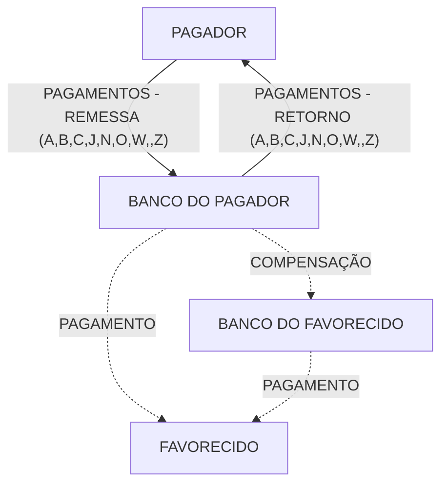
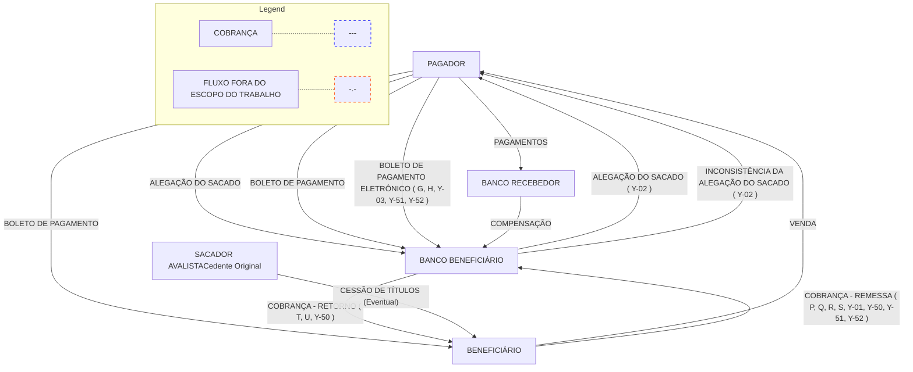
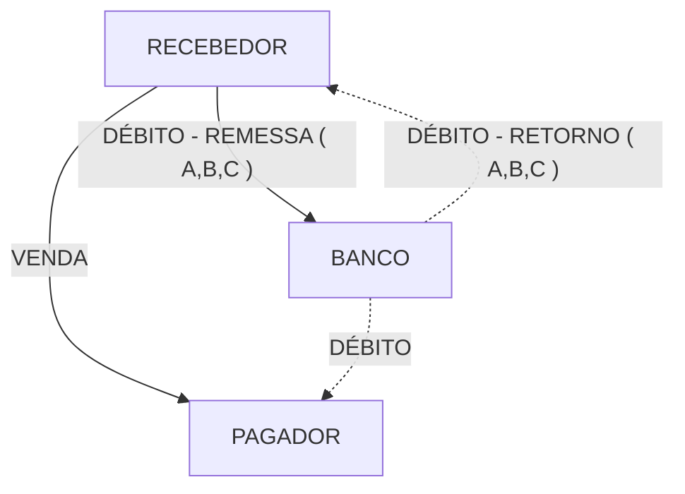
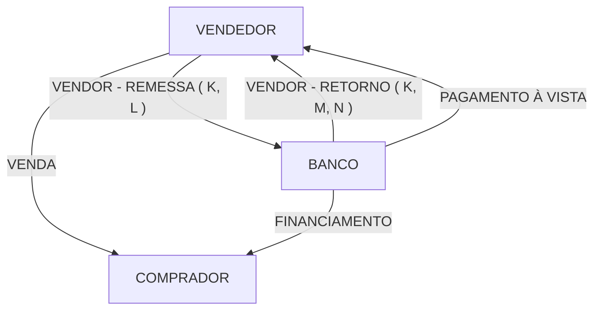
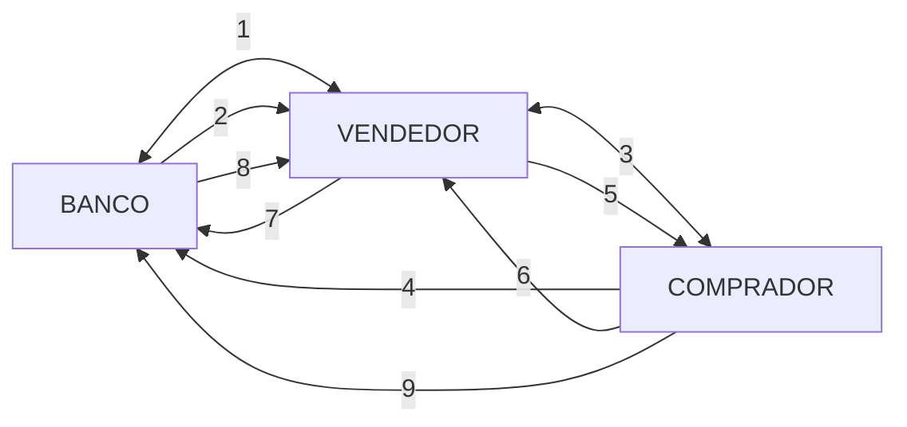
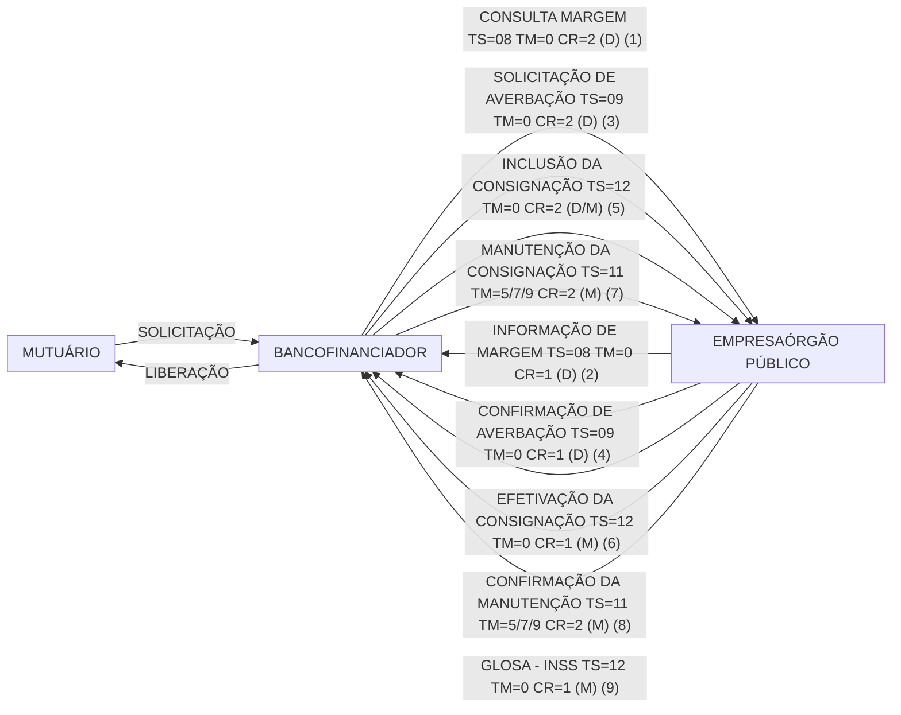

# Intercâmbio de Informações entre Bancos e Empresas

## Padrão FEBRABAN 240 Posições

Versão 10.9

14/10/2021

# Índice

**1.0 Introdução.........................................................................................05**
1.1 Apresentação do Documento......................................................06
1.2 Fluxo Geral de Informações .......................................................10

**2.0 Estrutura do Arquivo .......................................................................12**
2.1 Composição do Arquivo ..............................................................13
2.2 Header e Trailer do Arquivo ........................................................17

**3.0 Serviço / Produto..............................................................................19**
3.1 Pagamentos................................................................................20
3.1.1 Descrição do Processo.....................................................21
3.1.2 Pagamento através de Crédito em Conta, Cheque, OP,
DOC, TED, Pix ou Pagamento com autenticação .......................24
3.1.3 Pagamento de Títulos de Cobrança e QR Code Pix.........29
3.1.4 Pagamento de Tributos......................................................33
3.2 Cobrança ....................................................................................49
3.2.1 Descrição do Processo.....................................................50
3.2.2 Títulos em Cobrança ........................................................54
3.2.3 Boleto de Pagamento Eletrônico (Captura de Títulos
em Cobrança) ..................................................................... 69
3.2.4 Alegação do Pagador ........77
3.3 Extrato de Conta Corrente para Conciliação Bancária ................80
3.3.1 Descrição do Processo.....................................................81
3.3.2 Extrato de Conta Corrente para Conciliação Bancária .....83
3.4 Débito em Conta Corrente ..........................................................86
3.4.1 Descrição do Processo.....................................................87
3.4.2 Débito em Conta Corrente................................................90
3.5 Vendor ........................................................................................95
.5.1 Descrição do Processo.....................................................96
3.5.2 Vendor..............................................................................102
3.6 Custódia de Cheques..................................................................108
3.6.1 Descrição do Processo.....................................................109
3.6.2 Custódia de Cheques .......................................................112
3.7 Extrato para Gestão de Caixa .....................................................115
3.7.1 Descrição do Processo.....................................................116
3.7.2 Extrato para Gestão de Caixa ..........................................118
3.8 Empréstimo com Consignação em Folha de Pagamento............125
3.8.1 Descrição do Processo.....................................................126
3.8.2 Empréstimo por Consignação ..........................................129
3.9 Compror......................................................................................132
3.9.1 Descrição do Processo ......................................................133
3.9.2 Compror/Compror Rotativo ................................................137

# 4.0 Descrição de Campos ......................................................................142

A - Alegação do Pagador ...................................................................143
B - Boleto de Pagamento Eletrônico (Captura de Títulos em Cobrança) ..........................................................................................145
C - Títulos em Cobrança ....................................................................146
D - Débito em Conta Corrente ............................................................161
E - Extrato de Conta Corrente paga Conciliação Bancária .................163
F - Extrato para Gestão de Caixa .......................................................164
G - Campos Genéricos.......................................................................167
H - Empréstimo por Consignação.......................................................185
I - Compor ..........................................................................................189
K - Custódia de Cheques ...................................................................192
L - Pagamento de Títulos em Cobrança .............................................197
N - Pagamento de Tributos e Impostos ..............................................198
P - Pagamento Através de Crédito em Conta, Cheque, OP, DOC, TED ou Pagamento com Autenticação .........................................202
V - Vendor ................................................205
Z – Autenticação do Pagamento ................................................215

## 5.0 Alteração do Manual 216
5.1 Objetivo 217
5.2 Manutenção do Manual 218

# 1.0 - Introdução
# 1.1 - Apresentação do Documento

Este manual apresenta um padrão para a troca de informações entre Empresas e Bancos, definido e elaborado pela FEBRABAN, a ser adotado na prestação de serviços bancários que possibilitem esse intercâmbio. Baseado nas informações necessárias para a implementação de cada tipo de serviço / produto, o padrão define um conjunto de registros/campos que devem compor o arquivo de troca de informações.

O padrão abrange os seguintes tipos de serviços / produtos:

* Pagamento através de crédito em conta, cheque, OP, DOC ou pagamento com autenticação
* Pagamento de títulos de Cobrança
* Pagamento de Tributos
* Títulos em Cobrança
* Boleto de Pagamento Eletrônico
* Alegação do Pagador
* Extrato de Conta Corrente para Conciliação Bancária
* Débito em Conta Corrente
* Vendor
* Custódia de Cheques
* Extrato para Gestão de Caixa
* Empréstimo com Consignação em Folha de Pagamento
* Compror

Cada tipo de serviço / produto tem um objetivo específico e a sua abrangência é detalhada através de um diagrama onde estão representadas as entidades participantes e o fluxo de troca de informações entre elas.

Para cada fluxo de informação são identificados os eventos que podem desencadear a troca de informações entre as entidades.

Todas as informações manipuladas são conceituadas visando um entendimento claro e preciso de todo o processo.

## Estrutura do Documento

O documento está dividido nos seguintes tópicos:

**1.0 - Introdução**
Apresenta uma visão geral dos tipos de serviços / produtos disponíveis e o contexto em que ocorrem, identificando as entidades origem e destino de cada fluxo de troca de informações.

**2.0 - Estrutura do Arquivo**
Define a composição do arquivo (header, lotes de serviço / produto e trailer), conceituando cada tipo de registro existente e especificando a forma de utilização de cada um deles por tipo de serviço / produto, e apresenta o layout do header e do trailer de arquivo.
# 3.0 - Serviço / Produto

Apresenta detalhadamente cada serviço / produto disponível e o contexto em que ocorrem, identificando as entidades origem e destino de cada fluxo de troca de informações.

## 3.1 - Pagamentos

Conceitua o serviço / produto Pagamentos através da definição do objetivo, das entidades envolvidas e do fluxo de troca de informações, e apresenta o layout dos registros/segmentos a serem utilizados na sua implementação. Este tipo de serviço / produto possibilita o pagamento de salários, fornecedores, dividendos, etc., através de crédito em conta, Cheque, OP, DOC, pagamento com autenticação, pagamento de títulos de cobrança ou de tributos.

## 3.2 - Cobrança

Conceitua o serviço / produto Cobrança através da definição do objetivo, das entidades envolvidas e do fluxo de informações, e apresenta o layout dos registros/segmentos a serem utilizados na sua implementação. Este tipo de serviço / produto possibilita a geração de informações dos títulos em cobrança para o Banco Beneficiário (entrada de títulos, pedido de baixa, etc.), a geração de informações do Boleto de Pagamento eletrônico (títulos capturados em carteira) ao Pagador e alegações do Pagador ao Banco Beneficiário.

## 3.3 - Extrato de Conta Corrente para Conciliação Bancária

Conceitua o serviço / produto de Extrato de Conta Corrente para Conciliação Bancária através da definição do objetivo, das entidades envolvidas e do fluxo de informações, e apresenta o layout dos registros/segmentos a serem utilizados na sua implementação. Este tipo de serviço / produto possibilita a geração de extrato de conta corrente para conciliação bancária, considerando exclusivamente os saldos contábeis de conta corrente.

## 3.4 - Débito em Conta Corrente

Conceitua o serviço / produto Débito em Conta Corrente através da definição do objetivo, das entidades envolvidas e do fluxo de informações, e apresenta o layout dos registros/segmentos a serem utilizados na sua implementação. Este tipo de serviço / produto possibilita o pagamento de parcelas, contribuições e outros tipos de compromissos ou encargos, através de débito em conta corrente.

## 3.5 - Vendor

Conceitua o serviço / produto Vendor através da definição do objetivo, das entidades envolvidas e do fluxo de informações, e apresenta o layout dos registros/segmentos a serem utilizados na sua implementação. Este tipo de serviço / produto possibilita financiamentos através do Banco Beneficiário.

## 3.6 - Custódia de Cheques

Conceitua o serviço / produto Custódia de Cheques através da definição do objetivo, das entidades envolvidas e do fluxo de informações, e apresenta o layout dos registros/segmentos a serem utilizados na sua implementação. Este tipo de serviço / produto proporciona aos clientes a guarda dos cheques e a compensação dos mesmos na data determinada (Data para Depósito).

## 3.7 - Extrato para Gestão de Caixa

Conceitua o serviço / produto Extrato para Gestão de Caixa através da definição do objetivo, das entidades envolvidas e do fluxo de informações, e apresenta o layout dos registros/segmentos a serem utilizados na sua implementação. Este tipo de serviço / produto possibilita a geração de extratos para Gestão de Caixa, gerados várias vezes ao dia, com informações sobre Saldos e Lançamentos de diferentes Naturezas.

## 3.8 – Empréstimo por Consignação

Conceitua o serviço / produto Empréstimo por Consignação através da definição de objetivo, das entidades envolvidas e do fluxo de informações, e apresenta o layout dos registros/segmentos a serem utilizados em sua implementação. Este tipo de serviço / produto aos funcionários / beneficiários de empresas e órgãos públicos realizarem empréstimos, através de consignação em folha de pagamento / benefício.

## 3.9 – Compror
Conceitua o serviço / produto Compror através da definição de objetivo, das entidades envolvidas e do fluxo de informações, e apresenta o layout dos registros/segmentos a serem utilizados em sua implementação.

# 4.0 - Descrição dos Campos

Conceitua todos os campos componentes do layout dos registros utilizados em cada um dos tipos de serviço / produto. Para facilitar a compreensão, os campos estão classificados em **genéricos**, campos utilizados em mais que um tipo de serviço / produto, e **específicos**, campos utilizados em um único tipo de serviço / produto e cada descrição é identificada através de um código composto da seguinte forma:

Xnnn onde:
X = Sigla atribuída para cada tipo de serviço / produto.
nnn = Número seqüencial, a partir de 001, dentro de uma sigla

# Siglas atribuídas na descrição dos campos, de acordo com o serviço / produto.

<table>
  <thead>
    <tr>
        <th>Tipo Campo</th>
        <th>Sigla</th>
        <th>Descrição da Sigla</th>
    </tr>
  </thead>
  <tbody>
    <tr>
        <td>Genérico</td>
        <td>G</td>
        <td>Genérico</td>
    </tr>
    <tr>
        <td rowspan="14">Específico</td>
        <td>A</td>
        <td>Alegação do Pagador</td>
    </tr>
    <tr>
        <td>B</td>
        <td>Boleto de Pagamento Eletrônico</td>
    </tr>
    <tr>
        <td>C</td>
        <td>Títulos em Cobrança</td>
    </tr>
    <tr>
        <td>D</td>
        <td>Débito em Conta Corrente</td>
    </tr>
    <tr>
        <td>E</td>
        <td>Extrato de Conta Corrente para Conciliação Bancária</td>
    </tr>
    <tr>
        <td>F</td>
        <td>Extrato para Gestão de Caixa</td>
    </tr>
    <tr>
        <td>H</td>
        <td>Empréstimo por Consignação</td>
    </tr>
    <tr>
        <td>I</td>
        <td>Compror</td>
    </tr>
    <tr>
        <td>L</td>
        <td>Pagamento de Títulos de Cobrança</td>
    </tr>
    <tr>
        <td>N</td>
        <td>Pagamento de Tributos, Impostos e Contas sem Código<br/>de Barras</td>
    </tr>
    <tr>
        <td>P</td>
        <td>Pagamento através de Crédito em Conta, Cheque, OP,<br/>DOC ou Pagamento com Autenticação</td>
    </tr>
    <tr>
        <td>V</td>
        <td>Vendor</td>
    </tr>
    <tr>
        <td>K</td>
        <td>Custódia de Cheques</td>
    </tr>
    <tr>
        <td>Z</td>
        <td>Autenticação do Pagamento</td>
    </tr>
  </tbody>
</table>

Em cada layout de registro apresentado, é especificado o código da descrição de cada campo. Através deste código, deve-se acessar o tópico “Descrição dos Campos” e buscar a descrição do campo que se deseja consultar. As descrições de campos assinaladas com \* antes do código, merecem uma atenção especial.

# 5.0 - Alteração do Manual

O tratamento de um novo tipo de serviço / produto ou a alteração de qualquer uma das especificações constantes neste manual deverá ser previamente aprovada pela FEBRABAN.

# Manutenção das Versões do Manual

A versão é identificada através de um código com a seguinte composição:

**VV.R** onde:
**VV (2 dígitos)** = Número da versão
**R (1 dígito)** = Número do release

**Release**

Será alterado sempre que ocorrer alteração de campos “USO EXCLUSIVO CNAB/FEBRABAN” ou alteração na descrição de campos.

**Versão de layout de lote**

Será alterado quando ocorrer inclusão/exclusão de campos.

**Versão de layout de arquivo**

Será alterado quando ocorrer inclusão/exclusão de serviços / produtos (lotes de serviços / produtos).

# Sugestões

Sugestões para alteração deste manual devem ser encaminhas à FEBRABAN, via Bancos.

# 1.2 - Fluxo Geral de Informações

O fluxo de informações abaixo mostra uma visão geral dos tipos de serviços / produtos disponíveis e das entidades participantes em cada um deles:


# Entidades Participantes

<table>
  <thead>
    <tr>
        <th>Entidade</th>
        <th>Descrição</th>
    </tr>
  </thead>
  <tbody>
    <tr>
        <td>Pagador</td>
        <td>Pessoa Física ou Jurídica que irá efetuar o pagamento de um compromisso financeiro.</td>
    </tr>
    <tr>
        <td>Banco do Pagador</td>
        <td>Banco detentor da conta corrente do Pagador, a qual será debitada para efetivação de um compromisso financeiro</td>
    </tr>
    <tr>
        <td>Beneficiário</td>
        <td>Pessoa Física ou Jurídica que irá receber os créditos de um compromisso financeiro.</td>
    </tr>
    <tr>
        <td>Banco do Beneficiário</td>
        <td>Banco detentor da conta corrente do Beneficiário, a qual será creditada na liquidação de um compromisso financeiro</td>
    </tr>
  </tbody>
</table>

# 2.0 - Estrutura do Arquivo
# 2.1 - Composição do Arquivo

O Arquivo de troca de informações entre Bancos e Empresas é composto de um registro header de arquivo, um ou mais lotes de Serviço / Produto e um registro trailer de arquivo, conforme ilustra a figura abaixo:

```mermaid
graph TD
    subgraph ARQUIVO
        direction LR
        H[Registro Header de Arquivo (Tipo = 0)]
        subgraph LOTES
            direction TB
            LH[Registro Header de Lote (Tipo = 1)]
            RI["Registros Iniciais do Lote (Tipo = 2)(opcional)..."]
            RD["Registros de Detalhe (Tipo = 3)Segmentos......"]
            RF["Registros Finais do Lote (Tipo = 4)(opcional)..."]
            LT[Registro Trailer de Lote (Tipo = 5)]
            LH --> RI --> RD --> RF --> LT
        end
        T[Registro Trailer de Arquivo (Tipo = 9)]
        H --> LOTES --> T
    end
```

Com a estrutura apresentada, um único arquivo pode conter vários lotes de Serviços / Produtos distintos. Este procedimento, que permite com que Empresas e Bancos consolidem em um só arquivo todas as informações que desejam trocar entre si, deve ser previamente acordado entre cada Banco e Empresa Cliente.
# Lote de Serviço / Produto

Um lote de Serviço / Produto típico é composto de um registro header de lote, um ou mais registros detalhe, e um registro trailer de lote. Alguns Serviços / Produtos usam registros adicionais de tipo 2 e 4 contendo informações sobre posições iniciais e finais do lote, como no caso de Extrato para Gestão de Caixa que disponibiliza Saldos iniciais e finais de diferentes Naturezas de uma Conta Corrente.

**Um lote de Serviço / Produto só pode conter um único tipo de Serviço / Produto.**

Os registros header (1) e trailer (5) de lote e os de detalhe (3) são compostos de campos fixos, comuns a todos os tipos de Serviço / Produto, e campos específicos, padrões para cada um dos tipos de Serviço / Produto.

# Registro de Detalhe

Um registro de detalhe é composto de um ou mais segmentos, dependendo do tipo de Serviço / Produto associado ao lote de Serviço / Produto.

Existem vários tipos de segmentos diferentes e cada um deles pode ser utilizado em um ou mais lotes de Serviço / Produto, tanto nos fluxos de <u>**Remessa**</u> (Cliente enviando informações para o Banco) como nos fluxos de <u>**Retorno**</u> (Banco enviando informações para o Cliente), conforme discriminados a seguir:

<table>
  <thead>
    <tr>
        <th rowspan="2">Lote</th>
        <th rowspan="2">Serviço / Produto</th>
        <th colspan="2">Segmentos</th>
    </tr>
    <tr>
        <th>Remessa</th>
        <th>Retorno</th>
    </tr>
  </thead>
  <tbody>
    <tr>
        <td>Pagamento através de Crédito em Conta Corrente, Cheque, OP, DOC, Pagamento com Autenticação ou Pix</td>
        <td>Pagamentos</td>
        <td>A (Obrigatório)<br/>B (Opcional)<br/>C (Opcional)</td>
        <td>A (Obrigatório)<br/>B (Opcional)<br/>C (Opcional)</td>
    </tr>
    <tr>
        <td>Débito em Conta Corrente</td>
        <td>Débito em Conta Corrente</td>
        <td>A (Obrigatório)<br/>B (Opcional)<br/>C (Opcional)</td>
        <td>A (Obrigatório)<br/>B (Opcional)<br/>C (Opcional)</td>
    </tr>
    <tr>
        <td>Extrato de Conta Corrente para Conciliação Bancária</td>
        <td>Extrato de Conta Corrente para Conciliação Bancária</td>
        <td> </td>
        <td>E (Obrigatório)</td>
    </tr>
    <tr>
        <td>Pagamento de Títulos de Cobrança e QRCode Pix</td>
        <td>Pagamentos</td>
        <td>J (Obrigatório)<br/>J-52 (Obrigatório)<br/>J-52 Pix (Obrigatório)</td>
        <td>J (Obrigatório)<br/>J-52 (Obrigatório)<br/>J-52 Pix (Obrigatório)</td>
    </tr>
    <tr>
        <td>Boleto de Pagamento Eletrônico (Captura de Títulos em Cobrança)</td>
        <td>Cobrança</td>
        <td> </td>
        <td>G (Obrigatório)<br/>H (Opcional)<br/>Y (Opcional)</td>
    </tr>
    <tr>
        <td>Títulos em Cobrança</td>
        <td>Cobrança</td>
        <td>P (Obrigatório)<br/>Q (Obrigatório)<br/>R (Opcional)<br/>S (Opcional)<br/>Y (Opcional)</td>
        <td>T (Obrigatório)<br/>U (Obrigatório)<br/>Y (Opcional)</td>
    </tr>
  </tbody>
</table>

<page_footer>
</page_footer>
<table>
  <tbody>
    <tr>
        <td>Alegação do Pagador</td>
        <td>Cobrança</td>
        <td>Y (Obrigatório)</td>
        <td>Y (Obrigatório)</td>
        <td colspan="2"></td>
    </tr>
    <tr>
        <td>Vendor</td>
        <td>Vendor</td>
        <td>K (Obrigatório)<br/>L (Obrigatório)</td>
        <td>K (Obrigatório)<br/>M (Obrigatório)<br/>N (Obrigatório)</td>
        <td colspan="2"></td>
    </tr>
    <tr>
        <td>Custódia de Cheques</td>
        <td>Custódia de Cheques</td>
        <td>D (Obrigatório)</td>
        <td>D (Obrigatório)</td>
        <td colspan="2"></td>
    </tr>
    <tr>
        <td>Extrato para Gestão de Caixa</td>
        <td>Extrato para Gestão de Caixa</td>
        <td> </td>
        <td>F (Obrigatório)<br/>I (Opcional)</td>
        <td colspan="2"></td>
    </tr>
    <tr>
        <td>Empréstimo por Consignação</td>
        <td>Empréstimo por Consignação</td>
        <td>H (Obrigatório)</td>
        <td>H (Obrigatório)</td>
        <td colspan="2"></td>
    </tr>
    <tr>
        <td rowspan="2">Pagamento de Tributos</td>
        <td>Pagamento de Contas e Tributos com Código de Barras</td>
        <td>O (Obrigatório) W<em><br/>(Opcional) Z<br/>(Opcional) B<br/>(Opcional)<br/><br/>\</em>obrigatório para o pagamento de FGTS, convênios 0181 e 0182</td>
        <td>O (Obrigatório) W*<br/>(Opcional) Z<br/>(Opcional) B<br/>(Opcional)</td>
        <td colspan="2"></td>
    </tr>
    <tr>
        <td>Pagamento de Tributos sem Código de Barras</td>
        <td>N (Obrigatório) B<br/>(Opcional)<br/>W (Opcional) Z<br/>(Opcional)</td>
        <td>N (Obrigatório) B<br/>(Opcional)<br/>W (Opcional) Z<br/>(Opcional)</td>
        <td colspan="2"></td>
    </tr>
    <tr>
        <td colspan="3">Consulta de Tributos a Pagar. A utilização desse serviço deverá ser previamente acordada com o banco.</td>
        <td> </td>
        <td> </td>
        <td>N (Obrigatório)</td>
    </tr>
    <tr>
        <td>Compror</td>
        <td>Compror / Compror Rotativo</td>
        <td>A (Obrigatório)<br/>B (Opcional)<br/>C (Opcional)<br/>I (Obrigatório)<br/>Ou<br/>J (Opcional)<br/>I (Obrigatório)</td>
        <td>A (Obrigatório)<br/>B (Opcional)<br/>C (Opcional)<br/>I (Obrigatório)<br/>Ou<br/>J (Opcional)<br/>I (Obrigatório)</td>
        <td colspan="2"></td>
    </tr>
  </tbody>
</table>
# Observações

## Tamanho do Registro

O Tamanho do Registro é de **240** bytes.

## Alinhamento de Campos

* Campos Numéricos (Num) = Sempre à direita e preenchidos com zeros à esquerda.

* Campos Alfanuméricos (Alfa) = Sempre à esquerda e preenchidos com brancos à direita.

# 2.2 - Header e Trailer do Arquivo

## Registro Header de Arquivo

<table>
    <thead>
    <tr>
        <th colspan="2">Campo</th>
        <th colspan="2"></th>
        <th colspan="2">Posição</th>
        <th>Nº</th>
        <th>Nº</th>
        <th>Formato</th>
        <th>Default</th>
        <th>Descrição</th>
    </tr>
    </thead>
    <tr>
        <td></td>
        <td></td>
        <td colspan="2"></td>
        <td>De</td>
        <td>Até</td>
        <td>Dig</td>
        <td>Dec</td>
        <td></td>
        <td></td>
        <td></td>
    </tr>
    <tr>
        <td>01.0</td>
        <td rowspan="3">Controle</td>
        <td>Banco</td>
        <td>Código do Banco na Compensação</td>
        <td>1</td>
        <td>3</td>
        <td>3</td>
        <td>-</td>
        <td>Num</td>
        <td></td>
        <td>G001</td>
    </tr>
    <tr>
        <td>02.0</td>
        <td>Lote</td>
        <td>Lote de Serviço</td>
        <td>4</td>
        <td>7</td>
        <td>4</td>
        <td>-</td>
        <td>Num</td>
        <td>'0000'</td>
        <td>*G002</td>
    </tr>
    <tr>
        <td>03.0</td>
        <td>Registro</td>
        <td>Tipo de Registro</td>
        <td>8</td>
        <td>8</td>
        <td>1</td>
        <td>-</td>
        <td>Num</td>
        <td>'0'</td>
        <td>*G003</td>
    </tr>
    <tr>
        <td>04.0</td>
        <td colspan="2">CNAB</td>
        <td>Uso Exclusivo FEBRABAN / CNAB</td>
        <td>9</td>
        <td>17</td>
        <td>9</td>
        <td>-</td>
        <td>Alfa</td>
        <td>Brancos</td>
        <td>G004</td>
    </tr>
    <tr>
        <td>05.0</td>
        <td rowspan="9">Empresa</td>
        <td>Tipo Inscrição</td>
        <td>Tipo de Inscrição da Empresa</td>
        <td>18</td>
        <td>18</td>
        <td>1</td>
        <td>-</td>
        <td>Num</td>
        <td></td>
        <td>*G005</td>
    </tr>
    <tr>
        <td>06.0</td>
        <td>Número</td>
        <td>Número de Inscrição da Empresa</td>
        <td>19</td>
        <td>32</td>
        <td>14</td>
        <td>-</td>
        <td>Num</td>
        <td></td>
        <td>*G006</td>
    </tr>
    <tr>
        <td>07.0</td>
        <td>Convênio</td>
        <td>Código do Convênio no Banco</td>
        <td>33</td>
        <td>52</td>
        <td>20</td>
        <td>-</td>
        <td>Alfa</td>
        <td></td>
        <td>*G007</td>
    </tr>
    <tr>
        <td>08.0</td>
        <td rowspan="5">Conta Corrente Agência</td>
        <td>Código</td>
        <td>Agência Mantenedora da Conta</td>
        <td>53</td>
        <td>57</td>
        <td>5</td>
        <td>-</td>
        <td>Num</td>
        <td></td>
        <td>*G008</td>
    </tr>
    <tr>
        <td>09.0</td>
        <td>DV</td>
        <td>Dígito Verificador da Agência</td>
        <td>58</td>
        <td>58</td>
        <td>1</td>
        <td>-</td>
        <td>Alfa</td>
        <td></td>
        <td>*G009</td>
    </tr>
    <tr>
        <td>10.0</td>
        <td>Conta Número</td>
        <td>Número da Conta Corrente</td>
        <td>59</td>
        <td>70</td>
        <td>12</td>
        <td>-</td>
        <td>Num</td>
        <td></td>
        <td>*G010</td>
    </tr>
    <tr>
        <td>11.0</td>
        <td>DV</td>
        <td>Dígito Verificador da Conta</td>
        <td>71</td>
        <td>71</td>
        <td>1</td>
        <td>-</td>
        <td>Alfa</td>
        <td></td>
        <td>*G011</td>
    </tr>
    <tr>
        <td>12.0</td>
        <td>DV</td>
        <td>Dígito Verificador da Ag/Conta</td>
        <td>72</td>
        <td>72</td>
        <td>1</td>
        <td>-</td>
        <td>Alfa</td>
        <td></td>
        <td>*G012</td>
    </tr>
    <tr>
        <td>13.0</td>
        <td>Nome</td>
        <td>Nome da Empresa</td>
        <td>73</td>
        <td>102</td>
        <td>30</td>
        <td>-</td>
        <td>Alfa</td>
        <td></td>
        <td>G013</td>
    </tr>
    <tr>
        <td>14.0</td>
        <td colspan="2">Nome do Banco</td>
        <td>Nome do Banco</td>
        <td>103</td>
        <td>132</td>
        <td>30</td>
        <td>-</td>
        <td>Alfa</td>
        <td></td>
        <td>G014</td>
    </tr>
    <tr>
        <td>15.0</td>
        <td colspan="2">CNAB</td>
        <td>Uso Exclusivo FEBRABAN / CNAB</td>
        <td>133</td>
        <td>142</td>
        <td>10</td>
        <td>-</td>
        <td>Alfa</td>
        <td>Brancos</td>
        <td>G004</td>
    </tr>
    <tr>
        <td>16.0</td>
        <td rowspan="6">Arquivo</td>
        <td>Código</td>
        <td>Código Remessa / Retorno</td>
        <td>143</td>
        <td>143</td>
        <td>1</td>
        <td>-</td>
        <td>Num</td>
        <td></td>
        <td>G015</td>
    </tr>
    <tr>
        <td>17.0</td>
        <td>Data de Geração</td>
        <td>Data de Geração do Arquivo</td>
        <td>144</td>
        <td>151</td>
        <td>8</td>
        <td>-</td>
        <td>Num</td>
        <td></td>
        <td>G016</td>
    </tr>
    <tr>
        <td>18.0</td>
        <td>Hora de Geração</td>
        <td>Hora de Geração do Arquivo</td>
        <td>152</td>
        <td>157</td>
        <td>6</td>
        <td>-</td>
        <td>Num</td>
        <td></td>
        <td>G017</td>
    </tr>
    <tr>
        <td>19.0</td>
        <td>Seqüência (NSA)</td>
        <td>Número Seqüencial do Arquivo</td>
        <td>158</td>
        <td>163</td>
        <td>6</td>
        <td>-</td>
        <td>Num</td>
        <td></td>
        <td>*G018</td>
    </tr>
    <tr>
        <td>20.0</td>
        <td>Layout do Arquivo</td>
        <td>N<sup>o</sup> da Versão do Layout do Arquivo</td>
        <td>164</td>
        <td>166</td>
        <td>3</td>
        <td>-</td>
        <td>Num</td>
        <td>'103'</td>
        <td>*G019</td>
    </tr>
    <tr>
        <td>21.0</td>
        <td>Densidade</td>
        <td>Densidade de Gravação do Arquivo</td>
        <td>167</td>
        <td>171</td>
        <td>5</td>
        <td>-</td>
        <td>Num</td>
        <td></td>
        <td>G020</td>
    </tr>
    <tr>
        <td>22.0</td>
        <td colspan="2">Reservado Banco</td>
        <td>Para Uso Reservado do Banco</td>
        <td>172</td>
        <td>191</td>
        <td>20</td>
        <td>-</td>
        <td>Alfa</td>
        <td></td>
        <td>G021</td>
    </tr>
    <tr>
        <td>23.0</td>
        <td colspan="2">Reservado Empresa</td>
        <td>Para Uso Reservado da Empresa</td>
        <td>192</td>
        <td>211</td>
        <td>20</td>
        <td>-</td>
        <td>Alfa</td>
        <td></td>
        <td>G022</td>
    </tr>
    <tr>
        <td>24.0</td>
        <td colspan="2">CNAB</td>
        <td>Uso Exclusivo FEBRABAN / CNAB</td>
        <td>212</td>
        <td>240</td>
        <td>29</td>
        <td>-</td>
        <td>Alfa</td>
        <td>Brancos</td>
        <td>G004</td>
    </tr>
</table>

**Controle** - Banco origem ou destino do arquivo

**Empresa** - Empresa que firmou o convênio de prestação de serviços com o Banco

**Conta Corrente (Empresa)** - Número da conta do corrente do convênio firmado entre Banco e Empresa para a prestação de um tipo de serviço. Quando o arquivo contiver mais que um tipo de serviço diferente, os dados da conta corrente a serem colocados aqui devem ser acordados entre o Banco e a Empresa.
# Registro Trailer de Arquivo

<table>
  <thead>
    <tr>
        <th rowspan="2">Campo</th>
        <th colspan="3"> </th>
        <th colspan="2">Posição</th>
        <th rowspan="2">Nº Dig</th>
        <th rowspan="2">Nº Dec</th>
        <th rowspan="2">Formato</th>
        <th rowspan="2">Default</th>
        <th rowspan="2">Descrição</th>
    </tr>
    <tr>
        <th> </th>
        <th> </th>
        <th>De</th>
        <th colspan="2">Até</th>
    </tr>
  </thead>
  <tbody>
    <tr>
        <td>01.9</td>
        <td> </td>
        <td>Banco</td>
        <td>Código do Banco na Compensação</td>
        <td>1</td>
        <td>3</td>
        <td>3</td>
        <td>-</td>
        <td>Num</td>
        <td> </td>
        <td>G001</td>
    </tr>
    <tr>
        <td>02.9</td>
        <td rowspan="2">Controle</td>
        <td>Lote</td>
        <td>Lote de Serviço</td>
        <td>4</td>
        <td>7</td>
        <td>4</td>
        <td>-</td>
        <td>Num</td>
        <td>'9999'</td>
        <td>\*G002</td>
    </tr>
    <tr>
        <td>03.9</td>
        <td>Registro</td>
        <td>Tipo de Registro</td>
        <td>8</td>
        <td>8</td>
        <td>1</td>
        <td>-</td>
        <td>Num</td>
        <td>'9'</td>
        <td>\*G003</td>
    </tr>
    <tr>
        <td>04.9</td>
        <td>CNAB</td>
        <td> </td>
        <td>Uso Exclusivo FEBRABAN/CNAB</td>
        <td>9</td>
        <td>17</td>
        <td>9</td>
        <td>-</td>
        <td>Alfa</td>
        <td>Brancos</td>
        <td>G004</td>
    </tr>
    <tr>
        <td>05.9</td>
        <td rowspan="3">Totais</td>
        <td>Qtde. de Lotes</td>
        <td>Quantidade de Lotes do Arquivo</td>
        <td>18</td>
        <td>23</td>
        <td>6</td>
        <td>-</td>
        <td>Num</td>
        <td> </td>
        <td>G049</td>
    </tr>
    <tr>
        <td>06.9</td>
        <td>Qtde. de Registros</td>
        <td>Quantidade de Registros do Arquivo</td>
        <td>24</td>
        <td>29</td>
        <td>6</td>
        <td>-</td>
        <td>Num</td>
        <td> </td>
        <td>G056</td>
    </tr>
    <tr>
        <td>07.9</td>
        <td>Qtde. de Contas Concil.</td>
        <td>Qtde de Contas p/ Conc. (Lotes)</td>
        <td>30</td>
        <td>35</td>
        <td>6</td>
        <td>-</td>
        <td>Num</td>
        <td> </td>
        <td>\*G037</td>
    </tr>
    <tr>
        <td>08.9</td>
        <td>CNAB</td>
        <td> </td>
        <td>Uso Exclusivo FEBRABAN/CNAB</td>
        <td>36</td>
        <td>240</td>
        <td>205</td>
        <td>-</td>
        <td>Alfa</td>
        <td>Brancos</td>
        <td>G004</td>
    </tr>
  </tbody>
</table>

**Controle** - Banco origem ou destino do arquivo

**Totais** - Totais de controle para checagem do arquivo

# 3.0 - Serviços / Produtos

# 3.1 - Pagamentos
# 3.1.1 - Descrição do Processo

## Objetivo

O produto Pagamentos tem por objetivo fornecer, aos Clientes (Pagadores) dos Bancos, os meios para racionalizar o processo de Contas a Pagar.

Este processo envolve pagamentos de compromissos que podem ser efetuados através de crédito em conta, cheque administrativo, DOC, TED, ordem de pagamento (OP), pagamento com autenticação, títulos em cobrança, tranaferências via Pix ou pagamentos de QRCode Pix.

## Entidades Participantes

<table>
  <thead>
    <tr>
        <th>Entidade</th>
        <th>Descrição</th>
    </tr>
  </thead>
  <tbody>
    <tr>
        <td>Pagador</td>
        <td>Cliente que entrega os Pagamentos ao Banco para serem efetuados.</td>
    </tr>
    <tr>
        <td>Banco do Pagador</td>
        <td>Banco que detém os Pagamentos a serem efetuados.</td>
    </tr>
    <tr>
        <td>Favorecido</td>
        <td>Pessoa física ou jurídica a que se destina o pagamento.</td>
    </tr>
    <tr>
        <td>Banco do Favorecido</td>
        <td>Banco que detém a conta corrente do Favorecido, a qual é creditada na efetivação do pagamento.</td>
    </tr>
  </tbody>
</table>

## Fluxo de Informações

O Pagador agenda, junto ao Banco Pagador, os Pagamentos a serem efetuados pelo Banco. Caso seja agendado um pagamento bloqueado é necessário enviar uma informação para liberar a execução do pagamento posteriormente e, nos casos em contrário, se foi agendado um pagamento liberado é possível fazer o bloqueio do mesmo. Também é possível o Pagador efetuar alterações em alguns dados dos pagamentos, antes que o mesmo seja efetuado.

O Banco Pagador, na data prevista, efetua o débito na conta corrente do Pagador e executa a instrução para crédito do pagamento ao Favorecido. Este crédito poderá ser efetuado nos seguintes modos:

*   Diretamente ao Favorecido

Através de cheque administrativo ou ordem de pagamento (OP).

*   Ao Banco do Favorecido

Através de crédito em conta, quando o Banco do Pagador é o mesmo Banco do Favorecido, ou através de DOC, TED e títulos em cobrança, via compensação, ou Pix.

# Diagrama



PAGAMENTO — — — FLUXO FORA DO ESCOPO DO TRABALHO

# Eventos

## PAGAMENTOS e PAGAMENTO TÍTULO - REMESSA

<table>
  <thead>
    <tr>
        <th>Evento</th>
        <th colspan="2">Segmentos Envolvidos</th>
    </tr>
    <tr>
        <th> </th>
        <th>Pagamentos</th>
        <th>Título</th>
    </tr>
  </thead>
  <tbody>
    <tr>
        <td><em>Agendamento do Pagamento</em><br/>Registro de Pagamentos a serem realizados.</td>
        <td>A, B, C</td>
        <td>J</td>
    </tr>
    <tr>
        <td><em>Liberação/Bloqueio do Pagamento</em><br/>Liberação ou bloqueio de um Pagamento previamente agendado.</td>
        <td>A</td>
        <td>J</td>
    </tr>
    <tr>
        <td><em>Cancelamento do Pagamento</em><br/>Cancelamento de um Pagamento previamente agendado.</td>
        <td>A</td>
        <td>J</td>
    </tr>
    <tr>
        <td><em>Alteração do Pagamento</em><br/>Comando que o Pagador envia ao Banco Pagador para que o mesmo modifique informações de um Pagamento.</td>
        <td>A</td>
        <td>J</td>
    </tr>
  </tbody>
</table>
# PAGAMENTOS e PAGAMENTO TÍTULO - RETORNO

<table>
  <thead>
    <tr>
        <th rowspan="2">Evento</th>
        <th colspan="2">Segmentos Envolvidos</th>
    </tr>
    <tr>
        <th>Pagamentos</th>
        <th>Título</th>
    </tr>
  </thead>
  <tbody>
    <tr>
        <td><em>Confirmação/Rejeição do Agendamento do Pagamento</em><br/>Resposta (positiva ou negativa) sobre a aceitação do agendamento do pagamento</td>
        <td>A, B, C</td>
        <td>J</td>
    </tr>
    <tr>
        <td><em>Confirmação/Rejeição da Liberação/Bloqueio do Pagamento</em><br/>Resposta (positiva ou negativa) sobre a aceitação do agendamento do pagamento</td>
        <td>A</td>
        <td>J</td>
    </tr>
    <tr>
        <td><em>Confirmação/Rejeição do Cancelamento do Pagamento</em><br/>Resposta (positiva ou negativa) sobre a aceitação do cancelamento do pagamento</td>
        <td>A</td>
        <td>J</td>
    </tr>
    <tr>
        <td><em>Confirmação/Rejeição da Alteração do Pagamento</em><br/>Resposta (positiva ou negativa) sobre a aceitação da alteração do pagamento</td>
        <td>A</td>
        <td>J</td>
    </tr>
    <tr>
        <td><em>Confirmação do Pagamento</em><br/>Aviso de efetivação do pagamento (débito na conta corrente do pagador)</td>
        <td>A,C</td>
        <td>J</td>
    </tr>
    <tr>
        <td><em>Estorno</em><br/>Aviso da rejeição do pagamento por devolução do título ou DOC pelo Banco Recebedor</td>
        <td>A</td>
        <td>J</td>
    </tr>
  </tbody>
</table>

# 3.1.2 - Pagamento Através de Crédito em Conta, Cheque, OP, DOC, TED ou Pagamento com Autenticação

## Registro Header de Lote

<table>
    <thead>
    <tr>
        <th colspan="2">Campo</th>
        <th colspan="2"></th>
        <th colspan="2">Posição</th>
        <th>Nº</th>
        <th>Nº</th>
        <th>Formato</th>
        <th>Default</th>
        <th>Descrição</th>
    </tr>
    </thead>
    <tr>
        <td></td>
        <td></td>
        <td colspan="2"></td>
        <td>De</td>
        <td>Até</td>
        <td>Dig</td>
        <td>Dec</td>
        <td></td>
        <td></td>
        <td></td>
    </tr>
    <tr>
        <td>01.1</td>
        <td rowspan="3">Controle</td>
        <td>Banco</td>
        <td>Código do Banco na Compensação</td>
        <td>1</td>
        <td>3</td>
        <td>3</td>
        <td>-</td>
        <td>Num</td>
        <td></td>
        <td>G001</td>
    </tr>
    <tr>
        <td>02.1</td>
        <td>Lote</td>
        <td>Lote de Serviço</td>
        <td>4</td>
        <td>7</td>
        <td>4</td>
        <td>-</td>
        <td>Num</td>
        <td></td>
        <td>*G002</td>
    </tr>
    <tr>
        <td>03.1</td>
        <td>Registro</td>
        <td>Tipo de Registro</td>
        <td>8</td>
        <td>8</td>
        <td>1</td>
        <td>-</td>
        <td>Num</td>
        <td>‘1’</td>
        <td>*G003</td>
    </tr>
    <tr>
        <td>04.1</td>
        <td rowspan="4">Serviço</td>
        <td>Operação</td>
        <td>Tipo da Operação</td>
        <td>9</td>
        <td>9</td>
        <td>1</td>
        <td>-</td>
        <td>Alfa</td>
        <td>'C'</td>
        <td>*G028</td>
    </tr>
    <tr>
        <td>05.1</td>
        <td>Serviço</td>
        <td>Tipo do Serviço</td>
        <td>10</td>
        <td>11</td>
        <td>2</td>
        <td>-</td>
        <td>Num</td>
        <td></td>
        <td>*G025</td>
    </tr>
    <tr>
        <td>06.1</td>
        <td>Forma Lançamento</td>
        <td>Forma de Lançamento</td>
        <td>12</td>
        <td>13</td>
        <td>2</td>
        <td>-</td>
        <td>Num</td>
        <td></td>
        <td>*G029</td>
    </tr>
    <tr>
        <td>07.1</td>
        <td>Layout do Lote</td>
        <td>Nº da Versão do Layout do Lote</td>
        <td>14</td>
        <td>16</td>
        <td>3</td>
        <td>-</td>
        <td>Num</td>
        <td>'046'</td>
        <td>*G030</td>
    </tr>
    <tr>
        <td>08.1</td>
        <td colspan="2">CNAB</td>
        <td>Uso Exclusivo da FEBRABAN/CNAB</td>
        <td>17</td>
        <td>17</td>
        <td>1</td>
        <td>-</td>
        <td>Alfa</td>
        <td>Brancos</td>
        <td>G004</td>
    </tr>
    <tr>
        <td>09.1</td>
        <td rowspan="9">Empresa</td>
        <td>Tipo Inscrição</td>
        <td>Tipo de Inscrição da Empresa</td>
        <td>18</td>
        <td>18</td>
        <td>1</td>
        <td>-</td>
        <td>Num</td>
        <td></td>
        <td>*G005</td>
    </tr>
    <tr>
        <td>10.1</td>
        <td>Número</td>
        <td>Número de Inscrição da Empresa</td>
        <td>19</td>
        <td>32</td>
        <td>14</td>
        <td>-</td>
        <td>Num</td>
        <td></td>
        <td>*G006</td>
    </tr>
    <tr>
        <td>11.1</td>
        <td>Convênio</td>
        <td>Código do Convênio no Banco</td>
        <td>33</td>
        <td>52</td>
        <td>20</td>
        <td>-</td>
        <td>Alfa</td>
        <td></td>
        <td>*G007</td>
    </tr>
    <tr>
        <td>12.1</td>
        <td rowspan="2">Conta Corrente Agência</td>
        <td>Código</td>
        <td>Agência Mantenedora da Conta</td>
        <td>53</td>
        <td>57</td>
        <td>5</td>
        <td>-</td>
        <td>Num</td>
        <td></td>
        <td>*G008</td>
    </tr>
    <tr>
        <td>13.1</td>
        <td>DV</td>
        <td>Dígito Verificador da Agência</td>
        <td>58</td>
        <td>58</td>
        <td>1</td>
        <td>-</td>
        <td>Alfa</td>
        <td></td>
        <td>*G009</td>
    </tr>
    <tr>
        <td>14.1</td>
        <td>Conta Número</td>
        <td>Número da Conta Corrente</td>
        <td>59</td>
        <td>70</td>
        <td>12</td>
        <td>-</td>
        <td>Num</td>
        <td></td>
        <td>*G010</td>
    </tr>
    <tr>
        <td>15.1</td>
        <td>DV</td>
        <td>Dígito Verificador da Conta</td>
        <td>71</td>
        <td>71</td>
        <td>1</td>
        <td>-</td>
        <td>Alfa</td>
        <td></td>
        <td>*G011</td>
    </tr>
    <tr>
        <td>16.1</td>
        <td>DV</td>
        <td>Dígito Verificador da Ag/Conta</td>
        <td>72</td>
        <td>72</td>
        <td>1</td>
        <td>-</td>
        <td>Alfa</td>
        <td></td>
        <td>*G012</td>
    </tr>
    <tr>
        <td>17.1</td>
        <td>Nome</td>
        <td>Nome da Empresa</td>
        <td>73</td>
        <td>102</td>
        <td>30</td>
        <td>-</td>
        <td>Alfa</td>
        <td></td>
        <td>G013</td>
    </tr>
    <tr>
        <td>18.1</td>
        <td colspan="2">Informação 1</td>
        <td>Mensagem</td>
        <td>103</td>
        <td>142</td>
        <td>40</td>
        <td>-</td>
        <td>Alfa</td>
        <td></td>
        <td>*G031</td>
    </tr>
    <tr>
        <td>19.1</td>
        <td rowspan="7">Endereço
<br/>
da
<br/>
Empresa</td>
        <td>Logradouro</td>
        <td>Nome da Rua, Av, Pça, Etc</td>
        <td>143</td>
        <td>172</td>
        <td>30</td>
        <td>-</td>
        <td>Alfa</td>
        <td></td>
        <td>G032</td>
    </tr>
    <tr>
        <td>20.1</td>
        <td>Número</td>
        <td>Número do Local</td>
        <td>173</td>
        <td>177</td>
        <td>5</td>
        <td>-</td>
        <td>Num</td>
        <td></td>
        <td>G032</td>
    </tr>
    <tr>
        <td>21.1</td>
        <td>Complemento</td>
        <td>Casa, Apto, Sala, Etc</td>
        <td>178</td>
        <td>192</td>
        <td>15</td>
        <td>-</td>
        <td>Alfa</td>
        <td></td>
        <td>G032</td>
    </tr>
    <tr>
        <td>22.1</td>
        <td>Cidade</td>
        <td>Nome da Cidade</td>
        <td>193</td>
        <td>212</td>
        <td>20</td>
        <td>-</td>
        <td>Alfa</td>
        <td></td>
        <td>G033</td>
    </tr>
    <tr>
        <td>23.1</td>
        <td>CEP</td>
        <td>CEP</td>
        <td>213</td>
        <td>217</td>
        <td>5</td>
        <td>-</td>
        <td>Num</td>
        <td></td>
        <td>G034</td>
    </tr>
    <tr>
        <td>24.1</td>
        <td>Complemento CEP</td>
        <td>Complemento do CEP</td>
        <td>218</td>
        <td>220</td>
        <td>3</td>
        <td>-</td>
        <td>Alfa</td>
        <td></td>
        <td>G035</td>
    </tr>
    <tr>
        <td>25.1</td>
        <td>Estado</td>
        <td>Sigla do Estado</td>
        <td>221</td>
        <td>222</td>
        <td>2</td>
        <td>-</td>
        <td>Alfa</td>
        <td></td>
        <td>G036</td>
    </tr>
    <tr>
        <td>26.1</td>
        <td colspan="2">Indicativo de Forma de Pagamento</td>
        <td>Indicativo da Forma de Pagamento do 
Serviço</td>
        <td>223</td>
        <td>224</td>
        <td>2</td>
        <td>-</td>
        <td>Num</td>
        <td></td>
        <td>P014</td>
    </tr>
    <tr>
        <td>27.1</td>
        <td colspan="2">CNAB</td>
        <td>Uso Exclusivo FEBRABAN/CNAB</td>
        <td>225</td>
        <td>230</td>
        <td>6</td>
        <td>-</td>
        <td>Alfa</td>
        <td>Brancos</td>
        <td>G004</td>
    </tr>
    <tr>
        <td>28.1</td>
        <td colspan="2">Ocorrências</td>
        <td>Códigos das Ocorrências p/ Retorno</td>
        <td>231</td>
        <td>240</td>
        <td>10</td>
        <td>-</td>
        <td>Alfa</td>
        <td></td>
        <td>*G059</td>
    </tr>
</table>

**Controle** - Banco origem ou destino do arquivo (Banco Pagador)

**Empresa** - Cliente (Pagador) que firmou o convênio de prestação de serviços com o banco

# Registro Detalhe - Segmento A (Obrigatório - Remessa / Retorno)

<table>
    <thead>
    <tr>
        <th colspan="2">Campo</th>
        <th colspan="2"></th>
        <th colspan="2">Posição</th>
        <th>Nº</th>
        <th>Nº</th>
        <th>Formato</th>
        <th>Default</th>
        <th>Descrição</th>
    </tr>
    </thead>
    <tr>
        <td></td>
        <td></td>
        <td colspan="2"></td>
        <td>De</td>
        <td>Até</td>
        <td>Dig</td>
        <td>Dec</td>
        <td></td>
        <td></td>
        <td></td>
    </tr>
    <tr>
        <td>01.3A</td>
        <td rowspan="3">Controle</td>
        <td>Banco</td>
        <td>Código do Banco na Compensação</td>
        <td>1</td>
        <td>3</td>
        <td>3</td>
        <td>-</td>
        <td>Num</td>
        <td></td>
        <td>G001</td>
    </tr>
    <tr>
        <td>02.3A</td>
        <td>Lote</td>
        <td>Lote de Serviço</td>
        <td>4</td>
        <td>7</td>
        <td>4</td>
        <td>-</td>
        <td>Num</td>
        <td></td>
        <td>*G002</td>
    </tr>
    <tr>
        <td>03.3A</td>
        <td>Registro</td>
        <td>Tipo de Registro</td>
        <td>8</td>
        <td>8</td>
        <td>1</td>
        <td>-</td>
        <td>Num</td>
        <td>'3'</td>
        <td>*G003</td>
    </tr>
    <tr>
        <td>04.3A</td>
        <td rowspan="3">Serviço</td>
        <td>Nº do Registro</td>
        <td>Nº Seqüencial do Registro no Lote</td>
        <td>9</td>
        <td>13</td>
        <td>5</td>
        <td>-</td>
        <td>Num</td>
        <td></td>
        <td>*G038</td>
    </tr>
    <tr>
        <td>05.3A</td>
        <td>Segmento</td>
        <td>Código de Segmento do Reg. Detalhe</td>
        <td>14</td>
        <td>14</td>
        <td>1</td>
        <td>-</td>
        <td>Alfa</td>
        <td>'A'</td>
        <td>*G039</td>
    </tr>
    <tr>
        <td>06.3A</td>
        <td>Movimento Tipo</td>
        <td>Tipo de Movimento</td>
        <td>15</td>
        <td>15</td>
        <td>1</td>
        <td>-</td>
        <td>Num</td>
        <td></td>
        <td>*G060</td>
    </tr>
    <tr>
        <td>07.3A</td>
        <td colspan="2">Código</td>
        <td>Código da Instrução p/ Movimento</td>
        <td>16</td>
        <td>17</td>
        <td>2</td>
        <td>-</td>
        <td>Num</td>
        <td></td>
        <td>G061</td>
    </tr>
    <tr>
        <td>08.3A</td>
        <td rowspan="8">Favorecido</td>
        <td>Câmara</td>
        <td>Código da Câmara Centralizadora</td>
        <td>18</td>
        <td>20</td>
        <td>3</td>
        <td>-</td>
        <td>Num</td>
        <td></td>
        <td>*P001</td>
    </tr>
    <tr>
        <td>09.3A</td>
        <td>Banco</td>
        <td>Código do Banco do Favorecido</td>
        <td>21</td>
        <td>23</td>
        <td>3</td>
        <td>-</td>
        <td>Num</td>
        <td></td>
        <td>P002</td>
    </tr>
    <tr>
        <td>10.3A</td>
        <td rowspan="5">Agência Conta Corrente</td>
        <td>Código</td>
        <td>Ag. Mantenedora da Cta do Favor.</td>
        <td>24</td>
        <td>28</td>
        <td>5</td>
        <td>-</td>
        <td>Num</td>
        <td></td>
        <td>*G008</td>
    </tr>
    <tr>
        <td>11.3A</td>
        <td>DV</td>
        <td>Dígito Verificador da Agência</td>
        <td>29</td>
        <td>29</td>
        <td>1</td>
        <td>-</td>
        <td>Alfa</td>
        <td></td>
        <td>*G009</td>
    </tr>
    <tr>
        <td>12.3A</td>
        <td>Conta Número</td>
        <td>Número da Conta Corrente</td>
        <td>30</td>
        <td>41</td>
        <td>12</td>
        <td>-</td>
        <td>Num</td>
        <td></td>
        <td>*G010</td>
    </tr>
    <tr>
        <td>13.3A</td>
        <td>DV</td>
        <td>Dígito Verificador da Conta</td>
        <td>42</td>
        <td>42</td>
        <td>1</td>
        <td>-</td>
        <td>Alfa</td>
        <td></td>
        <td>*G011</td>
    </tr>
    <tr>
        <td>14.3A</td>
        <td>DV</td>
        <td>Dígito Verificador da AG/Conta</td>
        <td>43</td>
        <td>43</td>
        <td>1</td>
        <td>-</td>
        <td>Alfa</td>
        <td></td>
        <td>*G012</td>
    </tr>
    <tr>
        <td>15.3A</td>
        <td>Nome</td>
        <td>Nome do Favorecido</td>
        <td>44</td>
        <td>73</td>
        <td>30</td>
        <td>-</td>
        <td>Alfa</td>
        <td></td>
        <td>G013</td>
    </tr>
    <tr>
        <td>16.3A</td>
        <td rowspan="8">Cré
<br/>
di
<br/>
to</td>
        <td>Seu Número</td>
        <td>Nº do Docum. Atribuído p/ Empresa</td>
        <td>74</td>
        <td>93</td>
        <td>20</td>
        <td>-</td>
        <td>Alfa</td>
        <td></td>
        <td>G064</td>
    </tr>
    <tr>
        <td>17.3A</td>
        <td>Data Pagamento</td>
        <td>Data do Pagamento</td>
        <td>94</td>
        <td>101</td>
        <td>8</td>
        <td>-</td>
        <td>Num</td>
        <td></td>
        <td>P009</td>
    </tr>
    <tr>
        <td>18.3A</td>
        <td>Moeda Tipo</td>
        <td>Tipo da Moeda</td>
        <td>102</td>
        <td>104</td>
        <td>3</td>
        <td>-</td>
        <td>Alfa</td>
        <td></td>
        <td>*G040</td>
    </tr>
    <tr>
        <td>19.3A</td>
        <td>Quantidade</td>
        <td>Quantidade da Moeda</td>
        <td>105</td>
        <td>119</td>
        <td>10</td>
        <td>5</td>
        <td>Num</td>
        <td></td>
        <td>G041</td>
    </tr>
    <tr>
        <td>20.3A</td>
        <td>Valor Pagamento</td>
        <td>Valor do Pagamento</td>
        <td>120</td>
        <td>134</td>
        <td>13</td>
        <td>2</td>
        <td>Num</td>
        <td></td>
        <td>P010</td>
    </tr>
    <tr>
        <td>21.3A</td>
        <td>Nosso Número</td>
        <td>Nº do Docum. Atribuído pelo Banco</td>
        <td>135</td>
        <td>154</td>
        <td>20</td>
        <td>-</td>
        <td>Alfa</td>
        <td></td>
        <td>*G043</td>
    </tr>
    <tr>
        <td>22.3A</td>
        <td>Data Real</td>
        <td>Data Real da Efetivação Pagto</td>
        <td>155</td>
        <td>162</td>
        <td>8</td>
        <td>-</td>
        <td>Num</td>
        <td></td>
        <td>P003</td>
    </tr>
    <tr>
        <td>23.3A</td>
        <td>Valor Real</td>
        <td>Valor Real da Efetivação do Pagto</td>
        <td>163</td>
        <td>177</td>
        <td>13</td>
        <td>2</td>
        <td>Num</td>
        <td></td>
        <td>P004</td>
    </tr>
    <tr>
        <td>24.3A</td>
        <td colspan="2">Informação 2</td>
        <td>Outras Informações – Vide formatação 
em G031 para identificação de 
Deposito Judicial , Pgto.Salários de 
servidores pelo SIAPE, ou PIX.</td>
        <td>178</td>
        <td>217</td>
        <td>40</td>
        <td>-</td>
        <td>Alfa</td>
        <td></td>
        <td>*G031</td>
    </tr>
    <tr>
        <td>25.3A</td>
        <td colspan="2">Código Finalidade Doc</td>
        <td>Compl. Tipo Serviço</td>
        <td>218</td>
        <td>219</td>
        <td>2</td>
        <td>-</td>
        <td>Alfa</td>
        <td></td>
        <td>*P005</td>
    </tr>
    <tr>
        <td>26.3A</td>
        <td colspan="2">Código Finalidade TED</td>
        <td>Codigo finalidade da TED</td>
        <td>220</td>
        <td>224</td>
        <td>5</td>
        <td>-</td>
        <td>Alfa</td>
        <td></td>
        <td>*P011</td>
    </tr>
    <tr>
        <td>27.3A</td>
        <td colspan="2">Código Finalidade Complementar</td>
        <td>Complemento de finalidade pagto.</td>
        <td>225</td>
        <td>226</td>
        <td>2</td>
        <td>-</td>
        <td>Alfa</td>
        <td></td>
        <td>P013</td>
    </tr>
    <tr>
        <td>28.3A</td>
        <td colspan="2">CNAB</td>
        <td>Uso Exclusivo FEBRABAN/CNAB</td>
        <td>227</td>
        <td>229</td>
        <td>3</td>
        <td>-</td>
        <td>Alfa</td>
        <td>Brancos</td>
        <td>G004</td>
    </tr>
    <tr>
        <td>29.3A</td>
        <td colspan="2">Aviso</td>
        <td>Aviso ao Favorecido</td>
        <td>230</td>
        <td>230</td>
        <td>1</td>
        <td>-</td>
        <td>Num</td>
        <td></td>
        <td>*P006</td>
    </tr>
    <tr>
        <td>29.3A</td>
        <td colspan="2">Ocorrências</td>
        <td>Códigos das Ocorrências p/ Retorno</td>
        <td>231</td>
        <td>240</td>
        <td>10</td>
        <td>-</td>
        <td>Alfa</td>
        <td></td>
        <td>*G059</td>
    </tr>
</table>

**Controle** - Banco origem ou destino do arquivo (Banco Pagador)

**Favorecido** - Beneficiário, recebedor do pagamento

**Crédito** - Dados sobre o pagamento a ser efetuado
# Registro Detalhe - Segmento B (Obrigatório - Remessa / Retorno)

<table>
  <thead>
    <tr>
        <th rowspan="2">Campo</th>
        <th> </th>
        <th> </th>
        <th> </th>
        <th colspan="2">Posição</th>
        <th rowspan="2">Nº Dig</th>
        <th rowspan="2">Nº Dec</th>
        <th rowspan="2">Formato</th>
        <th rowspan="2">Default</th>
        <th rowspan="2">Descrição</th>
    </tr>
    <tr>
        <th> </th>
        <th> </th>
        <th>De</th>
        <th colspan="2">Até</th>
    </tr>
  </thead>
  <tbody>
    <tr>
        <td>01.3B</td>
        <td> </td>
        <td>Banco</td>
        <td>Código do Banco na Compensação</td>
        <td>1</td>
        <td>3</td>
        <td>3</td>
        <td>-</td>
        <td>Num</td>
        <td> </td>
        <td>G001</td>
    </tr>
    <tr>
        <td>02.3B</td>
        <td rowspan="2">Controle</td>
        <td>Lote</td>
        <td>Lote de Serviço</td>
        <td>4</td>
        <td>7</td>
        <td>4</td>
        <td>-</td>
        <td>Num</td>
        <td> </td>
        <td>\*G002</td>
    </tr>
    <tr>
        <td>03.3B</td>
        <td>Registro</td>
        <td>Tipo do Registro</td>
        <td>8</td>
        <td>8</td>
        <td>1</td>
        <td>-</td>
        <td>Num</td>
        <td>'3'</td>
        <td>\*G003</td>
    </tr>
    <tr>
        <td>04.3B</td>
        <td rowspan="2">Serviço</td>
        <td>Nº do Registro</td>
        <td>Nº Seqüencial do Registro no Lote</td>
        <td>9</td>
        <td>13</td>
        <td>5</td>
        <td>-</td>
        <td>Num</td>
        <td> </td>
        <td>\*G038</td>
    </tr>
    <tr>
        <td>05.3B</td>
        <td>Segmento</td>
        <td>Código de Segmento do Reg. Detalhe</td>
        <td>14</td>
        <td>14</td>
        <td>1</td>
        <td>-</td>
        <td>Alfa</td>
        <td>'B'</td>
        <td>\*G039</td>
    </tr>
    <tr>
        <td>06.3B</td>
        <td colspan="2">Identificação do favorecido –</td>
        <td>Forma de Iniciação</td>
        <td>15</td>
        <td>17</td>
        <td>3</td>
        <td>-</td>
        <td>Alfa</td>
        <td> </td>
        <td>G100</td>
    </tr>
    <tr>
        <td>07.3B</td>
        <td rowspan="2">Inscrição</td>
        <td>Tipo</td>
        <td>Tipo de Inscrição do Favorecido</td>
        <td>18</td>
        <td>18</td>
        <td>1</td>
        <td>-</td>
        <td>Num</td>
        <td> </td>
        <td>\*G005</td>
    </tr>
    <tr>
        <td>08.3B</td>
        <td>Número</td>
        <td>Nº de Inscrição do Favorecido</td>
        <td>19</td>
        <td>32</td>
        <td>14</td>
        <td>-</td>
        <td>Num</td>
        <td> </td>
        <td>\*G006</td>
    </tr>
    <tr>
        <td>09.3B</td>
        <td rowspan="3">Dados Complementares</td>
        <td> </td>
        <td>Informação 10</td>
        <td>33</td>
        <td>67</td>
        <td>35</td>
        <td>-</td>
        <td>Alfa</td>
        <td> </td>
        <td>G101</td>
    </tr>
    <tr>
        <td>10.3B</td>
        <td>Informação 11</td>
        <td>68</td>
        <td>127</td>
        <td>60</td>
        <td>-</td>
        <td>Alfa</td>
        <td> </td>
        <td>G101</td>
        <td></td>
    </tr>
    <tr>
        <td>11.3B</td>
        <td>Informão 12</td>
        <td>128</td>
        <td>226</td>
        <td>99</td>
        <td>-</td>
        <td>Alfa</td>
        <td> </td>
        <td>G101</td>
        <td></td>
    </tr>
    <tr>
        <td>12.3B</td>
        <td colspan="2">Código UG Centralizadora</td>
        <td>Uso Exclusivo para o SIAPE</td>
        <td>227</td>
        <td>232</td>
        <td>6</td>
        <td>-</td>
        <td>Num</td>
        <td> </td>
        <td>P012</td>
    </tr>
    <tr>
        <td>13.3B</td>
        <td colspan="2">Identificação do Banco no SPB</td>
        <td>Código ISPB</td>
        <td>233</td>
        <td>240</td>
        <td>8</td>
        <td>-</td>
        <td>Num</td>
        <td> </td>
        <td>P015</td>
    </tr>
  </tbody>
</table>

**Controle** - Banco origem ou destino do arquivo (Banco Pagador)

**Favorecido** - Beneficiário, recebedor do pagamento

**Pagto** - Dados sobre o pagamento a ser efetuado

# Registro Detalhe - Segmento C (Opcional - Remessa / Retorno)

<table>
    <thead>
    <tr>
        <th colspan="2">Campo</th>
        <th colspan="3"></th>
        <th colspan="2">Posição</th>
        <th>Nº</th>
        <th>Nº</th>
        <th>Formato</th>
        <th>Default</th>
        <th>Descrição</th>
    </tr>
    </thead>
    <tr>
        <td></td>
        <td></td>
        <td colspan="3"></td>
        <td>De</td>
        <td>Até</td>
        <td>Dig</td>
        <td>Dec</td>
        <td></td>
        <td></td>
        <td></td>
    </tr>
    <tr>
        <td>01.3C</td>
        <td>Banco</td>
        <td>Código do Banco na Compensação</td>
        <td>1</td>
        <td>3</td>
        <td>3</td>
        <td>-</td>
        <td>Num</td>
        <td></td>
        <td>G001</td>
    </tr>
    <tr>
        <td>02.3C</td>
        <td colspan="2" rowspan="2">Controle</td>
        <td>Lote</td>
        <td>Lote de Serviço</td>
        <td>4</td>
        <td>7</td>
        <td>4</td>
        <td>-</td>
        <td>Num</td>
        <td></td>
        <td>*G002</td>
    </tr>
    <tr>
        <td>03.3C</td>
        <td>Registo</td>
        <td>Tipo de Registro</td>
        <td>8</td>
        <td>8</td>
        <td>1</td>
        <td>-</td>
        <td>Num</td>
        <td>'3'</td>
        <td>*G003</td>
    </tr>
    <tr>
        <td>04.3C</td>
        <td colspan="2" rowspan="2">Serviço</td>
        <td>Nº do Registro</td>
        <td>Nº Seqüencial do Registro no Lote</td>
        <td>9</td>
        <td>13</td>
        <td>5</td>
        <td>-</td>
        <td>Num</td>
        <td></td>
        <td>*G038</td>
    </tr>
    <tr>
        <td>05.3C</td>
        <td>Segmento</td>
        <td>Código de Segmento do Reg. Detalhe</td>
        <td>14</td>
        <td>14</td>
        <td>1</td>
        <td>-</td>
        <td>Alfa</td>
        <td>'C'</td>
        <td>*G039</td>
    </tr>
    <tr>
        <td>06.3C</td>
        <td colspan="3">CNAB</td>
        <td>Uso Exclusivo FEBRABAN/CNAB</td>
        <td>15</td>
        <td>17</td>
        <td>3</td>
        <td>-</td>
        <td>Alfa</td>
        <td>Brancos</td>
        <td>G004</td>
    </tr>
    <tr>
        <td>07.3C</td>
        <td colspan="2">Dados Complementares</td>
        <td>Valor IR Pagamento</td>
        <td>Valor do IR</td>
        <td>18</td>
        <td>32</td>
        <td>13</td>
        <td>2</td>
        <td>Num</td>
        <td></td>
        <td>G050</td>
    </tr>
    <tr>
        <td>08.3C</td>
        <td colspan="3">Valor ISS</td>
        <td>Valor do ISS</td>
        <td>33</td>
        <td>47</td>
        <td>13</td>
        <td>2</td>
        <td>Num</td>
        <td></td>
        <td>G051</td>
    </tr>
    <tr>
        <td>09.3C</td>
        <td>Valor IOF</td>
        <td>Valor do IOF</td>
        <td>48</td>
        <td>62</td>
        <td>13</td>
        <td>2</td>
        <td>Num</td>
        <td></td>
        <td>G052</td>
    </tr>
    <tr>
        <td>10.3C</td>
        <td>Outras Deduções</td>
        <td>Valor Outras Deduções</td>
        <td>63</td>
        <td>77</td>
        <td>13</td>
        <td>2</td>
        <td>Num</td>
        <td></td>
        <td>G053</td>
    </tr>
    <tr>
        <td>11.3C</td>
        <td>Outros Acréscimos</td>
        <td>Valor Outros Acréscimos</td>
        <td>78</td>
        <td>92</td>
        <td>13</td>
        <td>2</td>
        <td>Num</td>
        <td></td>
        <td>G054</td>
    </tr>
    <tr>
        <td>12.3C</td>
        <td colspan="2" rowspan="5">Substituta</td>
        <td>Agência</td>
        <td>Agência do Favorecido</td>
        <td>93</td>
        <td>97</td>
        <td>5</td>
        <td>-</td>
        <td>Num</td>
        <td></td>
        <td>*G008</td>
    </tr>
    <tr>
        <td>13.3C</td>
        <td>DV Agência</td>
        <td>Dígito Verificador da Agência</td>
        <td>98</td>
        <td>98</td>
        <td>1</td>
        <td>-</td>
        <td>Alfa</td>
        <td></td>
        <td>*G009</td>
    </tr>
    <tr>
        <td>14.3C</td>
        <td>Número C/C</td>
        <td>Número Conta Corrente</td>
        <td>99</td>
        <td>110</td>
        <td>12</td>
        <td>-</td>
        <td>Num</td>
        <td></td>
        <td>*G010</td>
    </tr>
    <tr>
        <td>15.3C</td>
        <td>DV Conta</td>
        <td>Dígito Verificador da Conta</td>
        <td>111</td>
        <td>111</td>
        <td>1</td>
        <td>-</td>
        <td>Alfa</td>
        <td></td>
        <td>*G011</td>
    </tr>
    <tr>
        <td>16.3C</td>
        <td>DV Agência/Conta</td>
        <td>Dígito Verificador Agência/Conta</td>
        <td>112</td>
        <td>112</td>
        <td>1</td>
        <td>-</td>
        <td>Alfa</td>
        <td></td>
        <td>*G012</td>
    </tr>
    <tr>
        <td>17.3C</td>
        <td colspan="3">Valor INSS</td>
        <td>Valor do INSS</td>
        <td>113</td>
        <td>127</td>
        <td>13</td>
        <td>2</td>
        <td>Num</td>
        <td></td>
        <td>G055</td>
    </tr>
    <tr>
        <td>18.3C</td>
        <td colspan="3">Número Conta Pagamento 
Creditada</td>
        <td>Número Conta Pagamento Creditada</td>
        <td>128</td>
        <td>147</td>
        <td>20</td>
        <td></td>
        <td>Num</td>
        <td></td>
        <td>P016</td>
    </tr>
    <tr>
        <td>19.3C</td>
        <td colspan="3">CNAB</td>
        <td>Uso Exclusivo FEBRABAN/CNAB</td>
        <td>148</td>
        <td>240</td>
        <td>93</td>
        <td>-</td>
        <td>Alfa</td>
        <td>Brancos</td>
        <td>G004</td>
    </tr>
</table>

**Controle** - Banco origem ou destino do arquivo (Banco Pagador)

**Substituta** - Dados sobre a agência/conta corrente utilizada no pagamento, em substituição à agência/conta corrente original. Esta substituição ocorre por fusão ou fechamento da agência originalmente designada para o pagamento.

# Registro Trailer de Lote

<table>
  <thead>
    <tr>
        <th colspan="3">Campo</th>
        <th> </th>
        <th colspan="2">Posição</th>
        <th>Nº</th>
        <th>Nº</th>
        <th>Formato</th>
        <th>Default</th>
        <th>Descrição</th>
    </tr>
    <tr>
        <th> </th>
        <th> </th>
        <th> </th>
        <th> </th>
        <th>De</th>
        <th>Até</th>
        <th>Dig</th>
        <th>Dec</th>
        <th> </th>
        <th> </th>
        <th></th>
    </tr>
  </thead>
  <tbody>
    <tr>
        <td>01.5</td>
        <td> </td>
        <td>Banco</td>
        <td>Código do Banco na Compensação</td>
        <td>1</td>
        <td>3</td>
        <td>3</td>
        <td>-</td>
        <td>Num</td>
        <td> </td>
        <td>G001</td>
    </tr>
    <tr>
        <td>02.5</td>
        <td>Controle</td>
        <td>Lote</td>
        <td>Lote de Serviço</td>
        <td>4</td>
        <td>7</td>
        <td>4</td>
        <td>-</td>
        <td>Num</td>
        <td> </td>
        <td>\*G002</td>
    </tr>
    <tr>
        <td>03.5</td>
        <td> </td>
        <td>Registro</td>
        <td>Tipo de Registro</td>
        <td>8</td>
        <td>8</td>
        <td>1</td>
        <td>-</td>
        <td>Num</td>
        <td>'5'</td>
        <td>\*G003</td>
    </tr>
    <tr>
        <td>04.5</td>
        <td>CNAB</td>
        <td> </td>
        <td>Uso Exclusivo FEBRABAN/CNAB</td>
        <td>9</td>
        <td>17</td>
        <td>9</td>
        <td>-</td>
        <td>Alfa</td>
        <td>Brancos</td>
        <td>G004</td>
    </tr>
    <tr>
        <td>05.5</td>
        <td rowspan="3">Totais</td>
        <td>Qtde de Registros</td>
        <td>Quantidade de Registros do Lote</td>
        <td>18</td>
        <td>23</td>
        <td>6</td>
        <td>-</td>
        <td>Num</td>
        <td> </td>
        <td>\*G057</td>
    </tr>
    <tr>
        <td>06.5</td>
        <td>Valor</td>
        <td>Somatória dos Valores</td>
        <td>24</td>
        <td>41</td>
        <td>16</td>
        <td>2</td>
        <td>Num</td>
        <td> </td>
        <td>P007</td>
    </tr>
    <tr>
        <td>07.5</td>
        <td>Qtde de Moeda</td>
        <td>Somatória de Quantidade de Moedas</td>
        <td>42</td>
        <td>59</td>
        <td>13</td>
        <td>5</td>
        <td>Num</td>
        <td> </td>
        <td>G058</td>
    </tr>
    <tr>
        <td>08.5</td>
        <td>Número Aviso Débito</td>
        <td> </td>
        <td>Número Aviso de Débito</td>
        <td>60</td>
        <td>65</td>
        <td>6</td>
        <td>-</td>
        <td>Num</td>
        <td> </td>
        <td>G066</td>
    </tr>
    <tr>
        <td>09.5</td>
        <td>CNAB</td>
        <td> </td>
        <td>Uso Exclusivo FEBRABAN/CNAB</td>
        <td>66</td>
        <td>230</td>
        <td>165</td>
        <td>-</td>
        <td>Alfa</td>
        <td>Brancos</td>
        <td>G004</td>
    </tr>
    <tr>
        <td>10.5</td>
        <td>Ocorrências</td>
        <td> </td>
        <td>Códigos das Ocorrências para Retorno</td>
        <td>231</td>
        <td>240</td>
        <td>10</td>
        <td>-</td>
        <td>Alfa</td>
        <td> </td>
        <td>\*G059</td>
    </tr>
  </tbody>
</table>

**Controle** - Banco origem ou destino do arquivo (Banco Pagador)

**Totais** - Totais de controle para checagem do lote

# 3.1.3 - Pagamento de Títulos de Cobrança

## Registro Header de Lote

<table>
    <thead>
    <tr>
        <th colspan="2">Campo</th>
        <th colspan="2"></th>
        <th colspan="2">Posição</th>
        <th>Nº</th>
        <th>Nº</th>
        <th>Formato</th>
        <th>Default</th>
        <th>Descrição</th>
    </tr>
    </thead>
    <tr>
        <td></td>
        <td></td>
        <td colspan="2"></td>
        <td>De</td>
        <td>Até</td>
        <td>Dig</td>
        <td>Dec</td>
        <td></td>
        <td></td>
        <td></td>
    </tr>
    <tr>
        <td>01.1</td>
        <td rowspan="3">Controle</td>
        <td>Banco</td>
        <td>Código do Banco na Compensação</td>
        <td>1</td>
        <td>3</td>
        <td>3</td>
        <td>-</td>
        <td>Num</td>
        <td></td>
        <td>G001</td>
    </tr>
    <tr>
        <td>02.1</td>
        <td>Lote</td>
        <td>Lote de Serviço</td>
        <td>4</td>
        <td>7</td>
        <td>4</td>
        <td>-</td>
        <td>Num</td>
        <td></td>
        <td>*G002</td>
    </tr>
    <tr>
        <td>03.1</td>
        <td>Registro</td>
        <td>Tipo de Registro</td>
        <td>8</td>
        <td>8</td>
        <td>1</td>
        <td>-</td>
        <td>Num</td>
        <td>‘1’</td>
        <td>*G003</td>
    </tr>
    <tr>
        <td>04.1</td>
        <td rowspan="4">Serviço</td>
        <td>Operação</td>
        <td>Tipo da Operação</td>
        <td>9</td>
        <td>9</td>
        <td>1</td>
        <td>-</td>
        <td>Alfa</td>
        <td>'C'</td>
        <td>*G028</td>
    </tr>
    <tr>
        <td>05.1</td>
        <td>Serviço</td>
        <td>Tipo do Serviço</td>
        <td>10</td>
        <td>11</td>
        <td>2</td>
        <td>-</td>
        <td>Num</td>
        <td></td>
        <td>*G025</td>
    </tr>
    <tr>
        <td>06.1</td>
        <td>Forma Lançamento</td>
        <td>Forma de Lançamento</td>
        <td>12</td>
        <td>13</td>
        <td>2</td>
        <td>-</td>
        <td>Num</td>
        <td></td>
        <td>*G029</td>
    </tr>
    <tr>
        <td>07.1</td>
        <td>Layout do Lote</td>
        <td>Nº da Versão do Layout do Lote</td>
        <td>14</td>
        <td>16</td>
        <td>3</td>
        <td>-</td>
        <td>Num</td>
        <td>'040'</td>
        <td>*G030</td>
    </tr>
    <tr>
        <td>08.1</td>
        <td colspan="2">CNAB</td>
        <td>Uso Exclusivo da FEBRABAN/CNAB</td>
        <td>17</td>
        <td>17</td>
        <td>1</td>
        <td>-</td>
        <td>Alfa</td>
        <td>Brancos</td>
        <td>G004</td>
    </tr>
    <tr>
        <td>09.1</td>
        <td rowspan="9">Empresa</td>
        <td>Tipo Inscrição
</td>
        <td>Tipo de Inscrição da Empresa</td>
        <td>18</td>
        <td>18</td>
        <td>1</td>
        <td>-</td>
        <td>Num</td>
        <td></td>
        <td>*G005</td>
    </tr>
    <tr>
        <td>10.1</td>
        <td>Número</td>
        <td>Número de Inscrição da Empresa</td>
        <td>19</td>
        <td>32</td>
        <td>14</td>
        <td>-</td>
        <td>Num</td>
        <td></td>
        <td>*G006</td>
    </tr>
    <tr>
        <td>11.1</td>
        <td>Convênio</td>
        <td>Código do Convênio no Banco</td>
        <td>33</td>
        <td>52</td>
        <td>20</td>
        <td>-</td>
        <td>Alfa</td>
        <td></td>
        <td>*G007</td>
    </tr>
    <tr>
        <td>12.1</td>
        <td rowspan="2">Conta Agência Corrente</td>
        <td>Código</td>
        <td>Agência Mantenedora da Conta</td>
        <td>53</td>
        <td>57</td>
        <td>5</td>
        <td>-</td>
        <td>Num</td>
        <td></td>
        <td>*G008</td>
    </tr>
    <tr>
        <td>13.1</td>
        <td>DV</td>
        <td>Dígito Verificador da Agência</td>
        <td>58</td>
        <td>58</td>
        <td>1</td>
        <td>-</td>
        <td>Alfa</td>
        <td></td>
        <td>*G009</td>
    </tr>
    <tr>
        <td>14.1</td>
        <td>Conta Número</td>
        <td>Número da Conta Corrente</td>
        <td>59</td>
        <td>70</td>
        <td>12</td>
        <td>-</td>
        <td>Num</td>
        <td></td>
        <td>*G010</td>
    </tr>
    <tr>
        <td>15.1</td>
        <td>DV</td>
        <td>Dígito Verificador da Conta</td>
        <td>71</td>
        <td>71</td>
        <td>1</td>
        <td>-</td>
        <td>Alfa</td>
        <td></td>
        <td>*G011</td>
    </tr>
    <tr>
        <td>16.1</td>
        <td>DV</td>
        <td>Dígito Verificador da Ag/Conta</td>
        <td>72</td>
        <td>72</td>
        <td>1</td>
        <td>-</td>
        <td>Alfa</td>
        <td></td>
        <td>*G012</td>
    </tr>
    <tr>
        <td>17.1</td>
        <td>Nome</td>
        <td>Nome da Empresa</td>
        <td>73</td>
        <td>102</td>
        <td>30</td>
        <td>-</td>
        <td>Alfa</td>
        <td></td>
        <td>G013</td>
    </tr>
    <tr>
        <td>18.1</td>
        <td colspan="2">Informação 1</td>
        <td>Mensagem</td>
        <td>103</td>
        <td>142</td>
        <td>40</td>
        <td>-</td>
        <td>Alfa</td>
        <td></td>
        <td>*G031</td>
    </tr>
    <tr>
        <td>19.1</td>
        <td rowspan="7">Endereço
<br/>
da
<br/>
Empresa</td>
        <td>Logradouro</td>
        <td>Nome da Rua, Av, Pça, Etc</td>
        <td>143</td>
        <td>172</td>
        <td>30</td>
        <td>-</td>
        <td>Alfa</td>
        <td></td>
        <td>G032</td>
    </tr>
    <tr>
        <td>20.1</td>
        <td>Número</td>
        <td>Número do Local</td>
        <td>173</td>
        <td>177</td>
        <td>5</td>
        <td>-</td>
        <td>Num</td>
        <td></td>
        <td>G032</td>
    </tr>
    <tr>
        <td>21.1</td>
        <td>Complemento</td>
        <td>Casa, Apto, Sala, Etc</td>
        <td>178</td>
        <td>192</td>
        <td>15</td>
        <td>-</td>
        <td>Alfa</td>
        <td></td>
        <td>G032</td>
    </tr>
    <tr>
        <td>22.1</td>
        <td>Cidade</td>
        <td>Cidade</td>
        <td>193</td>
        <td>212</td>
        <td>20</td>
        <td>-</td>
        <td>Alfa</td>
        <td></td>
        <td>G033</td>
    </tr>
    <tr>
        <td>23.1</td>
        <td>CEP</td>
        <td>CEP</td>
        <td>213</td>
        <td>217</td>
        <td>5</td>
        <td>-</td>
        <td>Num</td>
        <td></td>
        <td>G034</td>
    </tr>
    <tr>
        <td>24.1</td>
        <td>Complemento CEP</td>
        <td>Complemento do CEP</td>
        <td>218</td>
        <td>220</td>
        <td>3</td>
        <td>-</td>
        <td>Alfa</td>
        <td></td>
        <td>G035</td>
    </tr>
    <tr>
        <td>25.1</td>
        <td>Estado</td>
        <td>Sigla do Estado</td>
        <td>221</td>
        <td>222</td>
        <td>2</td>
        <td>-</td>
        <td>Alfa</td>
        <td></td>
        <td>G036</td>
    </tr>
    <tr>
        <td>26.1</td>
        <td colspan="2">CNAB</td>
        <td>Uso Exclusivo da FEBRABAN/CNAB</td>
        <td>223</td>
        <td>230</td>
        <td>8</td>
        <td>-</td>
        <td>Alfa</td>
        <td>Brancos</td>
        <td>G004</td>
    </tr>
    <tr>
        <td>27.1</td>
        <td colspan="2">Ocorrências</td>
        <td>Código das Ocorrências p/ Retorno</td>
        <td>231</td>
        <td>240</td>
        <td>10</td>
        <td>-</td>
        <td>Alfa</td>
        <td></td>
        <td>*G059</td>
    </tr>
</table>

**Controle** - Banco origem ou destino do arquivo (Banco Pagador)

**Empresa** - Cliente (Pagador) que firmou o convênio de prestação de serviços com o banco
# Registro Detalhe - Segmento J (Obrigatório - Remessa / Retorno)

<table>
    <thead>
    <tr>
        <th colspan="2">Campo</th>
        <th colspan="2"></th>
        <th colspan="2">Posição</th>
        <th>Nº</th>
        <th>Nº</th>
        <th>Formato</th>
        <th>Default</th>
        <th>Descrição</th>
    </tr>
    </thead>
    <tr>
        <td></td>
        <td></td>
        <td colspan="2"></td>
        <td>De</td>
        <td>Até</td>
        <td>Dig</td>
        <td>Dec</td>
        <td></td>
        <td></td>
        <td></td>
    </tr>
    <tr>
        <td>01.3J</td>
        <td rowspan="3">Controle</td>
        <td>Banco</td>
        <td>Código no Banco da Compensação</td>
        <td>1</td>
        <td>3</td>
        <td>3</td>
        <td>-</td>
        <td>Num</td>
        <td></td>
        <td>G001</td>
    </tr>
    <tr>
        <td>02.3J</td>
        <td>Lote</td>
        <td>Lote de Serviço</td>
        <td>4</td>
        <td>7</td>
        <td>4</td>
        <td>-</td>
        <td>Num</td>
        <td></td>
        <td>*G002</td>
    </tr>
    <tr>
        <td>03.3J</td>
        <td>Registro</td>
        <td>Tipo de Registro</td>
        <td>8</td>
        <td>8</td>
        <td>1</td>
        <td>-</td>
        <td>Num</td>
        <td>'3'</td>
        <td>*G003</td>
    </tr>
    <tr>
        <td>04.3J</td>
        <td rowspan="3">Serviço</td>
        <td>Nº do Registro</td>
        <td>Nº Seqüencial do Registro no Lote</td>
        <td>9</td>
        <td>13</td>
        <td>5</td>
        <td>-</td>
        <td>Num</td>
        <td></td>
        <td>*G038</td>
    </tr>
    <tr>
        <td>05.3J</td>
        <td>Segmento</td>
        <td>Código de Segmento no Reg. Detalhe</td>
        <td>14</td>
        <td>14</td>
        <td>1</td>
        <td>-</td>
        <td>Alfa</td>
        <td>'J'</td>
        <td>*G039</td>
    </tr>
    <tr>
        <td>06.3J</td>
        <td>Tipo Movimento
</td>
        <td>Tipo de Movimento</td>
        <td>15</td>
        <td>15</td>
        <td>1</td>
        <td>-</td>
        <td>Num</td>
        <td></td>
        <td>*G060</td>
    </tr>
    <tr>
        <td>07.3J</td>
        <td colspan="2">Código</td>
        <td>Código da Instrução p/ Movimento</td>
        <td>16</td>
        <td>17</td>
        <td>2</td>
        <td>-</td>
        <td>Num</td>
        <td></td>
        <td>G061</td>
    </tr>
    <tr>
        <td>08.3J</td>
        <td rowspan="10">Pagamento</td>
        <td>Código Barras</td>
        <td>Código de Barras</td>
        <td>18</td>
        <td>61</td>
        <td>44</td>
        <td>-</td>
        <td>Num</td>
        <td></td>
        <td>*G063</td>
    </tr>
    <tr>
        <td>09.3J</td>
        <td>Nome do Beneficiário</td>
        <td>Nome do Beneficiário</td>
        <td>62</td>
        <td>91</td>
        <td>30</td>
        <td>-</td>
        <td>Alfa</td>
        <td></td>
        <td>G013</td>
    </tr>
    <tr>
        <td>10.3J</td>
        <td>Data Vencimento</td>
        <td>Data do Vencimento (Nominal)</td>
        <td>92</td>
        <td>99</td>
        <td>8</td>
        <td>-</td>
        <td>Num</td>
        <td></td>
        <td>G044</td>
    </tr>
    <tr>
        <td>11.3J</td>
        <td>Valor do Título</td>
        <td>Valor do Título (Nominal)</td>
        <td>100</td>
        <td>114</td>
        <td>13</td>
        <td>2</td>
        <td>Num</td>
        <td></td>
        <td>G042</td>
    </tr>
    <tr>
        <td>12.3J</td>
        <td>Desconto</td>
        <td>Valor do Desconto + Abatimento</td>
        <td>115</td>
        <td>129</td>
        <td>13</td>
        <td>2</td>
        <td>Num</td>
        <td></td>
        <td>L002</td>
    </tr>
    <tr>
        <td>13.3J</td>
        <td>Acréscimos</td>
        <td>Valor da Mora + Multa</td>
        <td>130</td>
        <td>144</td>
        <td>13</td>
        <td>2</td>
        <td>Num</td>
        <td></td>
        <td>L003</td>
    </tr>
    <tr>
        <td>14.3J</td>
        <td>Data Pagamento</td>
        <td>Data do Pagamento</td>
        <td>145</td>
        <td>152</td>
        <td>8</td>
        <td>-</td>
        <td>Num</td>
        <td></td>
        <td>P009</td>
    </tr>
    <tr>
        <td>15.3J</td>
        <td>Valor Pagamento</td>
        <td>Valor do Pagamento</td>
        <td>153</td>
        <td>167</td>
        <td>13</td>
        <td>2</td>
        <td>Num</td>
        <td></td>
        <td>P010</td>
    </tr>
    <tr>
        <td>16.3J</td>
        <td>Quantidade da Moeda</td>
        <td>Quantidade da Moeda</td>
        <td>168</td>
        <td>182</td>
        <td>10</td>
        <td>5</td>
        <td>Num</td>
        <td></td>
        <td>G041</td>
    </tr>
    <tr>
        <td>17.3J</td>
        <td>Referência Pagador</td>
        <td>Nº do Docto Atribuído pela Empresa</td>
        <td>183</td>
        <td>202</td>
        <td>20</td>
        <td>-</td>
        <td>Alfa</td>
        <td></td>
        <td>G064</td>
    </tr>
    <tr>
        <td>18.3J</td>
        <td colspan="2">Nosso Número</td>
        <td>Nº do Docto Atribuído pelo Banco</td>
        <td>203</td>
        <td>222</td>
        <td>20</td>
        <td>-</td>
        <td>Alfa</td>
        <td></td>
        <td>*G043</td>
    </tr>
    <tr>
        <td>19.3J</td>
        <td colspan="2">Código de Moeda</td>
        <td>Código de Moeda</td>
        <td>223</td>
        <td>224</td>
        <td>2</td>
        <td>-</td>
        <td>Num</td>
        <td></td>
        <td>*G065</td>
    </tr>
    <tr>
        <td>20.3J</td>
        <td colspan="2">CNAB</td>
        <td>Uso Exclusivo FEBRABAN/CNAB</td>
        <td>225</td>
        <td>230</td>
        <td>6</td>
        <td>-</td>
        <td>Alfa</td>
        <td>Brancos</td>
        <td>G004</td>
    </tr>
    <tr>
        <td>21.3J</td>
        <td colspan="2">Ocorrências</td>
        <td>Códigos das Ocorrências p/ Retorno</td>
        <td>231</td>
        <td>240</td>
        <td>10</td>
        <td>-</td>
        <td>Alfa</td>
        <td></td>
        <td>*G059</td>
    </tr>
</table>

**Controle** - Banco origem ou destino do arquivo (Banco Pagador)

**Pagamento** - Dados sobre o pagamento a ser efetuado

# Registro Detalhe - Segmento J-52 (Obrigatório – Remessa / Retorno)

<table>
    <thead>
    <tr>
        <th colspan="2">Campo</th>
        <th></th>
        <th colspan="2">Posição</th>
        <th>Nº</th>
        <th>Nº</th>
        <th>Formato</th>
        <th>Default</th>
        <th>Descrição</th>
    </tr>
    </thead>
    <tr>
        <td></td>
        <td></td>
        <td></td>
        <td>De</td>
        <td>Até</td>
        <td>Dig</td>
        <td>Dec</td>
        <td></td>
        <td></td>
        <td></td>
    </tr>
    <tr>
        <td>01.4.J52</td>
        <td colspan="2" rowspan="3">Controle</td>
        <td colspan="2">Banco</td>
        <td>Código do Banco na Compensação</td>
        <td>1</td>
        <td>3</td>
        <td>3</td>
        <td>-</td>
        <td>Num</td>
        <td></td>
        <td>G001</td>
    </tr>
    <tr>
        <td>02.4.J52</td>
        <td colspan="2">Lote</td>
        <td>Lote de Serviço</td>
        <td>4</td>
        <td>7</td>
        <td>4</td>
        <td>-</td>
        <td>Num</td>
        <td></td>
        <td>*G002</td>
    </tr>
    <tr>
        <td>03.4.J52</td>
        <td colspan="2">Registro</td>
        <td>Tipo de Registro</td>
        <td>8</td>
        <td>8</td>
        <td>1</td>
        <td>-</td>
        <td>Num</td>
        <td>‘3’</td>
        <td>*G003</td>
    </tr>
    <tr>
        <td>04.4.J52</td>
        <td colspan="2" rowspan="4">Serviço</td>
        <td colspan="2">Nº do Registro</td>
        <td>Nº Sequencial do Registro no Lote</td>
        <td>9</td>
        <td>13</td>
        <td>5</td>
        <td>-</td>
        <td>Num</td>
        <td></td>
        <td>*G038</td>
    </tr>
    <tr>
        <td>05.4.J52</td>
        <td colspan="2">Segmento</td>
        <td>Cód. Segmento do Registro Detalhe</td>
        <td>14</td>
        <td>14</td>
        <td>1</td>
        <td>-</td>
        <td>Alfa</td>
        <td>‘J’</td>
        <td>*G039</td>
    </tr>
    <tr>
        <td>06.4.J52</td>
        <td colspan="2">CNAB</td>
        <td>Uso Exclusivo FEBRABAN/CNAB</td>
        <td>15</td>
        <td>15</td>
        <td>1</td>
        <td>-</td>
        <td>Alfa</td>
        <td>Brancos</td>
        <td>G004</td>
    </tr>
    <tr>
        <td>07.4.J52</td>
        <td colspan="2">Cód. Mov.</td>
        <td>Código de Movimento Remessa</td>
        <td>16</td>
        <td>17</td>
        <td>2</td>
        <td>-</td>
        <td>Num</td>
        <td></td>
        <td>*C004</td>
    </tr>
    <tr>
        <td>08.4.J52</td>
        <td colspan="4">Código Reg. Opcional</td>
        <td>Identificação Registro Opcional</td>
        <td>18</td>
        <td>19</td>
        <td>2</td>
        <td>-</td>
        <td>Num</td>
        <td>“52”</td>
        <td>G067</td>
    </tr>
    <tr>
        <td>09.4.J52</td>
        <td colspan="2" rowspan="3">Dados 
do 
Pagador</td>
        <td rowspan="2">Inscrição</td>
        <td>Tipo</td>
        <td>Tipo de Inscrição</td>
        <td>20</td>
        <td>20</td>
        <td>1</td>
        <td>-</td>
        <td>Num</td>
        <td></td>
        <td>*G005</td>
    </tr>
    <tr>
        <td>10.4.J52</td>
        <td>Número</td>
        <td>Número de Inscrição</td>
        <td>21</td>
        <td>35</td>
        <td>15</td>
        <td>-</td>
        <td>Num</td>
        <td></td>
        <td>*G006</td>
    </tr>
    <tr>
        <td>11.4.J52</td>
        <td colspan="2">Nome</td>
        <td>Nome</td>
        <td>36</td>
        <td>75</td>
        <td>40</td>
        <td>-</td>
        <td>Alfa</td>
        <td></td>
        <td>G013</td>
    </tr>
    <tr>
        <td>12.4.J52</td>
        <td colspan="2" rowspan="3">Dados do Beneficiário</td>
        <td rowspan="2">Inscrição</td>
        <td>Tipo</td>
        <td>Tipo de Inscrição</td>
        <td>76</td>
        <td>76</td>
        <td>1</td>
        <td>-</td>
        <td>Num</td>
        <td></td>
        <td>*G005</td>
    </tr>
    <tr>
        <td>13.4.J52</td>
        <td>Número</td>
        <td>Número de Inscrição</td>
        <td>77</td>
        <td>91</td>
        <td>15</td>
        <td>-</td>
        <td>Num</td>
        <td></td>
        <td>*G006</td>
    </tr>
    <tr>
        <td>14.4.J52</td>
        <td colspan="2">Nome</td>
        <td>Nome</td>
        <td>92</td>
        <td>131</td>
        <td>40</td>
        <td>-</td>
        <td>Alfa</td>
        <td></td>
        <td>G013</td>
    </tr>
    <tr>
        <td>15.4.J52</td>
        <td colspan="2" rowspan="3">Dados 
do 
Pagadorr</td>
        <td rowspan="2">Inscrição</td>
        <td>Tipo</td>
        <td>Tipo de Inscrição</td>
        <td>132</td>
        <td>132</td>
        <td>1</td>
        <td>-</td>
        <td>Num</td>
        <td></td>
        <td>*G005</td>
    </tr>
    <tr>
        <td>16.4.J52</td>
        <td>Número</td>
        <td>Número de Inscrição</td>
        <td>133</td>
        <td>147</td>
        <td>15</td>
        <td>-</td>
        <td>Num</td>
        <td></td>
        <td>*G006</td>
    </tr>
    <tr>
        <td>17.4.J52</td>
        <td colspan="2">Nome</td>
        <td>Nome</td>
        <td>148</td>
        <td>187</td>
        <td>40</td>
        <td>-</td>
        <td>Alfa</td>
        <td></td>
        <td>G013</td>
    </tr>
    <tr>
        <td>18.4.J52</td>
        <td colspan="4">CNAB</td>
        <td>Uso Exclusivo FEBRABAN/CNAB</td>
        <td>188</td>
        <td>240</td>
        <td>53</td>
        <td>-</td>
        <td>Alfa</td>
        <td>Brancos</td>
        <td>G004</td>
    </tr>
</table>

**Pagadorr** - Dados sobre o Beneficiário responsável pela emissão do título original
# Registro Detalhe - Segmento J-52 Para o PIX (Obrigatório – Remessa / Retorno)

<table>
  <thead>
    <tr>
        <th colspan="6">Campo</th>
        <th colspan="2">Posição</th>
        <th>Nº</th>
        <th>Nº</th>
        <th>Formato</th>
        <th>Default</th>
        <th>Descrição</th>
    </tr>
    <tr>
        <th> </th>
        <th> </th>
        <th> </th>
        <th> </th>
        <th> </th>
        <th> </th>
        <th>De</th>
        <th>Até</th>
        <th>Dig</th>
        <th>Dec</th>
        <th> </th>
        <th> </th>
        <th></th>
    </tr>
  </thead>
  <tbody>
    <tr>
        <td>01.4.J52</td>
        <td> </td>
        <td> </td>
        <td> </td>
        <td>Banco</td>
        <td>Código do Banco na Compensação</td>
        <td>1</td>
        <td>3</td>
        <td>3</td>
        <td>-</td>
        <td>Num</td>
        <td> </td>
        <td>G001</td>
    </tr>
    <tr>
        <td>02.4.J52</td>
        <td>Controle</td>
        <td> </td>
        <td> </td>
        <td>Lote</td>
        <td>Lote de Serviço</td>
        <td>4</td>
        <td>7</td>
        <td>4</td>
        <td>-</td>
        <td>Num</td>
        <td> </td>
        <td>\*G002</td>
    </tr>
    <tr>
        <td>03.4.J52</td>
        <td> </td>
        <td> </td>
        <td> </td>
        <td>Registro</td>
        <td>Tipo de Registro</td>
        <td>8</td>
        <td>8</td>
        <td>1</td>
        <td>-</td>
        <td>Num</td>
        <td>‘3’</td>
        <td>\*G003</td>
    </tr>
    <tr>
        <td>04.4.J52</td>
        <td> </td>
        <td> </td>
        <td> </td>
        <td>Nº do Registro</td>
        <td>Nº Sequencial do Registro no Lote</td>
        <td>9</td>
        <td>13</td>
        <td>5</td>
        <td>-</td>
        <td>Num</td>
        <td> </td>
        <td>\*G038</td>
    </tr>
    <tr>
        <td>05.4.J52</td>
        <td rowspan="3">Serviço</td>
        <td> </td>
        <td> </td>
        <td>Segmento</td>
        <td>Cód. Segmento do Registro Detalhe</td>
        <td>14</td>
        <td>14</td>
        <td>1</td>
        <td>-</td>
        <td>Alfa</td>
        <td>‘J’</td>
        <td>\*G039</td>
    </tr>
    <tr>
        <td>06.4.J52</td>
        <td> </td>
        <td>CNAB</td>
        <td>Uso Exclusivo FEBRABAN/CNAB</td>
        <td>15</td>
        <td>15</td>
        <td>1</td>
        <td>-</td>
        <td>Alfa</td>
        <td>Brancos</td>
        <td>G004</td>
        <td></td>
    </tr>
    <tr>
        <td>07.4.J52</td>
        <td> </td>
        <td>Cód. Mov.</td>
        <td>Código de Movimento Remessa</td>
        <td>16</td>
        <td>17</td>
        <td>2</td>
        <td>-</td>
        <td>Num</td>
        <td> </td>
        <td>\*C004</td>
        <td></td>
    </tr>
    <tr>
        <td><strong>08.4.J52</strong></td>
        <td><strong>Código Reg. Opcional</strong></td>
        <td> </td>
        <td> </td>
        <td> </td>
        <td><strong>Identificação Registro Opcional</strong></td>
        <td><strong>18</strong></td>
        <td><strong>19</strong></td>
        <td><strong>2</strong></td>
        <td><strong>-</strong></td>
        <td><strong>Num</strong></td>
        <td><strong>“52”</strong></td>
        <td><strong>G067</strong></td>
    </tr>
    <tr>
        <td>09.4.J52</td>
        <td rowspan="3">Identificação do Devedor</td>
        <td rowspan="2">Inscrição</td>
        <td>Tipo</td>
        <td> </td>
        <td>Tipo de Inscrição</td>
        <td>20</td>
        <td>20</td>
        <td>1</td>
        <td>-</td>
        <td>Num</td>
        <td> </td>
        <td>\*G005</td>
    </tr>
    <tr>
        <td>10.4.J52</td>
        <td>Número</td>
        <td> </td>
        <td>Número de Inscrição</td>
        <td>21</td>
        <td>35</td>
        <td>15</td>
        <td>-</td>
        <td>Num</td>
        <td> </td>
        <td>\*G006</td>
    </tr>
    <tr>
        <td>11.4.J52</td>
        <td>Nome</td>
        <td> </td>
        <td>Nome</td>
        <td>36</td>
        <td>75</td>
        <td>40</td>
        <td>-</td>
        <td>Alfa</td>
        <td> </td>
        <td>G013</td>
        <td></td>
    </tr>
    <tr>
        <td>12.4.J52</td>
        <td rowspan="3">Identificação do Favorecido</td>
        <td rowspan="2">Inscrição</td>
        <td>Tipo</td>
        <td> </td>
        <td>Tipo de Inscrição</td>
        <td>76</td>
        <td>76</td>
        <td>1</td>
        <td>-</td>
        <td>Num</td>
        <td> </td>
        <td>\*G005</td>
    </tr>
    <tr>
        <td>13.4.J52</td>
        <td>Número</td>
        <td> </td>
        <td>Número de Inscrição</td>
        <td>77</td>
        <td>91</td>
        <td>15</td>
        <td>-</td>
        <td>Num</td>
        <td> </td>
        <td>\*G006</td>
    </tr>
    <tr>
        <td>14.4.J52</td>
        <td>Nome</td>
        <td> </td>
        <td>Nome</td>
        <td>92</td>
        <td>131</td>
        <td>40</td>
        <td>-</td>
        <td>Alfa</td>
        <td> </td>
        <td>G013</td>
        <td></td>
    </tr>
    <tr>
        <td>15.4.J52</td>
        <td>Identificação da Chave de</td>
        <td> </td>
        <td> </td>
        <td>Chave de Pagamento</td>
        <td>URL/Chave de endereçamento</td>
        <td>132</td>
        <td>210</td>
        <td>79</td>
        <td>-</td>
        <td>Alfa</td>
        <td> </td>
        <td>G102</td>
    </tr>
    <tr>
        <td>16.4.J52</td>
        <td>Endereçamento</td>
        <td> </td>
        <td> </td>
        <td>TXID</td>
        <td>Código de Identificação do QR-Code</td>
        <td>211</td>
        <td>240</td>
        <td>30</td>
        <td>-</td>
        <td>Alfa</td>
        <td> </td>
        <td>G102</td>
    </tr>
  </tbody>
</table>

> 

# Registro Trailer de Lote

<table>
  <thead>
    <tr>
        <th colspan="4">Campo</th>
        <th colspan="2">Posição</th>
        <th>Nº</th>
        <th>Nº</th>
        <th>Formato</th>
        <th>Default</th>
        <th>Descrição</th>
    </tr>
    <tr>
        <th> </th>
        <th> </th>
        <th> </th>
        <th> </th>
        <th>De</th>
        <th>Até</th>
        <th>Dig</th>
        <th>Dec</th>
        <th> </th>
        <th> </th>
        <th></th>
    </tr>
  </thead>
  <tbody>
    <tr>
        <td>01.5</td>
        <td rowspan="3">Controle</td>
        <td>Banco</td>
        <td>Código do Banco na Compensação</td>
        <td>1</td>
        <td>3</td>
        <td>3</td>
        <td>-</td>
        <td>Num</td>
        <td> </td>
        <td>G001</td>
    </tr>
    <tr>
        <td>02.5</td>
        <td>Lote</td>
        <td>Lote de Serviço</td>
        <td>4</td>
        <td>7</td>
        <td>4</td>
        <td>-</td>
        <td>Num</td>
        <td> </td>
        <td>*G002</td>
    </tr>
    <tr>
        <td>03.5</td>
        <td>Registro</td>
        <td>Tipo de Registro</td>
        <td>8</td>
        <td>8</td>
        <td>1</td>
        <td>-</td>
        <td>Num</td>
        <td>‘5’</td>
        <td>*G003</td>
    </tr>
    <tr>
        <td>04.5</td>
        <td>CNAB</td>
        <td> </td>
        <td>Uso Exclusivo FEBRABAN/CNAB</td>
        <td>9</td>
        <td>17</td>
        <td>9</td>
        <td>-</td>
        <td>Alfa</td>
        <td>Brancos</td>
        <td>G004</td>
    </tr>
    <tr>
        <td>05.5</td>
        <td rowspan="3">Totais</td>
        <td>Qtde de Registros</td>
        <td>Quantidade de Registros do Lote</td>
        <td>18</td>
        <td>23</td>
        <td>6</td>
        <td>-</td>
        <td>Num</td>
        <td> </td>
        <td>*G057</td>
    </tr>
    <tr>
        <td>06.5</td>
        <td>Valor</td>
        <td>Somatória dos Valores</td>
        <td>24</td>
        <td>41</td>
        <td>16</td>
        <td>2</td>
        <td>Num</td>
        <td> </td>
        <td>L001</td>
    </tr>
    <tr>
        <td>07.5</td>
        <td>Qtde. Moeda</td>
        <td>Somatória de Quantidade de Moedas</td>
        <td>42</td>
        <td>59</td>
        <td>13</td>
        <td>5</td>
        <td>Num</td>
        <td> </td>
        <td>G058</td>
    </tr>
    <tr>
        <td>08.5</td>
        <td>Número Aviso Débito</td>
        <td> </td>
        <td>Número Aviso Débito</td>
        <td>60</td>
        <td>65</td>
        <td>6</td>
        <td>-</td>
        <td>Num</td>
        <td> </td>
        <td>G066</td>
    </tr>
    <tr>
        <td>09.5</td>
        <td>CNAB</td>
        <td> </td>
        <td>Uso Exclusivo FEBRABAN/CNAB</td>
        <td>66</td>
        <td>230</td>
        <td>165</td>
        <td>-</td>
        <td>Alfa</td>
        <td>Brancos</td>
        <td>G004</td>
    </tr>
    <tr>
        <td>10.5</td>
        <td>Ocorrências</td>
        <td> </td>
        <td>Códigos das Ocorrências para Retorno</td>
        <td>231</td>
        <td>240</td>
        <td>10</td>
        <td>-</td>
        <td>Alfa</td>
        <td> </td>
        <td>*G059</td>
    </tr>
  </tbody>
</table>

**Controle** - Banco origem ou destino do arquivo (Banco Pagador)

**Totais** - Totais de controle para checagem do lote
# 3.1.4 – Pagamento de Tributos

## Registro Header de Lote

<table>
    <thead>
    <tr>
        <th colspan="2">Campo</th>
        <th colspan="2"></th>
        <th colspan="2">Posição</th>
        <th>Nº</th>
        <th>Nº</th>
        <th>Formato</th>
        <th>Default</th>
        <th>Descrição</th>
    </tr>
    </thead>
    <tr>
        <td></td>
        <td></td>
        <td colspan="2"></td>
        <td>De</td>
        <td>Até</td>
        <td>Dig</td>
        <td>Dec</td>
        <td></td>
        <td></td>
        <td></td>
    </tr>
    <tr>
        <td>01.1</td>
        <td rowspan="3">Controle</td>
        <td>Banco</td>
        <td>Código do Banco na Compensação</td>
        <td>1</td>
        <td>3</td>
        <td>3</td>
        <td>-</td>
        <td>Num</td>
        <td></td>
        <td>G001</td>
    </tr>
    <tr>
        <td>02.1</td>
        <td>Lote</td>
        <td>Lote de Serviço</td>
        <td>4</td>
        <td>7</td>
        <td>4</td>
        <td>-</td>
        <td>Num</td>
        <td></td>
        <td>*G002</td>
    </tr>
    <tr>
        <td>03.1</td>
        <td>Registro</td>
        <td>Tipo de Registro</td>
        <td>8</td>
        <td>8</td>
        <td>1</td>
        <td>-</td>
        <td>Num</td>
        <td>‘1’</td>
        <td>*G003</td>
    </tr>
    <tr>
        <td>04.1</td>
        <td rowspan="4">Serviço</td>
        <td>Operação</td>
        <td>Tipo da Operação</td>
        <td>9</td>
        <td>9</td>
        <td>1</td>
        <td>-</td>
        <td>Alfa</td>
        <td>'C'</td>
        <td>*G028</td>
    </tr>
    <tr>
        <td>05.1</td>
        <td>Serviço</td>
        <td>Tipo do Serviço</td>
        <td>10</td>
        <td>11</td>
        <td>2</td>
        <td>-</td>
        <td>Num</td>
        <td></td>
        <td>*G025</td>
    </tr>
    <tr>
        <td>06.1</td>
        <td>Forma Lançamento</td>
        <td>Forma de Lançamento</td>
        <td>12</td>
        <td>13</td>
        <td>2</td>
        <td>-</td>
        <td>Num</td>
        <td></td>
        <td>*G029</td>
    </tr>
    <tr>
        <td>07.1</td>
        <td>Layout do Lote</td>
        <td>Nº da Versão do Layout do Lote</td>
        <td>14</td>
        <td>16</td>
        <td>3</td>
        <td>-</td>
        <td>Num</td>
        <td>012</td>
        <td>*G030</td>
    </tr>
    <tr>
        <td>08.1</td>
        <td colspan="2">CNAB</td>
        <td>Uso Exclusivo da FEBRABAN/CNAB</td>
        <td>17</td>
        <td>17</td>
        <td>1</td>
        <td>-</td>
        <td>Alfa</td>
        <td>Brancos</td>
        <td>G004</td>
    </tr>
    <tr>
        <td>09.1</td>
        <td rowspan="9">Empresa</td>
        <td>Tipo Inscrição </td>
        <td>Tipo de Inscrição da Empresa</td>
        <td>18</td>
        <td>18</td>
        <td>1</td>
        <td>-</td>
        <td>Num</td>
        <td></td>
        <td>*G005</td>
    </tr>
    <tr>
        <td>10.1</td>
        <td>Número</td>
        <td>Número de Inscrição da Empresa</td>
        <td>19</td>
        <td>32</td>
        <td>14</td>
        <td>-</td>
        <td>Num</td>
        <td></td>
        <td>*G006</td>
    </tr>
    <tr>
        <td>11.1</td>
        <td>Convênio</td>
        <td>Código do Convênio no Banco</td>
        <td>33</td>
        <td>52</td>
        <td>20</td>
        <td>-</td>
        <td>Alfa</td>
        <td></td>
        <td>*G007</td>
    </tr>
    <tr>
        <td>12.1</td>
        <td rowspan="2">Conta Agência Corrente</td>
        <td>Código</td>
        <td>Agência Cônvênio</td>
        <td>53</td>
        <td>57</td>
        <td>5</td>
        <td>-</td>
        <td>Num</td>
        <td></td>
        <td>*G008</td>
    </tr>
    <tr>
        <td>13.1</td>
        <td>DV</td>
        <td>Dígito Verificador Agência Convênio</td>
        <td>58</td>
        <td>58</td>
        <td>1</td>
        <td>-</td>
        <td>Alfa</td>
        <td></td>
        <td>*G009</td>
    </tr>
    <tr>
        <td>14.1</td>
        <td>Conta Número</td>
        <td>Número da Conta Corrente Convênio</td>
        <td>59</td>
        <td>70</td>
        <td>12</td>
        <td>-</td>
        <td>Num</td>
        <td></td>
        <td>*G010</td>
    </tr>
    <tr>
        <td>15.1</td>
        <td>DV</td>
        <td>Dígito Verificador da Conta Convênio</td>
        <td>71</td>
        <td>71</td>
        <td>1</td>
        <td>-</td>
        <td>Alfa</td>
        <td></td>
        <td>*G011</td>
    </tr>
    <tr>
        <td>16.1</td>
        <td>DV</td>
        <td>Dígito Verificador Ag/Conta Convênio</td>
        <td>72</td>
        <td>72</td>
        <td>1</td>
        <td>-</td>
        <td>Alfa</td>
        <td></td>
        <td>*G012</td>
    </tr>
    <tr>
        <td>17.1</td>
        <td>Nome</td>
        <td>Nome da Empresa</td>
        <td>73</td>
        <td>102</td>
        <td>30</td>
        <td>-</td>
        <td>Alfa</td>
        <td></td>
        <td>G013</td>
    </tr>
    <tr>
        <td>18.1</td>
        <td colspan="2">Informação 1</td>
        <td>Mensagem</td>
        <td>103</td>
        <td>142</td>
        <td>40</td>
        <td>-</td>
        <td>Alfa</td>
        <td></td>
        <td>*G031</td>
    </tr>
    <tr>
        <td>19.1</td>
        <td rowspan="7">Endereço
<br/>
da
<br/>
Empresa</td>
        <td>Logradouro</td>
        <td>Nome da Rua, Av, Pça, Etc</td>
        <td>143</td>
        <td>172</td>
        <td>30</td>
        <td>-</td>
        <td>Alfa</td>
        <td></td>
        <td>G032</td>
    </tr>
    <tr>
        <td>20.1</td>
        <td>Número</td>
        <td>Número do Local</td>
        <td>173</td>
        <td>177</td>
        <td>5</td>
        <td>-</td>
        <td>Num</td>
        <td></td>
        <td>G032</td>
    </tr>
    <tr>
        <td>21.1</td>
        <td>Complemento</td>
        <td>Casa, Apto, Sala, Etc</td>
        <td>178</td>
        <td>192</td>
        <td>15</td>
        <td>-</td>
        <td>Alfa</td>
        <td></td>
        <td>G032</td>
    </tr>
    <tr>
        <td>22.1</td>
        <td>Cidade</td>
        <td>Cidade</td>
        <td>193</td>
        <td>212</td>
        <td>20</td>
        <td>-</td>
        <td>Alfa</td>
        <td></td>
        <td>G033</td>
    </tr>
    <tr>
        <td>23.1</td>
        <td>CEP</td>
        <td>CEP</td>
        <td>213</td>
        <td>217</td>
        <td>5</td>
        <td>-</td>
        <td>Num</td>
        <td></td>
        <td>G034</td>
    </tr>
    <tr>
        <td>24.1</td>
        <td>Complemento CEP</td>
        <td>Complemento do CEP</td>
        <td>218</td>
        <td>220</td>
        <td>3</td>
        <td>-</td>
        <td>Alfa</td>
        <td></td>
        <td>G035</td>
    </tr>
    <tr>
        <td>25.1</td>
        <td>Estado</td>
        <td>Sigla do Estado</td>
        <td>221</td>
        <td>222</td>
        <td>2</td>
        <td>-</td>
        <td>Alfa</td>
        <td></td>
        <td>G036</td>
    </tr>
    <tr>
        <td>26.1</td>
        <td colspan="2">Indicativo de Forma de Pagamento</td>
        <td>Indicativo de Forma de Pagamento do 
Compromisso</td>
        <td>223</td>
        <td>224</td>
        <td>2</td>
        <td></td>
        <td>Num</td>
        <td></td>
        <td>P014</td>
    </tr>
    <tr>
        <td>27.1</td>
        <td colspan="2">CNAB</td>
        <td>Uso Exclusivo da FEBRABAN/CNAB</td>
        <td>225</td>
        <td>230</td>
        <td>6</td>
        <td>-</td>
        <td>Alfa</td>
        <td>Brancos</td>
        <td>G004</td>
    </tr>
    <tr>
        <td>27.1</td>
        <td colspan="2">Ocorrências</td>
        <td>Código das Ocorrências p/ Retorno</td>
        <td>231</td>
        <td>240</td>
        <td>10</td>
        <td>-</td>
        <td>Alfa</td>
        <td></td>
        <td>*G059</td>
    </tr>
</table>

Controle - Banco origem ou destino do arquivo (Banco Pagador)

Empresa - Cliente (Pagador) que firmou o convênio de prestação de serviços com o banco

# Registro Detalhe - Segmento O - Pagamento de Contas e Tributos com Código de Barras (Obrigatório - Remessa / Retorno)

<table>
  <thead>
    <tr>
        <th rowspan="2">Campo</th>
        <th> </th>
        <th> </th>
        <th> </th>
        <th colspan="2">Posição</th>
        <th rowspan="2">Nº Dig</th>
        <th rowspan="2">Nº Dec</th>
        <th rowspan="2">Formato</th>
        <th rowspan="2">Default</th>
        <th rowspan="2">Descrição<br/></th>
    </tr>
    <tr>
        <th> </th>
        <th> </th>
        <th>De</th>
        <th colspan="2">Até</th>
    </tr>
  </thead>
  <tbody>
    <tr>
        <td>01.3O</td>
        <td rowspan="3">Controle</td>
        <td>Banco</td>
        <td>Código no Banco da Compensação</td>
        <td>1</td>
        <td>3</td>
        <td>3</td>
        <td>-</td>
        <td>Num</td>
        <td> </td>
        <td>G001</td>
    </tr>
    <tr>
        <td>02.3O</td>
        <td>Lote</td>
        <td>Lote de Serviço</td>
        <td>4</td>
        <td>7</td>
        <td>4</td>
        <td>-</td>
        <td>Num</td>
        <td> </td>
        <td>G002</td>
    </tr>
    <tr>
        <td>03.3O</td>
        <td>Registro</td>
        <td>Registro Detalhe de Lote</td>
        <td>8</td>
        <td>8</td>
        <td>1</td>
        <td>-</td>
        <td>Num</td>
        <td>'3'</td>
        <td>G003</td>
    </tr>
    <tr>
        <td>04.3O</td>
        <td rowspan="4">Serviço</td>
        <td>Nº do Registro</td>
        <td>Nº Seqüencial do Registro no Lote</td>
        <td>9</td>
        <td>13</td>
        <td>5</td>
        <td>-</td>
        <td>Num</td>
        <td> </td>
        <td>G038</td>
    </tr>
    <tr>
        <td>05.3O</td>
        <td>Segmento</td>
        <td>Código de Segmento no Reg. Detalhe</td>
        <td>14</td>
        <td>14</td>
        <td>1</td>
        <td>-</td>
        <td>Alfa</td>
        <td>'O'</td>
        <td>G039</td>
    </tr>
    <tr>
        <td>06.3O</td>
        <td>Movi-<br/>mento</td>
        <td>Tipo</td>
        <td>Tipo de Movimento</td>
        <td>15</td>
        <td>15</td>
        <td>1</td>
        <td>-</td>
        <td>Num</td>
        <td> </td>
        <td>G060</td>
    </tr>
    <tr>
        <td>07.3O</td>
        <td>Código</td>
        <td>Código da Instrução de Movimento</td>
        <td>16</td>
        <td>17</td>
        <td>2</td>
        <td>-</td>
        <td>Num</td>
        <td> </td>
        <td>G061</td>
    </tr>
    <tr>
        <td>08.3O</td>
        <td rowspan="7">Pa-<br/>ga-<br/>men-<br/>to</td>
        <td>Código Barras</td>
        <td>Código de Barras</td>
        <td>18</td>
        <td>61</td>
        <td>44</td>
        <td>-</td>
        <td>Alfa</td>
        <td> </td>
        <td>N001</td>
    </tr>
    <tr>
        <td>09.3O</td>
        <td>Nome da Concessionária</td>
        <td>Nome da Concessionária / Órgão Público</td>
        <td>62</td>
        <td>91</td>
        <td>30</td>
        <td>-</td>
        <td>Alfa</td>
        <td> </td>
        <td>G013</td>
    </tr>
    <tr>
        <td>10.3O</td>
        <td>Data Vencimento</td>
        <td>Data do Vencimento (Nominal)</td>
        <td>92</td>
        <td>99</td>
        <td>8</td>
        <td>-</td>
        <td>Num</td>
        <td> </td>
        <td>G044</td>
    </tr>
    <tr>
        <td>11.3O</td>
        <td>Data Pagamento</td>
        <td>Data do Pagamento</td>
        <td>100</td>
        <td>107</td>
        <td>8</td>
        <td>-</td>
        <td>Num</td>
        <td> </td>
        <td>P009</td>
    </tr>
    <tr>
        <td>12.3O</td>
        <td>Valor Pagamento</td>
        <td>Valor do Pagamento</td>
        <td>108</td>
        <td>122</td>
        <td>13</td>
        <td>2</td>
        <td>Num</td>
        <td> </td>
        <td>P004</td>
    </tr>
    <tr>
        <td>13.3O</td>
        <td>Seu número</td>
        <td>Nº do Docto Atribuído pela Empresa</td>
        <td>123</td>
        <td>142</td>
        <td>20</td>
        <td> </td>
        <td>Alfa</td>
        <td> </td>
        <td>G064</td>
    </tr>
    <tr>
        <td>14.3O</td>
        <td>Nosso Número</td>
        <td>Nº do Docto Atribuído pelo Banco</td>
        <td>143</td>
        <td>162</td>
        <td>20</td>
        <td>-</td>
        <td>Alfa</td>
        <td> </td>
        <td>G043</td>
    </tr>
    <tr>
        <td> </td>
        <td> </td>
        <td> </td>
        <td> </td>
        <td> </td>
        <td> </td>
        <td> </td>
        <td> </td>
        <td> </td>
        <td> </td>
        <td> </td>
    </tr>
    <tr>
        <td>15.3O</td>
        <td> </td>
        <td>CNAB</td>
        <td>Uso Exclusivo FEBRABAN/CNAB</td>
        <td>163</td>
        <td>230</td>
        <td>68</td>
        <td>-</td>
        <td>Alfa</td>
        <td>Brancos</td>
        <td>G004</td>
    </tr>
    <tr>
        <td>16.3O</td>
        <td> </td>
        <td>Ocorrências</td>
        <td>Códigos das Ocorrências p/ Retorno</td>
        <td>231</td>
        <td>240</td>
        <td>10</td>
        <td>-</td>
        <td>Alfa</td>
        <td> </td>
        <td>\*G059</td>
    </tr>
  </tbody>
</table>

# Registro Detalhe – Segmento N - Pagamento de Tributos e Impostos sem código de barras (Obrigatório - Remessa / Retorno)

<table>
  <thead>
    <tr>
        <th>Campo</th>
        <th colspan="3"> </th>
        <th colspan="2">Posição</th>
        <th>Nº</th>
        <th>Nº</th>
        <th>Formato</th>
        <th>Default</th>
        <th colspan="2">Descrição</th>
    </tr>
    <tr>
        <th> </th>
        <th colspan="3"> </th>
        <th>De</th>
        <th>Até</th>
        <th>Dig</th>
        <th>Dec</th>
        <th> </th>
        <th> </th>
        <th colspan="2"></th>
    </tr>
  </thead>
  <tbody>
    <tr>
        <td>01.3N</td>
        <td rowspan="3">Controle</td>
        <td>Banco</td>
        <td>Código no Banco da Compensação</td>
        <td>1</td>
        <td>3</td>
        <td>3</td>
        <td>-</td>
        <td>Num</td>
        <td> </td>
        <td>G001</td>
        <td></td>
    </tr>
    <tr>
        <td>02.3N</td>
        <td>Lote</td>
        <td>Lote de Serviço</td>
        <td>4</td>
        <td>7</td>
        <td>4</td>
        <td>-</td>
        <td>Num</td>
        <td> </td>
        <td>G002</td>
        <td></td>
    </tr>
    <tr>
        <td>03.3N</td>
        <td>Registro</td>
        <td>Registro Detalhe de Lote</td>
        <td>8</td>
        <td>8</td>
        <td>1</td>
        <td>-</td>
        <td>Num</td>
        <td>'3'</td>
        <td>G003</td>
        <td></td>
    </tr>
    <tr>
        <td>04.3N</td>
        <td rowspan="4">Serviço</td>
        <td>Nº do Registro</td>
        <td>Nº Seqüencial do Registro no Lote</td>
        <td>9</td>
        <td>13</td>
        <td>5</td>
        <td>-</td>
        <td>Num</td>
        <td> </td>
        <td>G038</td>
        <td></td>
    </tr>
    <tr>
        <td>05.3N</td>
        <td>Segmento</td>
        <td>Código de Segmento no Reg. Detalhe</td>
        <td>14</td>
        <td>14</td>
        <td>1</td>
        <td>-</td>
        <td>Alfa</td>
        <td>'N'</td>
        <td>G039</td>
        <td></td>
    </tr>
    <tr>
        <td>06.3N</td>
        <td rowspan="2">Movi-<br/>mento</td>
        <td>Tipo</td>
        <td>Tipo de Movimento</td>
        <td>15</td>
        <td>15</td>
        <td>1</td>
        <td>-</td>
        <td>Num</td>
        <td> </td>
        <td>G060</td>
    </tr>
    <tr>
        <td>07.3N</td>
        <td>Código</td>
        <td>Código da Instrução de Movimento</td>
        <td>16</td>
        <td>17</td>
        <td>2</td>
        <td>-</td>
        <td>Num</td>
        <td> </td>
        <td>G061</td>
    </tr>
    <tr>
        <td>08.3N</td>
        <td rowspan="5">P<br/>a<br/>g<br/>t<br/>o</td>
        <td>Seu Número</td>
        <td>Nº do Docto Atribuído pela Empresa</td>
        <td>18</td>
        <td>37</td>
        <td>20</td>
        <td>-</td>
        <td>Alfa</td>
        <td> </td>
        <td>G064</td>
        <td></td>
    </tr>
    <tr>
        <td>09.3N</td>
        <td>Nosso Número</td>
        <td>Nº do Docto Atribuído pelo Banco</td>
        <td>38</td>
        <td>57</td>
        <td>20</td>
        <td>-</td>
        <td>Alfa</td>
        <td> </td>
        <td>G043</td>
        <td></td>
    </tr>
    <tr>
        <td>10.3N</td>
        <td>Contribuinte</td>
        <td>Nome do Contribuinte</td>
        <td>58</td>
        <td>87</td>
        <td>30</td>
        <td>-</td>
        <td>Alfa</td>
        <td> </td>
        <td>G013</td>
        <td></td>
    </tr>
    <tr>
        <td>11.3N</td>
        <td>Data Pagamento</td>
        <td>Data do Pagamento</td>
        <td>88</td>
        <td>95</td>
        <td>8</td>
        <td>-</td>
        <td>Num</td>
        <td> </td>
        <td>P009</td>
        <td></td>
    </tr>
    <tr>
        <td>12.3N</td>
        <td>Valor Pagamento</td>
        <td>Valor do Total do Pagamento</td>
        <td>96</td>
        <td>110</td>
        <td>13</td>
        <td>2</td>
        <td>Num</td>
        <td> </td>
        <td>P010</td>
        <td></td>
    </tr>
    <tr>
        <td>13.3N</td>
        <td colspan="3">Informações Complementares</td>
        <td>Informações Complementares de acordo com o respectivo tributo</td>
        <td>111</td>
        <td>230</td>
        <td>120</td>
        <td>-</td>
        <td>Alfa</td>
        <td> </td>
        <td>*</td>
    </tr>
    <tr>
        <td>14.3N</td>
        <td colspan="3">Ocorrências</td>
        <td>Códigos das Ocorrências p/ Retorno</td>
        <td>231</td>
        <td>240</td>
        <td>10</td>
        <td>-</td>
        <td>Alfa</td>
        <td>G059</td>
        <td>*G059</td>
    </tr>
  </tbody>
</table>

\* Vide descrição de cada tributo a seguir
# N1. GPS – Informações complementares para pagamento da GPS

<table>
  <thead>
    <tr>
        <th colspan="2">Campos Variáveis</th>
        <th colspan="2">Posição</th>
        <th>Nº</th>
        <th>Nº</th>
        <th>Formato</th>
        <th>Default</th>
        <th rowspan="2">Descrição<br/></th>
    </tr>
    <tr>
        <th> </th>
        <th> </th>
        <th>De</th>
        <th>Até</th>
        <th>Dig</th>
        <th>Dec</th>
        <th> </th>
        <th> </th>
    </tr>
  </thead>
  <tbody>
    <tr>
        <td>01.3.N1 Receita</td>
        <td>Código da Receita do Tributo</td>
        <td>111</td>
        <td>116</td>
        <td>6</td>
        <td>-</td>
        <td>Alfa</td>
        <td> </td>
        <td>N002</td>
    </tr>
    <tr>
        <td>02.3.N1 Tipo de Identif. do Contribuinte</td>
        <td>Tipo de Identificação do Contribuinte</td>
        <td>117</td>
        <td>118</td>
        <td>2</td>
        <td>-</td>
        <td>Num</td>
        <td> </td>
        <td>N003</td>
    </tr>
    <tr>
        <td>03.3.N1 Identificação do Contribuinte</td>
        <td>Identificação do Contribuinte</td>
        <td>119</td>
        <td>132</td>
        <td>14</td>
        <td>-</td>
        <td>Num</td>
        <td> </td>
        <td>N004</td>
    </tr>
    <tr>
        <td>04.3.N1 Identificação do Tributo</td>
        <td>Código de Identificação do Tributo</td>
        <td>133</td>
        <td>134</td>
        <td>2</td>
        <td>-</td>
        <td>Alfa</td>
        <td> </td>
        <td>N005</td>
    </tr>
    <tr>
        <td>05.3.N1 Competência</td>
        <td>Mês e ano de competência</td>
        <td>135</td>
        <td>140</td>
        <td>6</td>
        <td>-</td>
        <td>Num</td>
        <td> </td>
        <td>N006</td>
    </tr>
    <tr>
        <td>06.3.N1 Valor do Tributo</td>
        <td>Valor previsto do pagamento do INSS</td>
        <td>141</td>
        <td>155</td>
        <td>13</td>
        <td>2</td>
        <td>Num</td>
        <td> </td>
        <td>G055</td>
    </tr>
    <tr>
        <td>07.3.N1 Valor Outras Entidades</td>
        <td>Valor de Outras Entidades</td>
        <td>156</td>
        <td>170</td>
        <td>13</td>
        <td>2</td>
        <td>Num</td>
        <td> </td>
        <td>G054</td>
    </tr>
    <tr>
        <td>08.3.N1 Atualização Monetária</td>
        <td>Atualização Monetária</td>
        <td>171</td>
        <td>185</td>
        <td>13</td>
        <td>2</td>
        <td>Num</td>
        <td> </td>
        <td>N007</td>
    </tr>
    <tr>
        <td>09.3.N1 CNAB</td>
        <td>Uso Exclusivo FEBRABAN/CNAB</td>
        <td>186</td>
        <td>230</td>
        <td>45</td>
        <td>-</td>
        <td>Alfa</td>
        <td> </td>
        <td>G004</td>
    </tr>
  </tbody>
</table>

Observação: É vedada a utilização da GPS para recolhimento de Receita de valor total inferior ao estipulado pela Resolução INSS/PR vigente.

Eventuais dúvidas no preenchimento da GPS, ou informações relativas a outros códigos de pagamento devem ser obtidas através do "Manual de Preenchimento da GPS", disponível nas agências do INSS ou através site http://www.mpas.gov.br
 

# N2. DARF – Informações complementares para pagamento de DARF

<table>
<thead>
<tr>
<th colspan="3">Campos Variáveis</th>
<th colspan="2">Posição</th>
<th>Nº</th>
<th>Nº</th>
<th>Formato</th>
<th>Default</th>
<th>Descrição</th>
</tr>
<tr>
<th> </th>
<th> </th>
<th> </th>
<th>De</th>
<th>Até</th>
<th>Dig</th>
<th>Dec</th>
<th> </th>
<th> </th>
<th> </th>
</tr>
</thead>
<tbody>
<tr>
<td>01.3.N2</td>
<td>Receita</td>
<td>Código da Receita do Tributo</td>
<td>111</td>
<td>116</td>
<td>6</td>
<td>-</td>
<td>Alfa</td>
<td></td>
<td>N002</td>
</tr>
<tr>
<td>02.3.N2</td>
<td>Tipo de Identif. do Contribuinte</td>
<td>Tipo de Identificação do Contribuinte</td>
<td>117</td>
<td>118</td>
<td>2</td>
<td>-</td>
<td>Num</td>
<td></td>
<td>N003</td>
</tr>
<tr>
<td>03.3.N2</td>
<td>Identificação do Contribuinte</td>
<td>Identificação do Contribuinte</td>
<td>119</td>
<td>132</td>
<td>14</td>
<td>-</td>
<td>Num</td>
<td></td>
<td>N004</td>
</tr><tr>
<td>04.3.N2</td>
<td>Identificação do Tributo</td>
<td>Código de Identificação do Tributo</td>
<td>133</td>
<td>134</td>
<td>2</td>
<td>-</td>
<td>Alfa</td>
<td></td>
<td>N005</td>
</tr><tr>
<td>05.3.N2</td>
<td>Período</td>
<td>Período de Apuração</td>
<td>135</td>
<td>142</td>
<td>8</td>
<td>-</td>
<td>Num</td>
<td></td>
<td>N008</td>
</tr><tr>
<td>06.3.N2</td>
<td>Referência</td>
<td>Número de Referência</td>
<td>143</td>
<td>159</td>
<td>17</td>
<td>-</td>
<td>Num</td>
<td></td>
<td>N009</td>
</tr><tr>
<td>07.3.N2</td>
<td>Valor Principal</td>
<td>Valor Principal</td>
<td>160</td>
<td>174</td>
<td>13</td>
<td>2</td>
<td>Num</td>
<td></td>
<td>G042</td>
</tr><tr>
<td>08.3.N2</td>
<td>Valor da Multa</td>
<td>Valor da Multa</td>
<td>175</td>
<td>189</td>
<td>13</td>
<td>2</td>
<td>Num</td>
<td></td>
<td>G048</td>
</tr>
<tr>
<td>09.3.N2</td>
<td>Juros / Encargos</td>
<td>Valor dos Juros / Encargos</td>
<td>190</td>
<td>204</td>
<td>13</td>
<td>2</td>
<td>Num</td>
<td></td>
<td>G047</td>
</tr>
<tr>
<td>10.3.N2</td>
<td>Data de Vencimento</td>
<td>Data de Vencimento</td>
<td>205</td>
<td>212</td>
<td>8</td>
<td>-</td>
<td>Num</td>
<td></td>
<td>G044</td>
</tr>
<tr>
<td>11.3.N2</td>
<td>CNAB</td>
<td>Uso Exclusivo FEBRABAN/CNAB</td>
<td>213</td>
<td>230</td>
<td>18</td>
<td>-</td>
<td>Alfa</td>
<td></td>
<td>G004</td>
</tr>
</tbody>
</table>

Observação: É vedado o recolhimento de tributos e contribuições cujo valor seja inferior ao mínimo estipulado pela Secretaria da Receita Federal.

Eventuais dúvidas no preenchimento do DARF, ou informações relativas a outros códigos de receita devem ser obtidas nas agências da Secretaria da Receita Federal ou através do site http://www.receita.fazenda.gov.br
# N3. DARF Simples – Informações complementares para pagamento de DARF SIMPLES

<table>
  <thead>
    <tr>
        <th colspan="3">Campos Variáveis</th>
        <th colspan="2">Posição</th>
        <th>Nº</th>
        <th>Nº</th>
        <th>Formato</th>
        <th>Default</th>
        <th rowspan="2">Descrição<br/></th>
    </tr>
    <tr>
        <th> </th>
        <th> </th>
        <th> </th>
        <th>De</th>
        <th>Até</th>
        <th>Dig</th>
        <th>Dec</th>
        <th> </th>
        <th> </th>
    </tr>
  </thead>
  <tbody>
    <tr>
        <td>01.3.N3</td>
        <td>Receita</td>
        <td>Código da Receita do Tributo</td>
        <td>111</td>
        <td>116</td>
        <td>6</td>
        <td>-</td>
        <td>Alfa</td>
        <td>6106</td>
        <td>N002</td>
    </tr>
    <tr>
        <td>02.3.N3</td>
        <td>Tipo de Identif. do Contribuinte</td>
        <td>Tipo de Identificação do Contribuinte</td>
        <td>117</td>
        <td>118</td>
        <td>2</td>
        <td>-</td>
        <td>Num</td>
        <td> </td>
        <td>N003</td>
    </tr>
    <tr>
        <td>03.3.N3</td>
        <td>Identificação do Contribuinte</td>
        <td>Identificação do Contribuinte</td>
        <td>119</td>
        <td>132</td>
        <td>14</td>
        <td>-</td>
        <td>Num</td>
        <td> </td>
        <td>N004</td>
    </tr>
    <tr>
        <td>04.3.N3</td>
        <td>Identificação do Tributo</td>
        <td>Código de Identificação do Tributo</td>
        <td>133</td>
        <td>134</td>
        <td>2</td>
        <td>-</td>
        <td>Alfa</td>
        <td> </td>
        <td>N005</td>
    </tr>
    <tr>
        <td>05.3.N3</td>
        <td>Período</td>
        <td>Período de Apuração</td>
        <td>135</td>
        <td>142</td>
        <td>8</td>
        <td>-</td>
        <td>Num</td>
        <td> </td>
        <td>N006</td>
    </tr>
    <tr>
        <td>06.3.N3</td>
        <td>Receita Bruta</td>
        <td>Valor da Receita Bruta Acumulada</td>
        <td>143</td>
        <td>157</td>
        <td>13</td>
        <td>2</td>
        <td>Num</td>
        <td> </td>
        <td>N010</td>
    </tr>
    <tr>
        <td>07.3.N3</td>
        <td>Percentual</td>
        <td>Percentual sobre a Receita Bruta<br/>Acumulada</td>
        <td>158</td>
        <td>164</td>
        <td>5</td>
        <td>2</td>
        <td>Num</td>
        <td> </td>
        <td>N011</td>
    </tr>
    <tr>
        <td>08.3.N3</td>
        <td>Valor Principal</td>
        <td>Valor Principal</td>
        <td>165</td>
        <td>179</td>
        <td>13</td>
        <td>2</td>
        <td>Num</td>
        <td> </td>
        <td>G042</td>
    </tr>
    <tr>
        <td>09.3.N3</td>
        <td>Valor da Multa</td>
        <td>Valor da Multa</td>
        <td>180</td>
        <td>194</td>
        <td>13</td>
        <td>2</td>
        <td>Num</td>
        <td> </td>
        <td>G048</td>
    </tr>
    <tr>
        <td>10.3.N3</td>
        <td>Juros / Encargos</td>
        <td>Valor dos Juros / Encargos</td>
        <td>195</td>
        <td>209</td>
        <td>13</td>
        <td>2</td>
        <td>Num</td>
        <td> </td>
        <td>G047</td>
    </tr>
    <tr>
        <td>11.3.N3</td>
        <td>CNAB</td>
        <td>Uso Exclusivo FEBRABAN/CNAB</td>
        <td>210</td>
        <td>230</td>
        <td>21</td>
        <td>-</td>
        <td>Alfa</td>
        <td> </td>
        <td>G004</td>
    </tr>
  </tbody>
</table>

Observação: É vedado o recolhimento de tributos e contribuições cujo valor seja inferior ao mínimo estipulado pela Secretaria da Receita Federal.

Eventuais dúvidas no preenchimento do DARF SIMPLES, ou informações relativas a outros códigos de receita devem ser obtidas nas agências da Secretaria da Receita Federal ou através site http://www.receita.fazenda.gov.br
# N4. GARE-SP (ICMS/DR/ITCMD) – Informações complementares para pagamento de GARE-SP

<table>
  <thead>
    <tr>
        <th colspan="2">Campos Variáveis</th>
        <th colspan="2">Posição</th>
        <th>Nº Dig</th>
        <th>Nº Dec</th>
        <th>Formato</th>
        <th>Default</th>
        <th>Descrição</th>
    </tr>
    <tr>
        <th> </th>
        <th> </th>
        <th>De</th>
        <th>Até</th>
        <th> </th>
        <th> </th>
        <th> </th>
        <th> </th>
        <th> </th>
    </tr>
  </thead>
  <tbody>
    <tr>
        <td>01.3.N4 Receita</td>
        <td>Código da Receita do Tributo</td>
        <td>111</td>
        <td>116</td>
        <td>6</td>
        <td>-</td>
        <td>Alfa</td>
        <td> </td>
        <td>N002</td>
    </tr>
    <tr>
        <td>02.3.N4 Tipo de Identif. do Contribuinte</td>
        <td>Tipo de Identificação do Contribuinte</td>
        <td>117</td>
        <td>118</td>
        <td>2</td>
        <td>-</td>
        <td>Num</td>
        <td> </td>
        <td>N003</td>
    </tr>
    <tr>
        <td>03.3.N4 Identificação do Contribuinte</td>
        <td>Identificação do Contribuinte</td>
        <td>119</td>
        <td>132</td>
        <td>14</td>
        <td>-</td>
        <td>Num</td>
        <td> </td>
        <td>N004</td>
    </tr>
    <tr>
        <td>04.3.N4 Identificação do Tributo</td>
        <td>Código de Identificação do Tributo</td>
        <td>133</td>
        <td>134</td>
        <td>2</td>
        <td>-</td>
        <td>Alfa</td>
        <td> </td>
        <td>N005</td>
    </tr>
    <tr>
        <td>05.3.N4 Vencimento</td>
        <td>Data de Vencimento</td>
        <td>135</td>
        <td>142</td>
        <td>8</td>
        <td>-</td>
        <td>Num</td>
        <td> </td>
        <td>G044</td>
    </tr>
    <tr>
        <td>06.3.N4 IE / MUNIC / DECLAR</td>
        <td>Inscrição Estadual / Código do Município / Número Declaração</td>
        <td>143</td>
        <td>154</td>
        <td>12</td>
        <td>-</td>
        <td>Num</td>
        <td> </td>
        <td>N012</td>
    </tr>
    <tr>
        <td>07.3.N4 Dívida Ativa / Etiqueta</td>
        <td>Dívida Ativa / N. Etiqueta</td>
        <td>155</td>
        <td>167</td>
        <td>13</td>
        <td>-</td>
        <td>Num</td>
        <td> </td>
        <td>N013</td>
    </tr>
    <tr>
        <td>08.3.N4 Referência</td>
        <td>Período de Referência</td>
        <td>168</td>
        <td>173</td>
        <td>6</td>
        <td>-</td>
        <td>Num</td>
        <td> </td>
        <td>N006</td>
    </tr>
    <tr>
        <td>09.3.N4 N. Parcela / Notificação</td>
        <td>Número da Parcela / Notificação</td>
        <td>174</td>
        <td>186</td>
        <td>13</td>
        <td>-</td>
        <td>Num</td>
        <td> </td>
        <td>N014</td>
    </tr>
    <tr>
        <td>10.3.N4 Receita</td>
        <td>Valor da Receita</td>
        <td>187</td>
        <td>201</td>
        <td>13</td>
        <td>2</td>
        <td>Num</td>
        <td> </td>
        <td>G042</td>
    </tr>
    <tr>
        <td>11.3.N4 Valor dos Juros</td>
        <td>Valor dos Juros / Encargos</td>
        <td>202</td>
        <td>215</td>
        <td>12</td>
        <td>2</td>
        <td>Num</td>
        <td> </td>
        <td>G047</td>
    </tr>
    <tr>
        <td>12.3.N4 Valor da Multa</td>
        <td>Valor da Multa</td>
        <td>216</td>
        <td>229</td>
        <td>12</td>
        <td>2</td>
        <td>Num</td>
        <td> </td>
        <td>G048</td>
    </tr>
    <tr>
        <td>13.3.N4 CNAB</td>
        <td>Uso Exclusivo FEBRABAN/CNAB</td>
        <td>230</td>
        <td>230</td>
        <td>1</td>
        <td>-</td>
        <td>Alfa</td>
        <td> </td>
        <td>G004</td>
    </tr>
  </tbody>
</table>

# N5. IPVA – Informações complementares para pagamento de IPVA

<table>
<thead>
<tr>
<th colspan="2">Campos Variáveis</th>
<th> </th>
<th colspan="2">Posição</th>
<th>Nº</th>
<th>Nº</th>
<th>Formato</th>
<th>Default</th>
<th>Descrição</th>
</tr>
<tr>
<th> </th>
<th> </th>
<th> </th>
<th>De</th>
<th>Até</th>
<th>Dig</th>
<th>Dec</th>
<th> </th>
<th> </th>
<th></th>
</tr>
</thead>
<tbody>
<tr>
<td>01.3.N5</td>
<td>Receita</td>
<td>Código da Receita do Tributo</td>
<td>111</td>
<td>116</td>
<td>6</td>
<td>-</td>
<td>Alfa</td>
<td></td>
<td>N002</td>
</tr>
<tr>
<td>02.3.N5</td>
<td>Tipo de Identif. do Contribuinte</td>
<td>Tipo de Identificação do Contribuinte</td>
<td>117</td>
<td>118</td>
<td>2</td>
<td>-</td>
<td>Num</td>
<td></td>
<td>N003</td>
</tr>
<tr>
<td>03.3.N5</td>
<td>Identificação do Contribuinte</td>
<td>Identificação do Contribuinte</td>
<td>119</td>
<td>132</td>
<td>14</td>
<td>-</td>
<td>Num</td>
<td></td>
<td>N004</td>
</tr><tr>
<td>04.3.N5</td>
<td>Identificação do Tributo</td>
<td>Código de Identificação do Tributo</td>
<td>133</td>
<td>134</td>
<td>2</td>
<td>-</td>
<td>Alfa</td>
<td></td>
<td>N005</td>
</tr><tr>
<td>05.3.N5</td>
<td>Exercício</td>
<td>Ano Base</td>
<td>135</td>
<td>138</td>
<td>4</td>
<td>-</td>
<td>Num</td>
<td></td>
<td>N015</td>
</tr><tr>
<td>06.3.N5</td>
<td>Renavam</td>
<td>Código do Renavam</td>
<td>139</td>
<td>147</td>
<td>9</td>
<td>-</td>
<td>Num</td>
<td></td>
<td>N016</td>
</tr><tr>
<td>07.3.N5</td>
<td>Unidade da Federação</td>
<td>Unidade da Federação</td>
<td>148</td>
<td>149</td>
<td>2</td>
<td>-</td>
<td>Alfa</td>
<td></td>
<td>G036</td>
</tr><tr>
<td>08.3.N5</td>
<td>Município</td>
<td>Código do Município</td>
<td>150</td>
<td>154</td>
<td>5</td>
<td>-</td>
<td>Num</td>
<td></td>
<td>N017</td>
</tr><tr>
<td>09.3.N5</td>
<td>Placa</td>
<td>Placa do Veículo</td>
<td>155</td>
<td>161</td>
<td>7</td>
<td>-</td>
<td>Alfa</td>
<td></td>
<td>N018</td>
</tr>
<tr>
<td>10.3.N5</td>
<td>Opção de Pagamento</td>
<td>Opção de Pagamento</td>
<td>162</td>
<td>162</td>
<td>1</td>
<td>-</td>
<td>Alfa</td>
<td></td>
<td>N019</td>
</tr>
<tr>
<td>11.3.N5</td>
<td>Novo Renavam</td>
<td>Código do Renavam</td>
<td>163</td>
<td>174</td>
<td>12</td>
<td>-</td>
<td>Num</td>
<td></td>
<td>N016</td>
</tr>
<tr>
<td>12.3.N5</td>
<td>CNAB</td>
<td>Uso Exclusivo FEBRABAN/CNAB</td>
<td>175</td>
<td>230</td>
<td>55</td>
<td>-</td>
<td>Alfa</td>
<td></td>
<td>G004</td>
</tr>
</tbody>
</table>

Observação: Eventuais dúvidas no preenchimento das informações necessárias ao pagamento do IPVA devem ser obtidas junto à Secretaria do Estado da Fazenda, Unidade Federativa onde o veículo estiver cadastrado.

# N6. DPVAT – Informações complementares para pagamento de DPVAT

<table>
  <thead>
    <tr>
        <th colspan="3">Campos Variáveis</th>
        <th colspan="2">Posição</th>
        <th>Nº</th>
        <th>Nº</th>
        <th>Formato</th>
        <th>Default</th>
        <th rowspan="2">Descrição</th>
    </tr>
    <tr>
        <th> </th>
        <th> </th>
        <th> </th>
        <th>De</th>
        <th>Até</th>
        <th>Dig</th>
        <th>Dec</th>
        <th> </th>
        <th> </th>
    </tr>
  </thead>
  <tbody>
    <tr>
        <td>01.3.N6</td>
        <td>Receita</td>
        <td>Código da Receita do Tributo</td>
        <td>111</td>
        <td>116</td>
        <td>6</td>
        <td>-</td>
        <td>Alfa</td>
        <td> </td>
        <td>N002</td>
    </tr>
    <tr>
        <td>02.3.N6</td>
        <td>Tipo de Identif. do Contribuinte</td>
        <td>Tipo de Identificação do Contribuinte</td>
        <td>117</td>
        <td>118</td>
        <td>2</td>
        <td>-</td>
        <td>Num</td>
        <td> </td>
        <td>N003</td>
    </tr>
    <tr>
        <td>03.3.N6</td>
        <td>Identificação do Contribuinte</td>
        <td>Identificação do Contribuinte</td>
        <td>119</td>
        <td>132</td>
        <td>14</td>
        <td>-</td>
        <td>Num</td>
        <td> </td>
        <td>N004</td>
    </tr>
    <tr>
        <td>04.3.N6</td>
        <td>Identificação do Tributo</td>
        <td>Código de Identificação do Tributo</td>
        <td>133</td>
        <td>134</td>
        <td>2</td>
        <td>-</td>
        <td>Alfa</td>
        <td> </td>
        <td>N005</td>
    </tr>
    <tr>
        <td>05.3.N6</td>
        <td>Exercício</td>
        <td>Ano Base</td>
        <td>135</td>
        <td>138</td>
        <td>4</td>
        <td>-</td>
        <td>Num</td>
        <td> </td>
        <td>N015</td>
    </tr>
    <tr>
        <td>06.3.N6</td>
        <td>Renavam</td>
        <td>Código do Renavam</td>
        <td>139</td>
        <td>147</td>
        <td>9</td>
        <td>-</td>
        <td>Num</td>
        <td> </td>
        <td>N016</td>
    </tr>
    <tr>
        <td>07.3.N6</td>
        <td>Unidade da Federação</td>
        <td>Unidade da Federação</td>
        <td>148</td>
        <td>149</td>
        <td>2</td>
        <td>-</td>
        <td>Alfa</td>
        <td> </td>
        <td>G036</td>
    </tr>
    <tr>
        <td>08.3.N6</td>
        <td>Município</td>
        <td>Código do Município</td>
        <td>150</td>
        <td>154</td>
        <td>5</td>
        <td>-</td>
        <td>Num</td>
        <td> </td>
        <td>N017</td>
    </tr>
    <tr>
        <td>09.3.N6</td>
        <td>Placa</td>
        <td>Placa do Veículo</td>
        <td>155</td>
        <td>161</td>
        <td>7</td>
        <td>-</td>
        <td>Alfa</td>
        <td> </td>
        <td>N018</td>
    </tr>
    <tr>
        <td>10.3.N6</td>
        <td>Opção de Pagamento</td>
        <td>Opção de Pagamento</td>
        <td>162</td>
        <td>162</td>
        <td>1</td>
        <td>-</td>
        <td>Alfa</td>
        <td>5</td>
        <td>N019</td>
    </tr>
    <tr>
        <td>11.3.N6</td>
        <td>Novo Renavam</td>
        <td>Código do Renavam</td>
        <td>163</td>
        <td>174</td>
        <td>12</td>
        <td>-</td>
        <td>Num</td>
        <td> </td>
        <td>N016</td>
    </tr>
    <tr>
        <td>12.3.N6</td>
        <td>CNAB</td>
        <td>Uso Exclusivo FEBRABAN/CNAB</td>
        <td>175</td>
        <td>230</td>
        <td>55</td>
        <td>-</td>
        <td>Alfa</td>
        <td> </td>
        <td>G004</td>
    </tr>
  </tbody>
</table>

Observação: Eventuais dúvidas no preenchimento das informações necessárias ao pagamento do DPVAT devem ser obtidas junto à Seguradora Líder, ou através do site www.seguradoralider.com.br.

# N7. LICENCIAMENTO – Informações complementares para pagamento de LICENCIAMENTO

<table>
  <thead>
    <tr>
        <th colspan="3">Campos Variáveis</th>
        <th colspan="2">Posição</th>
        <th>Nº</th>
        <th>Nº</th>
        <th>Formato</th>
        <th>Default</th>
        <th>Descrição</th>
    </tr>
    <tr>
        <th> </th>
        <th> </th>
        <th> </th>
        <th>De</th>
        <th>Até</th>
        <th>Dig</th>
        <th>Dec</th>
        <th> </th>
        <th> </th>
        <th></th>
    </tr>
  </thead>
  <tbody>
    <tr>
        <td>01.3.N7</td>
        <td>Receita</td>
        <td>Código da Receita do Tributo</td>
        <td>111</td>
        <td>116</td>
        <td>6</td>
        <td>-</td>
        <td>Alfa</td>
        <td> </td>
        <td>N002</td>
    </tr>
    <tr>
        <td>02.3.N7</td>
        <td>Tipo de Identif. do Contribuinte</td>
        <td>Tipo de Identificação do Contribuinte</td>
        <td>117</td>
        <td>118</td>
        <td>2</td>
        <td>-</td>
        <td>Num</td>
        <td> </td>
        <td>N003</td>
    </tr>
    <tr>
        <td>03.3.N7</td>
        <td>Identificação do Contribuinte</td>
        <td>Identificação do Contribuinte</td>
        <td>119</td>
        <td>132</td>
        <td>14</td>
        <td>-</td>
        <td>Num</td>
        <td> </td>
        <td>N004</td>
    </tr>
    <tr>
        <td>04.3.N7</td>
        <td>Identificação do Tributo</td>
        <td>Código de Identificação do Tributo</td>
        <td>133</td>
        <td>134</td>
        <td>2</td>
        <td>-</td>
        <td>Alfa</td>
        <td> </td>
        <td>N005</td>
    </tr>
    <tr>
        <td>05.3.N7</td>
        <td>Exercício</td>
        <td>Ano Base</td>
        <td>135</td>
        <td>138</td>
        <td>4</td>
        <td>-</td>
        <td>Num</td>
        <td> </td>
        <td>N015</td>
    </tr>
    <tr>
        <td>06.3.N7</td>
        <td>Renavam</td>
        <td>Código do Renavam</td>
        <td>139</td>
        <td>147</td>
        <td>9</td>
        <td>-</td>
        <td>Num</td>
        <td> </td>
        <td>N016</td>
    </tr>
    <tr>
        <td>07.3.N7</td>
        <td>Unidade da Federação</td>
        <td>Unidade da Federação</td>
        <td>148</td>
        <td>149</td>
        <td>2</td>
        <td>-</td>
        <td>Alfa</td>
        <td> </td>
        <td>G036</td>
    </tr>
    <tr>
        <td>08.3.N7</td>
        <td>Município</td>
        <td>Código do Município</td>
        <td>150</td>
        <td>154</td>
        <td>5</td>
        <td>-</td>
        <td>Num</td>
        <td> </td>
        <td>N017</td>
    </tr>
    <tr>
        <td>09.3.N7</td>
        <td>Placa</td>
        <td>Placa do Veículo</td>
        <td>155</td>
        <td>161</td>
        <td>7</td>
        <td>-</td>
        <td>Alfa</td>
        <td> </td>
        <td>N018</td>
    </tr>
    <tr>
        <td>10.3.N7</td>
        <td>Opção de Pagamento</td>
        <td>Opção de Pagamento</td>
        <td>162</td>
        <td>162</td>
        <td>1</td>
        <td>-</td>
        <td>Alfa</td>
        <td>5</td>
        <td>N019</td>
    </tr>
    <tr>
        <td>11.3.N7</td>
        <td>Opção de Retirada</td>
        <td>Opção de Retirada do CRVL</td>
        <td>163</td>
        <td>163</td>
        <td>1</td>
        <td>-</td>
        <td>Alfa</td>
        <td> </td>
        <td>N020</td>
    </tr>
    <tr>
        <td>12.3.N7</td>
        <td>Novo Renavam</td>
        <td>Código do Renavam</td>
        <td>164</td>
        <td>175</td>
        <td>12</td>
        <td>-</td>
        <td>Num</td>
        <td> </td>
        <td>N016</td>
    </tr>
    <tr>
        <td>13.3.N7</td>
        <td>CNAB</td>
        <td>Uso Exclusivo FEBRABAN/CNAB</td>
        <td>176</td>
        <td>230</td>
        <td>54</td>
        <td>-</td>
        <td>Alfa</td>
        <td> </td>
        <td>G004</td>
    </tr>
  </tbody>
</table>

Observação: Eventuais dúvidas no preenchimento das informações necessárias ao pagamento do LICENCIAMENTO devem ser obtidas junto à Secretaria do Estado da Fazenda, Unidade Federativa onde o veículo estiver cadastrado.

Opção de Retirada 1 = Correio indica que o documento CRVL será enviado pelo órgão arecadador

Para Licenciamento antecipado é obrigatória a opção de retirada 1 = Correio
# N8. DARJ – Informações complementares para pagamento de DARJ

<table>
  <thead>
    <tr>
        <th colspan="2" rowspan="2">Campos Variáveis</th>
        <th rowspan="2"> </th>
        <th colspan="2" rowspan="2">Posição</th>
        <th>Nº</th>
        <th>Nº</th>
        <th>Formato</th>
        <th>Default</th>
        <th colspan="3">Descrição</th>
    </tr>
    <tr>
        <th>De</th>
        <th>Até</th>
        <th>Dig</th>
        <th>Dec</th>
        <th> </th>
        <th> </th>
        <th></th>
    </tr>
  </thead>
  <tbody>
    <tr>
        <td>01.3.N8</td>
        <td>Receita</td>
        <td>Código da Receita do Tributo</td>
        <td>111</td>
        <td>116</td>
        <td>6</td>
        <td>-</td>
        <td>Alfa</td>
        <td> </td>
        <td>N002</td>
        <td colspan="2"></td>
    </tr>
    <tr>
        <td>02.3.N8</td>
        <td>Tipo de Identif. do Contribuinte</td>
        <td>Tipo de Identificação do Contribuinte</td>
        <td>117</td>
        <td>118</td>
        <td>2</td>
        <td>-</td>
        <td>Num</td>
        <td> </td>
        <td>N003</td>
        <td colspan="2"></td>
    </tr>
    <tr>
        <td>03.3.N8</td>
        <td>Identificação do Contribuinte</td>
        <td>Identificação do Contribuinte</td>
        <td>119</td>
        <td>132</td>
        <td>14</td>
        <td>-</td>
        <td>Num</td>
        <td> </td>
        <td>N004</td>
        <td colspan="2"></td>
    </tr>
    <tr>
        <td>04.3.N8</td>
        <td>IE/MUNIC/DECLAR</td>
        <td>Inscrição Estadual / Código do Município / Número Declaração</td>
        <td>133</td>
        <td>140</td>
        <td>8</td>
        <td>-</td>
        <td>Alfa</td>
        <td> </td>
        <td>N012</td>
        <td colspan="2"></td>
    </tr>
    <tr>
        <td>03.3.N8</td>
        <td>Origem</td>
        <td>Número do Documento Origem</td>
        <td>141</td>
        <td>156</td>
        <td>16</td>
        <td>-</td>
        <td>Num</td>
        <td> </td>
        <td>N022</td>
        <td colspan="2"></td>
    </tr>
    <tr>
        <td>04.3.N8</td>
        <td>Valor</td>
        <td>Valor Principal</td>
        <td>157</td>
        <td>171</td>
        <td>13</td>
        <td>2</td>
        <td>Num</td>
        <td> </td>
        <td>G042</td>
        <td colspan="2"></td>
    </tr>
    <tr>
        <td>05.3.N8</td>
        <td>Atualização Monetária</td>
        <td>Valor da Atualização Monetária</td>
        <td>172</td>
        <td>186</td>
        <td>13</td>
        <td>2</td>
        <td>Num</td>
        <td> </td>
        <td>N007</td>
        <td colspan="2"></td>
    </tr>
    <tr>
        <td>06.3.N8</td>
        <td>Mora</td>
        <td>Valor da Mora</td>
        <td>187</td>
        <td>201</td>
        <td>13</td>
        <td>2</td>
        <td>Num</td>
        <td> </td>
        <td>G047</td>
        <td colspan="2"></td>
    </tr>
    <tr>
        <td>07.3.N8</td>
        <td>Multa</td>
        <td>Valor da Multa</td>
        <td>202</td>
        <td>216</td>
        <td>13</td>
        <td>2</td>
        <td>Num</td>
        <td> </td>
        <td>G048</td>
        <td colspan="2"></td>
    </tr>
    <tr>
        <td>08.3.N8</td>
        <td>Data Vencimento</td>
        <td>Data de Vencimento</td>
        <td>217</td>
        <td>224</td>
        <td>8</td>
        <td>-</td>
        <td>Num</td>
        <td> </td>
        <td>G044</td>
        <td colspan="2"></td>
    </tr>
    <tr>
        <td>09.3.N8</td>
        <td>Período ou Parcela</td>
        <td>Período de Referência ou número da parcela</td>
        <td>225</td>
        <td>230</td>
        <td>6</td>
        <td>-</td>
        <td>Num</td>
        <td> </td>
        <td>N006</td>
        <td colspan="2"></td>
    </tr>
  </tbody>
</table>

Observação: Eventuais dúvidas no preenchimento do DARJ, ou informações relativas a outros códigos de receita, devem ser obtidas nas agências da Secretaria do Estado da Fazenda do Estado do Rio de Janeiro.
# Registro Detalhe Segmento W - Informações Complementares (Opcional – Remessa/Retorno)

<table>
  <thead>
    <tr>
        <th colspan="3">Campo</th>
        <th> </th>
        <th colspan="2">Posição</th>
        <th colspan="2">Nº</th>
        <th>Formato</th>
        <th>Default</th>
        <th>Descrição</th>
    </tr>
    <tr>
        <th> </th>
        <th> </th>
        <th> </th>
        <th> </th>
        <th>De</th>
        <th>Até</th>
        <th>Dig</th>
        <th>Dec</th>
        <th> </th>
        <th> </th>
        <th></th>
    </tr>
  </thead>
  <tbody>
    <tr>
        <td>01.3W</td>
        <td rowspan="3">Controle</td>
        <td>Banco</td>
        <td>Código no Banco da Compensação</td>
        <td>1</td>
        <td>3</td>
        <td>3</td>
        <td>-</td>
        <td>Num</td>
        <td> </td>
        <td>G001</td>
    </tr>
    <tr>
        <td>02.3W</td>
        <td>Lote</td>
        <td>Lote de Serviço</td>
        <td>4</td>
        <td>7</td>
        <td>4</td>
        <td>-</td>
        <td>Num</td>
        <td> </td>
        <td>G002</td>
    </tr>
    <tr>
        <td>03.3W</td>
        <td>Registro</td>
        <td>Registro Detalhe de Lote</td>
        <td>8</td>
        <td>8</td>
        <td>1</td>
        <td>-</td>
        <td>Num</td>
        <td>'3'</td>
        <td>G003</td>
    </tr>
    <tr>
        <td>04.3W</td>
        <td rowspan="2">Serviço</td>
        <td>Nº do Registro</td>
        <td>Nº Seqüencial do Registro no Lote</td>
        <td>9</td>
        <td>13</td>
        <td>5</td>
        <td>-</td>
        <td>Num</td>
        <td> </td>
        <td>G038</td>
    </tr>
    <tr>
        <td>05.3W</td>
        <td>Segmento</td>
        <td>Código de Segmento no Reg. Detalhe</td>
        <td>14</td>
        <td>14</td>
        <td>1</td>
        <td>-</td>
        <td>Alfa</td>
        <td>'W'</td>
        <td>G039</td>
    </tr>
    <tr>
        <td>06.3W</td>
        <td> </td>
        <td>Complemento de Registro</td>
        <td>Número Seq. Registro Complementar</td>
        <td>15</td>
        <td>15</td>
        <td>1</td>
        <td>-</td>
        <td>Num</td>
        <td> </td>
        <td>N023</td>
    </tr>
    <tr>
        <td>07.3W</td>
        <td> </td>
        <td>Identifica o Uso das informações 1 e 2</td>
        <td>Identifica o Uso das informações 1 e 2</td>
        <td>16</td>
        <td>16</td>
        <td>1</td>
        <td>-</td>
        <td>Alfa</td>
        <td> </td>
        <td>N024</td>
    </tr>
    <tr>
        <td>08.3W</td>
        <td> </td>
        <td>Informação Complementar 1</td>
        <td>Informação Complementar 1</td>
        <td>17</td>
        <td>96</td>
        <td>80</td>
        <td>-</td>
        <td>Alfa</td>
        <td> </td>
        <td>N025</td>
    </tr>
    <tr>
        <td>09.3W</td>
        <td> </td>
        <td>Informação Complementar 2</td>
        <td>Informação Complementar 2</td>
        <td>97</td>
        <td>176</td>
        <td>80</td>
        <td>-</td>
        <td>Alfa</td>
        <td> </td>
        <td>N025</td>
    </tr>
    <tr>
        <td>10.3W</td>
        <td> </td>
        <td rowspan="2">Informação Complementar 3</td>
        <td>Identificador de Tributo</td>
        <td>177</td>
        <td>178</td>
        <td>2</td>
        <td>-</td>
        <td>Alfa</td>
        <td> </td>
        <td>N027</td>
    </tr>
    <tr>
        <td> </td>
        <td> </td>
        <td>Informação Complementar Tributo</td>
        <td>179</td>
        <td>228</td>
        <td>48</td>
        <td>-</td>
        <td>Alfa</td>
        <td> </td>
        <td>N026</td>
    </tr>
    <tr>
        <td>11.3W</td>
        <td> </td>
        <td>Reservado</td>
        <td>Uso CNAB/FEBRABAN</td>
        <td>229</td>
        <td>230</td>
        <td>2</td>
        <td>-</td>
        <td>Alfa</td>
        <td> </td>
        <td>G0004</td>
    </tr>
    <tr>
        <td>12.3W</td>
        <td> </td>
        <td>Ocorrências</td>
        <td>Códigos das Ocorrências p/ Retorno</td>
        <td>231</td>
        <td>240</td>
        <td>10</td>
        <td>-</td>
        <td>Alfa</td>
        <td>G059</td>
        <td>\*G059</td>
    </tr>
  </tbody>
</table>

# W1 – Informação Complementar de Tributo / Informações complementares para pagamento de FGTS por código de barras

<table>
  <thead>
    <tr>
        <th colspan="2">Campo</th>
        <th colspan="2">Posição</th>
        <th colspan="2">Nº</th>
        <th>Formato</th>
        <th>Default</th>
        <th colspan="2">Descrição</th>
    </tr>
    <tr>
        <th> </th>
        <th> </th>
        <th>De</th>
        <th>Até</th>
        <th>Dig</th>
        <th>Dec</th>
        <th> </th>
        <th> </th>
        <th colspan="2"></th>
    </tr>
  </thead>
  <tbody>
    <tr>
        <td>10.3W</td>
        <td>Identificador de Tributo</td>
        <td>Identificador de Tributo</td>
        <td>177</td>
        <td>178</td>
        <td>2</td>
        <td>-</td>
        <td>Alfa</td>
        <td> </td>
        <td>N027</td>
    </tr>
    <tr>
        <td>10.3W</td>
        <td>Receita</td>
        <td>Código da Receita do Tributo</td>
        <td>179</td>
        <td>184</td>
        <td>6</td>
        <td>-</td>
        <td>Alfa</td>
        <td> </td>
        <td>N002</td>
    </tr>
    <tr>
        <td>10.3W</td>
        <td>Tipo de Identif. Do Contribuinte</td>
        <td>Tipo de Identificação do Contribuinte</td>
        <td>185</td>
        <td>186</td>
        <td>2</td>
        <td>-</td>
        <td>Alfa</td>
        <td> </td>
        <td>N003</td>
    </tr>
    <tr>
        <td>10.3W</td>
        <td>Identificação do Contribuinte</td>
        <td>Identificação do Contribuinte</td>
        <td>187</td>
        <td>200</td>
        <td>14</td>
        <td>-</td>
        <td>Alfa</td>
        <td> </td>
        <td>N004</td>
    </tr>
    <tr>
        <td>10.3W</td>
        <td>Identificador</td>
        <td>Campo Identificador do FGTS</td>
        <td>201</td>
        <td>216</td>
        <td>16</td>
        <td>-</td>
        <td>Alfa</td>
        <td> </td>
        <td>N021</td>
    </tr>
    <tr>
        <td>10.3W</td>
        <td>Lacre</td>
        <td>Lacre do Conectividade Social</td>
        <td>217</td>
        <td>225</td>
        <td>9</td>
        <td>-</td>
        <td>Alfa</td>
        <td> </td>
        <td>N028</td>
    </tr>
    <tr>
        <td>10.3W</td>
        <td>Dígito do Lacre</td>
        <td>Dígito do Lacre do Conectividade<br/>Social</td>
        <td>226</td>
        <td>227</td>
        <td>2</td>
        <td>-</td>
        <td>Alfa</td>
        <td> </td>
        <td>N029</td>
    </tr>
    <tr>
        <td>10.3W</td>
        <td>Reservado</td>
        <td>Uso CNAB/FEBRABAN</td>
        <td>228</td>
        <td>228</td>
        <td>1</td>
        <td>-</td>
        <td>Alfa</td>
        <td> </td>
        <td>G0004</td>
    </tr>
  </tbody>
</table>

Observação: Estas informações complementares para pagamento de FGTS são obrigatórias para o Pagamento de FGTS dos convênios 0181 - Caixa – Arrecadação do FGTS – Recolhimento Recursal (418) ou Filantrópico (604) e 0182 – Caixa _ Arrecadação do FGTS – Recolhimento Parcelamento sem Multa (327, 337 e 345), juntamente com o segmeto O.

# Registro Detalhe Segmento Z - Autenticação do Pagamento (Opcional – Retorno)

<table>
  <thead>
    <tr>
        <th rowspan="2">Campo</th>
        <th> </th>
        <th> </th>
        <th> </th>
        <th colspan="2">Posição</th>
        <th rowspan="2">Nº Dig</th>
        <th rowspan="2">Nº Dec</th>
        <th rowspan="2">Formato</th>
        <th rowspan="2">Default</th>
        <th rowspan="2">Descrição<br/></th>
    </tr>
    <tr>
        <th> </th>
        <th> </th>
        <th>De</th>
        <th>Até</th>
        <th></th>
    </tr>
  </thead>
  <tbody>
    <tr>
        <td>01.3Z</td>
        <td rowspan="3">Controle</td>
        <td>Banco</td>
        <td>Código no Banco da Compensação</td>
        <td>1</td>
        <td>3</td>
        <td>3</td>
        <td>-</td>
        <td>Num</td>
        <td> </td>
        <td>G001</td>
    </tr>
    <tr>
        <td>02.3Z</td>
        <td>Lote</td>
        <td>Lote de Serviço</td>
        <td>4</td>
        <td>7</td>
        <td>4</td>
        <td>-</td>
        <td>Num</td>
        <td> </td>
        <td>G002</td>
    </tr>
    <tr>
        <td>03.3Z</td>
        <td>Registro</td>
        <td>Registro Detalhe de Lote</td>
        <td>8</td>
        <td>8</td>
        <td>1</td>
        <td>-</td>
        <td>Num</td>
        <td>'3'</td>
        <td>G003</td>
    </tr>
    <tr>
        <td>04.3Z</td>
        <td rowspan="2">Serviço</td>
        <td>Nº do Registro</td>
        <td>Nº Seqüencial do Registro no Lote</td>
        <td>9</td>
        <td>13</td>
        <td>5</td>
        <td>-</td>
        <td>Num</td>
        <td> </td>
        <td>G038</td>
    </tr>
    <tr>
        <td>05.3Z</td>
        <td>Segmento</td>
        <td>Código de Segmento no Reg. Detalhe</td>
        <td>14</td>
        <td>14</td>
        <td>1</td>
        <td>-</td>
        <td>Alfa</td>
        <td>'Z'</td>
        <td>G039</td>
    </tr>
    <tr>
        <td>06.3Z</td>
        <td>Autenticação</td>
        <td> </td>
        <td>Autenticação para atender Legislação</td>
        <td>15</td>
        <td>78</td>
        <td>64</td>
        <td>-</td>
        <td>Alfa</td>
        <td> </td>
        <td>Z001</td>
    </tr>
    <tr>
        <td>08.3Z</td>
        <td>Controle Bancário</td>
        <td> </td>
        <td>Autenticação Bancária / Protocolo</td>
        <td>79</td>
        <td>103</td>
        <td>25</td>
        <td>-</td>
        <td>Alfa</td>
        <td> </td>
        <td>Z002</td>
    </tr>
    <tr>
        <td>09.3Z</td>
        <td>Reservado</td>
        <td> </td>
        <td>Uso CNAB/FEBRABEN</td>
        <td>104</td>
        <td>230</td>
        <td>127</td>
        <td>-</td>
        <td>Alfa</td>
        <td> </td>
        <td>G004</td>
    </tr>
    <tr>
        <td>10.3Z</td>
        <td>Ocorrências</td>
        <td> </td>
        <td>Códigos das Ocorrências p/ Retorno</td>
        <td>231</td>
        <td>240</td>
        <td>10</td>
        <td>-</td>
        <td>Alfa</td>
        <td> </td>
        <td>\*G059</td>
    </tr>
  </tbody>
</table>

O segmento Z traz informações complementares sobre a autenticação do pagamento. Poderá ser utilizado para qualquer forma de lançamento e deve ser único por pagamento.
# Registro Trailer de Lote

<table>
  <thead>
    <tr>
        <th colspan="4">Campo</th>
        <th colspan="2">Posição</th>
        <th>Nº</th>
        <th>Nº</th>
        <th>Formato</th>
        <th>Default</th>
        <th>Descrição</th>
    </tr>
    <tr>
        <th> </th>
        <th> </th>
        <th> </th>
        <th> </th>
        <th>De</th>
        <th>Até</th>
        <th>Dig</th>
        <th>Dec</th>
        <th> </th>
        <th> </th>
        <th> </th>
    </tr>
  </thead>
  <tbody>
    <tr>
        <td>01.5</td>
        <td rowspan="3">Controle</td>
        <td>Banco</td>
        <td>Código do Banco na Compensação</td>
        <td>1</td>
        <td>3</td>
        <td>3</td>
        <td>-</td>
        <td>Num</td>
        <td> </td>
        <td>G001</td>
    </tr>
    <tr>
        <td>02.5</td>
        <td>Lote</td>
        <td>Lote de Serviço</td>
        <td>4</td>
        <td>7</td>
        <td>4</td>
        <td>-</td>
        <td>Num</td>
        <td> </td>
        <td>\*G002</td>
    </tr>
    <tr>
        <td>03.5</td>
        <td>Registro</td>
        <td>Tipo de Registro</td>
        <td>8</td>
        <td>8</td>
        <td>1</td>
        <td>-</td>
        <td>Num</td>
        <td>‘5’</td>
        <td>\*G003</td>
    </tr>
    <tr>
        <td>04.5</td>
        <td>CNAB</td>
        <td> </td>
        <td>Uso Exclusivo FEBRABAN/CNAB</td>
        <td>9</td>
        <td>17</td>
        <td>9</td>
        <td>-</td>
        <td>Alfa</td>
        <td>Brancos</td>
        <td>G004</td>
    </tr>
    <tr>
        <td>05.5</td>
        <td rowspan="2">Totais</td>
        <td>Qtde de Registros</td>
        <td>Quantidade de Registros do Lote</td>
        <td>18</td>
        <td>23</td>
        <td>6</td>
        <td>-</td>
        <td>Num</td>
        <td> </td>
        <td>\*G057</td>
    </tr>
    <tr>
        <td>06.5</td>
        <td>Valor</td>
        <td>Somatória dos Valores do Pgtos</td>
        <td>24</td>
        <td>41</td>
        <td>16</td>
        <td>2</td>
        <td>Num</td>
        <td> </td>
        <td>B002</td>
    </tr>
    <tr>
        <td>07.5</td>
        <td>Complemento de registro</td>
        <td> </td>
        <td>Complemento de registro</td>
        <td>42</td>
        <td>230</td>
        <td>189</td>
        <td>-</td>
        <td>Alfa</td>
        <td>Brancos</td>
        <td>B003</td>
    </tr>
    <tr>
        <td>08.5</td>
        <td>Ocorrências</td>
        <td> </td>
        <td>Códigos das Ocorrências para Retorno</td>
        <td>231</td>
        <td>240</td>
        <td>10</td>
        <td>-</td>
        <td>Alfa</td>
        <td> </td>
        <td>\*G059</td>
    </tr>
  </tbody>
</table> 

# 3.2 - Cobrança
# 3.2.1 - Descrição do Processo

## Objetivo

O produto Cobrança Bancária tem por objetivo fornecer aos clientes dos bancos, os meios para racionalizar o processo de contas a receber. O banco atua de acordo com as determinações do Beneficiário.

O tratamento do Contas a Receber pelos Bancos abrange todo o controle dos Títulos em Carteira, desde a comunicação da dívida ao Pagador (notificação através de vários meios, dependendo da informatização do Pagador), o recebimento da dívida, o crédito do numerário na conta corrente do Cliente, até a disponibilização de informações para o conta corrente do Cliente.

## Entidades Participantes

<table>
  <thead>
    <tr>
        <th>Entidade</th>
        <th>Descrição</th>
    </tr>
  </thead>
  <tbody>
    <tr>
        <td>Pagador</td>
        <td>Pessoa física ou jurídica a que se destina a cobrança do compromisso. É o cliente do Beneficiário.</td>
    </tr>
    <tr>
        <td>Banco Recebedor</td>
        <td>Banco onde efetivamente é efetuado o pagamento.</td>
    </tr>
    <tr>
        <td>Beneficiário</td>
        <td>Cliente que entrega os títulos ao Banco para serem cobrados.</td>
    </tr>
    <tr>
        <td>Banco Beneficiário</td>
        <td>Banco que detém os títulos do Beneficiário que serão cobrados.</td>
    </tr>
    <tr>
        <td>Sacador Avalista</td>
        <td>Beneficiário original do Título.</td>
    </tr>
  </tbody>
</table>

## Fluxo de Informações

O Beneficiário coloca o título em cobrança bancária. Caso este título tenha sido negociado, é fundamental que os dados do Sacador Avalista (Beneficiário original do Título), sejam registrados no Banco Beneficiário para efeito de referência junto ao Pagador. O Beneficiário pode comandar instruções e alterações em Títulos de posse do Banco Beneficiário.

Caso o Banco Beneficiário não possua agência na praça do título, ele repassa a responsabilidade de efetuar a cobrança do título a um banco correspondente, para que o mesmo realize a cobrança em nome do Banco Beneficiário. O Banco Correspondente não interage com o Beneficiário; somente o Banco Beneficiário.

O Banco Beneficiário, de posse das informações e instruções do título, poderá enviá-las eletronicamente ao Pagador, caso este seja seu cliente, através do convênio de Boleto de Pagamento Eletrônico, ou através do Boleto de Pagamento impresso.
Caso o Pagador não concorde com o pagamento, poderá enviar ao Banco Beneficiário uma Alegação manual (via agência - em papel), ou eletronicamente caso este seja seu cliente, através do convênio de Alegação do Pagador contestando o pagamento. O Banco Beneficiário repassará estas informações ao Beneficiário, que então comandará ações a serem executadas em função da aceitação ou não da alegação do Pagador.

O Banco Beneficiário recebe a informação do pagamento do Banco Recebedor, e efetua o crédito na conta corrente do Beneficiário.

O valor proveniente da liquidação de um Título poderá ser creditado em uma ou mais contas correntes determinadas pelo Beneficiário (rateio de crédito, conforme o percentual de rateio estabelecido).

O Banco Beneficiário disponibiliza informações dos Títulos em carteira para que o Beneficiário faça o controle de seu Contas a Receber.

# Diagrama



# Eventos

## COBRANÇA - REMESSA

<table>
  <thead>
    <tr>
        <th>Evento</th>
        <th>Segmentos Envolvidos</th>
    </tr>
  </thead>
  <tbody>
    <tr>
        <td><em>Entrada de Títulos</em><br/>Registro de Títulos para a cobrança ao Banco Beneficiário</td>
        <td>P, Q, R, S, Y</td>
    </tr>
    <tr>
        <td><em>Instruções</em><br/>Comandos que o Beneficiário envia ao banco Beneficiário para que o mesmo tome alguma ação relativa a um Título</td>
        <td>P, Q, R, Y</td>
    </tr>
    <tr>
        <td><em>Alterações</em><br/>Comandos que o Beneficiário envia ao banco Beneficiário para que o mesmo modifique informações de um Título</td>
        <td>P, Q, R, Y</td>
    </tr>
  </tbody>
</table>

Observação: Para Instruções e Alterações o segmento "Q" é opcional.

## COBRANÇA - RETORNO

<table>
  <thead>
    <tr>
        <th>Evento</th>
        <th>Segmentos Envolvidos</th>
    </tr>
  </thead>
  <tbody>
    <tr>
        <td><em>Confirmação/Rejeição da Entrada de Títulos</em><br/>Resposta (positiva ou negativa) sobre a aceitação da entrada de um Título para a cobrança no Banco Beneficiário.</td>
        <td>T, U</td>
    </tr>
    <tr>
        <td><em>Confirmação/Rejeição das Instruções</em><br/>Resposta (positiva ou negativa) sobre a aceitação dos comandos que o Beneficiário envia ao banco Beneficiário para que o mesmo tome alguma ação relativa ao Título.</td>
        <td>T, U</td>
    </tr>
    <tr>
        <td><em>Confirmação/Rejeição das Alterações</em><br/>Resposta (positiva ou negativa) sobre a aceitação dos comandos que o Beneficiário envia ao banco Beneficiário para que modifique informações de um Título.</td>
        <td>T, U</td>
    </tr>
    <tr>
        <td><em>Liquidação do Título</em><br/>Aviso ao Beneficiário de que um Título foi pago e informações sobre o rateio de crédito (quando ocorrer).</td>
        <td>T, U, Y(50)</td>
    </tr>
    <tr>
        <td><em>Conciliação da Carteira (Títulos “em ser”)</em><br/>Informações para que o Beneficiário confira a sua carteira de Títulos de posse do Banco.</td>
        <td>T, U</td>
    </tr>
    <tr>
        <td><em>Ocorrências</em><br/>Informação que normalmente indica uma restrição à cobrança de um título (ex: endereço do Pagador inexistente) que o Banco envia ao Beneficiário, exigindo dele uma ação.</td>
        <td>T, U</td>
    </tr>
  </tbody>
</table>

## BOLETO DE PAGAMENTO ELETRÔNICO - RETORNO

<table>
  <thead>
    <tr>
        <th>Evento</th>
        <th>Segmentos Envolvidos</th>
    </tr>
  </thead>
  <tbody>
    <tr>
        <td><em>Informações do Boleto de Pagamento</em><br/>Informações, para o Pagador, sobre um Título que deve ser pago por ele. Contém todas as informações que constam de um Boleto de Pagamento impresso.</td>
        <td>G, H, Y(03) e<br/>Y(Y-51, Y-52 e Y-53)</td>
    </tr>
  </tbody>
</table>

# ALEGAÇÃO DO PAGADOR - REMESSA

<table>
  <thead>
    <tr>
        <th>Evento</th>
        <th>Segmentos Envolvidos</th>
    </tr>
  </thead>
  <tbody>
    <tr>
        <td>Alegação<br/>Informação ou reclamação que se origina no Pagador, é recebida pelo Banco do Beneficiário que a destina ao Beneficiário do Título.</td>
        <td>Y(02)</td>
    </tr>
  </tbody>
</table>

# INCONSISTÊNCIAS NA ALEGAÇÃO DO PAGADOR - RETORNO

<table>
  <thead>
    <tr>
        <th>Evento</th>
        <th>Segmentos Envolvidos</th>
    </tr>
  </thead>
  <tbody>
    <tr>
        <td>Ocorrência Alegação<br/>Resposta (positiva ou negativa) sobre a aceitação de uma alegação do Pagador</td>
        <td>Y(02)</td>
    </tr>
  </tbody>
</table>

# Observações Gerais

Para cada um dos serviços discriminados aqui: Cobrança, Boleto de Pagamento Eletrônico e Alegação do Pagador, é necessário firmar um convênio específico entre o Banco e o Cliente.
# 3.2.2 - Títulos em Cobrança

## Registro Header de Lote

<table>
    <thead>
    <tr>
        <th>01.1</th>
        <th colspan="2"></th>
        <th>Banco</th>
        <th>Código do Banco na Compensação</th>
        <th>1</th>
        <th>3</th>
        <th>3</th>
        <th>-</th>
        <th>Num</th>
        <th></th>
        <th>G001</th>
    </tr>
    </thead>
    <tr>
        <td>02.1</td>
        <td colspan="2" rowspan="2">Controle</td>
        <td>Lote</td>
        <td>Lote de Serviço</td>
        <td>4</td>
        <td>7</td>
        <td>4</td>
        <td>-</td>
        <td>Num</td>
        <td></td>
        <td>*G002</td>
    </tr>
    <tr>
        <td>03.1</td>
        <td>Registro</td>
        <td>Tipo de Registro</td>
        <td>8</td>
        <td>8</td>
        <td>1</td>
        <td>-</td>
        <td>Num</td>
        <td>'1'</td>
        <td>*G003</td>
    </tr>
    <tr>
        <td>04.1</td>
        <td colspan="2" rowspan="4">Serviço</td>
        <td>Operação</td>
        <td>Tipo de Operação</td>
        <td>9</td>
        <td>9</td>
        <td>1</td>
        <td>-</td>
        <td>Alfa</td>
        <td></td>
        <td>*G028</td>
    </tr>
    <tr>
        <td>05.1</td>
        <td>Serviço</td>
        <td>Tipo de Serviço</td>
        <td>10</td>
        <td>11</td>
        <td>2</td>
        <td>-</td>
        <td>Num</td>
        <td>'01'</td>
        <td>*G025</td>
    </tr>
    <tr>
        <td>06.1</td>
        <td>CNAB</td>
        <td>Uso Exclusivo FEBRABAN/CNAB</td>
        <td>12</td>
        <td>13</td>
        <td>2</td>
        <td>-</td>
        <td>Alfa</td>
        <td>Brancos</td>
        <td>G004</td>
    </tr>
    <tr>
        <td>07.1</td>
        <td>Layout do Lote</td>
        <td>Nº da Versão do Layout do Lote</td>
        <td>14</td>
        <td>16</td>
        <td>3</td>
        <td>-</td>
        <td>Num</td>
        <td>'060’</td>
        <td>*G030</td>
    </tr>
    <tr>
        <td>08.1</td>
        <td colspan="3">CNAB</td>
        <td>Uso Exclusivo FEBRABAN/CNAB</td>
        <td>17</td>
        <td>17</td>
        <td>1</td>
        <td>-</td>
        <td>Alfa</td>
        <td>Brancos</td>
        <td>G004</td>
    </tr>
    <tr>
        <td>09.1</td>
        <td colspan="2" rowspan="9">Empresa</td>
        <td>Tipo Inscrição</td>
        <td>Tipo de Inscrição da Empresa</td>
        <td>18</td>
        <td>18</td>
        <td>1</td>
        <td>-</td>
        <td>Num</td>
        <td></td>
        <td>*G005</td>
    </tr>
    <tr>
        <td>10.1</td>
        <td>Número</td>
        <td>Nº de Inscrição da Empresa</td>
        <td>19</td>
        <td>33</td>
        <td>15</td>
        <td>-</td>
        <td>Num</td>
        <td></td>
        <td>*G006</td>
    </tr>
    <tr>
        <td>11.1</td>
        <td>Convênio</td>
        <td>Código do Convênio no Banco</td>
        <td>34</td>
        <td>53</td>
        <td>20</td>
        <td>-</td>
        <td>Alfa</td>
        <td></td>
        <td>*G007</td>
    </tr>
    <tr>
        <td>12.1</td>
        <td rowspan="5">Agência C/C</td>
        <td>Código</td>
        <td>Agência Mantenedora da Conta</td>
        <td>54</td>
        <td>58</td>
        <td>5</td>
        <td>-</td>
        <td>Num</td>
        <td></td>
        <td>*G008</td>
    </tr>
    <tr>
        <td>13.1</td>
        <td>DV</td>
        <td>Dígito Verificador da Conta</td>
        <td>59</td>
        <td>59</td>
        <td>1</td>
        <td>-</td>
        <td>Alfa</td>
        <td></td>
        <td>*G009</td>
    </tr>
    <tr>
        <td>14.1</td>
        <td>Conta Número</td>
        <td>Número da Conta Corrente</td>
        <td>60</td>
        <td>71</td>
        <td>12</td>
        <td>-</td>
        <td>Num</td>
        <td></td>
        <td>*G010</td>
    </tr>
    <tr>
        <td>15.1</td>
        <td>DV</td>
        <td>Dígito Verificador da Conta</td>
        <td>72</td>
        <td>72</td>
        <td>1</td>
        <td>-</td>
        <td>Alfa</td>
        <td></td>
        <td>*G011</td>
    </tr>
    <tr>
        <td>16.1</td>
        <td>DV</td>
        <td>Dígito Verificador da Ag/Conta</td>
        <td>73</td>
        <td>73</td>
        <td>1</td>
        <td>-</td>
        <td>Alfa</td>
        <td></td>
        <td>*G012</td>
    </tr>
    <tr>
        <td>17.1</td>
        <td>Nome</td>
        <td>Nome da Empresa</td>
        <td>74</td>
        <td>103</td>
        <td>30</td>
        <td>-</td>
        <td>Alfa</td>
        <td></td>
        <td>G013</td>
    </tr>
    <tr>
        <td>18.1</td>
        <td colspan="3">Informação 1</td>
        <td>Mensagem 1</td>
        <td>104</td>
        <td>143</td>
        <td>40</td>
        <td>-</td>
        <td>Alfa</td>
        <td></td>
        <td>C073</td>
    </tr>
    <tr>
        <td>19.1</td>
        <td colspan="3">Informação 2</td>
        <td>Mensagem 2</td>
        <td>144</td>
        <td>183</td>
        <td>40</td>
        <td>-</td>
        <td>Alfa</td>
        <td></td>
        <td>C073</td>
    </tr>
    <tr>
        <td>20.1</td>
        <td colspan="3" rowspan="2">Controle da Nº Rem./Ret.
Cobrança</td>
        <td>Número Remessa/Retorno</td>
        <td>184</td>
        <td>191</td>
        <td>8</td>
        <td>-</td>
        <td>Num</td>
        <td></td>
        <td>G079</td>
    </tr>
    <tr>
        <td>21.1</td>
        <td>Dt. Gravação</td>
        <td>Data de Gravação Remessa/Retorno</td>
        <td>192</td>
        <td>199</td>
        <td>8</td>
        <td>-</td>
        <td>Num</td>
        <td></td>
        <td>G068</td>
    </tr>
    <tr>
        <td>22.1</td>
        <td colspan="3">Data do Crédito</td>
        <td>Data do Crédito</td>
        <td>200</td>
        <td>207</td>
        <td>8</td>
        <td>-</td>
        <td>Num</td>
        <td></td>
        <td>C003</td>
    </tr>
    <tr>
        <td>23.1</td>
        <td colspan="3">CNAB</td>
        <td>Uso Exclusivo FEBRABAN/CNAB</td>
        <td>208</td>
        <td>240</td>
        <td>33</td>
        <td>-</td>
        <td>Alfa</td>
        <td>Brancos</td>
        <td>G004</td>
    </tr>
</table>

**Controle** - Banco origem ou destino do arquivo (Banco Beneficiário)

**Empresa** - Cliente (Beneficiário) que firmou o convênio de prestação de serviços com o banco
# Registro Detalhe - Segmento P (Obrigatório - Remessa)

<table>
    <thead>
    <tr>
        <th colspan="2">Campo</th>
        <th></th>
        <th colspan="2">Posição</th>
        <th>Nº</th>
        <th>Nº</th>
        <th>Formato</th>
        <th>Default</th>
        <th>Descrição</th>
    </tr>
    </thead>
    <tr>
        <td></td>
        <td></td>
        <td></td>
        <td>De</td>
        <td>Até</td>
        <td>Dig</td>
        <td>Dec</td>
        <td></td>
        <td></td>
        <td></td>
    </tr>
    <tr>
        <td>01.3P</td>
        <td colspan="2" rowspan="3">Controle</td>
        <td>Banco</td>
        <td>Código do Banco na Compensação</td>
        <td>1</td>
        <td>3</td>
        <td>3</td>
        <td>-</td>
        <td>Num</td>
        <td></td>
        <td>G001</td>
    </tr>
    <tr>
        <td>02.3P</td>
        <td>Lote</td>
        <td>Lote de Serviço</td>
        <td>4</td>
        <td>7</td>
        <td>4</td>
        <td>-</td>
        <td>Num</td>
        <td></td>
        <td>*G002</td>
    </tr>
    <tr>
        <td>03.3P</td>
        <td>Registro</td>
        <td>Tipo de Registro</td>
        <td>8</td>
        <td>8</td>
        <td>1</td>
        <td>-</td>
        <td>Num</td>
        <td>'3'</td>
        <td>*G003</td>
    </tr>
    <tr>
        <td>04.3P</td>
        <td colspan="2" rowspan="4">Serviço</td>
        <td>Nº do Registro</td>
        <td>Nº Sequencial do Registro no Lote</td>
        <td>9</td>
        <td>13</td>
        <td>5</td>
        <td>-</td>
        <td>Num</td>
        <td></td>
        <td>*G038</td>
    </tr>
    <tr>
        <td>05.3P</td>
        <td>Segmento</td>
        <td>Cód. Segmento do Registro Detalhe</td>
        <td>14</td>
        <td>14</td>
        <td>1</td>
        <td>-</td>
        <td>Alfa</td>
        <td>'P'</td>
        <td>*G039</td>
    </tr>
    <tr>
        <td>06.3P</td>
        <td>CNAB</td>
        <td>Uso Exclusivo FEBRABAN/CNAB</td>
        <td>15</td>
        <td>15</td>
        <td>1</td>
        <td>-</td>
        <td>Alfa</td>
        <td>Brancos</td>
        <td>G004</td>
    </tr>
    <tr>
        <td>07.3P</td>
        <td>Cód. Mov.</td>
        <td>Código de Movimento Remessa</td>
        <td>16</td>
        <td>17</td>
        <td>2</td>
        <td>-</td>
        <td>Num</td>
        <td></td>
        <td>*C004</td>
    </tr>
    <tr>
        <td>08.3P</td>
        <td colspan="2" rowspan="5">C/C</td>
        <td>Agên Código
-cia</td>
        <td>Agência Mantenedora da Conta</td>
        <td>18</td>
        <td>22</td>
        <td>5</td>
        <td>-</td>
        <td>Num</td>
        <td></td>
        <td>*G008</td>
    </tr>
    <tr>
        <td>09.3P</td>
        <td>DV</td>
        <td>Dígito Verificador da Agência</td>
        <td>23</td>
        <td>23</td>
        <td>1</td>
        <td>-</td>
        <td>Alfa</td>
        <td></td>
        <td>*G009</td>
    </tr>
    <tr>
        <td>10.3P</td>
        <td>Conta Número</td>
        <td>Número da Conta Corrente</td>
        <td>24</td>
        <td>35</td>
        <td>12</td>
        <td>-</td>
        <td>Num</td>
        <td></td>
        <td>*G010</td>
    </tr>
    <tr>
        <td>11.3P</td>
        <td>DV</td>
        <td>Dígito Verificador da Conta</td>
        <td>36</td>
        <td>36</td>
        <td>1</td>
        <td>-</td>
        <td>Alfa</td>
        <td></td>
        <td>*G011</td>
    </tr>
    <tr>
        <td>12.3P</td>
        <td>DV</td>
        <td>Dígito Verificador da Ag/Conta</td>
        <td>37</td>
        <td>37</td>
        <td>1</td>
        <td>-</td>
        <td>Alfa</td>
        <td></td>
        <td>*G012</td>
    </tr>
    <tr>
        <td>13.3P</td>
        <td colspan="3">Nosso Número</td>
        <td>Identificação do Título no Banco</td>
        <td>38</td>
        <td>57</td>
        <td>20</td>
        <td>-</td>
        <td>Alfa</td>
        <td></td>
        <td>*G069</td>
    </tr>
    <tr>
        <td>14.3P</td>
        <td colspan="2" rowspan="5">Característica
<br/>
Cobrança</td>
        <td>Carteira</td>
        <td>Código da Carteira</td>
        <td>58</td>
        <td>58</td>
        <td>1</td>
        <td>-</td>
        <td>Num</td>
        <td></td>
        <td>*C006</td>
    </tr>
    <tr>
        <td>15.3P</td>
        <td>Cadastramento</td>
        <td>Forma de Cadastr. do Título no Banco</td>
        <td>59</td>
        <td>59</td>
        <td>1</td>
        <td>-</td>
        <td>Num</td>
        <td></td>
        <td>*C007</td>
    </tr>
    <tr>
        <td>16.3P</td>
        <td>Documento</td>
        <td>Tipo de Documento</td>
        <td>60</td>
        <td>60</td>
        <td>1</td>
        <td>-</td>
        <td>Alfa</td>
        <td></td>
        <td>C008</td>
    </tr>
    <tr>
        <td>17.3P</td>
        <td>Emissão Boleto de 
Pagamento</td>
        <td>Identificação da Emissão do Boleto de 
Pagamento</td>
        <td>61</td>
        <td>61</td>
        <td>1</td>
        <td>-</td>
        <td>Num</td>
        <td></td>
        <td>*C009</td>
    </tr>
    <tr>
        <td>18.3P</td>
        <td>Distrib. Boleto de 
Pagamento</td>
        <td>Identificação da Distribuição</td>
        <td>62</td>
        <td>62</td>
        <td>1</td>
        <td>-</td>
        <td>Alfa</td>
        <td></td>
        <td>C010</td>
    </tr>
    <tr>
        <td>19.3P</td>
        <td colspan="3">Nº do Documento</td>
        <td>Número do Documento de Cobrança</td>
        <td>63</td>
        <td>77</td>
        <td>15</td>
        <td>-</td>
        <td>Alfa</td>
        <td></td>
        <td>*C011</td>
    </tr>
    <tr>
        <td>20.3P</td>
        <td colspan="3">Vencimento</td>
        <td>Data de Vencimento do Título</td>
        <td>78</td>
        <td>85</td>
        <td>8</td>
        <td>-</td>
        <td>Num</td>
        <td></td>
        <td>*C012</td>
    </tr>
    <tr>
        <td>21.3P</td>
        <td colspan="3">Valor do Título</td>
        <td>Valor Nominal do Título</td>
        <td>86</td>
        <td>100</td>
        <td>13</td>
        <td>2</td>
        <td>Num</td>
        <td></td>
        <td>*G070</td>
    </tr>
    <tr>
        <td>22.3P</td>
        <td colspan="3">Ag. Cobradora</td>
        <td>Agência Encarregada da Cobrança</td>
        <td>101</td>
        <td>105</td>
        <td>5</td>
        <td>-</td>
        <td>Num</td>
        <td></td>
        <td>*C014</td>
    </tr>
    <tr>
        <td>23.3P</td>
        <td colspan="3">DV</td>
        <td>Dígito Verificador da Agência</td>
        <td>106</td>
        <td>106</td>
        <td>1</td>
        <td>-</td>
        <td>Alfa</td>
        <td></td>
        <td>*G009</td>
    </tr>
    <tr>
        <td>24.3P</td>
        <td colspan="3">Espécie de Título</td>
        <td>Espécie do Título</td>
        <td>107</td>
        <td>108</td>
        <td>2</td>
        <td>-</td>
        <td>Num</td>
        <td></td>
        <td>*C015</td>
    </tr>
    <tr>
        <td>25.3P</td>
        <td colspan="3">Aceite</td>
        <td>Identific. de Título Aceito/Não Aceito</td>
        <td>109</td>
        <td>109</td>
        <td>1</td>
        <td>-</td>
        <td>Alfa</td>
        <td></td>
        <td>C016</td>
    </tr>
    <tr>
        <td>26.3P</td>
        <td colspan="3">Data Emissão do Título</td>
        <td>Data da Emissão do Título</td>
        <td>110</td>
        <td>117</td>
        <td>8</td>
        <td>-</td>
        <td>Num</td>
        <td></td>
        <td>G071</td>
    </tr>
    <tr>
        <td>27.3P</td>
        <td colspan="2" rowspan="3">Juros</td>
        <td>Cód. Juros Mora</td>
        <td>Código do Juros de Mora</td>
        <td>118</td>
        <td>118</td>
        <td>1</td>
        <td>-</td>
        <td>Num</td>
        <td></td>
        <td>*C018</td>
    </tr>
    <tr>
        <td>28.3P</td>
        <td>Data Juros Mora</td>
        <td>Data do Juros de Mora</td>
        <td>119</td>
        <td>126</td>
        <td>8</td>
        <td>-</td>
        <td>Num</td>
        <td></td>
        <td>*C019</td>
    </tr>
    <tr>
        <td>29.3P</td>
        <td>Juros Mora</td>
        <td>Juros de Mora por Dia/Taxa</td>
        <td>127</td>
        <td>141</td>
        <td>13</td>
        <td>2</td>
        <td>Num</td>
        <td></td>
        <td>C020</td>
    </tr>
    <tr>
        <td>30.3P</td>
        <td colspan="2" rowspan="3">Desc 1</td>
        <td>Cód. Desc. 1</td>
        <td>Código do Desconto 1</td>
        <td>142</td>
        <td>142</td>
        <td>1</td>
        <td>-</td>
        <td>Num</td>
        <td></td>
        <td>*C021</td>
    </tr>
    <tr>
        <td>31.3P</td>
        <td>Data Desc. 1</td>
        <td>Data do Desconto 1</td>
        <td>143</td>
        <td>150</td>
        <td>8</td>
        <td>-</td>
        <td>Num</td>
        <td></td>
        <td>C022</td>
    </tr>
    <tr>
        <td>32.3P</td>
        <td>Desconto 1</td>
        <td>Valor/Percentual a ser Concedido</td>
        <td>151</td>
        <td>165</td>
        <td>13</td>
        <td>2</td>
        <td>Num</td>
        <td></td>
        <td>C023</td>
    </tr>
    <tr>
        <td>33.3P</td>
        <td colspan="3">Vlr IOF</td>
        <td>Valor do IOF a ser Recolhido</td>
        <td>166</td>
        <td>180</td>
        <td>13</td>
        <td>2</td>
        <td>Num</td>
        <td></td>
        <td>C024</td>
    </tr>
    <tr>
        <td>34.3P</td>
        <td colspan="3">Vlr Abatimento</td>
        <td>Valor do Abatimento</td>
        <td>181</td>
        <td>195</td>
        <td>13</td>
        <td>2</td>
        <td>Num</td>
        <td></td>
        <td>G045</td>
    </tr>
    <tr>
        <td>35.3P</td>
        <td colspan="3">Uso Empresa Beneficiário</td>
        <td>Identificação do Título na Empresa</td>
        <td>196</td>
        <td>220</td>
        <td>25</td>
        <td>-</td>
        <td>Alfa</td>
        <td></td>
        <td>G072</td>
    </tr>
    <tr>
        <td>36.3P</td>
        <td colspan="3">Código p/ Protesto</td>
        <td>Código para Protesto</td>
        <td>221</td>
        <td>221</td>
        <td>1</td>
        <td>-</td>
        <td>Num</td>
        <td></td>
        <td>C026</td>
    </tr>
    <tr>
        <td>37.3P</td>
        <td colspan="3">Prazo p/ Protesto</td>
        <td>Número de Dias para Protesto</td>
        <td>222</td>
        <td>223</td>
        <td>2</td>
        <td>-</td>
        <td>Num</td>
        <td></td>
        <td>C027</td>
    </tr>
    <tr>
        <td>38.3P</td>
        <td colspan="3">Código p/ Baixa/Devolução</td>
        <td>Código para Baixa/Devolução</td>
        <td>224</td>
        <td>224</td>
        <td>1</td>
        <td>-</td>
        <td>Num</td>
        <td></td>
        <td>C028</td>
    </tr>
    <tr>
        <td>39.3P</td>
        <td colspan="3">Prazo p/ Baixa/Devolução</td>
        <td>Número de Dias para Baixa/Devolução</td>
        <td>225</td>
        <td>227</td>
        <td>3</td>
        <td>-</td>
        <td>Alfa</td>
        <td></td>
        <td>C029</td>
    </tr>
    <tr>
        <td>40.3P</td>
        <td colspan="3">Código da Moeda</td>
        <td>Código da Moeda</td>
        <td>228</td>
        <td>229</td>
        <td>2</td>
        <td>-</td>
        <td>Num</td>
        <td></td>
        <td>*G065</td>
    </tr>
    <tr>
        <td>41.3P</td>
        <td colspan="3">Número do Contrato</td>
        <td>Nº do Contrato da Operação de Créd.</td>
        <td>230</td>
        <td>239</td>
        <td>10</td>
        <td>-</td>
        <td>Num</td>
        <td></td>
        <td>C030</td>
    </tr>
    <tr>
        <td>42.3P</td>
        <td colspan="3">Uso livre banco/empresa</td>
        <td>Uso livre banco/empresa ou autorização 
de pagamento parcial</td>
        <td>240</td>
        <td>240</td>
        <td>1</td>
        <td>-</td>
        <td>Alfa</td>
        <td></td>
        <td>C077</td>
    </tr>
</table>

**Controle** - Banco origem ou destino do arquivo (Banco Beneficiário)

**Conta Corrente** - Dados sobre a Agência / Conta Corrente do Beneficiário

### Observações:

Campos 37.3P e 39.3P → Não poderão conter informações conflitantes, ou seja, o prazo para baixa / devolução não poderá ser menor que o prazo para protesto, quando este existir.
# Registro Detalhe - Segmento Q (Obrigatório - Remessa)

<table>
    <thead>
    <tr>
        <th colspan="2">Campo</th>
        <th></th>
        <th colspan="2">Posição</th>
        <th>Nº</th>
        <th>Nº</th>
        <th>Formato</th>
        <th>Default</th>
        <th>Descrição</th>
    </tr>
    </thead>
    <tr>
        <td></td>
        <td></td>
        <td></td>
        <td>De</td>
        <td>Até</td>
        <td>Dig</td>
        <td>Dec</td>
        <td></td>
        <td></td>
        <td></td>
    </tr>
    <tr>
        <td>01.3Q</td>
        <td colspan="2"></td>
        <td>Banco</td>
        <td>Código do Banco na Compensação</td>
        <td>1</td>
        <td>3</td>
        <td>3</td>
        <td>-</td>
        <td>Num</td>
        <td></td>
        <td>G001</td>
    </tr>
    <tr>
        <td>02.3Q</td>
        <td colspan="2" rowspan="2">Controle</td>
        <td>Lote</td>
        <td>Lote de Serviço</td>
        <td>4</td>
        <td>7</td>
        <td>4</td>
        <td>-</td>
        <td>Num</td>
        <td></td>
        <td>*G002</td>
    </tr>
    <tr>
        <td>03.3Q</td>
        <td>Registro</td>
        <td>Tipo de Registro</td>
        <td>8</td>
        <td>8</td>
        <td>1</td>
        <td>-</td>
        <td>Num</td>
        <td>‘3’</td>
        <td>*G003</td>
    </tr>
    <tr>
        <td>04.3Q</td>
        <td colspan="2" rowspan="4">Serviço</td>
        <td>Nº do Registro</td>
        <td>Nº Sequencial do Registro no Lote</td>
        <td>9</td>
        <td>13</td>
        <td>5</td>
        <td>-</td>
        <td>Num</td>
        <td></td>
        <td>*G038</td>
    </tr>
    <tr>
        <td>05.3Q</td>
        <td>Segmento</td>
        <td>Cód. Segmento do Registro Detalhe</td>
        <td>14</td>
        <td>14</td>
        <td>1</td>
        <td>-</td>
        <td>Alfa</td>
        <td>‘Q’</td>
        <td>*G039</td>
    </tr>
    <tr>
        <td>06.3Q</td>
        <td>CNAB</td>
        <td>Uso Exclusivo FEBRABAN/CNAB</td>
        <td>15</td>
        <td>15</td>
        <td>1</td>
        <td>-</td>
        <td>Alfa</td>
        <td>Brancos</td>
        <td>G004</td>
    </tr>
    <tr>
        <td>07.3Q</td>
        <td>Cód. Mov.</td>
        <td>Código de Movimento Remessa</td>
        <td>16</td>
        <td>17</td>
        <td>2</td>
        <td>-</td>
        <td>Num</td>
        <td></td>
        <td>*C004</td>
    </tr>
    <tr>
        <td>08.3Q</td>
        <td colspan="2" rowspan="9">Dados
<br/>
do
<br/>
Pagador</td>
        <td>Tipo Inscrição</td>
        <td>Tipo de Inscrição</td>
        <td>18</td>
        <td>18</td>
        <td>1</td>
        <td>-</td>
        <td>Num</td>
        <td></td>
        <td>*G005</td>
    </tr>
    <tr>
        <td>09.3Q</td>
        <td>Número</td>
        <td>Número de Inscrição</td>
        <td>19</td>
        <td>33</td>
        <td>15</td>
        <td>-</td>
        <td>Num</td>
        <td></td>
        <td>*G006</td>
    </tr>
    <tr>
        <td>10.3Q</td>
        <td>Nome</td>
        <td>Nome</td>
        <td>34</td>
        <td>73</td>
        <td>40</td>
        <td>-</td>
        <td>Alfa</td>
        <td></td>
        <td>G013</td>
    </tr>
    <tr>
        <td>11.3Q</td>
        <td>Endereço</td>
        <td>Endereço</td>
        <td>74</td>
        <td>113</td>
        <td>40</td>
        <td>-</td>
        <td>Alfa</td>
        <td></td>
        <td>G032</td>
    </tr>
    <tr>
        <td>12.3Q</td>
        <td>Bairro</td>
        <td>Bairro</td>
        <td>114</td>
        <td>128</td>
        <td>15</td>
        <td>-</td>
        <td>Alfa</td>
        <td></td>
        <td>G032</td>
    </tr>
    <tr>
        <td>13.3Q</td>
        <td>CEP</td>
        <td>CEP</td>
        <td>129</td>
        <td>133</td>
        <td>5</td>
        <td>-</td>
        <td>Num</td>
        <td></td>
        <td>G034</td>
    </tr>
    <tr>
        <td>14.3Q</td>
        <td>Sufixo do CEP</td>
        <td>Sufixo do CEP</td>
        <td>134</td>
        <td>136</td>
        <td>3</td>
        <td>-</td>
        <td>Num</td>
        <td></td>
        <td>G035</td>
    </tr>
    <tr>
        <td>15.3Q</td>
        <td>Cidade</td>
        <td>Cidade</td>
        <td>137</td>
        <td>151</td>
        <td>15</td>
        <td>-</td>
        <td>Alfa</td>
        <td></td>
        <td>G033</td>
    </tr>
    <tr>
        <td>16.3Q</td>
        <td>UF</td>
        <td>Unidade da Federação</td>
        <td>152</td>
        <td>153</td>
        <td>2</td>
        <td>-</td>
        <td>Alfa</td>
        <td></td>
        <td>G036</td>
    </tr>
    <tr>
        <td>17.3Q</td>
        <td colspan="2" rowspan="3">Sac. /
Aval.</td>
        <td>Tipo Inscrição</td>
        <td>Tipo de Inscrição</td>
        <td>154</td>
        <td>154</td>
        <td>1</td>
        <td>-</td>
        <td>Num</td>
        <td></td>
        <td>*G005</td>
    </tr>
    <tr>
        <td>18.3Q</td>
        <td>Número</td>
        <td>Número de Inscrição</td>
        <td>155</td>
        <td>169</td>
        <td>15</td>
        <td>-</td>
        <td>Num</td>
        <td></td>
        <td>*G006</td>
    </tr>
    <tr>
        <td>19.3Q</td>
        <td>Nome</td>
        <td>Nome do Sacador/Avalista</td>
        <td>170</td>
        <td>209</td>
        <td>40</td>
        <td>-</td>
        <td>Alfa</td>
        <td></td>
        <td>G013</td>
    </tr>
    <tr>
        <td>20.3Q</td>
        <td colspan="3">Banco Correspondente</td>
        <td>Cód. Bco. Corresp. na Compensação</td>
        <td>210</td>
        <td>212</td>
        <td>3</td>
        <td>-</td>
        <td>Num</td>
        <td></td>
        <td>*C031</td>
    </tr>
    <tr>
        <td>21.3Q</td>
        <td colspan="3">Nosso Núm. Bco. Correpondente</td>
        <td>Nosso Nº no Banco Correspondente</td>
        <td>213</td>
        <td>232</td>
        <td>20</td>
        <td>-</td>
        <td>Alfa</td>
        <td></td>
        <td>*C032</td>
    </tr>
    <tr>
        <td>22.3Q</td>
        <td colspan="3">CNAB</td>
        <td>Uso Exclusivo FEBRABAN/CNAB</td>
        <td>233</td>
        <td>240</td>
        <td>8</td>
        <td>-</td>
        <td>Alfa</td>
        <td>Brancos</td>
        <td>G004</td>
    </tr>
</table>

**Controle** - Banco origem ou destino do arquivo (Banco Beneficiário)

**Sacador Avalista** - Dados sobre o Beneficiário original do título

**Observações:**

17.3Q à 19.3Q → Estes campos deverão estar preenchidos quando não for o Beneficiário original do título.
# Registro Detalhe - Segmento R (Opcional - Remessa)

<table>
    <thead>
    <tr>
        <th colspan="2">Campo</th>
        <th colspan="3"></th>
        <th colspan="2">Posição</th>
        <th>Nº</th>
        <th>Nº</th>
        <th>Formato</th>
        <th>Default</th>
        <th>Descrição</th>
    </tr>
    </thead>
    <tr>
        <td></td>
        <td></td>
        <td colspan="3"></td>
        <td>De</td>
        <td>Até</td>
        <td>Dig</td>
        <td>Dec</td>
        <td></td>
        <td></td>
        <td></td>
    </tr>
    <tr>
        <td>01.3R</td>
        <td>Banco</td>
        <td>Código do Banco na Compensação</td>
        <td>1</td>
        <td>3</td>
        <td>3</td>
        <td>-</td>
        <td>Num</td>
        <td></td>
        <td>G001</td>
    </tr>
    <tr>
        <td>02.3R</td>
        <td colspan="2" rowspan="2">Controle</td>
        <td>Lote</td>
        <td>Lote de Serviço</td>
        <td>4</td>
        <td>7</td>
        <td>4</td>
        <td>-</td>
        <td>Num</td>
        <td></td>
        <td>*G002</td>
    </tr>
    <tr>
        <td>03.3R</td>
        <td>Registro</td>
        <td>Tipo de Registro</td>
        <td>8</td>
        <td>8</td>
        <td>1</td>
        <td>-</td>
        <td>Num</td>
        <td>‘3’</td>
        <td>*G003</td>
    </tr>
    <tr>
        <td>04.3R</td>
        <td colspan="2" rowspan="4">Serviço</td>
        <td>Nº do Registro</td>
        <td>Nº Sequencial do Registro no Lote</td>
        <td>9</td>
        <td>13</td>
        <td>5</td>
        <td>-</td>
        <td>Num</td>
        <td></td>
        <td>*G038</td>
    </tr>
    <tr>
        <td>05.3R</td>
        <td>Segmento</td>
        <td>Cód. Segmento do Registro Detalhe</td>
        <td>14</td>
        <td>14</td>
        <td>1</td>
        <td>-</td>
        <td>Alfa</td>
        <td>‘R’</td>
        <td>*G039</td>
    </tr>
    <tr>
        <td>06.3R</td>
        <td>CNAB</td>
        <td>Uso Exclusivo FEBRABAN/CNAB</td>
        <td>15</td>
        <td>15</td>
        <td>1</td>
        <td>-</td>
        <td>Alfa</td>
        <td>Brancos</td>
        <td>G004</td>
    </tr>
    <tr>
        <td>07.3R</td>
        <td>Cód. Mov.</td>
        <td>Código de Movimento Remessa</td>
        <td>16</td>
        <td>17</td>
        <td>2</td>
        <td>-</td>
        <td>Num</td>
        <td></td>
        <td>*C004</td>
    </tr>
    <tr>
        <td>08.3R</td>
        <td colspan="2" rowspan="3">Desc2</td>
        <td>Cód. Desc. 2</td>
        <td>Código do Desconto 2</td>
        <td>18</td>
        <td>18</td>
        <td>1</td>
        <td>-</td>
        <td>Num</td>
        <td></td>
        <td>*C021</td>
    </tr>
    <tr>
        <td>09.3R</td>
        <td>Data Desc. 2</td>
        <td>Data do Desconto 2</td>
        <td>19</td>
        <td>26</td>
        <td>8</td>
        <td>-</td>
        <td>Num</td>
        <td></td>
        <td>C022</td>
    </tr>
    <tr>
        <td>10.3R</td>
        <td>Desconto 2</td>
        <td>Valor/Percentual a ser Concedido</td>
        <td>27</td>
        <td>41</td>
        <td>13</td>
        <td>2</td>
        <td>Num</td>
        <td></td>
        <td>C023</td>
    </tr>
    <tr>
        <td>11.3R</td>
        <td colspan="2" rowspan="3">Desc3</td>
        <td>Cód. Desc. 3</td>
        <td>Código do Desconto 3</td>
        <td>42</td>
        <td>42</td>
        <td>1</td>
        <td>-</td>
        <td>Num</td>
        <td></td>
        <td>*C021</td>
    </tr>
    <tr>
        <td>12.3R</td>
        <td>Data Desc. 3</td>
        <td>Data do Desconto 3</td>
        <td>43</td>
        <td>50</td>
        <td>8</td>
        <td>-</td>
        <td>Num</td>
        <td></td>
        <td>C022</td>
    </tr>
    <tr>
        <td>13.3R</td>
        <td>Desconto 3</td>
        <td>Valor/Percentual a Ser Concedido</td>
        <td>51</td>
        <td>65</td>
        <td>13</td>
        <td>2</td>
        <td>Num</td>
        <td></td>
        <td>C023</td>
    </tr>
    <tr>
        <td>14.3R</td>
        <td colspan="2" rowspan="3">Multa</td>
        <td>Cód. Multa</td>
        <td>Código da Multa</td>
        <td>66</td>
        <td>66</td>
        <td>1</td>
        <td>-</td>
        <td>Alfa</td>
        <td></td>
        <td>G073</td>
    </tr>
    <tr>
        <td>15.3R</td>
        <td>Data da Multa</td>
        <td>Data da Multa</td>
        <td>67</td>
        <td>74</td>
        <td>8</td>
        <td>-</td>
        <td>Num</td>
        <td></td>
        <td>G074</td>
    </tr>
    <tr>
        <td>16.3R</td>
        <td>Multa</td>
        <td>Valor/Percentual a Ser Aplicado</td>
        <td>75</td>
        <td>89</td>
        <td>13</td>
        <td>2</td>
        <td>Num</td>
        <td></td>
        <td>G075</td>
    </tr>
    <tr>
        <td>17.3R</td>
        <td colspan="3">Informação ao Pagador</td>
        <td>Informação ao Pagador</td>
        <td>90</td>
        <td>99</td>
        <td>10</td>
        <td>-</td>
        <td>Alfa</td>
        <td></td>
        <td>*C036</td>
    </tr>
    <tr>
        <td>18.3R</td>
        <td colspan="3">Informação 3</td>
        <td>Mensagem 3</td>
        <td>100</td>
        <td>139</td>
        <td>40</td>
        <td>-</td>
        <td>Alfa</td>
        <td></td>
        <td>*C037</td>
    </tr>
    <tr>
        <td>19.3R</td>
        <td colspan="3">Informação 4</td>
        <td>Mensagem 4</td>
        <td>140</td>
        <td>179</td>
        <td>40</td>
        <td>-</td>
        <td>Alfa</td>
        <td></td>
        <td>*C037</td>
    </tr>
    <tr>
        <td>20.3R</td>
        <td colspan="3">CNAB</td>
        <td>Uso Exclusivo FEBRABAN/CNAB</td>
        <td>180</td>
        <td>199</td>
        <td>20</td>
        <td>-</td>
        <td>Alfa</td>
        <td>Brancos</td>
        <td>G004</td>
    </tr>
    <tr>
        <td>21.3R</td>
        <td colspan="3">Cod. Ocor. Pagador</td>
        <td>Cód. Ocor. do Pagador</td>
        <td>200</td>
        <td>207</td>
        <td>8</td>
        <td>-</td>
        <td>Num</td>
        <td></td>
        <td>*C038</td>
    </tr>
    <tr>
        <td>22.3R</td>
        <td colspan="2" rowspan="6">Dados para Débito</td>
        <td>Banco</td>
        <td>Cód. do Banco na Conta do Débito</td>
        <td>208</td>
        <td>210</td>
        <td>3</td>
        <td>-</td>
        <td>Num</td>
        <td></td>
        <td>G001</td>
    </tr>
    <tr>
        <td>23.3R</td>
        <td rowspan="2">Agência</td>
        <td>Código da Agência do Débito</td>
        <td>211</td>
        <td>215</td>
        <td>5</td>
        <td>-</td>
        <td>Num</td>
        <td></td>
        <td>*G008</td>
    </tr>
    <tr>
        <td>24.3R.</td>
        <td>Dígito Verificador da Agência</td>
        <td>216</td>
        <td>216</td>
        <td>1</td>
        <td>-</td>
        <td>Alfa</td>
        <td></td>
        <td>*G009</td>
    </tr>
    <tr>
        <td>25.3R</td>
        <td rowspan="3">Conta Corrente 
DV</td>
        <td></td>
        <td>Conta Corrente para Débito</td>
        <td>217</td>
        <td>228</td>
        <td>12</td>
        <td>-</td>
        <td>Num</td>
        <td></td>
        <td>*G010</td>
    </tr>
    <tr>
        <td>26.3R</td>
        <td>Dígito Verificador da Conta</td>
        <td>229</td>
        <td>229</td>
        <td>1</td>
        <td>-</td>
        <td>Alfa</td>
        <td></td>
        <td>*G011</td>
    </tr>
    <tr>
        <td>27.3R</td>
        <td>Dígito Verificador Ag/Conta</td>
        <td>230</td>
        <td>230</td>
        <td>1</td>
        <td>-</td>
        <td>Alfa</td>
        <td></td>
        <td>*G012</td>
    </tr>
    <tr>
        <td>28.3R</td>
        <td colspan="3">Ident. da Emissão do Aviso Déb.</td>
        <td>Aviso para Débito Automático</td>
        <td>231</td>
        <td>231</td>
        <td>1</td>
        <td>-</td>
        <td>Num</td>
        <td></td>
        <td>*C039</td>
    </tr>
    <tr>
        <td>29.3R</td>
        <td colspan="3">CNAB</td>
        <td>Uso Exclusivo FEBRABAN/CNAB</td>
        <td>232</td>
        <td>240</td>
        <td>9</td>
        <td>-</td>
        <td>Alfa</td>
        <td>Brancos</td>
        <td>G004</td>
    </tr>
</table>

**Controle** - Banco origem ou destino do arquivo (Banco Beneficiário)

**Dados para Débito** - Dados do Pagador para Débito Automático

# Registro Detalhe - Segmento S (Opcional - Remessa)

<table>
  <thead>
    <tr>
        <th colspan="3">Campo</th>
        <th colspan="2">Posição</th>
        <th>Nº</th>
        <th>Nº</th>
        <th>Formato</th>
        <th>Default</th>
        <th colspan="2">Descrição</th>
    </tr>
    <tr>
        <th> </th>
        <th> </th>
        <th> </th>
        <th>De</th>
        <th>Até</th>
        <th>Dig</th>
        <th>Dec</th>
        <th> </th>
        <th> </th>
        <th colspan="2"></th>
    </tr>
  </thead>
  <tbody>
    <tr>
        <td>01.3S</td>
        <td> </td>
        <td>Banco</td>
        <td>Código do Banco na Compensação</td>
        <td>1</td>
        <td>3</td>
        <td>3</td>
        <td>-</td>
        <td>Num</td>
        <td> </td>
        <td>G001</td>
    </tr>
    <tr>
        <td>02.3S</td>
        <td rowspan="2">Controle</td>
        <td>Lote</td>
        <td>Lote de Serviço</td>
        <td>4</td>
        <td>7</td>
        <td>4</td>
        <td>-</td>
        <td>Num</td>
        <td> </td>
        <td>\*G002</td>
    </tr>
    <tr>
        <td>03.3S</td>
        <td>Registro</td>
        <td>Tipo de Registro</td>
        <td>8</td>
        <td>8</td>
        <td>1</td>
        <td>-</td>
        <td>Num</td>
        <td>'3'</td>
        <td>\*G003</td>
    </tr>
    <tr>
        <td>04.3S</td>
        <td> </td>
        <td>Nº do Registro</td>
        <td>Nº Sequencial do Registro no Lote</td>
        <td>9</td>
        <td>13</td>
        <td>5</td>
        <td>-</td>
        <td>Num</td>
        <td> </td>
        <td>\*G038</td>
    </tr>
    <tr>
        <td>05.3S</td>
        <td>Serviço</td>
        <td>Segmento</td>
        <td>Cód. Segmento do Registro Detalhe</td>
        <td>14</td>
        <td>14</td>
        <td>1</td>
        <td>-</td>
        <td>Alfa</td>
        <td>'S'</td>
        <td>\*G039</td>
    </tr>
    <tr>
        <td>06.3S</td>
        <td> </td>
        <td>CNAB</td>
        <td>Uso Exclusivo FEBRABAN/CNAB</td>
        <td>15</td>
        <td>15</td>
        <td>1</td>
        <td>-</td>
        <td>Alfa</td>
        <td>Brancos</td>
        <td>G004</td>
    </tr>
    <tr>
        <td>07.3S</td>
        <td> </td>
        <td>Cód. Mov.</td>
        <td>Código de Movimento Remessa</td>
        <td>16</td>
        <td>17</td>
        <td>2</td>
        <td>-</td>
        <td>Num</td>
        <td> </td>
        <td>\*C004</td>
    </tr>
  </tbody>
</table>

Para Tipo de Impressão 1 ou 2:

<table>
  <tbody>
    <tr>
        <td>08.3S</td>
        <td>Tipo de Impressão</td>
        <td>Identificação da Impressão</td>
        <td>18</td>
        <td>18</td>
        <td>1</td>
        <td>-</td>
        <td>Num</td>
        <td> </td>
        <td>\*C040</td>
    </tr>
    <tr>
        <td>09.3S</td>
        <td>Nº da Linha</td>
        <td>Número da Linha a ser Impressa</td>
        <td>19</td>
        <td>20</td>
        <td>2</td>
        <td>-</td>
        <td>Num</td>
        <td> </td>
        <td>\*C041</td>
    </tr>
    <tr>
        <td>10.3S</td>
        <td>Mensagem</td>
        <td>Mensagem a ser Impressa</td>
        <td>21</td>
        <td>160</td>
        <td>140</td>
        <td>-</td>
        <td>Alfa</td>
        <td> </td>
        <td>\*C042</td>
    </tr>
    <tr>
        <td>11.3S</td>
        <td>Tipo de Fonte</td>
        <td>Tipo do Caracter a ser Impresso</td>
        <td>161</td>
        <td>162</td>
        <td>2</td>
        <td>-</td>
        <td>Num</td>
        <td> </td>
        <td>\*C043</td>
    </tr>
    <tr>
        <td>12.3S</td>
        <td>CNAB</td>
        <td>Uso Exclusivo FEBRABAN/CNAB</td>
        <td>163</td>
        <td>240</td>
        <td>78</td>
        <td>-</td>
        <td>Alfa</td>
        <td>Brancos</td>
        <td>G004</td>
    </tr>
  </tbody>
</table>

Para Tipo de Impressão 3:

<table>
  <tbody>
    <tr>
        <td>08.3S</td>
        <td>Tipo de Impressão</td>
        <td>Identificação da Impressão</td>
        <td>18</td>
        <td>18</td>
        <td>1</td>
        <td>-</td>
        <td>Num</td>
        <td> </td>
        <td>\*C040</td>
    </tr>
    <tr>
        <td>09.3S</td>
        <td>Informação 5</td>
        <td>Mensagem 5</td>
        <td>19</td>
        <td>58</td>
        <td>40</td>
        <td>-</td>
        <td>Alfa</td>
        <td> </td>
        <td>\*C037</td>
    </tr>
    <tr>
        <td>10.3S</td>
        <td>Informação 6</td>
        <td>Mensagem 6</td>
        <td>59</td>
        <td>98</td>
        <td>40</td>
        <td>-</td>
        <td>Alfa</td>
        <td> </td>
        <td>\*C037</td>
    </tr>
    <tr>
        <td>11.3S</td>
        <td>Informação 7</td>
        <td>Mensagem 7</td>
        <td>99</td>
        <td>138</td>
        <td>40</td>
        <td>-</td>
        <td>Alfa</td>
        <td> </td>
        <td>\*C037</td>
    </tr>
    <tr>
        <td>12.3S</td>
        <td>Informação 8</td>
        <td>Mensagem 8</td>
        <td>139</td>
        <td>178</td>
        <td>40</td>
        <td>-</td>
        <td>Alfa</td>
        <td> </td>
        <td>\*C037</td>
    </tr>
    <tr>
        <td>13.3S</td>
        <td>Informação 9</td>
        <td>Mensagem 9</td>
        <td>179</td>
        <td>218</td>
        <td>40</td>
        <td>-</td>
        <td>Alfa</td>
        <td> </td>
        <td>\*C037</td>
    </tr>
    <tr>
        <td>14.3S</td>
        <td>CNAB</td>
        <td>Uso Exclusivo FEBRABAN/CNAB</td>
        <td>219</td>
        <td>240</td>
        <td>22</td>
        <td>-</td>
        <td>Alfa</td>
        <td>Brancos</td>
        <td>G004</td>
    </tr>
  </tbody>
</table>

Controle - Banco origem ou destino do arquivo (Banco Beneficiário)
# Registro Detalhe - Segmento Y-01 (Opcional – Remessa/Retorno)

**Registro Opcional para Informação de Dados do Sacador Avalista**

<table>
    <thead>
    <tr>
        <th colspan="2">Campo</th>
        <th></th>
        <th colspan="2">Posição</th>
        <th>Nº</th>
        <th>Nº</th>
        <th>Formato</th>
        <th>Default</th>
        <th>Descrição</th>
    </tr>
    </thead>
    <tr>
        <td></td>
        <td></td>
        <td></td>
        <td>De</td>
        <td>Até</td>
        <td>Dig</td>
        <td>Dec</td>
        <td></td>
        <td></td>
        <td></td>
    </tr>
    <tr>
        <td>01.3Y</td>
        <td colspan="2"></td>
        <td>Banco</td>
        <td>Código do Banco na Compensação</td>
        <td>1</td>
        <td>3</td>
        <td>3</td>
        <td>-</td>
        <td>Num</td>
        <td></td>
        <td>G001</td>
    </tr>
    <tr>
        <td>02.3Y</td>
        <td colspan="2" rowspan="2">Controle</td>
        <td>Lote</td>
        <td>Lote de Serviço</td>
        <td>4</td>
        <td>7</td>
        <td>4</td>
        <td>-</td>
        <td>Num</td>
        <td></td>
        <td>*G002</td>
    </tr>
    <tr>
        <td>03.3Y</td>
        <td>Registro</td>
        <td>Tipo de Registro</td>
        <td>8</td>
        <td>8</td>
        <td>1</td>
        <td>-</td>
        <td>Num</td>
        <td>‘3’</td>
        <td>*G003</td>
    </tr>
    <tr>
        <td>04.3Y</td>
        <td colspan="2" rowspan="4">Serviço</td>
        <td>Nº do Registro</td>
        <td>Nº Sequencial do Registro no Lote</td>
        <td>9</td>
        <td>13</td>
        <td>5</td>
        <td>-</td>
        <td>Num</td>
        <td></td>
        <td>*G038</td>
    </tr>
    <tr>
        <td>05.3Y</td>
        <td>Segmento</td>
        <td>Cód. Segmento do Registro Detalhe</td>
        <td>14</td>
        <td>14</td>
        <td>1</td>
        <td>-</td>
        <td>Alfa</td>
        <td>‘Y’</td>
        <td>*G039</td>
    </tr>
    <tr>
        <td>06.3Y</td>
        <td>CNAB</td>
        <td>Uso Exclusivo FEBRABAN/CNAB</td>
        <td>15</td>
        <td>15</td>
        <td>1</td>
        <td>-</td>
        <td>Alfa</td>
        <td>Brancos</td>
        <td>G004</td>
    </tr>
    <tr>
        <td>07.3Y</td>
        <td>Cód. Mov.</td>
        <td>Código de Movimento Remessa</td>
        <td>16</td>
        <td>17</td>
        <td>2</td>
        <td>-</td>
        <td>Num</td>
        <td></td>
        <td>*C004</td>
    </tr>
    <tr>
        <td>08.3Y</td>
        <td colspan="3">Cod. Reg. Opcional</td>
        <td>Identificação Registro Opcional</td>
        <td>18</td>
        <td>19</td>
        <td>2</td>
        <td>-</td>
        <td>Num</td>
        <td>'01'</td>
        <td>*G067</td>
    </tr>
    <tr>
        <td>09.3Y</td>
        <td colspan="2" rowspan="9">Pagador</td>
        <td>Tipo Inscrição</td>
        <td>Tipo de Inscriçao</td>
        <td>20</td>
        <td>20</td>
        <td>1</td>
        <td>-</td>
        <td>Num</td>
        <td></td>
        <td>*G005</td>
    </tr>
    <tr>
        <td>10.3Y</td>
        <td>Número</td>
        <td>Número de Inscrição</td>
        <td>21</td>
        <td>35</td>
        <td>15</td>
        <td>-</td>
        <td>Num</td>
        <td></td>
        <td>*G006</td>
    </tr>
    <tr>
        <td>11.3Y</td>
        <td>Nome</td>
        <td>Nome do Sacador / Avalista</td>
        <td>36</td>
        <td>75</td>
        <td>40</td>
        <td>-</td>
        <td>Alfa</td>
        <td></td>
        <td>*C060</td>
    </tr>
    <tr>
        <td>12.3Y</td>
        <td>Endereço</td>
        <td>Endereço</td>
        <td>76</td>
        <td>115</td>
        <td>40</td>
        <td>-</td>
        <td>Alfa</td>
        <td></td>
        <td>G032</td>
    </tr>
    <tr>
        <td>13.3Y</td>
        <td>Bairro</td>
        <td>Bairro</td>
        <td>116</td>
        <td>130</td>
        <td>15</td>
        <td>-</td>
        <td>Alfa</td>
        <td></td>
        <td>G032</td>
    </tr>
    <tr>
        <td>14.3Y</td>
        <td>CEP</td>
        <td>CEP</td>
        <td>131</td>
        <td>135</td>
        <td>5</td>
        <td>-</td>
        <td>Num</td>
        <td></td>
        <td>G034</td>
    </tr>
    <tr>
        <td>15.3Y</td>
        <td>Sufixo do CEP</td>
        <td>Sufixo do CEP</td>
        <td>136</td>
        <td>138</td>
        <td>3</td>
        <td>-</td>
        <td>Num</td>
        <td></td>
        <td>G035</td>
    </tr>
    <tr>
        <td>16.3Y</td>
        <td>Cidade</td>
        <td>Cidade</td>
        <td>139</td>
        <td>153</td>
        <td>15</td>
        <td>-</td>
        <td>Alfa</td>
        <td></td>
        <td>G033</td>
    </tr>
    <tr>
        <td>17.3Y</td>
        <td>UF</td>
        <td>Unidade da Federação</td>
        <td>154</td>
        <td>155</td>
        <td>2</td>
        <td>-</td>
        <td>Alfa</td>
        <td></td>
        <td>G036</td>
    </tr>
    <tr>
        <td>18.3Y</td>
        <td colspan="3">CNAB</td>
        <td>Uso Exclusivo FEBRABAN/CNAB</td>
        <td>156</td>
        <td>240</td>
        <td>85</td>
        <td>-</td>
        <td>Alfa</td>
        <td></td>
        <td>G004</td>
    </tr>
</table>

**Controle** - Banco origem ou destino do arquivo (Banco Beneficiário)

**Pagadorr** - Dados sobre o Beneficiário original do título de cobrança
# Registro Detalhe - Segmento Y-04 (Opcional – Remessa/Retorno)

Registro Opcional para Informação de Dados de Envio de Documento por Meio Alternativo

Pode ser utilizado em todos os produtos que for necessário.

<table>
  <thead>
    <tr>
<th rowspan="2">Campo</th>
<th colspan="3"> </th>
<th colspan="2">Posição</th>
<th rowspan="2">Nº Dig</th>
<th rowspan="2">Nº Dec</th>
<th rowspan="2">Formato</th>
<th rowspan="2">Default</th>
<th colspan="2" rowspan="2">Descrição</th>
    </tr>
    <tr>
<th> </th>
<th>De</th>
<th colspan="3">Até</th>
    </tr>
  </thead>
  <tbody>
    <tr>
<td>01.4Y</td>
<td rowspan="3">Controle</td>
<td>Banco</td>
<td>Código no Banco na Compensação</td>
<td>1</td>
<td>3</td>
<td>3</td>
<td>-</td>
<td>Num</td>
<td> </td>
<td>G001</td>
<td></td>
    </tr>
    <tr>
<td>02.4Y</td>
<td>Lote</td>
<td>Lote de Serviço</td>
<td>4</td>
<td>7</td>
<td>4</td>
<td>-</td>
<td>Num</td>
<td> </td>
<td>\*G002</td>
<td></td>
    </tr>
    <tr>
<td>03.4Y</td>
<td>Registro</td>
<td>Tipo de Registro</td>
<td>8</td>
<td>8</td>
<td>1</td>
<td>-</td>
<td>Num</td>
<td>‘3’</td>
<td>\*G003</td>
<td></td>
    </tr>
    <tr>
<td>04.4Y</td>
<td rowspan="4">Serviço</td>
<td>Nº do Registro</td>
<td>Nº Seqüencial do Registro no Lote</td>
<td>9</td>
<td>13</td>
<td>5</td>
<td>-</td>
<td>Num</td>
<td> </td>
<td>\*G038</td>
<td></td>
    </tr>
    <tr>
<td>05.4Y</td>
<td>Segmento</td>
<td>Cód. Segmento do Registro Detalhe</td>
<td>14</td>
<td>14</td>
<td>1</td>
<td>-</td>
<td>Alfa</td>
<td>‘Y’</td>
<td>\*G039</td>
<td></td>
    </tr>
    <tr>
<td>06.4Y</td>
<td>CNAB</td>
<td>Uso Exclusivo FEBRABAN/CNAB</td>
<td>15</td>
<td>15</td>
<td>1</td>
<td>-</td>
<td>Alfa</td>
<td>Brancos</td>
<td>G004</td>
<td></td>
    </tr>
    <tr>
<td>07.4Y</td>
<td>Movimento</td>
<td>Código de Movimento</td>
<td>16</td>
<td>17</td>
<td>2</td>
<td>-</td>
<td>Num</td>
<td> </td>
<td>\*C004/044</td>
<td></td>
    </tr>
    <tr>
<td>08.4Y</td>
<td>Cód.Reg.Opcional</td>
<td> </td>
<td>Identificação Registro Opcional</td>
<td>18</td>
<td>19</td>
<td>2</td>
<td>-</td>
<td>Num</td>
<td>‘03’</td>
<td>G67</td>
<td></td>
    </tr>
    <tr>
<td>09.4Y</td>
<td rowspan="3">Dados do Destinatário</td>
<td>E-mail</td>
<td>E-mail para envio da informação</td>
<td>20</td>
<td>69</td>
<td>50</td>
<td>-</td>
<td>Alfa</td>
<td> </td>
<td>\*G032</td>
<td></td>
    </tr>
    <tr>
<td>10.4Y</td>
<td rowspan="2">Celular</td>
<td>DDD</td>
<td>Código DDD</td>
<td>70</td>
<td>71</td>
<td>2</td>
<td>-</td>
<td>Num</td>
<td> </td>
<td>\*G032</td>
    </tr>
    <tr>
<td>11.4Y</td>
<td>Número</td>
<td>Número do celular (para envio de SMS)</td>
<td>72</td>
<td>80</td>
<td>9</td>
<td>-</td>
<td>Num</td>
<td> </td>
<td>\*G032</td>
    </tr>
    <tr>
<td>12.4Y</td>
<td rowspan="3">Identificação PIX</td>
<td>Tipo de Chave</td>
<td>Tipo de Chave PIX</td>
<td>81</td>
<td>81</td>
<td>1</td>
<td>-</td>
<td>Num</td>
<td> </td>
<td>G103</td>
<td></td>
    </tr>
    <tr>
<td>12.4Y</td>
<td>ChavePIX/URL</td>
<td>Chave PIX / URL do QRCode</td>
<td>82</td>
<td>158</td>
<td>77</td>
<td>-</td>
<td>Alfa</td>
<td> </td>
<td>G102</td>
<td></td>
    </tr>
    <tr>
<td>13.4Y</td>
<td>TXID</td>
<td>Código de Identificação do QR Code</td>
<td>159</td>
<td>193</td>
<td>35</td>
<td>-</td>
<td>Alfa</td>
<td> </td>
<td>G102</td>
<td></td>
    </tr>
    <tr>
<td>14.4Y</td>
<td>CNAB</td>
<td> </td>
<td>Uso Exclusivo FEBRABAN/CNAB</td>
<td>194</td>
<td>240</td>
<td>48</td>
<td>-</td>
<td>Alfa</td>
<td>Brancos</td>
<td>G004</td>
<td></td>
    </tr>
  </tbody>
</table>

**Observação:** A partir da URL retornada no segmento Y-04, o beneficiário deverá formatar o QRCode Dinâmico conforme manuais de Padrões para Iniciação do Pix e do BR Code, disponíveis no sítio do Banco Central do Brasil.

# Registro Detalhe - Segmento Y-05 (Opcional – Retorno)

**Registro Opcional para Informação de Dados de cheques utilizados para pagamento**

<table>
  <thead>
    <tr>
        <th colspan="4">Campo</th>
        <th colspan="2">Posição</th>
        <th>Nº</th>
        <th>Nº</th>
        <th>Formato</th>
        <th>Default</th>
        <th>Descrição</th>
    </tr>
    <tr>
        <th> </th>
        <th> </th>
        <th> </th>
        <th> </th>
        <th>De</th>
        <th>Até</th>
        <th>Dig</th>
        <th>Dec</th>
        <th> </th>
        <th> </th>
        <th></th>
    </tr>
  </thead>
  <tbody>
    <tr>
        <td>01.5Y</td>
        <td rowspan="3">Controle</td>
        <td>Banco</td>
        <td>Código do Banco na Compensação</td>
        <td>1</td>
        <td>3</td>
        <td>3</td>
        <td>-</td>
        <td>Num</td>
        <td> </td>
        <td>G001</td>
    </tr>
    <tr>
        <td>02.5Y</td>
        <td>Lote</td>
        <td>Lote de Serviço</td>
        <td>4</td>
        <td>7</td>
        <td>4</td>
        <td>-</td>
        <td>Num</td>
        <td> </td>
        <td>*G002</td>
    </tr>
    <tr>
        <td>03.5Y</td>
        <td>Registro</td>
        <td>Tipo de Registro</td>
        <td>8</td>
        <td>8</td>
        <td>1</td>
        <td>-</td>
        <td>Num</td>
        <td>'3'</td>
        <td>*G003</td>
    </tr>
    <tr>
        <td>04.5Y</td>
        <td rowspan="4">Serviço</td>
        <td>Nº do Registro</td>
        <td>Nº Sequencial do Registro no Lote</td>
        <td>9</td>
        <td>13</td>
        <td>5</td>
        <td>-</td>
        <td>Num</td>
        <td> </td>
        <td>*G038</td>
    </tr>
    <tr>
        <td>05.5Y</td>
        <td>Segmento</td>
        <td>Cód. Segmento do Registro Detalhe</td>
        <td>14</td>
        <td>14</td>
        <td>1</td>
        <td>-</td>
        <td>Alfa</td>
        <td>'Y'</td>
        <td>*G039</td>
    </tr>
    <tr>
        <td>06.5Y</td>
        <td>CNAB</td>
        <td>Uso Exclusivo FEBRABAN/CNAB</td>
        <td>15</td>
        <td>15</td>
        <td>1</td>
        <td>-</td>
        <td>Alfa</td>
        <td>Brancos</td>
        <td>G004</td>
    </tr>
    <tr>
        <td>07.5Y</td>
        <td>Movimento</td>
        <td>Código de Movimento</td>
        <td>16</td>
        <td>17</td>
        <td>2</td>
        <td>-</td>
        <td>Num</td>
        <td> </td>
        <td>*C044</td>
    </tr>
    <tr>
        <td>08.5Y</td>
        <td>Cod.Reg.Opcional</td>
        <td> </td>
        <td>Identificação Registro Opcional</td>
        <td>18</td>
        <td>19</td>
        <td>2</td>
        <td>-</td>
        <td>Num</td>
        <td>'04'</td>
        <td>G67</td>
    </tr>
    <tr>
        <td>09.5Y</td>
        <td rowspan="6">Cheque</td>
        <td>CMC7 do cheque 1</td>
        <td>Identificação do Cheque</td>
        <td>20</td>
        <td>53</td>
        <td>34</td>
        <td>-</td>
        <td>Alfa</td>
        <td> </td>
        <td>C076</td>
    </tr>
    <tr>
        <td>10.5Y</td>
        <td>CMC7 do cheque 2</td>
        <td>Identificação do Cheque</td>
        <td>54</td>
        <td>87</td>
        <td>34</td>
        <td>-</td>
        <td>Alfa</td>
        <td> </td>
        <td>C076</td>
    </tr>
    <tr>
        <td>11.5Y</td>
        <td>CMC7 do cheque 3</td>
        <td>Identificação do Cheque</td>
        <td>88</td>
        <td>121</td>
        <td>34</td>
        <td>-</td>
        <td>Alfa</td>
        <td> </td>
        <td>C076</td>
    </tr>
    <tr>
        <td>12.5Y</td>
        <td>CMC7 do cheque 4</td>
        <td>Identificação do Cheque</td>
        <td>122</td>
        <td>155</td>
        <td>34</td>
        <td>-</td>
        <td>Alfa</td>
        <td> </td>
        <td>C076</td>
    </tr>
    <tr>
        <td>13.5Y</td>
        <td>CMC7 do cheque 5</td>
        <td>Identificação do Cheque</td>
        <td>156</td>
        <td>189</td>
        <td>34</td>
        <td>-</td>
        <td>Alfa</td>
        <td> </td>
        <td>C076</td>
    </tr>
    <tr>
        <td>14.5Y</td>
        <td>CMC7 do cheque 6</td>
        <td>Identificação do Cheque</td>
        <td>190</td>
        <td>223</td>
        <td>34</td>
        <td>-</td>
        <td>Num</td>
        <td> </td>
        <td>C076</td>
    </tr>
    <tr>
        <td>15.5Y</td>
        <td>CNAB</td>
        <td> </td>
        <td>Uso Exclusivo FEBRABAN / CNAB</td>
        <td>224</td>
        <td>240</td>
        <td>17</td>
        <td>-</td>
        <td>Alfa</td>
        <td>Brancos</td>
        <td>G004</td>
    </tr>
  </tbody>
</table>

**Observações:**

O segmento Y-05 pode ocorrer várias vezes. O número máximo de ocorrências depende de acordo entre o Banco e a Empresa Cliente.

# Registro Detalhe - Segmento Y-50 (Opcional - Remessa/Retorno)

**Registro Opcional para Informação de Rateio de Crédito**

<table>
    <thead>
    <tr>
        <th>01.3Y</th>
        <th colspan="2"></th>
        <th>Banco</th>
        <th>Código do Banco na Compensação</th>
        <th>1</th>
        <th>3</th>
        <th>3</th>
        <th>-</th>
        <th>Num</th>
        <th></th>
        <th>G001</th>
    </tr>
    </thead>
    <tr>
        <td>02.3Y</td>
        <td colspan="2" rowspan="2">Controle</td>
        <td>Lote</td>
        <td>Lote de Serviço</td>
        <td>4</td>
        <td>7</td>
        <td>4</td>
        <td>-</td>
        <td>Num</td>
        <td></td>
        <td>*G002</td>
    </tr>
    <tr>
        <td>03.3Y</td>
        <td>Registro</td>
        <td>Tipo de Registro</td>
        <td>8</td>
        <td>8</td>
        <td>1</td>
        <td>-</td>
        <td>Num</td>
        <td>‘3’</td>
        <td>*G003</td>
    </tr>
    <tr>
        <td>04.3Y</td>
        <td colspan="2" rowspan="4">Serviço</td>
        <td>Nº do Registro</td>
        <td>Nº Sequencial do Registro no Lote</td>
        <td>9</td>
        <td>13</td>
        <td>5</td>
        <td>-</td>
        <td>Num</td>
        <td></td>
        <td>*G038</td>
    </tr>
    <tr>
        <td>05.3Y</td>
        <td>Segmento</td>
        <td>Cód. Segmento do Registro Detalhe</td>
        <td>14</td>
        <td>14</td>
        <td>1</td>
        <td>-</td>
        <td>Alfa</td>
        <td>‘Y’</td>
        <td>*G039</td>
    </tr>
    <tr>
        <td>06.3Y</td>
        <td>CNAB</td>
        <td>Uso Exclusivo FEBRABAN/CNAB</td>
        <td>15</td>
        <td>15</td>
        <td>1</td>
        <td>-</td>
        <td>Alfa</td>
        <td>Brancos</td>
        <td>G004</td>
    </tr>
    <tr>
        <td>07.3Y</td>
        <td>Cód. Mov.</td>
        <td>Código de Movimento Remessa</td>
        <td>16</td>
        <td>17</td>
        <td>2</td>
        <td>-</td>
        <td>Num</td>
        <td></td>
        <td>*C004</td>
    </tr>
    <tr>
        <td>08.3Y</td>
        <td colspan="3">Cod. Reg. Opcional</td>
        <td>Identificação Registro Opcional</td>
        <td>18</td>
        <td>19</td>
        <td>2</td>
        <td>-</td>
        <td>Num</td>
        <td>'50'</td>
        <td>*G067</td>
    </tr>
    <tr>
        <td>09.3Y</td>
        <td colspan="2" rowspan="5">C/C</td>
        <td>Código Agência</td>
        <td>Agência Mantenedora da Conta</td>
        <td>20</td>
        <td>24</td>
        <td>5</td>
        <td>-</td>
        <td>Num</td>
        <td></td>
        <td>*G008</td>
    </tr>
    <tr>
        <td>10.3Y</td>
        <td>DV</td>
        <td>Dígito Verificador da Agência</td>
        <td>25</td>
        <td>25</td>
        <td>1</td>
        <td>-</td>
        <td>Alfa</td>
        <td></td>
        <td>*G009</td>
    </tr>
    <tr>
        <td>11.3Y</td>
        <td>Conta Número</td>
        <td>Número da Conta Corrente</td>
        <td>26</td>
        <td>37</td>
        <td>12</td>
        <td>-</td>
        <td>Num</td>
        <td></td>
        <td>*G010</td>
    </tr>
    <tr>
        <td>12.3Y</td>
        <td>DV</td>
        <td>Dígito Verificador da Conta</td>
        <td>38</td>
        <td>38</td>
        <td>1</td>
        <td>-</td>
        <td>Alfa</td>
        <td></td>
        <td>*G011</td>
    </tr>
    <tr>
        <td>13.3Y</td>
        <td>DV</td>
        <td>Dígito Verificador da Ag/Conta</td>
        <td>39</td>
        <td>39</td>
        <td>1</td>
        <td>-</td>
        <td>Alfa</td>
        <td></td>
        <td>*G012</td>
    </tr>
    <tr>
        <td>14.3Y</td>
        <td colspan="3">Nosso Número</td>
        <td>Identificação do Título no Banco</td>
        <td>40</td>
        <td>59</td>
        <td>20</td>
        <td>-</td>
        <td>Alfa</td>
        <td></td>
        <td>*G069</td>
    </tr>
    <tr>
        <td rowspan="2">15.3Y</td>
        <td colspan="3" rowspan="2">Cód. Cálc. Rateio p/ Beneficiário</td>
        <td>1. Valor Cobrado
2. Valor Registro</td>
        <td rowspan="2">60</td>
        <td rowspan="2">60</td>
        <td rowspan="2">1</td>
        <td rowspan="2">-</td>
        <td rowspan="2">Num</td>
        <td rowspan="2"></td>
        <td rowspan="2">C061</td>
    </tr>
    <tr>
        <td>3. Rateio p/ Menor Valor</td>
    </tr>
    <tr>
        <td rowspan="2">16.3Y</td>
        <td colspan="3" rowspan="2">Tipo de Valor Inform.</td>
        <td>1. % (Percentual)</td>
        <td rowspan="2">61</td>
        <td rowspan="2">61</td>
        <td rowspan="2">1</td>
        <td rowspan="2">-</td>
        <td rowspan="2">Num</td>
        <td rowspan="2"></td>
        <td rowspan="2">C062</td>
    </tr>
    <tr>
        <td>2. Valor ou Quantidade</td>
    </tr>
    <tr>
        <td></td>
        <td colspan="3" rowspan="2">Valor ou % (Percentual)</td>
        <td>Valor ou Quantidade</td>
        <td rowspan="2">62</td>
        <td rowspan="2">76</td>
        <td>13</td>
        <td>02</td>
        <td rowspan="2">Num</td>
        <td rowspan="2"></td>
        <td></td>
    </tr>
    <tr>
        <td>17.3Y</td>
        <td>% (Percentual)</td>
        <td>12</td>
        <td>03</td>
        <td>C074</td>
    </tr>
    <tr>
        <td>18.3Y</td>
        <td colspan="3">Código do Banco</td>
        <td>Código Banco p/ Cred. Benef.</td>
        <td>77</td>
        <td>79</td>
        <td>3</td>
        <td>-</td>
        <td>Num</td>
        <td></td>
        <td>G001</td>
    </tr>
    <tr>
        <td>19.3Y</td>
        <td colspan="2" rowspan="5">C/C</td>
        <td>Código Agência</td>
        <td>Código Agência p/ Cred. Benef.</td>
        <td>80</td>
        <td>84</td>
        <td>5</td>
        <td>-</td>
        <td>Num</td>
        <td></td>
        <td>*G008</td>
    </tr>
    <tr>
        <td>20.3Y</td>
        <td>DV</td>
        <td>Dígito Agência p/ Cred. Benef</td>
        <td>85</td>
        <td>85</td>
        <td>1</td>
        <td>-</td>
        <td>Alfa</td>
        <td></td>
        <td>*G009</td>
    </tr>
    <tr>
        <td>21.3Y</td>
        <td>Conta Número</td>
        <td>C/C p/ Cred. Beneficiário</td>
        <td>86</td>
        <td>97</td>
        <td>12</td>
        <td>-</td>
        <td>Num</td>
        <td></td>
        <td>*G010</td>
    </tr>
    <tr>
        <td>22.3Y</td>
        <td>DV</td>
        <td>Dígito C/C p/ Créd. Beneficiário</td>
        <td>98</td>
        <td>98</td>
        <td>1</td>
        <td>-</td>
        <td>Alfa</td>
        <td></td>
        <td>*G011</td>
    </tr>
    <tr>
        <td>23.3Y</td>
        <td>DV</td>
        <td>Dígito Ag/Conta Beneficiário</td>
        <td>99</td>
        <td>99</td>
        <td>1</td>
        <td>-</td>
        <td>Alfa</td>
        <td></td>
        <td>*G012</td>
    </tr>
    <tr>
        <td>24.3Y</td>
        <td colspan="3">Nome do Beneficiário</td>
        <td>Nome do Beneficiário</td>
        <td>100</td>
        <td>139</td>
        <td>40</td>
        <td>-</td>
        <td>Alfa</td>
        <td></td>
        <td>G013</td>
    </tr>
</table>
<table>
  <tbody>
    <tr>
        <td>25.3Y</td>
        <td>Parcela</td>
        <td>Ident. Parcela do Rateio</td>
        <td>140</td>
        <td>145</td>
        <td>6</td>
        <td>- Alfa</td>
        <td>C063</td>
    </tr>
    <tr>
        <td>26.3Y</td>
        <td>Floating</td>
        <td>Qtde. Dias p/ Créd. Beneficiário</td>
        <td>146</td>
        <td>148</td>
        <td>3</td>
        <td>- Num</td>
        <td>C064</td>
    </tr>
    <tr>
        <td>27.3Y</td>
        <td>Data do Crédito</td>
        <td>Data Crédito Beneficiário</td>
        <td>149</td>
        <td>156</td>
        <td>8</td>
        <td>- Num</td>
        <td>C065</td>
    </tr>
    <tr>
        <td>28.3Y</td>
        <td>Motivo Ocorrido</td>
        <td>Identificação das Rejeições</td>
        <td>157</td>
        <td>166</td>
        <td>10</td>
        <td>- Num</td>
        <td>\*C066</td>
    </tr>
    <tr>
        <td>29.3Y</td>
        <td>Código do Banco Destinatário no SPB</td>
        <td>ISPB do Banco Destinatário</td>
        <td>167</td>
        <td>174</td>
        <td>8</td>
        <td>- Num</td>
        <td>P015</td>
    </tr>
    <tr>
        <td>30.3Y</td>
        <td>CNAB</td>
        <td>Uso Exclusivo da FEBRABAN</td>
        <td>175</td>
        <td>240</td>
        <td>66</td>
        <td>- Alfa Brancos</td>
        <td>G004</td>
    </tr>
  </tbody>
</table>

**Controle** - Banco origem ou destino do arquivo (Banco Beneficiário)

**Conta Corrente** - Dados sobre a Agência / Conta Corrente do Beneficiário

Observações:

O segmento Y-50 pode ocorrer várias vezes. O número máximo de ocorrências depende de acordo entre o Banco e a Empresa Cliente.

# Registro Detalhe - Segmento Y-51 (Opcional – Remessa/Retorno)

## Registro Opcional para Informação de Dados de Nota Fiscal

<table>
    <thead>
    <tr>
        <th colspan="2">Campo</th>
        <th></th>
        <th colspan="2">Posição</th>
        <th>Nº</th>
        <th>Nº</th>
        <th>Formato</th>
        <th>Default</th>
        <th>Descrição</th>
    </tr>
    </thead>
    <tr>
        <td></td>
        <td></td>
        <td></td>
        <td>De</td>
        <td>Até</td>
        <td>Dig</td>
        <td>Dec</td>
        <td></td>
        <td></td>
        <td></td>
    </tr>
    <tr>
        <td>01.3Y</td>
        <td colspan="2"></td>
        <td>Banco</td>
        <td>Código do Banco na Compensação</td>
        <td>1</td>
        <td>3</td>
        <td>3</td>
        <td>-</td>
        <td>Num</td>
        <td></td>
        <td>G001</td>
    </tr>
    <tr>
        <td>02.3Y</td>
        <td colspan="2" rowspan="2">Controle</td>
        <td>Lote</td>
        <td>Lote de Serviço</td>
        <td>4</td>
        <td>7</td>
        <td>4</td>
        <td>-</td>
        <td>Num</td>
        <td></td>
        <td>*G002</td>
    </tr>
    <tr>
        <td>03.3Y</td>
        <td>Registro</td>
        <td>Tipo de Registro</td>
        <td>8</td>
        <td>8</td>
        <td>1</td>
        <td>-</td>
        <td>Num</td>
        <td>‘3’</td>
        <td>*G003</td>
    </tr>
    <tr>
        <td>04.3Y</td>
        <td colspan="2" rowspan="4">Serviço</td>
        <td>Nº do Registro</td>
        <td>Nº Sequencial do Registro no Lote</td>
        <td>9</td>
        <td>13</td>
        <td>5</td>
        <td>-</td>
        <td>Num</td>
        <td></td>
        <td>*G038</td>
    </tr>
    <tr>
        <td>05.3Y</td>
        <td>Segmento</td>
        <td>Cód. Segmento do Registro Detalhe</td>
        <td>14</td>
        <td>14</td>
        <td>1</td>
        <td>-</td>
        <td>Alfa</td>
        <td>‘Y’</td>
        <td>*G039</td>
    </tr>
    <tr>
        <td>06.3Y</td>
        <td>CNAB</td>
        <td>Uso Exclusivo FEBRABAN/CNAB</td>
        <td>15</td>
        <td>15</td>
        <td>1</td>
        <td>-</td>
        <td>Alfa</td>
        <td>Brancos</td>
        <td>G004</td>
    </tr>
    <tr>
        <td>07.3Y</td>
        <td>Cód. Mov.</td>
        <td>Código de Movimento Remessa</td>
        <td>16</td>
        <td>17</td>
        <td>2</td>
        <td>-</td>
        <td>Num</td>
        <td></td>
        <td>*C004</td>
    </tr>
    <tr>
        <td>08.3Y</td>
        <td colspan="3">Cod. Reg. Opcional</td>
        <td>Identificação Registro Opcional</td>
        <td>18</td>
        <td>19</td>
        <td>2</td>
        <td>-</td>
        <td>Num</td>
        <td>'51'</td>
        <td>*G067</td>
    </tr>
    <tr>
        <td>09.3Y</td>
        <td colspan="2" rowspan="15">Notas 
Fiscais</td>
        <td>Nota Fiscal 1</td>
        <td>Número da Nota Fiscal</td>
        <td>20</td>
        <td>34</td>
        <td>15</td>
        <td>-</td>
        <td>Alfa</td>
        <td></td>
        <td>C067</td>
    </tr>
    <tr>
        <td>10.3Y</td>
        <td>Valor N. Fiscal</td>
        <td>Valor da Nota Fiscal</td>
        <td>35</td>
        <td>49</td>
        <td>13</td>
        <td>2</td>
        <td>Num</td>
        <td></td>
        <td>C068</td>
    </tr>
    <tr>
        <td>11.3Y</td>
        <td>Data Emissão</td>
        <td>Data Emissão Nota Fiscal</td>
        <td>50</td>
        <td>57</td>
        <td>8</td>
        <td>-</td>
        <td>Num</td>
        <td></td>
        <td>C069</td>
    </tr>
    <tr>
        <td>12.3Y</td>
        <td>Nota Fiscal 2</td>
        <td>Número da Nota Fiscal</td>
        <td>58</td>
        <td>72</td>
        <td>15</td>
        <td>-</td>
        <td>Alfa</td>
        <td></td>
        <td>C067</td>
    </tr>
    <tr>
        <td>13.3Y</td>
        <td>Valor N. Fiscal</td>
        <td>Valor da Nota Fiscal</td>
        <td>73</td>
        <td>87</td>
        <td>13</td>
        <td>2</td>
        <td>Num</td>
        <td></td>
        <td>C068</td>
    </tr>
    <tr>
        <td>14.3Y</td>
        <td>Data Emissão</td>
        <td>Data Emissão Nota Fiscal</td>
        <td>88</td>
        <td>95</td>
        <td>8</td>
        <td>-</td>
        <td>Num</td>
        <td></td>
        <td>C069</td>
    </tr>
    <tr>
        <td>15.3Y</td>
        <td>Nota Fiscal 3</td>
        <td>Número da Nota Fiscal</td>
        <td>96</td>
        <td>110</td>
        <td>15</td>
        <td>-</td>
        <td>Alfa</td>
        <td></td>
        <td>C067</td>
    </tr>
    <tr>
        <td>16.3Y</td>
        <td>Valor N. Fiscal</td>
        <td>Valor da Nota Fiscal</td>
        <td>111</td>
        <td>125</td>
        <td>13</td>
        <td>2</td>
        <td>Num</td>
        <td></td>
        <td>C068</td>
    </tr>
    <tr>
        <td>17.3Y</td>
        <td>Data Emissão</td>
        <td>Data Emissão Nota Fiscal</td>
        <td>126</td>
        <td>133</td>
        <td>8</td>
        <td>-</td>
        <td>Num</td>
        <td></td>
        <td>C069</td>
    </tr>
    <tr>
        <td>18.3Y</td>
        <td>Nota Fiscal 4</td>
        <td>Número da Nota Fiscal</td>
        <td>134</td>
        <td>148</td>
        <td>15</td>
        <td>-</td>
        <td>Alfa</td>
        <td></td>
        <td>C067</td>
    </tr>
    <tr>
        <td>19.3Y</td>
        <td>Valor N. Fiscal</td>
        <td>Valor da Nota Fiscal</td>
        <td>149</td>
        <td>163</td>
        <td>13</td>
        <td>2</td>
        <td>Num</td>
        <td></td>
        <td>C068</td>
    </tr>
    <tr>
        <td>20.3Y</td>
        <td>Data Emissão</td>
        <td>Data Emissão Nota Fiscal</td>
        <td>164</td>
        <td>171</td>
        <td>8</td>
        <td>-</td>
        <td>Num</td>
        <td></td>
        <td>C069</td>
    </tr>
    <tr>
        <td>21.3Y</td>
        <td>Nota Fiscal 5</td>
        <td>Número da Nota Fiscal</td>
        <td>172</td>
        <td>186</td>
        <td>15</td>
        <td>-</td>
        <td>Alfa</td>
        <td></td>
        <td>C067</td>
    </tr>
    <tr>
        <td>22.3Y</td>
        <td>Valor N. Fiscal</td>
        <td>Valor da Nota Fiscal</td>
        <td>187</td>
        <td>201</td>
        <td>13</td>
        <td>2</td>
        <td>Num</td>
        <td></td>
        <td>C068</td>
    </tr>
    <tr>
        <td>23.3Y</td>
        <td>Data Emissão</td>
        <td>Data Emissão Nota Fiscal</td>
        <td>202</td>
        <td>209</td>
        <td>8</td>
        <td>-</td>
        <td>Num</td>
        <td></td>
        <td>C069</td>
    </tr>
    <tr>
        <td>24.3Y</td>
        <td colspan="3">CNAB</td>
        <td>Uso Exclusivo FEBRABAN/CNAB</td>
        <td>210</td>
        <td>240</td>
        <td>31</td>
        <td>-</td>
        <td>Alfa</td>
        <td>Brancos</td>
        <td>G004</td>
    </tr>
</table>

**Controle** - Banco origem ou destino do arquivo (Banco Beneficiário)
**Notas Fiscais** - Dados sobre a(s) Nota Fiscal(is) que originaram a cobrança

Observações:

O segmento Y-51 pode ocorrer várias vezes. O número máximo de ocorrências depende de acordo entre o Banco e a Empresa Cliente.
# Registro Detalhe - Segmento Y-52 (Opcional - Remessa/Retorno)

## Registro Opcional para Informações Adicionais de Dados de Nota Fiscal

<table>
  <thead>
    <tr>
        <th>Campo</th>
        <th colspan="2"> </th>
        <th> </th>
        <th colspan="2">Posição</th>
        <th colspan="2">Nº</th>
        <th>Formato</th>
        <th>Default</th>
        <th>Descrição</th>
    </tr>
    <tr>
        <th> </th>
        <th> </th>
        <th> </th>
        <th> </th>
        <th>De</th>
        <th>Até</th>
        <th>Dig</th>
        <th>Dec</th>
        <th> </th>
        <th> </th>
        <th></th>
    </tr>
  </thead>
  <tbody>
    <tr>
        <td>01.3Y</td>
        <td> </td>
        <td>Banco</td>
        <td>Código do Banco na Compensação</td>
        <td>1</td>
        <td>3</td>
        <td>3</td>
        <td>-</td>
        <td>Num</td>
        <td> </td>
        <td>G001</td>
    </tr>
    <tr>
        <td>02.3Y</td>
        <td rowspan="2">Controle</td>
        <td>Lote</td>
        <td>Lote de Serviço</td>
        <td>4</td>
        <td>7</td>
        <td>4</td>
        <td>-</td>
        <td>Num</td>
        <td> </td>
        <td>\*G002</td>
    </tr>
    <tr>
        <td>03.3Y</td>
        <td>Registro</td>
        <td>Tipo de Registro</td>
        <td>8</td>
        <td>8</td>
        <td>1</td>
        <td>-</td>
        <td>Num</td>
        <td>'3'</td>
        <td>\*G003</td>
    </tr>
    <tr>
        <td>04.3Y</td>
        <td> </td>
        <td>Nº do Registro</td>
        <td>Nº Sequencial do Registro no Lote</td>
        <td>9</td>
        <td>13</td>
        <td>5</td>
        <td>-</td>
        <td>Num</td>
        <td> </td>
        <td>\*G038</td>
    </tr>
    <tr>
        <td>05.3Y</td>
        <td rowspan="2">Serviço</td>
        <td>Segmento</td>
        <td>Cód. Segmento do Registro Detalhe</td>
        <td>14</td>
        <td>14</td>
        <td>1</td>
        <td>-</td>
        <td>Alfa</td>
        <td>'Y'</td>
        <td>\*G039</td>
    </tr>
    <tr>
        <td>06.3Y</td>
        <td>CNAB</td>
        <td>Uso Exclusivo FEBRABAN/CNAB</td>
        <td>15</td>
        <td>15</td>
        <td>1</td>
        <td>-</td>
        <td>Alfa</td>
        <td>Brancos</td>
        <td>G004</td>
    </tr>
    <tr>
        <td>07.3Y</td>
        <td> </td>
        <td>Cód. Movimento</td>
        <td>Código de Movimento Remessa</td>
        <td>16</td>
        <td>17</td>
        <td>2</td>
        <td>-</td>
        <td>Num</td>
        <td> </td>
        <td>\*C004</td>
    </tr>
    <tr>
        <td><strong>08.3Y</strong></td>
        <td><strong>Cod. Reg. Opcional</strong></td>
        <td> </td>
        <td><strong>Identificação Registro Opcional</strong></td>
        <td><strong>18</strong></td>
        <td><strong>19</strong></td>
        <td><strong>2</strong></td>
        <td><strong>-</strong></td>
        <td><strong>Num</strong></td>
        <td><strong>'52'</strong></td>
        <td>**\*G067**</td>
    </tr>
    <tr>
        <td>09.3Y</td>
        <td rowspan="8">Notas<br/>Fiscais</td>
        <td>Nota Fiscal 1</td>
        <td>Número da Nota Fiscal 1</td>
        <td>20</td>
        <td>34</td>
        <td>15</td>
        <td>-</td>
        <td>Alfa</td>
        <td> </td>
        <td>C067</td>
    </tr>
    <tr>
        <td>10.3Y</td>
        <td>Valor N.Fiscal</td>
        <td>Valor da Nota Fiscal 1</td>
        <td>35</td>
        <td>49</td>
        <td>13</td>
        <td>2</td>
        <td>Num</td>
        <td> </td>
        <td>C068</td>
    </tr>
    <tr>
        <td>11.3Y</td>
        <td>Data Emissão</td>
        <td>Data Emissão da Nota Fiscal 1</td>
        <td>50</td>
        <td>57</td>
        <td>8</td>
        <td>-</td>
        <td>Num</td>
        <td> </td>
        <td>C069</td>
    </tr>
    <tr>
        <td>12.3Y</td>
        <td>Chave acesso</td>
        <td>Chave de acesso DANFE NF 1</td>
        <td>58</td>
        <td>101</td>
        <td>44</td>
        <td>-</td>
        <td>Num</td>
        <td> </td>
        <td>C083</td>
    </tr>
    <tr>
        <td>13.3Y</td>
        <td>Nota Fiscal 2</td>
        <td>Número da Nota Fiscal 2</td>
        <td>102</td>
        <td>116</td>
        <td>15</td>
        <td>-</td>
        <td>Alfa</td>
        <td> </td>
        <td>C067</td>
    </tr>
    <tr>
        <td>14.3Y</td>
        <td>Valor N.Fiscal</td>
        <td>Valor da Nota Fiscal 2</td>
        <td>117</td>
        <td>131</td>
        <td>13</td>
        <td>2</td>
        <td>Num</td>
        <td> </td>
        <td>C068</td>
    </tr>
    <tr>
        <td>15.3Y</td>
        <td>Data Emissão</td>
        <td>Data Emissão da Nota Fiscal 2</td>
        <td>132</td>
        <td>140</td>
        <td>9</td>
        <td>-</td>
        <td>Num</td>
        <td> </td>
        <td>C069</td>
    </tr>
    <tr>
        <td>16.3Y</td>
        <td>Chave acesso</td>
        <td>Chave de acesso DANFE NF 2</td>
        <td>141</td>
        <td>184</td>
        <td>44</td>
        <td>-</td>
        <td>Num</td>
        <td> </td>
        <td>C083</td>
    </tr>
    <tr>
        <td>17.3Y</td>
        <td>CNAB</td>
        <td> </td>
        <td>Uso Exclusivo FEBRABAN/CNAB</td>
        <td>185</td>
        <td>240</td>
        <td>56</td>
        <td> </td>
        <td>Alfa</td>
        <td>Brancos</td>
        <td>G004</td>
    </tr>
  </tbody>
</table>

**Controle** - Banco origem do arquivo (Banco Cedente)

**Notas Fiscais** - Dados sobre a(s) Nota(s) Fiscal(is) que originaram a cobrança

### Observações:

O Segmento Y-52 pode ocorrer várias vezes. O número de máximo de ocorrências depende de acordo entre o Banco e a Empresa Cliente.
# Registro Detalhe - Segmento Y-53 (Opcional – Remessa/Retorno)

**Registro Opcional para Identificação de Tipo de Pagamento**

<table>
  <thead>
    <tr>
        <th colspan="3">Campo</th>
        <th colspan="2">Posição</th>
        <th>Nº</th>
        <th>Nº</th>
        <th>Formato</th>
        <th>Default</th>
        <th colspan="4">Descrição</th>
    </tr>
    <tr>
        <th> </th>
        <th> </th>
        <th> </th>
        <th>De</th>
        <th>Até</th>
        <th>Dig</th>
        <th colspan="4">Dec</th>
        <th> </th>
        <th> </th>
        <th> </th>
    </tr>
  </thead>
  <tbody>
    <tr>
        <td>01.3Y</td>
        <td> </td>
        <td>Banco</td>
        <td>Código do Banco na Compensação</td>
        <td>1</td>
        <td>3</td>
        <td>3</td>
        <td>-</td>
        <td>Num</td>
        <td> </td>
        <td>G001</td>
        <td colspan="2"></td>
    </tr>
    <tr>
        <td>02.3Y</td>
        <td>Controle</td>
        <td>Lote</td>
        <td>Lote de Serviço</td>
        <td>4</td>
        <td>7</td>
        <td>4</td>
        <td>-</td>
        <td>Num</td>
        <td> </td>
        <td>\*G002</td>
        <td colspan="2"></td>
    </tr>
    <tr>
        <td>03.3Y</td>
        <td> </td>
        <td>Registro</td>
        <td>Tipo de Registro</td>
        <td>8</td>
        <td>8</td>
        <td>1</td>
        <td>-</td>
        <td>Num</td>
        <td>‘3’</td>
        <td>\*G003</td>
        <td colspan="2"></td>
    </tr>
    <tr>
        <td>04.3Y</td>
        <td> </td>
        <td>Nº do Registro</td>
        <td>Nº Sequencial do Registro no Lote</td>
        <td>9</td>
        <td>13</td>
        <td>5</td>
        <td>-</td>
        <td>Num</td>
        <td> </td>
        <td>\*G038</td>
        <td colspan="2"></td>
    </tr>
    <tr>
        <td>05.3Y</td>
        <td>Serviço</td>
        <td>Segmento</td>
        <td>Cód. Segmento do Registro Detalhe</td>
        <td>14</td>
        <td>14</td>
        <td>1</td>
        <td>-</td>
        <td>Alfa</td>
        <td>‘Y’</td>
        <td>\*G039</td>
        <td colspan="2"></td>
    </tr>
    <tr>
        <td>06.3Y</td>
        <td> </td>
        <td>CNAB</td>
        <td>Uso Exclusivo FEBRABAN/CNAB</td>
        <td>15</td>
        <td>15</td>
        <td>1</td>
        <td>-</td>
        <td>Alfa</td>
        <td>Brancos</td>
        <td>G004</td>
        <td colspan="2"></td>
    </tr>
    <tr>
        <td>07.3Y</td>
        <td> </td>
        <td>Cód. Mov.</td>
        <td>Código de Movimento Remessa</td>
        <td>16</td>
        <td>17</td>
        <td>2</td>
        <td>-</td>
        <td>Num</td>
        <td> </td>
        <td>\*C004</td>
        <td colspan="2"></td>
    </tr>
    <tr>
        <td><strong>08.3Y</strong></td>
        <td><strong>Cod. Reg. Opcional</strong></td>
        <td> </td>
        <td><strong>Identificação Registro Opcional</strong></td>
        <td><strong>18</strong></td>
        <td><strong>19</strong></td>
        <td><strong>2</strong></td>
        <td><strong>-</strong></td>
        <td><strong>Num</strong></td>
        <td><strong>'53'</strong></td>
        <td>**\*G067**</td>
        <td colspan="2"></td>
    </tr>
    <tr>
        <td>09.3Y</td>
        <td rowspan="2"> </td>
        <td>Identificação de<br/>Tipo de Pagamento</td>
        <td>Identificação de Tipo de Pagamento</td>
        <td>20</td>
        <td>21</td>
        <td>2</td>
        <td>-</td>
        <td>Num</td>
        <td> </td>
        <td>C078</td>
        <td colspan="2"></td>
    </tr>
    <tr>
        <td>10.3Y</td>
        <td>Quantidade de<br/>Pagamentos<br/>Possíveis</td>
        <td>Quantidade de Pagamentos Possíveis</td>
        <td>22</td>
        <td>23</td>
        <td>2</td>
        <td> </td>
        <td>Num</td>
        <td> </td>
        <td>C079</td>
        <td colspan="2"></td>
    </tr>
    <tr>
        <td rowspan="7"> </td>
        <td rowspan="7">Tipo de<br/>Pagamento</td>
        <td> </td>
        <td> </td>
        <td> </td>
        <td> </td>
        <td> </td>
        <td> </td>
        <td> </td>
        <td> </td>
        <td> </td>
        <td colspan="2"></td>
    </tr>
    <tr>
        <td>11.3Y</td>
        <td rowspan="3">Alteração<br/>Nominal do<br/>Título</td>
        <td>Tipo de Valor</td>
        <td>Tipo de Valor Informado</td>
        <td>24</td>
        <td>24</td>
        <td>1</td>
        <td> </td>
        <td>Num</td>
        <td> </td>
        <td>C080</td>
    </tr>
    <tr>
        <td>12.3Y</td>
        <td rowspan="2">Valor<br/>Máximo/Percentual</td>
        <td>Valor Máximo</td>
        <td>25</td>
        <td>39</td>
        <td>13</td>
        <td>2</td>
        <td>Num</td>
        <td> </td>
        <td>C081</td>
    </tr>
    <tr>
        <td>13.3Y</td>
        <td>% (Percentual)</td>
        <td> </td>
        <td> </td>
        <td>10</td>
        <td>5</td>
        <td>Num</td>
        <td> </td>
        <td> </td>
    </tr>
    <tr>
        <td>14.3Y</td>
        <td rowspan="3"> </td>
        <td>Tipo de Valor</td>
        <td>Tipo de Valor Informado</td>
        <td>40</td>
        <td>40</td>
        <td>1</td>
        <td> </td>
        <td>Num</td>
        <td> </td>
        <td>C080</td>
    </tr>
    <tr>
        <td>15.3Y</td>
        <td rowspan="2">Valor<br/>Mínimo/Percentual</td>
        <td>Valor Mínimo</td>
        <td>41</td>
        <td>55</td>
        <td>13</td>
        <td>2</td>
        <td>Num</td>
        <td> </td>
        <td>C082</td>
    </tr>
    <tr>
        <td>16.3Y</td>
        <td>% (Percentual)</td>
        <td> </td>
        <td> </td>
        <td>10</td>
        <td>5</td>
        <td>Num</td>
        <td> </td>
        <td> </td>
    </tr>
    <tr>
        <td>17.3Y</td>
        <td>CNAB</td>
        <td> </td>
        <td>Uso Exclusivo FEBRABAN/CNAB</td>
        <td>56</td>
        <td>240</td>
        <td>185</td>
        <td> </td>
        <td>Num</td>
        <td>Brancos</td>
        <td>G004</td>
        <td colspan="2"></td>
    </tr>
  </tbody>
</table>
# Registro Detalhe - Segmento T (Obrigatório - Retorno)

<table>
    <thead>
    <tr>
        <th colspan="2">Campo</th>
        <th></th>
        <th colspan="2">Posição</th>
        <th>Nº</th>
        <th>Nº</th>
        <th>Formato</th>
        <th>Default</th>
        <th>Descrição</th>
    </tr>
    </thead>
    <tr>
        <td></td>
        <td></td>
        <td></td>
        <td>De</td>
        <td>Até</td>
        <td>Dig</td>
        <td>Dec</td>
        <td></td>
        <td></td>
        <td></td>
    </tr>
    <tr>
        <td>01.3T</td>
        <td colspan="2"></td>
        <td>Banco</td>
        <td>Código do Banco na Compensação</td>
        <td>1</td>
        <td>3</td>
        <td>3</td>
        <td>-</td>
        <td>Num</td>
        <td></td>
        <td>G001</td>
    </tr>
    <tr>
        <td>02.3T</td>
        <td colspan="2" rowspan="2">Controle</td>
        <td>Lote</td>
        <td>Lote de Serviço</td>
        <td>4</td>
        <td>7</td>
        <td>4</td>
        <td>-</td>
        <td>Num</td>
        <td></td>
        <td>*G002</td>
    </tr>
    <tr>
        <td>03.3T</td>
        <td>Registro</td>
        <td>Tipo de Registro</td>
        <td>8</td>
        <td>8</td>
        <td>1</td>
        <td>-</td>
        <td>Num</td>
        <td>‘3’</td>
        <td>*G003</td>
    </tr>
    <tr>
        <td>04.3T</td>
        <td colspan="2" rowspan="4">Serviço</td>
        <td>Nº do Registro</td>
        <td>Número Sequencial Registro no Lote</td>
        <td>9</td>
        <td>13</td>
        <td>5</td>
        <td>-</td>
        <td>Num</td>
        <td></td>
        <td>*G038</td>
    </tr>
    <tr>
        <td>05.3T</td>
        <td>Segmento</td>
        <td>Código Segmento do Registro Detalhe</td>
        <td>14</td>
        <td>14</td>
        <td>1</td>
        <td>-</td>
        <td>Alfa</td>
        <td>´T´</td>
        <td>*G039</td>
    </tr>
    <tr>
        <td>06.3T</td>
        <td>CNAB</td>
        <td>Uso Exclusivo FEBRABAN/CNAB</td>
        <td>15</td>
        <td>15</td>
        <td>1</td>
        <td>-</td>
        <td>Alfa</td>
        <td>Brancos</td>
        <td>G004</td>
    </tr>
    <tr>
        <td>07.3T</td>
        <td>Cód. Mov.</td>
        <td>Código de Movimento Retorno</td>
        <td>16</td>
        <td>17</td>
        <td>2</td>
        <td>-</td>
        <td>Num</td>
        <td></td>
        <td>*C044</td>
    </tr>
    <tr>
        <td>08.3T</td>
        <td colspan="2" rowspan="5">C/C</td>
        <td>Código Agência</td>
        <td>Agência Mantenedora da Conta</td>
        <td>18</td>
        <td>22</td>
        <td>5</td>
        <td>-</td>
        <td>Num</td>
        <td></td>
        <td>*G008</td>
    </tr>
    <tr>
        <td>09.3T</td>
        <td>DV</td>
        <td>Dígito Verificador da Agência</td>
        <td>23</td>
        <td>23</td>
        <td>1</td>
        <td>-</td>
        <td>Num</td>
        <td></td>
        <td>*G009</td>
    </tr>
    <tr>
        <td>10.3T</td>
        <td>Conta Número</td>
        <td>Número da Conta Corrente</td>
        <td>24</td>
        <td>35</td>
        <td>12</td>
        <td>-</td>
        <td>Num</td>
        <td></td>
        <td>*G010</td>
    </tr>
    <tr>
        <td>11.3T</td>
        <td>DV</td>
        <td>Dígito Verificador da Conta</td>
        <td>36</td>
        <td>36</td>
        <td>1</td>
        <td>-</td>
        <td>Num</td>
        <td></td>
        <td>*G011</td>
    </tr>
    <tr>
        <td>12.3T</td>
        <td>DV</td>
        <td>Dígito Verificador da Ag/Conta</td>
        <td>37</td>
        <td>37</td>
        <td>1</td>
        <td>-</td>
        <td>Num</td>
        <td></td>
        <td>*G012</td>
    </tr>
    <tr>
        <td>13.3T</td>
        <td colspan="3">Nosso Número</td>
        <td>Identificação do Título</td>
        <td>38</td>
        <td>57</td>
        <td>20</td>
        <td>-</td>
        <td>Alfa</td>
        <td></td>
        <td>*G069</td>
    </tr>
    <tr>
        <td>14.3T</td>
        <td colspan="3">Carteira</td>
        <td>Código da Carteira</td>
        <td>58</td>
        <td>58</td>
        <td>1</td>
        <td>-</td>
        <td>Num</td>
        <td></td>
        <td>*C006</td>
    </tr>
    <tr>
        <td>15.3T</td>
        <td colspan="3">Número do Documento</td>
        <td>Número do Documento de Cobrança</td>
        <td>59</td>
        <td>73</td>
        <td>15</td>
        <td>-</td>
        <td>Alfa</td>
        <td></td>
        <td>*C011</td>
    </tr>
    <tr>
        <td>16.3T</td>
        <td colspan="3">Vencimento</td>
        <td>Data do Vencimento do Título</td>
        <td>74</td>
        <td>81</td>
        <td>8</td>
        <td>-</td>
        <td>Num</td>
        <td></td>
        <td>*C012</td>
    </tr>
    <tr>
        <td>17.3T</td>
        <td colspan="3">Valor do Título</td>
        <td>Valor Nominal do Título</td>
        <td>82</td>
        <td>96</td>
        <td>13</td>
        <td>2</td>
        <td>Num</td>
        <td></td>
        <td>*G070</td>
    </tr>
    <tr>
        <td>18.3T</td>
        <td colspan="3">Banco Cobr./Receb.</td>
        <td>Número do Banco</td>
        <td>97</td>
        <td>99</td>
        <td>3</td>
        <td>-</td>
        <td>Num</td>
        <td></td>
        <td>*C045</td>
    </tr>
    <tr>
        <td>19.3T</td>
        <td colspan="3">Ag. Cobr./Receb.</td>
        <td>Agência Cobradora/Recebedora</td>
        <td>100</td>
        <td>104</td>
        <td>5</td>
        <td>-</td>
        <td>Num</td>
        <td></td>
        <td>*G008</td>
    </tr>
    <tr>
        <td>20.3T</td>
        <td colspan="3">DV</td>
        <td>Dígito Verificador da Agência</td>
        <td>105</td>
        <td>105</td>
        <td>1</td>
        <td>-</td>
        <td>Num</td>
        <td></td>
        <td>*G009</td>
    </tr>
    <tr>
        <td>21.3T</td>
        <td colspan="3">Uso da Empresa</td>
        <td>Identificação do Título na Empresa</td>
        <td>106</td>
        <td>130</td>
        <td>25</td>
        <td>-</td>
        <td>Alfa</td>
        <td></td>
        <td>G072</td>
    </tr>
    <tr>
        <td>22.3T</td>
        <td colspan="3">Cód. Moeda</td>
        <td>Código da Moeda</td>
        <td>131</td>
        <td>132</td>
        <td>2</td>
        <td>-</td>
        <td>Num</td>
        <td></td>
        <td>*G065</td>
    </tr>
    <tr>
        <td>23.3T</td>
        <td colspan="2" rowspan="3">Pagador</td>
        <td>Tipo Inscrição</td>
        <td>Tipo de Inscrição</td>
        <td>133</td>
        <td>133</td>
        <td>1</td>
        <td>-</td>
        <td>Num</td>
        <td></td>
        <td>*G005</td>
    </tr>
    <tr>
        <td>24.3T</td>
        <td>Número</td>
        <td>Número de Inscrição</td>
        <td>134</td>
        <td>148</td>
        <td>15</td>
        <td>-</td>
        <td>Num</td>
        <td></td>
        <td>*G006</td>
    </tr>
    <tr>
        <td>25.3T</td>
        <td>Nome</td>
        <td>Nome</td>
        <td>149</td>
        <td>188</td>
        <td>40</td>
        <td>-</td>
        <td>Alfa</td>
        <td></td>
        <td>G013</td>
    </tr>
    <tr>
        <td>26.3T</td>
        <td colspan="3">Número do Contrato</td>
        <td>Nº do Contr. da Operação de Crédito</td>
        <td>189</td>
        <td>198</td>
        <td>10</td>
        <td>-</td>
        <td>Num</td>
        <td></td>
        <td>C030</td>
    </tr>
    <tr>
        <td>27.3T</td>
        <td colspan="3">Valor da Tar./Custas</td>
        <td>Valor da Tarifa / Custas</td>
        <td>199</td>
        <td>213</td>
        <td>13</td>
        <td>2</td>
        <td>Num</td>
        <td></td>
        <td>G076</td>
    </tr>
    <tr>
        <td>28.3T</td>
        <td colspan="3">Motivo da Ocorrência</td>
        <td>Identificação para Rejeições, Tarifas, 
Custas, Liquidação e Baixas</td>
        <td>214</td>
        <td>223</td>
        <td>10</td>
        <td>-</td>
        <td>Alfa</td>
        <td></td>
        <td>*C047</td>
    </tr>
    <tr>
        <td>29.3T</td>
        <td colspan="3">CNAB</td>
        <td>Uso Exclusivo FEBRABAN/CNAB</td>
        <td>224</td>
        <td>240</td>
        <td>17</td>
        <td>-</td>
        <td>Alfa</td>
        <td>Brancos</td>
        <td>G004</td>
    </tr>
</table>

**Controle** - Banco origem ou destino do arquivo (Banco Beneficiário)

**Conta Corrente** - Dados sobre a Agência / Conta Corrente do Beneficiário

## Detalhamento para DDA

1) No retorno do segmento T, para título DDA, o campo "Código de Movimento Retorno" posição 16 a 17, será '02'-Entrada Confirmada e no campo "Motivo da Ocorrência" posição 214 a 223, será 'A4'-Pagador DDA.

2) Quando um Pagador "Reconhecer" ou "Não reconhecer" um título, o retorno será no segmento T campo "Código de Movimento Retorno" posição 16 a 17, será ‘51”= Título DDA reconhecido pelo Pagador ou ‘52”= Título DDA não reconhecido pelo Pagador, conforme for o caso.

3) Quando um título for recusado pela CIP o retorno ao Beneficiário será no segmento T campo “Código de Movimento Retorno”, posição 16 a 17, código ‘53’= Título DDA recusado pela CIP.
# Registro Detalhe - Segmento U (Obrigatório - Retorno)

<table>
    <thead>
    <tr>
        <th colspan="2">Campo</th>
        <th></th>
        <th colspan="2">Posição</th>
        <th>Nº</th>
        <th>Nº</th>
        <th>Formato</th>
        <th>Default</th>
        <th>Descrição</th>
    </tr>
    </thead>
    <tr>
        <td></td>
        <td></td>
        <td></td>
        <td>De</td>
        <td>Até</td>
        <td>Dig</td>
        <td>Dec</td>
        <td></td>
        <td></td>
        <td></td>
    </tr>
    <tr>
        <td>01.3U</td>
        <td colspan="2"></td>
        <td>Banco</td>
        <td>Código do Banco na Compensação</td>
        <td>1</td>
        <td>3</td>
        <td>3</td>
        <td>-</td>
        <td>Num</td>
        <td></td>
        <td>G001</td>
    </tr>
    <tr>
        <td>02.3U</td>
        <td colspan="2" rowspan="2">Controle</td>
        <td>Lote</td>
        <td>Lote de Serviço</td>
        <td>4</td>
        <td>7</td>
        <td>4</td>
        <td>-</td>
        <td>Num</td>
        <td></td>
        <td>*G002</td>
    </tr>
    <tr>
        <td>03.3U</td>
        <td>Registro</td>
        <td>Tipo de Registro</td>
        <td>8</td>
        <td>8</td>
        <td>1</td>
        <td>-</td>
        <td>Num</td>
        <td>‘3’</td>
        <td>*G003</td>
    </tr>
    <tr>
        <td>04.3U</td>
        <td colspan="2" rowspan="4">Serviço</td>
        <td>Nº do Registro</td>
        <td>Nº Sequencial do Registro no Lote</td>
        <td>9</td>
        <td>13</td>
        <td>5</td>
        <td>-</td>
        <td>Num</td>
        <td></td>
        <td>*G038</td>
    </tr>
    <tr>
        <td>05.3U</td>
        <td>Segmento</td>
        <td>Cód. Segmento do Registro Detalhe</td>
        <td>14</td>
        <td>14</td>
        <td>1</td>
        <td>-</td>
        <td>Alfa</td>
        <td>‘U’</td>
        <td>*G039</td>
    </tr>
    <tr>
        <td>06.3U</td>
        <td>CNAB</td>
        <td>Uso Exclusivo FEBRABAN/CNAB</td>
        <td>15</td>
        <td>15</td>
        <td>1</td>
        <td>-</td>
        <td>Alfa</td>
        <td>Brancos</td>
        <td>G004</td>
    </tr>
    <tr>
        <td>07.3U</td>
        <td>Cód. Mov.</td>
        <td>Código de Movimento Retorno</td>
        <td>16</td>
        <td>17</td>
        <td>2</td>
        <td>-</td>
        <td>Num</td>
        <td></td>
        <td>*C044</td>
    </tr>
    <tr>
        <td>08.3U</td>
        <td colspan="2" rowspan="6">Dados
do Título</td>
        <td>Acréscimos</td>
        <td>Juros / Multa / Encargos</td>
        <td>18</td>
        <td>32</td>
        <td>13</td>
        <td>2</td>
        <td>Num</td>
        <td></td>
        <td>C048</td>
    </tr>
    <tr>
        <td>09.3U</td>
        <td>Vlr do Desconto</td>
        <td>Valor do Desconto Concedido</td>
        <td>33</td>
        <td>47</td>
        <td>13</td>
        <td>2</td>
        <td>Num</td>
        <td></td>
        <td>C049</td>
    </tr>
    <tr>
        <td>10.3U</td>
        <td>Vlr do Abatimento</td>
        <td>Valor do Abat. Concedido/Cancel.</td>
        <td>48</td>
        <td>62</td>
        <td>13</td>
        <td>2</td>
        <td>Num</td>
        <td></td>
        <td>C050</td>
    </tr>
    <tr>
        <td>11.3U</td>
        <td>Vlr IOF</td>
        <td>Valor do IOF Recolhido</td>
        <td>63</td>
        <td>77</td>
        <td>13</td>
        <td>2</td>
        <td>Num</td>
        <td></td>
        <td>G077</td>
    </tr>
    <tr>
        <td>12.3U</td>
        <td>Vlr Pago</td>
        <td>Valor Pago pelo Pagador</td>
        <td>78</td>
        <td>92</td>
        <td>13</td>
        <td>2</td>
        <td>Num</td>
        <td></td>
        <td>C052</td>
    </tr>
    <tr>
        <td>13.3U</td>
        <td>Vlr Líquido</td>
        <td>Valor Líquido a ser Creditado</td>
        <td>93</td>
        <td>107</td>
        <td>13</td>
        <td>2</td>
        <td>Num</td>
        <td></td>
        <td>G078</td>
    </tr>
    <tr>
        <td>14.3U</td>
        <td colspan="3">Outras Despesas</td>
        <td>Valor de Outras Despesas</td>
        <td>108</td>
        <td>122</td>
        <td>13</td>
        <td>2</td>
        <td>Num</td>
        <td></td>
        <td>C054</td>
    </tr>
    <tr>
        <td>15.3U</td>
        <td colspan="3">Outros Créditos</td>
        <td>Valor de Outros Créditos</td>
        <td>123</td>
        <td>137</td>
        <td>13</td>
        <td>2</td>
        <td>Num</td>
        <td></td>
        <td>C055</td>
    </tr>
    <tr>
        <td>16.3U</td>
        <td colspan="3">Data da Ocorrência</td>
        <td>Data da Ocorrência</td>
        <td>138</td>
        <td>145</td>
        <td>8</td>
        <td>-</td>
        <td>Num</td>
        <td></td>
        <td>C056</td>
    </tr>
    <tr>
        <td>17.3U</td>
        <td colspan="3">Data do Crédito</td>
        <td>Data da Efetivação do Crédito</td>
        <td>146</td>
        <td>153</td>
        <td>8</td>
        <td>-</td>
        <td>Num</td>
        <td></td>
        <td>C057</td>
    </tr>
    <tr>
        <td>18.3U</td>
        <td colspan="2" rowspan="4">Ocorr. 
do 
Pagador</td>
        <td>Código</td>
        <td>Código da Ocorrência</td>
        <td>154</td>
        <td>157</td>
        <td>4</td>
        <td>-</td>
        <td>Alfa</td>
        <td></td>
        <td>*A001</td>
    </tr>
    <tr>
        <td>19.3U</td>
        <td>Data Ocorrência</td>
        <td>Data da Ocorrência</td>
        <td>158</td>
        <td>165</td>
        <td>8</td>
        <td>-</td>
        <td>Alfa</td>
        <td></td>
        <td>C058</td>
    </tr>
    <tr>
        <td>20.3U</td>
        <td>Valor Ocorrência</td>
        <td>Valor da Ocorrência</td>
        <td>166</td>
        <td>180</td>
        <td>13</td>
        <td>2</td>
        <td>Num</td>
        <td></td>
        <td>C059</td>
    </tr>
    <tr>
        <td>21.3U</td>
        <td>Compl. da Ocorrência</td>
        <td>Complem. da Ocorrência</td>
        <td>181</td>
        <td>210</td>
        <td>30</td>
        <td>-</td>
        <td>Alfa</td>
        <td></td>
        <td>*A002</td>
    </tr>
    <tr>
        <td>22.3U</td>
        <td colspan="3">Cód. Bco. Corr.</td>
        <td>Cód. Banco Correspondente 
Compens.</td>
        <td>211</td>
        <td>213</td>
        <td>3</td>
        <td>-</td>
        <td>Num</td>
        <td></td>
        <td>*C031</td>
    </tr>
    <tr>
        <td>23.3U</td>
        <td colspan="3">N. Núm. Bco. Corr.</td>
        <td>Nosso Nº Banco Correspondente</td>
        <td>214</td>
        <td>233</td>
        <td>20</td>
        <td>-</td>
        <td>Num</td>
        <td></td>
        <td>*C032</td>
    </tr>
    <tr>
        <td>24.3U</td>
        <td colspan="3">CNAB</td>
        <td>Uso Exclusivo FEBRABAN/CNAB</td>
        <td>234</td>
        <td>240</td>
        <td>7</td>
        <td>-</td>
        <td>Alfa</td>
        <td>Brancos</td>
        <td>G004</td>
    </tr>
</table>

**Controle** - Banco origem ou destino do arquivo (Banco Beneficiário)

**Dados do Título** - Informações adicionais sobre o título de cobrança

# Registro Trailer de Lote

<table>
  <thead>
    <tr>
        <th colspan="3">Campo</th>
        <th> </th>
        <th colspan="2">Posição</th>
        <th>Nº</th>
        <th>Nº</th>
        <th>Formato</th>
        <th>Default</th>
        <th rowspan="2">Descrição<br/></th>
    </tr>
    <tr>
        <th> </th>
        <th> </th>
        <th> </th>
        <th> </th>
        <th>De</th>
        <th>Até</th>
        <th>Dig</th>
        <th>Dec</th>
        <th> </th>
        <th> </th>
    </tr>
  </thead>
  <tbody>
    <tr>
        <td>01.5</td>
        <td> </td>
        <td>Banco</td>
        <td>Código do Banco na Compensação</td>
        <td>1</td>
        <td>3</td>
        <td>3</td>
        <td>-</td>
        <td>Num</td>
        <td> </td>
        <td>G001</td>
    </tr>
    <tr>
        <td>02.5</td>
        <td rowspan="2">Controle</td>
        <td>Lote</td>
        <td>Lote de Serviço</td>
        <td>4</td>
        <td>7</td>
        <td>4</td>
        <td>-</td>
        <td>Num</td>
        <td> </td>
        <td>\*G002</td>
    </tr>
    <tr>
        <td>03.5</td>
        <td>Registro</td>
        <td>Tipo de Registro</td>
        <td>8</td>
        <td>8</td>
        <td>1</td>
        <td>-</td>
        <td>Num</td>
        <td>‘5’</td>
        <td>\*G003</td>
    </tr>
    <tr>
        <td>04.5</td>
        <td>CNAB</td>
        <td> </td>
        <td>Uso Exclusivo FEBRABAN/CNAB</td>
        <td>9</td>
        <td>17</td>
        <td>9</td>
        <td>-</td>
        <td>Alfa</td>
        <td>Brancos</td>
        <td>G004</td>
    </tr>
    <tr>
        <td>05.5</td>
        <td>Qtde de Registros</td>
        <td> </td>
        <td>Quantidade de Registros no Lote</td>
        <td>18</td>
        <td>23</td>
        <td>6</td>
        <td>-</td>
        <td>Num</td>
        <td> </td>
        <td>\*G057</td>
    </tr>
    <tr>
        <td>06.5</td>
        <td rowspan="2">Totalização da Cobrança Simples</td>
        <td> </td>
        <td>Quantidade de Títulos em Cobrança</td>
        <td>24</td>
        <td>29</td>
        <td>6</td>
        <td>-</td>
        <td>Num</td>
        <td> </td>
        <td>\*C070</td>
    </tr>
    <tr>
        <td>07.5</td>
        <td>Valor Total dosTítulos em Carteiras</td>
        <td>30</td>
        <td>46</td>
        <td>15</td>
        <td>2</td>
        <td>Num</td>
        <td> </td>
        <td>\*C071</td>
        <td></td>
    </tr>
    <tr>
        <td>08.5</td>
        <td rowspan="2">Totalização da Cobrança<br/>Vinculada</td>
        <td> </td>
        <td>Quantidade de Títulos em Cobrança</td>
        <td>47</td>
        <td>52</td>
        <td>6</td>
        <td>-</td>
        <td>Num</td>
        <td> </td>
        <td>\*C070</td>
    </tr>
    <tr>
        <td>09.5</td>
        <td>Valor Total dosTítulos em Carteiras</td>
        <td>53</td>
        <td>69</td>
        <td>15</td>
        <td>2</td>
        <td>Num</td>
        <td> </td>
        <td>\*C071</td>
        <td></td>
    </tr>
    <tr>
        <td>10.5</td>
        <td rowspan="2">Totalização da Cobrança<br/>Caucionada</td>
        <td> </td>
        <td>Quantidade de Títulos em Cobrança</td>
        <td>70</td>
        <td>75</td>
        <td>6</td>
        <td>-</td>
        <td>Num</td>
        <td> </td>
        <td>\*C070</td>
    </tr>
    <tr>
        <td>11.5</td>
        <td>Quantidade de Títulos em Carteiras</td>
        <td>76</td>
        <td>92</td>
        <td>15</td>
        <td>2</td>
        <td>Num</td>
        <td> </td>
        <td>\*C071</td>
        <td></td>
    </tr>
    <tr>
        <td>12.5</td>
        <td rowspan="2">Totalização da Cobrança<br/>Descontada</td>
        <td> </td>
        <td>Quantidade de Títulos em Cobrança</td>
        <td>93</td>
        <td>98</td>
        <td>6</td>
        <td>-</td>
        <td>Nim</td>
        <td> </td>
        <td>\*C070</td>
    </tr>
    <tr>
        <td>13.5</td>
        <td>Valor Total dosTítulos em Carteiras</td>
        <td>99</td>
        <td>115</td>
        <td>15</td>
        <td>2</td>
        <td>Num</td>
        <td> </td>
        <td>\*C071</td>
        <td></td>
    </tr>
    <tr>
        <td>14.5</td>
        <td>N. do Aviso</td>
        <td> </td>
        <td>Número do Aviso de Lançamento</td>
        <td>116</td>
        <td>123</td>
        <td>8</td>
        <td>-</td>
        <td>Alfa</td>
        <td> </td>
        <td>\*C072</td>
    </tr>
    <tr>
        <td>15.5</td>
        <td>CNAB</td>
        <td> </td>
        <td>Uso Exclusivo FEBRABAN/CNAB</td>
        <td>124</td>
        <td>240</td>
        <td>117</td>
        <td>-</td>
        <td>Alfa</td>
        <td>Brancos</td>
        <td>G004</td>
    </tr>
  </tbody>
</table>

**Controle** - Banco origem ou destino do arquivo (Banco Beneficiário)

# 3.2.3 – Boleto de Pagamento Eletrônico (Captura de Títulos em Cobrança)

## Registro Header de Lote

<table>
    <thead>
    <tr>
        <th colspan="2">Campo</th>
        <th colspan="2"></th>
        <th colspan="2">Posição</th>
        <th>Nº</th>
        <th>Nº</th>
        <th>Formato</th>
        <th>Default</th>
        <th>Descrição</th>
    </tr>
    </thead>
    <tr>
        <td></td>
        <td></td>
        <td colspan="2"></td>
        <td>De</td>
        <td>Até</td>
        <td>Dig</td>
        <td>Dec</td>
        <td></td>
        <td></td>
        <td></td>
    </tr>
    <tr>
        <td>01.1</td>
        <td rowspan="2">Controle Lote</td>
        <td>Banco</td>
        <td>Código do Banco na Compensação</td>
        <td>1</td>
        <td>3</td>
        <td>3</td>
        <td>-</td>
        <td>Num</td>
        <td></td>
        <td>G001</td>
    </tr>
    <tr>
        <td>02.1</td>
        <td>Lote de Serviço</td>
        <td>4</td>
        <td>7</td>
        <td>4</td>
        <td>-</td>
        <td>Num</td>
        <td></td>
        <td>*G002</td>
    </tr>
    <tr>
        <td>03.1</td>
        <td></td>
        <td>Registro</td>
        <td>Tipo de Registro</td>
        <td>8</td>
        <td>8</td>
        <td>1</td>
        <td>-</td>
        <td>Num</td>
        <td>‘1’</td>
        <td>*G003</td>
    </tr>
    <tr>
        <td>04.1</td>
        <td rowspan="4">Serviço</td>
        <td>Operação</td>
        <td>Tipo de Operação</td>
        <td>9</td>
        <td>9</td>
        <td>1</td>
        <td>-</td>
        <td>Num</td>
        <td>‘I’</td>
        <td>*G028</td>
    </tr>
    <tr>
        <td>05.1</td>
        <td>Serviço</td>
        <td>Tipo de Serviço</td>
        <td>10</td>
        <td>11</td>
        <td>2</td>
        <td>-</td>
        <td>Num</td>
        <td>‘03’</td>
        <td>*G025</td>
    </tr>
    <tr>
        <td>06.1</td>
        <td>CNAB</td>
        <td>Uso Exclusivo da FEBRABAN/CNAB</td>
        <td>12</td>
        <td>13</td>
        <td>2</td>
        <td>-</td>
        <td>Alfa</td>
        <td>Brancos</td>
        <td>G004</td>
    </tr>
    <tr>
        <td>07.1</td>
        <td>Layout do Lote</td>
        <td>Nº da Versão do Layout do Lote</td>
        <td>14</td>
        <td>16</td>
        <td>3</td>
        <td>-</td>
        <td>Num</td>
        <td>‘030’</td>
        <td>*G030</td>
    </tr>
    <tr>
        <td>08.1</td>
        <td colspan="2">CNAB</td>
        <td>Uso Exclusivo da FEBRABAN/CNAB</td>
        <td>17</td>
        <td>17</td>
        <td>1</td>
        <td>-</td>
        <td>Alfa</td>
        <td>Brancos</td>
        <td>G004</td>
    </tr>
    <tr>
        <td>09.1</td>
        <td rowspan="9">Empresa</td>
        <td>Tipo Inscrição</td>
        <td>Tipo de Inscrição da Empresa</td>
        <td>18</td>
        <td>18</td>
        <td>1</td>
        <td>-</td>
        <td>Num</td>
        <td></td>
        <td>*G005</td>
    </tr>
    <tr>
        <td>10.1</td>
        <td>Número</td>
        <td>Número de Inscrição da Empresa</td>
        <td>19</td>
        <td>33</td>
        <td>15</td>
        <td>-</td>
        <td>Num</td>
        <td></td>
        <td>*G006</td>
    </tr>
    <tr>
        <td>11.1</td>
        <td>Convênio</td>
        <td>Código do Convênio no Banco</td>
        <td>34</td>
        <td>53</td>
        <td>20</td>
        <td>-</td>
        <td>Alfa</td>
        <td></td>
        <td>*G007</td>
    </tr>
    <tr>
        <td>12.1</td>
        <td rowspan="5">Agência C/C</td>
        <td>Código</td>
        <td>Agência Mantenedora da Conta</td>
        <td>54</td>
        <td>58</td>
        <td>5</td>
        <td>-</td>
        <td>Num</td>
        <td></td>
        <td>*G008</td>
    </tr>
    <tr>
        <td>13.1</td>
        <td>DV</td>
        <td>Dígito Verificador da Agência</td>
        <td>59</td>
        <td>59</td>
        <td>1</td>
        <td>-</td>
        <td>Alfa</td>
        <td></td>
        <td>*G009</td>
    </tr>
    <tr>
        <td>14.1</td>
        <td>Conta Número</td>
        <td>Número da Conta Corrente</td>
        <td>60</td>
        <td>71</td>
        <td>12</td>
        <td>-</td>
        <td>Num</td>
        <td></td>
        <td>*G010</td>
    </tr>
    <tr>
        <td>15.1</td>
        <td>DV</td>
        <td>Dígito Verificador da Conta</td>
        <td>72</td>
        <td>72</td>
        <td>1</td>
        <td>-</td>
        <td>Alfa</td>
        <td></td>
        <td>*G011</td>
    </tr>
    <tr>
        <td>16.1</td>
        <td>DV</td>
        <td>Dígito Verificador da Ag/Conta</td>
        <td>73</td>
        <td>73</td>
        <td>1</td>
        <td>-</td>
        <td>Alfa</td>
        <td></td>
        <td>*G012</td>
    </tr>
    <tr>
        <td>17.1</td>
        <td>Nome</td>
        <td>Nome da Empresa</td>
        <td>74</td>
        <td>103</td>
        <td>30</td>
        <td>-</td>
        <td>Alfa</td>
        <td></td>
        <td>G013</td>
    </tr>
    <tr>
        <td>18.1</td>
        <td colspan="2">CNAB</td>
        <td>Uso Exclusivo da FEBRABAN/CNAB</td>
        <td>104</td>
        <td>240</td>
        <td>137</td>
        <td>-</td>
        <td>Alfa</td>
        <td>Brancos</td>
        <td>G004</td>
    </tr>
</table>

**Controle** - Banco origem do arquivo (Banco Beneficiário)

**Empresa** - Cliente (Beneficiário) que firmou o convênio de prestação de serviços com o banco
# Registro Detalhe - Segmento G (Obrigatório - Retorno)

<table>
    <thead>
    <tr>
        <th colspan="2">Campo</th>
        <th colspan="2"></th>
        <th colspan="2">Posição</th>
        <th>Nº</th>
        <th>Nº</th>
        <th>Formato</th>
        <th>Default</th>
        <th>Descrição</th>
    </tr>
    </thead>
    <tr>
        <td></td>
        <td></td>
        <td colspan="2"></td>
        <td>De</td>
        <td>Até</td>
        <td>Dig</td>
        <td>Dec</td>
        <td></td>
        <td></td>
        <td></td>
    </tr>
    <tr>
        <td>01.3G</td>
        <td rowspan="3">Controle</td>
        <td>Banco</td>
        <td>Código no Banco na compensação</td>
        <td>1</td>
        <td>3</td>
        <td>3</td>
        <td>-</td>
        <td>Num</td>
        <td></td>
        <td>G001</td>
    </tr>
    <tr>
        <td>02.3G</td>
        <td>Lote</td>
        <td>Lote de Serviço</td>
        <td>4</td>
        <td>7</td>
        <td>4</td>
        <td>-</td>
        <td>Num</td>
        <td></td>
        <td>*G002</td>
    </tr>
    <tr>
        <td>03.3G</td>
        <td>Registro</td>
        <td>Tipo de Registro</td>
        <td>8</td>
        <td>8</td>
        <td>1</td>
        <td>-</td>
        <td>Num</td>
        <td>‘3’</td>
        <td>*G003</td>
    </tr>
    <tr>
        <td>04.3G</td>
        <td rowspan="4">Serviço</td>
        <td>Nº do Registro</td>
        <td>Nº Sequencial do Registro no Lote</td>
        <td>9</td>
        <td>13</td>
        <td>5</td>
        <td>-</td>
        <td>Num</td>
        <td></td>
        <td>*G038</td>
    </tr>
    <tr>
        <td>05.3G</td>
        <td>Segmento</td>
        <td>Cód. Segmento do Registro Detalhe</td>
        <td>14</td>
        <td>14</td>
        <td>1</td>
        <td>-</td>
        <td>Alfa</td>
        <td>‘G’</td>
        <td>*G039</td>
    </tr>
    <tr>
        <td>06.3G</td>
        <td>CNAB</td>
        <td>Uso Exclusivo FEBRABAN/CNAB</td>
        <td>15</td>
        <td>15</td>
        <td>1</td>
        <td>-</td>
        <td>Alfa</td>
        <td>Brancos</td>
        <td>G004</td>
    </tr>
    <tr>
        <td>07.3G</td>
        <td>Movimento</td>
        <td>Código de Movimento Remessa</td>
        <td>16</td>
        <td>17</td>
        <td>2</td>
        <td>-</td>
        <td>Num</td>
        <td></td>
        <td>*C004</td>
    </tr>
    <tr>
        <td>08.3G</td>
        <td colspan="2">Código de Barras</td>
        <td>Código de Barras</td>
        <td>18</td>
        <td>61</td>
        <td>44</td>
        <td>-</td>
        <td>Num</td>
        <td></td>
        <td>*G063</td>
    </tr>
    <tr>
        <td>09.3G</td>
        <td rowspan="3">Benefici
ário</td>
        <td>Tipo Inscrição</td>
        <td>Tipo de Inscrição do Beneficiário</td>
        <td>62</td>
        <td>62</td>
        <td>1</td>
        <td>-</td>
        <td>Num</td>
        <td></td>
        <td>*G005</td>
    </tr>
    <tr>
        <td>10.3G</td>
        <td>Número</td>
        <td>Número de Inscrição do Beneficiário</td>
        <td>63</td>
        <td>77</td>
        <td>15</td>
        <td>-</td>
        <td>Num</td>
        <td></td>
        <td>*G006</td>
    </tr>
    <tr>
        <td>11.3G</td>
        <td>Nome</td>
        <td>Nome do Beneficiário</td>
        <td>78</td>
        <td>107</td>
        <td>30</td>
        <td>-</td>
        <td>Alfa</td>
        <td></td>
        <td>G013</td>
    </tr>
    <tr>
        <td>12.3G</td>
        <td colspan="2">Vencimento</td>
        <td>Data de Vencimento do Título</td>
        <td>108</td>
        <td>115</td>
        <td>8</td>
        <td>-</td>
        <td>Num</td>
        <td></td>
        <td>*C012</td>
    </tr>
    <tr>
        <td>13.3G</td>
        <td colspan="2">Valor do Título</td>
        <td>Valor Nominal do Título</td>
        <td>116</td>
        <td>130</td>
        <td>13</td>
        <td>2</td>
        <td>Num</td>
        <td></td>
        <td>*G070</td>
    </tr>
    <tr>
        <td>14.3G</td>
        <td colspan="2">Qtde. Moeda</td>
        <td>Quantidade da Moeda</td>
        <td>131</td>
        <td>145</td>
        <td>10</td>
        <td>5</td>
        <td>Num</td>
        <td></td>
        <td>G041</td>
    </tr>
    <tr>
        <td>15.3G</td>
        <td colspan="2">Código da Moeda</td>
        <td>Código da Moeda</td>
        <td>146</td>
        <td>147</td>
        <td>2</td>
        <td>-</td>
        <td>Num</td>
        <td></td>
        <td>*G065</td>
    </tr>
    <tr>
        <td>16.3G</td>
        <td colspan="2">Nº do Documento</td>
        <td>Número do Documento de Cobrança</td>
        <td>148</td>
        <td>162</td>
        <td>15</td>
        <td>-</td>
        <td>Alfa</td>
        <td></td>
        <td>*C011</td>
    </tr>
    <tr>
        <td>17.3G</td>
        <td colspan="2">Ag. Cobradora</td>
        <td>Agência Encarregada da Cobrança</td>
        <td>163</td>
        <td>167</td>
        <td>5</td>
        <td>-</td>
        <td>Num</td>
        <td></td>
        <td>*C014</td>
    </tr>
    <tr>
        <td>18.3G</td>
        <td colspan="2">DV</td>
        <td>Dígito Verificador da Agência</td>
        <td>168</td>
        <td>168</td>
        <td>1</td>
        <td>-</td>
        <td>Alfa</td>
        <td></td>
        <td>*G009</td>
    </tr>
    <tr>
        <td>19.3G</td>
        <td colspan="2">Praça</td>
        <td>Praça Cobradora</td>
        <td>169</td>
        <td>178</td>
        <td>10</td>
        <td>-</td>
        <td>Alfa</td>
        <td></td>
        <td>B001</td>
    </tr>
    <tr>
        <td>20.3G</td>
        <td colspan="2">Carteira</td>
        <td>Código da Carteira</td>
        <td>179</td>
        <td>179</td>
        <td>1</td>
        <td>-</td>
        <td>Alfa</td>
        <td></td>
        <td>*C006</td>
    </tr>
    <tr>
        <td>21.3G</td>
        <td colspan="2">Espécie Título</td>
        <td>Espécie do Título</td>
        <td>180</td>
        <td>181</td>
        <td>2</td>
        <td>-</td>
        <td>Num</td>
        <td></td>
        <td>*C015</td>
    </tr>
    <tr>
        <td>22.3G</td>
        <td colspan="2">Data Emissão Título</td>
        <td>Data da Emissão do Título</td>
        <td>182</td>
        <td>189</td>
        <td>8</td>
        <td>-</td>
        <td>Num</td>
        <td></td>
        <td>G071</td>
    </tr>
    <tr>
        <td>23.3G</td>
        <td colspan="2">Juros de Mora</td>
        <td>Juros de Mora por Dia</td>
        <td>190</td>
        <td>204</td>
        <td>13</td>
        <td>2</td>
        <td>Num</td>
        <td></td>
        <td>C020</td>
    </tr>
    <tr>
        <td>24.3G</td>
        <td rowspan="3">Desc 1</td>
        <td>Cód. Desc 1</td>
        <td>Código do Desconto 1</td>
        <td>205</td>
        <td>205</td>
        <td>1</td>
        <td>-</td>
        <td>Num</td>
        <td></td>
        <td>*C021</td>
    </tr>
    <tr>
        <td>25.3G</td>
        <td>Data Desc. 1</td>
        <td>Data do Desconto 1</td>
        <td>206</td>
        <td>213</td>
        <td>8</td>
        <td>-</td>
        <td>Num</td>
        <td></td>
        <td>C022</td>
    </tr>
    <tr>
        <td>26.3G</td>
        <td>Desconto 1</td>
        <td>Valor / Percentual a ser Concedido</td>
        <td>214</td>
        <td>228</td>
        <td>13</td>
        <td>2</td>
        <td>Num</td>
        <td></td>
        <td>C023</td>
    </tr>
    <tr>
        <td>27.3G</td>
        <td colspan="2">Código para Protesto</td>
        <td>Código para Protesto</td>
        <td>229</td>
        <td>229</td>
        <td>1</td>
        <td>-</td>
        <td>Num</td>
        <td></td>
        <td>C026</td>
    </tr>
    <tr>
        <td>28.3G</td>
        <td colspan="2">Prazo Protesto</td>
        <td>Número de Dias para Protesto</td>
        <td>230</td>
        <td>231</td>
        <td>2</td>
        <td>-</td>
        <td>Num</td>
        <td></td>
        <td>C027</td>
    </tr>
    <tr>
        <td>29.3G</td>
        <td colspan="2">Data Limite</td>
        <td>Data Limite para Pagamento do Título</td>
        <td>232</td>
        <td>239</td>
        <td>8</td>
        <td>-</td>
        <td>Num</td>
        <td></td>
        <td>C075</td>
    </tr>
    <tr>
        <td>30.3G</td>
        <td colspan="2">CNAB</td>
        <td>Uso Exclusivo FEBRABAN/CNAB</td>
        <td>240</td>
        <td>240</td>
        <td>1</td>
        <td>-</td>
        <td>Alfa</td>
        <td>Brancos</td>
        <td>G004</td>
    </tr>
</table>

**Controle** - Banco origem do arquivo (Banco Beneficiário)

**Beneficiário** - Dados sobre o Beneficiário do título de cobrança
# Registro Detalhe - Segmento H (Opcional - Retorno)

<table>
    <thead>
    <tr>
        <th colspan="2">Campo</th>
        <th colspan="2"></th>
        <th colspan="2">Posição</th>
        <th>Nº</th>
        <th>Nº</th>
        <th>Formato</th>
        <th>Default</th>
        <th>Descrição</th>
    </tr>
    </thead>
    <tr>
        <td></td>
        <td></td>
        <td colspan="2"></td>
        <td>De</td>
        <td>Até</td>
        <td>Dig</td>
        <td>Dec</td>
        <td></td>
        <td></td>
        <td></td>
    </tr>
    <tr>
        <td>01.3H</td>
        <td></td>
        <td>Banco</td>
        <td>Código do Banco na Compensação</td>
        <td>1</td>
        <td>3</td>
        <td>3</td>
        <td>-</td>
        <td>Num</td>
        <td></td>
        <td>G001</td>
    </tr>
    <tr>
        <td>02.3H</td>
        <td rowspan="2">Controle</td>
        <td>Lote</td>
        <td>Lote de Serviço</td>
        <td>4</td>
        <td>7</td>
        <td>4</td>
        <td>-</td>
        <td>Num</td>
        <td></td>
        <td>*G002</td>
    </tr>
    <tr>
        <td>03.3H</td>
        <td>Registro</td>
        <td>Tipo de Registro</td>
        <td>8</td>
        <td>8</td>
        <td>1</td>
        <td>-</td>
        <td>Num</td>
        <td>‘3’</td>
        <td>*G003</td>
    </tr>
    <tr>
        <td>04.3H</td>
        <td rowspan="4">Serviço</td>
        <td>Nº do Registro</td>
        <td>Nº Sequencial do Registro no Lote</td>
        <td>9</td>
        <td>13</td>
        <td>5</td>
        <td>-</td>
        <td>Num</td>
        <td></td>
        <td>*G038</td>
    </tr>
    <tr>
        <td>05.3H</td>
        <td>Segmento</td>
        <td>Cód. Segmento do Registro Detalhe</td>
        <td>14</td>
        <td>14</td>
        <td>1</td>
        <td>-</td>
        <td>Alfa</td>
        <td>‘H’</td>
        <td>*G039</td>
    </tr>
    <tr>
        <td>06.3H</td>
        <td>CNAB</td>
        <td>Uso Exclusivo FEBRABAN/CNAB</td>
        <td>15</td>
        <td>15</td>
        <td>1</td>
        <td>-</td>
        <td>Alfa</td>
        <td>Brancos</td>
        <td>G004</td>
    </tr>
    <tr>
        <td>07.3H</td>
        <td>Movimento</td>
        <td>Código de Movimento Remessa</td>
        <td>16</td>
        <td>17</td>
        <td>2</td>
        <td>-</td>
        <td>Num</td>
        <td></td>
        <td>*C004</td>
    </tr>
    <tr>
        <td>08.3H</td>
        <td rowspan="3">Sac. / 
Aval.</td>
        <td>Tipo Inscrição</td>
        <td>Tipo de Inscrição</td>
        <td>18</td>
        <td>18</td>
        <td>1</td>
        <td>-</td>
        <td>Num</td>
        <td></td>
        <td>*G005</td>
    </tr>
    <tr>
        <td>09.3H</td>
        <td>Número</td>
        <td>Número de Inscrição</td>
        <td>19</td>
        <td>33</td>
        <td>15</td>
        <td>-</td>
        <td>Num</td>
        <td></td>
        <td>*G006</td>
    </tr>
    <tr>
        <td>10.3H</td>
        <td>Nome</td>
        <td>Nome do Sacador / Avalista</td>
        <td>34</td>
        <td>73</td>
        <td>40</td>
        <td>-</td>
        <td>Alfa</td>
        <td></td>
        <td>G013</td>
    </tr>
    <tr>
        <td>11.3H</td>
        <td rowspan="3">Desc2</td>
        <td>Cód. Desc. 2</td>
        <td>Código do Desconto 2</td>
        <td>74</td>
        <td>74</td>
        <td>1</td>
        <td>-</td>
        <td>Num</td>
        <td></td>
        <td>*C021</td>
    </tr>
    <tr>
        <td>12.3H</td>
        <td>Data Desc. 2</td>
        <td>Data do Desconto 2</td>
        <td>75</td>
        <td>82</td>
        <td>8</td>
        <td>-</td>
        <td>Num</td>
        <td></td>
        <td>C022</td>
    </tr>
    <tr>
        <td>13.3H</td>
        <td>Desconto 2</td>
        <td>Valor/Percentual a ser Concedido</td>
        <td>83</td>
        <td>97</td>
        <td>13</td>
        <td>2</td>
        <td>Num</td>
        <td></td>
        <td>C023</td>
    </tr>
    <tr>
        <td>14.3H</td>
        <td rowspan="3">Desc 3</td>
        <td>Cód. Desc. 3</td>
        <td>Código do Desconto 3</td>
        <td>98</td>
        <td>98</td>
        <td>1</td>
        <td>-</td>
        <td>Num</td>
        <td></td>
        <td>*C021</td>
    </tr>
    <tr>
        <td>15.3H</td>
        <td>Data Desc. 3</td>
        <td>Data do Desconto 3</td>
        <td>99</td>
        <td>106</td>
        <td>8</td>
        <td>-</td>
        <td>Num</td>
        <td></td>
        <td>C022</td>
    </tr>
    <tr>
        <td>16.3H</td>
        <td>Desconto 3</td>
        <td>Valor/Percentual a ser Aplicado</td>
        <td>107</td>
        <td>121</td>
        <td>13</td>
        <td>2</td>
        <td>Num</td>
        <td></td>
        <td>C023</td>
    </tr>
    <tr>
        <td>17.3H</td>
        <td rowspan="3">Multa</td>
        <td>Cód. Multa</td>
        <td>Código da Multa</td>
        <td>122</td>
        <td>122</td>
        <td>1</td>
        <td>-</td>
        <td>Num</td>
        <td></td>
        <td>G073</td>
    </tr>
    <tr>
        <td>18.3H</td>
        <td>Data da Multa</td>
        <td>Data da Multa</td>
        <td>123</td>
        <td>130</td>
        <td>8</td>
        <td>-</td>
        <td>Num</td>
        <td></td>
        <td>G074</td>
    </tr>
    <tr>
        <td>19.3H</td>
        <td>Multa</td>
        <td>Valor/Percentual a Ser Concedido</td>
        <td>131</td>
        <td>145</td>
        <td>13</td>
        <td>2</td>
        <td>Num</td>
        <td></td>
        <td>G075</td>
    </tr>
    <tr>
        <td>20.3H</td>
        <td colspan="2">Abatimento</td>
        <td>Valor do Abatimento</td>
        <td>146</td>
        <td>160</td>
        <td>13</td>
        <td>2</td>
        <td>Num</td>
        <td></td>
        <td>G045</td>
    </tr>
    <tr>
        <td>21.3H</td>
        <td colspan="2">Informação 1</td>
        <td>Mensagem 1</td>
        <td>161</td>
        <td>200</td>
        <td>40</td>
        <td>-</td>
        <td>Alfa</td>
        <td></td>
        <td>C073</td>
    </tr>
    <tr>
        <td>22.3H</td>
        <td colspan="2">Informação 2</td>
        <td>Mensagem 2</td>
        <td>201</td>
        <td>240</td>
        <td>40</td>
        <td>-</td>
        <td>Alfa</td>
        <td></td>
        <td>C073</td>
    </tr>
</table>

**Controle** - Banco origem do arquivo (Banco Beneficiário)

**Sacador Avalista** - Dados sobre o Beneficiário original do título de cobrança

# Registro Detalhe - Segmento Y-03 (Opcional - Retorno)

**Registro Opcional para Informação de Dados do Pagador**

<table>
    <thead>
    <tr>
        <th colspan="2">Campo</th>
        <th colspan="3"></th>
        <th colspan="2">Posição</th>
        <th>Nº</th>
        <th>Nº</th>
        <th>Formato</th>
        <th>Default</th>
        <th>Descrição</th>
    </tr>
    </thead>
    <tr>
        <td></td>
        <td></td>
        <td colspan="3"></td>
        <td>De</td>
        <td>Até</td>
        <td>Dig</td>
        <td>Dec</td>
        <td></td>
        <td></td>
        <td></td>
    </tr>
    <tr>
        <td>01.3Y</td>
        <td></td>
        <td>Banco</td>
        <td>Código do Banco na Compensação</td>
        <td>1</td>
        <td>3</td>
        <td>3</td>
        <td>-</td>
        <td>Num</td>
        <td></td>
        <td>G001</td>
    </tr>
    <tr>
        <td>02.3Y</td>
        <td rowspan="2">Controle</td>
        <td>Lote</td>
        <td>Lote de Serviço</td>
        <td>4</td>
        <td>7</td>
        <td>4</td>
        <td>-</td>
        <td>Num</td>
        <td></td>
        <td>*G002</td>
    </tr>
    <tr>
        <td>03.3Y</td>
        <td>Registro</td>
        <td>Tipo de Registro</td>
        <td>8</td>
        <td>8</td>
        <td>1</td>
        <td>-</td>
        <td>Num</td>
        <td>‘3’</td>
        <td>*G003</td>
    </tr>
    <tr>
        <td>04.3Y</td>
        <td rowspan="3">Serviço</td>
        <td>Nº do Registro</td>
        <td>Nº Sequencial do Registro no Lote</td>
        <td>9</td>
        <td>13</td>
        <td>5</td>
        <td>-</td>
        <td>Num</td>
        <td></td>
        <td>*G038</td>
    </tr>
    <tr>
        <td>05.3Y</td>
        <td>Segmento</td>
        <td>Cód. Segmento do Registro Detalhe</td>
        <td>14</td>
        <td>14</td>
        <td>1</td>
        <td>-</td>
        <td>Alfa</td>
        <td>‘Y’</td>
        <td>*G039</td>
    </tr>
    <tr>
        <td>06.3Y</td>
        <td>CNAB</td>
        <td>Uso Exclusivo FEBRABAN / CNAB</td>
        <td>15</td>
        <td>15</td>
        <td>1</td>
        <td>-</td>
        <td>Alfa</td>
        <td>Brancos</td>
        <td>G004</td>
    </tr>
    <tr>
        <td>07.3Y</td>
        <td colspan="3">Cód. Movimento</td>
        <td>Código de Movimento Remessa</td>
        <td>16</td>
        <td>17</td>
        <td>2</td>
        <td>-</td>
        <td>Num</td>
        <td>‘01’</td>
        <td>*C004</td>
    </tr>
    <tr>
        <td>08.3Y</td>
        <td colspan="3">Cod. Reg. Opcional</td>
        <td>Identificação Registro Opcional</td>
        <td>18</td>
        <td>19</td>
        <td>2</td>
        <td>-</td>
        <td>Num</td>
        <td>'03’</td>
        <td>*G067</td>
    </tr>
    <tr>
        <td>09.3Y</td>
        <td colspan="2" rowspan="9">Pagador</td>
        <td>Tipo Inscrição</td>
        <td>Tipo de Inscrição</td>
        <td>20</td>
        <td>20</td>
        <td>1</td>
        <td>-</td>
        <td>Num</td>
        <td></td>
        <td>*G005</td>
    </tr>
    <tr>
        <td>10.3Y</td>
        <td>Número</td>
        <td>Número de Inscrição</td>
        <td>21</td>
        <td>35</td>
        <td>15</td>
        <td>-</td>
        <td>Num</td>
        <td></td>
        <td>*G006</td>
    </tr>
    <tr>
        <td>11.3Y</td>
        <td>Nome</td>
        <td>Nome do Pagador</td>
        <td>36</td>
        <td>75</td>
        <td>40</td>
        <td>-</td>
        <td>Alfa</td>
        <td></td>
        <td>G013</td>
    </tr>
    <tr>
        <td>12.3Y</td>
        <td>Endereço</td>
        <td>Endereço do Pagador</td>
        <td>76</td>
        <td>115</td>
        <td>40</td>
        <td>-</td>
        <td>Alfa</td>
        <td></td>
        <td>G032</td>
    </tr>
    <tr>
        <td>13.3Y</td>
        <td>Bairro</td>
        <td>Bairro</td>
        <td>116</td>
        <td>130</td>
        <td>15</td>
        <td>-</td>
        <td>Alfa</td>
        <td></td>
        <td>G032</td>
    </tr>
    <tr>
        <td>14.3Y</td>
        <td>CEP</td>
        <td>CEP</td>
        <td>131</td>
        <td>135</td>
        <td>5</td>
        <td>-</td>
        <td>Num</td>
        <td></td>
        <td>G034</td>
    </tr>
    <tr>
        <td>15.3Y</td>
        <td>Sufixo do CEP</td>
        <td>Sufixo do CEP</td>
        <td>136</td>
        <td>138</td>
        <td>3</td>
        <td>-</td>
        <td>Num</td>
        <td></td>
        <td>G035</td>
    </tr>
    <tr>
        <td>16.3Y</td>
        <td>Cidade</td>
        <td>Cidade</td>
        <td>139</td>
        <td>153</td>
        <td>15</td>
        <td>-</td>
        <td>Alfa</td>
        <td></td>
        <td>G033</td>
    </tr>
    <tr>
        <td>17.3Y</td>
        <td>UF</td>
        <td>Unidade da Federação</td>
        <td>154</td>
        <td>155</td>
        <td>2</td>
        <td>-</td>
        <td>Alfa</td>
        <td></td>
        <td>G036</td>
    </tr>
    <tr>
        <td>18.3Y</td>
        <td colspan="3">CNAB</td>
        <td>Uso Exclusivo FEBRABAN / CNAB</td>
        <td>156</td>
        <td>240</td>
        <td>85</td>
        <td>-</td>
        <td>Alfa</td>
        <td>Brancos</td>
        <td>G004</td>
    </tr>
</table>

**Controle** - Banco origem do arquivo (Banco Beneficiário)

**Pagador** - Dados sobre o Pagador, informados pelo Beneficiário
# Registro Detalhe - Segmento Y-51 (Opcional - Retorno)

**Registro Opcional para Informação de Dados de Nota Fiscal (Somente Remessa)**

<table>
    <thead>
    <tr>
        <th colspan="2">Campo</th>
        <th colspan="3"></th>
        <th colspan="2">Posição</th>
        <th>Nº</th>
        <th>Nº</th>
        <th>Formato</th>
        <th>Default</th>
        <th>Descrição</th>
    </tr>
    </thead>
    <tr>
        <td></td>
        <td></td>
        <td colspan="3"></td>
        <td>De</td>
        <td>Até</td>
        <td>Dig</td>
        <td>Dec</td>
        <td></td>
        <td></td>
        <td></td>
    </tr>
    <tr>
        <td>01.3Y</td>
        <td></td>
        <td>Banco</td>
        <td>Código do Banco na Compensação</td>
        <td>1</td>
        <td>3</td>
        <td>3</td>
        <td>-</td>
        <td>Num</td>
        <td></td>
        <td>G001</td>
    </tr>
    <tr>
        <td>02.3Y</td>
        <td rowspan="2">Controle</td>
        <td>Lote</td>
        <td>Lote de Serviço</td>
        <td>4</td>
        <td>7</td>
        <td>4</td>
        <td>-</td>
        <td>Num</td>
        <td></td>
        <td>*G002</td>
    </tr>
    <tr>
        <td>03.3Y</td>
        <td>Registro</td>
        <td>Tipo de Registro</td>
        <td>8</td>
        <td>8</td>
        <td>1</td>
        <td>-</td>
        <td>Num</td>
        <td>‘3’</td>
        <td>*G003</td>
    </tr>
    <tr>
        <td>04.3Y</td>
        <td rowspan="3">Serviço</td>
        <td>Nº do Registro</td>
        <td>Nº Sequencial do Registro no Lote</td>
        <td>9</td>
        <td>13</td>
        <td>5</td>
        <td>-</td>
        <td>Num</td>
        <td></td>
        <td>*G038</td>
    </tr>
    <tr>
        <td>05.3Y</td>
        <td>Segmento</td>
        <td>Cód. Segmento do Registro Detalhe</td>
        <td>14</td>
        <td>14</td>
        <td>1</td>
        <td>-</td>
        <td>Alfa</td>
        <td>‘Y’</td>
        <td>*G039</td>
    </tr>
    <tr>
        <td>06.3Y</td>
        <td>CNAB</td>
        <td>Uso Exclusivo FEBRABAN / CNAB</td>
        <td>15</td>
        <td>15</td>
        <td>1</td>
        <td>-</td>
        <td>Alfa</td>
        <td>Brancos</td>
        <td>G004</td>
    </tr>
    <tr>
        <td>07.3Y</td>
        <td colspan="3">Cód. Movimento</td>
        <td>Código de Movimento Remessa</td>
        <td>16</td>
        <td>17</td>
        <td>2</td>
        <td>-</td>
        <td>Num</td>
        <td>‘01’</td>
        <td>*C004</td>
    </tr>
    <tr>
        <td>08.3Y</td>
        <td colspan="3">Cod. Reg. Opcional</td>
        <td>Identificação Registro Opcional</td>
        <td>18</td>
        <td>19</td>
        <td>2</td>
        <td>-</td>
        <td>Num</td>
        <td>'51’</td>
        <td>*G067</td>
    </tr>
    <tr>
        <td>09.3Y</td>
        <td colspan="2" rowspan="15">Notas 
Fiscais</td>
        <td>Nota Fiscal 1</td>
        <td>Número da Nota Fiscal</td>
        <td>20</td>
        <td>34</td>
        <td>15</td>
        <td>-</td>
        <td>Alfa</td>
        <td></td>
        <td>C067</td>
    </tr>
    <tr>
        <td>10.3Y</td>
        <td>Valor N. Fiscal</td>
        <td>Valor da Nota Fiscal</td>
        <td>35</td>
        <td>48</td>
        <td>13</td>
        <td>2</td>
        <td>Num</td>
        <td></td>
        <td>C068</td>
    </tr>
    <tr>
        <td>11.3Y</td>
        <td>Data Emissão</td>
        <td>Data Emissão Nota Fiscal</td>
        <td>50</td>
        <td>57</td>
        <td>8</td>
        <td>-</td>
        <td>Num</td>
        <td></td>
        <td>C069</td>
    </tr>
    <tr>
        <td>12.3Y</td>
        <td>Nota Fiscal 2</td>
        <td>Número da Nota Fiscal</td>
        <td>58</td>
        <td>72</td>
        <td>15</td>
        <td>-</td>
        <td>Alfa</td>
        <td></td>
        <td>C067</td>
    </tr>
    <tr>
        <td>13.3Y</td>
        <td>Valor N. Fiscal</td>
        <td>Valor da Nota Fiscal</td>
        <td>73</td>
        <td>87</td>
        <td>13</td>
        <td>2</td>
        <td>Num</td>
        <td></td>
        <td>C068</td>
    </tr>
    <tr>
        <td>14.3Y</td>
        <td>Data Emissão</td>
        <td>Data Emissão Nota Fiscal</td>
        <td>88</td>
        <td>95</td>
        <td>8</td>
        <td>-</td>
        <td>Alfa</td>
        <td></td>
        <td>C069</td>
    </tr>
    <tr>
        <td>15.3Y</td>
        <td>Nota Fiscal 3</td>
        <td>Número da Nota Fiscal</td>
        <td>96</td>
        <td>110</td>
        <td>15</td>
        <td>-</td>
        <td>Num</td>
        <td></td>
        <td>C067</td>
    </tr>
    <tr>
        <td>16.3Y</td>
        <td>Valor N. Fiscal</td>
        <td>Valor da Nota Fiscal</td>
        <td>111</td>
        <td>125</td>
        <td>13</td>
        <td>2</td>
        <td>Num</td>
        <td></td>
        <td>C068</td>
    </tr>
    <tr>
        <td>17.3Y</td>
        <td>Data Emissão</td>
        <td>Data Emissão Nota Fiscal</td>
        <td>125</td>
        <td>133</td>
        <td>8</td>
        <td>-</td>
        <td>Num</td>
        <td></td>
        <td>C069</td>
    </tr>
    <tr>
        <td>18.3Y</td>
        <td>Nota Fiscal 4</td>
        <td>Número da Nota Fiscal</td>
        <td>134</td>
        <td>148</td>
        <td>15</td>
        <td>-</td>
        <td>Alfa</td>
        <td></td>
        <td>C067</td>
    </tr>
    <tr>
        <td>19.3Y</td>
        <td>Valor N. Fiscal</td>
        <td>Valor da Nota Fiscal</td>
        <td>149</td>
        <td>163</td>
        <td>13</td>
        <td>2</td>
        <td>Num</td>
        <td></td>
        <td>C068</td>
    </tr>
    <tr>
        <td>20.3Y</td>
        <td>Data Emissão</td>
        <td>Data Emissão Nota Fiscal</td>
        <td>164</td>
        <td>171</td>
        <td>8</td>
        <td>-</td>
        <td>Num</td>
        <td></td>
        <td>C069</td>
    </tr>
    <tr>
        <td>21.3Y</td>
        <td>Nota Fiscal 5</td>
        <td>Número da Nota Fiscal</td>
        <td>172</td>
        <td>186</td>
        <td>15</td>
        <td>-</td>
        <td>Alfa</td>
        <td></td>
        <td>C067</td>
    </tr>
    <tr>
        <td>22.3Y</td>
        <td>Valor N. Fiscal</td>
        <td>Valor da Nota Fiscal</td>
        <td>187</td>
        <td>201</td>
        <td>13</td>
        <td>2</td>
        <td>Num</td>
        <td></td>
        <td>C068</td>
    </tr>
    <tr>
        <td>23.3Y</td>
        <td>Data Emissão</td>
        <td>Data Emissão Nota Fiscal</td>
        <td>202</td>
        <td>209</td>
        <td>8</td>
        <td>-</td>
        <td>Num</td>
        <td></td>
        <td>C069</td>
    </tr>
    <tr>
        <td>24.3Y</td>
        <td colspan="3">CNAB</td>
        <td>Uso Exclusivo FEBRABAN/CNAB</td>
        <td>210</td>
        <td>240</td>
        <td>31</td>
        <td>-</td>
        <td>Alfa</td>
        <td>Brancos</td>
        <td>G004</td>
    </tr>
</table>

**Controle** - Banco origem do arquivo (Banco Beneficiário)

**Notas Fiscais** - Dados sobre a(s) Nota(s) Fiscal(is) que originaram a cobrança

# Registro Detalhe - Segmento Y-52 (Opcional - Remessa/Retorno)

## Registro Opcional para Informações Adicionais de Dados de Nota Fiscal

<table>
  <thead>
    <tr>
        <th colspan="3">Campo</th>
        <th colspan="2">Posição</th>
        <th>Nº</th>
        <th>Nº</th>
        <th>Formato</th>
        <th>Default</th>
        <th colspan="2">Descrição</th>
    </tr>
    <tr>
        <th> </th>
        <th> </th>
        <th> </th>
        <th>De</th>
        <th>Até</th>
        <th>Dig</th>
        <th colspan="2">Dec</th>
        <th> </th>
        <th> </th>
        <th> </th>
    </tr>
  </thead>
  <tbody>
    <tr>
        <td>01.3Y</td>
        <td> </td>
        <td>Banco</td>
        <td>Código do Banco na Compensação</td>
        <td>1</td>
        <td>3</td>
        <td>3</td>
        <td>-</td>
        <td>Num</td>
        <td> </td>
        <td>G001</td>
    </tr>
    <tr>
        <td>02.3Y</td>
        <td>Controle</td>
        <td>Lote</td>
        <td>Lote de Serviço</td>
        <td>4</td>
        <td>7</td>
        <td>4</td>
        <td>-</td>
        <td>Num</td>
        <td> </td>
        <td>*G002</td>
    </tr>
    <tr>
        <td>03.3Y</td>
        <td> </td>
        <td>Registro</td>
        <td>Tipo de Registro</td>
        <td>8</td>
        <td>8</td>
        <td>1</td>
        <td>-</td>
        <td>Num</td>
        <td>'3'</td>
        <td>*G003</td>
    </tr>
    <tr>
        <td>04.3Y</td>
        <td> </td>
        <td>Nº do Registro</td>
        <td>Nº Sequencial do Registro no Lote</td>
        <td>9</td>
        <td>13</td>
        <td>5</td>
        <td>-</td>
        <td>Num</td>
        <td> </td>
        <td>*G038</td>
    </tr>
    <tr>
        <td>05.3Y</td>
        <td>Serviço</td>
        <td>Segmento</td>
        <td>Cód. Segmento do Registro Detalhe</td>
        <td>14</td>
        <td>14</td>
        <td>1</td>
        <td>-</td>
        <td>Alfa</td>
        <td>'Y'</td>
        <td>*G039</td>
    </tr>
    <tr>
        <td>06.3Y</td>
        <td> </td>
        <td>CNAB</td>
        <td>Uso Exclusivo FEBRABAN/CNAB</td>
        <td>15</td>
        <td>15</td>
        <td>1</td>
        <td>-</td>
        <td>Alfa</td>
        <td>Brancos</td>
        <td>G004</td>
    </tr>
    <tr>
        <td>07.3Y</td>
        <td> </td>
        <td>Cód. Movimento</td>
        <td>Código de Movimento Remessa</td>
        <td>16</td>
        <td>17</td>
        <td>2</td>
        <td>-</td>
        <td>Num</td>
        <td> </td>
        <td>*C004</td>
    </tr>
    <tr>
        <td><strong>08.3Y</strong></td>
        <td><strong>Cod. Reg. Opcional</strong></td>
        <td> </td>
        <td><strong>Identificação Registro Opcional</strong></td>
        <td><strong>18</strong></td>
        <td><strong>19</strong></td>
        <td><strong>2</strong></td>
        <td><strong>-</strong></td>
        <td><strong>Num</strong></td>
        <td><strong>'52'</strong></td>
        <td>*<strong>G067</strong></td>
    </tr>
    <tr>
        <td>09.3Y</td>
        <td> </td>
        <td>Nota Fiscal 1</td>
        <td>Número da Nota Fiscal 1</td>
        <td>20</td>
        <td>34</td>
        <td>15</td>
        <td>-</td>
        <td>Alfa</td>
        <td> </td>
        <td>C067</td>
    </tr>
    <tr>
        <td>10.3Y</td>
        <td> </td>
        <td>Valor N.Fiscal</td>
        <td>Valor da Nota Fiscal 1</td>
        <td>35</td>
        <td>49</td>
        <td>13</td>
        <td>2</td>
        <td>Num</td>
        <td> </td>
        <td>C068</td>
    </tr>
    <tr>
        <td>11.3Y</td>
        <td> </td>
        <td>Data Emissão</td>
        <td>Data Emissão da Nota Fiscal 1</td>
        <td>50</td>
        <td>57</td>
        <td>8</td>
        <td>-</td>
        <td>Num</td>
        <td> </td>
        <td>C069</td>
    </tr>
    <tr>
        <td>12.3Y</td>
        <td rowspan="2">Notas Fiscais</td>
        <td>Chave acesso</td>
        <td>Chave de acesso DANFE NF 1</td>
        <td>58</td>
        <td>101</td>
        <td>44</td>
        <td>-</td>
        <td>Num</td>
        <td> </td>
        <td>C083</td>
    </tr>
    <tr>
        <td>13.3Y</td>
        <td>Nota Fiscal 2</td>
        <td>Número da Nota Fiscal 2</td>
        <td>102</td>
        <td>116</td>
        <td>15</td>
        <td>-</td>
        <td>Alfa</td>
        <td> </td>
        <td>C067</td>
    </tr>
    <tr>
        <td>14.3Y</td>
        <td> </td>
        <td>Valor N.Fiscal</td>
        <td>Valor da Nota Fiscal 2</td>
        <td>117</td>
        <td>131</td>
        <td>13</td>
        <td>2</td>
        <td>Num</td>
        <td> </td>
        <td>C068</td>
    </tr>
    <tr>
        <td>15.3Y</td>
        <td> </td>
        <td>Data Emissão</td>
        <td>Data Emissão da Nota Fiscal 2</td>
        <td>132</td>
        <td>140</td>
        <td>9</td>
        <td>-</td>
        <td>Num</td>
        <td> </td>
        <td>C069</td>
    </tr>
    <tr>
        <td>16.3Y</td>
        <td> </td>
        <td>Chave acesso</td>
        <td>Chave de acesso DANFE NF 2</td>
        <td>141</td>
        <td>184</td>
        <td>44</td>
        <td>-</td>
        <td>Num</td>
        <td> </td>
        <td>C083</td>
    </tr>
    <tr>
        <td>17.3Y</td>
        <td>CNAB</td>
        <td> </td>
        <td>Uso Exclusivo FEBRABAN/CNAB</td>
        <td>185</td>
        <td>240</td>
        <td>56</td>
        <td> </td>
        <td>Alfa</td>
        <td>Brancos</td>
        <td>G004</td>
    </tr>
  </tbody>
</table>

**Controle** - Banco origem do arquivo (Banco Cedente)
**Notas Fiscais** - Dados sobre a(s) Nota(s) Fiscal(is) que originaram a cobrança

**Observações:**

O Segmento Y-52 pode ocorrer várias vezes. O número de máximo de ocorrências depende de acordo entre o Banco e a Empresa Cliente.
# Registro Detalhe - Segmento Y-53 (Opcional – Remessa/Retorno)

## Registro Opcional para Identificação de Tipo de Pagamento

<table>
  <thead>
    <tr>
        <th>Campo</th>
        <th> </th>
        <th> </th>
        <th> </th>
        <th>Posição De</th>
        <th>Posição Até</th>
        <th>Nº Dig</th>
        <th>Nº Dec</th>
        <th>Formato</th>
        <th>Default</th>
        <th>Descrição</th>
    </tr>
  </thead>
  <tbody>
    <tr>
        <td>01.3Y</td>
        <td> </td>
        <td>Banco</td>
        <td>Código do Banco na Compensação</td>
        <td>1</td>
        <td>3</td>
        <td>3</td>
        <td>-</td>
        <td>Num</td>
        <td> </td>
        <td>G001</td>
    </tr>
    <tr>
        <td>02.3Y</td>
        <td rowspan="3">Controle</td>
        <td>Lote</td>
        <td>Lote de Serviço</td>
        <td>4</td>
        <td>7</td>
        <td>4</td>
        <td>-</td>
        <td>Num</td>
        <td> </td>
        <td>*G002</td>
    </tr>
    <tr>
        <td>03.3Y</td>
        <td>Registro</td>
        <td>Tipo de Registro</td>
        <td>8</td>
        <td>8</td>
        <td>1</td>
        <td>-</td>
        <td>Num</td>
        <td>‘3’</td>
        <td>*G003</td>
    </tr>
    <tr>
        <td>04.3Y</td>
        <td>Nº do Registro</td>
        <td>Nº Sequencial do Registro no Lote</td>
        <td>9</td>
        <td>13</td>
        <td>5</td>
        <td>-</td>
        <td>Num</td>
        <td> </td>
        <td>*G038</td>
    </tr>
    <tr>
        <td>05.3Y</td>
        <td rowspan="2">Serviço</td>
        <td>Segmento</td>
        <td>Cód. Segmento do Registro Detalhe</td>
        <td>14</td>
        <td>14</td>
        <td>1</td>
        <td>-</td>
        <td>Alfa</td>
        <td>‘Y’</td>
        <td>*G039</td>
    </tr>
    <tr>
        <td>06.3Y</td>
        <td>CNAB</td>
        <td>Uso Exclusivo FEBRABAN/CNAB</td>
        <td>15</td>
        <td>15</td>
        <td>1</td>
        <td>-</td>
        <td>Alfa</td>
        <td>Brancos</td>
        <td>G004</td>
    </tr>
    <tr>
        <td>07.3Y</td>
        <td> </td>
        <td>Cód. Mov.</td>
        <td>Código de Movimento Remessa</td>
        <td>16</td>
        <td>17</td>
        <td>2</td>
        <td>-</td>
        <td>Num</td>
        <td> </td>
        <td>*C004</td>
    </tr>
    <tr>
        <td><strong>08.3Y</strong></td>
        <td><strong>Cod. Reg. Opcional</strong></td>
        <td> </td>
        <td><strong>Identificação Registro Opcional</strong></td>
        <td><strong>18</strong></td>
        <td><strong>19</strong></td>
        <td><strong>2</strong></td>
        <td><strong>-</strong></td>
        <td><strong>Num</strong></td>
        <td><strong>'53'</strong></td>
        <td>*<strong>G067</strong></td>
    </tr>
    <tr>
        <td>09.3Y</td>
        <td rowspan="2">Tipo de Pagamento</td>
        <td>Identificação de Tipo de Pagamento</td>
        <td>Identificação de Tipo de Pagamento</td>
        <td>20</td>
        <td>21</td>
        <td>2</td>
        <td>-</td>
        <td>Num</td>
        <td> </td>
        <td>C078</td>
    </tr>
    <tr>
        <td>10.3Y</td>
        <td>Quantidade de Pagamentos Possíveis</td>
        <td>Quantidade de Pagamentos Possíveis</td>
        <td>22</td>
        <td>23</td>
        <td>2</td>
        <td> </td>
        <td>Num</td>
        <td> </td>
        <td>C079</td>
    </tr>
    <tr>
        <td>11.3Y</td>
        <td rowspan="6">Alteração Nominal do Título</td>
        <td>Tipo de Valor</td>
        <td>Tipo de Valor Informado</td>
        <td>24</td>
        <td>24</td>
        <td>1</td>
        <td> </td>
        <td>Num</td>
        <td> </td>
        <td>C080</td>
    </tr>
    <tr>
        <td>12.3Y</td>
        <td>Valor Máximo/Percentual</td>
        <td>Valor Máximo</td>
        <td>25</td>
        <td>39</td>
        <td>13</td>
        <td>2</td>
        <td>Num</td>
        <td> </td>
        <td>C081</td>
    </tr>
    <tr>
        <td>13.3Y</td>
        <td>% (Percentual)</td>
        <td> </td>
        <td> </td>
        <td>10</td>
        <td>5</td>
        <td>Num</td>
        <td> </td>
        <td> </td>
        <td></td>
    </tr>
    <tr>
        <td>14.3Y</td>
        <td>Tipo de Valor</td>
        <td>Tipo de Valor Informado</td>
        <td>40</td>
        <td>40</td>
        <td>1</td>
        <td> </td>
        <td>Num</td>
        <td> </td>
        <td>C080</td>
    </tr>
    <tr>
        <td>15.3Y</td>
        <td>Valor Mínimo/Percentual</td>
        <td>Valor Mínimo</td>
        <td>41</td>
        <td>55</td>
        <td>13</td>
        <td>2</td>
        <td>Num</td>
        <td> </td>
        <td>C082</td>
    </tr>
    <tr>
        <td>16.3Y</td>
        <td>% (Percentual)</td>
        <td> </td>
        <td> </td>
        <td>10</td>
        <td>5</td>
        <td>Num</td>
        <td> </td>
        <td> </td>
        <td></td>
    </tr>
    <tr>
        <td>17.3Y</td>
        <td>CNAB</td>
        <td> </td>
        <td>Uso Exclusivo FEBRABAN/CNAB</td>
        <td>56</td>
        <td>240</td>
        <td>185</td>
        <td> </td>
        <td>Num</td>
        <td>Brancos</td>
        <td>G004</td>
    </tr>
  </tbody>
</table>

# Registro Trailer de Lote

<table>
  <thead>
    <tr>
        <th rowspan="2">Campo</th>
        <th> </th>
        <th> </th>
        <th> </th>
        <th colspan="2">Posição</th>
        <th colspan="2">Nº</th>
        <th rowspan="2">Formato</th>
        <th rowspan="2">Default</th>
        <th rowspan="2">Descrição</th>
    </tr>
    <tr>
        <th> </th>
        <th> </th>
        <th>De</th>
        <th>Até</th>
        <th>Dig</th>
        <th>Dec</th>
        <th></th>
    </tr>
  </thead>
  <tbody>
    <tr>
        <td>01.5</td>
        <td> </td>
        <td>Banco</td>
        <td>Código do Banco na Compensação</td>
        <td>1</td>
        <td>3</td>
        <td>3</td>
        <td>-</td>
        <td>Num</td>
        <td> </td>
        <td>G001</td>
    </tr>
    <tr>
        <td>02.5</td>
        <td rowspan="2">Controle</td>
        <td>Lote</td>
        <td>Lote de Serviço</td>
        <td>4</td>
        <td>7</td>
        <td>4</td>
        <td>-</td>
        <td>Num</td>
        <td> </td>
        <td>\*G002</td>
    </tr>
    <tr>
        <td>03.5</td>
        <td>Registro</td>
        <td>Tipo de Registro</td>
        <td>8</td>
        <td>8</td>
        <td>1</td>
        <td>-</td>
        <td>Num</td>
        <td>‘5’</td>
        <td>\*G003</td>
    </tr>
    <tr>
        <td>04.5</td>
        <td>CNAB</td>
        <td> </td>
        <td>Uso Exclusivo FEBRABAN/CNAB</td>
        <td>9</td>
        <td>17</td>
        <td>9</td>
        <td>-</td>
        <td>Alfa</td>
        <td>Brancos</td>
        <td>G004</td>
    </tr>
    <tr>
        <td>05.5</td>
        <td rowspan="3">Totais</td>
        <td>Qtd. de Registros</td>
        <td>Quantidade de Registros do Lote</td>
        <td>18</td>
        <td>23</td>
        <td>6</td>
        <td>-</td>
        <td>Num</td>
        <td> </td>
        <td>\*G057</td>
    </tr>
    <tr>
        <td>06.5</td>
        <td>Valor</td>
        <td>Somatória dos Valores</td>
        <td>24</td>
        <td>41</td>
        <td>16</td>
        <td>2</td>
        <td>Num</td>
        <td> </td>
        <td>B002</td>
    </tr>
    <tr>
        <td>07.5</td>
        <td>Qtd. de Moeda</td>
        <td>Somatória da Quantidade de Moeda</td>
        <td>42</td>
        <td>59</td>
        <td>13</td>
        <td>5</td>
        <td>Num</td>
        <td> </td>
        <td>B003</td>
    </tr>
    <tr>
        <td>08.5</td>
        <td>CNAB</td>
        <td> </td>
        <td>Uso Exclusivo FEBRABAN/CNAB</td>
        <td>60</td>
        <td>240</td>
        <td>181</td>
        <td>-</td>
        <td>Alfa</td>
        <td>Brancos</td>
        <td>G004</td>
    </tr>
  </tbody>
</table>

**Controle** - Banco origem do arquivo (Banco Beneficiário)

**Totais** - Totais de controle para checagem do lote

# 3.2.4 - Alegação do Pagador

## Registro Header de Lote

<table>
    <thead>
    <tr>
        <th colspan="2">Campo</th>
        <th colspan="3"></th>
        <th colspan="2">Posição</th>
        <th>Nº</th>
        <th>Nº</th>
        <th>Formato</th>
        <th>Default</th>
        <th>Descrição</th>
    </tr>
    </thead>
    <tr>
        <td></td>
        <td></td>
        <td colspan="3"></td>
        <td>De</td>
        <td>Até</td>
        <td>Dig</td>
        <td>Dec</td>
        <td></td>
        <td></td>
        <td></td>
    </tr>
    <tr>
        <td>01.1</td>
        <td>Banco</td>
        <td>Código do Banco na Compensação</td>
        <td>1</td>
        <td>3</td>
        <td>3</td>
        <td>-</td>
        <td>Num</td>
        <td></td>
        <td>G001</td>
    </tr>
    <tr>
        <td>02.1</td>
        <td colspan="2" rowspan="2">Controle</td>
        <td>Lote</td>
        <td>Lote de Serviço</td>
        <td>4</td>
        <td>7</td>
        <td>4</td>
        <td>-</td>
        <td>Num</td>
        <td></td>
        <td>*G002</td>
    </tr>
    <tr>
        <td>03.1</td>
        <td>Registro</td>
        <td>Tipo de Registro</td>
        <td>8</td>
        <td>8</td>
        <td>1</td>
        <td>-</td>
        <td>Num</td>
        <td>'1'</td>
        <td>*G003</td>
    </tr>
    <tr>
        <td>04.1</td>
        <td colspan="2" rowspan="4">Serviço</td>
        <td>Operação</td>
        <td>Tipo de Operação</td>
        <td>9</td>
        <td>9</td>
        <td>1</td>
        <td>-</td>
        <td>Alfa</td>
        <td>'C'</td>
        <td>*G028</td>
    </tr>
    <tr>
        <td>05.1</td>
        <td>Serviço</td>
        <td>Tipo de Serviço</td>
        <td>10</td>
        <td>11</td>
        <td>2</td>
        <td>-</td>
        <td>Num</td>
        <td>'29'</td>
        <td>*G025</td>
    </tr>
    <tr>
        <td>06.1</td>
        <td>CNAB</td>
        <td>Uso Exclusivo FEBRABAN/CNAB</td>
        <td>12</td>
        <td>13</td>
        <td>2</td>
        <td>-</td>
        <td>Alfa</td>
        <td>Brancos</td>
        <td>G004</td>
    </tr>
    <tr>
        <td>07.1</td>
        <td>Layout do Lote</td>
        <td>Nº da Versão do Layout do Lote</td>
        <td>14</td>
        <td>16</td>
        <td>3</td>
        <td>-</td>
        <td>Num</td>
        <td>'010'</td>
        <td>*G030</td>
    </tr>
    <tr>
        <td>08.1</td>
        <td colspan="3">CNAB</td>
        <td>Uso Exclusivo FEBRABAN/CNAB</td>
        <td>17</td>
        <td>17</td>
        <td>1</td>
        <td>-</td>
        <td>Alfa</td>
        <td>Brancos</td>
        <td>G004</td>
    </tr>
    <tr>
        <td>09.1</td>
        <td rowspan="9">Empresa</td>
        <td>Tipo Inscrição</td>
        <td>Tipo de Inscrição da Empresa</td>
        <td>18</td>
        <td>18</td>
        <td>1</td>
        <td>-</td>
        <td>Num</td>
        <td></td>
        <td>*G005</td>
    </tr>
    <tr>
        <td>10.1</td>
        <td>Número</td>
        <td>Nº de Inscrição da Empresa</td>
        <td>19</td>
        <td>33</td>
        <td>15</td>
        <td>-</td>
        <td>Num</td>
        <td></td>
        <td>*G006</td>
    </tr>
    <tr>
        <td>11.1</td>
        <td>Convênio</td>
        <td>Código do Convênio no Banco</td>
        <td>34</td>
        <td>53</td>
        <td>20</td>
        <td>-</td>
        <td>Alfa</td>
        <td></td>
        <td>*G007</td>
    </tr>
    <tr>
        <td>12.1</td>
        <td rowspan="5">Agência C/C</td>
        <td>Código</td>
        <td>Agência Mantenedora da Conta</td>
        <td>54</td>
        <td>58</td>
        <td>5</td>
        <td>-</td>
        <td>Num</td>
        <td></td>
        <td>*G008</td>
    </tr>
    <tr>
        <td>13.1</td>
        <td>DV</td>
        <td>Dígito Verificador da Agência</td>
        <td>59</td>
        <td>59</td>
        <td>1</td>
        <td>-</td>
        <td>Alfa</td>
        <td></td>
        <td>*G009</td>
    </tr>
    <tr>
        <td>14.1</td>
        <td>Conta Número</td>
        <td>Número da Conta Corrente</td>
        <td>60</td>
        <td>71</td>
        <td>12</td>
        <td>-</td>
        <td>Num</td>
        <td></td>
        <td>*G010</td>
    </tr>
    <tr>
        <td>15.1</td>
        <td>DV</td>
        <td>Dígito Verificador da Conta</td>
        <td>72</td>
        <td>72</td>
        <td>1</td>
        <td>-</td>
        <td>Alfa</td>
        <td></td>
        <td>*G011</td>
    </tr>
    <tr>
        <td>16.1</td>
        <td>DV</td>
        <td>Dígito Verificador da AG/Conta</td>
        <td>73</td>
        <td>73</td>
        <td>1</td>
        <td>-</td>
        <td>Alfa</td>
        <td></td>
        <td>*G012</td>
    </tr>
    <tr>
        <td>17.1</td>
        <td>Nome</td>
        <td>Nome da Empresa</td>
        <td>74</td>
        <td>103</td>
        <td>30</td>
        <td>-</td>
        <td>Alfa</td>
        <td></td>
        <td>G013</td>
    </tr>
    <tr>
        <td>18.1</td>
        <td colspan="3">CNAB</td>
        <td>Uso Exclusivo FEBRABAN/CNAB</td>
        <td>104</td>
        <td>240</td>
        <td>137</td>
        <td>-</td>
        <td>Alfa</td>
        <td>Brancos</td>
        <td>G004</td>
    </tr>
</table>

**Controle** - Banco origem ou destino do arquivo (Banco Beneficiário)

**Empresa** - Cliente (Beneficiário) que firmou o convênio de prestação de serviços com o banco
# Registro Detalhe - Segmento Y-02 (Obrigatório - Remessa / Retorno)

<table>
  <thead>
    <tr>
        <th rowspan="2">Campo</th>
        <th> </th>
        <th> </th>
        <th> </th>
        <th colspan="2">Posição</th>
        <th rowspan="2">Nº Dig</th>
        <th rowspan="2">Nº Dec</th>
        <th rowspan="2">Formato</th>
        <th rowspan="2">Default</th>
        <th rowspan="2">Descrição</th>
    </tr>
    <tr>
        <th> </th>
        <th> </th>
        <th>De</th>
        <th>Até</th>
        <th></th>
    </tr>
  </thead>
  <tbody>
    <tr>
        <td>01.3Y</td>
        <td> </td>
        <td>Banco</td>
        <td>Código do Banco na Compensação</td>
        <td>1</td>
        <td>3</td>
        <td>3</td>
        <td>-</td>
        <td>Num</td>
        <td> </td>
        <td>G001</td>
    </tr>
    <tr>
        <td>02.3Y</td>
        <td rowspan="2">Controle</td>
        <td>Lote</td>
        <td>Lote de Serviço</td>
        <td>4</td>
        <td>7</td>
        <td>4</td>
        <td>-</td>
        <td>Num</td>
        <td> </td>
        <td>*G002</td>
    </tr>
    <tr>
        <td>03.3Y</td>
        <td>Registro</td>
        <td>Tipo de Registro</td>
        <td>8</td>
        <td>8</td>
        <td>1</td>
        <td>-</td>
        <td>Num</td>
        <td>'3'</td>
        <td>*G003</td>
    </tr>
    <tr>
        <td>04.3Y</td>
        <td> </td>
        <td>Nº do Registro</td>
        <td>Nº Sequencial do Registro no Lote</td>
        <td>9</td>
        <td>13</td>
        <td>5</td>
        <td>-</td>
        <td>Num</td>
        <td> </td>
        <td>*G038</td>
    </tr>
    <tr>
        <td>05.3Y</td>
        <td rowspan="2">Serviço</td>
        <td>Segmento</td>
        <td>Cód. Segmento do Registro no Lote</td>
        <td>14</td>
        <td>14</td>
        <td>1</td>
        <td>-</td>
        <td>Alfa</td>
        <td>'Y'</td>
        <td>*G039</td>
    </tr>
    <tr>
        <td>06.3Y</td>
        <td>CNAB</td>
        <td>Uso Exclusivo FEBRABAN/CNAB</td>
        <td>15</td>
        <td>15</td>
        <td>1</td>
        <td>-</td>
        <td>Alfa</td>
        <td>Brancos</td>
        <td>G004</td>
    </tr>
    <tr>
        <td>07.3Y</td>
        <td> </td>
        <td>Cód. Mov.</td>
        <td>Código de Movimento</td>
        <td>16</td>
        <td>17</td>
        <td>2</td>
        <td>-</td>
        <td>Num</td>
        <td>'40'</td>
        <td>G061</td>
    </tr>
    <tr>
        <td><strong>08.3Y</strong></td>
        <td> </td>
        <td><strong>Cód. Reg. Opcional</strong></td>
        <td><strong>Ident. Reg. Opcional</strong></td>
        <td><strong>18</strong></td>
        <td><strong>19</strong></td>
        <td><strong>2</strong></td>
        <td><strong>-</strong></td>
        <td><strong>Num</strong></td>
        <td><strong>'02'</strong></td>
        <td>*<strong>G067</strong></td>
    </tr>
    <tr>
        <td>09.3Y</td>
        <td> </td>
        <td>Cód. de Barras</td>
        <td>Código de Barras</td>
        <td>20</td>
        <td>63</td>
        <td>44</td>
        <td>-</td>
        <td>Num</td>
        <td> </td>
        <td>*G063</td>
    </tr>
    <tr>
        <td>10.3Y</td>
        <td> </td>
        <td>Cód. Padrão</td>
        <td>Código Padrão</td>
        <td>64</td>
        <td>65</td>
        <td>2</td>
        <td>-</td>
        <td> </td>
        <td> </td>
        <td>*G062</td>
    </tr>
    <tr>
        <td>11.3Y</td>
        <td> </td>
        <td>Cód. de Ocorrência</td>
        <td>Código de Ocorrência</td>
        <td>66</td>
        <td>69</td>
        <td>04</td>
        <td>-</td>
        <td> </td>
        <td> </td>
        <td>*A001</td>
    </tr>
    <tr>
        <td>12.3Y</td>
        <td> </td>
        <td>Compl. Ocorrência</td>
        <td>Complemento de Ocorrência</td>
        <td>70</td>
        <td>219</td>
        <td>150</td>
        <td>-</td>
        <td>Alfa</td>
        <td> </td>
        <td>*A002</td>
    </tr>
    <tr>
        <td>13.3Y</td>
        <td> </td>
        <td>CNAB</td>
        <td>Uso Exclusivo FEBRABAN/CNAB</td>
        <td>220</td>
        <td>230</td>
        <td>11</td>
        <td>-</td>
        <td>Alfa</td>
        <td> </td>
        <td>G004</td>
    </tr>
    <tr>
        <td>14.3Y</td>
        <td> </td>
        <td>Cód. Ocorrências</td>
        <td>Código de Ocorrência Retorno</td>
        <td>231</td>
        <td>240</td>
        <td>10</td>
        <td>-</td>
        <td>Alfa</td>
        <td> </td>
        <td>*G059</td>
    </tr>
  </tbody>
</table>

**Controle** - Banco origem ou destino do arquivo (Banco Beneficiário)

# Registro Trailer de Lote

<table>
  <thead>
    <tr>
        <th rowspan="2">Campo</th>
        <th colspan="3"> </th>
        <th colspan="2">Posição</th>
        <th rowspan="2">Nº Dig</th>
        <th rowspan="2">Nº Dec</th>
        <th rowspan="2">Formato</th>
        <th rowspan="2">Default</th>
        <th rowspan="2">Descrição</th>
    </tr>
    <tr>
        <th> </th>
        <th> </th>
        <th>De</th>
        <th colspan="2">Até</th>
    </tr>
  </thead>
  <tbody>
    <tr>
        <td>01.5</td>
        <td> </td>
        <td>Banco</td>
        <td>Código do Banco na Compensação</td>
        <td>1</td>
        <td>3</td>
        <td>3</td>
        <td>-</td>
        <td>Num</td>
        <td> </td>
        <td>G001</td>
    </tr>
    <tr>
        <td>02.5</td>
        <td rowspan="2">Controle</td>
        <td>Lote</td>
        <td>Lote de Serviço</td>
        <td>4</td>
        <td>7</td>
        <td>4</td>
        <td>-</td>
        <td>Num</td>
        <td> </td>
        <td>\*G002</td>
    </tr>
    <tr>
        <td>03.5</td>
        <td>Registro</td>
        <td>Tipo de Registro</td>
        <td>8</td>
        <td>8</td>
        <td>1</td>
        <td>-</td>
        <td>Num</td>
        <td>'5'</td>
        <td>\*G003</td>
    </tr>
    <tr>
        <td>04.5</td>
        <td> </td>
        <td>CNAB</td>
        <td>Uso Exclusivo FEBRABAN/CNAB</td>
        <td>9</td>
        <td>17</td>
        <td>9</td>
        <td> </td>
        <td>Alfa</td>
        <td> </td>
        <td>G004</td>
    </tr>
    <tr>
        <td>05.5</td>
        <td> </td>
        <td>Qtde. de Registros</td>
        <td>Quantidade de Registros do Lote</td>
        <td>18</td>
        <td>23</td>
        <td>6</td>
        <td> </td>
        <td>Num</td>
        <td> </td>
        <td>\*G057</td>
    </tr>
    <tr>
        <td>06.5</td>
        <td> </td>
        <td>CNAB</td>
        <td>Uso Exclusivo FEBRABAN/CNAB</td>
        <td>24</td>
        <td>240</td>
        <td>217</td>
        <td>-</td>
        <td>Alfa</td>
        <td>Brancos</td>
        <td>G004</td>
    </tr>
  </tbody>
</table>

**Controle** - Banco origem ou destino do arquivo (Banco Beneficiário)

# 3.3 - Extrato de Conta Corrente para Conciliação Bancária
# 3.3.1 - Descrição do Processo

## Objetivo

O produto Extrato de Conta Corrente para Conciliação Bancária tem por objetivo fornecer aos Clientes do Banco informações para que estes realizem a conciliação bancária de suas contas correntes de forma automatizada e com maior segurança, através do recebimento eletrônico do extrato de conta corrente, enviado pelo Banco.

## Entidades Participantes do Processo

<table>
  <thead>
    <tr>
        <th>Entidade</th>
        <th>Descrição</th>
    </tr>
  </thead>
  <tbody>
    <tr>
        <td>Cliente</td>
        <td>Pessoa física ou jurídica que irá receber o extrato de conta corrente (dono da conta corrente).</td>
    </tr>
    <tr>
        <td>Banco</td>
        <td>Banco detentor da conta corrente do Cliente.</td>
    </tr>
  </tbody>
</table>

## Fluxo de Informações

O Banco, de acordo com a periodicidade previamente definida, envia ao Cliente um extrato de suas contas correntes, identificando o saldo inicial, os lançamentos e o saldo final.

Informações de várias contas correntes podem ser enviadas em um mesmo arquivo, sendo necessário montar um Lote para cada conta corrente que o Cliente mantém com o Banco.

## Diagrama


# Eventos

**CONCILIAÇÃO BANCÁRIA - RETORNO**

<table>
  <thead>
    <tr>
        <th>Evento</th>
        <th>Segmentos Envolvidos</th>
    </tr>
  </thead>
  <tbody>
    <tr>
        <td><em>Extrato de Conta Corrente para Conciliação Bancária</em><br/>Informações que compõem o extrato das contas correntes de um Cliente, em um determinado período.</td>
        <td>E</td>
    </tr>
  </tbody>
</table>

# Observações Gerais

**Freqüência do Extrato**

O convênio firmado entre o Banco e o Cliente define a freqüência com que as informações sobre Conciliação Bancária são enviadas. É possível ter extratos diários, semanais, quinzenais e mensais, entre outros.

No caso de **extrato de freqüência diária** disponibilizado em D+1, o saldo inicial e final do dia mostram sempre uma **posição parcial**, pois neste momento ainda não estão disponíveis todas as informações da compensação e possíveis estornos.

# 3.3.2 - Extrato de Conta Corrente para Conciliação Bancária

## Registro Header de Lote

<table>
    <thead>
    <tr>
        <th colspan="2">Campo</th>
        <th colspan="2"></th>
        <th colspan="2">Posição</th>
        <th>Nº</th>
        <th>Nº</th>
        <th>Formato</th>
        <th>Default</th>
        <th>Descrição</th>
    </tr>
    </thead>
    <tr>
        <td></td>
        <td></td>
        <td colspan="2"></td>
        <td>De</td>
        <td>Até</td>
        <td>Dig</td>
        <td>Dec</td>
        <td></td>
        <td></td>
        <td></td>
    </tr>
    <tr>
        <td>01.1</td>
        <td rowspan="2">Controle</td>
        <td>Banco</td>
        <td>Código do Banco na Compensação</td>
        <td>1</td>
        <td>3</td>
        <td>3</td>
        <td>-</td>
        <td>Num</td>
        <td></td>
        <td>G001</td>
    </tr>
    <tr>
        <td>02.1</td>
        <td>Lote</td>
        <td>Lote de Serviço</td>
        <td>4</td>
        <td>7</td>
        <td>4</td>
        <td>-</td>
        <td>Num</td>
        <td></td>
        <td>*G002</td>
    </tr>
    <tr>
        <td>03.1</td>
        <td></td>
        <td>Registro</td>
        <td>Tipo de Registro</td>
        <td>8</td>
        <td>8</td>
        <td>1</td>
        <td>-</td>
        <td>Num</td>
        <td>‘1’</td>
        <td>*G003</td>
    </tr>
    <tr>
        <td>04.1</td>
        <td rowspan="4">Serviço</td>
        <td>Operação</td>
        <td>Tipo da Operação</td>
        <td>9</td>
        <td>9</td>
        <td>1</td>
        <td>-</td>
        <td>Alfa</td>
        <td>'E'</td>
        <td>*G028</td>
    </tr>
    <tr>
        <td>05.1</td>
        <td>Serviço</td>
        <td>Tipo de Serviço</td>
        <td>10</td>
        <td>11</td>
        <td>2</td>
        <td>-</td>
        <td>Num</td>
        <td>'04'</td>
        <td>*G025</td>
    </tr>
    <tr>
        <td>06.1</td>
        <td>Forma Lançamento</td>
        <td>Forma de Lançamento</td>
        <td>12</td>
        <td>13</td>
        <td>2</td>
        <td>-</td>
        <td>Num</td>
        <td></td>
        <td>*G029</td>
    </tr>
    <tr>
        <td>07.1</td>
        <td>Layout do Lote</td>
        <td>Nº da Versão do Layout do Lote</td>
        <td>14</td>
        <td>16</td>
        <td>3</td>
        <td>-</td>
        <td>Num</td>
        <td>'033'</td>
        <td>*G030</td>
    </tr>
    <tr>
        <td>08.1</td>
        <td colspan="2">CNAB</td>
        <td>Uso Exclusivo FEBRABAN/CNAB</td>
        <td>17</td>
        <td>17</td>
        <td>1</td>
        <td>-</td>
        <td>Alfa</td>
        <td>Brancos</td>
        <td>G004</td>
    </tr>
    <tr>
        <td>09.1</td>
        <td rowspan="9">Empresa</td>
        <td>Tipo Inscrição</td>
        <td>Tipo de Inscrição da Empresa</td>
        <td>18</td>
        <td>18</td>
        <td>1</td>
        <td>-</td>
        <td>Num</td>
        <td></td>
        <td>*G005</td>
    </tr>
    <tr>
        <td>10.1</td>
        <td>Número</td>
        <td>Número de Inscrição da Empresa</td>
        <td>19</td>
        <td>32</td>
        <td>14</td>
        <td>-</td>
        <td>Num</td>
        <td></td>
        <td>*G006</td>
    </tr>
    <tr>
        <td>11.1</td>
        <td>Convênio</td>
        <td>Código do Convênio no Banco</td>
        <td>33</td>
        <td>52</td>
        <td>20</td>
        <td>-</td>
        <td>Alfa</td>
        <td></td>
        <td>*G007</td>
    </tr>
    <tr>
        <td>12.1</td>
        <td rowspan="5">Conta Corrente Agência 
</td>
        <td>Código</td>
        <td>Agência Mantenedora da Conta</td>
        <td>53</td>
        <td>57</td>
        <td>5</td>
        <td>-</td>
        <td>Num</td>
        <td></td>
        <td>*G008</td>
    </tr>
    <tr>
        <td>13.1</td>
        <td>DV</td>
        <td>Dígito Verificador da Agência</td>
        <td>58</td>
        <td>58</td>
        <td>1</td>
        <td>-</td>
        <td>Alfa</td>
        <td></td>
        <td>*G009</td>
    </tr>
    <tr>
        <td>14.1</td>
        <td>Conta Número</td>
        <td>Número da Conta Corrente</td>
        <td>59</td>
        <td>70</td>
        <td>12</td>
        <td>-</td>
        <td>Alfa</td>
        <td></td>
        <td>*G010</td>
    </tr>
    <tr>
        <td>15.1</td>
        <td>DV</td>
        <td>Dígito Verificador da Conta</td>
        <td>71</td>
        <td>71</td>
        <td>1</td>
        <td>-</td>
        <td>Alfa</td>
        <td></td>
        <td>*G011</td>
    </tr>
    <tr>
        <td>16.1</td>
        <td>DV</td>
        <td>Dígito Verificador da Ag/Conta</td>
        <td>72</td>
        <td>72</td>
        <td>1</td>
        <td>-</td>
        <td>Alfa</td>
        <td></td>
        <td>*G012</td>
    </tr>
    <tr>
        <td>17.1</td>
        <td>Nome</td>
        <td>Nome da Empresa</td>
        <td>73</td>
        <td>102</td>
        <td>30</td>
        <td>-</td>
        <td>Alfa</td>
        <td></td>
        <td>G013</td>
    </tr>
    <tr>
        <td>18.1</td>
        <td colspan="2">CNAB</td>
        <td>Uso Exclusivo da FEBRABAN/CNAB</td>
        <td>103</td>
        <td>142</td>
        <td>40</td>
        <td>-</td>
        <td>Alfa</td>
        <td>Brancos</td>
        <td>G004</td>
    </tr>
    <tr>
        <td>19.1</td>
        <td rowspan="6">Saldo
<br/>
Inicial</td>
        <td>Data</td>
        <td>Data do Saldo Inicial</td>
        <td>143</td>
        <td>150</td>
        <td>8</td>
        <td>-</td>
        <td>Num</td>
        <td></td>
        <td>G080</td>
    </tr>
    <tr>
        <td>20.1</td>
        <td>Valor</td>
        <td>Valor do Saldo Inicial</td>
        <td>151</td>
        <td>168</td>
        <td>16</td>
        <td>2</td>
        <td>Num</td>
        <td></td>
        <td>E002</td>
    </tr>
    <tr>
        <td>21.1</td>
        <td>Situação</td>
        <td>Situação do Saldo Inicial</td>
        <td>169</td>
        <td>169</td>
        <td>1</td>
        <td>-</td>
        <td>Alfa</td>
        <td></td>
        <td>G081</td>
    </tr>
    <tr>
        <td>22.1</td>
        <td>Status</td>
        <td>Posição do Saldo Inicial</td>
        <td>170</td>
        <td>170</td>
        <td>1</td>
        <td>-</td>
        <td>Alfa</td>
        <td></td>
        <td>G082</td>
    </tr>
    <tr>
        <td>23.1</td>
        <td>Tipo de Moeda</td>
        <td>Moeda Referenciada no Extrato</td>
        <td>171</td>
        <td>173</td>
        <td>3</td>
        <td>-</td>
        <td>Alfa</td>
        <td></td>
        <td>*G040</td>
    </tr>
    <tr>
        <td>24.1</td>
        <td>Seqüência Extrato</td>
        <td>Número de Seqüência do Extrato</td>
        <td>174</td>
        <td>178</td>
        <td>5</td>
        <td>-</td>
        <td>Num</td>
        <td></td>
        <td>G083</td>
    </tr>
    <tr>
        <td>25.1</td>
        <td colspan="2">CNAB</td>
        <td>Uso Exclusivo FEBRABAN/CNAB</td>
        <td>179</td>
        <td>240</td>
        <td>62</td>
        <td>-</td>
        <td>Alfa</td>
        <td>Brancos</td>
        <td>G004</td>
    </tr>
</table>

**Controle** - Banco origem do arquivo

**Empresa** - Cliente que firmou o convênio de prestação de serviços

**Saldo Inicial** - Dados sobre o saldo contábil inicial da conta corrente do cliente
# Registro Detalhe - Segmento E (Obrigatório - Retorno)

<table>
    <thead>
    <tr>
        <th colspan="2">Campo</th>
        <th colspan="2"></th>
        <th colspan="2">Posição</th>
        <th>Nº</th>
        <th>Nº</th>
        <th>Formato</th>
        <th>Default</th>
        <th>Descrição</th>
    </tr>
    </thead>
    <tr>
        <td></td>
        <td></td>
        <td colspan="2"></td>
        <td>De</td>
        <td>Até</td>
        <td>Dig</td>
        <td>Dec</td>
        <td></td>
        <td></td>
        <td></td>
    </tr>
    <tr>
        <td>01.3E</td>
        <td rowspan="3">Controle</td>
        <td>Banco</td>
        <td>Código no Banco da Compensação</td>
        <td>1</td>
        <td>3</td>
        <td>3</td>
        <td>-</td>
        <td>Num</td>
        <td></td>
        <td>G001</td>
    </tr>
    <tr>
        <td>02.3E</td>
        <td>Lote</td>
        <td>Lote de Serviço</td>
        <td>4</td>
        <td>7</td>
        <td>4</td>
        <td>-</td>
        <td>Num</td>
        <td></td>
        <td>*G002</td>
    </tr>
    <tr>
        <td>03.3E</td>
        <td>Registro</td>
        <td>Tipo de Registro</td>
        <td>8</td>
        <td>8</td>
        <td>1</td>
        <td>-</td>
        <td>Num</td>
        <td>'3'</td>
        <td>*G003</td>
    </tr>
    <tr>
        <td>04.3E</td>
        <td rowspan="2">Serviço</td>
        <td>Nº do Registro</td>
        <td>Nº Seqüencial do Registro no Lote</td>
        <td>9</td>
        <td>13</td>
        <td>5</td>
        <td>-</td>
        <td>Num</td>
        <td></td>
        <td>*G038</td>
    </tr>
    <tr>
        <td>05.3E</td>
        <td>Segmento</td>
        <td>Código Segmento do Reg. Detalhe</td>
        <td>14</td>
        <td>14</td>
        <td>1</td>
        <td>-</td>
        <td>Alfa</td>
        <td>'E'</td>
        <td>*G039</td>
    </tr>
    <tr>
        <td>06.3E</td>
        <td colspan="2">CNAB</td>
        <td>Uso Exclusivo FEBRABAN/CNAB</td>
        <td>15</td>
        <td>17</td>
        <td>3</td>
        <td>-</td>
        <td>Alfa</td>
        <td>Brancos</td>
        <td>G004</td>
    </tr>
    <tr>
        <td>07.3E</td>
        <td rowspan="3">E</td>
        <td>Tipo Inscrição</td>
        <td>Tipo de Inscrição da Empresa</td>
        <td>18</td>
        <td>18</td>
        <td>1</td>
        <td>-</td>
        <td>Num</td>
        <td></td>
        <td>*G005</td>
    </tr>
    <tr>
        <td>08.3E</td>
        <td>Número</td>
        <td>Número de Inscrição da Empresa</td>
        <td>19</td>
        <td>32</td>
        <td>14</td>
        <td>-</td>
        <td>Num</td>
        <td></td>
        <td>*G006</td>
    </tr>
    <tr>
        <td></td>
        <td></td>
        <td></td>
        <td></td>
        <td></td>
        <td></td>
        <td></td>
        <td></td>
        <td rowspan="2"></td>
        <td></td>
    </tr>
    <tr>
        <td>09.3E</td>
        <td>m</td>
        <td>Convênio</td>
        <td>Código do Convênio no Banco</td>
        <td>33</td>
        <td>52</td>
        <td>20</td>
        <td>-</td>
        <td>Alfa</td>
        <td>*G007</td>
    </tr>
    <tr>
        <td rowspan="2">10.3E</td>
        <td>p</td>
        <td rowspan="7">Conta Corrente Agência</td>
        <td rowspan="2">Código</td>
        <td rowspan="2">Agência Mantenedora da Conta</td>
        <td rowspan="2">53</td>
        <td rowspan="2">57</td>
        <td rowspan="2">5</td>
        <td rowspan="2">-</td>
        <td rowspan="2">Num</td>
        <td rowspan="2"></td>
        <td rowspan="2">*G008</td>
    </tr>
    <tr>
    </tr>
    <tr>
        <td>11.3E</td>
        <td>e</td>
        <td>DV</td>
        <td>Dígito Verificador da Agência</td>
        <td>58</td>
        <td>58</td>
        <td>1</td>
        <td>-</td>
        <td>Alfa</td>
        <td>*G009</td>
    </tr>
    <tr>
        <td>12.3E</td>
        <td>s</td>
        <td>Conta Número</td>
        <td>Número da Conta Corrente</td>
        <td>59</td>
        <td>70</td>
        <td>12</td>
        <td>-</td>
        <td>Num</td>
        <td rowspan="2"></td>
        <td>*G010</td>
    </tr>
    <tr>
        <td rowspan="2">13.3E</td>
        <td rowspan="2">DV</td>
        <td rowspan="2">Dígito Verificador da Conta</td>
        <td rowspan="2">71</td>
        <td rowspan="2">71</td>
        <td rowspan="2">1</td>
        <td rowspan="2">-</td>
        <td rowspan="2">Alfa</td>
        <td rowspan="2">*G011</td>
    </tr>
    <tr>
        <td></td>
    </tr>
    <tr>
        <td></td>
        <td>14.3E</td>
        <td>DV</td>
        <td>Dígito Verificador da Ag/Conta</td>
        <td>72</td>
        <td>72</td>
        <td>1</td>
        <td>-</td>
        <td>Alfa</td>
        <td></td>
        <td>*G012</td>
    </tr>
    <tr>
        <td></td>
        <td>15.3E</td>
        <td>Nome</td>
        <td>Nome da Empresa</td>
        <td>73</td>
        <td>102</td>
        <td>30</td>
        <td>-</td>
        <td>Alfa</td>
        <td></td>
        <td>G013</td>
    </tr>
    <tr>
        <td>16.3E</td>
        <td colspan="2">CNAB</td>
        <td>Uso Exclusivo da FEBRABAN/CNAB</td>
        <td>103</td>
        <td>108</td>
        <td>6</td>
        <td>-</td>
        <td>Alfa</td>
        <td>Brancos</td>
        <td>G004</td>
    </tr>
    <tr>
        <td>17.3E</td>
        <td colspan="2">Natureza</td>
        <td>Natureza do Lançamento</td>
        <td>109</td>
        <td>111</td>
        <td>3</td>
        <td>-</td>
        <td>Alfa</td>
        <td></td>
        <td>G084</td>
    </tr>
    <tr>
        <td>18.3E</td>
        <td colspan="2">Tipo Complemento</td>
        <td>Tipo do Complemento Lançamento</td>
        <td>112</td>
        <td>113</td>
        <td>2</td>
        <td>-</td>
        <td>Num</td>
        <td></td>
        <td>*G085</td>
    </tr>
    <tr>
        <td>19.3E</td>
        <td colspan="2">Complemento</td>
        <td>Complemento do Lançamento</td>
        <td>114</td>
        <td>133</td>
        <td>20</td>
        <td>-</td>
        <td>Alfa</td>
        <td></td>
        <td>*G086</td>
    </tr>
    <tr>
        <td>20.3E</td>
        <td colspan="2">CPMF</td>
        <td>Identificação de Isenção do CPMF</td>
        <td>134</td>
        <td>134</td>
        <td>1</td>
        <td>-</td>
        <td>Alfa</td>
        <td></td>
        <td>G087</td>
    </tr>
    <tr>
        <td>21.3E</td>
        <td colspan="2">Data</td>
        <td>Data Contábil</td>
        <td>135</td>
        <td>142</td>
        <td>8</td>
        <td>-</td>
        <td>Num</td>
        <td></td>
        <td>G088</td>
    </tr>
    <tr>
        <td>22.3E</td>
        <td rowspan="7">Lançamento</td>
        <td>Data</td>
        <td>Data do Lançamento</td>
        <td>143</td>
        <td>150</td>
        <td>8</td>
        <td>-</td>
        <td>Num</td>
        <td></td>
        <td>G089</td>
    </tr>
    <tr>
        <td>23.3E</td>
        <td>Valor</td>
        <td>Valor do Lançamento</td>
        <td>151</td>
        <td>168</td>
        <td>16</td>
        <td>2</td>
        <td>Num</td>
        <td></td>
        <td>G090</td>
    </tr>
    <tr>
        <td>24.3E</td>
        <td>Tipo</td>
        <td>Tipo Lançamento: Valor a Déb./Créd.</td>
        <td>169</td>
        <td>169</td>
        <td>1</td>
        <td>-</td>
        <td>Alfa</td>
        <td></td>
        <td>G091</td>
    </tr>
    <tr>
        <td>25.3E</td>
        <td>Categoria</td>
        <td>Categoria do Lançamento</td>
        <td>170</td>
        <td>172</td>
        <td>3</td>
        <td>-</td>
        <td>Num</td>
        <td></td>
        <td>*G092</td>
    </tr>
    <tr>
        <td>26.3E</td>
        <td>Código Histórico</td>
        <td>Código Histórico no Banco</td>
        <td>173</td>
        <td>176</td>
        <td>4</td>
        <td>-</td>
        <td>Alfa</td>
        <td></td>
        <td>G093</td>
    </tr>
    <tr>
        <td>27.3E</td>
        <td>Histórico</td>
        <td>Descrição Histórico Lcto. no Banco</td>
        <td>177</td>
        <td>201</td>
        <td>25</td>
        <td>-</td>
        <td>Alfa</td>
        <td></td>
        <td>G094</td>
    </tr>
    <tr>
        <td>28.3E</td>
        <td>Nº Documento</td>
        <td>Número Documento/Complemento</td>
        <td>202</td>
        <td>240</td>
        <td>39</td>
        <td>-</td>
        <td>Alfa</td>
        <td></td>
        <td>*G095</td>
    </tr>
</table>

**Controle** - Banco origem do arquivo

**Empresa** - Cliente que firmou o convênio de prestação de serviços

**Lançamento** - Dados sobre lançamentos efetuados na conta corrente do cliente

# Registro Trailer de Lote

<table>
  <thead>
    <tr>
<th rowspan="2">Campo</th>
<th colspan="4"> </th>
<th colspan="2">Posição</th>
<th rowspan="2">Nº Dig</th>
<th rowspan="2">Nº Dec</th>
<th rowspan="2">Formato</th>
<th rowspan="2">Default</th>
<th colspan="2" rowspan="2">Descrição</th>
    </tr>
    <tr>
<th> </th>
<th> </th>
<th>De</th>
<th colspan="3">Até</th>
    </tr>
  </thead>
  <tbody>
    <tr>
<td>01.5</td>
<td> </td>
<td>Banco</td>
<td> </td>
<td> </td>
<td>Código do Banco na Compensação</td>
<td>1</td>
<td>3</td>
<td>3</td>
<td>-</td>
<td>Num</td>
<td> </td>
<td>G001</td>
    </tr>
    <tr>
<td>02.5</td>
<td>Controle</td>
<td>Lote</td>
<td> </td>
<td> </td>
<td>Lote de Serviço</td>
<td>4</td>
<td>7</td>
<td>4</td>
<td>-</td>
<td>Num</td>
<td> </td>
<td>*G002</td>
    </tr>
    <tr>
<td>03.5</td>
<td> </td>
<td>Registro</td>
<td> </td>
<td> </td>
<td>Tipo de Registro</td>
<td>8</td>
<td>8</td>
<td>1</td>
<td>-</td>
<td>Num</td>
<td>'5'</td>
<td>*G003</td>
    </tr>
    <tr>
<td>04.5</td>
<td>CNAB</td>
<td> </td>
<td> </td>
<td> </td>
<td>Uso Exclusivo da FEBRABAN/CNAB</td>
<td>9</td>
<td>17</td>
<td>9</td>
<td>-</td>
<td>Alfa</td>
<td>Brancos</td>
<td>G004</td>
    </tr>
    <tr>
<td>05.5</td>
<td rowspan="8">Empresa</td>
<td rowspan="2">Inscrição</td>
<td>Tipo</td>
<td> </td>
<td>Tipo de Inscrição da Empresa</td>
<td>18</td>
<td>18</td>
<td>1</td>
<td>-</td>
<td>Num</td>
<td> </td>
<td>*G005</td>
    </tr>
    <tr>
<td>06.5</td>
<td>Número</td>
<td> </td>
<td>Número de Inscrição da Empresa</td>
<td>19</td>
<td>32</td>
<td>14</td>
<td>-</td>
<td>Num</td>
<td> </td>
<td>*G006</td>
    </tr>
    <tr>
<td>07.5</td>
<td>Convênio</td>
<td> </td>
<td> </td>
<td>Código do Convênio no Banco</td>
<td>33</td>
<td>52</td>
<td>20</td>
<td>-</td>
<td>Alfa</td>
<td> </td>
<td>*G007</td>
    </tr>
    <tr>
<td>08.5</td>
<td rowspan="5">Conta Corrente</td>
<td rowspan="2">Agência</td>
<td>Código</td>
<td>Agência Mantenedora da Conta</td>
<td>53</td>
<td>57</td>
<td>5</td>
<td>-</td>
<td>Num</td>
<td> </td>
<td>*G008</td>
    </tr>
    <tr>
<td>09.5</td>
<td>DV</td>
<td>Dígito Verificador da Agência</td>
<td>58</td>
<td>58</td>
<td>1</td>
<td>-</td>
<td>Alfa</td>
<td> </td>
<td>*G009</td>
    </tr>
    <tr>
<td>10.5</td>
<td rowspan="2">Conta</td>
<td>Número</td>
<td>Número da Conta Corrente</td>
<td>59</td>
<td>70</td>
<td>12</td>
<td>-</td>
<td>Num</td>
<td> </td>
<td>*G010</td>
    </tr>
    <tr>
<td>11.5</td>
<td>DV</td>
<td>Dígito Verificador da Conta</td>
<td>71</td>
<td>71</td>
<td>1</td>
<td>-</td>
<td>Alfa</td>
<td> </td>
<td>*G011</td>
    </tr>
    <tr>
<td>12.5</td>
<td>DV</td>
<td> </td>
<td>Dígito Verificador da Ag/Conta</td>
<td>72</td>
<td>72</td>
<td>1</td>
<td>-</td>
<td>Alfa</td>
<td> </td>
<td>*G012</td>
    </tr>
    <tr>
<td>13.5</td>
<td>CNAB</td>
<td> </td>
<td> </td>
<td> </td>
<td>Uso Exclusivo da FEBRABAN/CNAB</td>
<td>73</td>
<td>88</td>
<td>16</td>
<td>-</td>
<td>Alfa</td>
<td>Brancos</td>
<td>G004</td>
    </tr>
    <tr>
<td>14.5</td>
<td rowspan="3">Valores</td>
<td>Bloqueado</td>
<td> </td>
<td> </td>
<td>Saldo Bloqueado Acima 24 horas</td>
<td>89</td>
<td>106</td>
<td>16</td>
<td>2</td>
<td>Num</td>
<td> </td>
<td>E016</td>
    </tr>
    <tr>
<td>15.5</td>
<td>Limite</td>
<td> </td>
<td> </td>
<td>Limite da Conta</td>
<td>107</td>
<td>124</td>
<td>16</td>
<td>2</td>
<td>Num</td>
<td> </td>
<td>G096</td>
    </tr>
    <tr>
<td>16.5</td>
<td>Bloqueado</td>
<td> </td>
<td> </td>
<td>Saldo Bloqueado até 24 Horas</td>
<td>125</td>
<td>142</td>
<td>16</td>
<td>2</td>
<td>Num</td>
<td> </td>
<td>E018</td>
    </tr>
    <tr>
<td>17.5</td>
<td rowspan="4">Saldo Final</td>
<td>Data</td>
<td> </td>
<td> </td>
<td>Data do Saldo Final</td>
<td>143</td>
<td>150</td>
<td>8</td>
<td>-</td>
<td>Num</td>
<td> </td>
<td>G097</td>
    </tr>
    <tr>
<td>18.5</td>
<td>Valor</td>
<td> </td>
<td> </td>
<td>Valor do Saldo Final</td>
<td>151</td>
<td>168</td>
<td>16</td>
<td>2</td>
<td>Num</td>
<td> </td>
<td>E020</td>
    </tr>
    <tr>
<td>19.5</td>
<td>Situação</td>
<td> </td>
<td> </td>
<td>Situação do Saldo Final</td>
<td>169</td>
<td>169</td>
<td>1</td>
<td>-</td>
<td>Alfa</td>
<td> </td>
<td>G098</td>
    </tr>
    <tr>
<td>20.5</td>
<td>Status</td>
<td> </td>
<td> </td>
<td>Posição do Saldo Final</td>
<td>170</td>
<td>170</td>
<td>1</td>
<td>-</td>
<td>Alfa</td>
<td> </td>
<td>G099</td>
    </tr>
    <tr>
<td>21.5</td>
<td> </td>
<td>Qtde de Registros</td>
<td> </td>
<td> </td>
<td>Quantidade de Registros do Lote</td>
<td>171</td>
<td>176</td>
<td>6</td>
<td>-</td>
<td>Num</td>
<td> </td>
<td>*G057</td>
    </tr>
    <tr>
<td>22.5</td>
<td rowspan="2">Totais</td>
<td>Valor Débitos</td>
<td> </td>
<td> </td>
<td>Somatória dos Valores a Débito</td>
<td>177</td>
<td>194</td>
<td>16</td>
<td>2</td>
<td>Num</td>
<td> </td>
<td>E023</td>
    </tr>
    <tr>
<td>23.5</td>
<td>Valor Créditos</td>
<td> </td>
<td> </td>
<td>Somatória dos Valores a Crédito</td>
<td>195</td>
<td>212</td>
<td>16</td>
<td>2</td>
<td>Num</td>
<td> </td>
<td>E024</td>
    </tr>
    <tr>
<td>24.5</td>
<td>CNAB</td>
<td> </td>
<td> </td>
<td> </td>
<td>Uso Exclusivo da FEBRABAN/CNAB</td>
<td>213</td>
<td>240</td>
<td>28</td>
<td>-</td>
<td>Alfa</td>
<td>Brancos</td>
<td>G004</td>
    </tr>
  </tbody>
</table>

**Controle** - Banco origem do arquivo

**Empresa** - Cliente que firmou o convênio de prestação de serviços

**Valores** - Somatória por tipo de lançamento na conta corrente

**Saldo Final** - Dados sobre o saldo final da conta corrente

# 3.4 - Débito em Conta Corrente

# 3.4.1 - Descrição do Processo

**Objetivo**

O produto Débito em Conta Corrente tem por objetivo fornecer aos clientes (Recebedores) dos Bancos uma facilidade na cobrança de um determinado compromisso financeiro, tendo como única forma de pagamento o débito em conta corrente do Pagador, desde que este tenha conta no mesmo Banco do Recebedor.

**Entidades Participantes do Processo**

<table>
  <thead>
    <tr>
        <th>Entidade</th>
        <th>Descrição</th>
    </tr>
  </thead>
  <tbody>
    <tr>
        <td>Pagador</td>
        <td>Pessoa física ou jurídica detentora da conta corrente onde será efetuado o débito</td>
    </tr>
    <tr>
        <td>Recebedor</td>
        <td>Pessoa física ou jurídica que emite a ordem de débito.</td>
    </tr>
    <tr>
        <td>Banco</td>
        <td>Banco que detém a conta corrente do Recebedor, a qual é creditada na efetivação do pagamento, e do Pagador, a qual é debitada na execução do pagamento.</td>
    </tr>
  </tbody>
</table>

**Fluxo de Informações**

O Recebedor agenda, junto ao Banco, os Débitos a serem efetuados em conta corrente do Pagador. É possível o Recebedor cancelar um Débito previamente agendado ou efetuar alterações em alguns dados do Débito, antes que o mesmo seja executado.

O Banco, na data prevista, efetua o débito na conta corrente do Pagador, executa a instrução de crédito em conta corrente para o Recebedor e envia informações ao Recebedor sobre a efetivação do Débito.

Caso ocorra algum impedimento para a realização do débito na conta corrente do Pagador, o Banco envia informações ao Recebedor sobre a não efetivação do Débito.

# Diagrama



**FLUXO FORA DO ESCOPO DO TRABALHO** | **DÉBITO EM CONTA CORRENTE**

# Eventos

**DÉBITO - REMESSA**

<table>
  <thead>
    <tr>
        <th>Evento</th>
        <th>Segmentos Envolvidos</th>
    </tr>
  </thead>
  <tbody>
    <tr>
        <td>Agendamento do Débito<br/>Registro de Débitos a serem realizados.</td>
        <td>A, B, C</td>
    </tr>
    <tr>
        <td>Cancelamento do Débito<br/>Cancelamento de um Débito previamente agendado.</td>
        <td>A</td>
    </tr>
    <tr>
        <td>Alteração do Débito<br/>Comando que o Recebedor envia ao Banco Recebedor para que o mesmo modifique informações de um Débito.</td>
        <td>A</td>
    </tr>
  </tbody>
</table>
# DÉBITO - RETORNO

<table>
  <thead>
    <tr>
        <th>Evento</th>
        <th>Segmentos Envolvidos</th>
    </tr>
  </thead>
  <tbody>
    <tr>
        <td><em>Confirmação/Rejeição do Agendamento do Débito</em><br/>Resposta (positiva ou negativa) sobre a aceitação do agendamento do Débito</td>
        <td>A, B, C</td>
    </tr>
    <tr>
        <td><em>Confirmação/Rejeição do Cancelamento do Débito</em><br/>Resposta (positiva ou negativa) sobre a aceitação do cancelamento do Débito</td>
        <td>A</td>
    </tr>
    <tr>
        <td><em>Confirmação/Rejeição da Alteração do Débito</em><br/>Resposta (positiva ou negativa) sobre a aceitação da alteração do Débito</td>
        <td>A</td>
    </tr>
    <tr>
        <td><em>Ocorrências</em><br/>Aviso de efetivação ou não do Débito.</td>
        <td>A, C</td>
    </tr>
  </tbody>
</table>
# 3.4.2 - Débito em Conta Corrente

## Registro Header de Lote

<table>
    <thead>
    <tr>
        <th colspan="2">Campo</th>
        <th colspan="2"></th>
        <th colspan="2">Posição</th>
        <th>Nº</th>
        <th>Nº</th>
        <th>Formato</th>
        <th>Default</th>
        <th>Descrição</th>
    </tr>
    </thead>
    <tr>
        <td></td>
        <td></td>
        <td colspan="2"></td>
        <td>De</td>
        <td>Até</td>
        <td>Dig</td>
        <td>Dec</td>
        <td></td>
        <td></td>
        <td></td>
    </tr>
    <tr>
        <td>01.1</td>
        <td rowspan="3">Controle</td>
        <td>Banco</td>
        <td>Código do Banco na Compensação</td>
        <td>1</td>
        <td>3</td>
        <td>3</td>
        <td>-</td>
        <td>Num</td>
        <td></td>
        <td>G001</td>
    </tr>
    <tr>
        <td>02.1</td>
        <td>Lote</td>
        <td>Lote de Serviço</td>
        <td>4</td>
        <td>7</td>
        <td>4</td>
        <td>-</td>
        <td>Num</td>
        <td></td>
        <td>*G002</td>
    </tr>
    <tr>
        <td>03.1</td>
        <td>Registro</td>
        <td>Tipo de Registro</td>
        <td>8</td>
        <td>8</td>
        <td>1</td>
        <td>-</td>
        <td>Num</td>
        <td>‘1’</td>
        <td>G003</td>
    </tr>
    <tr>
        <td>04.1</td>
        <td rowspan="4">Serviço</td>
        <td>Operação</td>
        <td>Tipo da Operação</td>
        <td>9</td>
        <td>9</td>
        <td>1</td>
        <td>-</td>
        <td>Alfa</td>
        <td>'D'</td>
        <td>*G028</td>
    </tr>
    <tr>
        <td>05.1</td>
        <td>Serviço</td>
        <td>Tipo do Serviço</td>
        <td>10</td>
        <td>11</td>
        <td>2</td>
        <td>-</td>
        <td>Num</td>
        <td></td>
        <td>*G025</td>
    </tr>
    <tr>
        <td>06.1</td>
        <td>Forma Lançamento</td>
        <td>Forma de Lançamento</td>
        <td>12</td>
        <td>13</td>
        <td>2</td>
        <td>-</td>
        <td>Num</td>
        <td></td>
        <td>*G029</td>
    </tr>
    <tr>
        <td>07.1</td>
        <td>Layout do Lote</td>
        <td>Nº da Versão do Layout do Lote</td>
        <td>14</td>
        <td>16</td>
        <td>3</td>
        <td>-</td>
        <td>Num</td>
        <td>'030'</td>
        <td>*G030</td>
    </tr>
    <tr>
        <td>08.1</td>
        <td colspan="2">CNAB</td>
        <td>Uso Exclusivo da FEBRABAN/CNAB</td>
        <td>17</td>
        <td>17</td>
        <td>1</td>
        <td>-</td>
        <td>Alfa</td>
        <td>Brancos</td>
        <td>G004</td>
    </tr>
    <tr>
        <td>09.1</td>
        <td rowspan="9">Empresa</td>
        <td>Tipo Inscrição</td>
        <td>Tipo de Inscrição da Empresa</td>
        <td>18</td>
        <td>18</td>
        <td>1</td>
        <td>-</td>
        <td>Num</td>
        <td></td>
        <td>*G005</td>
    </tr>
    <tr>
        <td>10.1</td>
        <td>Número</td>
        <td>Número de Inscrição da Empresa</td>
        <td>19</td>
        <td>32</td>
        <td>14</td>
        <td>-</td>
        <td>Num</td>
        <td></td>
        <td>*G006</td>
    </tr>
    <tr>
        <td>11.1</td>
        <td>Convênio</td>
        <td>Código do Convênio no Banco</td>
        <td>33</td>
        <td>52</td>
        <td>20</td>
        <td>-</td>
        <td>Alfa</td>
        <td></td>
        <td>*G007</td>
    </tr>
    <tr>
        <td>12.1</td>
        <td rowspan="2">Conta Corrente Agência</td>
        <td>Código</td>
        <td>Agência Mantenedora da Conta</td>
        <td>53</td>
        <td>57</td>
        <td>5</td>
        <td>-</td>
        <td>Num</td>
        <td></td>
        <td>*G008</td>
    </tr>
    <tr>
        <td>13.1</td>
        <td>DV</td>
        <td>Dígito Verificador da Agência</td>
        <td>58</td>
        <td>58</td>
        <td>1</td>
        <td>-</td>
        <td>Alfa</td>
        <td></td>
        <td>*G009</td>
    </tr>
    <tr>
        <td>14.1</td>
        <td>Conta Número</td>
        <td>Número da Conta Corrente</td>
        <td>59</td>
        <td>70</td>
        <td>12</td>
        <td>-</td>
        <td>Num</td>
        <td></td>
        <td>*G010</td>
    </tr>
    <tr>
        <td>15.1</td>
        <td>DV</td>
        <td>Dígito Verificador da Conta</td>
        <td>71</td>
        <td>71</td>
        <td>1</td>
        <td>-</td>
        <td>Alfa</td>
        <td></td>
        <td>*G011</td>
    </tr>
    <tr>
        <td>16.1</td>
        <td>DV</td>
        <td>Dígito Verificador da Ag/Conta</td>
        <td>72</td>
        <td>72</td>
        <td>1</td>
        <td>-</td>
        <td>Alfa</td>
        <td></td>
        <td>*G012</td>
    </tr>
    <tr>
        <td>17.1</td>
        <td>Nome</td>
        <td>Nome da Empresa</td>
        <td>73</td>
        <td>102</td>
        <td>30</td>
        <td>-</td>
        <td>Alfa</td>
        <td></td>
        <td>G013</td>
    </tr>
    <tr>
        <td>18.1</td>
        <td colspan="2">Informação 1</td>
        <td>Mensagem</td>
        <td>103</td>
        <td>142</td>
        <td>40</td>
        <td>-</td>
        <td>Alfa</td>
        <td></td>
        <td>*G031</td>
    </tr>
    <tr>
        <td>19.1</td>
        <td rowspan="7">Endereço
<br/>
da
<br/>
Empres
a</td>
        <td>Logradouro</td>
        <td>Nome da Rua, Av, Pça, Etc</td>
        <td>143</td>
        <td>172</td>
        <td>30</td>
        <td>-</td>
        <td>Alfa</td>
        <td></td>
        <td>G032</td>
    </tr>
    <tr>
        <td>20.1</td>
        <td>Número</td>
        <td>Número do Local</td>
        <td>173</td>
        <td>177</td>
        <td>5</td>
        <td>-</td>
        <td>Num</td>
        <td></td>
        <td>G032</td>
    </tr>
    <tr>
        <td>21.1</td>
        <td>Complemento</td>
        <td>Casa, Apto, Sala, Etc</td>
        <td>178</td>
        <td>192</td>
        <td>15</td>
        <td>-</td>
        <td>Alfa</td>
        <td></td>
        <td>G032</td>
    </tr>
    <tr>
        <td>22.1</td>
        <td>Cidade</td>
        <td>Nome da Cidade</td>
        <td>193</td>
        <td>212</td>
        <td>20</td>
        <td>-</td>
        <td>Alfa</td>
        <td></td>
        <td>G033</td>
    </tr>
    <tr>
        <td>23.1</td>
        <td>CEP</td>
        <td>CEP</td>
        <td>213</td>
        <td>217</td>
        <td>5</td>
        <td>-</td>
        <td>Num</td>
        <td></td>
        <td>G034</td>
    </tr>
    <tr>
        <td>24.1</td>
        <td>Complemento CEP</td>
        <td>Complemento do CEP</td>
        <td>218</td>
        <td>220</td>
        <td>3</td>
        <td>-</td>
        <td>Alfa</td>
        <td></td>
        <td>G035</td>
    </tr>
    <tr>
        <td>25.1</td>
        <td>Estado</td>
        <td>Sigla do Estado</td>
        <td>221</td>
        <td>222</td>
        <td>2</td>
        <td>-</td>
        <td>Alfa</td>
        <td></td>
        <td>G036</td>
    </tr>
    <tr>
        <td>26.1</td>
        <td colspan="2">CNAB</td>
        <td>Uso Exclusivo FEBRABAN/CNAB</td>
        <td>223</td>
        <td>230</td>
        <td>8</td>
        <td>-</td>
        <td>Alfa</td>
        <td>Brancos</td>
        <td>G004</td>
    </tr>
    <tr>
        <td>27.1</td>
        <td colspan="2">Ocorrências</td>
        <td>Códigos das Ocorrências p/ Retorno</td>
        <td>231</td>
        <td>240</td>
        <td>10</td>
        <td>-</td>
        <td>Alfa</td>
        <td></td>
        <td>*G059</td>
    </tr>
</table>

**Controle** - Banco origem ou destino do arquivo (Banco Recebedor)

**Empresa** - Cliente (Recebedor) que firmou o convênio de prestação de serviços com o banco
# Registro Detalhe - Segmento A (Obrigatório - Remessa / Retorno)

<table>
    <thead>
    <tr>
        <th colspan="2">Campo</th>
        <th colspan="2"></th>
        <th colspan="2">Posição</th>
        <th>Nº</th>
        <th>Nº</th>
        <th>Formato</th>
        <th>Default</th>
        <th>Descrição</th>
    </tr>
    </thead>
    <tr>
        <td></td>
        <td></td>
        <td colspan="2"></td>
        <td>De</td>
        <td>Até</td>
        <td>Dig</td>
        <td>Dec</td>
        <td></td>
        <td></td>
        <td></td>
    </tr>
    <tr>
        <td>01.3A</td>
        <td rowspan="3">Controle</td>
        <td>Banco</td>
        <td>Código do Banco na Compensação</td>
        <td>1</td>
        <td>3</td>
        <td>3</td>
        <td>-</td>
        <td>Num</td>
        <td></td>
        <td>G001</td>
    </tr>
    <tr>
        <td>02.3A</td>
        <td>Lote</td>
        <td>Lote de Serviço</td>
        <td>4</td>
        <td>7</td>
        <td>4</td>
        <td>-</td>
        <td>Num</td>
        <td></td>
        <td>*G002</td>
    </tr>
    <tr>
        <td>03.3A</td>
        <td>Registro</td>
        <td>Tipo de Registro</td>
        <td>8</td>
        <td>8</td>
        <td>1</td>
        <td>-</td>
        <td>Num</td>
        <td>'3'</td>
        <td>G003</td>
    </tr>
    <tr>
        <td>04.3A</td>
        <td rowspan="3">Serviço</td>
        <td>Nº do Registro</td>
        <td>Nº Seqüencial do Registro no Lote</td>
        <td>9</td>
        <td>13</td>
        <td>5</td>
        <td>-</td>
        <td>Num</td>
        <td></td>
        <td>*G038</td>
    </tr>
    <tr>
        <td>05.3A</td>
        <td>Segmento</td>
        <td>Código de Segmento do Reg. Detalhe</td>
        <td>14</td>
        <td>14</td>
        <td>1</td>
        <td>-</td>
        <td>Alfa</td>
        <td>'A'</td>
        <td>*G039</td>
    </tr>
    <tr>
        <td>06.3A</td>
        <td>Movi Tipo
mento</td>
        <td>Tipo de Movimento</td>
        <td>15</td>
        <td>15</td>
        <td>1</td>
        <td>-</td>
        <td>Num</td>
        <td></td>
        <td>*G060</td>
    </tr>
    <tr>
        <td>07.3A</td>
        <td colspan="2">Código</td>
        <td>Código da Instrução p/ Movimento</td>
        <td>16</td>
        <td>17</td>
        <td>2</td>
        <td>-</td>
        <td>Num</td>
        <td></td>
        <td>G061</td>
    </tr>
    <tr>
        <td>08.3A</td>
        <td colspan="2">CNAB</td>
        <td>Uso Exclusivo FEBRABAN/CNAB</td>
        <td>18</td>
        <td>20</td>
        <td>3</td>
        <td>-</td>
        <td>Alfa</td>
        <td>Brancos</td>
        <td>G004</td>
    </tr>
    <tr>
        <td>09.3A</td>
        <td rowspan="7">Pagador</td>
        <td>Banco</td>
        <td>Código do Banco do Pagador</td>
        <td>21</td>
        <td>23</td>
        <td>3</td>
        <td>-</td>
        <td>Num</td>
        <td></td>
        <td>D002</td>
    </tr>
    <tr>
        <td>10.3A</td>
        <td rowspan="5">AgênConta cia
Corrente</td>
        <td>Código</td>
        <td>Ag. Mantenedora da Cta do Pagador</td>
        <td>24</td>
        <td>28</td>
        <td>5</td>
        <td>-</td>
        <td>Num</td>
        <td></td>
        <td>*G008</td>
    </tr>
    <tr>
        <td>11.3A</td>
        <td>DV</td>
        <td>Dígito Verificador da Agência</td>
        <td>29</td>
        <td>29</td>
        <td>1</td>
        <td>-</td>
        <td>Alfa</td>
        <td></td>
        <td>*G009</td>
    </tr>
    <tr>
        <td>12.3A</td>
        <td>Conta Número</td>
        <td>Número da Conta Corrente</td>
        <td>30</td>
        <td>41</td>
        <td>12</td>
        <td>-</td>
        <td>Num</td>
        <td></td>
        <td>*G010</td>
    </tr>
    <tr>
        <td>13.3A</td>
        <td>DV</td>
        <td>Dígito Verificador da Conta</td>
        <td>42</td>
        <td>42</td>
        <td>1</td>
        <td>-</td>
        <td>Alfa</td>
        <td></td>
        <td>*G011</td>
    </tr>
    <tr>
        <td>14.3A</td>
        <td>DV</td>
        <td>Dígito Verificador da AG/Conta</td>
        <td>43</td>
        <td>43</td>
        <td>1</td>
        <td>-</td>
        <td>Alfa</td>
        <td></td>
        <td>*G012</td>
    </tr>
    <tr>
        <td>15.3A</td>
        <td>Nome</td>
        <td>Nome do Pagador</td>
        <td>44</td>
        <td>73</td>
        <td>30</td>
        <td>-</td>
        <td>Alfa</td>
        <td></td>
        <td>G013</td>
    </tr>
    <tr>
        <td>16.3A</td>
        <td rowspan="8">Dé
<br/>
bi
<br/>
to</td>
        <td>Seu Número</td>
        <td>Nº do Docum. Atribuído p/ Empresa</td>
        <td>74</td>
        <td>93</td>
        <td>20</td>
        <td>-</td>
        <td>Alfa</td>
        <td></td>
        <td>G064</td>
    </tr>
    <tr>
        <td>17.3A</td>
        <td>Data Lançamento</td>
        <td>Data do Débito</td>
        <td>94</td>
        <td>101</td>
        <td>8</td>
        <td>-</td>
        <td>Num</td>
        <td></td>
        <td>D010</td>
    </tr>
    <tr>
        <td>18.3A</td>
        <td>Moeda Tipo</td>
        <td>Tipo da Moeda</td>
        <td>102</td>
        <td>104</td>
        <td>3</td>
        <td>-</td>
        <td>Alfa</td>
        <td></td>
        <td>*G040</td>
    </tr>
    <tr>
        <td>19.3A</td>
        <td>Quantidade</td>
        <td>Quantidade da Moeda</td>
        <td>105</td>
        <td>119</td>
        <td>10</td>
        <td>5</td>
        <td>Num</td>
        <td></td>
        <td>G041</td>
    </tr>
    <tr>
        <td>20.3A</td>
        <td>Valor Lançamento</td>
        <td>Valor do Débito</td>
        <td>120</td>
        <td>134</td>
        <td>13</td>
        <td>2</td>
        <td>Num</td>
        <td></td>
        <td>D011</td>
    </tr>
    <tr>
        <td>21.3A</td>
        <td>Nosso Número</td>
        <td>Nº do Docum. Atribuído pelo Banco</td>
        <td>135</td>
        <td>154</td>
        <td>20</td>
        <td>-</td>
        <td>Alfa</td>
        <td></td>
        <td>*G043</td>
    </tr>
    <tr>
        <td>22.3A</td>
        <td>Data Real</td>
        <td>Data Real da Efetivação Débito</td>
        <td>155</td>
        <td>162</td>
        <td>8</td>
        <td>-</td>
        <td>Num</td>
        <td></td>
        <td>D004</td>
    </tr>
    <tr>
        <td>23.3A</td>
        <td>Valor Real</td>
        <td>Valor Real da Efetivação do Débito</td>
        <td>163</td>
        <td>177</td>
        <td>13</td>
        <td>2</td>
        <td>Num</td>
        <td></td>
        <td>D005</td>
    </tr>
    <tr>
        <td>24.3A</td>
        <td colspan="2">Informação 2</td>
        <td>Outras Informações</td>
        <td>178</td>
        <td>217</td>
        <td>40</td>
        <td>-</td>
        <td>Alfa</td>
        <td></td>
        <td>*G031</td>
    </tr>
    <tr>
        <td>25.3A</td>
        <td colspan="2">Código Finalidade Doc</td>
        <td>Compl. Tipo Serviço</td>
        <td>218</td>
        <td>219</td>
        <td>2</td>
        <td>-</td>
        <td>Alfa</td>
        <td></td>
        <td>D006</td>
    </tr>
    <tr>
        <td>26.3A</td>
        <td colspan="2">CNAB</td>
        <td>Uso Exclusivo FEBRABAN/CNAB</td>
        <td>220</td>
        <td>229</td>
        <td>10</td>
        <td>-</td>
        <td>Alfa</td>
        <td>Brancos</td>
        <td>G004</td>
    </tr>
    <tr>
        <td>27.3A</td>
        <td colspan="2">Aviso</td>
        <td>Aviso ao Pagador</td>
        <td>230</td>
        <td>230</td>
        <td>1</td>
        <td>-</td>
        <td>Num</td>
        <td></td>
        <td>D007</td>
    </tr>
    <tr>
        <td>28.3A</td>
        <td colspan="2">Ocorrências</td>
        <td>Códigos das Ocorrências p/ Retorno</td>
        <td>231</td>
        <td>240</td>
        <td>10</td>
        <td>-</td>
        <td>Alfa</td>
        <td></td>
        <td>*G059</td>
    </tr>
</table>

**Controle** - Banco origem ou destino do arquivo (Banco Recebedor)

**Pagador** - Dados sobre a conta corrente do pagador (c/c a ser debitada)

**Débito** - Dados sobre o débito a ser efetuado
# Registro Detalhe - Segmento B (Obrigatório - Remessa / Retorno)

<table>
    <thead>
    <tr>
        <th colspan="2">Campo</th>
        <th></th>
        <th colspan="2">Posição</th>
        <th>Nº</th>
        <th>Nº</th>
        <th>Formato</th>
        <th>Default</th>
        <th>Descrição</th>
    </tr>
    </thead>
    <tr>
        <td></td>
        <td></td>
        <td></td>
        <td>De</td>
        <td>Até</td>
        <td>Dig</td>
        <td>Dec</td>
        <td></td>
        <td></td>
        <td></td>
    </tr>
    <tr>
        <td>01.3B</td>
        <td colspan="2"></td>
        <td colspan="2">Banco</td>
        <td>Código do Banco na Compensação</td>
        <td>1</td>
        <td>3</td>
        <td>3</td>
        <td>-</td>
        <td>Num</td>
        <td></td>
        <td>G001</td>
    </tr>
    <tr>
        <td>02.3B</td>
        <td colspan="2" rowspan="2">Controle</td>
        <td colspan="2">Lote</td>
        <td>Lote de Serviço</td>
        <td>4</td>
        <td>7</td>
        <td>4</td>
        <td>-</td>
        <td>Num</td>
        <td></td>
        <td>*G002</td>
    </tr>
    <tr>
        <td>03.3B</td>
        <td colspan="2">Registro</td>
        <td>Tipo do Registro</td>
        <td>8</td>
        <td>8</td>
        <td>1</td>
        <td>-</td>
        <td>Num</td>
        <td>'3'</td>
        <td>G003</td>
    </tr>
    <tr>
        <td>04.3B</td>
        <td colspan="2" rowspan="2">Serviço</td>
        <td colspan="2">Nº do Registro</td>
        <td>Nº Seqüencial do Registro no Lote</td>
        <td>9</td>
        <td>13</td>
        <td>5</td>
        <td>-</td>
        <td>Num</td>
        <td></td>
        <td>*G038</td>
    </tr>
    <tr>
        <td>05.3B</td>
        <td colspan="2">Segmento</td>
        <td>Código de Segmento do Reg. Detalhe</td>
        <td>14</td>
        <td>14</td>
        <td>1</td>
        <td>-</td>
        <td>Alfa</td>
        <td>'B'</td>
        <td>*G039</td>
    </tr>
    <tr>
        <td>06.3B</td>
        <td colspan="4">CNAB</td>
        <td>Uso Exclusivo FEBRABAN/CNAB</td>
        <td>15</td>
        <td>17</td>
        <td>3</td>
        <td>-</td>
        <td>Alfa</td>
        <td>Brancos</td>
        <td>G004</td>
    </tr>
    <tr>
        <td>07.3B</td>
        <td colspan="2" rowspan="17">Dados Complementares</td>
        <td rowspan="10">Pagador</td>
        <td>Tipo Inscrição</td>
        <td>Tipo de Inscrição do Pagador</td>
        <td>18</td>
        <td>18</td>
        <td>1</td>
        <td>-</td>
        <td>Num</td>
        <td></td>
        <td>*G005</td>
    </tr>
    <tr>
        <td>08.3B</td>
        <td>Número</td>
        <td>Nº de Inscrição do Pagador</td>
        <td>19</td>
        <td>32</td>
        <td>14</td>
        <td>-</td>
        <td>Num</td>
        <td></td>
        <td>*G006</td>
    </tr>
    <tr>
        <td>09.3B</td>
        <td>Logradouro</td>
        <td>Nome da Rua, Av, Pça, Etc</td>
        <td>33</td>
        <td>62</td>
        <td>30</td>
        <td>-</td>
        <td>Alfa</td>
        <td></td>
        <td>G032</td>
    </tr>
    <tr>
        <td>10.3B</td>
        <td>Número</td>
        <td>Nº do Local</td>
        <td>63</td>
        <td>67</td>
        <td>5</td>
        <td>-</td>
        <td>Num</td>
        <td></td>
        <td>G032</td>
    </tr>
    <tr>
        <td>11.3B</td>
        <td>Complemento</td>
        <td>Casa, Apto, Etc</td>
        <td>68</td>
        <td>82</td>
        <td>15</td>
        <td>-</td>
        <td>Alfa</td>
        <td></td>
        <td>G032</td>
    </tr>
    <tr>
        <td>12.3B</td>
        <td>Bairro</td>
        <td>Bairro</td>
        <td>83</td>
        <td>97</td>
        <td>15</td>
        <td>-</td>
        <td>Alfa</td>
        <td></td>
        <td>G032</td>
    </tr>
    <tr>
        <td>13.3B</td>
        <td>Cidade</td>
        <td>Nome da Cidade</td>
        <td>98</td>
        <td>117</td>
        <td>20</td>
        <td>-</td>
        <td>Alfa</td>
        <td></td>
        <td>G033</td>
    </tr>
    <tr>
        <td>14.3B</td>
        <td>CEP</td>
        <td>CEP</td>
        <td>118</td>
        <td>122</td>
        <td>5</td>
        <td>-</td>
        <td>Num</td>
        <td></td>
        <td>G034</td>
    </tr>
    <tr>
        <td>15.3B</td>
        <td>Complem. CEP</td>
        <td>Complemento do CEP</td>
        <td>123</td>
        <td>125</td>
        <td>3</td>
        <td>-</td>
        <td>Alfa</td>
        <td></td>
        <td>G035</td>
    </tr>
    <tr>
        <td>16.3B</td>
        <td>Estado</td>
        <td>Sigla do Estado</td>
        <td>126</td>
        <td>127</td>
        <td>2</td>
        <td>-</td>
        <td>Alfa</td>
        <td></td>
        <td>G036</td>
    </tr>
    <tr>
        <td>17.3B</td>
        <td rowspan="6">Débito</td>
        <td>Vencimento</td>
        <td>Data do Vencimento (Nominal)</td>
        <td>128</td>
        <td>135</td>
        <td>8</td>
        <td>-</td>
        <td>Num</td>
        <td></td>
        <td>G044</td>
    </tr>
    <tr>
        <td>18.3B</td>
        <td>Valor Docum.</td>
        <td>Valor do Documento (Nominal)</td>
        <td>136</td>
        <td>150</td>
        <td>13</td>
        <td>2</td>
        <td>Num</td>
        <td></td>
        <td>G042</td>
    </tr>
    <tr>
        <td>19.3B</td>
        <td>Abatimento</td>
        <td>Valor do Abatimento</td>
        <td>151</td>
        <td>165</td>
        <td>13</td>
        <td>2</td>
        <td>Num</td>
        <td></td>
        <td>G045</td>
    </tr>
    <tr>
        <td>20.3B</td>
        <td>Desconto</td>
        <td>Valor do Desconto</td>
        <td>166</td>
        <td>180</td>
        <td>13</td>
        <td>2</td>
        <td>Num</td>
        <td></td>
        <td>G046</td>
    </tr>
    <tr>
        <td>21.3B</td>
        <td>Mora</td>
        <td>Valor da Mora</td>
        <td>181</td>
        <td>195</td>
        <td>13</td>
        <td>2</td>
        <td>Num</td>
        <td></td>
        <td>G047</td>
    </tr>
    <tr>
        <td>22.3B</td>
        <td>Multa</td>
        <td>Valor da Multa</td>
        <td>196</td>
        <td>210</td>
        <td>13</td>
        <td>2</td>
        <td>Num</td>
        <td></td>
        <td>G048</td>
    </tr>
    <tr>
        <td>23.3B</td>
        <td colspan="2">Cód/Doc. Pagador</td>
        <td>Código/Documento do Pagador</td>
        <td>211</td>
        <td>225</td>
        <td>15</td>
        <td>-</td>
        <td>Alfa</td>
        <td></td>
        <td>D009</td>
    </tr>
    <tr>
        <td>24.3B</td>
        <td colspan="4">CNAB</td>
        <td>Uso Exclusivo FEBRABAN/CNAB</td>
        <td>226</td>
        <td>240</td>
        <td>15</td>
        <td>-</td>
        <td>Alfa</td>
        <td>Brancos</td>
        <td>G004</td>
    </tr>
</table>

**Controle** - Banco origem ou destino do arquivo (Banco Recebedor)

**Pagador** - Dados sobre o pagador (detentor da c/c a ser debitada)

**Débito** - Dados sobre o débito a ser efetuado
# Registro Detalhe - Segmento C (Opcional - Remessa / Retorno)

<table>
    <thead>
    <tr>
        <th colspan="2">Campo</th>
        <th colspan="3"></th>
        <th colspan="2">Posição</th>
        <th>Nº</th>
        <th>Nº</th>
        <th>Formato</th>
        <th>Default</th>
        <th>Descrição</th>
    </tr>
    </thead>
    <tr>
        <td></td>
        <td></td>
        <td colspan="3"></td>
        <td>De</td>
        <td>Até</td>
        <td>Dig</td>
        <td>Dec</td>
        <td></td>
        <td></td>
        <td></td>
    </tr>
    <tr>
        <td>01.3C</td>
        <td colspan="2"></td>
        <td>Banco</td>
        <td>Código do Banco na Compensação</td>
        <td>1</td>
        <td>3</td>
        <td>3</td>
        <td>-</td>
        <td>Num</td>
        <td></td>
        <td>G001</td>
    </tr>
    <tr>
        <td>02.3C</td>
        <td colspan="2" rowspan="2">Controle</td>
        <td>Lote</td>
        <td>Lote de Serviço</td>
        <td>4</td>
        <td>7</td>
        <td>4</td>
        <td>-</td>
        <td>Num</td>
        <td></td>
        <td>*G002</td>
    </tr>
    <tr>
        <td>03.3C</td>
        <td>Registo</td>
        <td>Tipo de Registro</td>
        <td>8</td>
        <td>8</td>
        <td>1</td>
        <td>-</td>
        <td>Num</td>
        <td>'3'</td>
        <td>G003</td>
    </tr>
    <tr>
        <td>04.3C</td>
        <td colspan="2" rowspan="2">Serviço</td>
        <td>Nº do Registro</td>
        <td>Nº Seqüencial do Registro no Lote</td>
        <td>9</td>
        <td>13</td>
        <td>5</td>
        <td>-</td>
        <td>Num</td>
        <td></td>
        <td>*G038</td>
    </tr>
    <tr>
        <td>05.3C</td>
        <td>Segmento</td>
        <td>Código de Segmento do Reg. Detalhe</td>
        <td>14</td>
        <td>14</td>
        <td>1</td>
        <td>-</td>
        <td>Alfa</td>
        <td>'C'</td>
        <td>*G039</td>
    </tr>
    <tr>
        <td>06.3C</td>
        <td colspan="3">CNAB</td>
        <td>Uso Exclusivo FEBRABAN/CNAB</td>
        <td>15</td>
        <td>17</td>
        <td>3</td>
        <td>-</td>
        <td>Alfa</td>
        <td>Brancos</td>
        <td>G004</td>
    </tr>
    <tr>
        <td>07.3C</td>
        <td colspan="2">Dados Complementares</td>
        <td>Valor IR Débito</td>
        <td>Valor do IR</td>
        <td>18</td>
        <td>32</td>
        <td>13</td>
        <td>2</td>
        <td>Num</td>
        <td></td>
        <td>G050</td>
    </tr>
    <tr>
        <td>08.3C</td>
        <td colspan="3">Valor ISS</td>
        <td>Valor do ISS</td>
        <td>33</td>
        <td>47</td>
        <td>13</td>
        <td>2</td>
        <td>Num</td>
        <td></td>
        <td>G051</td>
    </tr>
    <tr>
        <td>09.3C</td>
        <td>Valor IOF</td>
        <td>Valor do IOF</td>
        <td>48</td>
        <td>62</td>
        <td>13</td>
        <td>2</td>
        <td>Num</td>
        <td></td>
        <td>G052</td>
    </tr>
    <tr>
        <td>10.3C</td>
        <td>Outras Deduções</td>
        <td>Valor Outras Deduções</td>
        <td>63</td>
        <td>77</td>
        <td>13</td>
        <td>2</td>
        <td>Num</td>
        <td></td>
        <td>G053</td>
    </tr>
    <tr>
        <td>11.3C</td>
        <td>Outros 
Acréscimos</td>
        <td>Valor Outros Acréscimos</td>
        <td>78</td>
        <td>92</td>
        <td>13</td>
        <td>2</td>
        <td>Num</td>
        <td></td>
        <td>G054</td>
    </tr>
    <tr>
        <td>12.3C</td>
        <td colspan="2" rowspan="5">Substituta</td>
        <td>Agência</td>
        <td>Agência do Pagador</td>
        <td>93</td>
        <td>97</td>
        <td>5</td>
        <td>-</td>
        <td>Num</td>
        <td></td>
        <td>*G008</td>
    </tr>
    <tr>
        <td>13.3C</td>
        <td>DV Agência</td>
        <td>Dígito Verificador da Agência</td>
        <td>98</td>
        <td>98</td>
        <td>1</td>
        <td>-</td>
        <td>Alfa</td>
        <td></td>
        <td>*G009</td>
    </tr>
    <tr>
        <td>14.3C</td>
        <td>Número C/C</td>
        <td>Número Conta Corrente</td>
        <td>99</td>
        <td>110</td>
        <td>12</td>
        <td>-</td>
        <td>Num</td>
        <td></td>
        <td>*G010</td>
    </tr>
    <tr>
        <td>15.3C</td>
        <td>DV Conta</td>
        <td>Dígito Verificador da Conta</td>
        <td>111</td>
        <td>111</td>
        <td>1</td>
        <td>-</td>
        <td>Alfa</td>
        <td></td>
        <td>*G011</td>
    </tr>
    <tr>
        <td>16.3C</td>
        <td>DV Agência/Conta</td>
        <td>Dígito Verificador Agência/Conta</td>
        <td>112</td>
        <td>112</td>
        <td>1</td>
        <td>-</td>
        <td>Alfa</td>
        <td></td>
        <td>*G012</td>
    </tr>
    <tr>
        <td>17.3C</td>
        <td colspan="3">Valor INSS</td>
        <td>Valor do INSS</td>
        <td>113</td>
        <td>127</td>
        <td>13</td>
        <td>2</td>
        <td>Num</td>
        <td></td>
        <td>G055</td>
    </tr>
    <tr>
        <td>18.3C</td>
        <td colspan="3">CNAB</td>
        <td>Uso Exclusivo FEBRABAN/CNAB</td>
        <td>128</td>
        <td>240</td>
        <td>113</td>
        <td>-</td>
        <td>Alfa</td>
        <td>Brancos</td>
        <td>G004</td>
    </tr>
</table>

**Controle** - Banco origem ou destino do arquivo (Banco Recebedor)

**Substituta** - Dados sobre a agência/conta corrente utilizada no lançamento, em substituição à agência/conta corrente original. Esta substituição ocorre por fusão ou fechamento da agência originalmente designada para o débito.
# Registro Trailer de Lote

<table>
  <thead>
    <tr>
        <th colspan="4">Campo</th>
        <th colspan="2">Posição</th>
        <th>Nº</th>
        <th>Nº</th>
        <th>Formato</th>
        <th>Default</th>
        <th>Descrição</th>
    </tr>
    <tr>
        <th> </th>
        <th> </th>
        <th> </th>
        <th> </th>
        <th>De</th>
        <th>Até</th>
        <th>Dig</th>
        <th>Dec</th>
        <th> </th>
        <th> </th>
        <th></th>
    </tr>
  </thead>
  <tbody>
    <tr>
        <td>01.5</td>
        <td> </td>
        <td>Banco</td>
        <td>Código do Banco na Compensação</td>
        <td>1</td>
        <td>3</td>
        <td>3</td>
        <td>-</td>
        <td>Num</td>
        <td> </td>
        <td>G001</td>
    </tr>
    <tr>
        <td>02.5</td>
        <td rowspan="2">Controle</td>
        <td>Lote</td>
        <td>Lote de Serviço</td>
        <td>4</td>
        <td>7</td>
        <td>4</td>
        <td>-</td>
        <td>Num</td>
        <td> </td>
        <td>*G002</td>
    </tr>
    <tr>
        <td>03.5</td>
        <td>Registro</td>
        <td>Tipo de Registro</td>
        <td>8</td>
        <td>8</td>
        <td>1</td>
        <td>-</td>
        <td>Num</td>
        <td>‘5’</td>
        <td>G003</td>
    </tr>
    <tr>
        <td>04.5</td>
        <td>CNAB</td>
        <td> </td>
        <td>Uso Exclusivo FEBRABAN/CNAB</td>
        <td>9</td>
        <td>17</td>
        <td>9</td>
        <td>-</td>
        <td>Alfa</td>
        <td>Brancos</td>
        <td>G004</td>
    </tr>
    <tr>
        <td>05.5</td>
        <td rowspan="3">Totais</td>
        <td>Qtd. de Registros</td>
        <td>Quantidade de Registros do Lote</td>
        <td>18</td>
        <td>23</td>
        <td>6</td>
        <td>-</td>
        <td>Num</td>
        <td> </td>
        <td>*G057</td>
    </tr>
    <tr>
        <td>06.5</td>
        <td>Valor</td>
        <td>Somatória dos Valores</td>
        <td>24</td>
        <td>41</td>
        <td>16</td>
        <td>2</td>
        <td>Num</td>
        <td> </td>
        <td>D008</td>
    </tr>
    <tr>
        <td>07.5</td>
        <td>Qtd. de Moeda</td>
        <td>Somatória de Quantidade de Moedas</td>
        <td>42</td>
        <td>59</td>
        <td>13</td>
        <td>5</td>
        <td>Num</td>
        <td> </td>
        <td>G058</td>
    </tr>
    <tr>
        <td>08.5</td>
        <td>Número Aviso Débito</td>
        <td> </td>
        <td>Número Aviso de Débito</td>
        <td>60</td>
        <td>65</td>
        <td>6</td>
        <td>-</td>
        <td>Num</td>
        <td> </td>
        <td>G066</td>
    </tr>
    <tr>
        <td>09.5</td>
        <td>CNAB</td>
        <td> </td>
        <td>Uso Exclusivo FEBRABAN/CNAB</td>
        <td>66</td>
        <td>230</td>
        <td>165</td>
        <td>-</td>
        <td>Alfa</td>
        <td>Brancos</td>
        <td>G004</td>
    </tr>
    <tr>
        <td>10.5</td>
        <td>Ocorrências</td>
        <td> </td>
        <td>Códigos das Ocorrências para Retorno</td>
        <td>231</td>
        <td>240</td>
        <td>10</td>
        <td>-</td>
        <td>Alfa</td>
        <td> </td>
        <td>*G059</td>
    </tr>
  </tbody>
</table>

**Controle** - Banco origem ou destino do arquivo (Banco Recebedor)

**Totais** - Totais de controle para checagem do lote
# 3.5 - Vendor
# 3.5.1 - Descrição do Processo

## Objetivo

O produto Vendor tem por objetivo disponibilizar, aos clientes (Vendedores) do Banco, os meios de viabilizar o processo de financiamento de suas vendas, podendo receber do Banco o pagamento à vista.

## Entidades Participantes do Processo

<table>
  <thead>
    <tr>
        <th>Entidade</th>
        <th>Descrição</th>
    </tr>
  </thead>
  <tbody>
    <tr>
        <td>Comprador</td>
        <td>Pessoa física ou jurídica a que se destina o financiamento do Banco pela compra feita com o Vendedor.</td>
    </tr>
    <tr>
        <td>Vendedor</td>
        <td>Pessoa jurídica que emite a remessa de vendas para financiamento e recebe o pagamento à vista, garantindo as operações mediante fiança e / ou garantias reais.</td>
    </tr>
    <tr>
        <td>Banco</td>
        <td>Banco que detém os financiamentos aos Compradores e o compromisso de pagamento à vista aos Vendedores.</td>
    </tr>
  </tbody>
</table>

## Fluxo de Informações

O Vendedor efetua a venda, nas condições (prazo e taxas) requeridas pelo Comprador e solicita a liberação do financiamento, junto ao Banco.

O Banco efetua o pagamento à vista ao Vendedor, na data em que liberou o financiamento ao Comprador, e reconhece as condições (prazo e taxas) do acordo de venda entre o Comprador e o Vendedor.

# Diagrama

# VENDOR



**FLUXO FORA DO ESCOPO DO TRABALHO** VENDOR

# Eventos

## VENDOR - REMESSA

<table>
  <thead>
    <tr>
        <th>Evento</th>
        <th>Segmentos Envolvidos</th>
    </tr>
  </thead>
  <tbody>
    <tr>
        <td><em>Entrada de Títulos</em><br/>Registro de Títulos para financiamento ao Comprador.</td>
        <td>K, L</td>
    </tr>
    <tr>
        <td><em>Instruções</em><br/>Comandos que o Vendedor envia ao Banco para que o mesmo tome alguma ação relativa a liberação do Título.</td>
        <td>K, L</td>
    </tr>
    <tr>
        <td><em>Alterações</em><br/>Comandos que o Vendedor envia ao Banco para que o mesmo modifique informações de um Título.</td>
        <td>K, L</td>
    </tr>
  </tbody>
</table>
# VENDOR - RETORNO

<table>
  <thead>
    <tr>
        <th>Evento</th>
        <th>Segmentos Envolvidos</th>
    </tr>
  </thead>
  <tbody>
    <tr>
        <td><em>Confirmação/Rejeição da Entrada de Títulos</em><br/>Resposta (positiva ou negativa) sobre a aceitação da entrada de um Título para financiamento do Banco.</td>
        <td>K, M, N</td>
    </tr>
    <tr>
        <td><em>Confirmação/Rejeição das Instruções</em><br/>Resposta (positiva ou negativa) sobre a aceitação dos comandos de instrução que o Vendedor envia ao Banco para que o mesmo tome alguma ação relativa ao Título.</td>
        <td>K, M, N</td>
    </tr>
    <tr>
        <td><em>Confirmação/Rejeição das Alterações</em><br/>Resposta (positiva ou negativa) sobre a aceitação dos comandos que o Vendedor envia ao Banco para que modifique informações de umTítulo.</td>
        <td>K, M, N</td>
    </tr>
    <tr>
        <td><em>Liquidação do Título</em><br/>Aviso ao Vendedor de que o Título foi pago.</td>
        <td>K, M, N</td>
    </tr>
  </tbody>
</table>

# Observações Gerais

## Vantagens para o VENDEDOR

### a) Liquidez

Recebendo à vista, a empresa não compromete seu caixa e tem condições de girar seu estoque com maior rapidez, pois aumenta o giro de caixa. Ao mesmo tempo, como passa a ter recursos para pagar à vista, o Vendedor pode negociar melhores condições de compra de matéria-prima e insumos, diminuindo seus custos de produção.

### b) Maior competitividade

Diminuindo seus custos, o preço final de seus produtos fica mais competitivos, incrementando suas vendas.

### c) Economia Fiscal

A carga tributária no Brasil tem um efeito importante, já que possui alíquotas muito elevadas. Essas alíquotas têm incidência, até mesmo, sobre os juros embutidos na venda a prazo.

Como a empresa não está financiando a venda, a base sobre a qual irão incidir os tributos é menor. Além disso, quando vende a prazo, a empresa primeiro paga impostos e depois recebe o valor da venda. No Vendor, ela primeiro recebe a venda para depois pagar impostos. Isso faz com que a empresa deixe de pagar impostos (IPI, ICMS e COFINS), sobre o diferencial entre o preço à vista e o preço a prazo.

### d) Crédito Fácil e Simplificado

Facilidade na concessão de créditos aos compradores, por serem bons clientes do Vendedor. O Vendedor torna-se co-responsável pela concessão do crédito.
**e) Redução dos Custos Operacionais**

Terceirização da parte operacional através da racionalização de Vendor e faturamento.
E ainda:

Possibilita mais um argumento de vendas, pois oferece melhores prazos e menores custos operacionais para seus clientes.

Gera estreitamento comercial com o Comprador, mediante o estabelecimento de Convênios de longo prazo para fornecimento de produtos.

Mas principalmente, através do Vendor, a empresa volta-se exclusivamente para sua atividade fim, que é produzir e vender mercadorias ou serviços. Não cabe a ela desempenhar o papel de intermediário financeiro, financiando diretamente suas vendas, função que ficaria a cargo do Banco.

## Vantagens para o COMPRADOR

**a) Taxas Competitivas**

A empresa que está vendendo, via de regra, é de grande porte e, portanto, tem condições de negociar prazos e taxas mais competitivas para os compradores de seus produtos. Taxas e prazos que os compradores de menor porte, normalmente não têm acesso.

O custo do dinheiro que o Comprador obtém é o de risco de crédito do Vendedor.

**b) Flexibilidade no pagamento**

Flexibilidade no pagamento conforme o fluxo de caixa da empresa. Se estivesse recebendo financiamento direto do Vendedor, não haveria disponibilidade de tantas alternativas de prazos para pagar as mercadorias.

**c) Imposto**

Despesa financeira oriunda do financiamento, é dedutível do Imposto de Renda

**d) Facilidade**

O comprador não precisa ser cliente do Banco

## Equalização de Taxas

Quando a taxa de juros negociada entre o Vendedor e o Banco (taxa Vendedor) for diferente daquela acertada com o Comprador, o Vendor possibilita a equalização dessas taxas, que resultará num crédito ou num débito em sua conta corrente, no ato ou no vencimento do financiamento.

Algumas empresas utilizam-se desse instrumento, com o objetivo de alavancar vendas e conquistar maior fatia de mercado em determinadas regiões. Através da equalização, é possível estabelecer uma taxa para cobrar o empréstimo do Comprador/Financiado, diferente da taxa pactuada entre o Banco e a Empresa Vendedora.
# IOF – Imposto Sobre Operações Financeiras

Em todas as operações de crédito, ocorre a incidência do IOF sobre o valor do financiamento que é calculado proporcionalmente ao período do financiamento.

Para as operações vencidas, haverá a incidência de IOF sobre o prazo de atraso.

A empresa Vendedora poderá pagar o IOF ou repassá-lo juntamente com o financiamento para a empresa Compradora.

# Fluxo Documental do Vendor



1. Assinam o Convênio com Fiança
2. Entrega Contratos de Crédito Rotativo para serem preenchidos / assinados / devolvidos ao Banco
3. Solicita assinatura e devolução dos Contratos Comprador / Banco
4. Entrega documentação assinada pelos Compradores
5. Vende as mercadorias e envia as planilhas para assinatura
6. Devolução de planilhas assinadas
7. Remessa de planilhas para o Banco efetuar o desembolso
8. Pagamento das vendas efetuadas ao Vendedor
9. Pagamento ao Banco nas datas de vencimento fixadas na planilha

## Documentação

### a) Convênio para concessão de financiamento entre o Banco e o Vendedor

O Banco abre uma linha de Crédito Rotativo ao Vendedor para financiamento de suas vendas. Ainda por este instrumento, o Vendedor declara-se fiador e principal pagador, solidariamente responsável por todas as obrigações dos Compradores.
**b) Contrato entre o Vendedor e o Comprador**

É opcional a assinatura do Banco. Através deste instrumento, o Comprador toma conhecimento da operação e autoriza o Vendedor a negociar as condições de cada financiamento, diretamente com o Banco, em seu nome, e assinar as planilhas .

Assinado uma única vez, geralmente tem prazo de validade igual ao do Convênio.

**c) Planilhas**

O Vendedor agrupa as vendas de um determinado dia ou período, em lotes e efetua a negociação com o Banco. A formalização do fechamento do financiamento é feita através da planilha, a qual faz parte integrante do Contrato entre o Vendedor e Comprador.

# 3.5.2 - Vendor

## Registro Header de Lote

<table>
    <thead>
    <tr>
        <th colspan="2">Campo</th>
        <th></th>
        <th colspan="2">Posição</th>
        <th>Nº</th>
        <th>Nº</th>
        <th>Formato</th>
        <th>Default</th>
        <th>Descrição</th>
    </tr>
    </thead>
    <tr>
        <td></td>
        <td></td>
        <td></td>
        <td>De</td>
        <td>Até</td>
        <td>Dig</td>
        <td>Dec</td>
        <td></td>
        <td></td>
        <td></td>
    </tr>
    <tr>
        <td>01.1</td>
        <td colspan="2"></td>
        <td colspan="2">Banco</td>
        <td>Código do Banco na Compensação</td>
        <td>1</td>
        <td>3</td>
        <td>3</td>
        <td>-</td>
        <td>Num</td>
        <td></td>
        <td>G001</td>
    </tr>
    <tr>
        <td>02.1</td>
        <td colspan="2" rowspan="2">Controle</td>
        <td colspan="2">Lote</td>
        <td>Lote de Serviço</td>
        <td>4</td>
        <td>7</td>
        <td>4</td>
        <td>-</td>
        <td>Num</td>
        <td></td>
        <td>*G002</td>
    </tr>
    <tr>
        <td>03.1</td>
        <td colspan="2">Registro</td>
        <td>Tipo de Registro</td>
        <td>8</td>
        <td>8</td>
        <td>1</td>
        <td>-</td>
        <td>Num</td>
        <td>'1'</td>
        <td>*G003</td>
    </tr>
    <tr>
        <td>04.1</td>
        <td colspan="2" rowspan="4">Serviço</td>
        <td colspan="2">Operação</td>
        <td>Tipo de Operação</td>
        <td>9</td>
        <td>9</td>
        <td>1</td>
        <td>-</td>
        <td>Alfa</td>
        <td>‘R’ ou ‘T’</td>
        <td>*G028</td>
    </tr>
    <tr>
        <td>05.1</td>
        <td colspan="2">Serviço</td>
        <td>Tipo de Serviço</td>
        <td>10</td>
        <td>11</td>
        <td>2</td>
        <td>-</td>
        <td>Num</td>
        <td>'40'</td>
        <td>*G025</td>
    </tr>
    <tr>
        <td>06.1</td>
        <td colspan="2">CNAB</td>
        <td>Uso Exclusivo FEBRABAN/CNAB</td>
        <td>12</td>
        <td>13</td>
        <td>2</td>
        <td>-</td>
        <td>Alfa</td>
        <td>Brancos</td>
        <td>G004</td>
    </tr>
    <tr>
        <td>07.1</td>
        <td colspan="2">Layout do Lote</td>
        <td>Nº da Versão do Layout do Lote</td>
        <td>14</td>
        <td>16</td>
        <td>3</td>
        <td>-</td>
        <td>Num</td>
        <td>'012'</td>
        <td>*G030</td>
    </tr>
    <tr>
        <td>08.1</td>
        <td colspan="4">CNAB</td>
        <td>Uso Exclusivo FEBRABAN/CNAB</td>
        <td>17</td>
        <td>17</td>
        <td>1</td>
        <td>-</td>
        <td>Alfa</td>
        <td>Brancos</td>
        <td>G004</td>
    </tr>
    <tr>
        <td>09.1</td>
        <td colspan="2" rowspan="9">Empresa</td>
        <td rowspan="2">InscriÇão</td>
        <td>Tipo</td>
        <td>Tipo de Inscrição da Empresa</td>
        <td>18</td>
        <td>18</td>
        <td>1</td>
        <td>-</td>
        <td>Num</td>
        <td></td>
        <td>*G005</td>
    </tr>
    <tr>
        <td>10.1</td>
        <td>Número</td>
        <td>Nº de Inscrição da Empresa</td>
        <td>19</td>
        <td>32</td>
        <td>14</td>
        <td>-</td>
        <td>Num</td>
        <td></td>
        <td>*G006</td>
    </tr>
    <tr>
        <td>11.1</td>
        <td colspan="2">Convênio</td>
        <td>Número do Convênio no Banco</td>
        <td>33</td>
        <td>52</td>
        <td>20</td>
        <td>-</td>
        <td>Alfa</td>
        <td></td>
        <td>*G007</td>
    </tr>
    <tr>
        <td>12.1</td>
        <td rowspan="5">C/C</td>
        <td>Código Agência</td>
        <td>Agência Mantenedora da Conta</td>
        <td>53</td>
        <td>57</td>
        <td>5</td>
        <td>-</td>
        <td>Num</td>
        <td></td>
        <td>*G008</td>
    </tr>
    <tr>
        <td>13.1</td>
        <td>DV</td>
        <td>Dígito Verificador da Conta</td>
        <td>58</td>
        <td>58</td>
        <td>1</td>
        <td>-</td>
        <td>Alfa</td>
        <td></td>
        <td>*G009</td>
    </tr>
    <tr>
        <td>14.1</td>
        <td>Conta Número</td>
        <td>Número da Conta Corrente</td>
        <td>59</td>
        <td>70</td>
        <td>12</td>
        <td>-</td>
        <td>Num</td>
        <td></td>
        <td>*G010</td>
    </tr>
    <tr>
        <td>15.1</td>
        <td>DV</td>
        <td>Dígito Verificador da Conta</td>
        <td>71</td>
        <td>71</td>
        <td>1</td>
        <td>-</td>
        <td>Alfa</td>
        <td></td>
        <td>*G011</td>
    </tr>
    <tr>
        <td>16.1</td>
        <td>DV</td>
        <td>Dígito Verificador da Ag/Conta</td>
        <td>72</td>
        <td>72</td>
        <td>1</td>
        <td>-</td>
        <td>Alfa</td>
        <td></td>
        <td>*G012</td>
    </tr>
    <tr>
        <td>17.1</td>
        <td colspan="2">Nome</td>
        <td>Nome da Empresa</td>
        <td>73</td>
        <td>102</td>
        <td>30</td>
        <td>-</td>
        <td>Alfa</td>
        <td></td>
        <td>G013</td>
    </tr>
    <tr>
        <td>18.1</td>
        <td colspan="3" rowspan="2">Controle de 
Vendor</td>
        <td>Nº Rem. / Ret.</td>
        <td>Número Remessa / Retorno</td>
        <td>103</td>
        <td>110</td>
        <td>8</td>
        <td>-</td>
        <td>Num</td>
        <td></td>
        <td>G079</td>
    </tr>
    <tr>
        <td>19.1</td>
        <td>Dt. Gravação</td>
        <td>Data de Gravação Remessa / Retorno</td>
        <td>111</td>
        <td>118</td>
        <td>8</td>
        <td>-</td>
        <td>Num</td>
        <td></td>
        <td>G068</td>
    </tr>
    <tr>
        <td>20.1</td>
        <td colspan="4">CNAB</td>
        <td>Uso Exclusivo FEBRABAN/CNAB</td>
        <td>119</td>
        <td>240</td>
        <td>122</td>
        <td>-</td>
        <td>Alfa</td>
        <td>Brancos</td>
        <td>G004</td>
    </tr>
</table>

**Controle** - Banco origem ou destino do arquivo (Banco)

**Empresa** - Cliente (Vendedor) que firmou o convênio de prestação de serviços com o banco

# Registro Detalhe - Segmento K (Obrigatório - Remessa / Retorno)

<table>
    <thead>
    <tr>
        <th colspan="2">Campo</th>
        <th colspan="2"></th>
        <th colspan="2">Posição</th>
        <th>Nº</th>
        <th>Nº</th>
        <th>Formato</th>
        <th>Default</th>
        <th>Descrição</th>
    </tr>
    </thead>
    <tr>
        <td></td>
        <td></td>
        <td colspan="2"></td>
        <td>De</td>
        <td>Até</td>
        <td>Dig</td>
        <td>Dec</td>
        <td></td>
        <td></td>
        <td></td>
    </tr>
    <tr>
        <td>01.3K</td>
        <td rowspan="3">Controle</td>
        <td>Banco</td>
        <td>Código do Banco na Compensação</td>
        <td>1</td>
        <td>3</td>
        <td>3</td>
        <td>-</td>
        <td>Num</td>
        <td></td>
        <td>G001</td>
    </tr>
    <tr>
        <td>02.3K</td>
        <td>Lote</td>
        <td>Lote de Serviço</td>
        <td>4</td>
        <td>7</td>
        <td>4</td>
        <td>-</td>
        <td>Num</td>
        <td></td>
        <td>*G002</td>
    </tr>
    <tr>
        <td>03.3K</td>
        <td>Registro</td>
        <td>Tipo de Registro</td>
        <td>8</td>
        <td>8</td>
        <td>1</td>
        <td>-</td>
        <td>Num</td>
        <td>'3'</td>
        <td>*G003</td>
    </tr>
    <tr>
        <td>04.3K</td>
        <td rowspan="3">Se rviço</td>
        <td>Nº do Registro</td>
        <td>Nº Seqüencial do Registro no Lote</td>
        <td>9</td>
        <td>13</td>
        <td>5</td>
        <td>-</td>
        <td>Num</td>
        <td></td>
        <td>*G038</td>
    </tr>
    <tr>
        <td>05.3K</td>
        <td>Segmento</td>
        <td>Código de Segmento do Reg. Detalhe</td>
        <td>14</td>
        <td>14</td>
        <td>1</td>
        <td>-</td>
        <td>Alfa</td>
        <td>'K'</td>
        <td>*G039</td>
    </tr>
    <tr>
        <td>06.3K</td>
        <td>Código do Movimento</td>
        <td>Código da Instrução p/ Movimento</td>
        <td>15</td>
        <td>16</td>
        <td>2</td>
        <td>-</td>
        <td>Num</td>
        <td></td>
        <td>*V002</td>
    </tr>
    <tr>
        <td>07.3K</td>
        <td colspan="2">Motivo da Ocorrência</td>
        <td>Identificação da Ocorrência</td>
        <td>17</td>
        <td>19</td>
        <td>3</td>
        <td>-</td>
        <td>Num</td>
        <td></td>
        <td>V010</td>
    </tr>
    <tr>
        <td>08.3K</td>
        <td rowspan="10">Comprador</td>
        <td>Tipo Inscrição
</td>
        <td>Tipo de Inscrição</td>
        <td>20</td>
        <td>20</td>
        <td>1</td>
        <td>-</td>
        <td>Num</td>
        <td></td>
        <td>*G005</td>
    </tr>
    <tr>
        <td>09.3K</td>
        <td>Número</td>
        <td>Número de Inscrição</td>
        <td>21</td>
        <td>34</td>
        <td>14</td>
        <td>-</td>
        <td>Num</td>
        <td></td>
        <td>*G006</td>
    </tr>
    <tr>
        <td>10.3K</td>
        <td>Nome</td>
        <td>Nome do Comprador</td>
        <td>35</td>
        <td>74</td>
        <td>40</td>
        <td>-</td>
        <td>Alfa</td>
        <td></td>
        <td>G013</td>
    </tr>
    <tr>
        <td>11.3K</td>
        <td>Endereço</td>
        <td>Endereço do Comprador</td>
        <td>75</td>
        <td>114</td>
        <td>40</td>
        <td>-</td>
        <td>Alfa</td>
        <td></td>
        <td>G032</td>
    </tr>
    <tr>
        <td>12.3K</td>
        <td>Bairro</td>
        <td>Bairro do Comprador</td>
        <td>115</td>
        <td>129</td>
        <td>15</td>
        <td>-</td>
        <td>Alfa</td>
        <td></td>
        <td>G032</td>
    </tr>
    <tr>
        <td>13.3K</td>
        <td>CEP</td>
        <td>CEP do Comprador</td>
        <td>130</td>
        <td>134</td>
        <td>5</td>
        <td>-</td>
        <td>Num</td>
        <td></td>
        <td>G034</td>
    </tr>
    <tr>
        <td>14.3K</td>
        <td>Sufixo do CEP</td>
        <td>Sufixo do CEP do Comprador</td>
        <td>135</td>
        <td>137</td>
        <td>3</td>
        <td>-</td>
        <td>Num</td>
        <td></td>
        <td>G035</td>
    </tr>
    <tr>
        <td>15.3K</td>
        <td>Cidade</td>
        <td>Cidade do Comprador</td>
        <td>138</td>
        <td>152</td>
        <td>15</td>
        <td>-</td>
        <td>Alfa</td>
        <td></td>
        <td>G033</td>
    </tr>
    <tr>
        <td>16.3K</td>
        <td>UF</td>
        <td>Unidade de Federação do Comprador</td>
        <td>153</td>
        <td>154</td>
        <td>2</td>
        <td>-</td>
        <td>Alfa</td>
        <td></td>
        <td>G036</td>
    </tr>
    <tr>
        <td>17.3K</td>
        <td>Banco
<br/>
Dados 
para 
Débito</td>
        <td>Código do Banco na Conta do Débito</td>
        <td>155</td>
        <td>157</td>
        <td>3</td>
        <td>-</td>
        <td>Num</td>
        <td></td>
        <td>G001</td>
    </tr>
    <tr>
        <td>18.3K</td>
        <td colspan="2" rowspan="5">Agência</td>
        <td>Código da Agência do Débito</td>
        <td>158</td>
        <td>162</td>
        <td>5</td>
        <td>-</td>
        <td>Num</td>
        <td></td>
        <td>*G008</td>
    </tr>
    <tr>
        <td>19.3K</td>
        <td>Dígito Verificador da Agência</td>
        <td>163</td>
        <td>163</td>
        <td>1</td>
        <td>-</td>
        <td>Alfa</td>
        <td></td>
        <td>*G009</td>
    </tr>
    <tr>
        <td>20.3K</td>
        <td rowspan="3">Conta 
Corrente
<br/>
DV</td>
        <td>Conta Corrente para Débito</td>
        <td>164</td>
        <td>175</td>
        <td>12</td>
        <td>-</td>
        <td>Num</td>
        <td></td>
        <td>*G010</td>
    </tr>
    <tr>
        <td>21.3K</td>
        <td>Dígito Verificador da Conta</td>
        <td>176</td>
        <td>176</td>
        <td>1</td>
        <td>-</td>
        <td>Alfa</td>
        <td></td>
        <td>*G011</td>
    </tr>
    <tr>
        <td>22.3K</td>
        <td>Dígito Verificador Agência / Conta</td>
        <td>177</td>
        <td>177</td>
        <td>1</td>
        <td>-</td>
        <td>Alfa</td>
        <td></td>
        <td>*G012</td>
    </tr>
    <tr>
        <td>23.3K</td>
        <td colspan="2">Nosso Número</td>
        <td>Identificador do Título no Banco</td>
        <td>178</td>
        <td>197</td>
        <td>20</td>
        <td>-</td>
        <td>Num</td>
        <td></td>
        <td>G069</td>
    </tr>
    <tr>
        <td>24.3K</td>
        <td colspan="2">Ramo de Atividade</td>
        <td>Atividade Social do Comprador</td>
        <td>198</td>
        <td>203</td>
        <td>6</td>
        <td>-</td>
        <td>Num</td>
        <td></td>
        <td>V004</td>
    </tr>
    <tr>
        <td>25.3K</td>
        <td colspan="2">Código do Programa Operacional</td>
        <td>Identifica características da Operação</td>
        <td>204</td>
        <td>208</td>
        <td>5</td>
        <td>-</td>
        <td>Alfa</td>
        <td></td>
        <td>V033</td>
    </tr>
    <tr>
        <td>26.3K</td>
        <td colspan="2">Mensagem</td>
        <td>Mensagem</td>
        <td>209</td>
        <td>213</td>
        <td>5</td>
        <td>-</td>
        <td>Alfa</td>
        <td></td>
        <td>V044</td>
    </tr>
    <tr>
        <td>27.3K</td>
        <td colspan="2">Uso Empresa Beneficiário</td>
        <td>Identificador do Título na Empresa</td>
        <td>214</td>
        <td>240</td>
        <td>27</td>
        <td>-</td>
        <td>Alfa</td>
        <td></td>
        <td>G072</td>
    </tr>
</table>

**Controle** - Banco origem ou destino do arquivo (Banco)

**Comprador** - Dados sobre o Comprador

**Débito** - Dados sobre a Conta Corrente a ser efetuado o débito

## Observações:

Na alteração preencher somente os campos a serem alterados com o novo conteúdo.

O Comprador não precisa ser correntista.
# Registro Detalhe - Segmento L (Obrigatório - Remessa)

<table>
    <thead>
    <tr>
        <th colspan="2">Campo</th>
        <th></th>
        <th colspan="2">Posição</th>
        <th>Nº</th>
        <th>Nº</th>
        <th>Formato</th>
        <th>Default</th>
        <th>Descrição</th>
    </tr>
    </thead>
    <tr>
        <td></td>
        <td></td>
        <td></td>
        <td>De</td>
        <td>Até</td>
        <td>Dig</td>
        <td>Dec</td>
        <td></td>
        <td></td>
        <td></td>
    </tr>
    <tr>
        <td>01.3L</td>
        <td colspan="2"></td>
        <td>Banco</td>
        <td>Código do Banco na Compensação</td>
        <td>1</td>
        <td>3</td>
        <td>3</td>
        <td>-</td>
        <td>Num</td>
        <td></td>
        <td>G001</td>
    </tr>
    <tr>
        <td>02.3L</td>
        <td colspan="2" rowspan="2">Controle</td>
        <td>Lote</td>
        <td>Lote de Serviço</td>
        <td>4</td>
        <td>7</td>
        <td>4</td>
        <td>-</td>
        <td>Num</td>
        <td></td>
        <td>*G002</td>
    </tr>
    <tr>
        <td>03.1L</td>
        <td>Registro</td>
        <td>Tipo de Registro</td>
        <td>8</td>
        <td>8</td>
        <td>1</td>
        <td>-</td>
        <td>Num</td>
        <td>'3'</td>
        <td>*G003</td>
    </tr>
    <tr>
        <td>04.3L</td>
        <td colspan="2" rowspan="4">Serviço</td>
        <td>Nº do Registro</td>
        <td>Nº Sequencial do Registro no Lote</td>
        <td>9</td>
        <td>13</td>
        <td>5</td>
        <td>-</td>
        <td>Num</td>
        <td></td>
        <td>*G038</td>
    </tr>
    <tr>
        <td>05.3L</td>
        <td>Segmento</td>
        <td>Cód. Segmento do Registro Detalhe</td>
        <td>14</td>
        <td>14</td>
        <td>1</td>
        <td>-</td>
        <td>Alfa</td>
        <td>'L'</td>
        <td>*G039</td>
    </tr>
    <tr>
        <td>06.3L</td>
        <td>CNAB</td>
        <td>Uso Exclusivo FEBRABAN/CNAB</td>
        <td>15</td>
        <td>15</td>
        <td>1</td>
        <td>-</td>
        <td>Alfa</td>
        <td>Brancos</td>
        <td>G004</td>
    </tr>
    <tr>
        <td>07.3L</td>
        <td>Cód. Mov.</td>
        <td>Código de Movimento Remessa</td>
        <td>16</td>
        <td>17</td>
        <td>2</td>
        <td>-</td>
        <td>Num</td>
        <td></td>
        <td>*V002</td>
    </tr>
    <tr>
        <td>08.3L</td>
        <td colspan="3">Número do Documento</td>
        <td>Número da Duplicata</td>
        <td>18</td>
        <td>32</td>
        <td>15</td>
        <td>-</td>
        <td>Alfa</td>
        <td></td>
        <td>V045</td>
    </tr>
    <tr>
        <td>09.3L</td>
        <td colspan="3">Número do Contrato</td>
        <td>Número do Contrato de Financiamento</td>
        <td>33</td>
        <td>42</td>
        <td>10</td>
        <td>-</td>
        <td>Num</td>
        <td></td>
        <td>V007</td>
    </tr>
    <tr>
        <td>10.3L</td>
        <td colspan="3">Data de Emissão do Título</td>
        <td>Data da Emissão do Título</td>
        <td>43</td>
        <td>50</td>
        <td>8</td>
        <td>-</td>
        <td>Num</td>
        <td></td>
        <td>G071</td>
    </tr>
    <tr>
        <td>11.3L</td>
        <td colspan="3">Data do Financiamento</td>
        <td>Data do Financiamento</td>
        <td>51</td>
        <td>58</td>
        <td>8</td>
        <td>-</td>
        <td>Num</td>
        <td></td>
        <td>V001</td>
    </tr>
    <tr>
        <td>12.3L</td>
        <td colspan="3">Valor Nominal</td>
        <td>Valor Nominal do Título</td>
        <td>59</td>
        <td>73</td>
        <td>13</td>
        <td>2</td>
        <td>Num</td>
        <td></td>
        <td>G070</td>
    </tr>
    <tr>
        <td>13.3L</td>
        <td colspan="3">Taxa Vendedor</td>
        <td>Taxa de Juros do Vendedor</td>
        <td>74</td>
        <td>81</td>
        <td>3</td>
        <td>5</td>
        <td>Num</td>
        <td></td>
        <td>V011</td>
    </tr>
    <tr>
        <td>14.3L</td>
        <td colspan="3">Taxa Comprador</td>
        <td>Taxa de Juros do Comprador</td>
        <td>82</td>
        <td>89</td>
        <td>3</td>
        <td>5</td>
        <td>Num</td>
        <td></td>
        <td>V012</td>
    </tr>
    <tr>
        <td>15.3L</td>
        <td colspan="3">Código da Moeda do Vendedor</td>
        <td>Código da Moeda do Vendedor</td>
        <td>90</td>
        <td>91</td>
        <td>2</td>
        <td>-</td>
        <td>Num</td>
        <td></td>
        <td>V032</td>
    </tr>
    <tr>
        <td>16.3L</td>
        <td colspan="3">Código da Moeda</td>
        <td>Código da Moeda do Comprador</td>
        <td>92</td>
        <td>93</td>
        <td>2</td>
        <td>-</td>
        <td>Num</td>
        <td></td>
        <td>*G065</td>
    </tr>
    <tr>
        <td>17.3L</td>
        <td colspan="3">Data do Primeiro Vencimento</td>
        <td>Data do Primeiro Vencimento doTítulo</td>
        <td>94</td>
        <td>101</td>
        <td>8</td>
        <td>-</td>
        <td>Num</td>
        <td></td>
        <td>*V025</td>
    </tr>
    <tr>
        <td>18.3L</td>
        <td colspan="3">Data de Vencimento Final</td>
        <td>Data de Vencimento Final</td>
        <td>102</td>
        <td>109</td>
        <td>8</td>
        <td>-</td>
        <td>Num</td>
        <td></td>
        <td>V008</td>
    </tr>
    <tr>
        <td>19.3L</td>
        <td colspan="3">Tipo de Vencimento da Parcela</td>
        <td>Tipo de Vencimento da Parcela</td>
        <td>110</td>
        <td>110</td>
        <td>1</td>
        <td>-</td>
        <td>Num</td>
        <td></td>
        <td>V009</td>
    </tr>
    <tr>
        <td>20.3L</td>
        <td colspan="3">Periodicidade Prazo Vencimento</td>
        <td>Periodicidade do Prazo de Vencimento</td>
        <td>111</td>
        <td>112</td>
        <td>2</td>
        <td>-</td>
        <td>Num</td>
        <td></td>
        <td>V046</td>
    </tr>
    <tr>
        <td>21.3L</td>
        <td colspan="3">Qtde. de Parcelas</td>
        <td>Quantidade de Parcelas</td>
        <td>113</td>
        <td>114</td>
        <td>2</td>
        <td>-</td>
        <td>Num</td>
        <td></td>
        <td>V006</td>
    </tr>
    <tr>
        <td>22.3L</td>
        <td colspan="3">Forma de Pagamento</td>
        <td>Forma de Pagamento</td>
        <td>115</td>
        <td>115</td>
        <td>1</td>
        <td>-</td>
        <td>Num</td>
        <td></td>
        <td>*V005</td>
    </tr>
    <tr>
        <td>23.3L</td>
        <td colspan="3">Equalização</td>
        <td>Tipo de Equalização</td>
        <td>116</td>
        <td>116</td>
        <td>1</td>
        <td>-</td>
        <td>Num</td>
        <td></td>
        <td>V021</td>
    </tr>
    <tr>
        <td>24.3L</td>
        <td colspan="3">Modalidade da Equalização</td>
        <td>Modalidade da Equalização</td>
        <td>117</td>
        <td>117</td>
        <td>1</td>
        <td>-</td>
        <td>Num</td>
        <td></td>
        <td>V022</td>
    </tr>
    <tr>
        <td>25.3L</td>
        <td colspan="2" rowspan="3">Repactuação</td>
        <td>Data</td>
        <td>Data da Primeira Repactuação</td>
        <td>118</td>
        <td>125</td>
        <td>8</td>
        <td>-</td>
        <td>Num</td>
        <td></td>
        <td>V015</td>
    </tr>
    <tr>
        <td>26.3L</td>
        <td>Data Final</td>
        <td>Data da Última Repactuação</td>
        <td>126</td>
        <td>133</td>
        <td>8</td>
        <td>-</td>
        <td>Num</td>
        <td></td>
        <td>V016</td>
    </tr>
    <tr>
        <td>27.3L</td>
        <td>Periodicidade</td>
        <td>Periodicidade da Repactuação</td>
        <td>134</td>
        <td>135</td>
        <td>2</td>
        <td>-</td>
        <td>Num</td>
        <td></td>
        <td>V017</td>
    </tr>
    <tr>
        <td>28.3L</td>
        <td colspan="2" rowspan="3">Multa</td>
        <td>Cód. Multa</td>
        <td>Código da Multa</td>
        <td>136</td>
        <td>136</td>
        <td>1</td>
        <td>-</td>
        <td>Num</td>
        <td></td>
        <td>G073</td>
    </tr>
    <tr>
        <td>29.3L</td>
        <td>Data da Multa</td>
        <td>Data da multa</td>
        <td>137</td>
        <td>144</td>
        <td>8</td>
        <td>-</td>
        <td>Num</td>
        <td></td>
        <td>G074</td>
    </tr>
    <tr>
        <td>30.3L</td>
        <td>Multa</td>
        <td>Valor/Percentual a ser Aplicado</td>
        <td>145</td>
        <td>159</td>
        <td>13</td>
        <td>2</td>
        <td>Num</td>
        <td></td>
        <td>G075</td>
    </tr>
    <tr>
        <td>31.3L</td>
        <td colspan="2" rowspan="3">Desc.</td>
        <td>Cód. Desconto</td>
        <td>Código do Desconto</td>
        <td>160</td>
        <td>160</td>
        <td>1</td>
        <td>-</td>
        <td>Num</td>
        <td></td>
        <td>*V040</td>
    </tr>
    <tr>
        <td>32.3L</td>
        <td>Data Desconto</td>
        <td>Data do Desconto</td>
        <td>161</td>
        <td>168</td>
        <td>8</td>
        <td>-</td>
        <td>Num</td>
        <td></td>
        <td>V041</td>
    </tr>
    <tr>
        <td>33.3L</td>
        <td>Desconto</td>
        <td>Valor/Percentual a ser Concedido</td>
        <td>169</td>
        <td>183</td>
        <td>13</td>
        <td>2</td>
        <td>Num</td>
        <td></td>
        <td>V037</td>
    </tr>
    <tr>
        <td>34.3L</td>
        <td colspan="2" rowspan="3">Prorrogação</td>
        <td>Vencimento</td>
        <td>Nova Data de Vencimento</td>
        <td>184</td>
        <td>191</td>
        <td>8</td>
        <td>-</td>
        <td>Num</td>
        <td></td>
        <td>V018</td>
    </tr>
    <tr>
        <td>35.3L</td>
        <td>Taxa do Vendedor</td>
        <td>Nova Taxa de Juros Vendedor</td>
        <td>192</td>
        <td>199</td>
        <td>3</td>
        <td>5</td>
        <td>Num</td>
        <td></td>
        <td>V048</td>
    </tr>
    <tr>
        <td>36.3L</td>
        <td>Taxa do Comprador</td>
        <td>Nova Taxa de Juros Comprador</td>
        <td>200</td>
        <td>207</td>
        <td>3</td>
        <td>5</td>
        <td>Num</td>
        <td></td>
        <td>V049</td>
    </tr>
    <tr>
        <td>37.3L</td>
        <td colspan="3">Pagamento do IOF</td>
        <td>Forma de Pagamento do 
IOF/Abatimento</td>
        <td>208</td>
        <td>208</td>
        <td>1</td>
        <td>-</td>
        <td>Num</td>
        <td></td>
        <td>V020</td>
    </tr>
    <tr>
        <td>38.3L</td>
        <td colspan="3">Prazo para débito e transferência</td>
        <td>Prazo para Débito e Transferência</td>
        <td>209</td>
        <td>210</td>
        <td>2</td>
        <td>-</td>
        <td>Num</td>
        <td></td>
        <td>V019</td>
    </tr>
    <tr>
        <td>39.3L</td>
        <td colspan="3">Código para Protesto</td>
        <td>Código para Protesto</td>
        <td>211</td>
        <td>211</td>
        <td>1</td>
        <td>-</td>
        <td>Num</td>
        <td></td>
        <td>V042</td>
    </tr>
    <tr>
        <td>40.3L</td>
        <td colspan="3">Prazo para protesto</td>
        <td>Números de Dias para Protesto</td>
        <td>212</td>
        <td>213</td>
        <td>2</td>
        <td>-</td>
        <td>Alfa</td>
        <td></td>
        <td>V043</td>
    </tr>
    <tr>
        <td>41.3L</td>
        <td colspan="3">Valor de Abatimento</td>
        <td>Valor de Abatimento</td>
        <td>214</td>
        <td>228</td>
        <td>13</td>
        <td>2</td>
        <td>Num</td>
        <td></td>
        <td>G045</td>
    </tr>
    <tr>
        <td>42.3L</td>
        <td colspan="3">Espécie de Título</td>
        <td>Espécie do Título</td>
        <td>229</td>
        <td>230</td>
        <td>2</td>
        <td>-</td>
        <td>Num</td>
        <td></td>
        <td>*C015</td>
    </tr>
    <tr>
        <td>43.3L</td>
        <td colspan="3">CNAB</td>
        <td>Uso Exclusivo FEBRABAN/CNAB</td>
        <td>231</td>
        <td>240</td>
        <td>10</td>
        <td>-</td>
        <td>Alfa</td>
        <td>Brancos</td>
        <td>G004</td>
    </tr>
</table>

Controle - Banco destino do arquivo (Banco)

Observações:

Na alteração / repactuação preencher somente os campos a serem alterados / repactuados com o novo conteúdo.
# Registro Detalhe - Segmento M (Obrigatório - Retorno)

<table>
    <thead>
    <tr>
        <th colspan="2">Campo</th>
        <th></th>
        <th colspan="2">Posição</th>
        <th>Nº</th>
        <th>Nº</th>
        <th>Formato</th>
        <th>Default</th>
        <th>Descrição</th>
    </tr>
    </thead>
    <tr>
        <td></td>
        <td></td>
        <td></td>
        <td>De</td>
        <td>Até</td>
        <td>Dig</td>
        <td>Dec</td>
        <td></td>
        <td></td>
        <td></td>
    </tr>
    <tr>
        <td>01.3M</td>
        <td colspan="2"></td>
        <td>Banco</td>
        <td>Código do Banco na Compensação</td>
        <td>1</td>
        <td>3</td>
        <td>3</td>
        <td>-</td>
        <td>Num</td>
        <td></td>
        <td>G001</td>
    </tr>
    <tr>
        <td>02.3M</td>
        <td colspan="2" rowspan="2">Controle</td>
        <td>Lote</td>
        <td>Lote de Serviço</td>
        <td>4</td>
        <td>7</td>
        <td>4</td>
        <td>-</td>
        <td>Num</td>
        <td></td>
        <td>*G002</td>
    </tr>
    <tr>
        <td>03.3M</td>
        <td>Registro</td>
        <td>Tipo de Registro</td>
        <td>8</td>
        <td>8</td>
        <td>1</td>
        <td>-</td>
        <td>Num</td>
        <td>‘3’</td>
        <td>*G003</td>
    </tr>
    <tr>
        <td>04.3M</td>
        <td colspan="2" rowspan="3">Serviço</td>
        <td>Nº do Registro</td>
        <td>Nº Seqüencial do Registro no Lote</td>
        <td>9</td>
        <td>13</td>
        <td>5</td>
        <td>-</td>
        <td>Num</td>
        <td></td>
        <td>*G038</td>
    </tr>
    <tr>
        <td>05.3M</td>
        <td>Segmento</td>
        <td>Cód. Segmento do Registro Detalhe</td>
        <td>14</td>
        <td>14</td>
        <td>1</td>
        <td>-</td>
        <td>Alfa</td>
        <td>‘M’</td>
        <td>*G039</td>
    </tr>
    <tr>
        <td>06.3M</td>
        <td>Cód. Mov.</td>
        <td>Código de Movimento Retorno</td>
        <td>15</td>
        <td>16</td>
        <td>2</td>
        <td>-</td>
        <td>Num</td>
        <td></td>
        <td>*V003</td>
    </tr>
    <tr>
        <td>07.3M</td>
        <td colspan="3">Motivo da Ocorrência</td>
        <td>Motivo da Ocorrência</td>
        <td>17</td>
        <td>19</td>
        <td>3</td>
        <td>-</td>
        <td>Num</td>
        <td></td>
        <td>V010</td>
    </tr>
    <tr>
        <td>08.3M</td>
        <td colspan="3">Número do Contrato</td>
        <td>Número do Contrato de 
Financiamento</td>
        <td>20</td>
        <td>29</td>
        <td>10</td>
        <td>-</td>
        <td>Num</td>
        <td></td>
        <td>V007</td>
    </tr>
    <tr>
        <td>09.3M</td>
        <td colspan="3">Número do Documento</td>
        <td>Número da Duplicata</td>
        <td>30</td>
        <td>44</td>
        <td>15</td>
        <td>-</td>
        <td>Alfa</td>
        <td></td>
        <td>V045</td>
    </tr>
    <tr>
        <td>10.3M</td>
        <td colspan="3">Forma de Pagamento</td>
        <td>Forma de Pagamento</td>
        <td>45</td>
        <td>45</td>
        <td>1</td>
        <td>-</td>
        <td>Num</td>
        <td></td>
        <td>V005</td>
    </tr>
    <tr>
        <td>11.3M</td>
        <td colspan="3">Qtde. de Parcelas</td>
        <td>Quantidade de Parcelas</td>
        <td>46</td>
        <td>47</td>
        <td>2</td>
        <td>-</td>
        <td>Num</td>
        <td></td>
        <td>V006</td>
    </tr>
    <tr>
        <td>12.3M</td>
        <td colspan="3">Parcela</td>
        <td>Número da Parcela</td>
        <td>48</td>
        <td>49</td>
        <td>2</td>
        <td>-</td>
        <td>Num</td>
        <td></td>
        <td>V026</td>
    </tr>
    <tr>
        <td>13.3M</td>
        <td colspan="3">Data do Primeiro Vencimento</td>
        <td>Data do Primeiro Vencimento do 
Título</td>
        <td>50</td>
        <td>57</td>
        <td>8</td>
        <td>-</td>
        <td>Num</td>
        <td></td>
        <td>V025</td>
    </tr>
    <tr>
        <td>14.3M</td>
        <td colspan="3">Data Vencimento Última Parcela</td>
        <td>Data do Vencimento Última Parcela</td>
        <td>58</td>
        <td>65</td>
        <td>8</td>
        <td>-</td>
        <td>Num</td>
        <td></td>
        <td>V008</td>
    </tr>
    <tr>
        <td>15.3M</td>
        <td colspan="3">Taxa Vendedor</td>
        <td>Taxa de Juros do Vendedor</td>
        <td>66</td>
        <td>73</td>
        <td>3</td>
        <td>5</td>
        <td>Num</td>
        <td></td>
        <td>V011</td>
    </tr>
    <tr>
        <td>16.3M</td>
        <td colspan="3">Taxa Comprador</td>
        <td>Taxa de Juros do Comprador</td>
        <td>74</td>
        <td>81</td>
        <td>3</td>
        <td>5</td>
        <td>Num</td>
        <td></td>
        <td>V012</td>
    </tr>
    <tr>
        <td>17.3M</td>
        <td colspan="3">Código da Moeda do Vendedor</td>
        <td>Código da Moeda do Vendedor</td>
        <td>82</td>
        <td>83</td>
        <td>2</td>
        <td>-</td>
        <td>Num</td>
        <td></td>
        <td>V032</td>
    </tr>
    <tr>
        <td>18.3M</td>
        <td colspan="3">Código da Moeda</td>
        <td>Código da Moeda do Comprador</td>
        <td>84</td>
        <td>85</td>
        <td>2</td>
        <td>-</td>
        <td>Num</td>
        <td></td>
        <td>*G065</td>
    </tr>
    <tr>
        <td>19.3M</td>
        <td colspan="3">Taxa Anual Vendedor</td>
        <td>Taxa de Juros Anual do Vendedor</td>
        <td>86</td>
        <td>93</td>
        <td>3</td>
        <td>5</td>
        <td>Num</td>
        <td></td>
        <td>V013</td>
    </tr>
    <tr>
        <td>20.3M</td>
        <td colspan="3">Taxa Anual Comprador</td>
        <td>Taxa de Juros Anual do Comprador</td>
        <td>94</td>
        <td>101</td>
        <td>3</td>
        <td>5</td>
        <td>Num</td>
        <td></td>
        <td>V014</td>
    </tr>
    <tr>
        <td>21.3M</td>
        <td colspan="3">Equalização</td>
        <td>Tipo de Equalização</td>
        <td>102</td>
        <td>102</td>
        <td>1</td>
        <td>-</td>
        <td>Num</td>
        <td></td>
        <td>V021</td>
    </tr>
    <tr>
        <td>22.3M</td>
        <td colspan="3">Modalidade da Equalização</td>
        <td>Modalidade da Equalização</td>
        <td>103</td>
        <td>103</td>
        <td>1</td>
        <td>-</td>
        <td>Num</td>
        <td></td>
        <td>V022</td>
    </tr>
    <tr>
        <td>23.3M</td>
        <td colspan="3">Tipo lançamento da Equalização</td>
        <td>Tipo de Lançamento Valor 
Equalização</td>
        <td>104</td>
        <td>104</td>
        <td>1</td>
        <td>-</td>
        <td>Alfa</td>
        <td></td>
        <td>V047</td>
    </tr>
    <tr>
        <td>24.3M</td>
        <td colspan="3">Pagamento do IOF</td>
        <td>Forma de Pagamento do IOF</td>
        <td>105</td>
        <td>105</td>
        <td>1</td>
        <td>-</td>
        <td>Num</td>
        <td></td>
        <td>V020</td>
    </tr>
    <tr>
        <td>25.3M</td>
        <td colspan="3">Valor Nominal</td>
        <td>Valor Nominal do Título</td>
        <td>106</td>
        <td>120</td>
        <td>13</td>
        <td>2</td>
        <td>Num</td>
        <td></td>
        <td>G070</td>
    </tr>
    <tr>
        <td>26.3M</td>
        <td colspan="3">Valor Financiado</td>
        <td>Valor Financiado</td>
        <td>121</td>
        <td>135</td>
        <td>13</td>
        <td>2</td>
        <td>Num</td>
        <td></td>
        <td>V023</td>
    </tr>
    <tr>
        <td>27.3M</td>
        <td colspan="3">Valor da Equalização</td>
        <td>Valor da Equalização</td>
        <td>136</td>
        <td>150</td>
        <td>13</td>
        <td>2</td>
        <td>Num</td>
        <td></td>
        <td>V024</td>
    </tr>
    <tr>
        <td>28.3M</td>
        <td colspan="3">Valor do IOF</td>
        <td>Valor do IOF Recolhido</td>
        <td>151</td>
        <td>165</td>
        <td>13</td>
        <td>2</td>
        <td>Num</td>
        <td></td>
        <td>G077</td>
    </tr>
    <tr>
        <td>29.3M</td>
        <td colspan="3">Valor de Resgate</td>
        <td>Valor de Resgate</td>
        <td>166</td>
        <td>180</td>
        <td>13</td>
        <td>2</td>
        <td>Num</td>
        <td></td>
        <td>V029</td>
    </tr>
    <tr>
        <td>30.3M</td>
        <td colspan="3">Valor da Tarifa Bancária</td>
        <td>Valor da Tarifa / Custas</td>
        <td>181</td>
        <td>195</td>
        <td>13</td>
        <td>2</td>
        <td>Num</td>
        <td></td>
        <td>G076</td>
    </tr>
    <tr>
        <td>31.3M</td>
        <td colspan="3">Valor Líquido</td>
        <td>Valor Líquido a ser Creditado</td>
        <td>196</td>
        <td>210</td>
        <td>13</td>
        <td>2</td>
        <td>Num</td>
        <td></td>
        <td>G078</td>
    </tr>
    <tr>
        <td>32.3M</td>
        <td colspan="3">Uso empresa Beneficiário</td>
        <td>Identificação do Título na Empresa</td>
        <td>211</td>
        <td>235</td>
        <td>25</td>
        <td>-</td>
        <td>Alfa</td>
        <td></td>
        <td>G072</td>
    </tr>
    <tr>
        <td>33.3M</td>
        <td colspan="3">Espécie de Título</td>
        <td>Espécie do Título</td>
        <td>236</td>
        <td>237</td>
        <td>2</td>
        <td>-</td>
        <td>Num</td>
        <td></td>
        <td>V051</td>
    </tr>
    <tr>
        <td>34.3M</td>
        <td colspan="3">CNAB</td>
        <td>Uso Exclusivo FEBRABAN/CNAB</td>
        <td>238</td>
        <td>240</td>
        <td>3</td>
        <td>-</td>
        <td>Alfa</td>
        <td>Brancos</td>
        <td>G004</td>
    </tr>
</table>

**Controle** - Banco origem do arquivo (Banco)

# Registro Detalhe - Segmento N (Obrigatório - Retorno)

<table>
    <thead>
    <tr>
        <th colspan="2">Campo</th>
        <th></th>
        <th colspan="2">Posição</th>
        <th>Nº</th>
        <th>Nº</th>
        <th>Formato</th>
        <th>Default</th>
        <th>Descrição</th>
    </tr>
    </thead>
    <tr>
        <td></td>
        <td></td>
        <td></td>
        <td>De</td>
        <td>Até</td>
        <td>Dig</td>
        <td>Dec</td>
        <td></td>
        <td></td>
        <td></td>
    </tr>
    <tr>
        <td>01.3N</td>
        <td colspan="2"></td>
        <td>Banco</td>
        <td>Código do Banco na Compensação</td>
        <td>1</td>
        <td>3</td>
        <td>3</td>
        <td>-</td>
        <td>Num</td>
        <td></td>
        <td>G001</td>
    </tr>
    <tr>
        <td>02.3N</td>
        <td colspan="2" rowspan="2">Controle</td>
        <td>Lote</td>
        <td>Lote de Serviço</td>
        <td>4</td>
        <td>7</td>
        <td>4</td>
        <td>-</td>
        <td>Num</td>
        <td></td>
        <td>*G002</td>
    </tr>
    <tr>
        <td>03.3N</td>
        <td>Registro</td>
        <td>Tipo de Registro</td>
        <td>8</td>
        <td>8</td>
        <td>1</td>
        <td>-</td>
        <td>Num</td>
        <td>'3'</td>
        <td>*G003</td>
    </tr>
    <tr>
        <td>04.3N</td>
        <td colspan="2" rowspan="3">Serviço</td>
        <td>Nº do Registro</td>
        <td>Nº Sequencial do Registro no Lote</td>
        <td>9</td>
        <td>13</td>
        <td>5</td>
        <td>-</td>
        <td>Num</td>
        <td></td>
        <td>*G038</td>
    </tr>
    <tr>
        <td>05.3N</td>
        <td>Segmento</td>
        <td>Cód. Segmento do Registro Detalhe</td>
        <td>14</td>
        <td>14</td>
        <td>1</td>
        <td>-</td>
        <td>Alfa</td>
        <td>‘N’</td>
        <td>*G039</td>
    </tr>
    <tr>
        <td>06.3N</td>
        <td>Cód. Mov.</td>
        <td>Código de Movimento Retorno</td>
        <td>15</td>
        <td>16</td>
        <td>2</td>
        <td>-</td>
        <td>Num</td>
        <td></td>
        <td>*V003</td>
    </tr>
    <tr>
        <td>07.3N</td>
        <td colspan="3">Motivo da Ocorrência</td>
        <td>Motivo da Ocorrência</td>
        <td>17</td>
        <td>19</td>
        <td>3</td>
        <td></td>
        <td>Num</td>
        <td></td>
        <td>V010</td>
    </tr>
    <tr>
        <td>08.3N</td>
        <td colspan="3">Valor no Vencimento</td>
        <td>Valor da Parcela no Vencimento</td>
        <td>20</td>
        <td>34</td>
        <td>13</td>
        <td>2</td>
        <td>Num</td>
        <td></td>
        <td>V027</td>
    </tr>
    <tr>
        <td>09.3N</td>
        <td colspan="3">Data da Baixa / Liquidação</td>
        <td>Data da Baixa / Liquidação</td>
        <td>35</td>
        <td>42</td>
        <td>8</td>
        <td>-</td>
        <td>Num</td>
        <td></td>
        <td>V036</td>
    </tr>
    <tr>
        <td>10.3N</td>
        <td colspan="3">Valor Pago</td>
        <td>Valor da Parcela Paga</td>
        <td>43</td>
        <td>57</td>
        <td>13</td>
        <td>2</td>
        <td>Num</td>
        <td></td>
        <td>V030</td>
    </tr>
    <tr>
        <td>11.3N</td>
        <td colspan="3">Juros de Mora</td>
        <td>Valor de Juros de Mora / Comissão de 
Permanência</td>
        <td>58</td>
        <td>72</td>
        <td>13</td>
        <td>2</td>
        <td>Num</td>
        <td></td>
        <td>V028</td>
    </tr>
    <tr>
        <td>12.3N</td>
        <td colspan="3">Valor IOF sobre atraso</td>
        <td>Valor IOF sobre atraso</td>
        <td>73</td>
        <td>87</td>
        <td>13</td>
        <td>2</td>
        <td>Num</td>
        <td></td>
        <td>V031</td>
    </tr>
    <tr>
        <td>13.3N</td>
        <td colspan="3">Multa</td>
        <td>Valor da Multa</td>
        <td>88</td>
        <td>102</td>
        <td>13</td>
        <td>2</td>
        <td>Num</td>
        <td></td>
        <td>G048</td>
    </tr>
    <tr>
        <td>14.3N</td>
        <td colspan="3">Desconto</td>
        <td>Valor do Desconto</td>
        <td>103</td>
        <td>117</td>
        <td>13</td>
        <td>2</td>
        <td>Num</td>
        <td></td>
        <td>G046</td>
    </tr>
    <tr>
        <td>15.3N</td>
        <td colspan="3">Valor da Equalização</td>
        <td>Valor da Equalização</td>
        <td>118</td>
        <td>132</td>
        <td>13</td>
        <td>2</td>
        <td>Num</td>
        <td></td>
        <td>V024</td>
    </tr>
    <tr>
        <td>16.3N</td>
        <td colspan="3">Situação do Contrato</td>
        <td>Situação do Contrato</td>
        <td>133</td>
        <td>133</td>
        <td>1</td>
        <td>-</td>
        <td>Num</td>
        <td></td>
        <td>V038</td>
    </tr>
    <tr>
        <td>17.3N</td>
        <td colspan="3">Situação da Parcela</td>
        <td>Situação da Parcela</td>
        <td>134</td>
        <td>134</td>
        <td>1</td>
        <td>-</td>
        <td>Num</td>
        <td></td>
        <td>V039</td>
    </tr>
    <tr>
        <td>18.3N</td>
        <td colspan="2" rowspan="3">Prorrogação</td>
        <td>Vencimento</td>
        <td>Nova data de Vencimento</td>
        <td>135</td>
        <td>142</td>
        <td>8</td>
        <td>-</td>
        <td>Num</td>
        <td></td>
        <td>V018</td>
    </tr>
    <tr>
        <td>19.3N</td>
        <td>Taxa Vendedor</td>
        <td>Nova Taxa de Juros Vendedor</td>
        <td>143</td>
        <td>150</td>
        <td>3</td>
        <td>5</td>
        <td>Num</td>
        <td></td>
        <td>V048</td>
    </tr>
    <tr>
        <td>20.3N</td>
        <td>Taxa Comprador</td>
        <td>Nova Taxa de Juros Comprador</td>
        <td>151</td>
        <td>158</td>
        <td>3</td>
        <td>5</td>
        <td>Num</td>
        <td></td>
        <td>V049</td>
    </tr>
    <tr>
        <td>21.3N</td>
        <td colspan="2" rowspan="3">Desc.</td>
        <td>Cód. Desconto</td>
        <td>Código do Desconto</td>
        <td>159</td>
        <td>159</td>
        <td>1</td>
        <td>-</td>
        <td>Num</td>
        <td></td>
        <td>*V040</td>
    </tr>
    <tr>
        <td>22.3N</td>
        <td>Data Desconto</td>
        <td>Data do Desconto</td>
        <td>160</td>
        <td>167</td>
        <td>8</td>
        <td>-</td>
        <td>Num</td>
        <td></td>
        <td>V041</td>
    </tr>
    <tr>
        <td>23.3N</td>
        <td>Desconto</td>
        <td>Valor / Percentual a ser Concedido</td>
        <td>168</td>
        <td>182</td>
        <td>13</td>
        <td>2</td>
        <td>Num</td>
        <td></td>
        <td>V037</td>
    </tr>
    <tr>
        <td>24.3N</td>
        <td colspan="3">Código para Protesto</td>
        <td>Código para Protesto</td>
        <td>183</td>
        <td>183</td>
        <td>1</td>
        <td>-</td>
        <td>Num</td>
        <td></td>
        <td>V042</td>
    </tr>
    <tr>
        <td>25.3N</td>
        <td colspan="3">Prazo para protesto</td>
        <td>Números de dias para protesto</td>
        <td>184</td>
        <td>185</td>
        <td>2</td>
        <td>-</td>
        <td>Alfa</td>
        <td></td>
        <td>V043</td>
    </tr>
    <tr>
        <td>26.3N</td>
        <td colspan="3">Valor de Abatimento</td>
        <td>Valor de Abatimento</td>
        <td>186</td>
        <td>200</td>
        <td>13</td>
        <td>2</td>
        <td>Num</td>
        <td></td>
        <td>G045</td>
    </tr>
    <tr>
        <td>27.3N</td>
        <td colspan="3">Valor de Concentrado</td>
        <td>Valor Concentrado</td>
        <td>201</td>
        <td>215</td>
        <td>13</td>
        <td>2</td>
        <td>Num</td>
        <td></td>
        <td>V034</td>
    </tr>
    <tr>
        <td>28.3N</td>
        <td colspan="3">Percentual de Concentração</td>
        <td>Percentual de Concentração</td>
        <td>216</td>
        <td>223</td>
        <td>3</td>
        <td>5</td>
        <td>Num</td>
        <td></td>
        <td>V035</td>
    </tr>
    <tr>
        <td>29.3N</td>
        <td colspan="3">Descrição do valor dos encargos 
do comprador</td>
        <td>Descrição do valor dos encargos do 
comprador</td>
        <td>224</td>
        <td>238</td>
        <td>13</td>
        <td>2</td>
        <td>Num</td>
        <td></td>
        <td>V050</td>
    </tr>
    <tr>
        <td>30.3N</td>
        <td colspan="3">CNAB</td>
        <td>Uso Exclusivo FEBRABAN/CNAB</td>
        <td>239</td>
        <td>240</td>
        <td>2</td>
        <td>-</td>
        <td>Alfa</td>
        <td>Brancos</td>
        <td>G004</td>
    </tr>
</table>

**Controle** - Banco origem do arquivo (Banco)
# Registro Trailer de Lote

<table>
  <thead>
    <tr>
        <th rowspan="2">Campo</th>
        <th colspan="3"> </th>
        <th colspan="2">Posição</th>
        <th rowspan="2">Nº Dig</th>
        <th rowspan="2">Nº Dec</th>
        <th rowspan="2">Formato</th>
        <th rowspan="2">Default</th>
        <th rowspan="2">Descrição</th>
    </tr>
    <tr>
        <th> </th>
        <th> </th>
        <th>De</th>
        <th colspan="2">Até</th>
    </tr>
  </thead>
  <tbody>
    <tr>
        <td>01.5</td>
        <td> </td>
        <td>Banco</td>
        <td>Código do Banco na Compensação</td>
        <td>1</td>
        <td>3</td>
        <td>3</td>
        <td>-</td>
        <td>Num</td>
        <td> </td>
        <td>G001</td>
    </tr>
    <tr>
        <td>02.5</td>
        <td>Controle</td>
        <td>Lote</td>
        <td>Lote de Serviço</td>
        <td>4</td>
        <td>7</td>
        <td>4</td>
        <td>-</td>
        <td>Num</td>
        <td> </td>
        <td>\*G002</td>
    </tr>
    <tr>
        <td>03.5</td>
        <td> </td>
        <td>Registro</td>
        <td>Tipo de Registro</td>
        <td>8</td>
        <td>8</td>
        <td>1</td>
        <td>-</td>
        <td>Num</td>
        <td>‘5’</td>
        <td>\*G003</td>
    </tr>
    <tr>
        <td>04.5</td>
        <td>CNAB</td>
        <td> </td>
        <td>Uso Exclusivo FEBRABAN/CNAB</td>
        <td>9</td>
        <td>9</td>
        <td>1</td>
        <td>-</td>
        <td>Alfa</td>
        <td>Brancos</td>
        <td>G004</td>
    </tr>
    <tr>
        <td>05.5</td>
        <td>Quantidade de Registros</td>
        <td> </td>
        <td>Quantidade de Registros do Lote</td>
        <td>10</td>
        <td>11</td>
        <td>2</td>
        <td>-</td>
        <td>Num</td>
        <td> </td>
        <td>G057</td>
    </tr>
    <tr>
        <td>06.5</td>
        <td>CNAB</td>
        <td> </td>
        <td>Uso Exclusivo FEBRABAN/CNAB</td>
        <td>12</td>
        <td>240</td>
        <td>229</td>
        <td>-</td>
        <td>Alfa</td>
        <td>Brancos</td>
        <td>G004</td>
    </tr>
  </tbody>
</table>

**Controle** - Banco origem ou destino do arquivo (Banco)

# 3.6 - Custódia de Cheques

# 3.6.1 - Descrição do Processo

## Objetivo

O produto Custódia de Cheques tem por objetivo fornecer aos clientes, a guarda dos cheques e a compensação dos mesmos na data determinada (Data para Depósito).

## Entidades Participantes do Processo

<table>
  <thead>
    <tr>
        <th>Entidade</th>
        <th>Descrição</th>
    </tr>
  </thead>
  <tbody>
    <tr>
        <td>Conveniado</td>
        <td>Pessoa física ou jurídica, que tem um contrato para utilização dos serviços de Custódia de Cheques de um Banco.</td>
    </tr>
    <tr>
        <td>Banco Conveniado</td>
        <td>Banco que disponibiliza os serviços de Custódia de Cheques para o Cliente.</td>
    </tr>
    <tr>
        <td>Banco do Emitente</td>
        <td>Banco do Emitente do Cheque.</td>
    </tr>
  </tbody>
</table>

## Fluxo de Informações

O Conveniado remete os cheques para depósito à vista e/ou pré-datados a serem custodiados no Banco Conveniado, acompanhado de instruções para as ações (comandos) que o Banco deve tomar.

O Banco Conveniado, de posse das informações e instruções, envia os cheques para compensação na Data para Depósito, e disponibiliza o crédito, conforme contrato de prestação de serviços firmado entre o Banco e o Conveniado.

O Banco fornece informações ao Conveniado sobre os cheques compensados e devolvidos, bem como sobre valores e taxas relativas às operações de empréstimo (desconto), para que o mesmo possa conferir a sua Carteira de Cheques Custodiados no Banco.

# Diagrama

```mermaid
graph TD
    subgraph " "
        direction TB
        BE[BANCO DO EMITENTE]
        BC[BANCO CONVENIADO]
        C[CONVENIADO]

        BE -- "COMPENSAÇÃO" -.-> BC
        C -- "CUSTÓDIA DE CHEQUES - REMESSA ( D )" -.-> BC
        BC -- "CUSTÓDIA DE CHEQUES - RETORNO ( D )" -.-> C
        BC -- "CARTEIRA DE CHEQUES CUSTODIADOS ( D )" -.-> C
    end

    style BE fill:#f2f2f2,stroke:#000,stroke-width:2px,color:#ff9900
    style BC fill:#f2f2f2,stroke:#000,stroke-width:2px,color:#0000ff
    style C fill:#f2f2f2,stroke:#000,stroke-width:2px,color:#0000ff
```

**---** FLUXO FORA DO ESCOPO DO TRABALHO

**.........** CUSTÓDIA DE CHEQUES

# Eventos

## CUSTÓDIA - REMESSA

<table>
  <thead>
    <tr>
        <th>Evento</th>
        <th>Segmentos Envolvidos</th>
    </tr>
  </thead>
  <tbody>
    <tr>
        <td><em>Entrada de Cheques</em><br/>Registro de Cheques para depósito à vista ou custódia no Banco Conveniado.</td>
        <td>D</td>
    </tr>
    <tr>
        <td><em>Instruções</em><br/>Comandos que o Conveniado envia ao Banco para que o mesmo tome alguma ação relativa a um Cheque.</td>
        <td>D</td>
    </tr>
  </tbody>
</table>

## CUSTÓDIA - RETORNO

<table>
  <thead>
    <tr>
        <th>Evento</th>
        <th>Segmentos Envolvidos</th>
    </tr>
  </thead>
  <tbody>
    <tr>
        <td><em>Confirmação/Rejeição da Entrada de Cheques</em><br/>Resposta (positiva ou negativa) sobre a aceitação da entrada de um cheque para depósito à vista ou custódia no Banco.</td>
        <td>D</td>
    </tr>
    <tr>
        <td><em>Confirmação/Rejeição das Instruções</em><br/>Resposta (positiva ou negativa) sobre a aceitação dos comandos que o Conveniado envia ao Banco para que o mesmo tome alguma ação relativa a um Cheque.</td>
        <td>D</td>
    </tr>
    <tr>
        <td><em>Compensação/Devolução do Cheque</em><br/>Aviso ao Conveniado se um Cheque foi compensado ou devolvido.</td>
        <td>D</td>
    </tr>
    <tr>
        <td><em>Conciliação da Carteira (Cheques “em ser”)</em><br/>Informações para que o Conveniado confira a sua carteira de Cheques Custodiados no Banco.</td>
        <td>D</td>
    </tr>
  </tbody>
</table>

# Observações Gerais

Para um serviço de Custódia de Cheques é necessário firmar um convênio específico entre o Banco e o Cliente.
# 3.6.2 - Custódia de Cheques

## Registro Header de Lote

<table>
    <thead>
    <tr>
        <th>01.1</th>
        <th colspan="2"></th>
        <th>Banco</th>
        <th>Código do Banco na Compensação</th>
        <th>1</th>
        <th>3</th>
        <th>3</th>
        <th>-</th>
        <th>Num</th>
        <th></th>
        <th>G001</th>
    </tr>
    </thead>
    <tr>
        <td>02.1</td>
        <td colspan="2" rowspan="2">Controle</td>
        <td>Lote</td>
        <td>Lote de Serviço</td>
        <td>4</td>
        <td>7</td>
        <td>4</td>
        <td>-</td>
        <td>Num</td>
        <td></td>
        <td>*G002</td>
    </tr>
    <tr>
        <td>03.1</td>
        <td>Registro</td>
        <td>Tipo de Registro</td>
        <td>8</td>
        <td>8</td>
        <td>1</td>
        <td>-</td>
        <td>Num</td>
        <td>'1'</td>
        <td>*G003</td>
    </tr>
    <tr>
        <td>04.1</td>
        <td colspan="2" rowspan="4">Serviço</td>
        <td>Operação</td>
        <td>Tipo de Operação</td>
        <td>9</td>
        <td>9</td>
        <td>1</td>
        <td>-</td>
        <td>Alfa</td>
        <td>‘R’ ou ‘T’</td>
        <td>*G028</td>
    </tr>
    <tr>
        <td>05.1</td>
        <td>Serviço</td>
        <td>Tipo de Serviço</td>
        <td>10</td>
        <td>11</td>
        <td>2</td>
        <td>-</td>
        <td>Num</td>
        <td>'06'</td>
        <td>*G025</td>
    </tr>
    <tr>
        <td>06.1</td>
        <td>CNAB</td>
        <td>Uso Exclusivo FEBRABAN/CNAB</td>
        <td>12</td>
        <td>13</td>
        <td>2</td>
        <td>-</td>
        <td>Alfa</td>
        <td>Brancos</td>
        <td>G004</td>
    </tr>
    <tr>
        <td>07.1</td>
        <td>Layout do Lote</td>
        <td>Nº da Versão do Layout do Lote</td>
        <td>14</td>
        <td>16</td>
        <td>3</td>
        <td>-</td>
        <td>Num</td>
        <td>'010'</td>
        <td>*G030</td>
    </tr>
    <tr>
        <td>08.1</td>
        <td colspan="3">CNAB</td>
        <td>Uso Exclusivo FEBRABAN/CNAB</td>
        <td>17</td>
        <td>17</td>
        <td>1</td>
        <td>-</td>
        <td>Alfa</td>
        <td>Brancos</td>
        <td>G004</td>
    </tr>
    <tr>
        <td>09.1</td>
        <td colspan="2" rowspan="9">EMPRESA</td>
        <td>Tipo Inscrição</td>
        <td>Tipo de Inscrição da Empresa</td>
        <td>18</td>
        <td>18</td>
        <td>1</td>
        <td>-</td>
        <td>Num</td>
        <td></td>
        <td>*G005</td>
    </tr>
    <tr>
        <td>10.1</td>
        <td>Número</td>
        <td>Nº de Inscrição da Empresa</td>
        <td>19</td>
        <td>32</td>
        <td>14</td>
        <td>-</td>
        <td>Num</td>
        <td></td>
        <td>*G006</td>
    </tr>
    <tr>
        <td>11.1</td>
        <td>Convênio</td>
        <td>Código do Convênio no Banco</td>
        <td>33</td>
        <td>52</td>
        <td>20</td>
        <td>-</td>
        <td>Alfa</td>
        <td></td>
        <td>*G007</td>
    </tr>
    <tr>
        <td>12.1</td>
        <td rowspan="5">Agência C/C</td>
        <td>Código</td>
        <td>Agência Mantenedora da Conta</td>
        <td>53</td>
        <td>57</td>
        <td>5</td>
        <td>-</td>
        <td>Num</td>
        <td></td>
        <td>*G008</td>
    </tr>
    <tr>
        <td>13.1</td>
        <td>DV</td>
        <td>Dígito Verificador da Agência</td>
        <td>58</td>
        <td>58</td>
        <td>1</td>
        <td>-</td>
        <td>Alfa</td>
        <td></td>
        <td>*G009</td>
    </tr>
    <tr>
        <td>14.1</td>
        <td>Conta Número</td>
        <td>Número da Conta Corrente</td>
        <td>59</td>
        <td>70</td>
        <td>12</td>
        <td>-</td>
        <td>Num</td>
        <td></td>
        <td>*G010</td>
    </tr>
    <tr>
        <td>15.1</td>
        <td>DV</td>
        <td>Dígito Verificador da Conta</td>
        <td>71</td>
        <td>71</td>
        <td>1</td>
        <td>-</td>
        <td>Alfa</td>
        <td></td>
        <td>*G011</td>
    </tr>
    <tr>
        <td>16.1</td>
        <td>DV</td>
        <td>Dígito Verificador da Ag/Conta</td>
        <td>72</td>
        <td>72</td>
        <td>1</td>
        <td>-</td>
        <td>Alfa</td>
        <td></td>
        <td>*G012</td>
    </tr>
    <tr>
        <td>17.1</td>
        <td>Nome</td>
        <td>Nome da Empresa</td>
        <td>73</td>
        <td>102</td>
        <td>30</td>
        <td>-</td>
        <td>Alfa</td>
        <td></td>
        <td>G013</td>
    </tr>
    <tr>
        <td>18.1</td>
        <td colspan="3">Uso Banco</td>
        <td>Uso reservado ao Banco remetente</td>
        <td>103</td>
        <td>122</td>
        <td>20</td>
        <td>-</td>
        <td>Alfa</td>
        <td></td>
        <td>G021</td>
    </tr>
    <tr>
        <td>19.1</td>
        <td colspan="3">CNAB</td>
        <td>Uso Exclusivo FEBRABAN/CNAB</td>
        <td>123</td>
        <td>230</td>
        <td>108</td>
        <td></td>
        <td>Alfa</td>
        <td>Brancos</td>
        <td>G004</td>
    </tr>
    <tr>
        <td>20.1</td>
        <td colspan="3">Ocorrências</td>
        <td>Códigos das Ocorrências - Lote</td>
        <td>231</td>
        <td>240</td>
        <td>10</td>
        <td>-</td>
        <td>Alfa</td>
        <td></td>
        <td>K001</td>
    </tr>
</table>

Controle - Banco origem ou destino do arquivo.

Empresa - Cliente (Conveniado) que firmou o convênio de prestação de serviços com o Banco.

\* - Campos que merecem uma atenção especial (conceito, domínio, formatação).
# Registro Detalhe - Segmento D (Obrigatório – Remessa/Retorno)

<table>
    <thead>
    <tr>
        <th colspan="2">Campo</th>
        <th colspan="3"></th>
        <th colspan="2">Posição</th>
        <th>Nº</th>
        <th>Nº</th>
        <th>Formato</th>
        <th>Default</th>
        <th>Descrição</th>
    </tr>
    </thead>
    <tr>
        <td></td>
        <td></td>
        <td colspan="3"></td>
        <td>De</td>
        <td>Até</td>
        <td>Dig</td>
        <td>Dec</td>
        <td></td>
        <td></td>
        <td></td>
    </tr>
    <tr>
        <td>01.3D</td>
        <td>Banco</td>
        <td>Código do Banco na Compensação</td>
        <td>1</td>
        <td>3</td>
        <td>3</td>
        <td>-</td>
        <td>Num</td>
        <td></td>
        <td>G001</td>
    </tr>
    <tr>
        <td>02.3D</td>
        <td colspan="2" rowspan="2">Controle</td>
        <td>Lote</td>
        <td>Lote de Serviço</td>
        <td>4</td>
        <td>7</td>
        <td>4</td>
        <td>-</td>
        <td>Num</td>
        <td></td>
        <td>*G002</td>
    </tr>
    <tr>
        <td>03.3D</td>
        <td>Registro</td>
        <td>Tipo de Registro</td>
        <td>8</td>
        <td>8</td>
        <td>1</td>
        <td>-</td>
        <td>Num</td>
        <td>'3'</td>
        <td>*G003</td>
    </tr>
    <tr>
        <td>04.3D</td>
        <td colspan="2" rowspan="4">Serviço</td>
        <td>Nº do Registro</td>
        <td>Nº Sequencial do Registro no Lote</td>
        <td>9</td>
        <td>13</td>
        <td>5</td>
        <td>-</td>
        <td>Num</td>
        <td></td>
        <td>*G038</td>
    </tr>
    <tr>
        <td>05.3D</td>
        <td>Segmento</td>
        <td>Cód. Segmento do Registro Detalhe</td>
        <td>14</td>
        <td>14</td>
        <td>1</td>
        <td>-</td>
        <td>Alfa</td>
        <td>'D’</td>
        <td>*G039</td>
    </tr>
    <tr>
        <td>06.3D</td>
        <td>CNAB</td>
        <td>Uso Exclusivo FEBRABAN/CNAB</td>
        <td>15</td>
        <td>15</td>
        <td>1</td>
        <td>-</td>
        <td>Alfa</td>
        <td>Brancos</td>
        <td>G004</td>
    </tr>
    <tr>
        <td>07.3D</td>
        <td>Tipo Movimento</td>
        <td>Tipo de Movimento Remessa/Retorno</td>
        <td>16</td>
        <td>17</td>
        <td>2</td>
        <td>-</td>
        <td>Num</td>
        <td></td>
        <td>*K002</td>
    </tr>
    <tr>
        <td>08.3D</td>
        <td colspan="3">Código da Finalidade</td>
        <td>Código da Finalidade do Movimento</td>
        <td>18</td>
        <td>19</td>
        <td>2</td>
        <td>-</td>
        <td>Num</td>
        <td></td>
        <td>K003</td>
    </tr>
    <tr>
        <td>09.3D</td>
        <td colspan="2" rowspan="7">Cheque</td>
        <td>Forma de entrada</td>
        <td>Forma de Entrada Dados do Cheque</td>
        <td>20</td>
        <td>20</td>
        <td>1</td>
        <td>-</td>
        <td>Num</td>
        <td></td>
        <td>K004</td>
    </tr>
    <tr>
        <td>10.3D</td>
        <td>CMC7</td>
        <td>Identificação do Cheque</td>
        <td>21</td>
        <td>54</td>
        <td>34</td>
        <td>-</td>
        <td>Alfa</td>
        <td></td>
        <td>*K005</td>
    </tr>
    <tr>
        <td>11.3D</td>
        <td>Emi Tipo 
tente</td>
        <td>Tipo de Inscrição do Emitente</td>
        <td>55</td>
        <td>55</td>
        <td>1</td>
        <td>-</td>
        <td>Num</td>
        <td></td>
        <td>K006</td>
    </tr>
    <tr>
        <td>12.3D</td>
        <td>Número</td>
        <td>Número de Inscrição do Emitente</td>
        <td>56</td>
        <td>69</td>
        <td>14</td>
        <td>-</td>
        <td>Num</td>
        <td></td>
        <td>K007</td>
    </tr>
    <tr>
        <td>13.3D</td>
        <td>Valor</td>
        <td>Valor do Cheque</td>
        <td>70</td>
        <td>84</td>
        <td>13</td>
        <td>2</td>
        <td>Num</td>
        <td></td>
        <td>K008</td>
    </tr>
    <tr>
        <td>14.3D</td>
        <td>Data da Captura</td>
        <td>Data da Captura do Cheque no Cliente</td>
        <td>85</td>
        <td>92</td>
        <td>8</td>
        <td>-</td>
        <td>Num</td>
        <td></td>
        <td>K009</td>
    </tr>
    <tr>
        <td>15.3D</td>
        <td>Data para Depósito</td>
        <td>Data para Depósito do Cheque</td>
        <td>93</td>
        <td>100</td>
        <td>8</td>
        <td>-</td>
        <td>Num</td>
        <td></td>
        <td>K010</td>
    </tr>
    <tr>
        <td>16.3D</td>
        <td colspan="3">Data para Crédito</td>
        <td>Data Prevista para Débito/Crédito</td>
        <td>101</td>
        <td>108</td>
        <td>8</td>
        <td>-</td>
        <td>Num</td>
        <td></td>
        <td>*K011</td>
    </tr>
    <tr>
        <td>17.3D</td>
        <td colspan="3">Seu Número</td>
        <td>Número Atribuído pelo Cliente</td>
        <td>109</td>
        <td>128</td>
        <td>20</td>
        <td>-</td>
        <td>Alfa</td>
        <td></td>
        <td>K012</td>
    </tr>
    <tr>
        <td>18.3D</td>
        <td colspan="3">Uso Banco</td>
        <td>Para uso exclusivo do Banco</td>
        <td>129</td>
        <td>143</td>
        <td>15</td>
        <td>-</td>
        <td>Alfa</td>
        <td>Brancos</td>
        <td>G021</td>
    </tr>
    <tr>
        <td>19.3D</td>
        <td rowspan="2">Verso do Cheque</td>
        <td>Agência Devolução</td>
        <td>Código da Agência para Devolução</td>
        <td>144</td>
        <td>148</td>
        <td>5</td>
        <td>-</td>
        <td>Num</td>
        <td></td>
        <td>*K013</td>
    </tr>
    <tr>
        <td>20.3D</td>
        <td>Conta Devolução</td>
        <td>Número da Conta para Devolução</td>
        <td>149</td>
        <td>160</td>
        <td>12</td>
        <td>-</td>
        <td>Num</td>
        <td></td>
        <td>*K014</td>
    </tr>
    <tr>
        <td>21.3D</td>
        <td rowspan="5">Descrição
conto</td>
        <td>Juros</td>
        <td>Valor de Juros Op Empréstimo</td>
        <td>161</td>
        <td>171</td>
        <td>9</td>
        <td>2</td>
        <td>Num</td>
        <td></td>
        <td>K015</td>
    </tr>
    <tr>
        <td>22.3D</td>
        <td>IOF</td>
        <td>Valor de IOF Op Empréstimo</td>
        <td>172</td>
        <td>182</td>
        <td>9</td>
        <td>2</td>
        <td>Num</td>
        <td></td>
        <td>K016</td>
    </tr>
    <tr>
        <td>23.3D</td>
        <td>Outros Encargos</td>
        <td>Valor Outros Encargos Op 
Empréstimo</td>
        <td>183</td>
        <td>193</td>
        <td>9</td>
        <td>2</td>
        <td>Num</td>
        <td></td>
        <td>K017</td>
    </tr>
    <tr>
        <td>24.3D</td>
        <td>Número Contrato</td>
        <td>Número do Contrato Op Empréstimo</td>
        <td>194</td>
        <td>210</td>
        <td>17</td>
        <td>-</td>
        <td>Num</td>
        <td></td>
        <td>K018</td>
    </tr>
    <tr>
        <td>25.3D</td>
        <td>Taxa de Juros</td>
        <td>Taxa de Juros da Op Empréstimo</td>
        <td>211</td>
        <td>217</td>
        <td>3</td>
        <td>4</td>
        <td>Num</td>
        <td></td>
        <td>K019</td>
    </tr>
    <tr>
        <td>26.3D</td>
        <td colspan="3">CNAB</td>
        <td>Uso Exclusivo FEBRABAN/CNAB</td>
        <td>218</td>
        <td>230</td>
        <td>13</td>
        <td>-</td>
        <td>Alfa</td>
        <td>Brancos</td>
        <td>G004</td>
    </tr>
    <tr>
        <td>27.3D</td>
        <td colspan="3">Ocorrências</td>
        <td>Códigos das Ocorrências - Detalhe</td>
        <td>231</td>
        <td>240</td>
        <td>10</td>
        <td>-</td>
        <td>Alfa</td>
        <td></td>
        <td>K020</td>
    </tr>
</table>

**Controle** - Banco origem ou destino do arquivo.

\* - Campos que merecem uma atenção especial (conceito, domínio, formatação).
# Registro Trailer de Lote

<table>
  <thead>
    <tr>
        <th colspan="3">Campo</th>
        <th colspan="2">Posição</th>
        <th>Nº Dig</th>
        <th>Nº Dec</th>
        <th>Formato</th>
        <th>Default</th>
        <th colspan="2">Descrição</th>
    </tr>
    <tr>
        <th> </th>
        <th> </th>
        <th> </th>
        <th>De</th>
        <th>Até</th>
        <th> </th>
        <th> </th>
        <th> </th>
        <th> </th>
        <th colspan="2"></th>
    </tr>
  </thead>
  <tbody>
    <tr>
        <td>01.5</td>
        <td> </td>
        <td>Banco</td>
        <td>Código do Banco na Compensação</td>
        <td>1</td>
        <td>3</td>
        <td>3</td>
        <td>-</td>
        <td>Num</td>
        <td> </td>
        <td>G001</td>
    </tr>
    <tr>
        <td>02.5</td>
        <td rowspan="2">Controle</td>
        <td>Lote</td>
        <td>Lote de Serviço</td>
        <td>4</td>
        <td>7</td>
        <td>4</td>
        <td>-</td>
        <td>Num</td>
        <td> </td>
        <td>*G002</td>
    </tr>
    <tr>
        <td>03.5</td>
        <td>Registro</td>
        <td>Registro Trailler de Lote</td>
        <td>8</td>
        <td>8</td>
        <td>1</td>
        <td>-</td>
        <td>Num</td>
        <td>‘5’</td>
        <td>*G003</td>
    </tr>
    <tr>
        <td>04.5</td>
        <td>CNAB</td>
        <td> </td>
        <td>Uso Exclusivo FEBRABAN/CNAB</td>
        <td>9</td>
        <td>17</td>
        <td>9</td>
        <td>-</td>
        <td>Alfa</td>
        <td>Brancos</td>
        <td>G004</td>
    </tr>
    <tr>
        <td>05.5</td>
        <td rowspan="3">Totais</td>
        <td>Qtdade de registros</td>
        <td>Quantidade de Registros do Lote</td>
        <td>18</td>
        <td>23</td>
        <td>6</td>
        <td>-</td>
        <td>Num</td>
        <td> </td>
        <td>*G057</td>
    </tr>
    <tr>
        <td>06.5</td>
        <td>Valor dos cheques</td>
        <td>Valor Total dos Cheques do Lote</td>
        <td>24</td>
        <td>41</td>
        <td>16</td>
        <td>2</td>
        <td>Num</td>
        <td> </td>
        <td>K021</td>
    </tr>
    <tr>
        <td>07.5</td>
        <td>Qtdade de cheques</td>
        <td>Quantidade de Cheques do Lote</td>
        <td>42</td>
        <td>47</td>
        <td>6</td>
        <td>-</td>
        <td>Num</td>
        <td> </td>
        <td>K022</td>
    </tr>
    <tr>
        <td>08.5</td>
        <td rowspan="3">Descon To</td>
        <td>Total de juros</td>
        <td>ValorTotal de Juros</td>
        <td>48</td>
        <td>65</td>
        <td>16</td>
        <td>2</td>
        <td>Num</td>
        <td> </td>
        <td>K023</td>
    </tr>
    <tr>
        <td>09.5</td>
        <td>Total de IOF</td>
        <td>Valor Total de IOF</td>
        <td>66</td>
        <td>80</td>
        <td>13</td>
        <td>2</td>
        <td>Num</td>
        <td>Zeros</td>
        <td>K024</td>
    </tr>
    <tr>
        <td>10.5</td>
        <td>Total outros encargos</td>
        <td>Valor Total de Outros Encargos</td>
        <td>81</td>
        <td>95</td>
        <td>13</td>
        <td>2</td>
        <td>Num</td>
        <td>Zeros</td>
        <td>K025</td>
    </tr>
    <tr>
        <td>11.5</td>
        <td>CNAB</td>
        <td> </td>
        <td>Uso Exclusivo FEBRABAN/CNAB</td>
        <td>96</td>
        <td>230</td>
        <td>135</td>
        <td>-</td>
        <td>Alfa</td>
        <td>Brancos</td>
        <td>G004</td>
    </tr>
    <tr>
        <td>12.5</td>
        <td>Ocorrências</td>
        <td> </td>
        <td>Códigos das Ocorrências - Lote</td>
        <td>231</td>
        <td>240</td>
        <td>10</td>
        <td>-</td>
        <td>Alfa</td>
        <td> </td>
        <td>K001</td>
    </tr>
  </tbody>
</table>

**Controle** - Banco origem ou destino do arquivo.

\* - Campos que merecem uma atenção especial (conceito, domínio, formatação).
# 3.7 - Extrato para Gestão de Caixa
# 3.7.1 - Descrição do Processo

## Objetivo

O produto Extrato para Gestão de Caixa tem por objetivo fornecer aos Clientes do Banco informações sobre Saldos e Lançamentos de diferentes Naturezas, relativos às suas Contas Correntes, possibilitando que estes implementem a gestão de caixa de forma automatizada e com maior segurança, através do recebimento eletrônico de extratos enviados pelo Banco várias vezes ao dia.

## Entidades Participantes do Processo

<table>
  <thead>
    <tr>
        <th>Entidade</th>
        <th>Descrição</th>
    </tr>
  </thead>
  <tbody>
    <tr>
        <td>Cliente</td>
        <td>Pessoa física ou jurídica que irá receber o Extrato para Gestão de Caixa.</td>
    </tr>
    <tr>
        <td>Banco</td>
        <td>Banco detentor da Conta Corrente do Cliente.</td>
    </tr>
  </tbody>
</table>

## Fluxo de Informações

O Banco, de acordo com a freqüência previamente acordada, envia ao Cliente um extrato de suas Contas Correntes, informando os saldos iniciais, os lançamentos e os saldos finais de diferentes Naturezas.

Um mesmo arquivo pode conter informações de várias Contas Correntes, separadas por Lote, onde cada Lote conterá as informações de uma Conta Corrente que o Cliente mantém com o Banco.

## Diagrama


# Eventos

**EXTRATO PARA GESTÃO DE CAIXA - RETORNO**

<table>
  <thead>
    <tr>
        <th>Evento</th>
        <th>Segmentos Envolvidos</th>
    </tr>
  </thead>
  <tbody>
    <tr>
        <td><em>Extrato para Gestão de Caixa</em><br/>Informações que compõem extratos de Contas Correntes, detalhando saldos e lançamentos por Natureza (Disponível, Vinculado e/ou Bloqueado), geradas uma ou mais vezes por dia.</td>
        <td>F, I</td>
    </tr>
  </tbody>
</table>

# Observações Gerais

**Freqüência do Extrato**

A freqüência do envio de extratos é estabelecida através do convênio firmado entre o Banco e o Cliente, prevendo-se o envio de vários arquivos ao longo do dia, contendo informações sobre os status dos saldos para que possam ser utilizados como um instrumento de gestão do Caixa.

**Mais informações de Saldos**

Este serviço/produto possibilitará ao Cliente receber informações relativas aos diferentes tipos de saldos existentes na Conta Corrente, qualificados pela Natureza do Saldo.

**Identificação e Detalhamento da Natureza do Lançamento:**

A identificação da Natureza do Lançamento proporcionará maior clareza para a conferência na gestão do Caixa.
# 3.7.2 - Extrato para Gestão de Caixa

## Estrutura do Lote

```mermaid
graph TD
    subgraph ARQUIVO
        direction LR
        A[ARQUIVO] --> L[LOTES]
        subgraph LOTES
            direction TB
            L1[Registro Header de Lote  (Tipo = 1)]
            L2[Registros de Saldo Inicial DPV  SCR  SSR  (Tipo = 2)]
            L3[Registros de Detalhe  Segmento 'F'  Segmento 'I' (opcional)  ...  Segmento 'F'  Segmento 'I' (opcional)  (Tipo = 3)]
            L4[Registros de Saldo Final DPV  SCR  SSR  (Tipo = 4)]
            L5[Registro Trailer de Lote  (Tipo = 5)]
            L1 --- L2 --- L3 --- L4 --- L5
        end
    end
    H[Registro Header de Arquivo  (Tipo = 0)] --- ARQUIVO
    ARQUIVO --- T[Registro Trailer de Arquivo  (Tipo = 9)]
```

Um Lote de Extrato para Gestão de Caixa é composto por:

* um registro Header de Lote;
* um registro de Saldo Inicial para cada Natureza de Saldo;
* vários registros Detalhe, onde um registro Segmento F com os dados de um Lançamento pode vir seguido de um registro Segmento I que decompõe o valor do Lançamento nos montantes que afetam os diferentes tipos de saldo;
* um registro de Saldo Final para cada Natureza de Saldo;
* um registro Trailer de Lote.

Fica a critério de cada Banco a geração ou não dos registros de Saldo de uma determinada Natureza, sem movimentação (com valor = zeros). Existindo um registro de Saldo Inicial de uma determinada Natureza, sempre deverá existir um registro de Saldo Final correspondente, e vice-versa.

# Registro Header de Lote

<table>
    <thead>
    <tr>
        <th colspan="2">Campo</th>
        <th colspan="2"></th>
        <th colspan="2">Posição</th>
        <th>Nº</th>
        <th>Nº</th>
        <th>Formato</th>
        <th>Default</th>
        <th>Descrição</th>
    </tr>
    </thead>
    <tr>
        <td></td>
        <td></td>
        <td colspan="2"></td>
        <td>De</td>
        <td>Até</td>
        <td>Dig</td>
        <td>Dec</td>
        <td></td>
        <td></td>
        <td></td>
    </tr>
    <tr>
        <td>01.1</td>
        <td rowspan="3">Controle</td>
        <td>Banco</td>
        <td>Código do Banco na Compensação</td>
        <td>1</td>
        <td>3</td>
        <td>3</td>
        <td>-</td>
        <td>Num</td>
        <td></td>
        <td>G001</td>
    </tr>
    <tr>
        <td>02.1</td>
        <td>Lote</td>
        <td>Lote de Serviço</td>
        <td>4</td>
        <td>7</td>
        <td>4</td>
        <td>-</td>
        <td>Num</td>
        <td></td>
        <td>*G002</td>
    </tr>
    <tr>
        <td>03.1</td>
        <td>Registro</td>
        <td>Tipo de Registro</td>
        <td>8</td>
        <td>8</td>
        <td>1</td>
        <td>-</td>
        <td>Num</td>
        <td>‘1’</td>
        <td>*G003</td>
    </tr>
    <tr>
        <td>04.1</td>
        <td rowspan="4">Serviço</td>
        <td>Operação</td>
        <td>Tipo da Operação</td>
        <td>9</td>
        <td>9</td>
        <td>1</td>
        <td>-</td>
        <td>Alfa</td>
        <td>'G'</td>
        <td>*G028</td>
    </tr>
    <tr>
        <td>05.1</td>
        <td>Serviço</td>
        <td>Tipo de Serviço</td>
        <td>10</td>
        <td>11</td>
        <td>2</td>
        <td>-</td>
        <td>Num</td>
        <td>'07'</td>
        <td>*G025</td>
    </tr>
    <tr>
        <td>06.1</td>
        <td>Forma Lançamento</td>
        <td>Forma de Lançamento</td>
        <td>12</td>
        <td>13</td>
        <td>2</td>
        <td>-</td>
        <td>Num</td>
        <td>'70'</td>
        <td>*G029</td>
    </tr>
    <tr>
        <td>07.1</td>
        <td>Layout do Lote</td>
        <td>Nº da Versão do Layout do Lote</td>
        <td>14</td>
        <td>16</td>
        <td>3</td>
        <td>-</td>
        <td>Num</td>
        <td>'010'</td>
        <td>*G030</td>
    </tr>
    <tr>
        <td>08.1</td>
        <td colspan="2">CNAB</td>
        <td>Uso Exclusivo FEBRABAN/CNAB</td>
        <td>17</td>
        <td>17</td>
        <td>1</td>
        <td>-</td>
        <td>Alfa</td>
        <td>Brancos</td>
        <td>G004</td>
    </tr>
    <tr>
        <td>09.1</td>
        <td rowspan="3">E</td>
        <td>Tipo Inscrição</td>
        <td>Tipo de Inscrição da Empresa</td>
        <td>18</td>
        <td>18</td>
        <td>1</td>
        <td>-</td>
        <td>Num</td>
        <td></td>
        <td>*G005</td>
    </tr>
    <tr>
        <td>10.1</td>
        <td>Número</td>
        <td>Número de Inscrição da Empresa</td>
        <td>19</td>
        <td>32</td>
        <td>14</td>
        <td>-</td>
        <td>Num</td>
        <td></td>
        <td>*G006</td>
    </tr>
    <tr>
        <td></td>
        <td></td>
        <td></td>
        <td></td>
        <td></td>
        <td></td>
        <td></td>
        <td></td>
        <td rowspan="2"></td>
        <td></td>
    </tr>
    <tr>
        <td>11.1</td>
        <td>m</td>
        <td>Convênio</td>
        <td>Código do Convênio no Banco</td>
        <td>33</td>
        <td>52</td>
        <td>20</td>
        <td>-</td>
        <td>Alfa</td>
        <td>*G007</td>
    </tr>
    <tr>
        <td>12.1</td>
        <td>p</td>
        <td>Conta Código Agência</td>
        <td>Agência Mantenedora da Conta</td>
        <td>53</td>
        <td>57</td>
        <td>5</td>
        <td>-</td>
        <td>Num</td>
        <td></td>
        <td>*G008</td>
    </tr>
    <tr>
        <td rowspan="2">13.1</td>
        <td rowspan="2"></td>
        <td>re</td>
        <td rowspan="2">Corrente</td>
        <td rowspan="2">DV</td>
        <td rowspan="2">Dígito Verificador da Agência</td>
        <td rowspan="2">58</td>
        <td rowspan="2">58</td>
        <td rowspan="2">1</td>
        <td rowspan="2">-</td>
        <td rowspan="2">Alfa</td>
        <td rowspan="2"></td>
        <td rowspan="2">*G009</td>
    </tr>
    <tr>
    </tr>
    <tr>
        <td>14.1</td>
        <td>s</td>
        <td>Conta Número</td>
        <td>Número da Conta Corrente</td>
        <td>59</td>
        <td>70</td>
        <td>12</td>
        <td>-</td>
        <td>Alfa</td>
        <td>*G010</td>
    </tr>
    <tr>
        <td>15.1</td>
        <td>a</td>
        <td>DV</td>
        <td>Dígito Verificador da Conta</td>
        <td>71</td>
        <td>71</td>
        <td>1</td>
        <td>-</td>
        <td>Alfa</td>
        <td rowspan="2"></td>
        <td>*G011</td>
    </tr>
    <tr>
        <td>16.1</td>
        <td>DV</td>
        <td>Dígito Verificador da Ag/Conta</td>
        <td>72</td>
        <td>72</td>
        <td>1</td>
        <td>-</td>
        <td>Alfa</td>
        <td>*G012</td>
    </tr>
    <tr>
        <td>17.1</td>
        <td></td>
        <td>Nome</td>
        <td>Nome da Empresa</td>
        <td>73</td>
        <td>102</td>
        <td>30</td>
        <td>-</td>
        <td>Alfa</td>
        <td></td>
        <td>G013</td>
    </tr>
    <tr>
        <td>18.1</td>
        <td colspan="2">Natureza do Saldo</td>
        <td>Natureza do Saldo em C/C</td>
        <td>103</td>
        <td>105</td>
        <td>3</td>
        <td></td>
        <td>Alfa</td>
        <td>‘SDS’</td>
        <td>*F001</td>
    </tr>
    <tr>
        <td>19.1</td>
        <td colspan="2">Horário (hhmmss)</td>
        <td>Horário do Saldo Inicial</td>
        <td>106</td>
        <td>111</td>
        <td>6</td>
        <td></td>
        <td>Num</td>
        <td></td>
        <td>F002</td>
    </tr>
    <tr>
        <td>20.1</td>
        <td colspan="2">CNAB</td>
        <td>Uso Exclusivo da FEBRABAN/CNAB</td>
        <td>112</td>
        <td>142</td>
        <td>31</td>
        <td>-</td>
        <td>Alfa</td>
        <td>Brancos</td>
        <td>G004</td>
    </tr>
    <tr>
        <td>21.1</td>
        <td rowspan="4">Somatória dos 
Saldos 
Iniciais</td>
        <td>Data</td>
        <td>Data do Saldo Inicial</td>
        <td>143</td>
        <td>150</td>
        <td>8</td>
        <td>-</td>
        <td>Num</td>
        <td></td>
        <td>G080</td>
    </tr>
    <tr>
        <td>22.1</td>
        <td>Valor - SDS</td>
        <td>Valor da Somatória dos Saldos Iniciais</td>
        <td>151</td>
        <td>168</td>
        <td>16</td>
        <td>2</td>
        <td>Num</td>
        <td></td>
        <td>*F003</td>
    </tr>
    <tr>
        <td>23.1</td>
        <td>Situação</td>
        <td>Situação do Saldo Inicial</td>
        <td>169</td>
        <td>169</td>
        <td>1</td>
        <td>-</td>
        <td>Alfa</td>
        <td></td>
        <td>G081</td>
    </tr>
    <tr>
        <td>24.1</td>
        <td>Status</td>
        <td>Posição do Saldo Inicial</td>
        <td>170</td>
        <td>170</td>
        <td>1</td>
        <td>-</td>
        <td>Alfa</td>
        <td></td>
        <td>*G082</td>
    </tr>
    <tr>
        <td>25.1</td>
        <td colspan="2">Tipo de Moeda</td>
        <td>Moeda Referenciada no Extrato</td>
        <td>171</td>
        <td>173</td>
        <td>3</td>
        <td>-</td>
        <td>Alfa</td>
        <td></td>
        <td>*G040</td>
    </tr>
    <tr>
        <td>26.1</td>
        <td colspan="2">Seqüência Extrato</td>
        <td>Número de Seqüência do Extrato</td>
        <td>174</td>
        <td>178</td>
        <td>5</td>
        <td></td>
        <td>Num</td>
        <td></td>
        <td>G083</td>
    </tr>
    <tr>
        <td>27.1</td>
        <td colspan="2">CNAB</td>
        <td>Uso Exclusivo FEBRABAN/CNAB</td>
        <td>179</td>
        <td>240</td>
        <td>62</td>
        <td>-</td>
        <td>Alfa</td>
        <td>Brancos</td>
        <td>G004</td>
    </tr>
</table>

**Controle** - Banco origem do arquivo

**Empresa** - Cliente que firmou o convênio de prestação de serviços

**Seqüência** - O Número de Seqüência do Extrato segue uma ordenação específica para o Extrato para Gestão de Caixa.
# Registro Saldo Inicial

<table>
  <thead>
    <tr>
        <th>Campo</th>
        <th> </th>
        <th> </th>
        <th> </th>
        <th colspan="2">Posição</th>
        <th>Nº</th>
        <th>Nº</th>
        <th>Formato</th>
        <th>Default</th>
        <th>Descrição</th>
    </tr>
    <tr>
        <th> </th>
        <th> </th>
        <th> </th>
        <th> </th>
        <th>De</th>
        <th>Até</th>
        <th>Dig</th>
        <th>Dec</th>
        <th> </th>
        <th> </th>
        <th></th>
    </tr>
  </thead>
  <tbody>
    <tr>
        <td>01.2</td>
        <td> </td>
        <td>Banco</td>
        <td>Código do Banco na Compensação</td>
        <td>1</td>
        <td>3</td>
        <td>3</td>
        <td>-</td>
        <td>Num</td>
        <td> </td>
        <td>G001</td>
    </tr>
    <tr>
        <td>02.2</td>
        <td rowspan="2">Controle</td>
        <td>Lote</td>
        <td>Lote de Serviço</td>
        <td>4</td>
        <td>7</td>
        <td>4</td>
        <td>-</td>
        <td>Num</td>
        <td> </td>
        <td>*G002</td>
    </tr>
    <tr>
        <td>03.2</td>
        <td>Registro</td>
        <td>Tipo de Registro</td>
        <td>8</td>
        <td>8</td>
        <td>1</td>
        <td>-</td>
        <td>Num</td>
        <td>'2'</td>
        <td>*G003</td>
    </tr>
    <tr>
        <td>04.2</td>
        <td> </td>
        <td>Operação</td>
        <td>Tipo da Operação</td>
        <td>9</td>
        <td>9</td>
        <td>1</td>
        <td>-</td>
        <td>Alfa</td>
        <td>'G'</td>
        <td>*G028</td>
    </tr>
    <tr>
        <td>05.2</td>
        <td rowspan="3">Serviço</td>
        <td>Serviço</td>
        <td>Tipo de Serviço</td>
        <td>10</td>
        <td>11</td>
        <td>2</td>
        <td>-</td>
        <td>Num</td>
        <td>'07'</td>
        <td>*G025</td>
    </tr>
    <tr>
        <td>06.2</td>
        <td>Forma Lançamento</td>
        <td>Forma de Lançamento</td>
        <td>12</td>
        <td>13</td>
        <td>2</td>
        <td>-</td>
        <td>Num</td>
        <td>'70'</td>
        <td>*G029</td>
    </tr>
    <tr>
        <td>07.2</td>
        <td>Layout do Lote</td>
        <td>Nº da Versão do Layout do Lote</td>
        <td>14</td>
        <td>16</td>
        <td>3</td>
        <td>-</td>
        <td>Num</td>
        <td>'010'</td>
        <td>*G030</td>
    </tr>
    <tr>
        <td>08.2</td>
        <td>CNAB</td>
        <td> </td>
        <td>Uso Exclusivo FEBRABAN/CNAB</td>
        <td>17</td>
        <td>102</td>
        <td>86</td>
        <td>-</td>
        <td>Alfa</td>
        <td>Brancos</td>
        <td>G004</td>
    </tr>
    <tr>
        <td>09.2</td>
        <td>Natureza do Saldo</td>
        <td> </td>
        <td>Natureza do Saldo em C/C</td>
        <td>103</td>
        <td>105</td>
        <td>3</td>
        <td>-</td>
        <td>Alfa</td>
        <td> </td>
        <td>*F001</td>
    </tr>
    <tr>
        <td>10.2</td>
        <td>Horário (hhmmss)</td>
        <td> </td>
        <td>Horário do Saldo Inicial</td>
        <td>106</td>
        <td>111</td>
        <td>6</td>
        <td>-</td>
        <td>Num</td>
        <td> </td>
        <td>F002</td>
    </tr>
    <tr>
        <td>11.2</td>
        <td>CNAB</td>
        <td> </td>
        <td>Uso Exclusivo da FEBRABAN/CNAB</td>
        <td>112</td>
        <td>142</td>
        <td>31</td>
        <td>-</td>
        <td>Alfa</td>
        <td>Brancos</td>
        <td>G004</td>
    </tr>
    <tr>
        <td>12.2</td>
        <td rowspan="3">Saldo Inicial</td>
        <td>Data</td>
        <td>Data do Saldo Inicial</td>
        <td>143</td>
        <td>150</td>
        <td>8</td>
        <td>-</td>
        <td>Num</td>
        <td> </td>
        <td>G080</td>
    </tr>
    <tr>
        <td>13.2</td>
        <td>Valor</td>
        <td>Valor do Saldo Inicial da Natureza</td>
        <td>151</td>
        <td>168</td>
        <td>16</td>
        <td>2</td>
        <td>Num</td>
        <td> </td>
        <td>*F004</td>
    </tr>
    <tr>
        <td>14.2</td>
        <td>Situação</td>
        <td>Situação do Saldo Inicial da Natureza</td>
        <td>169</td>
        <td>169</td>
        <td>1</td>
        <td>-</td>
        <td>Alfa</td>
        <td> </td>
        <td>*F005</td>
    </tr>
    <tr>
        <td>15.2</td>
        <td>Uso Banco</td>
        <td> </td>
        <td>Para Uso Reservado do Banco</td>
        <td>170</td>
        <td>189</td>
        <td>20</td>
        <td>-</td>
        <td>Alfa</td>
        <td>Brancos</td>
        <td>G021</td>
    </tr>
    <tr>
        <td>16.2</td>
        <td>CNAB</td>
        <td> </td>
        <td>Uso Exclusivo FEBRABAN/CNAB</td>
        <td>189</td>
        <td>240</td>
        <td>51</td>
        <td>-</td>
        <td>Alfa</td>
        <td>Brancos</td>
        <td>G004</td>
    </tr>
  </tbody>
</table>

**Geração dos Saldos:** Fica a critério de cada Banco a geração ou não dos registros de Saldo de uma determinada Natureza, sem movimentação (com valor = zeros).

**Saldo Inicial x Saldo Final:** Existindo um registro de Saldo Inicial de uma determinada Natureza sempre deverá existir um registro de Saldo Final correspondente, e vice-versa.
# Registro Detalhe - Segmento F (Obrigatório - Retorno)

<table>
    <thead>
    <tr>
        <th colspan="2">Campo</th>
        <th colspan="2"></th>
        <th colspan="2">Posição</th>
        <th>Nº</th>
        <th>Nº</th>
        <th>Formato</th>
        <th>Default</th>
        <th>Descrição</th>
    </tr>
    </thead>
    <tr>
        <td></td>
        <td></td>
        <td colspan="2"></td>
        <td>De</td>
        <td>Até</td>
        <td>Dig</td>
        <td>Dec</td>
        <td></td>
        <td></td>
        <td></td>
    </tr>
    <tr>
        <td>01.3F</td>
        <td rowspan="3">Controle</td>
        <td>Banco</td>
        <td>Código no Banco da Compensação</td>
        <td>1</td>
        <td>3</td>
        <td>3</td>
        <td>-</td>
        <td>Num</td>
        <td></td>
        <td>G001</td>
    </tr>
    <tr>
        <td>02.3F</td>
        <td>Lote</td>
        <td>Lote de Serviço</td>
        <td>4</td>
        <td>7</td>
        <td>4</td>
        <td>-</td>
        <td>Num</td>
        <td></td>
        <td>*G002</td>
    </tr>
    <tr>
        <td>03.3F</td>
        <td>Registro</td>
        <td>Tipo de Registro</td>
        <td>8</td>
        <td>8</td>
        <td>1</td>
        <td>-</td>
        <td>Num</td>
        <td>'3'</td>
        <td>*G003</td>
    </tr>
    <tr>
        <td>04.3F</td>
        <td rowspan="2">Serviço</td>
        <td>Nº do Registro</td>
        <td>Nº Seqüencial do Registro no Lote</td>
        <td>9</td>
        <td>13</td>
        <td>5</td>
        <td>-</td>
        <td>Num</td>
        <td></td>
        <td>*G038</td>
    </tr>
    <tr>
        <td>05.3F</td>
        <td>Segmento</td>
        <td>Código Segmento do Reg. Detalhe</td>
        <td>14</td>
        <td>14</td>
        <td>1</td>
        <td>-</td>
        <td>Alfa</td>
        <td>'F'</td>
        <td>*G039</td>
    </tr>
    <tr>
        <td>06.3F</td>
        <td colspan="2">CNAB</td>
        <td>Uso Exclusivo FEBRABAN/CNAB</td>
        <td>15</td>
        <td>102</td>
        <td>88</td>
        <td>-</td>
        <td>Alfa</td>
        <td>Brancos</td>
        <td>G004</td>
    </tr>
    <tr>
        <td>07.3F</td>
        <td colspan="2">Horário (hhmmss)</td>
        <td>Horário da Transação</td>
        <td>103</td>
        <td>108</td>
        <td>6</td>
        <td>-</td>
        <td>Num</td>
        <td></td>
        <td>F006</td>
    </tr>
    <tr>
        <td>08.3F</td>
        <td colspan="2">Natureza do Lançamento</td>
        <td>Natureza do Lançamento</td>
        <td>109</td>
        <td>111</td>
        <td>3</td>
        <td>-</td>
        <td>Alfa</td>
        <td></td>
        <td>*G084</td>
    </tr>
    <tr>
        <td>09.3F</td>
        <td colspan="2">Tipo Complemento</td>
        <td>Tipo do Complemento Lançamento</td>
        <td>112</td>
        <td>113</td>
        <td>2</td>
        <td>-</td>
        <td>Num</td>
        <td></td>
        <td>*G085</td>
    </tr>
    <tr>
        <td>10.3F</td>
        <td colspan="2">Complemento</td>
        <td>Complemento do Lançamento</td>
        <td>114</td>
        <td>133</td>
        <td>20</td>
        <td>-</td>
        <td>Alfa</td>
        <td></td>
        <td>*G086</td>
    </tr>
    <tr>
        <td>11.3F</td>
        <td colspan="2">CPMF</td>
        <td>Identificação de Isenção do CPMF</td>
        <td>134</td>
        <td>134</td>
        <td>1</td>
        <td>-</td>
        <td>Alfa</td>
        <td></td>
        <td>G087</td>
    </tr>
    <tr>
        <td>12.3F</td>
        <td colspan="2">Data</td>
        <td>Data Contábil</td>
        <td>135</td>
        <td>142</td>
        <td>8</td>
        <td>-</td>
        <td>Num</td>
        <td></td>
        <td>G088</td>
    </tr>
    <tr>
        <td>13.3F</td>
        <td rowspan="7">Lançamento</td>
        <td>Data</td>
        <td>Data do Lançamento</td>
        <td>143</td>
        <td>150</td>
        <td>8</td>
        <td>-</td>
        <td>Num</td>
        <td></td>
        <td>G089</td>
    </tr>
    <tr>
        <td>14.3F</td>
        <td>Valor</td>
        <td>Valor do Lançamento</td>
        <td>151</td>
        <td>168</td>
        <td>16</td>
        <td>2</td>
        <td>Num</td>
        <td></td>
        <td>G090</td>
    </tr>
    <tr>
        <td>15.3F</td>
        <td>Tipo</td>
        <td>Tipo Lançamento: Valor a Déb./Créd.</td>
        <td>169</td>
        <td>169</td>
        <td>1</td>
        <td>-</td>
        <td>Alfa</td>
        <td></td>
        <td>G091</td>
    </tr>
    <tr>
        <td>16.3F</td>
        <td>Categoria</td>
        <td>Categoria do Lançamento</td>
        <td>170</td>
        <td>172</td>
        <td>3</td>
        <td>-</td>
        <td>Num</td>
        <td></td>
        <td>*G092</td>
    </tr>
    <tr>
        <td>17.3F</td>
        <td>Código Histórico</td>
        <td>Código Histórico Lcto no Banco</td>
        <td>173</td>
        <td>177</td>
        <td>5</td>
        <td>-</td>
        <td>Alfa</td>
        <td></td>
        <td>*G093</td>
    </tr>
    <tr>
        <td>18.3F</td>
        <td>Histórico</td>
        <td>Descrição Histórico Lcto no Banco</td>
        <td>178</td>
        <td>202</td>
        <td>25</td>
        <td>-</td>
        <td>Alfa</td>
        <td></td>
        <td>G094</td>
    </tr>
    <tr>
        <td>19.3F</td>
        <td>Nº Documento</td>
        <td>Número Documento/Complemento</td>
        <td>203</td>
        <td>240</td>
        <td>38</td>
        <td>-</td>
        <td>Alfa</td>
        <td></td>
        <td>*G095</td>
    </tr>
</table>

**Código Histórico Lcto no Banco** - Neste Extrato este campo já foi previsto para comportar 5 caracteres.

**Número Documento/Complemento** - Neste Extrato este campo tem 38 caracteres (1 a menos que no Extrato de Conta Corrente para Conciliação).

# Registro Detalhe - Segmento I (Opcional - Retorno)

<table>
  <thead>
    <tr>
        <th rowspan="2">Campo</th>
        <th colspan="3"> </th>
        <th colspan="2">Posição</th>
        <th rowspan="2">Nº Dig</th>
        <th rowspan="2">Nº Dec</th>
        <th rowspan="2">Formato</th>
        <th rowspan="2">Default</th>
        <th rowspan="2">Descrição</th>
    </tr>
    <tr>
        <th> </th>
        <th> </th>
        <th>De</th>
        <th colspan="2">Até</th>
    </tr>
  </thead>
  <tbody>
    <tr>
        <td>01.3I</td>
        <td> </td>
        <td>Banco</td>
        <td>Código no Banco da Compensação</td>
        <td>1</td>
        <td>3</td>
        <td>3</td>
        <td>-</td>
        <td>Num</td>
        <td> </td>
        <td>G001</td>
    </tr>
    <tr>
        <td>02.3I</td>
        <td rowspan="2">Controle</td>
        <td>Lote</td>
        <td>Lote de Serviço</td>
        <td>4</td>
        <td>7</td>
        <td>4</td>
        <td>-</td>
        <td>Num</td>
        <td> </td>
        <td>\*G002</td>
    </tr>
    <tr>
        <td>03.3I</td>
        <td>Registro</td>
        <td>Tipo de Registro</td>
        <td>8</td>
        <td>8</td>
        <td>1</td>
        <td>-</td>
        <td>Num</td>
        <td>'3'</td>
        <td>\*G003</td>
    </tr>
    <tr>
        <td>04.3I</td>
        <td rowspan="2">Serviço</td>
        <td>Nº do Registro</td>
        <td>Nº Seqüencial do Registro no Lote</td>
        <td>9</td>
        <td>13</td>
        <td>5</td>
        <td>-</td>
        <td>Num</td>
        <td> </td>
        <td>\*G038</td>
    </tr>
    <tr>
        <td>05.3I</td>
        <td>Segmento</td>
        <td>Código Segmento do Reg. Detalhe</td>
        <td>14</td>
        <td>14</td>
        <td>1</td>
        <td>-</td>
        <td>Alfa</td>
        <td>'I'</td>
        <td>\*G039</td>
    </tr>
    <tr>
        <td>06.3I</td>
        <td> </td>
        <td>CNAB</td>
        <td>Uso Exclusivo FEBRABAN/CNAB</td>
        <td>15</td>
        <td>102</td>
        <td>88</td>
        <td>-</td>
        <td>Alfa</td>
        <td>Brancos</td>
        <td>G004</td>
    </tr>
    <tr>
        <td>07.3I</td>
        <td> </td>
        <td>Valor Total - CDS</td>
        <td>Valor do Lançamento</td>
        <td>103</td>
        <td>120</td>
        <td>16</td>
        <td>2</td>
        <td>Num</td>
        <td> </td>
        <td>G090</td>
    </tr>
    <tr>
        <td>08.3I</td>
        <td rowspan="3">Composição</td>
        <td>Valor - DPV</td>
        <td>Valor Disponível do Lançamento</td>
        <td>121</td>
        <td>138</td>
        <td>16</td>
        <td>2</td>
        <td>Num</td>
        <td> </td>
        <td>F007</td>
    </tr>
    <tr>
        <td>09.3I</td>
        <td>Valor - SCR</td>
        <td>Valor Vinculado do Lançamento</td>
        <td>139</td>
        <td>156</td>
        <td>16</td>
        <td>2</td>
        <td>Num</td>
        <td> </td>
        <td>F008</td>
    </tr>
    <tr>
        <td>10.3I</td>
        <td>Valor - SSR</td>
        <td>Valor Bloqueado do Lançamento</td>
        <td>157</td>
        <td>174</td>
        <td>16</td>
        <td>2</td>
        <td>Num</td>
        <td> </td>
        <td>F009</td>
    </tr>
    <tr>
        <td>11.3I</td>
        <td> </td>
        <td>CNAB</td>
        <td>Uso Exclusivo FEBRABAN/CNAB</td>
        <td>175</td>
        <td>240</td>
        <td>66</td>
        <td>-</td>
        <td>Alfa</td>
        <td>Brancos</td>
        <td>G004</td>
    </tr>
  </tbody>
</table>

**Detalhamento do Valor do Lançamento** - Este registro informa os valores correspondentes aos montantes que afetam cada tipo de Saldo, e que somados compõem o Valor do Lançamento.

# Registro Saldo Final

<table>
  <thead>
    <tr>
        <th rowspan="2">Campo</th>
        <th colspan="3"> </th>
        <th rowspan="2">Descrição</th>
        <th colspan="2">Posição</th>
        <th rowspan="2">Nº Dig</th>
        <th rowspan="2">Nº Dec</th>
        <th rowspan="2">Formato</th>
        <th rowspan="2">Default</th>
        <th rowspan="2">Descrição</th>
    </tr>
    <tr>
        <th> </th>
        <th> </th>
        <th>De</th>
        <th colspan="2">Até</th>
    </tr>
  </thead>
  <tbody>
    <tr>
        <td>01.4</td>
        <td> </td>
        <td>Banco</td>
        <td> </td>
        <td>Código do Banco na Compensação</td>
        <td>1</td>
        <td>3</td>
        <td>3</td>
        <td>-</td>
        <td>Num</td>
        <td> </td>
        <td>G001</td>
    </tr>
    <tr>
        <td>02.4</td>
        <td rowspan="2">Controle</td>
        <td>Lote</td>
        <td> </td>
        <td>Lote de Serviço</td>
        <td>4</td>
        <td>7</td>
        <td>4</td>
        <td>-</td>
        <td>Num</td>
        <td> </td>
        <td>*G002</td>
    </tr>
    <tr>
        <td>03.4</td>
        <td>Registro</td>
        <td> </td>
        <td>Tipo de Registro</td>
        <td>8</td>
        <td>8</td>
        <td>1</td>
        <td>-</td>
        <td>Num</td>
        <td>'4'</td>
        <td>*G003</td>
    </tr>
    <tr>
        <td>04.4</td>
        <td> </td>
        <td>Operação</td>
        <td> </td>
        <td>Tipo da Operação</td>
        <td>9</td>
        <td>9</td>
        <td>1</td>
        <td>-</td>
        <td>Alfa</td>
        <td>'G'</td>
        <td>*G028</td>
    </tr>
    <tr>
        <td>05.4</td>
        <td rowspan="3">Serviço</td>
        <td>Serviço</td>
        <td> </td>
        <td>Tipo de Serviço</td>
        <td>10</td>
        <td>11</td>
        <td>2</td>
        <td>-</td>
        <td>Num</td>
        <td>'07'</td>
        <td>*G025</td>
    </tr>
    <tr>
        <td>06.4</td>
        <td>Forma Lançamento</td>
        <td> </td>
        <td>Forma de Lançamento</td>
        <td>12</td>
        <td>13</td>
        <td>2</td>
        <td>-</td>
        <td>Num</td>
        <td>'70'</td>
        <td>*G029</td>
    </tr>
    <tr>
        <td>07.4</td>
        <td>Layout do Lote</td>
        <td> </td>
        <td>Nº da Versão do Layout do Lote</td>
        <td>14</td>
        <td>16</td>
        <td>3</td>
        <td>-</td>
        <td>Num</td>
        <td>'010'</td>
        <td>*G030</td>
    </tr>
    <tr>
        <td>08.4</td>
        <td>CNAB</td>
        <td> </td>
        <td> </td>
        <td>Uso Exclusivo FEBRABAN/CNAB</td>
        <td>17</td>
        <td>102</td>
        <td>86</td>
        <td>-</td>
        <td>Alfa</td>
        <td>Brancos</td>
        <td>G004</td>
    </tr>
    <tr>
        <td>09.4</td>
        <td>Natureza do Saldo</td>
        <td> </td>
        <td> </td>
        <td>Natureza do Saldo em C/C</td>
        <td>103</td>
        <td>105</td>
        <td>3</td>
        <td> </td>
        <td>Alfa</td>
        <td> </td>
        <td>*F001</td>
    </tr>
    <tr>
        <td>10.4</td>
        <td>Horário (hhmmss)</td>
        <td> </td>
        <td> </td>
        <td>Horário do Saldo Final</td>
        <td>108</td>
        <td>111</td>
        <td>6</td>
        <td> </td>
        <td>Num</td>
        <td> </td>
        <td>F010</td>
    </tr>
    <tr>
        <td>11.4</td>
        <td>CNAB</td>
        <td> </td>
        <td> </td>
        <td>Uso Exclusivo da FEBRABAN/CNAB</td>
        <td>112</td>
        <td>142</td>
        <td>31</td>
        <td>-</td>
        <td>Alfa</td>
        <td>Brancos</td>
        <td>G004</td>
    </tr>
    <tr>
        <td>12.4</td>
        <td rowspan="3">Saldo Final</td>
        <td>Data</td>
        <td> </td>
        <td>Data do Saldo Final</td>
        <td>143</td>
        <td>150</td>
        <td>8</td>
        <td>-</td>
        <td>Num</td>
        <td> </td>
        <td>G097</td>
    </tr>
    <tr>
        <td>13.4</td>
        <td>Valor</td>
        <td> </td>
        <td>Valor do Saldo Final da Natureza</td>
        <td>151</td>
        <td>168</td>
        <td>16</td>
        <td>2</td>
        <td>Num</td>
        <td> </td>
        <td>*F011</td>
    </tr>
    <tr>
        <td>14.4</td>
        <td>Situação</td>
        <td> </td>
        <td>Situação do Saldo Final da Natureza</td>
        <td>169</td>
        <td>169</td>
        <td>1</td>
        <td>-</td>
        <td>Alfa</td>
        <td> </td>
        <td>*F012</td>
    </tr>
    <tr>
        <td>15.4</td>
        <td>Uso Banco</td>
        <td> </td>
        <td> </td>
        <td>Para Uso Reservado do Banco</td>
        <td>170</td>
        <td>189</td>
        <td>20</td>
        <td> </td>
        <td>Alfa</td>
        <td>Brancos</td>
        <td>G021</td>
    </tr>
    <tr>
        <td>16.4</td>
        <td>CNAB</td>
        <td> </td>
        <td> </td>
        <td>Uso Exclusivo FEBRABAN/CNAB</td>
        <td>189</td>
        <td>240</td>
        <td>51</td>
        <td>-</td>
        <td>Alfa</td>
        <td>Brancos</td>
        <td>G004</td>
    </tr>
  </tbody>
</table>

**Geração dos Saldos:** Fica a critério de cada Banco a geração ou não dos registros de Saldo de uma determinada Natureza, sem movimentação (com valor = zeros).

**Saldo Inicial x Saldo Final:** Existindo um registro de Saldo Inicial de uma determinada Natureza sempre deverá existir um registro de Saldo Final correspondente, e vice-versa.

# Registro Trailer de Lote

<table>
    <thead>
    <tr>
        <th colspan="2">Campo</th>
        <th colspan="2"></th>
        <th colspan="2">Posição</th>
        <th>Nº</th>
        <th>Nº</th>
        <th>Formato</th>
        <th>Default</th>
        <th>Descrição</th>
    </tr>
    </thead>
    <tr>
        <td></td>
        <td></td>
        <td colspan="2"></td>
        <td>De</td>
        <td>Até</td>
        <td>Dig</td>
        <td>Dec</td>
        <td></td>
        <td></td>
        <td></td>
    </tr>
    <tr>
        <td>01.5</td>
        <td rowspan="3">Controle</td>
        <td>Banco</td>
        <td>Código do Banco na Compensação</td>
        <td>1</td>
        <td>3</td>
        <td>3</td>
        <td>-</td>
        <td>Num</td>
        <td></td>
        <td>G001</td>
    </tr>
    <tr>
        <td>02.5</td>
        <td>Lote</td>
        <td>Lote de Serviço</td>
        <td>4</td>
        <td>7</td>
        <td>4</td>
        <td>-</td>
        <td>Num</td>
        <td></td>
        <td>*G002</td>
    </tr>
    <tr>
        <td>03.5</td>
        <td>Registro</td>
        <td>Tipo de Registro</td>
        <td>8</td>
        <td>8</td>
        <td>1</td>
        <td>-</td>
        <td>Num</td>
        <td>‘5’</td>
        <td>*G003</td>
    </tr>
    <tr>
        <td>04.5</td>
        <td rowspan="4">Serviço</td>
        <td>Operação</td>
        <td>Tipo da Operação</td>
        <td>9</td>
        <td>9</td>
        <td>1</td>
        <td>-</td>
        <td>Alfa</td>
        <td>'G'</td>
        <td>*G028</td>
    </tr>
    <tr>
        <td>05.5</td>
        <td>Serviço</td>
        <td>Tipo de Serviço</td>
        <td>10</td>
        <td>11</td>
        <td>2</td>
        <td>-</td>
        <td>Num</td>
        <td>'07'</td>
        <td>*G025</td>
    </tr>
    <tr>
        <td>06.5</td>
        <td>Forma Lançamento</td>
        <td>Forma de Lançamento</td>
        <td>12</td>
        <td>13</td>
        <td>2</td>
        <td>-</td>
        <td>Num</td>
        <td>'70'</td>
        <td>*G029</td>
    </tr>
    <tr>
        <td>07.5</td>
        <td>Layout do Lote</td>
        <td>Nº da Versão do Layout do Lote</td>
        <td>14</td>
        <td>16</td>
        <td>3</td>
        <td>-</td>
        <td>Num</td>
        <td>'010'</td>
        <td>*G030</td>
    </tr>
    <tr>
        <td>08.5</td>
        <td colspan="2">CNAB</td>
        <td>Uso Exclusivo FEBRABAN/CNAB</td>
        <td>17</td>
        <td>17</td>
        <td>1</td>
        <td>-</td>
        <td>Alfa</td>
        <td>Brancos</td>
        <td>G004</td>
    </tr>
    <tr>
        <td>09.5</td>
        <td rowspan="3">E</td>
        <td>Tipo Inscrição</td>
        <td>Tipo de Inscrição da Empresa</td>
        <td>18</td>
        <td>18</td>
        <td>1</td>
        <td>-</td>
        <td>Num</td>
        <td></td>
        <td>*G005</td>
    </tr>
    <tr>
        <td>10.5</td>
        <td>Número</td>
        <td>Número de Inscrição da Empresa</td>
        <td>19</td>
        <td>32</td>
        <td>14</td>
        <td>-</td>
        <td>Num</td>
        <td></td>
        <td>*G006</td>
    </tr>
    <tr>
        <td></td>
        <td></td>
        <td></td>
        <td></td>
        <td></td>
        <td></td>
        <td></td>
        <td></td>
        <td rowspan="2"></td>
        <td></td>
    </tr>
    <tr>
        <td>11.5</td>
        <td>m</td>
        <td>Convênio</td>
        <td>Código do Convênio no Banco</td>
        <td>33</td>
        <td>52</td>
        <td>20</td>
        <td>-</td>
        <td>Alfa</td>
        <td>*G007</td>
    </tr>
    <tr>
        <td>12.5</td>
        <td rowspan="3">Conta Código Agência</td>
        <td>Agência Mantenedora da Conta</td>
        <td>53</td>
        <td>57</td>
        <td>5</td>
        <td>-</td>
        <td>Num</td>
        <td></td>
        <td>*G008</td>
    </tr>
    <tr>
        <td>p</td>
    </tr>
    <tr>
        <td rowspan="2">13.5</td>
        <td>r
e</td>
        <td></td>
        <td></td>
        <td></td>
        <td></td>
        <td></td>
        <td></td>
        <td rowspan="2"></td>
        <td></td>
    </tr>
    <tr>
        <td>DV</td>
        <td>Dígito Verificador da Agência</td>
        <td>58</td>
        <td>58</td>
        <td>1</td>
        <td>-</td>
        <td>Alfa</td>
        <td>*G009</td>
    </tr>
    <tr>
        <td></td>
        <td></td>
        <td></td>
        <td></td>
        <td></td>
        <td></td>
        <td></td>
        <td rowspan="2"></td>
        <td></td>
    </tr>
    <tr>
        <td>14.5</td>
        <td>s</td>
        <td>Conta Número</td>
        <td>Número da Conta Corrente</td>
        <td>59</td>
        <td>70</td>
        <td>12</td>
        <td>-</td>
        <td>Alfa</td>
        <td>*G010</td>
    </tr>
    <tr>
        <td rowspan="2">15.5</td>
        <td></td>
        <td>a</td>
        <td rowspan="2">DV</td>
        <td rowspan="2">Dígito Verificador da Conta</td>
        <td rowspan="2">71</td>
        <td rowspan="2">71</td>
        <td rowspan="2">1</td>
        <td rowspan="2">-</td>
        <td rowspan="2">Alfa</td>
        <td rowspan="2"></td>
        <td rowspan="2">*G011</td>
    </tr>
    <tr>
        <td rowspan="3"></td>
    </tr>
    <tr>
        <td>16.5</td>
        <td>DV</td>
        <td>Dígito Verificador da Ag/Conta</td>
        <td>72</td>
        <td>72</td>
        <td>1</td>
        <td>-</td>
        <td>Alfa</td>
        <td></td>
        <td>*G012</td>
    </tr>
    <tr>
        <td>17.5</td>
        <td>Nome</td>
        <td>Nome da Empresa</td>
        <td>73</td>
        <td>102</td>
        <td>30</td>
        <td>-</td>
        <td>Alfa</td>
        <td></td>
        <td>G013</td>
    </tr>
    <tr>
        <td>18.5</td>
        <td colspan="2">Natureza do Saldo</td>
        <td>Natureza do Saldo em C/C</td>
        <td>103</td>
        <td>105</td>
        <td>3</td>
        <td></td>
        <td>Alfa</td>
        <td>‘SDS’</td>
        <td>*F001</td>
    </tr>
    <tr>
        <td>19.5</td>
        <td colspan="2">Horário (hhmmss)</td>
        <td>Horário do Saldo Final</td>
        <td>108</td>
        <td>111</td>
        <td>6</td>
        <td></td>
        <td>Num</td>
        <td></td>
        <td>F010</td>
    </tr>
    <tr>
        <td>20.5</td>
        <td colspan="2">CNAB</td>
        <td>Uso Exclusivo da FEBRABAN/CNAB</td>
        <td>112</td>
        <td>124</td>
        <td>13</td>
        <td>-</td>
        <td>Alfa</td>
        <td>Brancos</td>
        <td>G004</td>
    </tr>
    <tr>
        <td>21.5</td>
        <td colspan="2">Limite</td>
        <td>Limite da Conta</td>
        <td>125</td>
        <td>142</td>
        <td>16</td>
        <td>2</td>
        <td>Num</td>
        <td></td>
        <td>G096</td>
    </tr>
    <tr>
        <td>22.5</td>
        <td rowspan="4">Somatória dos 
saldos 
finais</td>
        <td>Data</td>
        <td>Data do Saldo Final</td>
        <td>143</td>
        <td>150</td>
        <td>8</td>
        <td>-</td>
        <td>Num</td>
        <td></td>
        <td>G097</td>
    </tr>
    <tr>
        <td>23.5</td>
        <td>Valor - SDS</td>
        <td>Valor da Somatória dos Saldos Finais</td>
        <td>151</td>
        <td>168</td>
        <td>16</td>
        <td>2</td>
        <td>Num</td>
        <td></td>
        <td>*F013</td>
    </tr>
    <tr>
        <td>24.5</td>
        <td>Situação</td>
        <td>Situação do Saldo Final</td>
        <td>169</td>
        <td>169</td>
        <td>1</td>
        <td>-</td>
        <td>Alfa</td>
        <td></td>
        <td>G098</td>
    </tr>
    <tr>
        <td>25.5</td>
        <td>Status</td>
        <td>Posição do Saldo Final</td>
        <td>170</td>
        <td>170</td>
        <td>1</td>
        <td>-</td>
        <td>Alfa</td>
        <td></td>
        <td>*G099</td>
    </tr>
    <tr>
        <td>26.5</td>
        <td colspan="2">Tipo de Moeda</td>
        <td>Moeda Referenciada no Extrato</td>
        <td>171</td>
        <td>173</td>
        <td>3</td>
        <td>-</td>
        <td>Alfa</td>
        <td></td>
        <td>*G040</td>
    </tr>
    <tr>
        <td>27.5</td>
        <td colspan="2">Seqüência Extrato</td>
        <td>Número de Seqüência do Extrato</td>
        <td>174</td>
        <td>178</td>
        <td>5</td>
        <td>-</td>
        <td>Num</td>
        <td></td>
        <td>G083</td>
    </tr>
    <tr>
        <td>28.5</td>
        <td colspan="2">Qtde Registros</td>
        <td>Quantidade de Registros do Lote</td>
        <td>179</td>
        <td>184</td>
        <td>6</td>
        <td>-</td>
        <td>Num</td>
        <td></td>
        <td>*G057</td>
    </tr>
    <tr>
        <td>29.5</td>
        <td colspan="2">CNAB</td>
        <td>Uso Exclusivo FEBRABAN/CNAB</td>
        <td>185</td>
        <td>240</td>
        <td>56</td>
        <td>-</td>
        <td>Alfa</td>
        <td>Brancos</td>
        <td>G004</td>
    </tr>
</table>
# 3.8 – Empréstimo por Consignação/Retenção
# 3.8.1 - Descrição do Processo

## Objetivo

O produto Empréstimo por Consignação/Retenção tem por objetivo fornecer aos Funcionários das Empresas e Beneficiários do INSS, agilidade no processo de Empréstimo por Consignação/Retenção de seus Salários/Benefícios juntamente aos órgãos responsáveis por seus Pagamentos.

Este processo envolve a retenção por parte da empresa/órgão público das parcelas de pagamentos do Financiamento realizado junto ao Banco pelo Funcionário/Beneficiário

## Entidades Participantes

<table>
  <thead>
    <tr>
        <th>Entidade</th>
        <th>Descrição</th>
    </tr>
  </thead>
  <tbody>
    <tr>
        <td>Funcionário/Beneficiário</td>
        <td>Cliente solicita ao Banco um Empréstimo Consignado/Retido</td>
    </tr>
    <tr>
        <td>Banco Financiador</td>
        <td>Banco que realiza o Empréstimo por Consignação/Retenção previamente acordado com a Empresa/Órgão Público</td>
    </tr>
    <tr>
        <td>Empresa/Órgão Público</td>
        <td>Quem efetiva a retenção da parcela do financiamento para repasse ao Banco</td>
    </tr>
  </tbody>
</table>

## Fluxo de Informações

* Banco Consulta Margem do Mutuário na Empresa/Órgão e esta retorna a informação de Margem.

* Banco solicita averbação e a Empresa/Órgão confirma

* Banco Executa manutenções na consignação e a Empresa/Órgão confirma a consignação

* Banco recebe informação de Glosas do INSS

# Diagrama



**Legendas:**

**Tipo Serviço (TS)**
* 08 - Consulta Margem
* 09 - Averbação da Consignação
* 11 - Manutenção da Consignação
* 12 - Consignação de Parcelas
* 13 - Glosa da Consignação (INSS)

**Tipo Movimento (TM)**
* 0 - Inclusão
* 5 – Alteração
* 7 – Liquidação
* 9 – Exclusão

**Código Remessa/Retorno (CR)**
* 1 – Remessa (Empresa x Banco)
* 2 – Retorno (Banco x Empresa)

EMPRÉSTIMO POR CONSIGNAÇÃO ■ ■ ■ FLUXO FORA DO ESCOPO DO TRABALHO

# Eventos

## EMPRÉSTIMO POR CONSIGNAÇÃO – RETORNO (BANCO => EMPRESA/ÓRGÃO)

<table>
  <thead>
    <tr>
        <th>Evento</th>
        <th>Segmentos Envolvidos</th>
    </tr>
  </thead>
  <tbody>
    <tr>
        <td><em>Consulta Margem (1)</em><br/>Solicita informação sobre a margem disponível do mutuário</td>
        <td>H</td>
    </tr>
    <tr>
        <td><em>Solicitação para Averbação (3)</em><br/>Solicitação do Banco para inclusão de averbação da consignação</td>
        <td>H</td>
    </tr>
    <tr>
        <td><em>Inclusão de Consignação (5)</em><br/>Inclusão de parcelas para averbação pela empresa/órgão</td>
        <td>H</td>
    </tr>
    <tr>
        <td><em>Manutenção da Consignação (7)</em><br/>Manutenção da Consignação (Alteração, Liquidação e Exclusão)<br/>Solicitação de Débito em Folha - relativa aos mutuários da Empresa/Órgão.</td>
        <td>H</td>
    </tr>
  </tbody>
</table>

## EMPRÉSTIMO POR CONSIGNAÇÃO – REMESSA (EMPRESA/ÓRGÃO => BANCO)

<table>
  <thead>
    <tr>
        <th>Evento</th>
        <th>Segmentos Envolvidos</th>
    </tr>
  </thead>
  <tbody>
    <tr>
        <td><em>Informação de Margem (2)</em><br/>Informação ao Banco da Margem disponível do mutuário</td>
        <td>H</td>
    </tr>
    <tr>
        <td><em>Confirmação de Averbação (4)</em><br/>Empresa/Órgão Público realizando a confirmação da solicitação de Averbação</td>
        <td>H</td>
    </tr>
    <tr>
        <td><em>Efetivação da Consignação (6)</em><br/>Empresa/Órgão Público confirma ao Banco que realizou a retenção dos valores de débito em Folha, para consignação.</td>
        <td>H</td>
    </tr>
    <tr>
        <td><em>Confirmação de Manutenção (8)</em><br/>Empresa/Órgão Público realizando a confirmação da solicitação de Manutenção da Consignação (Alteração, Liquidação e Exclusão).</td>
        <td>H</td>
    </tr>
    <tr>
        <td><em>Glosa – INSS (9)</em><br/>INSS informa ao Banco as consignações Glosadas</td>
        <td>H</td>
    </tr>
  </tbody>
</table>

# 3.8.2 – Empréstimo por Consignação/Retenção

## Registro Header de Lote

<table>
  <thead>
    <tr>
        <th colspan="4">Campo</th>
        <th colspan="2">Posição</th>
        <th>Nº</th>
        <th>Nº</th>
        <th>Formato</th>
        <th>Default</th>
        <th colspan="2">Descrição</th>
    </tr>
    <tr>
        <th> </th>
        <th> </th>
        <th> </th>
        <th> </th>
        <th>De</th>
        <th>Até</th>
        <th>Dig</th>
        <th colspan="2">Dec</th>
        <th> </th>
        <th> </th>
        <th> </th>
    </tr>
  </thead>
  <tbody>
    <tr>
        <td>01.1</td>
        <td rowspan="10">Controle</td>
        <td>Banco</td>
        <td> </td>
        <td>Código do Banco na Compensação</td>
        <td>1</td>
        <td>3</td>
        <td>3</td>
        <td>-</td>
        <td>Num</td>
        <td> </td>
        <td>G001</td>
    </tr>
    <tr>
        <td>02.1</td>
        <td>Código de Averbação</td>
        <td> </td>
        <td>Código de Averbação do Banco na Empresa/Órgão (Rubrica)</td>
        <td>4</td>
        <td>7</td>
        <td>4</td>
        <td>-</td>
        <td>Num</td>
        <td> </td>
        <td>H001</td>
    </tr>
    <tr>
        <td>03.1</td>
        <td>Registro</td>
        <td> </td>
        <td>Tipo de Registro</td>
        <td>8</td>
        <td>8</td>
        <td>1</td>
        <td>-</td>
        <td>Num</td>
        <td>'1'</td>
        <td>*G003</td>
    </tr>
    <tr>
        <td>04.1</td>
        <td>Modalidade Averbação</td>
        <td> </td>
        <td>Modalidade de Averbação INSS</td>
        <td>9</td>
        <td>9</td>
        <td>1</td>
        <td>-</td>
        <td>Num</td>
        <td> </td>
        <td>H042</td>
    </tr>
    <tr>
        <td>05.1</td>
        <td>Serviço</td>
        <td> </td>
        <td>Tipo do Serviço</td>
        <td>10</td>
        <td>11</td>
        <td>2</td>
        <td>-</td>
        <td>Num</td>
        <td> </td>
        <td>*G025</td>
    </tr>
    <tr>
        <td>06.1</td>
        <td>Layout do Lote</td>
        <td> </td>
        <td>Nº da Versão do Layout do Lote</td>
        <td>12</td>
        <td>14</td>
        <td>3</td>
        <td>-</td>
        <td>Num</td>
        <td>023</td>
        <td>*G030</td>
    </tr>
    <tr>
        <td>07.1</td>
        <td>Mês de Competência</td>
        <td> </td>
        <td>Mês de Competência da Folha de Pagamento</td>
        <td>15</td>
        <td>16</td>
        <td>2</td>
        <td>-</td>
        <td>Num</td>
        <td> </td>
        <td>H002</td>
    </tr>
    <tr>
        <td>08.1</td>
        <td>Ano de Competência</td>
        <td> </td>
        <td>Ano de Competência da Folha de Pagamento</td>
        <td>17</td>
        <td>20</td>
        <td>4</td>
        <td>-</td>
        <td>Num</td>
        <td> </td>
        <td>H003</td>
    </tr>
    <tr>
        <td>09.1</td>
        <td>Lote</td>
        <td> </td>
        <td>Lote de Serviço</td>
        <td>21</td>
        <td>24</td>
        <td>4</td>
        <td>-</td>
        <td>Num</td>
        <td> </td>
        <td>*G002</td>
    </tr>
    <tr>
        <td>10.1</td>
        <td>Numero Seqüencial</td>
        <td> </td>
        <td>Numero seqüencial do Lote</td>
        <td>25</td>
        <td>31</td>
        <td>7</td>
        <td>-</td>
        <td>Num</td>
        <td> </td>
        <td>H041</td>
    </tr>
    <tr>
        <td>11.1</td>
        <td rowspan="10">EMPRESA / ÓRGÃO</td>
        <td>Inscrição</td>
        <td>Tipo</td>
        <td>Tipo de Inscrição da Empresa</td>
        <td>32</td>
        <td>32</td>
        <td>1</td>
        <td>-</td>
        <td>Num</td>
        <td>'2'</td>
        <td>*G005</td>
    </tr>
    <tr>
        <td>12.1</td>
        <td>Número</td>
        <td>Número de Inscrição da Empresa</td>
        <td>33</td>
        <td>46</td>
        <td>14</td>
        <td>-</td>
        <td>Num</td>
        <td> </td>
        <td>*G006</td>
        <td></td>
    </tr>
    <tr>
        <td>13.1</td>
        <td>Código de Unidade</td>
        <td> </td>
        <td>Código de Unidade Administrativa</td>
        <td>47</td>
        <td>52</td>
        <td>6</td>
        <td>-</td>
        <td>Alfa</td>
        <td> </td>
        <td>H004</td>
    </tr>
    <tr>
        <td>14.1</td>
        <td>Convênio</td>
        <td> </td>
        <td>Código do Convênio no Banco</td>
        <td>53</td>
        <td>72</td>
        <td>20</td>
        <td>-</td>
        <td>Alfa</td>
        <td> </td>
        <td>*G007</td>
    </tr>
    <tr>
        <td>15.1</td>
        <td>Conta</td>
        <td>Agência</td>
        <td>Agência Mantenedora da Conta</td>
        <td>73</td>
        <td>77</td>
        <td>5</td>
        <td>-</td>
        <td>Num</td>
        <td> </td>
        <td>*G008</td>
    </tr>
    <tr>
        <td>16.1</td>
        <td>DV</td>
        <td>Dígito Verificador da Agência</td>
        <td>78</td>
        <td>78</td>
        <td>1</td>
        <td>-</td>
        <td>Alfa</td>
        <td> </td>
        <td>*G009</td>
        <td></td>
    </tr>
    <tr>
        <td>17.1</td>
        <td>Corrente</td>
        <td>Número</td>
        <td>Número da Conta Corrente</td>
        <td>79</td>
        <td>90</td>
        <td>12</td>
        <td>-</td>
        <td>Num</td>
        <td> </td>
        <td>*G010</td>
    </tr>
    <tr>
        <td>18.1</td>
        <td>DV</td>
        <td>Dígito Verificador da Conta</td>
        <td>91</td>
        <td>91</td>
        <td>1</td>
        <td>-</td>
        <td>Alfa</td>
        <td> </td>
        <td>*G011</td>
        <td></td>
    </tr>
    <tr>
        <td>19.1</td>
        <td>DV</td>
        <td> </td>
        <td>Dígito Verificador da Ag/Conta</td>
        <td>92</td>
        <td>92</td>
        <td>1</td>
        <td>-</td>
        <td>Alfa</td>
        <td> </td>
        <td>*G012</td>
    </tr>
    <tr>
        <td>20.1</td>
        <td>Nome</td>
        <td> </td>
        <td>Nome da Empresa</td>
        <td>93</td>
        <td>122</td>
        <td>30</td>
        <td>-</td>
        <td>Alfa</td>
        <td> </td>
        <td>G013</td>
    </tr>
    <tr>
        <td>21.1</td>
        <td> </td>
        <td>Status do Grupo de Mutuários</td>
        <td> </td>
        <td>Status do Grupo de Mutuários</td>
        <td>123</td>
        <td>124</td>
        <td>2</td>
        <td>-</td>
        <td>Num</td>
        <td> </td>
        <td>H005</td>
    </tr>
    <tr>
        <td>22.1</td>
        <td> </td>
        <td>CNAB</td>
        <td> </td>
        <td>Uso Exclusivo da FEBRABAN/CNAB</td>
        <td>125</td>
        <td>230</td>
        <td>106</td>
        <td>-</td>
        <td>Alfa</td>
        <td>Brancos</td>
        <td>G004</td>
    </tr>
    <tr>
        <td>23.1</td>
        <td> </td>
        <td>Ocorrências</td>
        <td> </td>
        <td>Códigos das Ocorrências p/ Retorno</td>
        <td>231</td>
        <td>240</td>
        <td>10</td>
        <td>-</td>
        <td>Alfa</td>
        <td> </td>
        <td>\*G059</td>
    </tr>
  </tbody>
</table>

**Controle** - Banco origem ou destino do arquivo (Banco Pagador)

**Empresa/Órgão Público** - Cliente que firmou o convênio de prestação de serviços com o banco
# Registro Detalhe - Segmento H (Obrigatório - Remessa / Retorno)

<table>
  <thead>
    <tr>
        <th colspan="4">Campo</th>
        <th colspan="2">Posição</th>
        <th>Nº</th>
        <th>Nº</th>
        <th>Formato</th>
        <th>Default</th>
        <th colspan="2">Descrição</th>
    </tr>
    <tr>
        <th> </th>
        <th> </th>
        <th> </th>
        <th> </th>
        <th>De</th>
        <th>Até</th>
        <th>Dig</th>
        <th>Dec</th>
        <th> </th>
        <th> </th>
        <th colspan="2"></th>
    </tr>
  </thead>
  <tbody>
    <tr>
        <td>01.3H</td>
        <td> </td>
        <td>Banco</td>
        <td>Código do Banco na Compensação</td>
        <td>1</td>
        <td>3</td>
        <td>3</td>
        <td>-</td>
        <td>Num</td>
        <td> </td>
        <td>G001</td>
        <td></td>
    </tr>
    <tr>
        <td>02.3H</td>
        <td rowspan="2">Controle</td>
        <td>Lote</td>
        <td>Lote de Serviço</td>
        <td>4</td>
        <td>7</td>
        <td>4</td>
        <td>-</td>
        <td>Num</td>
        <td> </td>
        <td>\*G002</td>
        <td></td>
    </tr>
    <tr>
        <td>03.3H</td>
        <td>Registro</td>
        <td>Tipo de Registro</td>
        <td>8</td>
        <td>8</td>
        <td>1</td>
        <td>-</td>
        <td>Num</td>
        <td>`3`</td>
        <td>\*G003</td>
        <td></td>
    </tr>
    <tr>
        <td>04.3H</td>
        <td rowspan="3">Serviço</td>
        <td>Nº do Registro</td>
        <td>Nº Seqüencial do Registro no Lote</td>
        <td>9</td>
        <td>13</td>
        <td>5</td>
        <td>-</td>
        <td>Num</td>
        <td> </td>
        <td>\*G038</td>
        <td></td>
    </tr>
    <tr>
        <td>05.3H</td>
        <td>Segmento</td>
        <td>Cód. de Segmento do Reg. Detalhe</td>
        <td>14</td>
        <td>14</td>
        <td>1</td>
        <td>-</td>
        <td>Alfa</td>
        <td>'H'</td>
        <td>\*G039</td>
        <td></td>
    </tr>
    <tr>
        <td>06.3H</td>
        <td>Tipo</td>
        <td>Tipo de Movimento</td>
        <td>15</td>
        <td>15</td>
        <td>1</td>
        <td>-</td>
        <td>Num</td>
        <td> </td>
        <td>\*G060</td>
        <td></td>
    </tr>
    <tr>
        <td>07.3H</td>
        <td rowspan="7">Mutuário<br/>Na<br/>Empresa<br/>/<br/>Órgão</td>
        <td>Nome</td>
        <td>Nome do Mutuário</td>
        <td>16</td>
        <td>45</td>
        <td>30</td>
        <td>-</td>
        <td>Alfa</td>
        <td> </td>
        <td>G013</td>
        <td></td>
    </tr>
    <tr>
        <td>08.3H</td>
        <td>Código de Unidade</td>
        <td>Código de Unidade Administrativa</td>
        <td>46</td>
        <td>51</td>
        <td>6</td>
        <td>-</td>
        <td>Alfa</td>
        <td> </td>
        <td>H004</td>
        <td></td>
    </tr>
    <tr>
        <td>09.3H</td>
        <td>CPF do Mutuário</td>
        <td>Número do CPF do Mutuário</td>
        <td>52</td>
        <td>62</td>
        <td>11</td>
        <td>-</td>
        <td>Num</td>
        <td> </td>
        <td>H006</td>
        <td></td>
    </tr>
    <tr>
        <td>10.3H</td>
        <td>Id. Do Mutuário</td>
        <td>Id. do Mutuário na Empresa/Órgão</td>
        <td>63</td>
        <td>74</td>
        <td>12</td>
        <td>-</td>
        <td>Alfa</td>
        <td> </td>
        <td>H007</td>
        <td></td>
    </tr>
    <tr>
        <td>11.3H</td>
        <td>Status do Mutuário</td>
        <td>Status do Mutuário</td>
        <td>75</td>
        <td>75</td>
        <td>1</td>
        <td>-</td>
        <td>Num</td>
        <td> </td>
        <td>H008</td>
        <td></td>
    </tr>
    <tr>
        <td>12.3H</td>
        <td>Regime de Contratação</td>
        <td>Regime de Contratação do Mutuário</td>
        <td>76</td>
        <td>76</td>
        <td>1</td>
        <td>-</td>
        <td>Alfa</td>
        <td> </td>
        <td>H009</td>
        <td></td>
    </tr>
    <tr>
        <td>13.3H</td>
        <td>Situação Sindical</td>
        <td>Situação Sindical do Mutuário</td>
        <td>77</td>
        <td>77</td>
        <td>1</td>
        <td>-</td>
        <td>Alfa</td>
        <td> </td>
        <td>H010</td>
        <td></td>
    </tr>
    <tr>
        <td>14.3H</td>
        <td> </td>
        <td>Verba Rescisória</td>
        <td>Comprometimento da Verba Rescisória</td>
        <td>78</td>
        <td>78</td>
        <td>1</td>
        <td>-</td>
        <td>Alfa</td>
        <td> </td>
        <td>H011</td>
        <td></td>
    </tr>
    <tr>
        <td>15.3H</td>
        <td rowspan="15">O<br/>P<br/>E<br/>R<br/>A<br/>Ç<br/>Ã<br/>O</td>
        <td>Vlr da Margem</td>
        <td>Valor da Margem</td>
        <td>79</td>
        <td>87</td>
        <td>7</td>
        <td>2</td>
        <td>Num</td>
        <td> </td>
        <td>H012</td>
        <td></td>
    </tr>
    <tr>
        <td>16.3H</td>
        <td>Id. do Sindicato</td>
        <td>Identificador do Sindicato</td>
        <td>88</td>
        <td>95</td>
        <td>8</td>
        <td>-</td>
        <td>Num</td>
        <td> </td>
        <td>H013</td>
        <td></td>
    </tr>
    <tr>
        <td>17.3H</td>
        <td>Central Sindical</td>
        <td>Identificação da Central Sindical</td>
        <td>96</td>
        <td>96</td>
        <td>1</td>
        <td>-</td>
        <td>Alfa</td>
        <td> </td>
        <td>H014</td>
        <td></td>
    </tr>
    <tr>
        <td>18.3H</td>
        <td>Tipo da Operação</td>
        <td>Tipo de Operação de Crédito</td>
        <td>97</td>
        <td>97</td>
        <td>1</td>
        <td>-</td>
        <td>Alfa</td>
        <td> </td>
        <td>H015</td>
        <td></td>
    </tr>
    <tr>
        <td>19.3H</td>
        <td>Dia Vencimento</td>
        <td>Dia de Vencimento da Parcela</td>
        <td>98</td>
        <td>99</td>
        <td>2</td>
        <td>-</td>
        <td>Num</td>
        <td> </td>
        <td>H016</td>
        <td></td>
    </tr>
    <tr>
        <td>20.3H</td>
        <td>Mes Vencimento</td>
        <td>Mês de Vencimento da Parcela</td>
        <td>100</td>
        <td>101</td>
        <td>2</td>
        <td>-</td>
        <td>Num</td>
        <td> </td>
        <td>H017</td>
        <td></td>
    </tr>
    <tr>
        <td>21.3H</td>
        <td>Ano Vencimento</td>
        <td>Ano de Vencimento da Parcela</td>
        <td>102</td>
        <td>105</td>
        <td>4</td>
        <td>-</td>
        <td>Num</td>
        <td> </td>
        <td>H018</td>
        <td></td>
    </tr>
    <tr>
        <td>22.3H</td>
        <td>Nº da Parcela</td>
        <td>Nº da Parcela a ser Consignada</td>
        <td>106</td>
        <td>107</td>
        <td>2</td>
        <td>-</td>
        <td>Num</td>
        <td> </td>
        <td>H019</td>
        <td></td>
    </tr>
    <tr>
        <td>23.3H</td>
        <td>Qt. Parcelas</td>
        <td>Qt. Parcelas do Contrato</td>
        <td>108</td>
        <td>109</td>
        <td>2</td>
        <td>-</td>
        <td>Num</td>
        <td> </td>
        <td>H020</td>
        <td></td>
    </tr>
    <tr>
        <td>24.3H</td>
        <td>Data de Início</td>
        <td>Data de Início do Contrato</td>
        <td>110</td>
        <td>117</td>
        <td>8</td>
        <td>-</td>
        <td>Num</td>
        <td> </td>
        <td>H021</td>
        <td></td>
    </tr>
    <tr>
        <td>25.3H</td>
        <td>Data de Fim</td>
        <td>Data de Fim do Contrato</td>
        <td>118</td>
        <td>125</td>
        <td>8</td>
        <td>-</td>
        <td>Num</td>
        <td> </td>
        <td>H022</td>
        <td></td>
    </tr>
    <tr>
        <td>26.3H</td>
        <td>Valor Liberado</td>
        <td>Valor Total Liberado</td>
        <td>126</td>
        <td>134</td>
        <td>7</td>
        <td>2</td>
        <td>Num</td>
        <td> </td>
        <td>H023</td>
        <td></td>
    </tr>
    <tr>
        <td>27.3H</td>
        <td>Vlr da Operação</td>
        <td>Valor Total da Operação</td>
        <td>135</td>
        <td>143</td>
        <td>7</td>
        <td>2</td>
        <td>Num</td>
        <td> </td>
        <td>H024</td>
        <td></td>
    </tr>
    <tr>
        <td>28.3H</td>
        <td>Vlr da Parcela</td>
        <td>Valor Total da Parcela</td>
        <td>144</td>
        <td>152</td>
        <td>7</td>
        <td>2</td>
        <td>Num</td>
        <td> </td>
        <td>H025</td>
        <td></td>
    </tr>
    <tr>
        <td>29.3H</td>
        <td>Valor do Saldo Devedor</td>
        <td>Valor Total do Saldo Devedor</td>
        <td>153</td>
        <td>161</td>
        <td>7</td>
        <td>2</td>
        <td>Num</td>
        <td> </td>
        <td>H026</td>
        <td></td>
    </tr>
    <tr>
        <td>28.3H</td>
        <td> </td>
        <td>Id. Contrato</td>
        <td>Id. do Contrato no Banco</td>
        <td>162</td>
        <td>181</td>
        <td>20</td>
        <td>-</td>
        <td>Alfa</td>
        <td> </td>
        <td>H027</td>
        <td></td>
    </tr>
    <tr>
        <td>29.3H</td>
        <td> </td>
        <td>Qt. De Contratos</td>
        <td>Quantidade de Contratos no Banco</td>
        <td>182</td>
        <td>183</td>
        <td>2</td>
        <td>-</td>
        <td>Num</td>
        <td> </td>
        <td>H028</td>
        <td></td>
    </tr>
    <tr>
        <td>30.3H</td>
        <td rowspan="3">Arrendamento Mercantil</td>
        <td>Contraprestação</td>
        <td>Valor da contraprestação</td>
        <td>184</td>
        <td>192</td>
        <td>7</td>
        <td>2</td>
        <td>Num</td>
        <td> </td>
        <td>H029</td>
        <td></td>
    </tr>
    <tr>
        <td>31.3H</td>
        <td>Residual</td>
        <td>Valor Residual Garantido</td>
        <td>193</td>
        <td>201</td>
        <td>7</td>
        <td>2</td>
        <td>Num</td>
        <td> </td>
        <td>H030</td>
        <td></td>
    </tr>
    <tr>
        <td>32.3H</td>
        <td>Tipo de VRG</td>
        <td>Tipo Residual Garantido</td>
        <td>202</td>
        <td>202</td>
        <td>1</td>
        <td>-</td>
        <td>Alfa</td>
        <td> </td>
        <td>H031</td>
        <td></td>
    </tr>
    <tr>
        <td>33.3H</td>
        <td rowspan="4">Mutuário<br/>Na<br/>Empresa<br/>/<br/>Órgão</td>
        <td>Agên-cia</td>
        <td>Código</td>
        <td>Agência Mantenedora da Conta</td>
        <td>203</td>
        <td>207</td>
        <td>5</td>
        <td>-</td>
        <td>Num</td>
        <td> </td>
        <td>\*G008</td>
    </tr>
    <tr>
        <td>34.3H</td>
        <td>Conta</td>
        <td>DV</td>
        <td>Dígito Verificador da Agência</td>
        <td>208</td>
        <td>208</td>
        <td>1</td>
        <td>-</td>
        <td>Alfa</td>
        <td> </td>
        <td>\*G009</td>
    </tr>
    <tr>
        <td>35.3H</td>
        <td>Corrente</td>
        <td>Número</td>
        <td>Número da Conta Corrente</td>
        <td>209</td>
        <td>220</td>
        <td>12</td>
        <td>-</td>
        <td>Num</td>
        <td> </td>
        <td>\*G010</td>
    </tr>
    <tr>
        <td>36.3H</td>
        <td>DV</td>
        <td>Dígito Verificador da Conta</td>
        <td>221</td>
        <td>221</td>
        <td>1</td>
        <td>-</td>
        <td>Alfa</td>
        <td> </td>
        <td>\*G011</td>
        <td></td>
    </tr>
    <tr>
        <td>37.3H</td>
        <td>Uso exclusivo Banco</td>
        <td> </td>
        <td>Para Uso Reservado Banco</td>
        <td>222</td>
        <td>227</td>
        <td>6</td>
        <td>-</td>
        <td>Alfa</td>
        <td> </td>
        <td>G021</td>
        <td></td>
    </tr>
    <tr>
        <td>38.3H</td>
        <td>CNAB</td>
        <td> </td>
        <td>Uso Exclusivo da FEBRABAN/CNAB</td>
        <td>228</td>
        <td>230</td>
        <td>3</td>
        <td>-</td>
        <td>Alfa</td>
        <td> </td>
        <td>G004</td>
        <td></td>
    </tr>
    <tr>
        <td>39.3H</td>
        <td>Ocorrências</td>
        <td> </td>
        <td>Cód das Ocorrências p/ Retorno</td>
        <td>231</td>
        <td>240</td>
        <td>10</td>
        <td>-</td>
        <td>Alfa</td>
        <td> </td>
        <td>\*G059</td>
        <td></td>
    </tr>
  </tbody>
</table>

# Registro Trailer de Lote

<table>
  <thead>
    <tr>
<th rowspan="2">Campo</th>
<th colspan="3"> </th>
<th colspan="2">Posição</th>
<th rowspan="2">Nº Dig</th>
<th rowspan="2">Nº Dec</th>
<th rowspan="2">Formato</th>
<th rowspan="2">Default</th>
<th colspan="2" rowspan="2">Descrição</th>
    </tr>
    <tr>
<th> </th>
<th>De</th>
<th colspan="3">Até</th>
    </tr>
  </thead>
  <tbody>
    <tr>
<td>01.5</td>
<td> </td>
<td>Banco</td>
<td>Código do Banco na Compensação</td>
<td>1</td>
<td>3</td>
<td>3</td>
<td>-</td>
<td>Num</td>
<td> </td>
<td>G001</td>
<td></td>
    </tr>
    <tr>
<td>02.5</td>
<td rowspan="4">Controle</td>
<td>Lote</td>
<td>Lote de Serviço</td>
<td>4</td>
<td>7</td>
<td>4</td>
<td>-</td>
<td>Num</td>
<td> </td>
<td>*G002</td>
<td></td>
    </tr>
    <tr>
<td>03.5</td>
<td>Registro</td>
<td>Tipo de Registro</td>
<td>8</td>
<td>8</td>
<td>1</td>
<td>-</td>
<td>Num</td>
<td>'5'</td>
<td>*G003</td>
<td></td>
    </tr>
    <tr>
<td>04.5</td>
<td>Número Seqüencial</td>
<td>Numero seqüencial do Lote</td>
<td>9</td>
<td>15</td>
<td>7</td>
<td>-</td>
<td>Num</td>
<td> </td>
<td>H041</td>
<td></td>
    </tr>
    <tr>
<td>05.5</td>
<td>Qtde de Registros</td>
<td>Quantidade de Registros do Lote</td>
<td>16</td>
<td>21</td>
<td>6</td>
<td>-</td>
<td>Num</td>
<td> </td>
<td>*G057</td>
<td></td>
    </tr>
    <tr>
<td>06.5</td>
<td rowspan="6">T<br/>O<br/>T<br/>A<br/>I<br/>S</td>
<td>Qtde de Parcelas</td>
<td>Total de Parcelas Enviadas</td>
<td>22</td>
<td>26</td>
<td>5</td>
<td>-</td>
<td>Num</td>
<td> </td>
<td>H032</td>
<td></td>
    </tr>
    <tr>
<td>07.5</td>
<td>Somatório das Parcelas</td>
<td>Total dos Valores das Parcelas</td>
<td>27</td>
<td>41</td>
<td>13</td>
<td>2</td>
<td>Num</td>
<td> </td>
<td>H033</td>
<td></td>
    </tr>
    <tr>
<td>08.5</td>
<td>Qtde Consignadas</td>
<td>Total de Parcelas Consignadas</td>
<td>42</td>
<td>46</td>
<td>5</td>
<td>-</td>
<td>Num</td>
<td> </td>
<td>H034</td>
<td></td>
    </tr>
    <tr>
<td>09.5</td>
<td>Somatório das Parcelas Consignadas</td>
<td>Total dos Valores das Parcelas Consignadas</td>
<td>47</td>
<td>61</td>
<td>13</td>
<td>2</td>
<td>Num</td>
<td> </td>
<td>H035</td>
<td></td>
    </tr>
    <tr>
<td>10.5</td>
<td>Qtde não Consignadas</td>
<td>Total de Parcelas não Consignadas</td>
<td>62</td>
<td>66</td>
<td>5</td>
<td>-</td>
<td>Num</td>
<td> </td>
<td>H036</td>
<td></td>
    </tr>
    <tr>
<td>11.5</td>
<td>Somatório não consignadas</td>
<td>Total dos Valores das Parcelas Não Consignadas</td>
<td>67</td>
<td>81</td>
<td>13</td>
<td>2</td>
<td>Num</td>
<td> </td>
<td>H037</td>
<td></td>
    </tr>
    <tr>
<td>12.5</td>
<td> </td>
<td>Qtde de Margens</td>
<td>Qtde de Margens consultadas/averbadas</td>
<td>82</td>
<td>86</td>
<td>5</td>
<td>-</td>
<td>Num</td>
<td> </td>
<td>H038</td>
<td></td>
    </tr>
    <tr>
<td>13.5</td>
<td> </td>
<td>Somatório das Margens</td>
<td>Somatório dos Valores de Margens consultadas/averbadas</td>
<td>87</td>
<td>101</td>
<td>13</td>
<td>2</td>
<td>Num</td>
<td> </td>
<td>H039</td>
<td></td>
    </tr>
    <tr>
<td>14.5</td>
<td colspan="3">Total CPMF</td>
<td>Previsão Total de CPMF</td>
<td>102</td>
<td>110</td>
<td>7</td>
<td>2</td>
<td> </td>
<td> </td>
<td>H040</td>
    </tr>
    <tr>
<td>15.5</td>
<td colspan="3">CNAB</td>
<td>Uso Exclusivo FEBRABAN/CNAB</td>
<td>111</td>
<td>230</td>
<td>120</td>
<td>-</td>
<td>Alfa</td>
<td>Brancos</td>
<td>G004</td>
    </tr>
    <tr>
<td>16.5</td>
<td colspan="3">Ocorrências</td>
<td>Códigos das Ocorrências para Retorno</td>
<td>231</td>
<td>240</td>
<td>10</td>
<td>-</td>
<td>Alfa</td>
<td> </td>
<td>*G059</td>
    </tr>
  </tbody>
</table>

**Totais** - Totais de controle para checagem do lote

**Glosa** – G057 e H033 (remessa e retorno)

**Averbação / Manutenção** – G057, H032 e H033 (remessa e retorno).

**Manutenção de Consignação (remessa)** – G057, H034, H035, H036 e H037.
# 3.9 - Compror
# 3.9.1 - Descrição do Processo

## Objetivo

O produto Compror tem por objetivo disponibilizar aos clientes (Compradores) do banco, os meios de viabilizar o processo de financiamento de suas compras junto aos seus fornecedores..

Este processo envolve o serviço de pagamentos a fornecedores que podem ser efetuados através de crédito em conta, cheque administrativo, DOC, TED, ordem de pagamento (OP), pagamento com autenticação ou títulos de cobrança.
# Entidades Participantes do Processo

<table>
  <thead>
    <tr>
        <th>Entidade</th>
        <th>Descrição</th>
    </tr>
  </thead>
  <tbody>
    <tr>
        <td>Financiado</td>
        <td>Cliente do banco que entrega os seus pagamentos para serem efetuados .</td>
    </tr>
    <tr>
        <td>Banco do Financiado</td>
        <td>Banco que detém os pagamentos a serem efetuados</td>
    </tr>
    <tr>
        <td>Favorecido (Fornecedor)</td>
        <td>Pessoa Física ou Jurídica a que se destina o pagamento</td>
    </tr>
    <tr>
        <td>Banco do Favorecido</td>
        <td>Banco que detém a conta corrente do favorecido, a qual é creditada na efetivação do pagamento</td>
    </tr>
  </tbody>
</table>

## Fluxo de Informações

O Financiado agenda, junto ao seu Banco, os pagamentos a serem efetuados. Caso seja agendado um pagamento bloqueado, é necessário enviar uma informação para liberar a execução do pagamento posteriormente e, nos casos em contrário, se foi agendado um pagamento liberado é possível fazer o bloqueio do mesmo. Também é possível o Financiado efetuar alterações em alguns dados dos pagamentos, antes que o mesmo seja efetuado.

O Banco do Financiado, na data prevista, efetua o débito do valor no contrato de Compror em nome do cliente e executa a instrução para crédito do pagamento aos fornecedores. Este crédito poderá ser efetuado nos seguintes modos:

➢ Diretamente ao Fornecedor
Através de cheque administrativo.

➢ Ao Banco do Fornecedor
Através de crédito em conta, quando o Banco do Financiado é o mesmo Banco do Fornecedor, ou através de DOC, TED e títulos em conbrança, via compensação.

# Diagrama

```mermaid
graph TD
    subgraph FINANCIADO_PAGADOR [FINANCIADO(PAGADOR)]
    end
    
    subgraph BANCO_DO_FINANCIADO [BANCO DOFINANCIADO]
    end
    
    subgraph FAVORECIDO [FAVORECIDO]
    end
    
    subgraph BANCO_DO_FAVORECIDO [BANCO DOFAVORECIDO]
    end

    FINANCIADO_PAGADOR -- "PAGAMENTOS - REMESSA ( A,B,C,I )" --> BANCO_DO_FINANCIADO
    BANCO_DO_FINANCIADO -- "PAGAMENTOS - RETORNO ( A,B,C,I )" --> FINANCIADO_PAGADOR
    FINANCIADO_PAGADOR -- "PAGAMENTO TÍTULOS - REMESSA ( J,I)" --> BANCO_DO_FINANCIADO
    BANCO_DO_FINANCIADO -- "PAGAMENTO TÍTULOS - ( J,I)" --> FINANCIADO_PAGADOR
    
    BANCO_DO_FINANCIADO -. "PAGAMENTO" .-> FAVORECIDO
    BANCO_DO_FINANCIADO -. "COMPENSAÇÃO" .-> BANCO_DO_FAVORECIDO
    BANCO_DO_FAVORECIDO -. "PAGAMENTO" .-> FAVORECIDO
```

**PAGAMENTO**

**FLUXO FORA DO ESCOPO DO TRABALHO**

# Eventos

# COMPROR – REMESSA

<table>
  <thead>
    <tr>
        <th rowspan="2">Evento</th>
        <th colspan="2">Segmentos Envolvidos</th>
    </tr>
    <tr>
        <th>Pagamentos</th>
        <th>Compror</th>
    </tr>
  </thead>
  <tbody>
    <tr>
        <td><em>Agendamento do Pagamento</em><br/>Registro de Pagamentos a serem realizados.</td>
        <td>A, B, C, J</td>
        <td>I</td>
    </tr>
  </tbody>
</table>

# COMPRO - RETORNO

<table>
  <thead>
    <tr>
        <th rowspan="2">Evento</th>
        <th colspan="2">Segmentos Envolvidos</th>
    </tr>
    <tr>
        <th>Pagamentos</th>
        <th>Compror</th>
    </tr>
  </thead>
  <tbody>
    <tr>
        <td><em>Confirmação/Rejeição do Agendamento do Pagamento</em><br/>Resposta (positiva ou negativa) sobre a aceitação do agendamento do pagamento</td>
        <td>A, B, C,J</td>
        <td>I</td>
    </tr>
  </tbody>
</table>

# 3.9.2 – Compror / Compror Rotativo
# Registro Header de Lote

<table>
    <thead>
    <tr>
        <th colspan="2">Campo</th>
        <th colspan="2"></th>
        <th colspan="2">Posição</th>
        <th>Nº</th>
        <th>Nº</th>
        <th>Formato</th>
        <th>Default</th>
        <th>Descrição</th>
    </tr>
    </thead>
    <tr>
        <td></td>
        <td></td>
        <td colspan="2"></td>
        <td>De</td>
        <td>Até</td>
        <td>Dig</td>
        <td>Dec</td>
        <td></td>
        <td></td>
        <td></td>
    </tr>
    <tr>
        <td>01.1</td>
        <td rowspan="3">Controle</td>
        <td>Banco</td>
        <td>Código do Banco na Compensação</td>
        <td>1</td>
        <td>3</td>
        <td>3</td>
        <td>-</td>
        <td>Num</td>
        <td></td>
        <td>G001</td>
    </tr>
    <tr>
        <td>02.1</td>
        <td>Lote</td>
        <td>Lote de Serviço</td>
        <td>4</td>
        <td>7</td>
        <td>4</td>
        <td>-</td>
        <td>Num</td>
        <td></td>
        <td>*G002</td>
    </tr>
    <tr>
        <td>03.1</td>
        <td>Registro</td>
        <td>Tipo de Registro</td>
        <td>8</td>
        <td>8</td>
        <td>1</td>
        <td>-</td>
        <td>Num</td>
        <td>‘1’</td>
        <td>*G003</td>
    </tr>
    <tr>
        <td>04.1</td>
        <td rowspan="4">Serviço</td>
        <td>Operação</td>
        <td>Tipo da Operação</td>
        <td>9</td>
        <td>9</td>
        <td>1</td>
        <td>-</td>
        <td>Alfa</td>
        <td>'C'</td>
        <td>*G028</td>
    </tr>
    <tr>
        <td>05.1</td>
        <td>Serviço</td>
        <td>Tipo do Serviço</td>
        <td>10</td>
        <td>11</td>
        <td>2</td>
        <td>-</td>
        <td>Num</td>
        <td></td>
        <td>*G025</td>
    </tr>
    <tr>
        <td>06.1</td>
        <td>Forma Lançamento</td>
        <td>Forma de Lançamento</td>
        <td>12</td>
        <td>13</td>
        <td>2</td>
        <td>-</td>
        <td>Num</td>
        <td></td>
        <td>*G029</td>
    </tr>
    <tr>
        <td>07.1</td>
        <td>Layout do Lote</td>
        <td>Nº da Versão do Layout do Lote</td>
        <td>14</td>
        <td>16</td>
        <td>3</td>
        <td>-</td>
        <td>Num</td>
        <td>'010'</td>
        <td>*G030</td>
    </tr>
    <tr>
        <td>08.1</td>
        <td colspan="2">CNAB</td>
        <td>Uso Exclusivo da FEBRABAN/CNAB</td>
        <td>17</td>
        <td>17</td>
        <td>1</td>
        <td>-</td>
        <td>Alfa</td>
        <td>Brancos</td>
        <td>G004</td>
    </tr>
    <tr>
        <td>09.1</td>
        <td rowspan="3">E</td>
        <td>Tipo Inscrição</td>
        <td>Tipo de Inscrição da Empresa</td>
        <td>18</td>
        <td>18</td>
        <td>1</td>
        <td>-</td>
        <td>Num</td>
        <td></td>
        <td>*G005</td>
    </tr>
    <tr>
        <td>10.1</td>
        <td>Número</td>
        <td>Número de Inscrição da Empresa</td>
        <td>19</td>
        <td>32</td>
        <td>14</td>
        <td>-</td>
        <td>Num</td>
        <td></td>
        <td>*G006</td>
    </tr>
    <tr>
        <td></td>
        <td></td>
        <td></td>
        <td></td>
        <td></td>
        <td></td>
        <td></td>
        <td></td>
        <td rowspan="2"></td>
        <td></td>
    </tr>
    <tr>
        <td>11.1</td>
        <td>m</td>
        <td>Convênio</td>
        <td>Código do Convênio no Banco</td>
        <td>33</td>
        <td>52</td>
        <td>20</td>
        <td>-</td>
        <td>Alfa</td>
        <td>*G007</td>
    </tr>
    <tr>
        <td>12.1</td>
        <td rowspan="2">Código Agência</td>
        <td>Agência Mantenedora da Conta</td>
        <td>53</td>
        <td>57</td>
        <td>5</td>
        <td>-</td>
        <td>Num</td>
        <td></td>
        <td>*G008</td>
    </tr>
    <tr>
        <td>p</td>
    </tr>
    <tr>
        <td rowspan="2">13.1</td>
        <td rowspan="2"></td>
        <td>r</td>
        <td rowspan="2">Conta</td>
        <td rowspan="2">DV</td>
        <td rowspan="2">Dígito Verificador da Agência</td>
        <td rowspan="2">58</td>
        <td rowspan="2">58</td>
        <td rowspan="2">1</td>
        <td rowspan="2">-</td>
        <td rowspan="2">Alfa</td>
        <td rowspan="2"></td>
        <td rowspan="2">*G009</td>
    </tr>
    <tr>
    </tr>
    <tr>
        <td>14.1</td>
        <td>s</td>
        <td>Conta Número</td>
        <td>Número da Conta Corrente</td>
        <td>59</td>
        <td>70</td>
        <td>12</td>
        <td>-</td>
        <td>Num</td>
        <td>*G010</td>
    </tr>
    <tr>
        <td rowspan="2">15.1</td>
        <td></td>
        <td>a</td>
        <td>rente</td>
        <td rowspan="2">DV</td>
        <td rowspan="2">Dígito Verificador da Conta</td>
        <td rowspan="2">71</td>
        <td rowspan="2">71</td>
        <td rowspan="2">1</td>
        <td rowspan="2">-</td>
        <td rowspan="2">Alfa</td>
        <td rowspan="2"></td>
        <td rowspan="2">*G011</td>
    </tr>
    <tr>
        <td rowspan="3"></td>
    </tr>
    <tr>
        <td>16.1</td>
        <td>DV</td>
        <td>Dígito Verificador da Ag/Conta</td>
        <td>72</td>
        <td>72</td>
        <td>1</td>
        <td>-</td>
        <td>Alfa</td>
        <td></td>
        <td>*G012</td>
    </tr>
    <tr>
        <td>17.1</td>
        <td>Nome</td>
        <td>Nome da Empresa</td>
        <td>73</td>
        <td>102</td>
        <td>30</td>
        <td>-</td>
        <td>Alfa</td>
        <td></td>
        <td>G013</td>
    </tr>
    <tr>
        <td>18.1</td>
        <td colspan="2">Informação 1</td>
        <td>Mensagem</td>
        <td>103</td>
        <td>142</td>
        <td>40</td>
        <td>-</td>
        <td>Alfa</td>
        <td></td>
        <td>*G031</td>
    </tr>
    <tr>
        <td>19.1</td>
        <td rowspan="7">Endereço<br/>da<br/>Empresa</td>
        <td>Logradouro</td>
        <td>Nome da Rua, Av, Pça, Etc</td>
        <td>143</td>
        <td>172</td>
        <td>30</td>
        <td>-</td>
        <td>Alfa</td>
        <td></td>
        <td>G032</td>
    </tr>
    <tr>
        <td>20.1</td>
        <td>Número</td>
        <td>Número do Local</td>
        <td>173</td>
        <td>177</td>
        <td>5</td>
        <td>-</td>
        <td>Num</td>
        <td></td>
        <td>G032</td>
    </tr>
    <tr>
        <td>21.1</td>
        <td>Complemento</td>
        <td>Casa, Apto, Sala, Etc</td>
        <td>178</td>
        <td>192</td>
        <td>15</td>
        <td>-</td>
        <td>Alfa</td>
        <td></td>
        <td>G032</td>
    </tr>
    <tr>
        <td>22.1</td>
        <td>Cidade</td>
        <td>Nome da Cidade</td>
        <td>193</td>
        <td>212</td>
        <td>20</td>
        <td>-</td>
        <td>Alfa</td>
        <td></td>
        <td>G033</td>
    </tr>
    <tr>
        <td>23.1</td>
        <td>CEP</td>
        <td>CEP</td>
        <td>213</td>
        <td>217</td>
        <td>5</td>
        <td>-</td>
        <td>Num</td>
        <td></td>
        <td>G034</td>
    </tr>
    <tr>
        <td>24.1</td>
        <td>Complemento CEP</td>
        <td>Complemento do CEP</td>
        <td>218</td>
        <td>220</td>
        <td>3</td>
        <td>-</td>
        <td>Alfa</td>
        <td></td>
        <td>G035</td>
    </tr>
    <tr>
        <td>25.1</td>
        <td>Estado</td>
        <td>Sigla do Estado</td>
        <td>221</td>
        <td>222</td>
        <td>2</td>
        <td>-</td>
        <td>Alfa</td>
        <td></td>
        <td>G036</td>
    </tr>
    <tr>
        <td>26.1</td>
        <td colspan="2">CNAB</td>
        <td>Uso Exclusivo FEBRABAN/CNAB</td>
        <td>223</td>
        <td>230</td>
        <td>8</td>
        <td>-</td>
        <td>Alfa</td>
        <td>Brancos</td>
        <td>G004</td>
    </tr>
    <tr>
        <td>27.1</td>
        <td colspan="2">Ocorrências</td>
        <td>Códigos das Ocorrências p/ Retorno</td>
        <td>231</td>
        <td>240</td>
        <td>10</td>
        <td>-</td>
        <td>Alfa</td>
        <td></td>
        <td>*G059</td>
    </tr>
</table>

**Controle** - Banco origem ou destino do arquivo (Banco Pagador)

**Empresa** - Cliente (Pagador) que firmou o convênio de prestação de serviços com o banco
**Os Segmentos Detalhes do serviço Compror serão complementares ao Serviço de Pagamentos, de acordo com o tipo de pagamento, a saber :**

# Pagamento Através de Crédito em Conta, Cheque, OP, DOC, TED ou Pagamento com Autenticação

**Registro Detalhe - Segmento A (Obrigatório - Remessa / Retorno)**

**Registro Detalhe - Segmento B (Obrigatório - Remessa / Retorno)**

**Registro Detalhe - Segmento C (Opcional - Remessa / Retorno)**

# <u>OU</u>

# Pagamento de Títulos de Cobrança

**Registro Detalhe - Segmento J (Obrigatório - Remessa / Retorno)**
# Compror / Compror Rotativo

## Registro Detalhe - Segmento I (Obrigatório - Remessa / Retorno)

<table>
  <thead>
    <tr>
<th rowspan="2">Campo</th>
<th colspan="2"> </th>
<th rowspan="2">Descrição</th>
<th colspan="2" rowspan="2">Posição</th>
<th colspan="2">Nº</th>
<th rowspan="2">Formato</th>
<th rowspan="2">Default</th>
<th rowspan="2">Descrição<br/></th>
    </tr>
    <tr>
<th>De</th>
<th>Até</th>
<th>Dig</th>
<th>Dec</th>
    </tr>
  </thead>
  <tbody>
    <tr>
<td>01.3I</td>
<td> </td>
<td>Banco</td>
<td>Código do Banco na Compensação</td>
<td>1</td>
<td>3</td>
<td>3</td>
<td>-</td>
<td>Num</td>
<td> </td>
<td>G001</td>
    </tr>
    <tr>
<td>02.3I</td>
<td rowspan="2">Controle</td>
<td>Lote</td>
<td>Lote de Serviço</td>
<td>4</td>
<td>7</td>
<td>4</td>
<td>-</td>
<td>Num</td>
<td> </td>
<td>*G002</td>
    </tr>
    <tr>
<td>03.3I</td>
<td>Registro</td>
<td>Tipo de Registro</td>
<td>8</td>
<td>8</td>
<td>1</td>
<td>-</td>
<td>Num</td>
<td>'3'</td>
<td>*G003</td>
    </tr>
    <tr>
<td>04.3I</td>
<td rowspan="4">Serviço</td>
<td>Nº do Registro</td>
<td>Nº Sequencial do Registro no Lote</td>
<td>9</td>
<td>13</td>
<td>5</td>
<td>-</td>
<td>Num</td>
<td> </td>
<td>*G038</td>
    </tr>
    <tr>
<td>05.3I</td>
<td>Segmento</td>
<td>Cód. Segmento do Registro Detalhe</td>
<td>14</td>
<td>14</td>
<td>1</td>
<td>-</td>
<td>Alfa</td>
<td>'I'</td>
<td>*G039</td>
    </tr>
    <tr>
<td>06.3I</td>
<td>CNAB</td>
<td>Uso Exclusivo FEBRABAN/CNAB</td>
<td>15</td>
<td>15</td>
<td>1</td>
<td>-</td>
<td>Alfa</td>
<td>Brancos</td>
<td>G004</td>
    </tr>
    <tr>
<td>07.3I</td>
<td>Cód. Mov.</td>
<td>Código de Movimento Remessa</td>
<td>16</td>
<td>17</td>
<td>2</td>
<td>-</td>
<td>Num</td>
<td> </td>
<td>*G061</td>
    </tr>
    <tr>
<td>08.3I</td>
<td colspan="2">Número do Contrato</td>
<td>Número do Contrato de<br/>Financiamento</td>
<td>18</td>
<td>27</td>
<td>10</td>
<td>-</td>
<td>Num</td>
<td> </td>
<td>I001</td>
    </tr>
    <tr>
<td>09.3I</td>
<td colspan="2">Número do documento</td>
<td>Número da nota fiscal, fatura ou<br/>duplicata</td>
<td>28</td>
<td>42</td>
<td>15</td>
<td>-</td>
<td>Alfa</td>
<td> </td>
<td>I002</td>
    </tr>
    <tr>
<td>10.3I</td>
<td colspan="2">Data da compra</td>
<td>Data da compra</td>
<td>43</td>
<td>50</td>
<td>8</td>
<td>-</td>
<td>Num</td>
<td> </td>
<td>I003</td>
    </tr>
    <tr>
<td>11.3I</td>
<td colspan="2">Regime de encargos financeiros</td>
<td>Regime de encargos financeiros</td>
<td>51</td>
<td>51</td>
<td>1</td>
<td>-</td>
<td>Num</td>
<td> </td>
<td>I004</td>
    </tr>
    <tr>
<td>12.3I</td>
<td colspan="2">Modalidades de Encargos<br/>Financeiros</td>
<td>Modalidades de Encargos<br/>Financeiros</td>
<td>52</td>
<td>53</td>
<td>2</td>
<td>-</td>
<td>Num</td>
<td> </td>
<td>I005</td>
    </tr>
    <tr>
<td>13.3I</td>
<td colspan="2">Taxa de juros</td>
<td>Taxa de Juros da operação</td>
<td>54</td>
<td>61</td>
<td>3</td>
<td>5</td>
<td>Num</td>
<td> </td>
<td>I006</td>
    </tr>
    <tr>
<td>14.3I</td>
<td colspan="2">Forma de reposição</td>
<td>Forma de reposição</td>
<td>62</td>
<td>62</td>
<td>1</td>
<td>-</td>
<td>Num</td>
<td> </td>
<td>I007</td>
    </tr>
    <tr>
<td>15.3I</td>
<td colspan="2">Metodologia de cálculo dos<br/>encargos</td>
<td>Metodologia de cálculo dos encargos</td>
<td>63</td>
<td>63</td>
<td>1</td>
<td>-</td>
<td>Num</td>
<td> </td>
<td>I008</td>
    </tr>
    <tr>
<td>16.3I</td>
<td colspan="2">Data do Primeiro Vencimento</td>
<td>Data do Primeiro Vencimento da<br/>Parcela</td>
<td>64</td>
<td>71</td>
<td>8</td>
<td>-</td>
<td>Num</td>
<td> </td>
<td>I009</td>
    </tr>
    <tr>
<td>17.3I</td>
<td colspan="2">Data de Vencimento Final</td>
<td>Data de Vencimento Final</td>
<td>72</td>
<td>79</td>
<td>8</td>
<td>-</td>
<td>Num</td>
<td> </td>
<td>I010</td>
    </tr>
    <tr>
<td>18.3I</td>
<td colspan="2">Tipo de Vencimento da Parcela</td>
<td>Tipo de Vencimento da Parcela</td>
<td>80</td>
<td>80</td>
<td>1</td>
<td>-</td>
<td>Num</td>
<td> </td>
<td>I011</td>
    </tr>
    <tr>
<td>19.3I</td>
<td colspan="2">Periodicidade Prazo Vencimento</td>
<td>Periodicidade do Prazo de<br/>Vencimento</td>
<td>81</td>
<td>82</td>
<td>2</td>
<td>-</td>
<td>Num</td>
<td> </td>
<td>I012</td>
    </tr>
    <tr>
<td>20.3I</td>
<td colspan="2">Qtde. de Parcelas</td>
<td>Quantidade de Parcelas</td>
<td>83</td>
<td>84</td>
<td>2</td>
<td>-</td>
<td>Num</td>
<td> </td>
<td>I013</td>
    </tr>
    <tr>
<td>21.3I</td>
<td colspan="2">Nosso Número</td>
<td>Nº do Documento Atribuído pelo<br/>Banco</td>
<td>85</td>
<td>104</td>
<td>20</td>
<td>-</td>
<td>Alfa</td>
<td> </td>
<td>I014</td>
    </tr>
    <tr>
<td>22.3I</td>
<td colspan="2">Forma de Pagamento</td>
<td>Forma de Pagamento</td>
<td>105</td>
<td>105</td>
<td>1</td>
<td>-</td>
<td>Num</td>
<td> </td>
<td>I015</td>
    </tr>
    <tr>
<td>23.3I</td>
<td colspan="2">Valor de encargos da Operação</td>
<td>Valor encargos da Operação</td>
<td>106</td>
<td>120</td>
<td>13</td>
<td>2</td>
<td>Num</td>
<td> </td>
<td>I016</td>
    </tr>
    <tr>
<td>24.3I</td>
<td colspan="2">Pagamento do IOF</td>
<td>Forma de Pagamento do IOF</td>
<td>121</td>
<td>121</td>
<td>1</td>
<td>-</td>
<td>Num</td>
<td> </td>
<td>I017</td>
    </tr>
    <tr>
<td>25.3I</td>
<td colspan="2">Valor do IOF</td>
<td>Valor do IOF Recolhido</td>
<td>122</td>
<td>136</td>
<td>13</td>
<td>2</td>
<td>Num</td>
<td> </td>
<td>G077</td>
    </tr>
    <tr>
<td>26.3I</td>
<td colspan="2">Valor de Resgate</td>
<td>Valor de Resgate</td>
<td>137</td>
<td>151</td>
<td>13</td>
<td>2</td>
<td>Num</td>
<td> </td>
<td>I018</td>
    </tr>
    <tr>
<td>27.3I</td>
<td colspan="2">Juros de Mora</td>
<td>Valor de Juros de Mora / Comissão de<br/>Permanência</td>
<td>152</td>
<td>166</td>
<td>13</td>
<td>2</td>
<td>Num</td>
<td> </td>
<td>I019</td>
    </tr>
    <tr>
<td>28.3I</td>
<td colspan="2">Valor IOF sobre atraso</td>
<td>Valor IOF sobre atraso</td>
<td>167</td>
<td>181</td>
<td>13</td>
<td>2</td>
<td>Num</td>
<td> </td>
<td>I020</td>
    </tr>
    <tr>
<td>29.3I</td>
<td colspan="2">Multa</td>
<td>Valor da Multa</td>
<td>182</td>
<td>196</td>
<td>13</td>
<td>2</td>
<td>Num</td>
<td> </td>
<td>G048</td>
    </tr>
    <tr>
<td>30.3I</td>
<td colspan="2">CNAB</td>
<td>Uso Exclusivo FEBRABAN/CNAB</td>
<td>197</td>
<td>240</td>
<td>44</td>
<td>-</td>
<td>Alfa</td>
<td>Brancos</td>
<td>G004</td>
    </tr>
  </tbody>
</table>
# Registro Detalhe - Segmento I-11 (Opcional - Remessa/Retorno)

Registro Opcional para Informação das Parcelas de Operações de Compror

<table>
    <thead>
    <tr>
        <th colspan="2">Campo</th>
        <th></th>
        <th colspan="2">Posição</th>
        <th>Nº</th>
        <th>Nº</th>
        <th>Formato</th>
        <th>Default</th>
        <th>Descrição</th>
    </tr>
    </thead>
    <tr>
        <td></td>
        <td></td>
        <td></td>
        <td>De</td>
        <td>Até</td>
        <td>Dig</td>
        <td>Dec</td>
        <td></td>
        <td></td>
        <td></td>
    </tr>
    <tr>
        <td>01.3I</td>
        <td colspan="2"></td>
        <td>Banco</td>
        <td>Código do Banco na Compensação</td>
        <td>1</td>
        <td>3</td>
        <td>3</td>
        <td>-</td>
        <td>Num</td>
        <td></td>
        <td>G001</td>
    </tr>
    <tr>
        <td>02.3I</td>
        <td colspan="2" rowspan="2">Controle</td>
        <td>Lote</td>
        <td>Lote de Serviço</td>
        <td>4</td>
        <td>7</td>
        <td>4</td>
        <td>-</td>
        <td>Num</td>
        <td></td>
        <td>*G002</td>
    </tr>
    <tr>
        <td>03.3I</td>
        <td>Registro</td>
        <td>Tipo de Registro</td>
        <td>8</td>
        <td>8</td>
        <td>1</td>
        <td>-</td>
        <td>Num</td>
        <td>‘3’</td>
        <td>*G003</td>
    </tr>
    <tr>
        <td>04.3I</td>
        <td colspan="2" rowspan="4">Serviço</td>
        <td>Nº do Registro</td>
        <td>Nº Sequencial do Registro no Lote</td>
        <td>9</td>
        <td>13</td>
        <td>5</td>
        <td>-</td>
        <td>Num</td>
        <td></td>
        <td>*G038</td>
    </tr>
    <tr>
        <td>05.3I</td>
        <td>Segmento</td>
        <td>Cód. Segmento do Registro Detalhe</td>
        <td>14</td>
        <td>14</td>
        <td>1</td>
        <td>-</td>
        <td>Alfa</td>
        <td>‘I’</td>
        <td>*G039</td>
    </tr>
    <tr>
        <td>06.3I</td>
        <td>CNAB</td>
        <td>Uso Exclusivo FEBRABAN/CNAB</td>
        <td>15</td>
        <td>15</td>
        <td>1</td>
        <td>-</td>
        <td>Alfa</td>
        <td>Brancos</td>
        <td>G004</td>
    </tr>
    <tr>
        <td>07.3I</td>
        <td>Cód. Mov.</td>
        <td>Código de Movimento Remessa</td>
        <td>16</td>
        <td>17</td>
        <td>2</td>
        <td>-</td>
        <td>Num</td>
        <td></td>
        <td>*G061</td>
    </tr>
    <tr>
        <td>08.3I</td>
        <td colspan="3">Cod. Reg. Opcional</td>
        <td>Identificação Registro Opcional</td>
        <td>18</td>
        <td>19</td>
        <td>2</td>
        <td>-</td>
        <td>Num</td>
        <td>'11'</td>
        <td>*G067</td>
    </tr>
    <tr>
        <td>09.3I</td>
        <td colspan="2" rowspan="16">Dados 
da 
Parcela</td>
        <td>Parcela</td>
        <td>Número da Parcela</td>
        <td>20</td>
        <td>21</td>
        <td>2</td>
        <td>-</td>
        <td>Num</td>
        <td></td>
        <td>I021</td>
    </tr>
    <tr>
        <td>10.3I</td>
        <td>Valor da Parcela</td>
        <td>Valor da Parcela</td>
        <td>22</td>
        <td>36</td>
        <td>13</td>
        <td>2</td>
        <td>Num</td>
        <td></td>
        <td>I022</td>
    </tr>
    <tr>
        <td>11.3I</td>
        <td>Data Vencimento</td>
        <td>Data Vencimento da Parcela</td>
        <td>37</td>
        <td>44</td>
        <td>8</td>
        <td>-</td>
        <td>Num</td>
        <td></td>
        <td>I023</td>
    </tr>
    <tr>
        <td>12.3I</td>
        <td>Nosso-Numero Parcela</td>
        <td>Nosso-Numero da Parcela</td>
        <td>45</td>
        <td>64</td>
        <td>20</td>
        <td>-</td>
        <td>Num</td>
        <td></td>
        <td>I014</td>
    </tr>
    <tr>
        <td>13.3I</td>
        <td>Parcela</td>
        <td>Número da Parcela</td>
        <td>65</td>
        <td>66</td>
        <td>2</td>
        <td>-</td>
        <td>Num</td>
        <td></td>
        <td>I021</td>
    </tr>
    <tr>
        <td>14.3I</td>
        <td>Valor da Parcela</td>
        <td>Valor da Parcela</td>
        <td>67</td>
        <td>81</td>
        <td>13</td>
        <td>2</td>
        <td>Num</td>
        <td></td>
        <td>I022</td>
    </tr>
    <tr>
        <td>15.3I</td>
        <td>Data Vencimento</td>
        <td>Data Vencimento da Parcela</td>
        <td>82</td>
        <td>89</td>
        <td>8</td>
        <td>-</td>
        <td>Num</td>
        <td></td>
        <td>I023</td>
    </tr>
    <tr>
        <td>16.3I</td>
        <td>Nosso-Numero Parcela</td>
        <td>Nosso-Numero da Parcela</td>
        <td>90</td>
        <td>109</td>
        <td>20</td>
        <td>-</td>
        <td>Num</td>
        <td></td>
        <td>I014</td>
    </tr>
    <tr>
        <td>17.3I</td>
        <td>Parcela</td>
        <td>Número da Parcela</td>
        <td>110</td>
        <td>111</td>
        <td>2</td>
        <td>-</td>
        <td>Num</td>
        <td></td>
        <td>I021</td>
    </tr>
    <tr>
        <td>18.3I</td>
        <td>Valor da Parcela</td>
        <td>Valor da Parcela</td>
        <td>112</td>
        <td>126</td>
        <td>13</td>
        <td>2</td>
        <td>Num</td>
        <td></td>
        <td>I022</td>
    </tr>
    <tr>
        <td>19.3I</td>
        <td>Data Vencimento</td>
        <td>Data Vencimento da Parcela</td>
        <td>127</td>
        <td>134</td>
        <td>8</td>
        <td>-</td>
        <td>Num</td>
        <td></td>
        <td>I023</td>
    </tr>
    <tr>
        <td>20.3I</td>
        <td>Nosso-Numero Parcela</td>
        <td>Nosso-Numero da Parcela</td>
        <td>135</td>
        <td>154</td>
        <td>20</td>
        <td>-</td>
        <td>Num</td>
        <td></td>
        <td>I014</td>
    </tr>
    <tr>
        <td>21.3I</td>
        <td>Parcela</td>
        <td>Número da Parcela</td>
        <td>155</td>
        <td>156</td>
        <td>2</td>
        <td>-</td>
        <td>Num</td>
        <td></td>
        <td>I021</td>
    </tr>
    <tr>
        <td>22.3I</td>
        <td>Valor da Parcela</td>
        <td>Valor da Parcela</td>
        <td>157</td>
        <td>171</td>
        <td>13</td>
        <td>2</td>
        <td>Num</td>
        <td></td>
        <td>I022</td>
    </tr>
    <tr>
        <td>23.3I</td>
        <td>Data Vencimento</td>
        <td>Data Vencimento da Parcela</td>
        <td>172</td>
        <td>179</td>
        <td>8</td>
        <td>-</td>
        <td>Num</td>
        <td></td>
        <td>I023</td>
    </tr>
    <tr>
        <td>21.3I</td>
        <td>Nosso-Numero Parcela</td>
        <td>Nosso-Numero da Parcela</td>
        <td>180</td>
        <td>201</td>
        <td>20</td>
        <td>-</td>
        <td>Num</td>
        <td></td>
        <td>I014</td>
    </tr>
    <tr>
        <td>22.3I</td>
        <td colspan="3"></td>
        <td>Uso Exclusivo da Febraban</td>
        <td>200</td>
        <td>240</td>
        <td>41</td>
        <td>-</td>
        <td>Num</td>
        <td></td>
        <td>G004</td>
    </tr>
</table>

**Observações:**

O segmento I-11 pode ocorrer várias vezes. O número máximo de ocorrências depende do número de parcelas acordadas entre o Banco e a Empresa Cliente.

# Registro Trailer de Lote

<table>
  <thead>
    <tr>
<th rowspan="2">Campo</th>
<th colspan="2"> </th>
<th rowspan="2"> </th>
<th colspan="2" rowspan="2">Posição</th>
<th rowspan="2">Nº<br/>Dig</th>
<th rowspan="2">Nº<br/>Dec</th>
<th rowspan="2">Formato</th>
<th rowspan="2">Default</th>
<th rowspan="2">Descrição</th>
    </tr>
    <tr>
<th>De</th>
<th>Até</th>
    </tr>
  </thead>
  <tbody>
    <tr>
<td>01.5</td>
<td> </td>
<td>Banco</td>
<td>Código do Banco na Compensação</td>
<td>1</td>
<td>3</td>
<td>3</td>
<td>-</td>
<td>Num</td>
<td> </td>
<td>G001</td>
    </tr>
    <tr>
<td>02.5</td>
<td>Controle</td>
<td>Lote</td>
<td>Lote de Serviço</td>
<td>4</td>
<td>7</td>
<td>4</td>
<td>-</td>
<td>Num</td>
<td> </td>
<td>\*G002</td>
    </tr>
    <tr>
<td>03.5</td>
<td> </td>
<td>Registro</td>
<td>Tipo de Registro</td>
<td>8</td>
<td>8</td>
<td>1</td>
<td>-</td>
<td>Num</td>
<td>‘5’</td>
<td>\*G003</td>
    </tr>
    <tr>
<td>04.5</td>
<td>CNAB</td>
<td> </td>
<td>Uso Exclusivo FEBRABAN/CNAB</td>
<td>9</td>
<td>17</td>
<td>9</td>
<td>-</td>
<td>Alfa</td>
<td>Brancos</td>
<td>G004</td>
    </tr>
    <tr>
<td>05.5</td>
<td> </td>
<td>Qtde de Registros</td>
<td>Quantidade de Registros do Lote</td>
<td>18</td>
<td>23</td>
<td>6</td>
<td>-</td>
<td>Num</td>
<td> </td>
<td>\*G057</td>
    </tr>
    <tr>
<td>06.5</td>
<td>Totais</td>
<td>Valor</td>
<td>Somatória dos Valores</td>
<td>24</td>
<td>41</td>
<td>16</td>
<td>2</td>
<td>Num</td>
<td> </td>
<td>P007</td>
    </tr>
    <tr>
<td>07.5</td>
<td> </td>
<td>Qtde de Moeda</td>
<td>Somatória de Quantidade de Moedas</td>
<td>42</td>
<td>59</td>
<td>13</td>
<td>5</td>
<td>Num</td>
<td> </td>
<td>G058</td>
    </tr>
    <tr>
<td>08.5</td>
<td>Número Aviso Débito</td>
<td> </td>
<td>Número Aviso de Débito</td>
<td>60</td>
<td>65</td>
<td>6</td>
<td>-</td>
<td>Num</td>
<td> </td>
<td>G066</td>
    </tr>
    <tr>
<td>09.5</td>
<td>CNAB</td>
<td> </td>
<td>Uso Exclusivo FEBRABAN/CNAB</td>
<td>66</td>
<td>230</td>
<td>165</td>
<td>-</td>
<td>Alfa</td>
<td>Brancos</td>
<td>G004</td>
    </tr>
    <tr>
<td>10.5</td>
<td>Ocorrências</td>
<td> </td>
<td>Códigos das Ocorrências para Retorno</td>
<td>231</td>
<td>240</td>
<td>10</td>
<td>-</td>
<td>Alfa</td>
<td> </td>
<td>\*G059</td>
    </tr>
  </tbody>
</table>

**Controle** - Banco origem ou destino do arquivo (Banco Pagador)

**Totais** - Totais de controle para checagem do lote
# 4.0 - Descrição de Campos

# A - Alegação do Pagador

## **A001** Código de Ocorrência do Pagador **A001**

Código adotado pela FEBRABAN para identificar o tipo de ocorrência do Pagador.

Domínio:

<table>
  <thead>
    <tr>
        <th>Significado</th>
        <th>Cód</th>
        <th>Data</th>
        <th>Valor</th>
        <th>Complem</th>
    </tr>
  </thead>
  <tbody>
    <tr>
        <td>Pagador alega que não recebeu a mercadoria</td>
        <td>0101</td>
        <td>Branco</td>
        <td>Zeros</td>
        <td>Brancos</td>
    </tr>
    <tr>
        <td>Pagador alega que a mercadoria chegou atrasada</td>
        <td>0102</td>
        <td>Branco</td>
        <td>Zeros</td>
        <td>Brancos</td>
    </tr>
    <tr>
        <td>Pagador alega que a mercadoria chegou avariada</td>
        <td>0103</td>
        <td>Branco</td>
        <td>Zeros</td>
        <td>Brancos</td>
    </tr>
    <tr>
        <td>Pagador alega que a mercadoria não confere com o pedido</td>
        <td>0104</td>
        <td>Branco</td>
        <td>Zeros</td>
        <td>Brancos</td>
    </tr>
    <tr>
        <td>Pagador alega que a mercadoria chegou incompleta</td>
        <td>0105</td>
        <td>Branco</td>
        <td>Zeros</td>
        <td>Brancos</td>
    </tr>
    <tr>
        <td>Pagador alega que a mercadoria está à disposição do Beneficiário</td>
        <td>0106</td>
        <td>Branco</td>
        <td>Zeros</td>
        <td>Brancos</td>
    </tr>
    <tr>
        <td>Pagador alega que devolveu a mercadoria</td>
        <td>0107</td>
        <td>Branco</td>
        <td>Zeros</td>
        <td>Brancos</td>
    </tr>
    <tr>
        <td>Pagador alega que a mercadoria está em desacordo com a Nota</td>
        <td>0108</td>
        <td>Branco</td>
        <td>Zeros</td>
        <td>Brancos</td>
    </tr>
    <tr>
        <td>Pagador alega que nada deve ou comprou</td>
        <td>0109</td>
        <td>Branco</td>
        <td>Zeros</td>
        <td>Brancos</td>
    </tr>
    <tr>
        <td>Pagador alega que não recebeu a fatura</td>
        <td>0201</td>
        <td>Branco</td>
        <td>Zeros</td>
        <td>Brancos</td>
    </tr>
    <tr>
        <td>Pagador alega que o pedido de compra foi cancelado</td>
        <td>0202</td>
        <td>Branco</td>
        <td>Zeros</td>
        <td>Brancos</td>
    </tr>
    <tr>
        <td>Pagador alega que a duplicata foi cancelada</td>
        <td>0203</td>
        <td>Branco</td>
        <td>Zeros</td>
        <td>Brancos</td>
    </tr>
    <tr>
        <td>Pagador alega não ter recebido a mercadoria, nota fiscal, fatura</td>
        <td>0204</td>
        <td>Branco</td>
        <td>Zeros</td>
        <td>Brancos</td>
    </tr>
    <tr>
        <td>Pagador alega que a duplicata/fatura está incorreta</td>
        <td>0205</td>
        <td>Branco</td>
        <td>Zeros</td>
        <td>Brancos</td>
    </tr>
    <tr>
        <td>Pagador alega que o valor está incorreto</td>
        <td>0206</td>
        <td>Branco</td>
        <td>Zeros</td>
        <td>Brancos</td>
    </tr>
    <tr>
        <td>Pagador alega que o faturamento é indevido</td>
        <td>0207</td>
        <td>Branco</td>
        <td>Zeros</td>
        <td>Brancos</td>
    </tr>
    <tr>
        <td>Pagador alega que não localizou o pedido de compra</td>
        <td>0208</td>
        <td>Branco</td>
        <td>Zeros</td>
        <td>Brancos</td>
    </tr>
    <tr>
        <td>Pagador alega que o vencimento correto é:</td>
        <td>0301</td>
        <td>Data</td>
        <td>Zeros</td>
        <td>Brancos</td>
    </tr>
    <tr>
        <td>Pagador solicita a prorrogação do vencimento para:</td>
        <td>0302</td>
        <td>Data</td>
        <td>Zeros</td>
        <td>Brancos</td>
    </tr>
    <tr>
        <td>Pagador aceita se o vencimento prorrogado para:</td>
        <td>0303</td>
        <td>Data</td>
        <td>Zeros</td>
        <td>Brancos</td>
    </tr>
    <tr>
        <td>Pagador alega que pagará o título em:</td>
        <td>0304</td>
        <td>Data</td>
        <td>Zeros</td>
        <td>Brancos</td>
    </tr>
    <tr>
        <td>Pagador pagou o título diretamente ao Beneficiário em:</td>
        <td>0305</td>
        <td>Data</td>
        <td>Zeros</td>
        <td>Brancos</td>
    </tr>
    <tr>
        <td>Pagador pagará o título diretamente ao Beneficiário em:</td>
        <td>0306</td>
        <td>Data</td>
        <td>Zeros</td>
        <td>Brancos</td>
    </tr>
    <tr>
        <td>Pagador não foi localizado, confirmar endereço</td>
        <td>0401</td>
        <td>Branco</td>
        <td>Zeros</td>
        <td>Brancos</td>
    </tr>
    <tr>
        <td>Pagador mudou-se, transferiu de domicílio</td>
        <td>0402</td>
        <td>Branco</td>
        <td>Zeros</td>
        <td>Brancos</td>
    </tr>
    <tr>
        <td>Pagador não recebe no endereço indicado</td>
        <td>0403</td>
        <td>Branco</td>
        <td>Zeros</td>
        <td>Brancos</td>
    </tr>
    <tr>
        <td>Pagador desconhecido no local</td>
        <td>0404</td>
        <td>Branco</td>
        <td>Zeros</td>
        <td>Brancos</td>
    </tr>
    <tr>
        <td>Pagador reside fora do perímetro</td>
        <td>0405</td>
        <td>Branco</td>
        <td>Zeros</td>
        <td>Brancos</td>
    </tr>
    <tr>
        <td>Pagador com endereço incompleto</td>
        <td>0406</td>
        <td>Branco</td>
        <td>Zeros</td>
        <td>Brancos</td>
    </tr>
    <tr>
        <td>Não foi localizado o número constante no endereço do título</td>
        <td>0407</td>
        <td>Branco</td>
        <td>Zeros</td>
        <td>Brancos</td>
    </tr>
    <tr>
        <td>Endereço não localizado/não consta nos guias da cidade</td>
        <td>0408</td>
        <td>Branco</td>
        <td>Zeros</td>
        <td>Brancos</td>
    </tr>
    <tr>
        <td>Endereço do Pagador alterado para:</td>
        <td>0409</td>
        <td>Branco</td>
        <td>Zeros</td>
        <td>novo end.</td>
    </tr>
    <tr>
        <td>Pagador alega que tem desconto ou abatimento de:</td>
        <td>0501</td>
        <td>Branco</td>
        <td>Valor</td>
        <td>Brancos</td>
    </tr>
  </tbody>
</table>

<table>
  <tbody>
    <tr>
        <td>Pagador solicita desconto ou abatimento de:</td>
        <td>0502</td>
        <td>Branco</td>
        <td>Valor</td>
        <td>Brancos</td>
    </tr>
    <tr>
        <td>Pagador solicita dispensa dos juros de mora</td>
        <td>0503</td>
        <td>Branco</td>
        <td>Zeros</td>
        <td>Brancos</td>
    </tr>
    <tr>
        <td>Pagador se recusa a pagar juros</td>
        <td>0504</td>
        <td>Branco</td>
        <td>Zeros</td>
        <td>Brancos</td>
    </tr>
    <tr>
        <td>Pagador se recusa a pagar comissão de permanência</td>
        <td>0505</td>
        <td>Branco</td>
        <td>Zeros</td>
        <td>Brancos</td>
    </tr>
    <tr>
        <td>Pagador está em regime de concordata</td>
        <td>0601</td>
        <td>Branco</td>
        <td>Zeros</td>
        <td>Brancos</td>
    </tr>
    <tr>
        <td>Pagador está em regime de falência</td>
        <td>0602</td>
        <td>Branco</td>
        <td>Zeros</td>
        <td>Brancos</td>
    </tr>
    <tr>
        <td>Pagador alega que mantém entendimentos com Pagadorr</td>
        <td>0603</td>
        <td>Branco</td>
        <td>Zeros</td>
        <td>Brancos</td>
    </tr>
    <tr>
        <td>Pagador está em entendimentos com o Beneficiário</td>
        <td>0604</td>
        <td>Branco</td>
        <td>Zeros</td>
        <td>Brancos</td>
    </tr>
    <tr>
        <td>Pagador está viajando</td>
        <td>0605</td>
        <td>Branco</td>
        <td>Zeros</td>
        <td>Brancos</td>
    </tr>
    <tr>
        <td>Pagador recusou-se a aceitar o título</td>
        <td>0606</td>
        <td>Branco</td>
        <td>Zeros</td>
        <td>Brancos</td>
    </tr>
    <tr>
        <td>Pagador sustou protesto judicialmente</td>
        <td>0607</td>
        <td>Branco</td>
        <td>Zeros</td>
        <td>Brancos</td>
    </tr>
    <tr>
        <td>Empregado recusou-se a receber título</td>
        <td>0608</td>
        <td>Branco</td>
        <td>Zeros</td>
        <td>Brancos</td>
    </tr>
    <tr>
        <td>Título reapresentado ao Pagador</td>
        <td>0609</td>
        <td>Branco</td>
        <td>Zeros</td>
        <td>Brancos</td>
    </tr>
    <tr>
        <td>Estamos nos dirigindo ao nosso correspondente</td>
        <td>0610</td>
        <td>Branco</td>
        <td>Zeros</td>
        <td>Brancos</td>
    </tr>
    <tr>
        <td>Correspondente não se interessa pelo protesto</td>
        <td>0611</td>
        <td>Branco</td>
        <td>Zeros</td>
        <td>Brancos</td>
    </tr>
    <tr>
        <td>Pagador não atende aos avisos de nossos correspondentes</td>
        <td>0612</td>
        <td>Branco</td>
        <td>Zeros</td>
        <td>Brancos</td>
    </tr>
    <tr>
        <td>Título está sendo encaminhado ao correspondente</td>
        <td>0613</td>
        <td>Branco</td>
        <td>Zeros</td>
        <td>Brancos</td>
    </tr>
    <tr>
        <td>Entrega franco de pagamento ao Pagador</td>
        <td>0614</td>
        <td>Branco</td>
        <td>Zeros</td>
        <td>Brancos</td>
    </tr>
    <tr>
        <td>Entrega franco de pagamento ao representante</td>
        <td>0615</td>
        <td>Branco</td>
        <td>Zeros</td>
        <td>Brancos</td>
    </tr>
    <tr>
        <td>A entrega franco de pagamento é difícil</td>
        <td>0616</td>
        <td>Branco</td>
        <td>Zeros</td>
        <td>Brancos</td>
    </tr>
    <tr>
        <td>Título recusado pelo cartório</td>
        <td>0617</td>
        <td>Branco</td>
        <td>Zeros</td>
        <td>mot.recusa</td>
    </tr>
  </tbody>
</table>

## A002 Complemento de Ocorrência <span style="float: right;">A002</span>

Texto descritivo para complementar a ocorrência do Pagador.

Para código padrão = '01' - Formato Livre

Para código padrão = '02' - Mesmo formato do campo “Ocorrência” do segmento U:

* **Data Ocorrência**: 8 posições (DDMMAAAA)
* **Valor Ocorrência**: 13 inteiras e 2 decimais
* **Complemento**: 30 posições

# B - Boleto de Pagamento Eletrônico (Captura de Títulos em Cobrança)

<table>
  <tbody>
    <tr>
        <td>B001</td>
        <td><strong>Praça Cobradora</strong><br/>Texto referente ao nome da Agência (praça) onde será cobrado o título de cobrança.</td>
        <td>B001</td>
    </tr>
    <tr>
        <td>B002</td>
        <td><strong>Somatória dos Valores</strong><br/>Valor obtido pela somatória dos valores nominais dos títulos dos registros de detalhe (Código de Segmento = 'G' ).</td>
        <td>B002</td>
    </tr>
    <tr>
        <td>B003</td>
        <td><strong>Somatória de Quantidade de Moedas</strong><br/>Valor obtido pela somatória das quantidades de moeda dos registros de detalhe (Código de Segmento = 'G' ).</td>
        <td>B003</td>
    </tr>
  </tbody>
</table>

# C - Títulos em Cobrança

<table>
  <thead>
    <tr>
        <th>C003</th>
        <th><strong>Data do Crédito</strong></th>
        <th>C003</th>
    </tr>
  </thead>
  <tbody>
    <tr>
        <td> </td>
        <td>Data de efetivação do crédito referente ao pagamento do título de cobrança. Informação enviada somente no arquivo de retorno.<br/><br/>Utilizar o formato DDMMAAAA, onde:<br/><br/>DD = dia<br/>MM = mês<br/>AAAA = ano</td>
        <td> </td>
    </tr>
    <tr>
        <th>C004</th>
        <th><strong>Código de Movimento Remessa</strong></th>
        <th>C004</th>
    </tr>
    <tr>
        <td> </td>
        <td>Código adotado pela FEBRABAN, para identificar o tipo de movimentação enviado nos registros do arquivo de remessa.<br/><br/>Cada Banco definirá os campos a serem alterados para o código de movimento '31'<br/><br/>Domínio:<br/>'01' = Entrada de Títulos<br/>'02' = Pedido de Baixa<br/>‘03’ = Protesto para Fins Falimentares<br/>'04' = Concessão de Abatimento<br/>'05' = Cancelamento de Abatimento<br/>'06' = Alteração de Vencimento<br/>'07' = Concessão de Desconto<br/>'08' = Cancelamento de Desconto<br/>'09' = Protestar<br/>'10' = Sustar Protesto e Baixar Título<br/>'11' = Sustar Protesto e Manter em Carteira<br/>‘12’ = Alteração de Juros de Mora<br/>‘13’ = Dispensar Cobrança de Juros de Mora<br/>‘14’ = Alteração de Valor/Percentual de Multa<br/>‘15’ = Dispensar Cobrança de Multa<br/>‘16’ = Alteração de Valor/Data de Desconto<br/>‘17’ = Não conceder Desconto<br/>‘18’ = Alteração do Valor de Abatimento<br/>‘19’ = Prazo Limite de Recebimento - Alterar<br/>‘20’ = Prazo Limite de Recebimento - Dispensar<br/>‘21’ = Alterar número do título dado pelo Beneficiário<br/>‘22’ = Alterar número controle do Participante<br/>‘23’ = Alterar dados do Pagador<br/>‘24’ = Alterar dados do Sacador/Avalista<br/>'30' = Recusa da Alegação do Pagador<br/>'31' = Alteração de Outros Dados<br/>'33' = Alteração dos Dados do Rateio de Crédito<br/>'34' = Pedido de Cancelamento dos Dados do Rateio de Crédito<br/>'35' = Pedido de Desagendamento do Débito Automático<br/>'40' = Alteração de Carteira<br/>‘41’ = Cancelar protesto<br/>‘42’ = Alteração de Espécie de Título<br/>‘43’ = Transferência de carteira/modalidade de cobrança<br/>‘44’ = Alteração de contrato de cobrança<br/>‘45’ = Negativação Sem Protesto<br/>‘46’ = Solicitação de Baixa de Título Negativado Sem Protesto<br/>‘47’ = Alteração do Valor Nominal do Título<br/>‘48’ = Alteração do Valor Mínimo/ Percentual</td>
        <td> </td>
    </tr>
  </tbody>
</table>
<table>
  <thead>
    <tr>
        <th> </th>
        <th>‘49’ = Alteração do Valor Máximo/Percentual<br/>‘61’ = Alteração para inclusão/manutenção de QR Code Pix</th>
        <th> </th>
    </tr>
  </thead>
  <tbody>
    <tr>
        <td><strong>C006</strong></td>
        <td><strong>Código da Carteira</strong><br/>Código adotado pela FEBRABAN, para identificar a característica dos títulos dentro das modalidades de cobrança existentes no banco<br/><br/>Domínio:<br/>'1' = Cobrança Simples<br/>'2' = Cobrança Vinculada<br/>'3' = Cobrança Caucionada<br/>'4' = Cobrança Descontada<br/>'5' = Cobrança Vendor<br/>'6' = Cobrança Cessão</td>
        <td><strong>C006</strong></td>
    </tr>
    <tr>
        <td><strong>C007</strong></td>
        <td><strong>Forma de Cadastramento do Título no Banco</strong><br/>Código adotado pela FEBRABAN, para indicar a existência de registro do título no banco.<br/><br/>Domínio:<br/>'1' = Com Cadastramento (Cobrança Registrada)<br/>'2' = Sem Cadastramento (Cobrança sem Registro)<br/>Obs.: Destina-se somente para emissão de Boleto de Pagamento pelo banco<br/>'3' = Com Cadastramento / Recusa do Débito Automático</td>
        <td><strong>C007</strong></td>
    </tr>
    <tr>
        <td><strong>C008</strong></td>
        <td><strong>Tipo de Documento</strong><br/>Código adotado pela FEBRABAN para identificar a existência material do documento no processo.<br/><br/>Domínio:<br/>'1' = Tradicional<br/>'2' = Escritural</td>
        <td><strong>C008</strong></td>
    </tr>
    <tr>
        <td><strong>C009</strong></td>
        <td><strong>Identificação da Emissão do Boleto de Pagamento</strong><br/>Código adotado pela FEBRABAN para identificar o responsável e a forma de emissão do Boleto de Pagamento.<br/><br/>Domínio:<br/>'1' = Banco Emite<br/>'2' = Cliente Emite<br/>'3' = Banco Pré-emite e Cliente Complementa<br/>'4' = Banco Reemite<br/>'5' = Banco Não Reemite<br/>'7' = Banco Emitente - Aberta<br/>'8' = Banco Emitente - Auto-envelopável<br/>Os códigos '4' e '5' só serão aceitos para código de movimento para remessa '31'</td>
        <td><strong>C009</strong></td>
    </tr>
    <tr>
        <td><strong>C010</strong></td>
        <td><strong>Identificação da Distribuição</strong><br/>Código adotado pela FEBRABAN para identificar o responsável pela distribuição do Boleto de Pagamento.<br/><br/>Domínio:<br/>'1' = Banco Distribui<br/>'2' = Cliente Distribui<br/>‘3’ = Banco envia e-mail<br/>‘4’ = Banco envia SMS<br/>‘P’ = Banco regista e cliente distribui boleto om QR Code Pix<br/>‘Q’ = Banco registra e distribui boleto com QR Code PIX</td>
        <td><strong>C010</strong></td>
    </tr>
  </tbody>
</table>
<table>
  <tbody>
    <tr>
        <td>C011</td>
        <td><strong>Número do Documento de Cobrança</strong><br/>Número adotado e controlado pelo Cliente, para identificar o título de cobrança.<br/><br/>Informação utilizada pelos Bancos para referenciar a identificação do documento objeto de cobrança.<br/><br/>Poderá conter número de duplicata, no caso de cobrança de duplicatas; número da apólice, no caso de cobrança de seguros, etc.</td>
        <td>C011</td>
    </tr>
    <tr>
        <td>C012</td>
        <td><strong>Data de Vencimento do Título</strong><br/>Data de vencimento do título de cobrança.<br/><br/>Utilizar o formato DDMMAAAA, onde:<br/><br/>DD = dia<br/>MM = mês<br/>AAAA = ano<br/><br/>O preenchimento desse campo é obrigatório.</td>
        <td>C012</td>
    </tr>
    <tr>
        <td>C014</td>
        <td><strong>Agência Encarregada da Cobrança</strong><br/>Código adotado pelo Banco responsável pela cobrança, para identificar o estabelecimento bancário responsável pela cobrança do título.<br/><br/>Informação opcional, na ausência será atribuída pelo CEP.</td>
        <td>C014</td>
    </tr>
    <tr>
        <td>C015</td>
        <td><strong>Espécie do Título</strong><br/>Código adotado pela FEBRABAN para identificar o tipo de título de cobrança.<br/><br/>Domínio:<br/>'01' = CH Cheque<br/>'02' = DM Duplicata Mercantil<br/>'03' = DMI Duplicata Mercantil p/ Indicação<br/>'04' = DS Duplicata de Serviço<br/>'05' = DSI Duplicata de Serviço p/ Indicação<br/>'06' = DR Duplicata Rural<br/>'07' = LC Letra de Câmbio<br/>'08' = NCC Nota de Crédito Comercial<br/>'09' = NCE Nota de Crédito a Exportação<br/>'10' = NCI Nota de Crédito Industrial<br/>'11' = NCR Nota de Crédito Rural<br/>'12' = NP Nota Promissória<br/>'13' = NPR Nota Promissória Rural<br/>'14' = TM Triplicata Mercantil<br/>'15' = TS Triplicata de Serviço<br/>'16' = NS Nota de Seguro<br/>'17' = RC Recibo<br/>'18' = FAT Fatura<br/>'19' = ND Nota de Débito<br/>'20' = AP Apólice de Seguro<br/>'21' = ME Mensalidade Escolar</td>
        <td>C015</td>
    </tr>
  </tbody>
</table>
<table>
  <tbody>
    <tr>
        <td> </td>
        <td>'22' = PC Parcela de Consórcio<br/>'23' = NF Nota Fiscal<br/>'24' = DD Documento de Dívida<br/>'25' = Cédula de Produto Rural<br/>'26' = Warrant<br/>'27' = Dívida Ativa de Estado<br/>'28' = Dívida Ativa de Município<br/>'29' = Dívida Ativa da União<br/>'30' = Encargos condominiais<br/>'31' = CC Cartão de Crédito<br/>'32' = BDP – Boleto de Proposta<br/>'99' = Outros</td>
        <td> </td>
    </tr>
    <tr>
        <td><strong>C016</strong></td>
        <td><strong>Identificação de Título Aceito / Não Aceito</strong></td>
        <td><strong>C016</strong></td>
    </tr>
    <tr>
        <td> </td>
        <td>Código adotado pela FEBRABAN para identificar se o título de cobrança foi aceito (reconhecimento da dívida pelo Pagador).<br/><br/>Domínio:<br/><br/>'A' = Aceite<br/>'N' = Não Aceite</td>
        <td> </td>
    </tr>
    <tr>
        <td><strong>C018</strong></td>
        <td><strong>Código do Juros de Mora</strong></td>
        <td><strong>C018</strong></td>
    </tr>
    <tr>
        <td> </td>
        <td>Código adotado pela FEBRABAN para identificação do tipo de pagamento de juros de mora.<br/><br/>Domínio:<br/>'1' = Valor por Dia<br/>'2' = Taxa Mensal<br/>'3' = Isento</td>
        <td> </td>
    </tr>
    <tr>
        <td><strong>C019</strong></td>
        <td><strong>Data do Juros de Mora</strong></td>
        <td><strong>C019</strong></td>
    </tr>
    <tr>
        <td> </td>
        <td>Data indicativa do início da cobrança do Juros de Mora de um título de cobrança.<br/><br/>A data informada deverá ser maior que a Data de Vencimento do título de cobrança<br/><br/>Caso seja inválida ou não informada será assumida a data do vencimento.<br/><br/>Utilizar o formato DDMMAAAA, onde:<br/><br/>DD = dia<br/>MM = mês<br/>AAAA = ano</td>
        <td> </td>
    </tr>
    <tr>
        <td><strong>C020</strong></td>
        <td><strong>Juros de Mora por Dia / Taxa</strong></td>
        <td><strong>C020</strong></td>
    </tr>
    <tr>
        <td> </td>
        <td>Valor ou porcentagem sobre o valor do título a ser cobrada de juros de mora.</td>
        <td> </td>
    </tr>
    <tr>
        <td><strong>C021</strong></td>
        <td><strong>Código do Desconto 1 / 2 / 3</strong></td>
        <td><strong>C021</strong></td>
    </tr>
    <tr>
        <td> </td>
        <td>Código adotado pela FEBRABAN para identificação do tipo de desconto que deverá ser concedido.<br/><br/>Ao se optar por valor, os três descontos devem ser expresso em valores. Idem ao se optar por percentual, os três descontos devem ser expressos em percentual.<br/><br/>Domínio:<br/>'1' = Valor Fixo Até a Data Informada<br/>'2' = Percentual Até a Data Informada<br/>'3' = Valor por Antecipação Dia Corrido<br/>'4' = Valor por Antecipação Dia Útil<br/>'5' = Percentual Sobre o Valor Nominal Dia Corrido</td>
        <td> </td>
    </tr>
  </tbody>
</table>
<table>
  <tbody>
    <tr>
        <td> </td>
        <td>'6' = Percentual Sobre o Valor Nominal Dia Útil<br/>'7' = Cancelamento de Desconto<br/><br/>Para os códigos '1' e '2' será obrigatório a informação da Data.<br/>Para o código '7', somente será válido para o código de movimento '31' - Alteração de Dados</td>
        <td> </td>
    </tr>
    <tr>
        <td><strong>C022</strong></td>
        <td><strong>Data do Desconto 1 / 2 / 3</strong><br/>Data limite do desconto do título de cobrança.<br/><br/>Utilizar o formato DDMMAAAA, onde:<br/><br/>DD = dia<br/>MM = mês<br/>AAAA = ano</td>
        <td><strong>C022</strong></td>
    </tr>
    <tr>
        <td><strong>C023</strong></td>
        <td><strong>Valor / Percentual a ser Concedido</strong><br/>Valor ou percentual de desconto a ser concedido sobre o título de cobrança.</td>
        <td><strong>C023</strong></td>
    </tr>
    <tr>
        <td><strong>C024</strong></td>
        <td><strong>Valor do IOF a Ser Recolhido</strong><br/>Valor original do IOF - Imposto sobre Operações Financeiras - de um título prêmio de seguro na sua data de emissão, expresso de acordo com o tipo de moeda.</td>
        <td><strong>C024</strong></td>
    </tr>
    <tr>
        <td><strong>C026</strong></td>
        <td><strong>Código para Protesto</strong><br/>Código adotado pela FEBRABAN para identificar o tipo de prazo a ser considerado para o protesto.<br/><br/>Domínio:<br/>'1' = Protestar Dias Corridos<br/>'2' = Protestar Dias Úteis<br/>'3' = Não Protestar<br/>'4' = Protestar Fim Falimentar - Dias Úteis<br/>'5' = Protestar Fim Falimentar - Dias Corridos<br/>'8' = Negativação sem Protesto<br/>'9' = Cancelamento Protesto Automático<br/>(somente válido p/ CódigoMovimento Remessa = '31' - Descrição C004)</td>
        <td><strong>C026</strong></td>
    </tr>
    <tr>
        <td><strong>C027</strong></td>
        <td><strong>Número de Dias para Protesto</strong><br/>Número de dias decorrentes após a data de vencimento para inicialização do processo de cobrança via protesto.</td>
        <td><strong>C027</strong></td>
    </tr>
    <tr>
        <td><strong>C028</strong></td>
        <td><strong>Código para Baixa / Devolução</strong><br/>Código adotado pela FEBRABAN para identificar qual o procedimento a ser adotado com o Título.<br/><br/>Domínio:<br/>'1' = Baixar / Devolver<br/>'2' = Não Baixar / Não Devolver<br/>'3' = Cancelar Prazo para Baixa / Devolução<br/>(somente válido p/ CódigoMovimento Remessa = '31' - Descrição C004)</td>
        <td><strong>C028</strong></td>
    </tr>
    <tr>
        <td><strong>C029</strong></td>
        <td><strong>Número de Dias para Baixa / Devolução</strong><br/>Número de dias corridos após a data de vencimento de um Título não pago, que deverá ser baixado e devolvido para o Beneficiário.</td>
        <td><strong>C029</strong></td>
    </tr>
    <tr>
        <td><strong>C030</strong></td>
        <td><strong>Número do Contrato da Operação de Crédito</strong><br/>Número adotado pela Empresa Beneficiário para identificação do número do contrato.</td>
        <td><strong>C030</strong></td>
    </tr>
  </tbody>
</table>
<table>
  <tbody>
    <tr>
        <td>C031</td>
        <td><strong>Código do Banco Correspondente na Compensação</strong><br/>Código fornecido pelo Banco Central para identificação na Câmara de Compensação, do Banco ao qual será repassada a Cobrança do Título.<br/><br/>Somente para troca de arquivos entre Bancos.</td>
        <td>C031</td>
    </tr>
    <tr>
        <td>C032</td>
        <td><strong>Nosso Número no Banco Correspondente</strong><br/>Código fornecido pelo Banco Correspondente para identificação do Título de Cobrança.<br/><br/>Somente para troca de arquivos entre Bancos.</td>
        <td>C032</td>
    </tr>
    <tr>
        <td>C036</td>
        <td><strong>Informação ao Pagador</strong><br/>Texto de observações destinado ao envio de informações do Beneficiário ao Pagador.<br/><br/>Este campo só poderá ser utilizado, caso haja troca de arquivos magnéticos entre o Banco e o Pagador.</td>
        <td>C036</td>
    </tr>
    <tr>
        <td>C037</td>
        <td><strong>Mensagem 3 / 4 / 5 / 6 / 7 / 8 / 9</strong><br/>Texto de observações destinado ao envio de mensagens livres, a serem impressas no campo de instruções da ficha de compensação do Boleto de Pagamento.<br/><br/>As Mensagens 3 e 4 prevalecem sobre as mensagens 1 e 2, bem como as mensagens 5 à 9 prevalecem sobre as anteriores.</td>
        <td>C037</td>
    </tr>
    <tr>
        <td>C038</td>
        <td><strong>Código da Ocorrência do Pagador</strong><br/>Código adotado pela FEBRABAN para identificar a ocorrência do Pagador (Descrição A001) a(s) qual(is) o Beneficiário não concorda.<br/><br/>Somente será utilizado para o Código de Movimento '30' (Descrição C004).</td>
        <td>C038</td>
    </tr>
    <tr>
        <td>C039</td>
        <td><strong>Aviso para Débito Automático</strong><br/>Código adotado pela FEBRABAN para identificação da emissão do aviso de débito automático em conta corrente.<br/><br/>Domínio:<br/>'01' = Emite o Aviso com o Endereço Informado no Arquivo Remessa<br/>'02' = Não Emite Aviso ao Pagador<br/>'03' = Emite Aviso com o Endereço Constante do Cadastro do Banco<br/><br/>Para códigos diferentes de '01', '02' e '03' seguir a regra do '03'.</td>
        <td>C039</td>
    </tr>
    <tr>
        <td>C040</td>
        <td><strong>Tipo de Impressão</strong><br/>Código adotado pela FEBRABAN para identificação do tipo de impressão da mensagem do título de cobrança.<br/><br/>Domínio:<br/>'1' = Frente do Boleto de Pagamento<br/>'2' = Verso do Boleto de Pagamento<br/>'3' = Corpo de Instruções da Ficha de Compensação do Boleto de Pagamento</td>
        <td>C040</td>
    </tr>
    <tr>
        <td>C041</td>
        <td><strong>Número da Linha a ser Impressa</strong><br/>Número seqüencial adotado pela FEBRABAN, para identificação do local de impressão da mensagem no título de cobrança.</td>
        <td>C041</td>
    </tr>
  </tbody>
</table>

<table>
  <tbody>
    <tr>
        <td> </td>
        <td>Domínio:<br/>Frente do Boleto de Pagamento = de '01' à '36'<br/>Verso do Boleto de Pagamento = de '01' à '24'</td>
        <td> </td>
    </tr>
    <tr>
        <th>C042</th>
        <th><strong>Mensagem a ser Impressa</strong></th>
        <th>C042</th>
    </tr>
    <tr>
        <td> </td>
        <td>Texto de mensagem do Beneficiário destinada ao Pagador para impressão no título de cobrança.<br/><br/>Esta linha deverá ser enviada no formato imagem de impressão (tamanho máximo de 140 posições).</td>
        <td> </td>
    </tr>
    <tr>
        <th>C043</th>
        <th><strong>Tipo do Caracter a ser Impresso</strong></th>
        <th>C043</th>
    </tr>
    <tr>
        <td> </td>
        <td>Código adotado pela FEBRABAN para identificação do tipo de fonte a ser utilizada na impressão de mensagens no título de cobrança.<br/><br/>Domínio:<br/>'01' = Normal<br/>'02' = Itálico<br/>'03' = Normal Negrito<br/>'04' = Itálico Negrito</td>
        <td> </td>
    </tr>
    <tr>
        <th>C044</th>
        <th><strong>Código de Movimento Retorno</strong></th>
        <th>C044</th>
    </tr>
    <tr>
        <td> </td>
        <td>Código adotado pela FEBRABAN, para identificar o tipo de movimentação enviado nos registros do arquivo de retorno.<br/><br/>Os códigos de movimento '02', '03', '26' e '30' estão relacionados com a descrição C047-A.<br/><br/>O código de movimento '28' está relacionado com a descrição C047-B.<br/><br/>Os códigos de movimento '06', '09' e '17' estão relacionados com a descrição C047-C.<br/><br/>Domínio:<br/>'02' = Entrada Confirmada<br/>'03' = Entrada Rejeitada<br/>'04' = Transferência de Carteira/Entrada<br/>'05' = Transferência de Carteira/Baixa<br/>'06' = Liquidação<br/>'07' = Confirmação do Recebimento da Instrução de Desconto<br/>'08' = Confirmação do Recebimento do Cancelamento do Desconto<br/>'09' = Baixa<br/>'11' = Títulos em Carteira (Em Ser)<br/>'12' = Confirmação Recebimento Instrução de Abatimento<br/>'13' = Confirmação Recebimento Instrução de Cancelamento Abatimento<br/>'14' = Confirmação Recebimento Instrução Alteração de Vencimento<br/>'15' = Franco de Pagamento<br/>'17' = Liquidação Após Baixa ou Liquidação Título Não Registrado<br/>'19' = Confirmação Recebimento Instrução de Protesto<br/>'20' = Confirmação Recebimento Instrução de Sustação/Cancelamento de Protesto<br/>'23' = Remessa a Cartório (Aponte em Cartório)<br/>'24' = Retirada de Cartório e Manutenção em Carteira<br/>'25' = Protestado e Baixado (Baixa por Ter Sido Protestado)<br/>'26' = Instrução Rejeitada<br/>'27' = Confirmação do Pedido de Alteração de Outros Dados<br/>'28' = Débito de Tarifas/Custas<br/>'29' = Ocorrências do Pagador<br/>'30' = Alteração de Dados Rejeitada<br/>'33' = Confirmação da Alteração dos Dados do Rateio de Crédito<br/>'34' = Confirmação do Cancelamento dos Dados do Rateio de Crédito</td>
        <td> </td>
    </tr>
  </tbody>
</table>
<table>
  <tbody>
    <tr>
        <td> </td>
        <td>'35' = Confirmação do Desagendamento do Débito Automático<br/>'36' = Confirmação de envio de e-mail/SMS<br/>'37' = Envio de e-mail/SMS rejeitado<br/>'38' = Confirmação de alteração do Prazo Limite de Recebimento (a data deve ser informada no campo 28.3.p)<br/>'39' = Confirmação de Dispensa de Prazo Limite de Recebimento<br/>'40' = Confirmação da alteração do número do título dado pelo Beneficiário<br/>'41' = Confirmação da alteração do número controle do Participante<br/>'42' = Confirmação da alteração dos dados do Pagador<br/>'43' = Confirmação da alteração dos dados do Sacador/Avalista<br/>'44' = Título pago com cheque devolvido<br/>'45' = Título pago com cheque compensado<br/>'46' = Instrução para cancelar protesto confirmada<br/>'47' = Instrução para protesto para fins falimentares confirmada<br/>'48' = Confirmação de instrução de transferência de carteira/modalidade de cobrança<br/>'49' = Alteração de contrato de cobrança<br/>'50' = Título pago com cheque pendente de liquidação<br/>'51' = Título DDA reconhecido pelo Pagador<br/>'52' = Título DDA não reconhecido pelo Pagador<br/>'53' = Título DDA recusado pela CIP<br/>'54' = Confirmação da Instrução de Baixa de Título Negativado sem Protesto<br/>'55' = Confirmação de Pedido de Dispensa de Multa<br/>'56' = Confirmação do Pedido de Cobrança de Multa<br/>'57' = Confirmação do Pedido de Alteração de Cobrança de Juros<br/>'58' = Confirmação do Pedido de Alteração do Valor/Data de Desconto<br/>'59' = Confirmação do Pedido de Alteração do Beneficiário do Título<br/>'60' = Confirmação do Pedido de Dispensa de Juros de Mora<br/>'61' = Confirmação de Alteração do Valor Nominal do Título<br/>'63' = Título Sustado Judicialmente<br/>'64' = Confirmação de alteração do valor mínimo/percentual<br/>'65' = Confirmação de alteração do valor máximo/percentual</td>
        <td> </td>
    </tr>
    <tr>
        <td><strong>C045</strong></td>
        <td><strong>Número do Banco Cobrador / Recebedor</strong><br/>Código fornecido pelo Banco Central para identificação do Banco responsável pela cobrança ou recebimento.<br/><br/>Só será informado nos casos de cobrança / liquidação em outros bancos.</td>
        <td><strong>C045</strong></td>
    </tr>
    <tr>
        <td><strong>C047</strong></td>
        <td><strong>Motivo da Ocorrência</strong><br/>Código adotado pela FEBRABAN para identificar as ocorrências (rejeições, tarifas, custas, liquidação e baixas) em registros detalhe de títulos de cobrança. Poderão ser informados até cinco ocorrências distintas, incidente sobre o título.<br/><br/>Domínio:<br/>A - Códigos de rejeições de '01' a '95' associados aos códigos de movimento '02', '03', '26' e '30' (Descrição C044)<br/>'01' = Código do Banco Inválido<br/>'02' = Código do Registro Detalhe Inválido<br/>'03' = Código do Segmento Inválido<br/>'04' = Código de Movimento Não Permitido para Carteira<br/>'05' = Código de Movimento Inválido<br/>'06' = Tipo/Número de Inscrição do Beneficiário Inválidos<br/>'07' = Agência/Conta/DV Inválido<br/>'08' = Nosso Número Inválido<br/>'09' = Nosso Número Duplicado<br/>'10' = Carteira Inválida<br/>'11' = Forma de Cadastramento do Título Inválido<br/>'12' = Tipo de Documento Inválido</td>
        <td><strong>C047</strong></td>
    </tr>
  </tbody>
</table>
'13' = Identificação da Emissão do Boleto de Pagamento Inválida
'14' = Identificação da Distribuição do Boleto de Pagamento Inválida
'15' = Características da Cobrança Incompatíveis
'16' = Data de Vencimento Inválida
'17' = Data de Vencimento Anterior a Data de Emissão
'18' = Vencimento Fora do Prazo de Operação
'19' = Título a Cargo de Bancos Correspondentes com Vencimento Inferior a XX Dias
'20' = Valor do Título Inválido
'21' = Espécie do Título Inválida
'22' = Espécie do Título Não Permitida para a Carteira
'23' = Aceite Inválido
'24' = Data da Emissão Inválida
'25' = Data da Emissão Posterior a Data de Entrada
'26' = Código de Juros de Mora Inválido
'27' = Valor/Taxa de Juros de Mora Inválido
'28' = Código do Desconto Inválido
'29' = Valor do Desconto Maior ou Igual ao Valor do Título
'30' = Desconto a Conceder Não Confere
'31' = Concessão de Desconto - Já Existe Desconto Anterior
'32' = Valor do IOF Inválido
'33' = Valor do Abatimento Inválido
'34' = Valor do Abatimento Maior ou Igual ao Valor do Título
'35' = Valor a Conceder Não Confere
'36' = Concessão de Abatimento - Já Existe Abatimento Anterior
'37' = Código para Protesto Inválido
'38' = Prazo para Protesto Inválido
'39' = Pedido de Protesto Não Permitido para o Título
'40' = Título com Ordem de Protesto Emitida
'41' = Pedido de Cancelamento/Sustação para Títulos sem Instrução de Protesto
'42' = Código para Baixa/Devolução Inválido
'43' = Prazo para Baixa/Devolução Inválido
'44' = Código da Moeda Inválido
'45' = Nome do Pagador Não Informado
'46' = Tipo/Número de Inscrição do Pagador Inválidos
'47' = Endereço do Pagador Não Informado
'48' = CEP Inválido
'49' = CEP Sem Praça de Cobrança (Não Localizado)
'50' = CEP Referente a um Banco Correspondente
'51' = CEP incompatível com a Unidade da Federação
'52' = Unidade da Federação Inválida
'53' = Tipo/Número de Inscrição do Sacador/Avalista Inválidos
'54' = Sacador/Avalista Não Informado
'55' = Nosso número no Banco Correspondente Não Informado
'56' = Código do Banco Correspondente Não Informado
'57' = Código da Multa Inválido
'58' = Data da Multa Inválida
'59' = Valor/Percentual da Multa Inválido
'60' = Movimento para Título Não Cadastrado
'61' = Alteração da Agência Cobradora/DV Inválida
'62' = Tipo de Impressão Inválido
'63' = Entrada para Título já Cadastrado
'64' = Número da Linha Inválido
'65' = Código do Banco para Débito Inválido
'66' = Agência/Conta/DV para Débito Inválido
'67' = Dados para Débito incompatível com a Identificação da Emissão do Boleto de Pagamento
'68' = Débito Automático Agendado
'69' = Débito Não Agendado - Erro nos Dados da Remessa
'70' = Débito Não Agendado - Pagador Não Consta do Cadastro de Autorizante
'71' = Débito Não Agendado - Beneficiário Não Autorizado pelo Pagador
'72' = Débito Não Agendado - Beneficiário Não Participa da Modalidade Débito Automático
'73' = Débito Não Agendado - Código de Moeda Diferente de Real (R$)
'74' = Débito Não Agendado - Data Vencimento Inválida
'75' = Débito Não Agendado, Conforme seu Pedido, Título Não Registrado
'76' = Débito Não Agendado, Tipo/Num. Inscrição do Debitado, Inválido
'77' = Transferência para Desconto Não Permitida para a Carteira do Título
'78' = Data Inferior ou Igual ao Vencimento para Débito Automático
'79' = Data Juros de Mora Inválido
'80' = Data do Desconto Inválida
'81' = Tentativas de Débito Esgotadas - Baixado
'82' = Tentativas de Débito Esgotadas - Pendente
'83' = Limite Excedido
'84' = Número Autorização Inexistente
'85' = Título com Pagamento Vinculado
'86' = Seu Número Inválido
‘87’= e-mail/SMS enviado
‘88’= e-mail Lido
‘89’= e-mail/SMS devolvido - endereço de e-mail ou número do celular incorreto
‘90’= e-mail devolvido - caixa postal cheia
‘91’= e-mail/número do celular do Pagador não informado
‘92’= Pagador optante por Boleto de Pagamento Eletrônico - e-mail não enviado
‘93’= Código para emissão de Boleto de Pagamento não permite envio de e-mail
‘94’= Código da Carteira inválido para envio e-mail.
‘95’=Contrato não permite o envio de e-mail
‘96’= Número de contrato inválido
‘97’ = Rejeição da alteração do prazo limite de recebimento (a data deve ser informada no campo 28.3.p)
‘98’ = Rejeição de dispensa de prazo limite de recebimento
‘99’ = Rejeição da alteração do número do título dado pelo Beneficiário
‘A1’ = Rejeição da alteração do número controle do participante
‘A2’ = Rejeição da alteração dos dados do Pagador
‘A3’ = Rejeição da alteração dos dados do Sacador/avalista
‘A4’ = Pagador DDA
‘A5’ = Registro Rejeitado – Título já Liquidado
‘A6’ = Código do Convenente Inválido ou Encerrado
‘A7’ = Título já se encontra na situação Pretendida
‘A8’ = Valor do Abatimento inválido para cancelamento
‘A9’ = Não autoriza pagamento parcial
‘B1’ = Autoriza recebimento parcial
‘B2’ = Valor Nominal do Título Conflitante
‘B3’ = Tipo de Pagamento Inválido
‘B4’ = Valor Máximo/Percentual Inválido
‘B5’ = Valor Mínimo/Percentual Inválido
‘P1’ = Registrado com QR Code Pix
‘P2’ = Registrado sem QR Code Pix
‘P3’ = Chave PIX – chave invalida
‘P4’ = Chave PIX – sem cadastro na DICT
‘P5’ = Chave PIX – não é compatível com o CNPJ
‘P6’ = Identificador (TXID) – em duplicidade
‘P7’ = Identificador (TXID) – inválido ou não encontrado
‘P8’ = Ocorrência – alterar QR Code – alteração não permitida – QR Code concluído, removido pelo PSP ou removido pelo usuário recebedor
‘P9’ = ocorrência – cancela QR Code – cancelamento n]ao permitido – QR Code concluído, removido pelo PSP ou removido pelo usuário recebedor

B - Códigos de tarifas / custas de '01' a '20' associados ao código de movimento '28' (Descrição C044)

'01' = Tarifa de Extrato de Posição
'02' = Tarifa de Manutenção de Título Vencido
'03' = Tarifa de Sustação
'04' = Tarifa de Protesto
'05' = Tarifa de Outras Instruções
'06' = Tarifa de Outras Ocorrências
'07' = Tarifa de Envio de Duplicata ao Pagador
'08' = Custas de Protesto
'09' = Custas de Sustação de Protesto
'10' = Custas de Cartório Distribuidor
'11' = Custas de Edital
'12' = Tarifa Sobre Devolução de Título Vencido
'13' = Tarifa Sobre Registro Cobrada na Baixa/Liquidação
'14' = Tarifa Sobre Reapresentação Automática
'15' = Tarifa Sobre Rateio de Crédito
'16' = Tarifa Sobre Informações Via Fax
'17' = Tarifa Sobre Prorrogação de Vencimento
'18' = Tarifa Sobre Alteração de Abatimento/Desconto
'19' = Tarifa Sobre Arquivo mensal (Em Ser)
'20' = Tarifa Sobre Emissão de Boleto de Pagamento Pré-Emitido pelo Banco

C - Códigos de liquidação / baixa de '01' a '15' associados aos códigos de movimento '06', '09' e '17' (Descrição C044)

Liquidação:
'01' = Por Saldo
'02' = Por Conta
'03' = Liquidação no Guichê de Caixa em Dinheiro
'04' = Compensação Eletrônica
'05' = Compensação Convencional
'06' = Por Meio Eletrônico
'07' = Após Feriado Local
'08' = Em Cartório
‘30’ = Liquidação no Guichê de Caixa em Cheque
‘31’ = Liquidação em banco correspondente
‘32’ = Liquidação Terminal de Auto-Atendimento
‘33’ = Liquidação na Internet (Home banking)
‘34’ = Liquidado Office Banking
‘35’ = Liquidado Correspondente em Dinheiro
‘36’ = Liquidado Correspondente em Cheque
‘37’ = Liquidado por meio de Central de Atendimento (Telefone)
‘61’ = Liquidado via Pix

Baixa:
'09' = Comandada Banco
'10' = Comandada Cliente Arquivo
'11' = Comandada Cliente On-line
'12' = Decurso Prazo - Cliente
'13' = Decurso Prazo - Banco
'14' = Protestado
'15' = Título Excluído

<table>
  <tbody>
    <tr>
        <td>C048</td>
        <td><strong>Valor dos Juros / Multa / Encargos</strong><br/>Valor dos acréscimos efetuados no título de cobrança, expresso em moeda corrente.</td>
        <td>C048</td>
    </tr>
    <tr>
        <td>C049</td>
        <td><strong>Valor do Desconto Concedido</strong><br/>Valor dos descontos efetuados no título de cobrança, expresso em moeda corrente.</td>
        <td>C049</td>
    </tr>
    <tr>
        <td>C050</td>
        <td><strong>Valor do Abatimento Concedido / Cancelado</strong></td>
        <td>C050</td>
    </tr>
  </tbody>
</table>
<table>
  <tbody>
    <tr>
        <td> </td>
        <td>Valor dos abatimentos efetuados ou cancelados no título de cobrança, expresso em moeda corrente.</td>
        <td> </td>
    </tr>
    <tr>
        <td><strong>C052</strong></td>
        <td><strong>Valor Pago pelo Pagador</strong><br/>Valor do pagamento efetuado pelo Pagador referente ao título de cobrança, expresso em moeda corrente.</td>
        <td><strong>C052</strong></td>
    </tr>
    <tr>
        <td><strong>C054</strong></td>
        <td><strong>Valor de Outras Despesas</strong><br/>Valor efetivo de despesas referente ao título de cobrança, expresso em moeda corrente.</td>
        <td><strong>C054</strong></td>
    </tr>
    <tr>
        <td><strong>C055</strong></td>
        <td><strong>Valor de Outros Créditos</strong><br/>Valor efetivo de créditos referente ao título de cobrança, expresso em moeda corrente.</td>
        <td><strong>C055</strong></td>
    </tr>
    <tr>
        <td><strong>C056</strong></td>
        <td><strong>Data da Ocorrência</strong><br/>Data do evento que afeta o estado do título de cobrança.<br/><br/>Utilizar o formato DDMMAAAA, onde:<br/><br/>DD = dia<br/>MM = mês<br/>AAAA = ano</td>
        <td><strong>C056</strong></td>
    </tr>
    <tr>
        <td><strong>C057</strong></td>
        <td><strong>Data da Efetivação do Crédito</strong><br/>Data de disponibilização do crédito referente ao título de cobrança.<br/><br/>Utilizar o formato DDMMAAAA, onde:<br/><br/>DD = dia<br/>MM = mês<br/>AAAA = ano</td>
        <td><strong>C057</strong></td>
    </tr>
    <tr>
        <td><strong>C058</strong></td>
        <td><strong>Data da Ocorrência do Pagador</strong><br/>Data do evento, alegado pelo Pagador, que afeta o estado do título de cobrança.<br/><br/>Utilizar o formato DDMMAAAA, onde:<br/><br/>DD = dia<br/>MM = mês<br/>AAAA = ano</td>
        <td><strong>C058</strong></td>
    </tr>
    <tr>
        <td><strong>C059</strong></td>
        <td><strong>Valor da Ocorrência do Pagador</strong><br/>Valor constante da ocorrência, alegada pelo Pagador, referente ao título de cobrança, expresso em moeda corrente.</td>
        <td><strong>C059</strong></td>
    </tr>
    <tr>
        <td><strong>C060</strong></td>
        <td><strong>Nome do Sacador / Avalista</strong><br/>Nome que identifica a entidade, pessoa física ou jurídica, Beneficiário original do título de cobrança.<br/><br/>Informação obrigatória quando se tratar de título negociado com terceiros.</td>
        <td><strong>C060</strong></td>
    </tr>
    <tr>
        <td><strong>C061</strong></td>
        <td><strong>Código de Cálculo de Rateio para Beneficiário</strong><br/>Código adotado pela FEBRABAN para identificar a maneira de cálculo da divisão do valor do crédito entre os beneficiários do Título.<br/><br/>Domínio:<br/>'1' = Valor Cobrado</td>
        <td><strong>C061</strong></td>
    </tr>
  </tbody>
</table>

<table>
  <thead>
    <tr>
        <th> </th>
        <th>'2' = Valor Registro<br/>'3' = Rateio pelo Menor Valor</th>
        <th> </th>
    </tr>
    <tr>
        <th>C062</th>
        <th><strong>Tipo de Valor Informado</strong></th>
        <th>C062</th>
    </tr>
  </thead>
  <tbody>
    <tr>
        <td> </td>
        <td>Código adotado pela FEBRABAN para identificar qual o valor informado para rateio de crédito.<br/><br/>Domínio:<br/>'1' = Percentual (%)<br/>'2' = Valor ou Quantidade</td>
        <td> </td>
    </tr>
    <tr>
        <th>C063</th>
        <th><strong>Identificador da Parcela do Rateio</strong></th>
        <th>C063</th>
    </tr>
    <tr>
        <td> </td>
        <td>Número seqüencial para identificação da parcela de rateio do título de cobrança.</td>
        <td> </td>
    </tr>
    <tr>
        <th>C064</th>
        <th><strong>Quantidade de Dias para Crédito do Beneficiário</strong></th>
        <th>C064</th>
    </tr>
    <tr>
        <td> </td>
        <td>Número de dias decorrentes após a disponibilização do crédito do título de cobrança para efetivação do crédito ao beneficiário.</td>
        <td> </td>
    </tr>
    <tr>
        <th>C065</th>
        <th><strong>Data do Crédito do Beneficiário</strong></th>
        <th>C065</th>
    </tr>
    <tr>
        <td> </td>
        <td>Data de efetivação do crédito referente ao rateio do título de cobrança.<br/><br/>Utilizar o formato DDMMAAAA, onde:<br/><br/>DD = dia<br/>MM = mês<br/>AAAA = ano</td>
        <td> </td>
    </tr>
    <tr>
        <th>C066</th>
        <th><strong>Identificação das Rejeições</strong></th>
        <th>C066</th>
    </tr>
    <tr>
        <td> </td>
        <td>Código adotado pela FEBRABAN para identificar o motivo ocorrido para rejeição de registro de rateio de crédito.<br/><br/>Domínio:<br/>'01' = Conta Beneficiário Inválida<br/>'02' = Conta Corrente Inativa para Rateio<br/>'03' = Código de Cálculo do Rateio Diferente de 1, 2 ou 3<br/>'04' = Banco/Agência/Conta do Beneficiário Não Numérico<br/>'05' = Valor do Rateio Informado Não Numérico<br/>'06' = Percentual para Rateio Não Numérico<br/>'07' = Tipo de Valor Informado Diferente de 1 ou 2<br/>'08' = Banco Não Participante do Rateio<br/>'09' = Dígito Agência Beneficiário Não Confere<br/>'10' = Dígito Conta Beneficiário Não Confere<br/>'11' = Banco/Agência/Conta Beneficiário Igual a Zeros<br/>'12' = Nome do Beneficiário Não Informado<br/>'13' = Quantidade de Beneficiários Excedida<br/>'14' = Floating Beneficiário Inválido<br/>'15' = Tipo Valor Informado, Inválido para Código Cálculo Rateio<br/>'16' = Beneficiário com Códigos de Cálculo de Rateio Diferentes<br/>'17' = Beneficiários Informados em Percentual e Outros em Valor<br/>'18' = Somatória dos Valores dos Beneficiários Excedeu Valor do Título<br/>'19' = Somatório dos Percentuais dos Beneficiários Excedeu 100%<br/>'20' = Acerto do Rateio Efetuado<br/>'21' = Cliente Bloqueado para Rateio<br/>'22' = Título Não Registrado na Cobrança<br/>'23' = Título Não Cadastrado para Rateio, Efetuada a Inclusão<br/>'24' = Cancelamento de Rateio Efetuado<br/>'25' = Rateio Cancelado, Título Baixado<br/>'26' = Rateio Efetuado, Beneficiário Aguardando Crédito<br/>'27' = Rateio Efetuado, Beneficiário Já Creditado</td>
        <td> </td>
    </tr>
  </tbody>
</table>
<table>
  <tbody>
    <tr>
        <td> </td>
        <td>'28' = Rateio Não Efetuado, Conta Beneficiário Encerrada<br/>'29' = Rateio Não Efetuado, Conta Débito Beneficiário Bloqueada<br/>'30' = Rateio Não Efetuado, Código Cálculo 2 (Valor Registro) e Valor Pago Menor<br/>'31' = Ocorrência Não Possui Rateio<br/>'32' = Título Já Cadastrado para Rateio<br/>'33' = Seu Número Inválido<br/>'34' = Título Já Rateado ou Baixado</td>
        <td> </td>
    </tr>
    <tr>
        <td>C067</td>
        <td><strong>Número da Nota Fiscal</strong><br/>Número da nota fiscal referente a um título de cobrança, informado pelo Beneficiário. Este número é subordinado a uma série e local.<br/>Informação para repasse ao Pagador por ocasião de pagamento eletrônico.</td>
        <td>C067</td>
    </tr>
    <tr>
        <td>C068</td>
        <td><strong>Valor da Nota Fiscal</strong><br/>Valor constante da nota fiscal do Beneficiário referente ao título de cobrança.<br/>Informação para repasse ao Pagador por ocasião de pagamento eletrônico.</td>
        <td>C068</td>
    </tr>
    <tr>
        <td>C069</td>
        <td><strong>Data de Emissão da Nota Fiscal</strong><br/>Data de emissão constante da nota fiscal do Beneficiário referente ao título de cobrança.<br/>Utilizar o formato DDMMAAAA, onde:<br/>DD = dia<br/>MM = mês<br/>AAAA = ano</td>
        <td>C069</td>
    </tr>
    <tr>
        <td>C070</td>
        <td><strong>Quantidade de Títulos em Cobrança</strong><br/>Somatória dos registros enviados no lote do arquivo de acordo com o Código da Carteira.<br/>Só serão utilizados para informação do arquivo retorno.</td>
        <td>C070</td>
    </tr>
    <tr>
        <td>C071</td>
        <td><strong>Valor Total dos Títulos em Carteiras</strong><br/>Somatória dos valores dos títulos de cobrança enviados no lote do arquivo de acordo com o Código da Carteira.<br/>Só serão utilizados para informação do arquivo retorno.</td>
        <td>C071</td>
    </tr>
    <tr>
        <td>C072</td>
        <td><strong>Número do Aviso de Lançamento</strong><br/>Número do aviso de lançamento do crédito referente a(os) título(s) de cobrança, que poderá ser utilizado no extrato de conta corrente. Para uso na conciliação automática, será utilizado apenas 6 posições numéricas.</td>
        <td>C072</td>
    </tr>
    <tr>
        <td>C073</td>
        <td><strong>Mensagem 1 / 2</strong><br/>Texto referente a mensagens que serão impressas em todos os Boleto de Pagamentos referentes ao mesmo lote.<br/>Estes campos não serão utilizados no arquivo retorno.</td>
        <td>C073</td>
    </tr>
    <tr>
        <td>C074</td>
        <td><strong>Valor / Percentual do Título</strong><br/>Valor ou percentual do título para <strong>Rateio de Crédito</strong>. Quando o valor for expresso em percentual, deve ser informado com 3 decimais</td>
        <td>C074</td>
    </tr>
    <tr>
        <td>C075</td>
        <td><strong>Data Limite para Pagamento do Título</strong></td>
        <td>C075</td>
    </tr>
  </tbody>
</table>
<table>
  <tbody>
    <tr>
        <td> </td>
        <td>Data limite para pagamento do título.<br/><br/>Utilizar o formato DDMMAAAA, onde:<br/><br/>DD = dia<br/>MM = mês<br/>AAAA = ano</td>
        <td> </td>
    </tr>
    <tr>
        <td><strong>C076</strong></td>
        <td><strong>Identificação do Cheque</strong><br/>Código CMC7 do cheque</td>
        <td><strong>C076</strong></td>
    </tr>
    <tr>
        <td><strong>C077</strong></td>
        <td><strong>Uso livre banco/empresa</strong><br/>Uso livre Banco/Empresa ou Autorização de Pagamento Parcial<br/><br/>1 – Não autoriza pagamento parcial<br/>2 – Autoriza pagamentos parciais</td>
        <td><strong>C077</strong></td>
    </tr>
    <tr>
        <td><strong>C078</strong></td>
        <td><strong>Identificação do Tipo de Pagamento</strong><br/>Registro Opcional para Identificação de Tipo de Pagamento<br/><br/>'01' = Aceita qualquer valor<br/>‘02’ = Entre o mínimo e o máximo<br/>‘03’ = Não aceita pagamento com o valor divergente</td>
        <td><strong>C078</strong></td>
    </tr>
    <tr>
        <td><strong>C079</strong></td>
        <td><strong>Quantidade de Pagamentos Possíveis</strong><br/>Identificar a quantidade de pagamentos possíveis: de 01 a 99</td>
        <td><strong>C079</strong></td>
    </tr>
    <tr>
        <td><strong>C080</strong></td>
        <td><strong>Tipo de Valor Informado</strong><br/>Identificar o tipo do valor informado<br/><br/>‘1’ = % (percentual)<br/>‘2’ = valor</td>
        <td><strong>C080</strong></td>
    </tr>
    <tr>
        <td><strong>C081</strong></td>
        <td><strong>Valor Máximo/Percentual do Título</strong><br/>Identificar o valor máximo/percentual do título</td>
        <td><strong>C081</strong></td>
    </tr>
    <tr>
        <td><strong>C082</strong></td>
        <td><strong>Valor Mínimo/Percentual do Título</strong><br/>Identificar o valor mínimo/percentual do título</td>
        <td><strong>C082</strong></td>
    </tr>
    <tr>
        <td><strong>C083</strong></td>
        <td><strong>Chave de Consulta</strong><br/>Identificar a chave de acesso DANFE da Nota Fiscal referente ao título de cobrança</td>
        <td><strong>C083</strong></td>
    </tr>
  </tbody>
</table>
# D - Débito em Conta Corrente

<table>
  <thead>
    <tr>
        <th>D002</th>
        <th>Código do Banco do Pagador</th>
        <th>D002</th>
    </tr>
  </thead>
  <tbody>
    <tr>
        <td> </td>
        <td>Código fornecido pelo Banco Central para identificação na Câmara de Compensação, do Banco do Pagador.</td>
        <td> </td>
    </tr>
    <tr>
        <th>D003</th>
        <th>Data para Lançamento do Débito</th>
        <th>D003</th>
    </tr>
    <tr>
        <td> </td>
        <td>Data para o Débito.<br/><br/>Utilizar o formato DDMMAAAA, onde:<br/><br/>DD = dia<br/>MM = mês<br/>AAAA = ano</td>
        <td> </td>
    </tr>
    <tr>
        <th>D004</th>
        <th>Data Real da Efetivação do Débito</th>
        <th>D004</th>
    </tr>
    <tr>
        <td> </td>
        <td>Data de efetivação do lançamento de débito.<br/><br/>A ser preenchido quando arquivo for de retorno (Código=2 no Header de Arquivo).<br/><br/>Utilizar o formato DDMMAAAA, onde:<br/><br/>DD = dia<br/>MM = mês<br/>AAAA = ano</td>
        <td> </td>
    </tr>
    <tr>
        <th>D005</th>
        <th>Valor Real da Efetivação do Débito</th>
        <th>D005</th>
    </tr>
    <tr>
        <td> </td>
        <td>Valor de efetivação do lançamento de débito, expresso em moeda corrente.<br/><br/>A ser preenchido quando arquivo for de retorno (Código=2 no Header de Arquivo).</td>
        <td> </td>
    </tr>
    <tr>
        <th>D006</th>
        <th>Complemento do Tipo de Serviço</th>
        <th>D006</th>
    </tr>
    <tr>
        <td> </td>
        <td>Código adotado pela FEBRABAN para identificação da finalidade do DOC (Documento de Ordem de Crédito).<br/><br/>Domínio:<br/>'01' = Crédito em Conta<br/>'02' = Pagamento de Aluguel/Condomínio<br/>'03' = Pagamento de Duplicata/Títulos<br/>'04' = Pagamento de Dividendos<br/>'05' = Pagamento de Mensalidade Escolar<br/>'06' = Pagamento de Salários<br/>'07' = Pagamento de Fornecedores/Honorários<br/>'08' = Operações de Câmbios/Fundos/Bolsa de Valores<br/>'09' = Repasse de Arrecadação/Pagamento de Tributos<br/>'10' = Transferência Internacional em Real<br/>'11' = DOC para Poupança<br/>'12' = DOC para Depósito Judicial<br/>'13' = Outros</td>
        <td> </td>
    </tr>
  </tbody>
</table>
<table>
  <thead>
    <tr>
        <th>D007</th>
        <th>Aviso ao Pagador</th>
        <th>D007</th>
    </tr>
  </thead>
  <tbody>
    <tr>
        <td> </td>
        <td>Código adotado pela FEBRABAN para identificar a necessidade de emissão de aviso de débito ao Pagador.<br/><br/>Domínio:</td>
        <td> </td>
    </tr>
  </tbody>
</table>
<table>
  <thead>
    <tr>
        <th> </th>
        <th>'0' = Não Emite Aviso<br/>'2' = Emite Aviso Somente para o Remetente<br/>'5' = Emite Aviso Somente para o Pagador<br/>'6' = Emite Aviso para o Remetente e Pagador<br/>'7' = Emite Aviso para o Pagador e 2 Vias para o Remetente</th>
        <th> </th>
    </tr>
  </thead>
  <tbody>
    <tr>
        <td><strong>D008</strong></td>
        <td><strong>Somatória dos Valores</strong><br/>Valor obtido pela somatória dos valores de débito dos registros de detalhe (Registro = '3' / Código de Segmento = 'A').</td>
        <td><strong>D008</strong></td>
    </tr>
    <tr>
        <td><strong>D009</strong></td>
        <td><strong>Código / Documento do Pagador</strong><br/>Número ou Código de documento para identificar o Pagador.<br/><br/>O conteúdo deste campo não sofrerá nenhum tratamento por parte do Banco.</td>
        <td><strong>D009</strong></td>
    </tr>
    <tr>
        <td><strong>D010</strong></td>
        <td><strong>Data do Débito</strong><br/>Data do débito.<br/><br/>Utilizar o formato DDMMAAAA, onde:<br/><br/>DD = dia<br/>MM = mês<br/>AAAA = ano</td>
        <td><strong>D010</strong></td>
    </tr>
    <tr>
        <td><strong>D011</strong></td>
        <td><strong>Valor do Débito</strong><br/>Valor do débito, expresso em moeda corrente.</td>
        <td><strong>D011</strong></td>
    </tr>
  </tbody>
</table>

# E - Extrato de Conta Corrente para Conciliação Bancária

<table>
  <tbody>
    <tr>
        <td>E002</td>
        <td><strong>Valor do Saldo Inicial</strong><br/>Somatória dos saldos disponíveis na Conta Corrente na data inicial.</td>
        <td>E002</td>
    </tr>
    <tr>
        <td>E016</td>
        <td><strong>Saldo Bloqueado Acima 24 Horas</strong><br/>Valor do numerário referente a somatória dos Lançamentos efetuados em Conta Corrente cuja compensação demora mais de 24 horas.</td>
        <td>E016</td>
    </tr>
    <tr>
        <td>E018</td>
        <td><strong>Saldo Bloqueado Até 24 Horas</strong><br/>Valor do numerário referente a somatória dos Lançamentos efetuados em Conta Corrente cuja compensação será efetivada em 24 horas.</td>
        <td>E018</td>
    </tr>
    <tr>
        <td>E020</td>
        <td><strong>Valor do Saldo Final</strong><br/>Somatória dos saldos disponíveis na Conta Corrente na data final. Não considera: valores bloqueados, limite de crédito, nem aplicações.</td>
        <td>E020</td>
    </tr>
    <tr>
        <td>E023</td>
        <td><strong>Somatória dos Valores a Débito</strong><br/>Valor obtido pela somatória dos valores de débito dos registros de detalhe (Registro = '3' / Código de Segmento = 'E').</td>
        <td>E023</td>
    </tr>
    <tr>
        <td>E024</td>
        <td><strong>Somatória dos Valores a Crédito</strong><br/>Valor obtido pela somatória dos valores de crédito dos registros de detalhe (Registro = '3' / Código de Segmento = 'E').</td>
        <td>E024</td>
    </tr>
  </tbody>
</table>

# F - Extrato para Gestão de Caixa

<table>
  <tbody>
    <tr>
        <td>F001</td>
        <td><strong>Natureza do Saldo em C/C</strong></td>
        <td>F001</td>
    </tr>
    <tr>
        <td> </td>
        <td>Código adotado pela FEBRABAN para identificar o tipo de saldo informado.<br/><br/>Domínio:<br/>'DPV' = Disponível<br/>'SCR' = Vinculado<br/>'SSR' = Bloqueado<br/>'SDS' = Somatório dos Saldos</td>
        <td> </td>
    </tr>
    <tr>
        <td>F002</td>
        <td><strong>Horário do Saldo Inicial</strong></td>
        <td>F002</td>
    </tr>
    <tr>
        <td> </td>
        <td>Hora da geração do saldo inicial.<br/><br/>Formato HHMMSS, onde:<br/><br/>HH = hora<br/>MM = minuto<br/>SS = segundo</td>
        <td> </td>
    </tr>
    <tr>
        <td>F003</td>
        <td><strong>Valor da Somatória dos Saldos Iniciais</strong></td>
        <td>F003</td>
    </tr>
    <tr>
        <td> </td>
        <td>Valor da somatória dos saldos de diferentes naturezas, da Conta Corrente, na data e hora inicial.</td>
        <td> </td>
    </tr>
    <tr>
        <td>F004</td>
        <td><strong>Valor do Saldo Inicial da Natureza</strong></td>
        <td>F004</td>
    </tr>
    <tr>
        <td> </td>
        <td>Valor do Saldo correspondente à Natureza indicada no registro, na data e hora inicial.<br/><br/>Conforme a Natureza indicada no campo Natureza do Saldo em C/C, pode-se ter:<br/><br/>Saldo Disponível (DPV): É o saldo efetivamente disponível em reserva. Este saldo pode ser negativo (concessão de crédito) porém, não se soma os Limites de Conta Corrente contratados com o Banco;<br/><br/>Saldo Vinculado (SCR): É o saldo dos Lançamentos que já sensibilizaram a reserva financeira do Banco, mas pendente de regras para liberação;<br/><br/>Saldo Bloqueado (SSR): É o saldo dos Lançamentos que ainda não sensibilizaram a reserva financeira do Banco.</td>
        <td> </td>
    </tr>
    <tr>
        <td>F005</td>
        <td><strong>Situação do Saldo Inicial da Natureza</strong></td>
        <td>F005</td>
    </tr>
    <tr>
        <td> </td>
        <td>Código adotado pela FEBRABAN para indicar se o Saldo correspondente à Natureza indicada no registro, na data e hora inicial, é Credor ou Devedor.<br/><br/>Domínio:<br/>'D' = Devedor<br/>'C' = Credor</td>
        <td> </td>
    </tr>
  </tbody>
</table>
<table>
  <tbody>
    <tr>
        <td>F006</td>
        <td><strong>Horário da Transação</strong></td>
        <td>F006</td>
    </tr>
    <tr>
        <td> </td>
        <td>Hora em que o Lançamento foi registrado na Conta Corrente.<br/><br/>Formato HHMMSS, onde:</td>
        <td> </td>
    </tr>
  </tbody>
</table>
<table>
  <tbody>
    <tr>
        <td> </td>
        <td>HH = hora<br/>MM = minuto<br/>SS = segundo</td>
        <td> </td>
    </tr>
    <tr>
        <td>F007</td>
        <td><strong>Valor Disponível do Lançamento</strong><br/>Valor do Lançamento correspondente ao montante que afeta o Saldo Disponível da Conta Corrente.</td>
        <td>F007</td>
    </tr>
    <tr>
        <td>F008</td>
        <td><strong>Valor Vinculado do Lançamento</strong><br/>Valor do Lançamento correspondente ao montante que afeta o Saldo Disponível ou Vinculado (a critério de cada Banco), porém pendente de liberação por regras internas do Banco.</td>
        <td>F008</td>
    </tr>
    <tr>
        <td>F009</td>
        <td><strong>Valor Bloqueado do Lançamento</strong><br/>Valor do Lançamento correspondente ao montante que afeta afeta o Saldo Bloqueado.</td>
        <td>F009</td>
    </tr>
    <tr>
        <td>F010</td>
        <td><strong>Horário do Saldo Final</strong><br/>Hora da geração do saldo final.<br/><br/>Formato HHMMSS, onde:<br/><br/>HH = hora<br/>MM = minuto<br/>SS = segundo</td>
        <td>F010</td>
    </tr>
    <tr>
        <td>F011</td>
        <td><strong>Valor do Saldo Final da Natureza</strong><br/>Valor do Saldo correspondente à Natureza indicada no registro, na data e hora final.<br/><br/>Conforme a Natureza indicada no campo Natureza do Saldo em C/C, pode-se ter:<br/><br/>Saldo Disponível (DPV): É o saldo efetivamente disponível em reserva. Este saldo pode ser negativo (concessão de crédito) porém, não se soma os Limites de Conta Corrente contratados com o Banco;<br/><br/>Saldo Vinculado (SCR): É o saldo dos Lançamentos que já sensibilizaram a reserva financeira do Banco, mas pendente de regras para liberação;<br/><br/>Saldo Bloqueado (SSR): É o saldo dos Lançamentos que ainda não sensibilizaram a reserva financeira do Banco..</td>
        <td>F011</td>
    </tr>
  </tbody>
</table>
<table>
  <tbody>
    <tr>
        <td>F012</td>
        <td><strong>Situação do Saldo Final da Natureza</strong></td>
        <td>F012</td>
    </tr>
    <tr>
        <td> </td>
        <td>Código adotado pela FEBRABAN para indicar se o Saldo correspondente à Natureza indicada no registro, na data e hora final, é Credor ou Devedor.<br/><br/>Domínio:<br/>'D' = Devedor<br/>'C' = Credor</td>
        <td> </td>
    </tr>
    <tr>
        <td>F013</td>
        <td><strong>Valor da Somatória dos Saldos Finais</strong></td>
        <td>F013</td>
    </tr>
    <tr>
        <td> </td>
        <td>Valor da somatória dos saldos de diferentes Naturezas, da Conta Corrente, na data e hora final.</td>
        <td> </td>
    </tr>
  </tbody>
</table>

# G - Campos Genéricos

<table>
  <tbody>
    <tr>
        <td>G001</td>
        <td><strong>Código do Banco na Compensação</strong><br/>Código fornecido pelo Banco Central para identificação do Banco que está recebendo ou enviando o arquivo, com o qual se firmou o contrato de prestação de serviços.<br/><br/>Preencher com “988” quando a transferência for efetuada para outra instituição financeira utilizando o código ISPB. Neste caso, deverá ser preenchido o código ISPB no campo 26.3B.</td>
        <td>G001</td>
    </tr>
    <tr>
        <td>G002</td>
        <td><strong>Lote de Serviço</strong><br/>Número seqüencial para identificar univocamente um lote de serviço. Criado e controlado pelo responsável pela geração magnética dos dados contidos no arquivo.<br/><br/>Preencher com '0001' para o primeiro lote do arquivo. Para os demais: número do lote anterior acrescido de 1. O número não poderá ser repetido dentro do arquivo.<br/><br/><em>Se registro for Header do Arquivo preencher com '0000'</em><br/><br/><em>Se registro for Trailer do Arquivo preencher com '9999'</em></td>
        <td>G002</td>
    </tr>
    <tr>
        <td>G003</td>
        <td><strong>Tipo de Registro</strong><br/>Código adotado pela FEBRABAN para identificar o tipo de registro.<br/><br/>Domínio:<br/>'0' = Header de Arquivo<br/>'1' = Header de Lote<br/>'2' = Registros Iniciais do Lote<br/>'3' = Detalhe<br/>'4' = Registros Finais do Lote<br/>'5' = Trailer de Lote<br/>'9' = Trailer de Arquivo</td>
        <td>G003</td>
    </tr>
    <tr>
        <td>G004</td>
        <td><strong>Uso Exclusivo FEBRABAN / CNAB</strong><br/>Texto de observações destinado para uso exclusivo da FEBRABAN.<br/>Preencher com Brancos.</td>
        <td>G004</td>
    </tr>
    <tr>
        <td>G005</td>
        <td><strong>Tipo de Inscrição da Empresa</strong><br/>Código que identifica o tipo de inscrição da Empresa ou Pessoa Física perante uma Instituição governamental.Domínio:<br/><br/>'0' = Isento / Não Informado<br/>'1' = CPF<br/>'2' = CGC / CNPJ<br/>'3' = PIS / PASEP<br/>'9' = Outros<br/><br/>- Preenchimento deste campo é obrigatório para DOC e TED (Forma de Lançamento = 03, 41, 43).<br/><br/>- Para pagamento para o SIAPE com crédito em conta, o CPF deverá ser do 1º titular.</td>
        <td>G005</td>
    </tr>
  </tbody>
</table>

<table>
  <tbody>
    <tr>
        <td> </td>
        <td>- Para o Produto/Serviço Cobrança considerar como obrigatório, a partir de 01.06.2015, somente o CPF (código 1) ou o CNPJ (código 2). Os demais códigos não deverão ser utilizados.</td>
        <td> </td>
    </tr>
    <tr>
        <td>G006</td>
        <td><strong>Número de Inscrição da Empresa</strong><br/>Número de inscrição da Empresa ou Pessoa Física perante uma Instituição governamental.<br/><br/>Quando o Tipo de Inscrição for igual a zero (não informado), preencher com zeros.</td>
        <td>G006</td>
    </tr>
    <tr>
        <td>G007</td>
        <td><strong>Código do Convênio no Banco</strong><br/>Código adotado pelo Banco para identificar o Contrato entre este e a Empresa Cliente.</td>
        <td>G007</td>
    </tr>
    <tr>
        <td>G008</td>
        <td><strong>Agência Mantenedora da Conta</strong><br/>Código adotado pelo Banco responsável pela conta, para identificar a qual unidade está vinculada a conta corrente.</td>
        <td>G008</td>
    </tr>
    <tr>
        <td>G009</td>
        <td><strong>Dígito Verificador da Agência</strong><br/>Código adotado pelo Banco responsável pela conta corrente, para verificação da autenticidade do Código da Agência.</td>
        <td>G009</td>
    </tr>
    <tr>
        <td>G010</td>
        <td><strong>Número da Conta Corrente</strong><br/>Número adotado pelo Banco, para identificar univocamente a conta corrente utilizada pelo Cliente.</td>
        <td>G010</td>
    </tr>
    <tr>
        <td>G011</td>
        <td><strong>Dígito Verificador da Conta</strong><br/>Código adotado pelo responsável pela conta corrente, para verificação da autenticidade do Número da Conta Corrente.<br/><br/>Para os Bancos que se utilizam de duas posições para o Dígito Verificador do Número da Conta Corrente, preencher este campo com a 1ª posição deste dígito.<br/><br/>Exemplo :<br/>Número C/C = 45981-36<br/>Neste caso → Dígito Verificador da Conta = 3</td>
        <td>G011</td>
    </tr>
    <tr>
        <td>G012</td>
        <td><strong>Dígito Verificador da Agência / Conta Corrente</strong><br/>Código adotado pelo Banco responsável pela conta corrente, para verificação da autenticidade do par Código da Agência / Número da Conta Corrente.<br/><br/>Para os Bancos que se utilizam de duas posições para o Dígito Verificador do Número da Conta Corrente, preencher este campo com a 2ª posição deste dígito.<br/><br/>Exemplo :<br/>Número C/C = 45981-36<br/>Neste caso → Dígito Verificador da Ag/Conta = 6</td>
        <td>G012</td>
    </tr>
    <tr>
        <td>G013</td>
        <td><strong>Nome</strong><br/>Nome que identifica a pessoa, física ou jurídica, a qual se quer fazer referência.</td>
        <td>G013</td>
    </tr>
    <tr>
        <td>G014</td>
        <td><strong>Nome do Banco</strong><br/>Nome que identifica o Banco que está recebendo ou enviando o arquivo.</td>
        <td>G014</td>
    </tr>
  </tbody>
</table>
<table>
  <tbody>
    <tr>
        <td>G015</td>
        <td><strong>Código Remessa / Retorno</strong><br/>Código adotado pela FEBRABAN para qualificar o envio ou devolução de arquivo entre a Empresa Cliente e o Banco prestador dos Serviços.<br/><br/>Domínio:<br/>'1' = Remessa (Cliente → Banco)<br/>'2' = Retorno (Banco → Cliente)</td>
        <td>G015</td>
    </tr>
    <tr>
        <td>G016</td>
        <td><strong>Data de Geração do Arquivo</strong><br/>Data da criação do arquivo.<br/><br/>Utilizar o formato DDMMAAAA, onde :<br/><br/>DD = dia<br/>MM = mês<br/>AAAA = ano</td>
        <td>G016</td>
    </tr>
    <tr>
        <td>G017</td>
        <td><strong>Hora de Geração do Arquivo</strong><br/>Hora da criação do arquivo.<br/><br/>Utilizar o formato HHMMSS, onde :<br/><br/>HH = hora<br/>MM = minuto<br/>SS = segundo</td>
        <td>G017</td>
    </tr>
    <tr>
        <td>G018</td>
        <td><strong>Número Seqüencial do Arquivo</strong><br/>Número seqüencial adotado e controlado pelo responsável pela geração do arquivo para ordenar a disposição dos arquivos encaminhados.<br/><br/>Evoluir um número seqüencial a cada header de arquivo.</td>
        <td>G018</td>
    </tr>
    <tr>
        <td>G019</td>
        <td><strong>Número da Versão do Layout do Arquivo</strong><br/>Código adotado pela FEBRABAN para identificar qual a versão de layout do arquivo encaminhado.<br/><br/>O código é composto de:<br/><br/>Versão = 2 dígitos<br/>Release = 1 dígito</td>
        <td>G019</td>
    </tr>
    <tr>
        <td>G020</td>
        <td><strong>Densidade de Gravação do Arquivo</strong><br/>Densidade de gravação (BPI), do arquivo encaminhado.<br/><br/>Domínio:<br/>1600 BPI<br/>6250 BPI</td>
        <td>G020</td>
    </tr>
    <tr>
        <td>G021</td>
        <td><strong>Para Uso Reservado do Banco</strong><br/>Texto de observações destinado para uso exclusivo do Banco.</td>
        <td>G021</td>
    </tr>
    <tr>
        <td>G022</td>
        <td><strong>Para Uso Reservado da Empresa</strong><br/>Texto de observações destinado para uso exclusivo da Empresa.</td>
        <td>G022</td>
    </tr>
    <tr>
        <td>G025</td>
        <td><strong>Tipo de Serviço</strong></td>
        <td>G025</td>
    </tr>
  </tbody>
</table>
<table>
  <tbody>
    <tr>
        <td colspan="3">Código adotado pela FEBRABAN para indicar o tipo de serviço / produto (processo) contido no arquivo / lote.<br/><br/>Domínio:<br/>'01' = Cobrança<br/>'03' = Boleto de Pagamento Eletrônico<br/>'04' = Conciliação Bancária<br/>'05' = Débitos<br/>'06' = Custódia de Cheques<br/>'07' = Gestão de Caixa<br/>'08' = Consulta/Informação Margem<br/>'09' = Averbação da Consignação/Retenção<br/>'10' = Pagamento Dividendos<br/>‘11’ = Manutenção da Consignação<br/>‘12’ = Consignação de Parcelas<br/>‘13’ = Glosa da Consignação (INSS)<br/>‘14’ = Consulta de Tributos a pagar<br/>'20' = Pagamento Fornecedor<br/>‘22’ = Pagamento de Contas, Tributos e Impostos<br/>‘23’ = Interoperabilidade entre Contas de Instituições de Pagamentos<br/>‘25’ = Compror<br/>‘26’ = Compror Rotativo<br/>'29' = Alegação do Pagador<br/>'30' = Pagamento Salários<br/>‘32’ = Pagamento de honorários<br/>‘33’ = Pagamento de bolsa auxílio<br/>‘34’ = Pagamento de prebenda (remuneração a padres e sacerdotes)<br/>'40' = Vendor<br/>'41' = Vendor a Termo<br/>'50' = Pagamento Sinistros Segurados<br/>'60' = Pagamento Despesas Viajante em Trânsito<br/>'70' = Pagamento Autorizado<br/>'75' = Pagamento Credenciados<br/>‘77’ = Pagamento de Remuneração<br/>'80' = Pagamento Representantes / Vendedores Autorizados<br/>'90' = Pagamento Benefícios<br/>'98' = Pagamentos Diversos<br/><br/>Obs.: Quando adotado o código ‘23’ Interoperabilidade entre Contas de Instituições de Pagamentos, é obrigatório o preenchimento do campo 18.3C – Número Conta Pagamento Creditada, do Segmento C, Serviço Pagamento Através de Crédito em Conta, Cheque, OP, DOC, TED ou Pagamento com Autenticação.</td>
    </tr>
    <tr>
        <td><strong>G028</strong></td>
        <td><strong>Tipo de Operação</strong></td>
        <td><strong>G028</strong></td>
    </tr>
    <tr>
        <td> </td>
        <td>Código adotado pela FEBRABAN para identificar a transação que será realizada com os registros detalhe do lote.<br/><br/>Domínio:<br/>'C' = Lançamento a Crédito<br/>'D' = Lançamento a Débito<br/>'E' = Extrato para Conciliação<br/>'G' = Extrato para Gestão de Caixa<br/>'I' = Informações de Títulos Capturados do Próprio Banco<br/>'R' = Arquivo Remessa<br/>'T' = Arquivo Retorno</td>
        <td> </td>
    </tr>
    <tr>
        <td><strong>G029</strong></td>
        <td><strong>Forma de Lançamento</strong></td>
        <td><strong>G029</strong></td>
    </tr>
    <tr>
        <td> </td>
        <td>Código adotado pela FEBRABAN para identificar a operação que está contida no lote.<br/><br/>Domínio:</td>
        <td> </td>
    </tr>
  </tbody>
</table>
'01' = Crédito em Conta Corrente/Salário
'02' = Cheque Pagamento / Administrativo
'03' = DOC/TED (1) (2)
'04' = Cartão Salário (somente para Tipo de Serviço = '30')
'05' = Crédito em Conta Poupança
'10' = OP à Disposição
‘11’ = Pagamento de Contas e Tributos com Código de Barras
‘16’ = Tributo - DARF Normal
‘17’ = Tributo - GPS (Guia da Previdência Social)
‘18’ = Tributo - DARF Simples
‘19’ = Tributo - IPTU – Prefeituras
'20' = Pagamento com Autenticação
‘21’ = Tributo – DARJ
‘22’ = Tributo - GARE-SP ICMS
‘23’ = Tributo - GARE-SP DR
‘24’ = Tributo - GARE-SP ITCMD
‘25’ = Tributo - IPVA
‘26’ = Tributo - Licenciamento
‘27’ = Tributo – DPVAT
'30' = Liquidação de Títulos do Próprio Banco
'31' = Pagamento de Títulos de Outros Bancos
'40' = Extrato de Conta Corrente
'41' = TED – Outra Titularidade (1)
'43' = TED – Mesma Titularidade (1)
‘44’ = TED para Transferência de Conta Investimento
‘45’ – PIX Transferência
‘47’ – PIX QR-CODE
'50' = Débito em Conta Corrente
'70' = Extrato para Gestão de Caixa
‘71’ = Depósito Judicial em Conta Corrente
‘72’ = Depósito Judicial em Poupança
‘73’ = Extrato de Conta Investimento
‘80’= Pagamento de tributos municipais ISS – LCP 157 – próprio Banco
‘81’= Pagamento de Tributos Municipais ISS – LCP 157 – outros Bancos

(1) A identificação da titularidade também poderá ser feita a partir do campo G005, “Tipo de Inscrição do Favorecido”, no registro detalhe, segmento “B”, a critério de cada banco. Neste caso prevalecerá o código “03” ou “41”.

(2) A câmara pela qual transitará a transferência também poderá ser identificada a partir do campo P001, “Código da Câmara Centralizadora”, no registro detalhe, segmento “A”, a critério de cada banco, com preenchimento a saber:

<table>
  <thead>
    <tr>
        <th>Forma Lançamento</th>
        <th>Código da Câmara Centralizadora</th>
    </tr>
  </thead>
  <tbody>
    <tr>
        <td>03</td>
        <td>018/700</td>
    </tr>
    <tr>
        <td>41/43</td>
        <td>018</td>
    </tr>
  </tbody>
</table>

(3) Para a forma de lançamento ‘11’ – Pagamento de Contas e Tributos com código de barras, caso o tributo FGTS a ser pago, pertencer aos convênios 0181 - Caixa – Arrecadação do FGTS – Recolhimento Recursal (418) ou Filantrópico (604) e 0182 – Caixa _ Arrecadação do FGTS – Recolhimento Parcelamento sem Multa (327,337 e 345) é obrigatório preencher as Informações Complementares de Tributo no segmento W.

Este campo não será utilizado pela Cobrança.

<table>
  <thead>
    <tr>
        <th>G030</th>
        <th>Número da Versão do Layout do Lote</th>
        <th>G030</th>
    </tr>
  </thead>
  <tbody>
    <tr>
        <td> </td>
        <td>Código adotado pela FEBRABAN para identificar qual a versão de layout do lote de arquivo encaminhado.</td>
        <td> </td>
    </tr>
  </tbody>
</table>
<table>
  <thead>
    <tr>
        <th> </th>
        <th>O código é composto de:</th>
        <th> </th>
    </tr>
    <tr>
        <th> </th>
        <th>Versão = 2 dígitos</th>
        <th> </th>
    </tr>
    <tr>
        <th> </th>
        <th>Release = 1 dígito</th>
        <th> </th>
    </tr>
    <tr>
        <th>G031</th>
        <th>Mensagem 1 / 2</th>
        <th>G031</th>
    </tr>
  </thead>
  <tbody>
    <tr>
        <td> </td>
        <td>Texto referente a mensagens que serão impressas nos documentos e/ou avisos a serem emitidos.<br/><br/><strong>Informação 1:</strong> Genérica. Quando informada constará em todos os avisos e/ou documentos originados dos detalhes desse lote. <strong>Informada no Header do Lote.</strong><br/><br/><strong>Informação 2:</strong> Específica. Quando informada constará apenas naquele aviso ou documento identificado pelo detalhe. <strong>Informada no Segmento A.</strong><br/><br/><strong>Formatação para identificação para o SIAPE :</strong> Posição 178 a 197 (20 posições), onde : Orgão = 178 a 182 / UPAG = 183 a 191 / UG = 192 a 197.<br/><br/><strong>Formatação para identificação de deposito judicial – Obrigatório para as Formas de Lançamentos = 71 e 72 :</strong> Posição 198 a 215 (18 posições)<br/><br/><strong>Formatação para Identificação da Situação Funcional :</strong> Posição 216 a 216 (1 posição)<br/><br/>Domínio deste campo : 1 = Ativo<br/>2 = Pensão Alimentícia Ativo<br/>3 = Aposentado<br/>4 = Pensão Alimentícia Aposentado<br/>5 = Pensionista<br/>6 = Pensão Alimentícia Pensionista<br/><br/><strong>Formatação para identificação Pagamento de Tributos Municipais ISS – LCP 157</strong><br/><br/><strong>CCCCCCCCSSSSSSSMMAA</strong>, onde:<br/><br/>• C = Número do Contribuinte no CNPJ (raiz), sem indicação de filial e dígito verificador (CC.CCC.CCC - 8 dígitos)<br/>• S = Código do Serviço declarado (“Tipo de Registro” das Tabelas dos Leiautes do Sistema – 7 dígitos)<br/>• M = Mês de Competência (MM – 2 dígitos);<br/>• A = Ano de Competência (AA – 2 dígitos).</td>
        <td> </td>
    </tr>
    <tr>
        <td> </td>
        <td>A informação 2 pode ser agregada à mensagem contida na informação 1, expandindo assim para até 80 dígitos o tamanho da mensagem.<br/><br/><strong>Formatação para identificação Pagamento via PIX</strong><br/><br/><strong>CCCCCCCCCCCCCCIIIIIIIIRR</strong>, onde:<br/><br/>• C = Número de inscrição CNPJ (14 dígitos) ou Número de inscrição do CPF (11 digitos com 0 a esq)<br/>• I = Código do ISPB – 8 dígitos<br/>• R = Tipo de Conta – 2 dígitos);<br/>“01” – Conta corrente</td>
        <td> </td>
    </tr>
  </tbody>
</table>
<table>
  <thead>
    <tr>
        <th colspan="3">“02” – Conta Pagamento<br/>“03” – Conta Poupança</th>
    </tr>
    <tr>
        <th>G032</th>
        <th><strong>Endereço</strong></th>
        <th>G032</th>
    </tr>
  </thead>
  <tbody>
    <tr>
        <td> </td>
        <td>Texto referente a localização da rua / avenida, número, complemento e bairro utilizado para entrega de correspondência. Utilizado também para endereço de e-mail para entrega eletrônica da informação e para número de celular para envio de mensagem SMS.</td>
        <td> </td>
    </tr>
    <tr>
        <th>G033</th>
        <th><strong>Cidade</strong></th>
        <th>G033</th>
    </tr>
    <tr>
        <td> </td>
        <td>Texto referente ao nome do município componente do endereço utilizado para entrega de correspondência.</td>
        <td> </td>
    </tr>
    <tr>
        <th>G034</th>
        <th><strong>CEP</strong></th>
        <th>G034</th>
    </tr>
    <tr>
        <td> </td>
        <td>Código adotado pela EBCT (Empresa Brasileira de Correios e Telégrafos), para identificação de logradouros.</td>
        <td> </td>
    </tr>
    <tr>
        <th>G035</th>
        <th><strong>Sufixo do CEP</strong></th>
        <th>G035</th>
    </tr>
    <tr>
        <td> </td>
        <td>Código adotado pela EBCT (Empresa Brasileira de Correios e Telégrafos), para complementação do código de CEP.</td>
        <td> </td>
    </tr>
    <tr>
        <th>G036</th>
        <th><strong>Estado / Unidade da Federação</strong></th>
        <th>G036</th>
    </tr>
    <tr>
        <td> </td>
        <td>Código do estado, unidade da federação componente do endereço utilizado para entrega de correspondência.</td>
        <td> </td>
    </tr>
    <tr>
        <th>G037</th>
        <th><strong>Quantidade de Contas para Conciliação (Lotes)</strong></th>
        <th>G037</th>
    </tr>
    <tr>
        <td> </td>
        <td>Número indicativo de lotes de Conciliação Bancária enviados no arquivo. Somatória dos registros de tipo 1 e Tipo de Operação = 'E'.<br/><br/>Campo específico para o serviço de Conciliação Bancária.</td>
        <td> </td>
    </tr>
    <tr>
        <th>G038</th>
        <th><strong>Número Seqüencial do Registro no Lote</strong></th>
        <th>G038</th>
    </tr>
    <tr>
        <td> </td>
        <td>Número adotado e controlado pelo responsável pela geração magnética dos dados contidos no arquivo, para identificar a seqüência de registros encaminhados no lote.<br/><br/>Deve ser inicializado sempre em '1', em cada novo lote.</td>
        <td> </td>
    </tr>
    <tr>
        <th>G039</th>
        <th><strong>Código de Segmento do Registro Detalhe</strong></th>
        <th>G039</th>
    </tr>
    <tr>
        <td> </td>
        <td>Código adotado pela FEBRABAN para identificar o segmento do registro.</td>
        <td> </td>
    </tr>
    <tr>
        <th>G040</th>
        <th><strong>Tipo de Moeda</strong></th>
        <th>G040</th>
    </tr>
    <tr>
        <td> </td>
        <td>Código adotado pela FEBRABAN para identificar a moeda utilizada para expressar o valor do documento.<br/><br/>Baseada em tabela padrão S.W.I.F.T., acrescida dos principais índices nacionais.<br/><br/>Domínio:<br/>'BTN' = Bônus do Tesouro Nacional + TR<br/>'BRL' = Real<br/>'USD' = Dólar Americano<br/>'PTE' = Escudo Português<br/>'FRF' = Franco Francês</td>
        <td> </td>
    </tr>
  </tbody>
</table>

<table>
  <tbody>
    <tr>
        <td colspan="3">'CHF' = Franco Suíço<br/>'JPY' = Ien Japonês<br/>'IGP' = Índice Geral de Preços<br/>'IGM' = Índice Geral de Preços de Mercado<br/>'GBP' = Libra Esterlina<br/>'ITL' = Lira Italiana<br/>'DEM' = Marco Alemão<br/>'TRD' = Taxa Referencial Diária<br/>'UPC' = Unidade Padrão de Capital<br/>'UPF' = Unidade Padrão de Financiamento<br/>'UFR' = Unidade Fiscal de Referência<br/>'XEU' = Unidade Monetária Européia</td>
    </tr>
    <tr>
        <td>G041</td>
        <td><strong>Quantidade da Moeda</strong><br/>Número de unidades do tipo de moeda identificada para cálculo do valor do documento.</td>
        <td>G041</td>
    </tr>
    <tr>
        <td>G042</td>
        <td><strong>Valor do Documento (Nominal)</strong><br/>Valor Nominal do documento, expresso em moeda corrente.</td>
        <td>G042</td>
    </tr>
    <tr>
        <td>G043</td>
        <td><strong>Número do Documento Atribuído pelo Banco (Nosso Número)</strong><br/>Número atribuído pelo Banco para identificar o lançamento, que será utilizado nas manutenções do mesmo.</td>
        <td>G043</td>
    </tr>
    <tr>
        <td>G044</td>
        <td><strong>Data de Vencimento Nominal</strong><br/>Data de vencimento nominal.<br/><br/>Utilizar o formato DDMMAAAA, onde:<br/><br/>DD = dia<br/>MM = mês<br/>AAAA = ano</td>
        <td>G044</td>
    </tr>
    <tr>
        <td>G045</td>
        <td><strong>Valor do Abatimento</strong><br/>Valor do abatimento (redução do valor do documento, devido a algum problema), expresso em moeda corrente.</td>
        <td>G045</td>
    </tr>
    <tr>
        <td>G046</td>
        <td><strong>Valor do Desconto</strong><br/>Valor de desconto (bonificação) sobre valor nominal do documento, expresso em moeda corrente.</td>
        <td>G046</td>
    </tr>
    <tr>
        <td>G047</td>
        <td><strong>Valor da Mora</strong><br/>Valor do juros de mora expresso em moeda corrente.</td>
        <td>G047</td>
    </tr>
    <tr>
        <td>G048</td>
        <td><strong>Valor da Multa</strong><br/>Valor da multa expresso em moeda corrente.</td>
        <td>G048</td>
    </tr>
    <tr>
        <td>G049</td>
        <td><strong>Quantidade de Lotes do Arquivo</strong><br/>Número obtido pela contagem dos lotes enviados no arquivo. Somatória dos registros de tipo 1.</td>
        <td>G049</td>
    </tr>
    <tr>
        <td>G050</td>
        <td><strong>Valor do Imposto de Renda</strong><br/>Valor do Imposto de Renda sobre o valor do documento, expresso em moeda corrente.</td>
        <td>G050</td>
    </tr>
  </tbody>
</table>
<table>
  <tbody>
    <tr>
        <td>G051</td>
        <td><strong>Valor do Imposto sobre Serviços</strong><br/>Valor do Imposto sobre Serviços sobre o valor do documento, expresso em moeda corrente.</td>
        <td>G051</td>
    </tr>
    <tr>
        <td>G052</td>
        <td><strong>Valor do Imposto sobre Operações Financeiras</strong><br/>Valor do Imposto sobre Operações Financeiras sobre o valor do documento, expresso em moeda corrente.</td>
        <td>G052</td>
    </tr>
    <tr>
        <td>G053</td>
        <td><strong>Valor de Outras Deduções</strong><br/>Valor descontado do valor do documento, expresso em moeda corrente.</td>
        <td>G053</td>
    </tr>
    <tr>
        <td>G054</td>
        <td><strong>Valor de Outros Acréscimos</strong><br/>Valor somado ao valor do documento, expresso em moeda corrente.</td>
        <td>G054</td>
    </tr>
    <tr>
        <td>G055</td>
        <td><strong>Valor de INSS</strong><br/>Valor de contribuição ao INSS sobre o valor do documento, expresso em moeda corrente.</td>
        <td>G055</td>
    </tr>
    <tr>
        <td>G056</td>
        <td><strong>Quantidade de Registros do Arquivo</strong><br/>Número obtido pela contagem dos registros enviados no arquivo. Somatória dos registros de tipo 0, 1, 3, 5 e 9.</td>
        <td>G056</td>
    </tr>
    <tr>
        <td>G057</td>
        <td><strong>Quantidade de Registros do Lote</strong><br/>Número obtido pela contagem dos registros enviados no lote do arquivo. Somatória dos registros de tipo 1, 2, 3, 4 e 5. Registros de tipo 2 e 4 são utilizados apenas em alguns produtos (exemplo: Extrato para Gestão de Caixa).</td>
        <td>G057</td>
    </tr>
    <tr>
        <td>G058</td>
        <td><strong>Somatória de Quantidade de Moedas</strong><br/>Valor obtido pela somatória das quantidades de moeda dos registros de detalhe (Registro = '3' / Código de Segmento = {'A' / 'J'}).</td>
        <td>G058</td>
    </tr>
    <tr>
        <td>G059</td>
        <td><strong>Código das Ocorrências para Retorno/Remessa</strong><br/>Código adotado pela FEBRABAN para identificar as ocorrências detectadas no processamento.<br/><br/>Pode-se informar até 5 ocorrências simultaneamente, cada uma delas codificada com dois dígitos, conforme relação abaixo.<br/><br/>Domínio:<br/>'00' = Crédito ou Débito Efetivado $\rightarrow$ <em>Este código indica que o pagamento foi confirmado</em><br/>'01' = Insuficiência de Fundos - Débito Não Efetuado<br/>'02' = Crédito ou Débito Cancelado pelo Pagador/Credor<br/>'03' = Débito Autorizado pela Agência - Efetuado<br/>'AA' = Controle Inválido<br/>'AB' = Tipo de Operação Inválido<br/>'AC' = Tipo de Serviço Inválido<br/>'AD' = Forma de Lançamento Inválida<br/>'AE' = Tipo/Número de Inscrição Inválido<br/>'AF' = Código de Convênio Inválido<br/>'AG' = Agência/Conta Corrente/DV Inválido<br/>'AH' = Nº Seqüencial do Registro no Lote Inválido<br/>'AI' = Código de Segmento de Detalhe Inválido</td>
        <td>G059</td>
    </tr>
  </tbody>
</table>
<table>
  <tbody>
    <tr>
        <td>'AJ'</td>
        <td>= Tipo de Movimento Inválido</td>
    </tr>
    <tr>
        <td>'AK'</td>
        <td>= Código da Câmara de Compensação do Banco Favorecido/Depositário Inválido</td>
    </tr>
    <tr>
        <td>'AL'</td>
        <td>= Código do Banco Favorecido, Instituição de Pagamento ou Depositário Inválido</td>
    </tr>
    <tr>
        <td>'AM'</td>
        <td>= Agência Mantenedora da Conta Corrente do Favorecido Inválida</td>
    </tr>
    <tr>
        <td>'AN'</td>
        <td>= Conta Corrente/DV/Conta de Pagamento do Favorecido Inválido</td>
    </tr>
    <tr>
        <td>'AO'</td>
        <td>= Nome do Favorecido Não Informado</td>
    </tr>
    <tr>
        <td>'AP'</td>
        <td>= Data Lançamento Inválido</td>
    </tr>
    <tr>
        <td>'AQ'</td>
        <td>= Tipo/Quantidade da Moeda Inválido</td>
    </tr>
    <tr>
        <td>'AR'</td>
        <td>= Valor do Lançamento Inválido</td>
    </tr>
    <tr>
        <td>'AS'</td>
        <td>= Aviso ao Favorecido - Identificação Inválida</td>
    </tr>
    <tr>
        <td>'AT'</td>
        <td>= Tipo/Número de Inscrição do Favorecido Inválido</td>
    </tr>
    <tr>
        <td>'AU'</td>
        <td>= Logradouro do Favorecido Não Informado</td>
    </tr>
    <tr>
        <td>'AV'</td>
        <td>= Nº do Local do Favorecido Não Informado</td>
    </tr>
    <tr>
        <td>'AW'</td>
        <td>= Cidade do Favorecido Não Informada</td>
    </tr>
    <tr>
        <td>'AX'</td>
        <td>= CEP/Complemento do Favorecido Inválido</td>
    </tr>
    <tr>
        <td>'AY'</td>
        <td>= Sigla do Estado do Favorecido Inválida</td>
    </tr>
    <tr>
        <td>'AZ'</td>
        <td>= Código/Nome do Banco Depositário Inválido</td>
    </tr>
    <tr>
        <td>'BA'</td>
        <td>= Código/Nome da Agência Depositária Não Informado</td>
    </tr>
    <tr>
        <td>'BB'</td>
        <td>= Seu Número Inválido</td>
    </tr>
    <tr>
        <td>'BC'</td>
        <td>= Nosso Número Inválido</td>
    </tr>
    <tr>
        <td>'BD'</td>
        <td>= Inclusão Efetuada com Sucesso</td>
    </tr>
    <tr>
        <td>'BE'</td>
        <td>= Alteração Efetuada com Sucesso</td>
    </tr>
    <tr>
        <td>'BF'</td>
        <td>= Exclusão Efetuada com Sucesso</td>
    </tr>
    <tr>
        <td>'BG'</td>
        <td>= Agência/Conta Impedida Legalmente/Bloqueada</td>
    </tr>
    <tr>
        <td>‘BH’</td>
        <td>= Empresa não pagou salário</td>
    </tr>
    <tr>
        <td>‘BI’</td>
        <td>= Falecimento do mutuário</td>
    </tr>
    <tr>
        <td>‘BJ’</td>
        <td>= Empresa não enviou remessa do mutuário</td>
    </tr>
    <tr>
        <td>‘BK’</td>
        <td>= Empresa não enviou remessa no vencimento</td>
    </tr>
    <tr>
        <td>‘BL’</td>
        <td>= Valor da parcela inválida</td>
    </tr>
    <tr>
        <td>‘BM’</td>
        <td>= Identificação do contrato inválida</td>
    </tr>
    <tr>
        <td>‘BN’</td>
        <td>= Operação de Consignação Incluída com Sucesso</td>
    </tr>
    <tr>
        <td>‘BO’</td>
        <td>= Operação de Consignação Alterada com Sucesso</td>
    </tr>
    <tr>
        <td>‘BP’</td>
        <td>= Operação de Consignação Excluída com Sucesso</td>
    </tr>
    <tr>
        <td>‘BQ’</td>
        <td>= Operação de Consignação Liquidada com Sucesso</td>
    </tr>
    <tr>
        <td>‘BR’</td>
        <td>= Reativação Efetuada com Sucesso</td>
    </tr>
    <tr>
        <td>‘BS’</td>
        <td>= Suspensão Efetuada com Sucesso</td>
    </tr>
    <tr>
        <td>'CA'</td>
        <td>= Código de Barras - Código do Banco Inválido</td>
    </tr>
    <tr>
        <td>'CB'</td>
        <td>= Código de Barras - Código da Moeda Inválido</td>
    </tr>
    <tr>
        <td>'CC'</td>
        <td>= Código de Barras - Dígito Verificador Geral Inválido</td>
    </tr>
    <tr>
        <td>'CD'</td>
        <td>= Código de Barras - Valor do Título Inválido</td>
    </tr>
    <tr>
        <td>'CE'</td>
        <td>= Código de Barras - Campo Livre Inválido</td>
    </tr>
    <tr>
        <td>'CF'</td>
        <td>= Valor do Documento Inválido</td>
    </tr>
    <tr>
        <td>'CG'</td>
        <td>= Valor do Abatimento Inválido</td>
    </tr>
    <tr>
        <td>'CH'</td>
        <td>= Valor do Desconto Inválido</td>
    </tr>
    <tr>
        <td>'CI'</td>
        <td>= Valor de Mora Inválido</td>
    </tr>
    <tr>
        <td>'CJ'</td>
        <td>= Valor da Multa Inválido</td>
    </tr>
    <tr>
        <td>'CK'</td>
        <td>= Valor do IR Inválido</td>
    </tr>
    <tr>
        <td>'CL'</td>
        <td>= Valor do ISS Inválido</td>
    </tr>
    <tr>
        <td>'CM'</td>
        <td>= Valor do IOF Inválido</td>
    </tr>
    <tr>
        <td>'CN'</td>
        <td>= Valor de Outras Deduções Inválido</td>
    </tr>
    <tr>
        <td>'CO'</td>
        <td>= Valor de Outros Acréscimos Inválido</td>
    </tr>
    <tr>
        <td>'CP'</td>
        <td>= Valor do INSS Inválido</td>
    </tr>
    <tr>
        <td>'HA'</td>
        <td>= Lote Não Aceito</td>
    </tr>
    <tr>
        <td>'HB'</td>
        <td>= Inscrição da Empresa Inválida para o Contrato</td>
    </tr>
    <tr>
        <td>'HC'</td>
        <td>= Convênio com a Empresa Inexistente/Inválido para o Contrato</td>
    </tr>
    <tr>
        <td>'HD'</td>
        <td>= Agência/Conta Corrente da Empresa Inexistente/Inválido para o Contrato</td>
    </tr>
    <tr>
        <td>'HE'</td>
        <td>= Tipo de Serviço Inválido para o Contrato</td>
    </tr>
    <tr>
        <td>'HF'</td>
        <td>= Conta Corrente da Empresa com Saldo Insuficiente</td>
    </tr>
    <tr>
        <td>'HG'</td>
        <td>= Lote de Serviço Fora de Seqüência</td>
    </tr>
    <tr>
        <td>'HH'</td>
        <td>= Lote de Serviço Inválido</td>
    </tr>
    <tr>
        <td>`HI`</td>
        <td>= Arquivo não aceito</td>
    </tr>
  </tbody>
</table>
`HJ` = Tipo de Registro Inválido
`HK` = Código Remessa / Retorno Inválido
`HL` = Versão de layout inválida
`HM` = Mutuário não identificado
`HN` = Tipo do beneficio não permite empréstimo
`HO` = Beneficio cessado/suspenso
`HP` = Beneficio possui representante legal
`HQ` = Beneficio é do tipo PA (Pensão alimentícia)
`HR` = Quantidade de contratos permitida excedida
`HS` = Beneficio não pertence ao Banco informado
`HT` = Início do desconto informado já ultrapassado
`HU` = Número da parcela inválida
`HV` = Quantidade de parcela inválida
`HW` = Margem consignável excedida para o mutuário dentro do prazo do contrato
`HX` = Empréstimo já cadastrado
`HY` = Empréstimo inexistente
`HZ` = Empréstimo já encerrado
`H1` = Arquivo sem trailer
`H2` = Mutuário sem crédito na competência
`H3` = Não descontado – outros motivos
`H4` = Retorno de Crédito não pago
`H5` = Cancelamento de empréstimo retroativo
`H6` = Outros Motivos de Glosa
‘H7’ = Margem consignável excedida para o mutuário acima do prazo do contrato
‘H8’ = Mutuário desligado do empregador
‘H9’ = Mutuário afastado por licença
‘IA’ = Primeiro nome do mutuário diferente do primeiro nome do movimento do censo ou diferente da base de Titular do Benefício
‘IB’ = Benefício suspenso/cessado pela APS ou Sisobi
‘IC’ = Benefício suspenso por dependência de cálculo
‘ID’ = Benefício suspenso/cessado pela inspetoria/auditoria
‘IE’ = Benefício bloqueado para empréstimo pelo beneficiário
‘IF’ = Benefício bloqueado para empréstimo por TBM
‘IG’ = Benefício está em fase de concessão de PA ou desdobramento
‘IH’ = Benefício cessado por óbito
‘II’ = Benefício cessado por fraude
‘IJ’ = Benefício cessado por concessão de outro benefício
‘IK’ = Benefício cessado: estatutário transferido para órgão de origem
‘IL’ = Empréstimo suspenso pela APS
‘IM’ = Empréstimo cancelado pelo banco
‘IN’ = Crédito transformado em PAB
‘IO’ = Término da consignação foi alterado
‘IP’ = Fim do empréstimo ocorreu durante período de suspensão ou concessão
‘IQ’ = Empréstimo suspenso pelo banco
‘IR’ = Não averbação de contrato – quantidade de parcelas/competências informadas ultrapassou a data limite da extinção de cota do dependente titular de benefícios
'TA' = Lote Não Aceito - Totais do Lote com Diferença
'YA' = Título Não Encontrado
'YB' = Identificador Registro Opcional Inválido
'YC' = Código Padrão Inválido
'YD' = Código de Ocorrência Inválido
'YE' = Complemento de Ocorrência Inválido
'YF' = Alegação já Informada
Observação: As ocorrências iniciadas com 'ZA' tem caráter informativo para o cliente
'ZA' = Agência / Conta do Favorecido Substituída
‘ZB’ = Divergência entre o primeiro e último nome do beneficiário versus primeiro e último nome na Receita Federal
‘ZC’ = Confirmação de Antecipação de Valor
‘ZD’ = Antecipação parcial de valor
‘ZE’ = Título bloqueado na base
‘ZF’ = Sistema em contingência – título valor maior que referência
<table>
  <tbody>
    <tr>
        <td colspan="2">‘ZG’ = Sistema em contingência – título vencido</td>
        <td> </td>
    </tr>
    <tr>
        <td colspan="2">‘ZH’ = Sistema em contingência – título indexado</td>
        <td> </td>
    </tr>
    <tr>
        <td colspan="2">‘ZI’ = Beneficiário divergente</td>
        <td> </td>
    </tr>
    <tr>
        <td colspan="2">‘ZJ’ = Limite de pagamentos parciais excedido</td>
        <td> </td>
    </tr>
    <tr>
        <td colspan="2">‘ZK’ = Boleto já liquidado</td>
        <td> </td>
    </tr>
    <tr>
        <td colspan="2">‘PA’ = "Pix não efetivado"</td>
        <td> </td>
    </tr>
    <tr>
        <td colspan="2">‘PB’ = “Transação interrompida devido a erro no PSP do Recebedor”</td>
        <td> </td>
    </tr>
    <tr>
        <td colspan="2">‘PC’ = “Número da conta transacional encerrada no PSP do Recebedor”</td>
        <td> </td>
    </tr>
    <tr>
        <td colspan="2">‘PD’= “Tipo incorreto para a conta transacional especificada”</td>
        <td> </td>
    </tr>
    <tr>
        <td colspan="2">‘PE’= “Tipo de transação não é suportado/autorizado na conta transacional especificada”</td>
        <td> </td>
    </tr>
    <tr>
        <td colspan="2">‘PF’= “CPF/CNPJ do usuário recebedor não é consistente com o titular da conta<br/>transacional especificada”</td>
        <td> </td>
    </tr>
    <tr>
        <td colspan="2">‘PG’= “CPF/CNPJ do usuário recebedor incorreto”</td>
        <td> </td>
    </tr>
    <tr>
        <td colspan="2">‘PH’= “Ordem rejeitada pelo PSP do Recebedor”</td>
        <td> </td>
    </tr>
    <tr>
        <td colspan="2">‘PI’= “ISPB do PSP do Pagador inválido ou inexistente”</td>
        <td> </td>
    </tr>
    <tr>
        <td colspan="2">‘PJ’= “Chave não cadastrada no DICT”</td>
        <td> </td>
    </tr>
    <tr>
        <td colspan="2">‘PK’ = “QR Code inválido/vencido”</td>
        <td> </td>
    </tr>
    <tr>
        <td colspan="2">‘PL’ = Forma de iniciação inválida</td>
        <td> </td>
    </tr>
    <tr>
        <td colspan="2">‘PM’= Chave de pagamento inválida</td>
        <td> </td>
    </tr>
    <tr>
        <td colspan="2">‘PN’ = Chave de pagamento não informada</td>
        <td> </td>
    </tr>
    <tr>
        <td>G060</td>
        <td><strong>Tipo de Movimento</strong><br/>Código adotado pela FEBRABAN, para identificar o tipo de movimentação enviada no<br/>arquivo.<br/><br/>Domínio:<br/>'0' = Indica INCLUSÃO<br/>‘1’ = Indica CONSULTA<br/>‘2’ = Indica SUSPENSÃO<br/>'3' = Indica ESTORNO (somente para retorno)<br/>‘4’ = Indica REATIVAÇÃO<br/>'5' = Indica ALTERAÇÃO<br/>‘7’ = Indica LIQUIDAÇÃO<br/>'9' = Indica EXCLUSÃO</td>
        <td>G060</td>
    </tr>
    <tr>
        <td>G061</td>
        <td><strong>Código da Instrução para Movimento</strong><br/>Código adotado pela FEBRABAN, para identificar a ação a ser realizada com o<br/>lançamento enviado no arquivo.<br/><br/>Domínio:<br/>'00' = Inclusão de Registro Detalhe Liberado<br/>'09' = Inclusão do Registro Detalhe Bloqueado<br/>'10' = Alteração do Pagamento Liberado para Bloqueado (Bloqueio)<br/>'11' = Alteração do Pagamento Bloqueado para Liberado (Liberação)<br/>'17' = Alteração do Valor do Título<br/>'19' = Alteração da Data de Pagamento<br/>'23' = Pagamento Direto ao Fornecedor - Baixar<br/>'25' = Manutenção em Carteira - Não Pagar<br/>'27' = Retirada de Carteira - Não Pagar<br/>'33' = Estorno por Devolução da Câmara Centralizadora (somente para Tipo de<br/>Movimento = '3')<br/>'40' = Alegação do Pagador<br/>'99' = Exclusão do Registro Detalhe Incluído Anteriormente</td>
        <td>G061</td>
    </tr>
    <tr>
        <td>G062</td>
        <td><strong>Código Padrão</strong><br/>Código adotado pela FEBRABAN para identificar o formato do campo de ocorrência do<br/>Pagador.<br/><br/>Domínio:</td>
        <td>G062</td>
    </tr>
  </tbody>
</table>
<table>
  <tbody>
    <tr>
        <td> </td>
        <td>'01' = Formato Livre<br/>'02' = Formato Ocorrência (Descrição A002)</td>
        <td> </td>
    </tr>
    <tr>
        <th>G063</th>
        <th><strong>Código de Barras</strong></th>
        <th>G063</th>
    </tr>
    <tr>
        <td> </td>
        <td>Código adotado pela FEBRABAN para identificar o Título.<br/><br/>Especificações do Código de Barras do Boleto de Pagamento de Cobrança - Ficha de Compensação (Modelo CADOC 24044-4, Carta-Circular Bacen Nrº 2.926, de 25.07.2000).</td>
        <td> </td>
    </tr>
    <tr>
        <th>G064</th>
        <th><strong>Número do Documento Atribuído pela Empresa (Seu Número)</strong></th>
        <th>G064</th>
    </tr>
    <tr>
        <td> </td>
        <td>Número atribuído pela Empresa (Pagador) para identificar o documento de Pagamento (Nota Fiscal, Nota Promissória, etc.).</td>
        <td> </td>
    </tr>
    <tr>
        <th>G065</th>
        <th><strong>Código da Moeda</strong></th>
        <th>G065</th>
    </tr>
    <tr>
        <td> </td>
        <td>Código adotado pela FEBRABAN para identificar a moeda referenciada no Título<br/><br/>Domínio:<br/>'01' = Reservado para Uso Futuro<br/>'02' = Dólar Americano Comercial (Venda)<br/>'03' = Dólar Americano Turismo (Venda)<br/>'04' = ITRD<br/>'05' = IDTR<br/>'06' = UFIR Diária<br/>'07' = UFIR Mensal<br/>'08' = FAJ-TR<br/>'09' = Real<br/>'10' = TR<br/>'11' = IGPM<br/>'12' = CDI<br/>'13' = Percentual do CDI<br/>‘14’ = Euro<br/>‘15’ = CDI – CETIP<br/>‘16’ = CHF<br/>‘17’ = CUB/RS (NOVO)<br/>‘18’ = CUB/RS (R8-N)<br/>‘19’ = CUB/SC (ANTIGO)<br/>‘20’ = CUBRS<br/>‘21’ = CUB-SC (NOVO)<br/>‘22’ = GBP<br/>‘23’ = ICC (SALVADOR)<br/>‘24’ = IGPM (A)<br/>‘25’ = IGPM (N)<br/>‘26’ = INCC<br/>‘27’ = INCC-M<br/>‘28’ = INPC<br/>‘29’ = JPY<br/>‘30’ = TJLP</td>
        <td> </td>
    </tr>
    <tr>
        <th>G066</th>
        <th><strong>Número do Aviso de Débito</strong></th>
        <th>G066</th>
    </tr>
    <tr>
        <td> </td>
        <td>Número atribuído pelo Banco para identificar um Débito efetuado na Conta Corrente a partir do(s) pagamento(s) efetivado(s), visando facilitar a Conciliação Bancária.</td>
        <td> </td>
    </tr>
    <tr>
        <th>G067</th>
        <th><strong>Identificação de Registro Opcional</strong></th>
        <th>G067</th>
    </tr>
    <tr>
        <td> </td>
        <td>Código adotado pela FEBRABAN para identificação de registros opcionais.<br/><br/>Domínio:</td>
        <td> </td>
    </tr>
  </tbody>
</table>
<table>
  <tbody>
    <tr>
        <td colspan="3">'01' = Informação de Dados do Sacador Avalista<br/>'02' = Alegação do Pagador<br/>'03' = Informação de Dados do Pagador<br/>'04' = Informação de Dados de Cheques Utilizados<br/>'11' = Informações sobre dados de parcelas de compror<br/>'50' = Informação de Dados para Rateio de Crédito<br/>'51' = Informações de Notas Fiscais<br/><br/>'52' = identificação dos entes envolvidos no processo de pagamento.</td>
    </tr>
    <tr>
        <td>G068</td>
        <td><strong>Data de Gravação Remessa / Retorno</strong><br/>Data da gravação do arquivo de remessa ou retorno.<br/><br/>Utilizar o formato DDMMAAAA, onde :<br/><br/>DD = dia<br/>MM = mês<br/>AAAA = ano</td>
        <td>G068</td>
    </tr>
    <tr>
        <td>G069</td>
        <td><strong>Identificação do Título no Banco</strong><br/>Número adotado pelo Banco Beneficiário para identificar o Título.<br/><br/>Para código de movimento igual a '01' (Entrada de Títulos), caso esteja preenchido com zeros, a numeração será feita pelo Banco.</td>
        <td>G069</td>
    </tr>
    <tr>
        <td>G070</td>
        <td><strong>Valor Nominal do Título</strong><br/>Valor original do Título.<br/><br/>Quando o valor for expresso em moeda corrente, utilizar 2 decimais.<br/><br/>Quando o valor for expresso em moeda variável, utilizar 5 decimais.<br/><br/>Obs.: Para o produto cobrança</td>
        <td>G070</td>
    </tr>
    <tr>
        <td>G071</td>
        <td><strong>Data da Emissão do Título</strong><br/>Data de emissão do Título.<br/><br/>Utilizar o formato DDMMAAAA, onde:<br/><br/>DD = dia<br/>MM = mês<br/>AAAA = ano</td>
        <td>G071</td>
    </tr>
    <tr>
        <td>G072</td>
        <td><strong>Identificação do Título na Empresa</strong><br/>Campo destinado para uso da Empresa Beneficiário para identificação do Título.</td>
        <td>G072</td>
    </tr>
    <tr>
        <td>G073</td>
        <td><strong>Código da Multa</strong><br/>Código adotado pela FEBRABAN para identificação do critério de pagamento de pena pecuniária, a ser aplicada pelo atraso do pagamento do Título.<br/><br/>Domínio:<br/>'1' = Valor Fixo</td>
        <td>G073</td>
    </tr>
  </tbody>
</table>

<table>
  <tbody>
    <tr>
        <td colspan="3">'2' = Percentual</td>
    </tr>
    <tr>
        <td>G074</td>
        <td><strong>Data da Multa</strong><br/>Data a partir da qual a multa deverá ser cobrada. Na ausência, será considerada a data de vencimento.<br/><br/>Utilizar o formato DDMMAAAA, onde:<br/><br/>DD = dia<br/>MM = mês<br/>AAAA = ano</td>
        <td>G074</td>
    </tr>
    <tr>
        <td>G075</td>
        <td><strong>Valor / Percentual a Ser Aplicado</strong><br/>Valor ou percentual de multa a ser aplicado sobre o valor do Título, por atraso no pagamento.</td>
        <td>G075</td>
    </tr>
    <tr>
        <td>G076</td>
        <td><strong>Valor da Tarifa / Custas</strong><br/>Valor da tarifa cobrada pelo serviço prestado pelo Banco Beneficiário referentes ao Título, expresso em moeda corrente.</td>
        <td>G076</td>
    </tr>
    <tr>
        <td>G077</td>
        <td><strong>Valor do IOF Recolhido</strong><br/>Valor do IOF - Imposto sobre Operações Financeiras - recolhido sobre o Título, expresso em moeda corrente.</td>
        <td>G077</td>
    </tr>
    <tr>
        <td>G078</td>
        <td><strong>Valor Líquido a ser Creditado</strong><br/>Valor efetivo a ser creditado referente ao Título, expresso em moeda corrente.</td>
        <td>G078</td>
    </tr>
    <tr>
        <td>G079</td>
        <td><strong>Número Remessa / Retorno</strong><br/>Número adotado e controlado pelo responsável pela geração magnética dos dados contidos no arquivo para identificar a seqüência de envio ou devolução do arquivo entre o Beneficiário e o Banco Beneficiário.</td>
        <td>G079</td>
    </tr>
    <tr>
        <td>G080</td>
        <td><strong>Data do Saldo Inicial</strong><br/>Data considerada para determinar o saldo inicial.<br/><br/>Utilizar o formato DDMMAAAA, onde:<br/><br/>DD = dia<br/>MM = mês<br/>AAAA = ano</td>
        <td>G080</td>
    </tr>
    <tr>
        <td>G081</td>
        <td><strong>Situação do Saldo Inicial (D/C)</strong><br/>Código adotado pela FEBRABAN para determinar a condição, credora ou devedora, da Conta Corrente no instante (data ou data e hora) inicial.<br/><br/>Domínio:<br/>'D' = Devedor<br/>'C' = Credor</td>
        <td>G081</td>
    </tr>
  </tbody>
</table>

<table>
  <thead>
    <tr>
        <th>G082</th>
        <th><strong>Posição do Saldo Inicial</strong></th>
        <th>G082</th>
    </tr>
  </thead>
  <tbody>
    <tr>
        <td> </td>
        <td>Código adotado pela FEBRABAN para determinar a composição do saldo inicial da Conta Corrente, ou seja, se o saldo inicial está sujeito a estornos (Parcial) ou não (Final), ou se é ainda um saldo Intra-Dia.<br/><br/>Domínio:<br/>'P' = Parcial<br/>'F' = Final<br/>'I' = Intra-Dia</td>
        <td> </td>
    </tr>
    <tr>
        <th>G083</th>
        <th><strong>Número de Seqüência do Extrato</strong></th>
        <th>G083</th>
    </tr>
    <tr>
        <td> </td>
        <td>Número seqüencial, adotado e controlado pelo Banco responsável pela emissão do Extrato, para identificar a série de extratos correspondentes da Conta Corrente do Cliente. A seqüência é específica por tipo de Extrato (Conciliação Bancária ou Gestão de Caixa).</td>
        <td> </td>
    </tr>
    <tr>
        <th>G084</th>
        <th><strong>Natureza do Lançamento</strong></th>
        <th>G084</th>
    </tr>
    <tr>
        <td> </td>
        <td>Identifica se o Lançamento incide sobre valores disponíveis ou bloqueados, possibilitando a recomposição das posições dos saldos.<br/><br/>Domínio:<br/>'DPV' = TIPO DISPONÍVEL<br/>Lançamento ocorrido em Saldo Disponível<br/>'SCR' = TIPO VINCULADO<br/>Lançamento ocorrido em Saldo Disponível ou Vinculado (a critério de cada banco), porém pendente de liberação por regras internas do banco<br/>'SSR' = TIPO BLOQUEADO<br/>Lançamento ocorrido em Saldo Bloqueado<br/>'CDS' = COMPOSIÇÃO DE DIVERSOS SALDOS<br/>Lançamento ocorrido em diversos saldos<br/><br/>A condição de recurso Disponível, Vinculado ou Bloqueado para os códigos, SCR, SSR e CDS é critério de cada banco.</td>
        <td> </td>
    </tr>
    <tr>
        <th>G085</th>
        <th><strong>Tipo do Complemento do Lançamento</strong></th>
        <th>G085</th>
    </tr>
    <tr>
        <td> </td>
        <td>Código adotado pela FEBRABAN para identificar a padronização a ser utilizada no complemento.<br/><br/>Domínio:<br/>'00' = Sem Informação do Complemento do Lançamento<br/>'01' = Identificação da Origem do Lançamento</td>
        <td> </td>
    </tr>
    <tr>
        <th>G086</th>
        <th><strong>Complemento do Lançamento</strong></th>
        <th>G086</th>
    </tr>
    <tr>
        <td> </td>
        <td>Texto de informações complementares ao Lançamento.<br/><br/>Para Tipo do Complemento = 01, o campo complemento terá o seguinte formato:<br/><br/>Banco Origem Lançamento 114 116 3 Num<br/>Agência Origem Lançamento 117 121 5 Num<br/>Uso Exclusivo FEBRABAN/ CNAB 122 133 12 Alfa preencher com brancos</td>
        <td> </td>
    </tr>
    <tr>
        <th>G087</th>
        <th><strong>Identificação de Isenção do CPMF</strong></th>
        <th>G087</th>
    </tr>
  </tbody>
</table>
<table>
  <tbody>
    <tr>
        <td> </td>
        <td>Código adotado pela FEBRABAN para identificação de Lançamentos desobrigados de recolhimento do CPMF.<br/><br/>Domínio:<br/>'S' = Isento<br/>'N' = Não Isento</td>
        <td> </td>
    </tr>
    <tr>
        <th>G088</th>
        <th><strong>Data Contábil</strong></th>
        <th>G088</th>
    </tr>
    <tr>
        <td> </td>
        <td>Data de efetivação do Lançamento.<br/><br/>Utilizar o formato DDMMAAAA, onde:<br/>DD = dia<br/>MM = mês<br/>AAAA = ano</td>
        <td> </td>
    </tr>
    <tr>
        <th>G089</th>
        <th><strong>Data do Lançamento</strong></th>
        <th>G089</th>
    </tr>
    <tr>
        <td> </td>
        <td>Data de ocorrência dos fatos, itens, componentes do extrato bancário.<br/><br/>Utilizar o formato DDMMAAAA, onde:<br/>DD = dia<br/>MM = mês<br/>AAAA = ano</td>
        <td> </td>
    </tr>
    <tr>
        <th>G090</th>
        <th><strong>Valor do Lançamento</strong></th>
        <th>G090</th>
    </tr>
    <tr>
        <td> </td>
        <td>Valor do Lançamento efetuado, expresso em moeda corrente.</td>
        <td> </td>
    </tr>
    <tr>
        <th>G091</th>
        <th><strong>Tipo do Lançamento: Valor a Débito / Crédito</strong></th>
        <th>G091</th>
    </tr>
    <tr>
        <td> </td>
        <td>Código adotado pela FEBRABAN para caracterizar o item que está sendo representado no extrato bancário.<br/><br/>Domínio:<br/>'D' = Débito<br/>'C' = Crédito</td>
        <td> </td>
    </tr>
    <tr>
        <th>G092</th>
        <th><strong>Categoria do Lançamento</strong></th>
        <th>G092</th>
    </tr>
    <tr>
        <td> </td>
        <td>Código adotado pela FEBRABAN, para identificar a categoria padrão do Lançamento, para conciliação entre Bancos.<br/><br/>Domínio:<br/>Débitos:<br/>'101' = Cheque Compensado<br/>'102' = Encargos<br/>'103' = Estornos<br/>'104' = Lançamento Avisado<br/>'105' = Tarifas<br/>'106' = Aplicação<br/>'107' = Empréstimo / Financiamento<br/>'108' = Câmbio<br/>'109' = CPMF<br/>'110' = IOF<br/>'111' = Imposto de Renda<br/>'112' = Pagamento Fornecedores<br/>'113' = Pagamentos Salário<br/>'114' = Saque Eletrônico<br/>'115' = Ações<br/>'117' = Transferência entre Contas</td>
        <td> </td>
    </tr>
  </tbody>
</table>
'118' = Devolução da Compensação
'119' = Devolução de Cheque Depositado
'120' = Transferência Interbancária (DOC, TED, Pix)
'121' = Antecipação a Fornecedores
'122' = OC / AEROPS
'123' = Saque em Espécie
'124' = Cheque Pago
'125' = Pagamentos Diversos
'126' = Pagamento de Tributos
'127' = Cartão de crédito - Pagamento de fatura de cartão de crédito da própria IF

**Créditos:**
'201' = Depósito em Cheque
'202' = Crédito de Cobrança
'203' = Devolução de Cheques
'204' = Estornos
'205' = Lançamento Avisado
'206' = Resgate de Aplicação
'207' = Empréstimo / Financiamento
'208' = Câmbio
'209' = Transferência Interbancária (DOC, TED, Pix)
'210' = Ações
'211' = Dividendos
'212' = Seguro
'213' = Transferência entre Contas
'214' = Depósitos Especiais
'215' = Devolução da Compensação
'216' = OCT
'217' = Pagamentos Fornecedores
'218' = Pagamentos Diversos
'219' = Recebimento de Salário
'220' = Depósito em Espécie
'221' = Pagamento de Tributos
'222' = Cartão de Crédito - Recebíveis de cartão de crédito
'223' = Crédito Pix via QrCode

<table>
  <tbody>
    <tr>
        <td>G093</td>
        <td><strong>Código do Histórico do Lançamento no Banco</strong></td>
        <td>G093</td>
    </tr>
    <tr>
        <td> </td>
        <td>Código adotado por cada Banco para identificar o descritivo do Lançamento. Observar que no Extrato de Conta Corrente para Conciliação Bancária este campo possui 4 caracteres, enquanto no Extrato para Gestão de Caixa ele possui 5 caracteres.</td>
        <td> </td>
    </tr>
    <tr>
        <td>G094</td>
        <td><strong>Descrição do Histórico do Lançamento no Banco</strong></td>
        <td>G094</td>
    </tr>
    <tr>
        <td> </td>
        <td>Texto descritivo do histórico do Lançamento do extrato bancário.</td>
        <td> </td>
    </tr>
    <tr>
        <td>G095</td>
        <td><strong>Número Documento / Complemento</strong></td>
        <td>G095</td>
    </tr>
    <tr>
        <td> </td>
        <td>Número que identifica o documento que gerou o Lançamento. Para uso na conciliação automática de Conta Corrente, o número do documento não pode ser maior que 6 posições numéricas. O complemento está limitado de acordo com as restrições de cada banco.</td>
        <td> </td>
    </tr>
    <tr>
        <td>G096</td>
        <td><strong>Limite da Conta</strong></td>
        <td>G096</td>
    </tr>
    <tr>
        <td> </td>
        <td>Valor do limite de crédito disponível para o correntista.</td>
        <td> </td>
    </tr>
  </tbody>
</table>
# G097 Data do Saldo Final

Data considerada para o determinar o saldo final.

Utilizar o formato DDMMAAAA, onde:

* DD = dia
* MM = mês
* AAAA = ano

# G098 Situação do Saldo Final (D/C)

Código adotado pela FEBRABAN para determinar a condição, credora ou devedora, da Conta Corrente no instante (data ou data e hora) final.

Domínio:

* 'C' = Credor
* 'D' = Devedor

# G099 Posição do Saldo Final

Código adotado pela FEBRABAN para determinar a composição do saldo final da Conta Corrente, ou se é ainda um saldo Intra-Dia.

Domínio:

* 'F' = Final
* 'P' = Parcial
* 'I' = Intra-Dia

# G100 Forma de Iniciação

Para o tipo “forma de lançamento” igual ao PIX, usar o seguinte domínio.

Domínio:

* “01” – Chave Pix – tipo Telefone
* “02” – Chave Pix – tipo Email
* “03” – Chave Pix – tipo CPF/CNPJ
* “04” – Chave Aleatória
* “05” – Dados bancários

# G101 Informação 10

Para o tipo “forma de lançamento” igual ao PIX, usar campo como:

TX ID (opcional) Posição (33 67) Alfa.

Para os demais, usar como:

Logradouro do Favorecido: Nome da Rua, Av, Pça, Etc Posição (33 67) Alfa

# Informação 11

Para o tipo “forma de lançamento” igual ao PIX, usar campo como:
 

Se o campo forma de iniciação (06.3B - G100) for igual a 01, 02 ou 04 - Deve ser preenchido com a:

Identificação do favorecido – chave Pix Email ou Telefone ou Chave Aleatória Posição (128 226) Alfa

Se o campo forma de iniciação (06.3B - G100) for igual a 05 - Deve ser preenchido com a:

O Tipo de Conta do recebedor conforme domínios do campo G031

Para os demais, usar como:

<table>
  <tbody>
    <tr>
        <td>Número</td>
        <td>Nº do Local</td>
        <td>Posição (68 72)</td>
        <td>Num</td>
    </tr>
    <tr>
        <td>Complemento</td>
        <td>Casa, Apto, Etc</td>
        <td>Posição (73 87)</td>
        <td>Alfa</td>
    </tr>
    <tr>
        <td>Bairro</td>
        <td>Bairro</td>
        <td>Posição (88 102)</td>
        <td>Alfa</td>
    </tr>
    <tr>
        <td>Cidade</td>
        <td>Nome da Cidade</td>
        <td>Posição (103 117)</td>
        <td>Alfa</td>
    </tr>
    <tr>
        <td>CEP</td>
        <td>CEP</td>
        <td>Posição (118 122)</td>
        <td>Num</td>
    </tr>
    <tr>
        <td>Complem.</td>
        <td>CEP Complem. CEP</td>
        <td>Posição (123 125)</td>
        <td>Alfa</td>
    </tr>
    <tr>
        <td>Estado</td>
        <td>Sigla do Estado</td>
        <td>Posição (126 127)</td>
        <td>Alfa</td>
    </tr>
  </tbody>
</table>

# Informação 12

Para o tipo “forma de lançamento” igual ao PIX, usar campo como:

Identificação do favorecido – chave de endereçamentoPix Email ou Telefone ou Chave Aleatória Posição (128 226) Alfa

Para os demais, usar como:

<table>
  <tbody>
    <tr>
        <td>Vencimento</td>
        <td>Data do Vencimento (Nominal)</td>
        <td>128</td>
        <td>135</td>
        <td>Num</td>
    </tr>
    <tr>
        <td>Valor Docum.</td>
        <td>Valor do Documento (Nominal)</td>
        <td>136</td>
        <td>150</td>
        <td>Num</td>
    </tr>
    <tr>
        <td>Abatimento</td>
        <td>Valor do Abatimento</td>
        <td>151</td>
        <td>165</td>
        <td>Num</td>
    </tr>
    <tr>
        <td>Desconto</td>
        <td>Valor do Desconto</td>
        <td>166</td>
        <td>180</td>
        <td>Num</td>
    </tr>
    <tr>
        <td>Mora</td>
        <td>Valor da Mora</td>
        <td>181</td>
        <td>195</td>
        <td>Num</td>
    </tr>
    <tr>
        <td>Multa</td>
        <td>Valor da Multa</td>
        <td>196</td>
        <td>210</td>
        <td>Num</td>
    </tr>
    <tr>
        <td>Cód/Doc. Favorec.</td>
        <td>Código/Documento do Favorecido</td>
        <td>211</td>
        <td>225</td>
        <td>Alfa</td>
    </tr>
    <tr>
        <td>Aviso</td>
        <td>Aviso ao Favorecido</td>
        <td>226</td>
        <td>226</td>
        <td>Num</td>
    </tr>
  </tbody>
</table>

# G102 Chave de Pagamento

* Obrigatório, sendo:
    * URL para QR-CODE Dinâmico
    * Chave de endereçamento para QR-CODE Estático

**TXID** (atenção: devido as 240 posições do layotu CNAB o TXID possui o limitador de 30 posições)

* Opcional

# G103 Tipo de Chave DICT
Domínio:
'1' = CPF
'2' = CNPJ
‘3’ = Celular
‘4’ = e-mail
‘5’ = EVP – chave aleatória
# H – Empréstimo por Consignação

<table>
  <tbody>
    <tr>
        <td>H001</td>
        <td><strong>Código de Averbação do Banco na Empresa/Órgão (Rubrica)-<br/>Opcional</strong><br/>Código que identifica o Banco consignatário para a empresa/órgão</td>
        <td>H001</td>
    </tr>
    <tr>
        <td>H002</td>
        <td><strong>Mês de competência da Folha de Pagamentos</strong><br/>Informa o mês de competência da folha de pagamento a ser consignada</td>
        <td>H002</td>
    </tr>
    <tr>
        <td>H003</td>
        <td><strong>Ano de Competência da Folha de Pagamento</strong><br/>Informa o ano de competência da folha de pagamento a ser consignada</td>
        <td>H003</td>
    </tr>
    <tr>
        <td>H004</td>
        <td><strong>Código de Unidade Administrativa (opcional)</strong><br/>Informação do Código da Unidade Administrativa de lotação do(s) mutuário(s). Se<br/>for utilizada no Header de Lote irá determinar que os registros detalhes pertencem<br/>a esta Unidade Administrativa</td>
        <td>H004</td>
    </tr>
    <tr>
        <td>H005</td>
        <td><strong>Status do Grupo de Mutuário</strong><br/>Define que no mesmo Lote constarão somente mutuários com o mesmo status<br/>(vide status do mutuário H008)<br/>Caso não seja informado, no mesmo lote poderão constar mutuários com status<br/>diferente.</td>
        <td>H005</td>
    </tr>
    <tr>
        <td>H006</td>
        <td><strong>Número do CPF do Mutuário</strong><br/>Informação do Cadastro de Pessoa Física (CPF) do Mutuário</td>
        <td>H006</td>
    </tr>
    <tr>
        <td>H007</td>
        <td><strong>Identificação do Mutuário na Empresa/Órgão</strong><br/>Código Fornecido pela Empresa/Órgão Público que identifica o Mutuário. Ex.<br/>Número Funcional, Matrícula, Número do Benefício (INSS), etc. Para o INSS este<br/>campo devera ser preenchido com dez (10) caracteres numéricos a esquerda e<br/>dois (2) brancos em complemento a direita.</td>
        <td>H007</td>
    </tr>
    <tr>
        <td>H008</td>
        <td><strong>Status do Mutuário</strong><br/>Informações sobre o Mutuário<br/>‘1’ Ativo<br/>‘2’ Inativo<br/>‘3’ Pensionista</td>
        <td>H008</td>
    </tr>
    <tr>
        <td>H009</td>
        <td><strong>Regime de Contratação do Mutuário</strong><br/>‘1’ CLT<br/>‘2’ Estatutário<br/>‘3’ Temporário</td>
        <td>H009</td>
    </tr>
    <tr>
        <td>H010</td>
        <td><strong>Situação Sindical do Mutuário</strong><br/>‘1’ Sindicalizado<br/>‘2’ Não Sindicalizado</td>
        <td>H010</td>
    </tr>
    <tr>
        <td>H011</td>
        <td><strong>Comprometimento da Verba Rescisória</strong><br/>‘1’ Sim<br/>‘2’ Não</td>
        <td>H011</td>
    </tr>
    <tr>
        <td>H012</td>
        <td><strong>Valor da Margem</strong></td>
        <td>H012</td>
    </tr>
  </tbody>
</table>
<table>
  <thead>
    <tr>
        <th colspan="3">No evento de Consulta Margem – será informado o Valor da margem disponível<br/>No evento de Confirmação de Averbação – será informado o Valor Averbado.<br/>Caso não seja averbado, poderá ser informada a margem disponível.</th>
    </tr>
  </thead>
  <tbody>
    <tr>
        <td><strong>H013</strong></td>
        <td><strong>Identificador do Sindicato</strong><br/>Raiz de CNPJ da Entidade Sindical</td>
        <td><strong>H013</strong></td>
    </tr>
    <tr>
        <td><strong>H014</strong></td>
        <td><strong>Identificação da Central Sindical</strong><br/>Código Estabelecido para identificar a Central Sindical<br/>‘1’ CUT<br/>‘2’ CGT<br/>‘3’ Força Sindical<br/>‘4’ Outros</td>
        <td><strong>H014</strong></td>
    </tr>
    <tr>
        <td><strong>H015</strong></td>
        <td><strong>Tipo da Operação</strong><br/>Código que define a operação de crédito solicitada pelo mutuário<br/>‘1’ Financiamento<br/>‘2’ Empréstimo<br/>‘3’ Arrendamento Mercantil<br/>‘4’ Outros<br/>‘5’ Devolução de Glosa<br/>‘7’ Empréstimo Viaje Mais</td>
        <td><strong>H015</strong></td>
    </tr>
    <tr>
        <td><strong>H016</strong></td>
        <td><strong>Dia do Vencimento da Parcela</strong><br/>Na manutenção indica o dia do Vencimento da Parcela Consignada<br/>Na Averbação indica o inicio do desconto</td>
        <td><strong>H016</strong></td>
    </tr>
    <tr>
        <td><strong>H017</strong></td>
        <td><strong>Mês Vencimento da Parcela</strong><br/>Na manutenção da consignação indica o mês do Vencimento da Parcela Consignada<br/>Na Averbação indica o mês de inicio do desconto<br/>Na manutenção indica o mês de inicio da validade<br/>Na Glosa informa o mês da parcela glosada</td>
        <td><strong>H017</strong></td>
    </tr>
    <tr>
        <td><strong>H018</strong></td>
        <td><strong>Ano do Vencimento da Parcela</strong><br/>Na manutenção da consignação indica o ano do Vencimento da Parcela Consignada<br/>Na Averbação indica o ano de inicio do desconto<br/>Na manutenção indica o ano de inicio da validade<br/>Na Glosa informa o ano da parcela glosada</td>
        <td><strong>H018</strong></td>
    </tr>
    <tr>
        <td><strong>H019</strong></td>
        <td><strong>Nº da Parcela a ser Consignada</strong><br/>Nº da Parcela considerada na consignação pela Empresa/Órgão na Folha de Pagamento do Mutuário.<br/>No tipo de serviço averbação e manutenção este campo não devera ser informado</td>
        <td><strong>H019</strong></td>
    </tr>
    <tr>
        <td><strong>H020</strong></td>
        <td><strong>Qt. Parcelas do Contrato</strong><br/>Quantidade de Parcelas do contrato de Consignação<br/>No tipo de serviço Glosa e manutenção da consignação este campo não deverá ser informado</td>
        <td><strong>H020</strong></td>
    </tr>
    <tr>
        <td><strong>H021</strong></td>
        <td><strong>Data de Início do Contrato</strong><br/>Data de Início do Contrato firmado com o mutuário</td>
        <td><strong>H021</strong></td>
    </tr>
  </tbody>
</table>

<table>
  <tbody>
    <tr>
        <td>H022</td>
        <td><strong>Data de Fim do Contrato</strong><br/>Data de Fim do Contrato Firmado com o Mutuário.<br/>Para o INSS, na Glosa será informado a Data de Inicio da Validade do Credito.</td>
        <td>H022</td>
    </tr>
    <tr>
        <td>H023</td>
        <td><strong>Valor Total Liberado</strong><br/>Na averbação o Valor total do Empréstimo por Consignação Liberado para o Mutuário</td>
        <td>H023</td>
    </tr>
    <tr>
        <td>H024</td>
        <td><strong>Valor Total Da Operação</strong><br/>Na averbação o Valor total da Operação de Crédito considerando todos os encargos</td>
        <td>H024</td>
    </tr>
    <tr>
        <td>H025</td>
        <td><strong>Valor Total da Parcela</strong><br/>Valor total da Parcela a ser consignada em Folha de Pagamento / Benefício</td>
        <td>H025</td>
    </tr>
    <tr>
        <td>H026</td>
        <td><strong>Valor Total do Saldo Devedor</strong><br/>Valor total do Empréstimo a ser consignada, considera inclusive o mês corrente</td>
        <td>H026</td>
    </tr>
    <tr>
        <td>H027</td>
        <td><strong>Identificador do Contrato no Banco</strong><br/>Código que identifica o contrato de consignação com o mutuário dentro do Banco</td>
        <td>H027</td>
    </tr>
    <tr>
        <td>H028</td>
        <td><strong>Quantidade de Contratos no Banco</strong><br/>Quantidade de contratos que o mesmo mutuário mantém junto à instituição financeira</td>
        <td>H028</td>
    </tr>
    <tr>
        <td>H029</td>
        <td><strong>Valor da contraprestação</strong><br/>Valor do pagamento correspondente ao arrendamento propriamente dito, ou seja, a remuneração pela utilização do bem arrendado.</td>
        <td>H029</td>
    </tr>
    <tr>
        <td>H030</td>
        <td><strong>Valor Residual Garantido</strong><br/>Importância previamente acertada entre arrendador e arrendatário para fins do arrendatário exercer o direito da opção no final do contrato. Ao final do contrato o arrendatário terá as seguintes opções: compra do bem, renovação do contrato e devolução do bem.</td>
        <td>H030</td>
    </tr>
    <tr>
        <td>H031</td>
        <td><strong>Tipo Residual Garantido</strong><br/>Antecipado – integralmente no ato da operação;<br/>Parcelado – número igual à contraprestação;<br/>Final – integralmente no vencimento do contrato.</td>
        <td>H031</td>
    </tr>
    <tr>
        <td>H032</td>
        <td><strong>Total de Parcelas Enviadas</strong><br/>Total de Parcelas enviadas no Lote, que deverão ser consignadas em folha pela empresa/órgão público.<br/>Utilizado para averbação e para a glosa</td>
        <td>H032</td>
    </tr>
    <tr>
        <td>H033</td>
        <td><strong>Total dos Valores das Parcelas</strong><br/>Valor total das parcelas enviadas no Lote, que deverão ser consignadas em folha pela empresa/órgão público.<br/>Utilizado para averbação e para a glosa</td>
        <td>H033</td>
    </tr>
    <tr>
        <td>H034</td>
        <td><strong>Total de Parcelas Consignadas</strong><br/>Total de Parcelas que foram consignadas pela empresa/órgão público</td>
        <td>H034</td>
    </tr>
    <tr>
        <td>H035</td>
        <td><strong>Total dos Valores das Parcelas Consignadas</strong><br/>Valor Total das Parcelas que foram consignadas pela empresa/órgão público</td>
        <td>H035</td>
    </tr>
    <tr>
        <td>H036</td>
        <td><strong>Total de Parcelas não Consignadas</strong><br/>Total de Parcelas que não foram consignadas pela empresa/órgão público</td>
        <td>H036</td>
    </tr>
  </tbody>
</table>
<table>
  <tbody>
    <tr>
        <td>H037</td>
        <td><strong>Total dos Valores das Parcelas não Consignadas</strong><br/>Valor Total das Parcelas que não foram consignadas pela empresa/órgão público</td>
        <td>H037</td>
    </tr>
    <tr>
        <td>H038</td>
        <td><strong>Qtde de Margens consultadas/averbadas</strong><br/>Total de Margens Informadas no Lote pela empresa/órgão público</td>
        <td>H038</td>
    </tr>
    <tr>
        <td>H039</td>
        <td><strong>Somatório dos Valores de Margens consultadas/averbadas</strong><br/>Valor das Margens informadas no Lote pela Empresa/Órgão Público</td>
        <td>H039</td>
    </tr>
    <tr>
        <td>H040</td>
        <td><strong>Previsão Total de CPMF</strong><br/>Valor Total Previsto para provisionamento das parcelas a serem consignadas</td>
        <td>H040</td>
    </tr>
    <tr>
        <td>H041</td>
        <td><strong>Numero seqüencial do Lote</strong><br/>Número seqüencial adotado e controlado pelo responsável pela geração do Lote para ordenar a disposição dos Lotes encaminhados por tipo de serviço.<br/><br/>Evoluir um número seqüencial a cada header de Lote</td>
        <td>H041</td>
    </tr>
    <tr>
        <td>H042</td>
        <td><strong>Modalidade de Averbação INSS</strong><br/>Indica a modalidade da averbação.<br/>1- Consignado (desconto pelo INSS)<br/>2- Vinculado (retenção pela Instituição Financeira)<br/>3- Obs.: Campo exclusivo para o INSS.</td>
        <td>H042</td>
    </tr>
  </tbody>
</table>

# I - Compror
<table>
  <tbody>
    <tr>
        <td>I001</td>
        <td><strong>Número do Contrato de Financiamento</strong><br/>Número do contrato de financiamento de compror, atribuído pelo Banco.</td>
        <td>I001</td>
    </tr>
    <tr>
        <td>I002</td>
        <td><strong>Número da Nota Fiscal/Fatura ou Duplicata</strong><br/>Número adotado e controlado pelo Cliente, para identificar o documento que está sendo pago.<br/><br/>Poderá conter número de duplicata, no caso de cobrança de duplicatas; número da apólice, no caso de cobrança de seguros, etc.</td>
        <td>I002</td>
    </tr>
    <tr>
        <td>I003</td>
        <td><strong>Data da Emissão do Número da Nota Fiscal/Fatura/Duplicata</strong><br/>Corresponde à data em que foi fechada a transação comercial entre o cliente e seu fornecedor.</td>
        <td>I003</td>
    </tr>
    <tr>
        <td>I004</td>
        <td><strong>Regime de Encargos Financeiros</strong><br/>Define o regime de encargos financeiros.<br/><br/>1 - Pré-fixado<br/>2 - Pósfixado</td>
        <td>I004</td>
    </tr>
    <tr>
        <td>I005</td>
        <td><strong>Modalidade de Encargos Financeiros - Pós-fixados</strong><br/>Código adotado para especificar a modalidade de encargos pósfixados<br/><br/>Domínio:<br/>'01' = CDI + sobretaxa mensal<br/>'02' = Percentual do CDI<br/>'03' = Variação CambialI</td>
        <td>I005</td>
    </tr>
    <tr>
        <td>I006</td>
        <td><strong>Taxa de Juros</strong><br/>Percentua/Taxal de juros definido pelo Banco.</td>
        <td>I006</td>
    </tr>
    <tr>
        <td>I007</td>
        <td><strong>Forma de Reposição</strong><br/>Define a forma de reposição do compror<br/><br/>1 - Parcela única<br/>2 - Reposição em parcelas<br/>3 - Encargos antecipados<br/>4 - Crédito rotativo</td>
        <td>I007</td>
    </tr>
    <tr>
        <td>I008</td>
        <td><strong>Metodologia de cálculo dos encargos</strong><br/>Define a metodologia de cálculo dos encargos financeiros<br/>1 - PRICE<br/>2 - SAC<br/>3 - Americano<br/>4 - Parcela Única</td>
        <td>I008</td>
    </tr>
    <tr>
        <td>I009</td>
        <td><strong>Data do Primeiro Vencimento da Parcela</strong><br/>Data do primeiro vencimento da Parcela do Compror.<br/><br/>Utilizar o formato DDMMAAAA, onde:<br/><br/>DD = dia<br/>MM = mês<br/>AAAA = ano</td>
        <td>I009</td>
    </tr>
  </tbody>
</table>
<table>
  <tbody>
    <tr>
        <td>I010</td>
        <td><strong>Data de Vencimento Última Parcela</strong><br/>Data de vencimento final da última parcela.<br/><br/>Utilizar o formato DDMMAAAA, onde:<br/><br/>DD = dia<br/>MM = mês<br/>AAAA = ano</td>
        <td>I010</td>
    </tr>
    <tr>
        <td>I011</td>
        <td><strong>Tipo de Vencimento das Parcelas</strong><br/>Código adotado pela FEBRABAN para identificar o prazo ou a data do vencimento da parcela.<br/><br/>Domínio:<br/>'1' = Fixo: Pela quantidade de parcelas e o vencimento inicial e final, define-se o prazo de cada vencimento<br/>'2' = Variável: A data de vencimento deverá ser informada parcela a parcela</td>
        <td>I011</td>
    </tr>
    <tr>
        <td>I012</td>
        <td><strong>Periodicidade do Prazo de Vencimento</strong><br/>Diferença em dias entre o vencimento das parcelas.<br/><br/>Obrigatório somente para tipo de vencimento Fixo.</td>
        <td>I012</td>
    </tr>
    <tr>
        <td>I013</td>
        <td><strong>Quantidade de Parcelas</strong><br/>Número de prestações contratadas no financiamento.</td>
        <td>I013</td>
    </tr>
    <tr>
        <td>I014</td>
        <td><strong>Nosso-Numero</strong><br/>Corresponde ao número do título atribuído pelo banco, relativa à parcela (por ocasião do registro ou pagamento), de acordo com a FORMA DE PAGAMENTO (por Boleto de Pagamento ou débito em c/c</td>
        <td>I014</td>
    </tr>
    <tr>
        <td>I015</td>
        <td><strong>Forma de Pagamento</strong><br/>Código adotado para identificar a maneira pela qual o financiamento será quitado.<br/><br/>Domínio:<br/>'0' = Boleto de Pagamento<br/>'1' = Débito C/C Comprador</td>
        <td>I015</td>
    </tr>
    <tr>
        <td>I016</td>
        <td><strong>Valor de Encargos da Operação</strong><br/>Valor total dos encargos incidentes sobre a operação de Compror</td>
        <td>I016</td>
    </tr>
    <tr>
        <td>I017</td>
        <td><strong>Forma de Pagamento do IOF</strong><br/>Código adotado que identifica a forma de pagamento de IOF.<br/><br/>Domínio:<br/>'0' = Debitado no ato<br/>'1' = Financiado</td>
        <td>I017</td>
    </tr>
    <tr>
        <td>I018</td>
        <td><strong>Valor de Resgate</strong></td>
        <td>I018</td>
    </tr>
  </tbody>
</table>
<table>
  <tbody>
    <tr>
        <td> </td>
        <td>Valor de resgate da operação de Compror.</td>
        <td> </td>
    </tr>
    <tr>
        <td>I019</td>
        <td><strong>Valor do Juros de Mora / Comissão de Permanência</strong><br/>Valor acrescido pelo Banco, por atraso no pagamento da parcela.</td>
        <td>I019</td>
    </tr>
    <tr>
        <td>I020</td>
        <td><strong>Valor do IOF sobre atraso</strong><br/>Valor complementar referente ao IOF no período ocorrido entre o vencimento e o pagamento.</td>
        <td>I020</td>
    </tr>
    <tr>
        <td>I021</td>
        <td><strong>Número da Parcela</strong><br/>Número adotado para identificar a seqüência da parcela.</td>
        <td>I021</td>
    </tr>
    <tr>
        <td>I022</td>
        <td><strong>Valor da Parcela Paga</strong><br/>Valor da parcela paga.</td>
        <td>I022</td>
    </tr>
    <tr>
        <td>I023</td>
        <td><strong>Data de Vencimento da Parcela</strong><br/>Corresponde a data de vencimento da parcela</td>
        <td>I023</td>
    </tr>
  </tbody>
</table>

**K - Custódia de Cheques**
# K001 Códigos das Ocorrências – Lote K001

Código adotado pela FEBRABAN para identificar as ocorrências relacionadas com o Header e Trailer de Lote. Pode-se informar até 5 ocorrências simultaneamente, cada uma delas com dois dígitos, conforme relação abaixo.

Domínio:

‘00’ = Remessa aceita
‘01’ = Banco Inválido
‘02’ = Lote inválido
‘03’ = Lote sequência errada
‘04’ = Registro inválido
‘05’ = Tipo de operação inválido
‘06’ = Tipo de serviço inválido
‘07’ = Versão do lay-out no arquivo inválida
‘08’ = Convênio com a Empresa inexistente/inválido
‘09’ = Quantidade de registros no lote inválido
‘10’ = Somatório do valor dos cheques inválido
‘11’ = Quantidade de cheques inválida
‘12’ = Agência/conta corrente com a Empresa inexistente/inválido
‘13’ = Agência/conta/DV inválido
‘14’ = Nome da empresa não informado

# K002 Tipo de Movimento Remessa/Retorno K002

Código adotado para identificar o tipo de movimentação enviado nos registros do arquivo remessa/retorno.

Domínio:

Na Remessa :

‘01’ = Inclusão
‘02’ = Alteração
‘03’ = Exclusão
‘04’ = Sinistro

No Retorno :

‘05’ = Cheques em carteira (em ser)
‘06’ = Cheque depositado/ enviado para compensação
‘07’ = Cheque devolvido (a primeira ocorrência corresponderá ao motivo da devolução)
‘08’ = Cheque liquidado
‘09’ = Cheque a ser depositado/enviado para a compensação na data boa
‘11’ = Inclusão Confirmada
‘12’ = Alteração Confirmada
‘13’ = Exclusão Confirmada
‘14’ = Sinistro Confirmado
‘21’ = Inclusão Rejeitada
‘22’ = Alteração Rejeitada
‘23’ = Exclusão Rejeitada
‘24’ = Sinistro Rejeitado

Obs.: Movimentos de Retorno de tipos 07, 11 a 14 e 21 a 24 podem conter informações complementares no campo Códigos das Ocorrências - Detalhe.

# K003 Código da Finalidade do Movimento K003

Código adotado pela FEBRABAN, para identificar a finalidade do movimento de cheques (Custódia / Depósito à Vista).

Domínio:

'00' = Cheque a Vista
'01' = Custódia Simples
'02' = Carteira Descontada
'03' = Carteira Caucionada
'04' = Carteira Vinculada

# K004 Forma de Entrada de Dados do Cheque K004

Código adotado pela FEBRABAN para identificar como foi feita a captura de dados do cheque.

**Domínio:**

* '1' = CMC7 (captura de informações da banda magnética)
* '2' = Linha 1 (digitação dos dados pré-impressos na primeira linha do cheque)

# K005 Identificação do Cheque K005

Identificação do cheque do emitente.

Para Forma de Entrada de Dados = CMC7

XBBBAAAAVXPPPNNNNNN5XGCCCCCCCCCCDX, onde:

* X = Controle
* BBB = Código do Banco
* AAAA = Código da Agência
* V = Dígito Verificador de (Cód.da Câmara de Compensação + Nro do Cheque+Código de Depósito a Vista) onde Código de Depósito a Vista= 5
* X = Controle
* PPP = Código da Câmara de Compensação
* NNNNNN = Número do Cheque
* 5 = Fixo (Depósito a vista)
* X = Controle
* G = Dígito Verificador de (Código do Banco + Código da Agência)
* CCCCCCCCCC = Número da Conta Corrente
* D = Dígito Verificador do Número da Conta Corrente
* X = Controle

Para Forma de Entrada de Dados = Linha 1

PPPBBBAAAAUCCCCCCCCCCDNNNNNNT, onde

* PPP = Código da Câmara de Compensação (3 dígitos)
* BBB = Código do Banco (3 dígitos)
* AAAA = Código da Agência (4 dígitos)
* U = Campo C1 da Linha 1 do cheque (1 dígito)
* CCCCCCCCCC = Número da Conta Corrente (10 dígitos)
* D = Campo C2 da Linha 1 do cheque (1 dígito)
* NNNNNN = Número do Cheque (6 dígitos)
* T = Campo C3 da linha 1 do cheque (1 dígito)

# K006 Tipo de Inscrição do Emitente K006

Código que identifica o tipo de inscrição da Empresa ou Pessoa Física, emitente do cheque, perante uma instituição governamental.

**Domínio:**

* ‘1’ = CPF
* ‘2’ = CNPJ
<table>
  <tbody>
    <tr>
        <td>K007</td>
        <td><strong>Número de Inscrição do Emitente</strong><br/>Número de inscrição da Empresa ou Pessoa Física, emitente do cheque, perante uma instituição governamental.</td>
        <td>K007</td>
    </tr>
    <tr>
        <td>K008</td>
        <td><strong>Valor do Cheque</strong><br/>Valor nominal do cheque, expresso em moeda corrente.</td>
        <td>K008</td>
    </tr>
    <tr>
        <td>K009</td>
        <td><strong>Data da Captura do Cheque no Cliente</strong><br/>Data da captura dos dados do cheque, no cliente.<br/><br/>Utilizar o formato DDMMAAAA, onde:<br/><br/>DD = Dia<br/>MM = Mês<br/>AAAA = Ano</td>
        <td>K009</td>
    </tr>
    <tr>
        <td>K010</td>
        <td><strong>Data para Depósito do Cheque</strong><br/>Data em que o cheque deverá ser depositado.<br/><br/>Utilizar o formato DDMMAAAA, onde:<br/><br/>DD = Dia<br/>MM = Mês<br/>AAAA = Ano</td>
        <td>K010</td>
    </tr>
    <tr>
        <td>K011</td>
        <td><strong>Data Prevista para Débito/Crédito</strong><br/>Para Depósito à Vista / Custódia Simples: Data de disponibilização do crédito referente ao cheque.<br/><br/>Para Carteira Descontada: Data de liberação do crédito em conta corrente, referente a operação.<br/><br/>Para cheque devolvido: Data do débito referente à devolução do cheque.<br/><br/>Utilizar o formato DDMMAAAA, onde:<br/><br/>DD = Dia<br/>MM = Mês<br/>AAAA = Ano<br/><br/>Informado somente no Retorno.</td>
        <td>K011</td>
    </tr>
    <tr>
        <td>K012</td>
        <td><strong>Número Atribuído pelo Cliente (Seu Número)</strong><br/>Número atribuído e controlado pelo Cliente para identificar o cheque.</td>
        <td>K012</td>
    </tr>
    <tr>
        <td>K013</td>
        <td><strong>Código da Agência para Devolução</strong><br/>Código da Agência para onde o cheque deverá ser devolvido.<br/><br/>Informado somente quando a Agência/Conta for diferente da Agência/Conta de Depósito.</td>
        <td>K013</td>
    </tr>
  </tbody>
</table>
<table>
  <tbody>
    <tr>
        <td>K014</td>
        <td><strong>Número da Conta para Devolução</strong><br/>Número da Conta Corrente para onde o cheque deverá ser devolvido.<br/><br/>Informado somente quando a Agência/Conta for diferente da Agência/Conta de Depósito.</td>
        <td>K014</td>
    </tr>
    <tr>
        <td>K015</td>
        <td><strong>Valor de Juros Op Empréstimo</strong><br/>Valor de Juros incidentes no cheque para a operação de crédito com cheque pré-datado, expresso em moeda corrente.<br/><br/>Informado somente no Retorno.</td>
        <td>K015</td>
    </tr>
    <tr>
        <td>K016</td>
        <td><strong>Valor de IOF Op Empréstimo</strong><br/>Valor de IOF incidente no cheque para a operação de crédito com cheque pré-datado, expresso em moeda corrente.<br/><br/>Informado somente no Retorno.</td>
        <td>K016</td>
    </tr>
    <tr>
        <td>K017</td>
        <td><strong>Valor Outros Encargos Op Empréstimo</strong><br/>Valor de Outros Encargos incidentes no cheque para a operação de crédito com cheque pré-datado, expresso em moeda corrente.<br/><br/>Informado somente no Retorno.</td>
        <td>K017</td>
    </tr>
    <tr>
        <td>K018</td>
        <td><strong>Número do Contrato Op Empréstimo</strong><br/>Número do Contrato de Operações de Empréstimo (das Operações de Crédito com cheque pré-datado).</td>
        <td>K018</td>
    </tr>
    <tr>
        <td>K019</td>
        <td><strong>Taxa de Juros Op Empréstimo</strong><br/>Taxa de juros acordada entre as partes no Contrato de Operações de Empréstimo (das Operações de Crédito com cheque pré-datado).</td>
        <td>K019</td>
    </tr>
    <tr>
        <td>K020</td>
        <td><strong>Códigos das Ocorrências - Detalhe</strong><br/>Código adotado pela FEBRABAN para identificar as ocorrências relacionadas ao registro Detalhe. Pode-se informar até 5 ocorrências simultaneamente, cada uma delas com dois dígitos.<br/><br/>Domínio:<br/>‘01’ = Banco do controle inválido<br/>‘02’ = Lote inválido<br/>‘03’ = Registro inválido<br/>‘04’ = Segmento inválido<br/>‘05’ = Tipo de movimento inválido<br/>‘06’ = Código da finalidade inválida<br/>‘07’ = Forma de entrada inválida<br/>‘08’ = CMC7/Linha1 inválida<br/>‘09’ = Cheque em duplicidade no arquivo<br/>‘10’ = Tipo/Número de inscrição do emitente inválido<br/>‘11’ = Valor do cheque inválido<br/>‘12’ = Data para depósito inválida<br/>‘13’ = Data da captura no cliente inválida<br/>‘14’ = Agência/Conta para devolução inválida<br/>‘15’ = Banco não cadastrado na COMPE<br/>‘16’ = Agência não cadastrada na COMPE<br/>‘17’ = Conta do cheque (no mesmo Banco) inválido<br/>‘18’ = Cheque não aceito para desconto</td>
        <td>K020</td>
    </tr>
  </tbody>
</table>
<table>
  <thead>
    <tr>
        <th colspan="3">‘19’ = Cheque não aceito para caução<br/>‘20’ = Cheque acatado com divergência de valor<br/>‘21’ = Cheque acatado com divergência de data para depósito<br/>‘22’ = Cheque acatado com divergência de CPJ/CNPJ do emitente<br/><br/>Obs: Para Tipo de Movimento = 7 (Cheque Devolvido), a primeira ocorrência conterá o motivo da devolução indicado pela Compensação (COMPE).</th>
    </tr>
  </thead>
  <tbody>
    <tr>
        <td>K021</td>
        <td><strong>Valor Total dos Cheques do Lote</strong><br/>Valor da somatória dos valores dos cheques enviados no lote do arquivo.</td>
        <td>K021</td>
    </tr>
    <tr>
        <td>K022</td>
        <td><strong>Quantidade de Cheques do Lote</strong><br/>Quantidade de registros Detalhe (Tipo de registro = 3) enviados no lote do arquivo.</td>
        <td>K022</td>
    </tr>
    <tr>
        <td>K023</td>
        <td><strong>Valor Total de Juros</strong><br/>Valor correspondente à somatória dos Valores de Juros informados nos registros Detalhe contidos no lote.<br/><br/>Informado somente no Retorno.</td>
        <td>K023</td>
    </tr>
    <tr>
        <td>K024</td>
        <td><strong>Valor Total de IOF</strong><br/>Valor correspondente à somatória dos Valores de IOF informados nos registros Detalhe contidos no lote.<br/><br/>Informado somente no Retorno.</td>
        <td>K024</td>
    </tr>
    <tr>
        <td>K025</td>
        <td><strong>Valor Total de Outros Encargos</strong><br/>Valor correspondente à somatória dos Valores de Outros Encargos informados nos registros Detalhe contidos no lote.<br/><br/>Informado somente no Retorno.</td>
        <td>K025</td>
    </tr>
  </tbody>
</table>
# L - Pagamento de Títulos em Cobrança

<table>
  <tbody>
    <tr>
        <td>L001</td>
        <td><strong>Somatória dos Valores</strong><br/>Valor obtido pela somatória dos valores de pagamento dos registros de detalhe (Registro = '3' / Código de Segmento = 'J').</td>
        <td>L001</td>
    </tr>
    <tr>
        <td>L002</td>
        <td><strong>Valor do Desconto + Abatimento</strong><br/>Valor de desconto (bonificação) sobre o valor nominal do documento, somado ao Valor do abatimento concedido pelo Beneficiário, expresso em moeda corrente.</td>
        <td>L002</td>
    </tr>
    <tr>
        <td>L003</td>
        <td><strong>Valor da Mora + Multa</strong><br/>Valor do juros de mora somado ao Valor da multa, expresso em moeda corrente.</td>
        <td>L003</td>
    </tr>
  </tbody>
</table>
# N – Pagamento de Tributos e Impostos

<table>
  <tbody>
    <tr>
        <td>N001</td>
        <td><strong>Código de Barras</strong><br/>Refere-se ao código de barras capturado por leitora ótica (informação na parte superior direita e/ou no centro da parte inferior do documento.<br/><br/>Se capturado por digitação da representação numérica constante nos boxes localizados na parte superior do código de barras, atentar para a checagem do dígito verificador dos campos, e converter para código de barras.</td>
        <td>N001</td>
    </tr>
    <tr>
        <td>N002</td>
        <td><strong>Código da Receita do Tributo</strong><br/>Identifica o código de receita do tributo / imposto. Este código deve ser obtido nas agências da Secretaria da Receita Federal ou através do site http://www.receita.fazenda.gov.br. Para a GPS deve ser obtido através do “Manual de Preenchimento da GPS”, que pode ser encontrado no site do INSS através do endereço http://www.mpas.gov.br.<br/><br/>Observação: Para situações em que a empresa está enquadrada no “SIMPLES” para pagamento de DARF, o código da Receita é único (“6106”)</td>
        <td>N002</td>
    </tr>
    <tr>
        <td>N003</td>
        <td><strong>Tipo de Identificação do Contribuinte</strong><br/>Considerar todos OS TIPOS de identificação possíveis<br/>* CNPJ = 1<br/>* CPF = 2<br/>* NIT / PIS / PASEP = 3 (este é o código existente no CNAB que identifica PIS / PASEP)<br/>* CEI = 4<br/>* NB = 6<br/>* Nº do Título = 7<br/>* DEBCAD = 8<br/>* REFERÊNCIA = 9</td>
        <td>N003</td>
    </tr>
    <tr>
        <td>N004</td>
        <td><strong>Identificação do Contribuinte</strong><br/>Codigo identificador do contribuinte de acordo com a informação do Tipo de Identificação.</td>
        <td>N004</td>
    </tr>
    <tr>
        <td>N005</td>
        <td><strong>Código de Identificação do Tributo</strong><br/>Sugestão : Utilizar os mesmos códigos de Forma de Lançamento<br/>Tributos Federais<br/><br/>* ‘16’ = Tributo - DARF Normal<br/>* ‘18’ = Tributo - DARF Simples<br/>* ‘17’ = Tributo - GPS (Guia da Previdência Social)<br/>* ‘21’ = Tributo – DARJ<br/>* ‘25’ = Tributo – IPVA<br/>* ‘26’ = Tributo – Licenciamento<br/>* ‘27’ = Tributo – DPVAT</td>
        <td>N005</td>
    </tr>
  </tbody>
</table>
<table>
  <tbody>
    <tr>
        <td> </td>
        <td colspan="2">Tributos Estaduais:<br/><br/>\* ‘22’ = Tributo - GARE-SP ICMS<br/>\* ‘23’ = Tributo - GARE-SP DR<br/>\* ‘24’ = Tributo - GARE-SP ITCMD<br/><br/>Tributos Municipais:<br/><br/>\* ‘19’ = Tributo - IPTU – Prefeituras</td>
    </tr>
    <tr>
        <td><strong>N006</strong></td>
        <td><strong>Período de Referência / Competência</strong></td>
        <td><strong>N006</strong></td>
    </tr>
    <tr>
        <td> </td>
        <td>Mês e ano de referência / competência do tributo. Utilizar o formato MMAAAA, onde:<br/><br/>MM = mês<br/>AAAA = ano</td>
        <td> </td>
    </tr>
    <tr>
        <td><strong>N007</strong></td>
        <td><strong>Valor da Atualização Monetária</strong></td>
        <td><strong>N007</strong></td>
    </tr>
    <tr>
        <td> </td>
        <td>Valor da atualização Monetária</td>
        <td> </td>
    </tr>
    <tr>
        <td><strong>N008</strong></td>
        <td><strong>Período de Apuração</strong></td>
        <td><strong>N008</strong></td>
    </tr>
    <tr>
        <td> </td>
        <td>Dia, Mês e ano de apuração do tributo. Utilizar o formato DDMMAAAA, onde:<br/><br/>DD = dia<br/>MM = mês<br/>AAAA = ano</td>
        <td> </td>
    </tr>
    <tr>
        <td><strong>N009</strong></td>
        <td><strong>Número de Referência</strong></td>
        <td><strong>N009</strong></td>
    </tr>
    <tr>
        <td> </td>
        <td>Número de Referência do Tributo</td>
        <td> </td>
    </tr>
    <tr>
        <td><strong>N010</strong></td>
        <td><strong>Valor da Receita Bruta Acumulada</strong></td>
        <td><strong>N010</strong></td>
    </tr>
    <tr>
        <td> </td>
        <td>Valor da Receita Bruta Acumulada</td>
        <td> </td>
    </tr>
    <tr>
        <td><strong>N011</strong></td>
        <td><strong>Percentual sobre a Receita Bruta Acumulada</strong></td>
        <td><strong>N011</strong></td>
    </tr>
    <tr>
        <td> </td>
        <td>Percentual sobre a receita bruta acumulada</td>
        <td> </td>
    </tr>
    <tr>
        <td><strong>N012</strong></td>
        <td><strong>Inscrição Estadual / Código do Município / Número Declaração</strong></td>
        <td><strong>N012</strong></td>
    </tr>
    <tr>
        <td> </td>
        <td>Número da Inscrição Estadual / Código do Município / Número Declaração</td>
        <td> </td>
    </tr>
    <tr>
        <td><strong>N013</strong></td>
        <td><strong>Dívida Ativa / Número da Etiqueta</strong></td>
        <td><strong>N013</strong></td>
    </tr>
    <tr>
        <td> </td>
        <td>Código da Dívida Ativa / Número da Etiqueta do Tributo</td>
        <td> </td>
    </tr>
    <tr>
        <td><strong>N014</strong></td>
        <td><strong>Número da Parcela / Notificação</strong></td>
        <td><strong>N014</strong></td>
    </tr>
    <tr>
        <td> </td>
        <td>Número da Parcela / Notificação do Tributo</td>
        <td> </td>
    </tr>
    <tr>
        <td><strong>N015</strong></td>
        <td><strong>Exercício</strong></td>
        <td><strong>N015</strong></td>
    </tr>
    <tr>
        <td> </td>
        <td>Ano de apuração do tributo. Utilizar o formato AAAA, onde:<br/><br/>AAAA = ano</td>
        <td> </td>
    </tr>
  </tbody>
</table>
<table>
  <tbody>
    <tr>
        <td>N016</td>
        <td><strong>Renavam</strong><br/>Código do Renavam do veículo.<br/><br/>A partir de 01.04.2013, independentemente da quantidade de dígitos do Renavam, deverá ser utilizado o campo “Novo Renavam” que já está adequado a expansão do código implementada pelo DENATRAN.</td>
        <td>N016</td>
    </tr>
    <tr>
        <td>N017</td>
        <td><strong>Município</strong><br/>Código do Município Arrecadador</td>
        <td>N017</td>
    </tr>
    <tr>
        <td>N018</td>
        <td><strong>Placa do Veículo</strong><br/>Placa do veículo. Utilizar o formato LLLNNNN, onde:<br/><br/>LLL = Letras<br/><br/>NNNN = Números</td>
        <td>N018</td>
    </tr>
    <tr>
        <td>N019</td>
        <td><strong>Opção de Pagamento</strong><br/>* 1 = Parcela Única com Desconto<br/>* 2 = Parcela Única sem Desconto<br/>* 3 = Parcela Nº 1<br/>* 4 = Parcela Nº 2<br/>* 5 = Parcela Nº 3<br/>* 6 = Parcela Nº 4<br/>* 7 = Parcela Nº 5<br/>* 8 = Parcela Nº 6<br/>OBS.: Para as Formas de Lançamento = 16 (Licenciamento) e 17 (DPVAT) é obrigatório utilizar o código = 5</td>
        <td>N019</td>
    </tr>
    <tr>
        <td>N020</td>
        <td><strong>Opção de Retirada do CRVL</strong><br/>* 1 = Correio<br/>* 2 = DETRAN / CIRETRAN</td>
        <td>N020</td>
    </tr>
    <tr>
        <td>N021</td>
        <td><strong>Identificador</strong><br/>Campo identificador do Fundo de Garantia</td>
        <td>N021</td>
    </tr>
    <tr>
        <td>N022</td>
        <td><strong>Origem</strong><br/>Número do Documento Origem</td>
        <td>N022</td>
    </tr>
    <tr>
        <td>N023</td>
        <td><strong>Número Sequencial do Registro Complementar</strong><br/>Número sequencial do registro de informações complementares do tributo. Definir junto ao seu banco o limite máximo da quantidade deste tipo de registro.</td>
        <td>N023</td>
    </tr>
    <tr>
        <td>N024</td>
        <td><strong>Tipo de Informação</strong><br/>Identifica a forma de utilização dos dados contidos nos campos de Informação 1 e 2, a saber :<br/><br/>‘1’ = Para uso da empresa (o banco não irá validar e nem tratar estes dados)</td>
        <td>N024</td>
    </tr>
  </tbody>
</table>
<table>
  <tbody>
    <tr>
        <td> </td>
        <td>‘2’ = Para emissão na guia do tributo (estes dados serão impressos no documento na<br/>mesma ordem informada, sendo cada campo de informação uma linha de detalhe)<br/><br/>‘9’ = Para uso da Informação Complementar de Tributo</td>
        <td> </td>
    </tr>
    <tr>
        <td><strong>N025</strong></td>
        <td><strong>Informação Complementar 1 e 2</strong><br/>Uso livre pela empresa, a ser utilizado de acordo com o TIPO DE INFORMAÇÃO</td>
        <td><strong>N025</strong></td>
    </tr>
    <tr>
        <td><strong>N026</strong></td>
        <td><strong>Informação Complementar de Tributo</strong><br/>Uso complementar para pagamento de Tributos</td>
        <td><strong>N026</strong></td>
    </tr>
    <tr>
        <td><strong>N027</strong></td>
        <td><strong>Identificador de Tributo</strong><br/>‘01’ = FGTS</td>
        <td><strong>N027</strong></td>
    </tr>
    <tr>
        <td><strong>N028</strong></td>
        <td><strong>Lacre do Conectividade Social</strong><br/>Número existente no protocolo de envio de arquivos Conectividade Social.<br/><br/>Para maiores informações , consultar o site do órgão gestor do FGTS, através do site<br/>www.caixa.gov.br</td>
        <td><strong>N028</strong></td>
    </tr>
    <tr>
        <td><strong>N029</strong></td>
        <td><strong>Dígito do Lacre do Conectividade Social</strong><br/>Dígito para verificação do lacre do Conectividade Social</td>
        <td><strong>N029</strong></td>
    </tr>
  </tbody>
</table>

# P - Pagamento Através de Crédito em Conta, Cheque, OP, DOC, TED ou Pagamento com Autenticação

<table>
  <tbody>
    <tr>
        <td>P001</td>
        <td><strong>Código da Câmara Centralizadora</strong></td>
        <td>P001</td>
    </tr>
    <tr>
        <td> </td>
        <td>Código adotado pela FEBRABAN, para identificar qual Câmara de Centralizadora será responsável pelo processamento dos pagamentos .<br/><br/>Preencher com o código da Câmara Centralizadora para envio do DOC.<br/><br/>Domínio:<br/>'018' = TED (STR,CIP)<br/>'700' = DOC (COMPE)<br/>“988”- TED (STR/CIP) – Utilizado quando for necessário o envio de TED utilizando o código ISPB da Instituição Financeira Destinatária. Neste caso é obrigatório o preenchimento do campo “Código ISPB” – Campo 26.3B, do Segmento de Pagamento, conforme descrito na Nota P015.<br/>“009” – PIX (SPI)</td>
        <td> </td>
    </tr>
    <tr>
        <td>P002</td>
        <td><strong>Código do Banco do Favorecido</strong></td>
        <td>P002</td>
    </tr>
    <tr>
        <td> </td>
        <td>Código fornecido pelo Banco Central para identificação na Câmara de Compensação, do Banco do Favorecido.</td>
        <td> </td>
    </tr>
    <tr>
        <td>P003</td>
        <td><strong>Data Real da Efetivação do Lançamento</strong></td>
        <td>P003</td>
    </tr>
    <tr>
        <td> </td>
        <td>Data de efetivação do Pagamento.<br/><br/>A ser preenchido quando arquivo for de retorno (Código=2 no Header de Arquivo) e referir-se a uma confirmação de lançamento.<br/><br/>Utilizar o formato DDMMAAAA, onde:<br/><br/>DD = dia<br/>MM = mês<br/>AAAA = ano</td>
        <td> </td>
    </tr>
    <tr>
        <td>P004</td>
        <td><strong>Valor Real da Efetivação do Pagamento</strong></td>
        <td>P004</td>
    </tr>
    <tr>
        <td> </td>
        <td>Valor de efetivação do Pagamento, expresso em moeda corrente.<br/><br/>A ser preenchido quando arquivo for de retorno (Código=2 no Header de Arquivo) e referir-se a uma confirmação de lançamento.</td>
        <td> </td>
    </tr>
    <tr>
        <td>P005</td>
        <td><strong>Complemento do Tipo de Serviço</strong></td>
        <td>P005</td>
    </tr>
    <tr>
        <td> </td>
        <td>Código adotado pela FEBRABAN para identificação da finalidade do DOC (Documento de Ordem de Crédito).<br/><br/>Domínio:<br/>'01' = Crédito em Conta<br/>'02' = Pagamento de Aluguel/Condomínio<br/>'03' = Pagamento de Duplicata/Títulos<br/>'04' = Pagamento de Dividendos<br/>'05' = Pagamento de Mensalidade Escolar<br/>'06' = Pagamento de Salários<br/>'07' = Pagamento a Fornecedores<br/>'08' = Operações de Câmbios/Fundos/Bolsa de Valores</td>
        <td> </td>
    </tr>
  </tbody>
</table>
<table>
  <tbody>
    <tr>
        <td> </td>
        <td>'09' = Repasse de Arrecadação/Pagamento de Tributos<br/>'10' = Transferência Internacional em Real<br/>'11' = DOC para Poupança<br/>'12' = DOC para Depósito Judicial<br/>'13' = Outros<br/>‘16’ = Pagamento de bolsa auxílio<br/>‘17’ = Remuneração à cooperado<br/>‘18’ = Pagamento de honorários<br/>‘19’ = Pagamento de prebenda (Remuneração a padres e sacerdotes)</td>
        <td> </td>
    </tr>
    <tr>
        <td><strong>P006</strong></td>
        <td><strong>Aviso ao Favorecido</strong><br/>Código adotado pela FEBRABAN para identificar a necessidade de emissão de aviso de pagamento ao Favorecido.<br/><br/>Domínio:<br/>'0' = Não Emite Aviso<br/>'2' = Emite Aviso Somente para o Remetente<br/>'5' = Emite Aviso Somente para o Favorecido<br/>'6' = Emite Aviso para o Remetente e Favorecido<br/>'7' = Emite Aviso para o Favorecido e 2 Vias para o Remetente</td>
        <td><strong>P006</strong></td>
    </tr>
    <tr>
        <td><strong>P007</strong></td>
        <td><strong>Somatória dos Valores</strong><br/>Valor obtido pela somatória dos valores de crédito dos registros de detalhe (Registro = '3' / Código de Segmento = 'A').</td>
        <td><strong>P007</strong></td>
    </tr>
    <tr>
        <td><strong>P008</strong></td>
        <td><strong>Código / Documento do Favorecido</strong><br/>Número ou Código de documento para identificar o Favorecido.<br/><br/>O conteúdo deste campo não sofrerá nenhum tratamento por parte do Banco.</td>
        <td><strong>P008</strong></td>
    </tr>
    <tr>
        <td><strong>P009</strong></td>
        <td><strong>Data do Pagamento</strong><br/>Data do pagamento do compromisso.Obrigatório para o Pix<br/><br/>Utilizar o formato DDMMAAAA, onde:<br/><br/>DD = dia<br/>MM = mês<br/>AAAA = ano</td>
        <td><strong>P009</strong></td>
    </tr>
    <tr>
        <td><strong>P010</strong></td>
        <td><strong>Valor do Pagamento</strong><br/>Valor do pagamento, expresso em moeda corrente. Obrigatório para o Pix</td>
        <td><strong>P010</strong></td>
    </tr>
    <tr>
        <td><strong>P011</strong></td>
        <td><strong>Código de Finalidade da TED</strong><br/>Codigo adotado pelo Banco Central para identificar a finalidade da TED. Utitilizar os códigos de finalidade cliente, disponíveis no site do Banco Central do Brasil (www.bcb.gov.br), Sistema de Pagamentos Brasileiro, Transferência de Arquivos, Dicionários de Domínios para o SPB.</td>
        <td><strong>P011</strong></td>
    </tr>
    <tr>
        <td><strong>P012</strong></td>
        <td><strong>Código da UG Centralizadora</strong><br/>Uso exclusivo para Pagamentos de Salários dos servidores, pelo SIAPE</td>
        <td><strong>P012</strong></td>
    </tr>
    <tr>
        <td><strong>P013</strong></td>
        <td><strong>Código Finalidade Complementar</strong><br/>Código adotado para complemento da finalidade pagamento. A forma de utilização deverá ser acordada entre banco e cliente.</td>
        <td><strong>P013</strong></td>
    </tr>
    <tr>
        <td><strong>P014</strong></td>
        <td><strong>Indicativo de Forma de Pagamento</strong><br/>Possibilitar ao Pagador, mediante acordo com o seu Banco de Relacionamento, a forma de pagamento do compromisso.</td>
        <td><strong>P014</strong></td>
    </tr>
  </tbody>
</table>
<table>
  <tbody>
    <tr>
        <td> </td>
        <td>01 - Débito em Conta Corrente<br/>02 – Débito Empréstimo/Financiamento<br/>03 – Débito Cartão de Crédito</td>
        <td> </td>
    </tr>
    <tr>
        <td>P015</td>
        <td><strong>Código ISPB da Instituição Financeira</strong><br/>Código Adotado pelo Banco Central para identificação das instituições financeiras no Sistema de Pagamentos Brasileiro.<br/><br/>A informação do Código ISPB é obrigatória quando for necessário o envio de TED para instituição financeira que não possui código COMPE.<br/><br/>A informação do código ISPB pode ser obtida por meio do seguinte site:<br/><br/><u>www.bacen.gov.br</u> - <u>Início</u> - <u>Sistema de Pagamentos Brasileiro</u> - <u>STR - Sistema de Transferência de Reservas</u> - Relação de participantes do STR</td>
        <td>P015</td>
    </tr>
    <tr>
        <td>P016</td>
        <td><strong>Número Conta Pagamento Creditada</strong><br/>Número adotado para identificar contas em Instituições de Pagamento, permitindo a transferência de uma conta corrente para uma conta de pagamento.</td>
        <td>P016</td>
    </tr>
  </tbody>
</table>
# V - Vendor

## V001 Data do Financiamento V001

Data do Fechamento da operação de Vendor.

Utilizar o formato DDMMAAAA, onde:

* DD = dia
* MM = mês
* AAAA = ano

## V002 Código de Movimento Remessa V002

Código adotado pela FEBRABAN, para identificar o tipo de movimentação enviado nos registros do arquivo de remessa.

Cada Banco definirá os campos a serem alterados para o código de movimento '31'

**Domínio:**

* '01' = Entrada de Títulos
* '02' = Pedido de Baixa
* '04' = Concessão de Abatimento
* '05' = Cancelamento de Abatimento
* '06' = Alteração de Vencimento
* '07' = Concessão de Desconto
* '08' = Cancelamento de Desconto
* '12' = Confirmação de Repactuação
* '31' = Alteração de Outros Dados
* '41' = Alteração de Dados do Comprador
* '42' = Alteração de Dados do Título

## V003 Código de Movimento Retorno V003

Código adotado pela FEBRABAN, para identificar o tipo de movimentação enviado nos registros do arquivo de retorno.

Os códigos de movimento ‘03’, ‘26’ e ‘30’ estão relacionados com a descrição V010-A.
Os códigos de movimento ‘06’, ‘09’ e ‘17’ estão relacionados com a descrição V010-C.

**Domínio:**

* '02' = Entrada Confirmada
* '03' = Entrada Rejeitada
* '06' = Liquidação
* '07' = Confirmação do Recebimento da Instrução de Desconto
* '08' = Confirmação do Recebimento do Cancelamento da Instrução de Desconto
* '09' = Baixa
* '10' = Confirmação do Recebimento da Instrução de Repactuação
* '12' = Confirmação do Recebimento da Instrução de Abatimento
* '13' = Confirmação do Recebimento do Cancelamento da Instrução de Abatimento
* '14' = Confirmação do Recebimento da Instrução de Alteração de Vencimento
* '17' = Liquidação após Baixa ou Liquidação Título não Registrado
* '26' = Instrução Rejeitada
* '27' = Confirmação do Pedido de Alteração de Outros Dados
* '30' = Alteração de Dados Rejeitada
* '36' = Concentração (Será informado apenas no arquivo retorno dos dados do Comprador)
<table>
  <thead>
    <tr>
        <th colspan="3">'37' = Títulos debitados a Empresa após o término da carência<br/>'38' = Títulos pagos em atraso creditados a Empresa</th>
    </tr>
  </thead>
  <tbody>
    <tr>
        <td>V004</td>
        <td><strong>Ramo de Atividade</strong><br/>Campo que identifica o tipo de atividade social do Comprador perante a Receita Federal.</td>
        <td>V004</td>
    </tr>
    <tr>
        <td>V005</td>
        <td><strong>Forma de Pagamento</strong><br/>Código adotado para identificar a maneira pela qual o financiamento será quitado.<br/><br/>Domínio:<br/>'0' = Boleto de Pagamento<br/>'1' = Débito C/C Comprador<br/>'2' = Débito C/C Fornecedor<br/>'3' = Pagamento via DOC pelo Comprador<br/>'4' = Pagamento via DOC pelo Fornecedor</td>
        <td>V005</td>
    </tr>
    <tr>
        <td>V006</td>
        <td><strong>Quantidade de Parcelas</strong><br/>Número de prestações contratadas no financiamento.</td>
        <td>V006</td>
    </tr>
    <tr>
        <td>V007</td>
        <td><strong>Número do Contrato de Financiamento</strong><br/>Número do contrato de financiamento de vendor, atribuído pelo Banco.</td>
        <td>V007</td>
    </tr>
    <tr>
        <td>V008</td>
        <td><strong>Data de Vencimento Última Parcela</strong><br/>Data de vencimento final título de vendor ou última parcela.<br/><br/>Utilizar o formato DDMMAAAA, onde:<br/><br/>DD = dia<br/>MM = mês<br/>AAAA = ano</td>
        <td>V008</td>
    </tr>
    <tr>
        <td>V009</td>
        <td><strong>Tipo de Vencimento das Parcelas</strong><br/>Código adotado pela FEBRABAN para identificar o prazo ou a data do vencimento da parcela.<br/><br/>Domínio:<br/>'1' = Fixo: Pela quantidade de parcelas e o vencimento inicial e final, define-se o prazo de cada vencimento<br/>'2' = Variável: A data de vencimento deveerá ser informada parcela a parcela</td>
        <td>V009</td>
    </tr>
    <tr>
        <td>V010</td>
        <td><strong>Motivo da Ocorrência</strong><br/>Código adotado pela FEBRABAN para identificar as ocorrências (rejeições, tarifas, custas, liquidação e baixas) em registros detalhe de títulos de vendor.<br/><br/>Domínio:<br/>A - Códigos de rejeições de '01' a '127' associados aos códigos de movimento '03', '26' e '30' (Descrição V003)<br/>'01' = Código do Banco Inválido<br/>'02' = Código do Registro Detalhe Inválido<br/>'03' = Código do Segmento Inválido<br/>'04' = Código de Movimento Não Permitido para Carteira<br/>'05' = Código de Movimento Inválido<br/>'06' = Tipo/Número de Inscrição do Beneficiário Inválidos</td>
        <td>V010</td>
    </tr>
  </tbody>
</table>
'07' = Agência/Conta/DV Inválido
'08' = Nosso Número Inválido
'09' = Nosso Número Duplicado
'10' = Carteira Inválida
'11' = Forma de Cadastramento do Título Inválido
'12' = Tipo de Documento Inválido
'13' = Identificação da Emissão do Boleto de Pagamento Inválida
'14' = Identificação da Distribuição do Boleto de Pagamento Inválida
'15' = Características da Cobrança Incompatíveis
'16' = Data de Vencimento Inválida
'17' = Data de Vencimento Anterior a Data de Emissão
'18' = Vencimento Fora do Prazo de Operação
'19' = Título a Cargo de Bancos Correspondentes com Vencimento Inferior a XX Dias
'20' = Valor do Título Inválido
'21' = Espécie do Título Inválida
'22' = Espécie do Título Não Permitida para a Carteira
'23' = Aceite Inválido
'24' = Data da Emissão Inválida
'25' = Data da Emissão Posterior a Data de Entrada
'26' = Código de Juros de Mora Inválido
'27' = Valor/Taxa de Juros de Mora Inválido
'28' = Código do Desconto Inválido
'29' = Valor do Desconto Maior ou Igual ao Valor do Título
'30' = Desconto a Conceder Não Confere
'31' = Concessão de Desconto - Já Existe Desconto Anterior
'32' = Valor do IOF Inválido
'33' = Valor do Abatimento Inválido
'34' = Valor do Abatimento Maior ou Igual ao Valor do Título
'35' = Valor a Conceder Não Confere
'36' = Concessão de Abatimento - Já Existe Abatimento Anterior
'37' = Código para Protesto Inválido
'38' = Prazo para Protesto Inválido
'39' = Pedido de Protesto Não Permitido para o Título
'40' = Título com Ordem de Protesto Emitida
'41' = Pedido de Cancelamento/Sustação para Títulos sem Instrução de Protesto
'42' = Código para Baixa/Devolução Inválido
'43' = Prazo para Baixa/Devolução Inválido
'44' = Código da Moeda Inválido
'45' = Nome do Pagador Não Informado
'46' = Tipo/Número de Inscrição do Pagador Inválidos
'47' = Endereço do Pagador Não Informado
'48' = CEP Inválido
'49' = CEP Sem Praça de Cobrança (Não Localizado)
'50' = CEP Referente a um Banco Correspondente
'51' = CEP incompatível com a Unidade da Federação
'52' = Unidade da Federação Inválida
'53' = Tipo/Número de Inscrição do Sacador/Avalista Inválidos
'54' = Sacador/Avalista Não Informado
'55' = Nosso número no Banco Correspondente Não Informado
'56' = Código do Banco Correspondente Não Informado
'57' = Código da Multa Inválido
'58' = Data da Multa Inválida
'59' = Valor/Percentual da Multa Inválido
'60' = Movimento para Título Não Cadastrado
'61' = Alteração da Agência Cobradora/DV Inválida
'62' = Tipo de Impressão Inválido
'63' = Entrada para Título já Cadastrado
'64' = Número da Linha Inválido
'65' = Código do Banco para Débito Inválido
'66' = Agência/Conta/DV para Débito Inválido
'67' = Dados para Débito incompatível com a Identificação da Emissão do Boleto de Pagamento
'68' = Débito Automático Agendado
'69' = Débito Não Agendado - Erro nos Dados da Remessa
'70' = Débito Não Agendado - Pagador Não Consta do Cadastro de Autorizante
'71' = Débito Não Agendado - Beneficiário Não Autorizado pelo Pagador
'72' = Débito Não Agendado - Beneficiário Não Participa da Modalidade Débito Automático
'73' = Débito Não Agendado - Código de Moeda Diferente de Real (R$)
'74' = Débito Não Agendado - Data Vencimento Inválida
'75' = Débito Não Agendado, Conforme seu Pedido, Título Não Registrado
'76' = Débito Não Agendado, Tipo/Num. Inscrição do Debitado, Inválido
'77' = Transferência para Desconto Não Permitida para a Carteira do Título
'78' = Data Inferior ou Igual ao Vencimento para Débito Automático
'79' = Data Juros de Mora Inválido
'80' = Data do Desconto Inválida
'81' = Tentativas de Débito Esgotadas - Baixado
'82' = Tentativas de Débito Esgotadas - Pendente
'83' = Limite Excedido
'84' = Número Autorização Inexistente
'85' = Título com Pagamento Vinculado
'86' = Seu Número Inválido
'87' = Quantidade Total Inf. Zerada
'88' = Tipo de Registro Inválido
'89' = Tipo de Serviço Inválido
'90' = Valor Total Inf. Zerado
'91' = Comprador Impedido de Operar
'92' = Data Financiamento Inválida
'93' = Equalização Inválida
'94' = Financiamento IOF Inválido
'95' = Indexador Inválido
'96' = Negociação Bloqueada
'97' = Parcela Inválida
'98' = Prazo não Negociado
'99' = Negociação sem Movimento Transmitido
'100' = Taxa do Cliente Inválido
'101' = Tipo de Comprador Inválido
'102' = Tipo de Operação Inválido
'103' = Valor Excedeu o Valor Negociado
'104' = Outros
'105' = Vencimento Fora do Prazo de Operação
'106' = CEP não Cadastrado
'107' = Nome do Comprador Inválido
'108' = Endereço do Comprador Inválido
'109' = Cidade do Comprador Inválido
'110' = Estado do Comprador Inválido
'111' = Agência Cobradora Inválida
'112' = Praça Cobradora Inválida
'113' = Limite Excedido
'114' = Seu Número Inválido
'115' = Seqüência de Registro Inválida
'116' = Data de Vencimento - Título Vencido
'117' = Registro Entrada em Duplicidade
'118' = Intrução de Título Bloqueado
'119' = Registro sem Correspondente
'120' = Inválido para Vendor Eletrônico
'121' = Falta Header
'122' = Código da Ocorrência Inválido
'123' = Campo não Númerico
'124' = CNPJ zerado ou não númerico
'125' = Data de Gravação Inválida
<table>
  <thead>
    <tr>
        <th colspan="3">'126' = Falta Sequência<br/>'127' = ID Remessa Inválida<br/><br/>C - Códigos de liquidação / baixa de '01' a '15' associados aos códigos de<br/>movimento '06', '09' e '17' (Descrição V003)<br/>Liquidação:<br/>'01' = Por Saldo<br/>'02' = Por Conta<br/>'03' = No Próprio Banco<br/>'04' = Compensação Eletrônica<br/>'05' = Compensação Convencional<br/>'06' = Por Meio Eletrônico<br/>'07' = Após Feriado Local<br/>'08' = Em Cartório<br/>Baixa:<br/>'09' = Comandada Banco<br/>'10' = Comandada Cliente Arquivo<br/>'11' = Comandada Cliente On-line<br/>'12' = Decurso Prazo - Cliente<br/>'13' = Decurso Prazo - Banco<br/>'14' = Protestado<br/>'15' = Título Excluído</th>
    </tr>
  </thead>
  <tbody>
    <tr>
        <td>V011</td>
        <td><strong>Taxa de Juros Vendedor</strong><br/>Percentual de juros definido pelo Banco a ser cobrado do Vendedor.</td>
        <td>V011</td>
    </tr>
    <tr>
        <td>V012</td>
        <td><strong>Taxa de Juros Comprador</strong><br/>Percentual de juros a ser cobrado do comprador, definida pelo vendedor, podendo ser diferente da taxa de juros Vendedor.</td>
        <td>V012</td>
    </tr>
    <tr>
        <td>V013</td>
        <td><strong>Taxa de Juros Vendedor Anual</strong><br/>Percentual de juros anual correspondente à taxa / mês praticada pelo Banco a ser cobrado do Vendedor.</td>
        <td>V013</td>
    </tr>
    <tr>
        <td>V014</td>
        <td><strong>Taxa de Juros Comprador Anual</strong><br/>Percentual de juros anual corresponde à taxa / mês praticada pelo Vendedor.</td>
        <td>V014</td>
    </tr>
    <tr>
        <td>V015</td>
        <td><strong>Data da Primeira Repactuação</strong><br/>Data que será repactuado pela primeira vez o financiamento Vendor.<br/><br/>Utilizar o formato DDMMAAAA, onde:<br/><br/>DD = dia<br/>MM = mês<br/>AAAA = ano</td>
        <td>V015</td>
    </tr>
    <tr>
        <td>V016</td>
        <td><strong>Data da Última Repactuação</strong><br/>Data que será repactuado pela última vez o financiamento Vendor.<br/><br/>Utilizar o formato DDMMAAAA, onde:<br/><br/>DD = dia<br/>MM = mês</td>
        <td>V016</td>
    </tr>
  </tbody>
</table>
<table>
  <thead>
    <tr>
        <th colspan="3">AAAA = ano</th>
    </tr>
    <tr>
        <th>V017</th>
        <th><strong>Periocidade da Repactuação</strong></th>
        <th>V017</th>
    </tr>
  </thead>
  <tbody>
    <tr>
        <td> </td>
        <td>Número que identifica o prazo em dias que serão feitas as repactuações no financiamento.</td>
        <td> </td>
    </tr>
    <tr>
        <th>V018</th>
        <th><strong>Nova Data de Vencimento</strong></th>
        <th>V018</th>
    </tr>
    <tr>
        <td> </td>
        <td>Data de alteração ou prorrogação do vencimento.<br/><br/>Utilizar o formato DDMMAAAA, onde:<br/><br/>DD = dia<br/>MM = mês<br/>AAAA = ano</td>
        <td> </td>
    </tr>
    <tr>
        <th>V019</th>
        <th><strong>Prazo para Débito e Transferência</strong></th>
        <th>V019</th>
    </tr>
    <tr>
        <td> </td>
        <td>Prazo para débito ao vendedor e transferência para cobrança simples, após o vencimento do título.</td>
        <td> </td>
    </tr>
    <tr>
        <th>V020</th>
        <th><strong>Forma de Pagamento do IOF</strong></th>
        <th>V020</th>
    </tr>
    <tr>
        <td> </td>
        <td>Código adotado que identifica a forma de pagamento de IOF, conforme negociação entre Vendedor e Comprador.<br/><br/>Domínio:<br/>'0' = Debitado do Vendedor no ato<br/>'1' = Financiado ao Comprador<br/>'2'= Débito do Abatimento na Liquidação<br/><br/>Observação: O IOF é um imposto devido pelo Vendedor por ser ele o contratante do financiamento, podendo ser repassado para o Comprador, de acordo com a negociação.</td>
        <td> </td>
    </tr>
    <tr>
        <th>V021</th>
        <th><strong>Tipo de Equalização</strong></th>
        <th>V021</th>
    </tr>
    <tr>
        <td> </td>
        <td>Código adotado para identificar o momento que será efetuado o lançamento (débito/crédito), referente a diferença de taxas de juros entre Vendedor e Comprador.<br/><br/>Domínio:<br/>'0' – Sem Equalização<br/>'1' – No Ato<br/>'2' – No Final</td>
        <td> </td>
    </tr>
    <tr>
        <th>V022</th>
        <th><strong>Modalidade de Equalização</strong></th>
        <th>V022</th>
    </tr>
    <tr>
        <td> </td>
        <td>Código adotado para identificar a modalidade de taxa em que será paga a equalização.<br/><br/>Domínio:<br/>'0' – Não utilizado<br/>'1' – Pré<br/>'2' – Pós<br/><br/>Observação: Será utilizada somente para moeda VARIÁVEL.</td>
        <td> </td>
    </tr>
  </tbody>
</table>
<table>
  <tbody>
    <tr>
        <td>V023</td>
        <td><strong>Valor Financiado</strong><br/>Valor total financiado ao Comprador.<br/><br/>Observação:<br/><br/>- Quando a Forma do Pagamento do IOF for debitado do vendedor no ato:<br/>Valor Financiado = Valor Nominal do Título<br/>- Quando a Forma do Pagamento do IOF for financiado ao comprador:<br/>Valor Financiado = Valor Nominal do Título + Valor de IOF</td>
        <td>V023</td>
    </tr>
    <tr>
        <td>V024</td>
        <td><strong>Valor da Equalização</strong><br/>Valor calculado pela diferença das taxas entre Vendedor e Comprador que resultará em lançamento à Crédito ou à Débito na conta corrente do Vendedor, no ato ou no vencimento da(s) parcela(s).</td>
        <td>V024</td>
    </tr>
    <tr>
        <td>V025</td>
        <td><strong>Data do Primeiro Vencimento do Título</strong><br/>Data do primeiro vencimento do título de vendor.<br/><br/>Utilizar o formato DDMMAAAA, onde:<br/><br/>DD = dia<br/>MM = mês<br/>AAAA = ano</td>
        <td>V025</td>
    </tr>
    <tr>
        <td>V026</td>
        <td><strong>Número da Parcela</strong><br/>Número adotado para identificar a seqüência da parcela.</td>
        <td>V026</td>
    </tr>
    <tr>
        <td>V027</td>
        <td><strong>Valor da Parcela no Vencimento</strong><br/>Valor devido no vencimento.</td>
        <td>V027</td>
    </tr>
    <tr>
        <td>V028</td>
        <td><strong>Valor do Juros de Mora / Comissão de Permanência</strong><br/>Valor acrescido pelo Banco, por atraso no pagamento da parcela.</td>
        <td>V028</td>
    </tr>
    <tr>
        <td>V029</td>
        <td><strong>Valor de Resgate</strong><br/>Valor de resgate da operação de Vendor.</td>
        <td>V029</td>
    </tr>
    <tr>
        <td>V030</td>
        <td><strong>Valor da Parcela Paga</strong><br/>Valor da parcela paga.</td>
        <td>V030</td>
    </tr>
    <tr>
        <td>V031</td>
        <td><strong>Valor do IOF sobre atraso</strong><br/>Valor complementar referente ao IOF no período ocorrido entre o vencimento e o pagamento.</td>
        <td>V031</td>
    </tr>
    <tr>
        <td>V032</td>
        <td><strong>Código da Moeda do Vendedor</strong><br/>Código adotado pela Febraban para identificar a moeda negociada entre Banco e Vendedor<br/><br/>Domínio:<br/>'01' = Reservado para Uso Futuro<br/>'02' = Dólar Americano Comercial (Venda)<br/>'03' = Dólar Americano Turismo (Venda)<br/>'04' = ITRD</td>
        <td>V032</td>
    </tr>
  </tbody>
</table>
<table>
  <tbody>
    <tr>
        <td> </td>
        <td>'05' = IDTR<br/>'06' = UFIR Diária<br/>'07' = UFIR Mensal<br/>'08' = FAJ-TR<br/>'09' = Real<br/>'10' = TR<br/>'11' = IGPM<br/>'12' = CDI<br/>'13' = Percentual do CDI</td>
        <td> </td>
    </tr>
    <tr>
        <td><strong>V033</strong></td>
        <td><strong>Código Programa Operacional</strong><br/>Número adotado pelo Banco para identificar as características detalhadas da operação.</td>
        <td><strong>V033</strong></td>
    </tr>
    <tr>
        <td><strong>V034</strong></td>
        <td><strong>Valor Concentrado</strong><br/>Valor de concentração do Comprador.</td>
        <td><strong>V034</strong></td>
    </tr>
    <tr>
        <td><strong>V035</strong></td>
        <td><strong>Percentual de Concentração</strong><br/>Percentual concentração do Comprador.</td>
        <td><strong>V035</strong></td>
    </tr>
    <tr>
        <td><strong>V036</strong></td>
        <td><strong>Data da Baixa / Liquidação</strong><br/>Data do pagamento ou liquidação da parcela do financiamento.<br/><br/>Utilizar o formato DDMMAAAA, onde:<br/><br/>DD = dia<br/>MM = mês<br/>AAAA = ano<br/>.</td>
        <td><strong>V036</strong></td>
    </tr>
    <tr>
        <td><strong>V037</strong></td>
        <td><strong>Valor / Percentual a ser Concedido</strong><br/>Valor ou percentual de desconto a ser concedido sobre o título de vendor.</td>
        <td><strong>V037</strong></td>
    </tr>
    <tr>
        <td><strong>V038</strong></td>
        <td><strong>Situação do Contrato</strong><br/>Situação do contrato no sistema de origem.</td>
        <td><strong>V038</strong></td>
    </tr>
    <tr>
        <td><strong>V039</strong></td>
        <td><strong>Situação da parcela</strong><br/>Situação da parcela no sistema de origem.</td>
        <td><strong>V039</strong></td>
    </tr>
    <tr>
        <td><strong>V040</strong></td>
        <td><strong>Código do Desconto</strong><br/>Código adotado pela FEBRABAN para identificação do tipo de desconto que deverá ser concedido.<br/><br/>Para os códigos '1' e '2' será obrigatório a informação da Data.<br/><br/>Para o código '7', somente será válido para o código de movimento '08' - Cancelamento de Desconto.<br/><br/>Domínio:<br/>'1' = Valor Fixo Até a Data Informada<br/>'2' = Percentual Até a Data Informada<br/>'3' = Valor por Antecipação Dia Corrido<br/>'4' = Valor por Antecipação Dia Útil<br/>'5' = Percentual Sobre o Valor Nominal Dia Corrido<br/>'6' = Percentual Sobre o Valor Nominal Dia Útil<br/>'7' = Cancelamento de Desconto</td>
        <td><strong>V040</strong></td>
    </tr>
  </tbody>
</table>
<table>
  <tbody>
    <tr>
        <td>V041</td>
        <td><strong>Data do Desconto</strong><br/>Data limite do desconto do título de vendor.<br/><br/>Utilizar o formato DDMMAAAA, onde:<br/><br/>DD = dia<br/>MM = mês<br/>AAAA = ano</td>
        <td>V041</td>
    </tr>
    <tr>
        <td>V042</td>
        <td><strong>Código para Protesto</strong><br/>Código adotado pela FEBRABAN para identificar o tipo de prazo a ser considerado para o protesto.<br/><br/>Cada Banco definirá a utilização de cada domínio.<br/><br/>Domínio:<br/>'1' = Protestar Dias Corridos<br/>'2' = Protestar Dias Úteis<br/>'3' = Não Protestar<br/>'9' = Cancelamento Protesto Automático (somente válido p/ Código Movimento Remessa = '31' - Descrição V002)</td>
        <td>V042</td>
    </tr>
    <tr>
        <td>V043</td>
        <td><strong>Número de Dias para Protesto</strong><br/>Número de dias decorrentes após a data de vencimento para inicialização do processo de Vendor via protesto.</td>
        <td>V043</td>
    </tr>
    <tr>
        <td>V044</td>
        <td><strong>Mensagem</strong><br/>Campo destinado ao envio de mensagens livres, a serem impressas no campo de instruções da ficha de compensação do Boleto de Pagamento.<br/><br/>Cada Banco definirá os códigos de mensagens que serão utilizados.</td>
        <td>V044</td>
    </tr>
    <tr>
        <td>V045</td>
        <td><strong>Número da Nota Fiscal</strong><br/>Número da nota fiscal referente a um Título de Vendor, informado pelo Vendedor. Este número é subordinado a uma série e local.<br/><br/>Informação para repasse ao Comprador por ocasião de pagamento eletrônico.</td>
        <td>V045</td>
    </tr>
    <tr>
        <td>V046</td>
        <td><strong>Periodicidade do Prazo de Vencimento</strong><br/>Diferença em dias entre o vencimento das parcelas.<br/><br/>Obrigatório somente para tipo de vencimento Fixo.</td>
        <td>V046</td>
    </tr>
    <tr>
        <td>V047</td>
        <td><strong>Tipo de Lançamento do Valor da Equalização</strong><br/>Campo destinado para classificação do lançamento para o valor de equalização.<br/><br/>Domínio:<br/>'D' = Débito<br/>'C' = Crédito</td>
        <td>V047</td>
    </tr>
    <tr>
        <td>V048</td>
        <td><strong>Nova Taxa de Juros Vendedor</strong><br/>Percentual alterado dos juros definido pelo Banco a ser cobrado do Vendedor.</td>
        <td>V048</td>
    </tr>
    <tr>
        <td>V049</td>
        <td><strong>Nova Taxa de Juros Comprador</strong></td>
        <td>V049</td>
    </tr>
  </tbody>
</table>
<table>
  <tbody>
    <tr>
        <td> </td>
        <td>Percentual alterado dos juros a ser cobrado do comprador, definida pelo vendedor, podendo ser diferente da taxa de juros Vendedor.</td>
        <td> </td>
    </tr>
    <tr>
        <td>V050</td>
        <td><strong>Valor dos encargos do comprador</strong><br/>Valor dos juros a ser cobrado do comprador, definida pelo vendedor, com base na informação da “Taxa de Juros Comprador”</td>
        <td>V050</td>
    </tr>
    <tr>
        <td>V051</td>
        <td><strong>Espécie do Título</strong><br/>Será utilizado o mesmo descritivo do campo espécie do título do Serviço Cobrança – código de descrição C015.</td>
        <td>V051</td>
    </tr>
  </tbody>
</table>
# Z – Autenticação do Pagamento

<table>
  <thead>
    <tr>
      <th>Z001</th>
      <th>Autenticação para atender a legislação Autenticação gerada para atender a legislação</th>
      <th>Z001</th>
    </tr>
  </thead>
  <tbody>
    <tr>
      <td>Z002</td>
      <td>Autenticação Bancária / Protocolo
Autenticação gerada pelo banco válido como protocolo do pagamento</td>
      <td>Z002</td>
    </tr>
  </tbody>
</table>

# 5.0 - Alteração do Manual
# 5.1 - Objetivo

A alteração do manual tem por objetivo documentar as manutenções ocorridas, facilitando o entendimento do manual.

# 5.2 - Manutenção do Manual

<table>
  <thead>
    <tr>
        <th>Versão.Release</th>
        <th colspan="3">Objetivo da Manutenção</th>
    </tr>
  </thead>
  <tbody>
    <tr>
        <td><strong>10.9</strong></td>
        <td colspan="3">Código adotado pela FEBRABAN para identificar a moeda referenciada no Título.</td>
    </tr>
    <tr>
        <td rowspan="2"><strong>Estrutura do arquivo</strong></td>
        <td> </td>
        <td> </td>
        <td> </td>
    </tr>
    <tr>
        <td>G065</td>
        <td>I</td>
        <td>Inclusão de códigos de moeda para identificar a moeda referenciada no titulo, equiparando ao previsto no Manual da PCR.</td>
    </tr>
  </tbody>
</table>
<table>
  <thead>
    <tr>
        <th>Versão.Release</th>
        <th>Objetivo da Manutenção</th>
    </tr>
  </thead>
  <tbody>
    <tr>
        <td>10.8</td>
        <td>- Permitir aos bancos conhecerem no momento da consulta se existe a possibilidade de efetuar averbação de crédito consignado.<br/>- Equalizar o entendimento para identificação das transações dos Bancos junto aos Órgãos Públicos, em casos de pedidos de afastamento do sigilo bancário.</td>
    </tr>
    <tr>
        <td>Estrutura do arquivo</td>
        <td>- Alteração do release do número da Versão do Layout do Arquivo para 103.</td>
    </tr>
  </tbody>
</table>
<table>
  <thead>
    <tr>
        <th>Serviço / Produto</th>
        <th>Campo</th>
        <th>Evento</th>
        <th>Comentário</th>
    </tr>
  </thead>
  <tbody>
    <tr>
        <td>Identificação PIX<br/>============</td>
        <td>12.4Y</td>
        <td>I</td>
        <td>Inclusão de descrição de camp dos domínios para:<br/><br/>-Tipo de Chave PIX<br/>- Chave PIX/URL – PIX</td>
    </tr>
    <tr>
        <td>Identificação PIX</td>
        <td>13.4Y</td>
        <td>I</td>
        <td>- TXID- Código de Identificação do QRCode</td>
    </tr>
    <tr>
        <td>Código de Movimento Remessa</td>
        <td>C004</td>
        <td>I</td>
        <td>Inclusão de domínio:<br/><br/>61 – alteração para inclusão/manutenção de QRCode PIX</td>
    </tr>
    <tr>
        <td>Identificação da Distribuição</td>
        <td>C010</td>
        <td>I</td>
        <td>Inclusão de domínios:<br/><br/>‘P’ = Banco registra e cliente distribui boleto com QRCode PIX<br/>“Q” = Banco registra e dsitribui boleto com QRCide PIX.</td>
    </tr>
    <tr>
        <td>Motivo de Ocorrência</td>
        <td>C047</td>
        <td>I</td>
        <td>Inclusão de domínios:<br/><br/>‘P1’ = Registrado com QR Code Pix<br/>‘P2’ = Registrado sem QR Code Pix<br/>‘P3’ = Chave PIX – chave invalida<br/>‘P4’ = Chave PIX – sem cadastro na DICT<br/>‘P5’ = Chave PIX – não é compatível com o CNPJ<br/>‘P6’ = Identificador (TXID) – em duplicidade<br/>‘P7’ = Identificador (TXID) – inválido ou não encontrado<br/>‘P8’ = Ocorrência – alterar QR Code – alteração não permitida – QR Code concluído, removido pelo PSP ou removido pelo usuário recebedor<br/>‘P9’ = ocorrência – cancela QR Code – cancelamento n]ao permitido – QR Code concluído, removido pelo PSP ou removido pelo usuário recebedor</td>
    </tr>
    <tr>
        <td>Tipo de Chave DICT</td>
        <td>G103</td>
        <td>I</td>
        <td>Inclusão de domínios:<br/><br/>'1' = CPF<br/>'2' = CNPJ<br/>‘3’ = Celular<br/>‘4’ = e-mail<br/>‘5’ = EVP – chave aleatória</td>
    </tr>
  </tbody>
</table>
**Onde Evento = (I) inclusão, (A) alteração e (E) exclusão.**

<table>
  <thead>
    <tr>
        <th>Versão.Release</th>
        <th colspan="3">Objetivo da Manutenção</th>
    </tr>
  </thead>
  <tbody>
    <tr>
        <td>10.7</td>
        <td colspan="3">- Alterações no serviço Pagamentos e Extrato de Conta Corrente para Conciliação Bancária para adequação ao Pix.</td>
    </tr>
    <tr>
        <td>Estrutura do arquivo</td>
        <td colspan="3">- Alteração do release do número da Versão do Layout do Arquivo para 10.7.</td>
    </tr>
    <tr>
        <th>Serviço / Produto</th>
        <th>Campo</th>
        <th>Evento</th>
        <th>Comentário</th>
    </tr>
    <tr>
        <td>Pagamentos</td>
        <td>G031</td>
        <td>I</td>
        <td>Inclusão de formatação específica para pagamentos via Pix</td>
    </tr>
    <tr>
        <td>Pagamentos</td>
        <td>G029</td>
        <td>I</td>
        <td><strong>Inclusão das formas de lançamento “45” e “47” para identificação do Pix</strong></td>
    </tr>
    <tr>
        <td>Pagamentos</td>
        <td>G059</td>
        <td>I</td>
        <td>Inclusão dos códigos de ocorrências de PA até PK para utilização no Pix</td>
    </tr>
    <tr>
        <td>Extrato de Conta Corrente para conciliação</td>
        <td>G092</td>
        <td>I</td>
        <td>Inclusão do temo Pix nos códigos “120” e “209”. Além da inclusão do código “223” para identificação de crédito via Qrcode</td>
    </tr>
    <tr>
        <td>Pagamentos</td>
        <td>G100</td>
        <td>I</td>
        <td>Criação de nova descrição para forma de iniciação igual Pix com o objetvo de identificar a iniciação do Pix</td>
    </tr>
    <tr>
        <td>Pagamentos</td>
        <td>G101</td>
        <td>I</td>
        <td>Criação de nova descrição para forma de iniciação igual Pix com o objetivo de identificação da chave.</td>
    </tr>
    <tr>
        <td>Pagamentos</td>
        <td>J-52 Pix</td>
        <td>I</td>
        <td>Criação de novo segmento J-52 Pix para identificação de pagamentos Pix via QRcode</td>
    </tr>
    <tr>
        <td>Pagamentos</td>
        <td>P001</td>
        <td>I</td>
        <td>Inclusão do código “009” para identificação de câmara centralizadora SPI</td>
    </tr>
    <tr>
        <td>Pagamentos</td>
        <td>P009</td>
        <td>A</td>
        <td>Alteração para obrigatório quando pagamento Pix</td>
    </tr>
    <tr>
        <td>Pagamentos</td>
        <td>P010</td>
        <td>A</td>
        <td>Alteração para obrigatório quando pagamento Pix</td>
    </tr>
  </tbody>
</table>

<table>
  <thead>
    <tr>
        <th>Versão.Release</th>
        <th colspan="3">Objetivo da Manutenção</th>
    </tr>
  </thead>
  <tbody>
    <tr>
        <td rowspan="2">10.5</td>
        <td colspan="3">- Alterações no serviço Pagamento de títulos de cobrança, com o objetivo de complementar as validações do pagamento junto a base centralizada de Boletos.</td>
    </tr>
    <tr>
        <td colspan="3"></td>
    </tr>
    <tr>
        <td>Estrutura do arquivo</td>
        <td colspan="3">- Alteração do release do número da Versão do Layout do Arquivo para 105.</td>
    </tr>
    <tr>
        <th>Serviço / Produto</th>
        <th>Campo</th>
        <th>Evento</th>
        <th>Comentário</th>
    </tr>
    <tr>
        <td>Pagamentos</td>
        <td>J-52</td>
        <td>A</td>
        <td>Alteração da do campo J-52 de Opcional para Obrigatório para o pagamento de boletos de qualquer valor</td>
    </tr>
    <tr>
        <th>Versão.Release</th>
        <th colspan="3">Objetivo da Manutenção</th>
    </tr>
    <tr>
        <td rowspan="2">10.6</td>
        <td colspan="3">- Inclusão do código “6 – Cobrança Cessão” ; para tratamento sobre Cessão de Direito Creditórios.</td>
    </tr>
    <tr>
        <td colspan="3"></td>
    </tr>
    <tr>
        <td>Estrutura do arquivo</td>
        <td colspan="3">- Alteração do release do número da Versão do Layout do Arquivo para 106.</td>
    </tr>
    <tr>
        <th>Serviço / Produto</th>
        <th>Campo</th>
        <th>Evento</th>
        <th>Comentário</th>
    </tr>
    <tr>
        <td>Carteira</td>
        <td>C006</td>
        <td>I</td>
        <td>Inclusão do campo 6 para tratamento sobre Cessão de Direito Creditórios.</td>
    </tr>
  </tbody>
</table>

Onde Evento = (I) inclusão, (A) alteração e (E) exclusão.

**Onde Evento = (I) inclusão, (A) alteração e (E) exclusão.**

<table>
  <thead>
    <tr>
        <th>Versão.Release</th>
        <th colspan="3">Objetivo da Manutenção</th>
    </tr>
  </thead>
  <tbody>
    <tr>
        <td>10.4</td>
        <td colspan="3">- Alterações no serviço Pagamento Através de Crédito em Conta, Cheque, OP, DOC, TED ou Pagamento com Autenticação, com o objetivo de contemplar a identificação dos pagamentos de tributos municipais ISS – LCP 157 detalhados das descrições G029 e G031.</td>
    </tr>
    <tr>
        <td>Estrutura do arquivo</td>
        <td colspan="3">- Alteração do release do número da Versão do Layout do Arquivo para 104.</td>
    </tr>
    <tr>
        <th>Serviço / Produto</th>
        <th>Campo</th>
        <th>Evento</th>
        <th>Comentário</th>
    </tr>
    <tr>
        <td>Pagamentos</td>
        <td>G029</td>
        <td>I</td>
        <td>Inclusão de dois novos domínios:<br/><br/>‘80’= Pagamento de tributos municipais ISS - LCP 157 - próprio Banco<br/>‘81’= Pagamento de Tributos Municipais ISS - LCP 157 - outros Bancos</td>
    </tr>
    <tr>
        <td>Pagamentos</td>
        <td>G031</td>
        <td>I</td>
        <td>Inclusão da informação de Formatação para identificação Pagamento de Tributos Municipais ISS – LCP 157.</td>
    </tr>
  </tbody>
</table>
<table>
  <thead>
    <tr>
        <th>Versão.Release</th>
        <th colspan="3">Objetivo da Manutenção</th>
    </tr>
  </thead>
  <tbody>
    <tr>
        <td>10.3</td>
        <td colspan="3">- Alterações no serviço/produto Pagamento Através de Crédito em Conta, Cheque, OP, DOC, TED ou Pagamento com Autenticação com o objetivo de contemplar transferências de conta corrente para conta pagamento.<br/>- Inclusão de dois códigos retorno no serviço/produto cobrança.</td>
    </tr>
    <tr>
        <td>Estrutura do arquivo</td>
        <td colspan="3">- Alteração do release do número da Versão do Layout do Arquivo para 103.<br/>- Alteração do release do número da Versão do Layout do Lote do serviço Pagamento Através de Crédito em Conta, Cheque, OP, DOC, TED ou Pagamento com Autenticação para 046.</td>
    </tr>
    <tr>
        <th>Serviço / Produto</th>
        <th>Campo</th>
        <th>Evento</th>
        <th>Comentário</th>
    </tr>
    <tr>
        <td>Pagamentos</td>
        <td>18.3C</td>
        <td>I</td>
        <td>Criação de um novo campo com 20 posições para identificar Número Conta Pagamento Creditada</td>
    </tr>
    <tr>
        <td>Pagamentos</td>
        <td>19.3C</td>
        <td>A</td>
        <td>Deslocamento do campo Uso Exclusivo FEBRABAN/CNAB da posição 128 para a posição de 148 a 240 (93 posições).</td>
    </tr>
    <tr>
        <td>Pagamentos</td>
        <td>G025</td>
        <td>I</td>
        <td>Inclusão de um novo domínio:<br/><br/>‘23’ = Interoperabilidade entre Contas de Instituições de Pagamentos</td>
    </tr>
    <tr>
        <td>Pagamentos</td>
        <td>G059</td>
        <td>A</td>
        <td>Alteração de domínios:<br/><br/>'AL' = Código do Banco Favorecido, Instituição de Pagamento ou Depositário Inválido</td>
    </tr>
  </tbody>
</table>
<table>
  <tbody>
    <tr>
        <td> </td>
        <td> </td>
        <td> </td>
        <td>'AN' = Conta Corrente/DV/Conta de Pagamento do Favorecido Inválido</td>
    </tr>
    <tr>
        <td>Títulos em Cobrança</td>
        <td>C044</td>
        <td>I</td>
        <td>Inclusão de domínios:<br/>‘64’ = Confirmação de alteração do valor mínimo/percentual<br/>‘65’ = Confirmação de alteração do valor máximo/percentual</td>
    </tr>
  </tbody>
</table>

**Onde Evento = (I) inclusão, (A) alteração e (E) exclusão.**

<table>
  <thead>
    <tr>
        <th>Versão.Release</th>
        <th colspan="3">Objetivo da Manutenção</th>
    </tr>
  </thead>
  <tbody>
    <tr>
        <td>10.2</td>
        <td colspan="3">- Permitir aos bancos conhecerem no momento da consulta se existe a possibilidade de efetuar averbação de crédito consignado.<br/>- Equalizar o entendimento para identificação das transações dos Bancos junto aos Órgãos Públicos, em casos de pedidos de afastamento do sigilo bancário.</td>
    </tr>
    <tr>
        <td>Estrutura do arquivo</td>
        <td colspan="3">- Alteração do release do número da Versão do Layout do Arquivo para 102.</td>
    </tr>
    <tr>
        <th>Serviço / Produto</th>
        <th>Campo</th>
        <th>Evento</th>
        <th>Comentário</th>
    </tr>
    <tr>
        <td>Extrato de Conta Corrente para Conciliação Bancária<br/>===============<br/>Extrato para Gestão de Caixa</td>
        <td>G092</td>
        <td>A</td>
        <td>Alteração dos domínios para:<br/>'101' = Cheque Compensado<br/>'201' = Depósito em Cheque<br/>'202' = Crédito de Cobrança<br/>‘219’ = Recebimento de Salário</td>
    </tr>
    <tr>
        <td>Extrato de Conta Corrente para Conciliação Bancária<br/>===============<br/>Extrato para Gestão de Caixa</td>
        <td>G092</td>
        <td>I</td>
        <td>Inclusão de domínios:<br/>‘124’ = Cheque Pago<br/>‘125’ = Pagamentos Diversos<br/>‘126’ = Pagamento de Tributos<br/>‘127’ = Cartão de crédito - Pagamento de fatura de cartão de crédito da própria IF<br/>‘221’ = Pagamento de Tributos<br/>‘222’ = Cartão de Crédito - Recebíveis de cartão de crédito</td>
    </tr>
    <tr>
        <td>Empréstimo com Consignação em Folha de Pagamento</td>
        <td>G059</td>
        <td>I</td>
        <td>Inclusão de domínio:<br/>‘IR’ = Não averbação de contrato – quantidade de parcelas/competências informadas ultrapassou a data limite da extinção de cota do dependente titular de benefícios.</td>
    </tr>
  </tbody>
</table>
